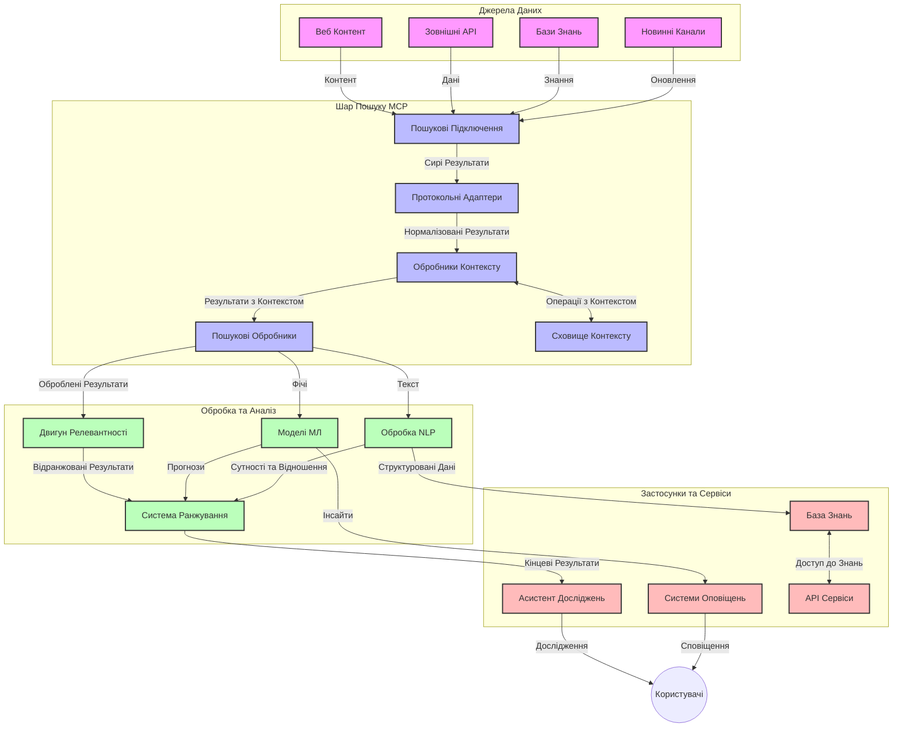
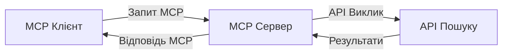
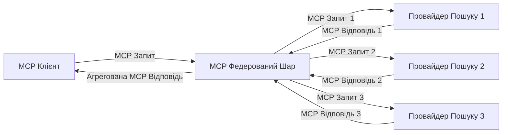
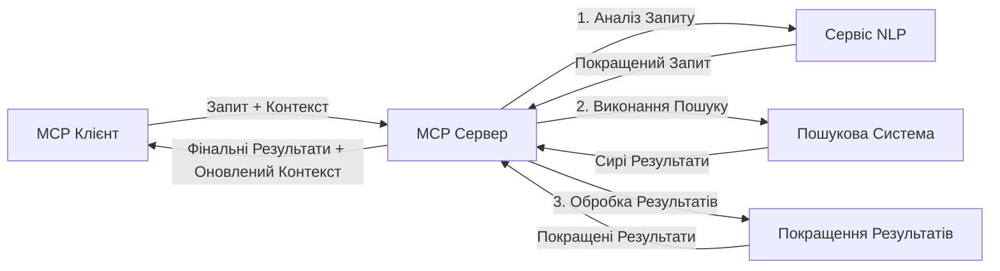

# Протокол Контексту Моделі для Пошуку в Режимі Реального Часу

## Огляд

Пошук у режимі реального часу став необхідним у сучасному інформаційно орієнтованому середовищі, де додатки потребують негайного доступу до актуальної інформації в інтернеті, щоб надавати релевантні та своєчасні відповіді. Протокол Контексту Моделі (MCP) є значним кроком у оптимізації цих процесів пошуку в реальному часі, покращуючи ефективність пошуку, зберігаючи контекстуальну цілісність і підвищуючи загальну продуктивність системи.

Цей модуль досліджує, як MCP трансформує пошук у реальному часі, забезпечуючи стандартизований підхід до управління контекстом між AI-моделями, пошуковими системами та додатками.

### Чого Ви Навчитеся

У цьому всебічному посібнику ви дізнаєтеся:

- Як MCP створює безшовний міст між AI-моделями та можливостями пошуку в реальному часі
- Архітектурні патерни для впровадження ефективних і масштабованих рішень пошуку з MCP
- Техніки збереження контексту пошуку через декілька запитів та взаємодій
- Практичні реалізації коду на Python і JavaScript для різних сценаріїв пошуку
- Методи балансування релевантності, актуальності та продуктивності в системах пошуку на базі MCP

## Вступ до Пошуку в Реальному Часі

Пошук у реальному часі — це технологічний підхід, який дозволяє безперервно виконувати запити, обробку та аналіз інформації з інтернету по мірі її публікації або оновлення, забезпечуючи системам надання свіжої та релевантної інформації з мінімальною затримкою. На відміну від традиційних пошукових систем, які працюють з проіндексованими даними, що можуть бути старими на години або дні, пошук у реальному часі працює з живими даними з вебу, доставляючи інформацію, яка відображає поточний стан онлайн-контенту.

### Основні Концепти Пошуку в Реальному Часі:

- **Безперервна Обробка Запитів**: Запити обробляються проти постійно оновлюваних джерел даних
- **Пріоритет Актуальності**: Системи розроблені для пріоритету свіжої інформації
- **Баланс Релевантності**: Підтримка балансу між релевантністю та актуальністю
- **Масштабована Архітектура**: Системи повинні справлятися з варіабельним обсягом запитів і даних
- **Контекстуальне Розуміння**: Збереження контексту користувача через ітерації пошуку є критично важливим для змістовних результатів
- **Динамічна Переформуляція Запитів**: Адаптивне зміна запитів на основі контексту та попередніх результатів
- **Інтеграція Зі Багатьох Джерел**: Обʼєднання результатів від різних пошукових провайдерів та веб-джерел
- **Семантичне Розуміння**: Обробка запитів і контенту на основі значення, а не лише ключових слів
- **Позиціонування в Реальному Часі**: Постійне регулювання ранжування результатів із надходженням нової інформації

### Протокол Контексту Моделі та Пошук у Реальному Часі

Протокол Контексту Моделі (MCP) вирішує низку ключових проблем у середовищах пошуку в реальному часі:

1. **Збереження Контексту Пошуку**: MCP стандартизує, як контекст зберігається між розподіленими пошуковими компонентами, забезпечуючи AI-моделям і вузлам обробки доступ до історії запитів і вподобань користувача.

2. **Ефективне Керування Запитами**: Надаючи структуровані механізми передачі контексту, MCP зменшує надмірність повторення контексту у кожній ітерації пошуку.

3. **Інтероперабельність**: MCP створює спільну мову для обміну контекстом між різними пошуковими технологіями та AI-моделями, що дозволяє більш гнучку та розширювану архітектуру.

4. **Оптимізований для Пошуку Контекст**: Реалізації MCP можуть пріоретизувати, які елементи контексту найбільш релевантні для ефективного пошуку, оптимізуючи як продуктивність, так і точність.

5. **Адаптивна Обробка Пошуку**: Завдяки правильному управлінню контекстом через MCP пошукові системи можуть динамічно регулювати обробку відповідно до змін потреб користувачів і інформаційного ландшафту.

У сучасних додатках — від агрегаторів новин до помічників досліджень — інтеграція MCP з веб-пошуком дозволяє створювати розумніший, контекстно-залежний пошук, який здатен надавати все більш релевантні результати з розвитком взаємодії користувача.

## Навчальні Цілі

До кінця цього уроку ви зможете:

- Зрозуміти основи пошуку в реальному часі та проблеми, що виникають у сучасних додатках
- Пояснити, як Протокол Контексту Моделі (MCP) покращує можливості пошуку в реальному часі
- Реалізовувати пошукові рішення на основі MCP за допомогою популярних фреймворків і API
- Проєктувати та впроваджувати масштабовані, високопродуктивні архітектури пошуку з MCP
- Застосовувати концепції MCP до різних випадків, включаючи семантичний пошук, допомогу в дослідженнях та AI-підсилене переглядання
- Оцінювати новітні тренди та майбутні інновації в технологіях пошуку на базі MCP
- Розробляти системи пошуку, що враховують контекст і навчаються від взаємодії користувачів
- Інтегрувати можливості веб-пошуку в AI-помічників за допомогою стандартизованих протоколів MCP
- Створювати багатоступеневі пошукові конвеєри, які поступово уточнюють результати на основі контексту
- Оптимізувати продуктивність пошуку, зберігаючи всебічне усвідомлення контексту

### Визначення та Значення

Пошук у реальному часі передбачає безперервне здійснення запитів, отримання та доставку інформації з вебу з мінімальною затримкою. На відміну від традиційних пошукових систем, які періодично обходять та індексують веб, пошук у реальному часі прагне демонструвати інформацію одразу після її появи, забезпечуючи миттєвий доступ до найактуальнішого контенту.

Ключові характеристики пошуку в реальному часі включають:

- **Свіжість**: Пріоритет для нещодавнього контенту та оновлень
- **Безперервна Обробка**: Постійний моніторинг нової інформації
- **Адаптація Запитів**: Уточнення пошукових запитів на основі контексту і зворотного зв’язку
- **Негайна Доставка**: Надання результатів пошуку з мінімальною затримкою
- **Збереження Контексту**: Використання попередніх запитів для підвищення релевантності

### Виклики Традиційного Веб-Пошуку

Традиційні підходи пошуку в Інтернеті мають ряд обмежень у контексті пошуку в реальному часі:

1. **Фрагментація Контексту**: Складнощі зі збереженням контексту пошуку через кілька запитів
2. **Свіжість Інформації**: Проблеми з доступом та пріоритетом найактуальнішої інформації
3. **Складність Інтеграції**: Проблеми сумісності між різними пошуковими системами і додатками
4. **Питання Затримки**: Баланс між повним пошуком і вимогами щодо швидкості відповіді
5. **Налаштування Релевантності**: Забезпечення точності і релевантності при пріоритеті актуальності

## Розуміння Протоколу Контексту Моделі (MCP) для Пошуку

### Що таке MCP у Контексті Пошуку?

Протокол Контексту Моделі (MCP) є стандартизованим протоколом комунікації, створеним для забезпечення ефективної взаємодії між AI-моделями та додатками. У контексті пошуку в реальному часі MCP забезпечує рамки для:

- Збереження контексту пошуку протягом послідовності запитів
- Стандартизації форматів запитів і результатів пошуку
- Оптимізації передачі параметрів пошуку та результатів
- Покращення комунікації між моделлю і пошуковою системою

### Основні Компоненти та Архітектура

Архітектура MCP для пошуку в реальному часі складається з кількох ключових компонентів:

1. **Менеджери Контексту Запитів**: Керують та підтримують контекст пошуку через декілька запитів
2. **Процесори Пошуку**: Обробляють вхідні пошукові запити з використанням методів, що враховують контекст
3. **Адаптери Протоколів**: Перетворюють запити між різними API пошуку, зберігаючи контекст
4. **Сховище Контексту**: Ефективно зберігає і отримує історію пошуку та вподобання
5. **Пошукові Конектори**: Підключаються до різних пошукових систем та веб-API




### Як MCP Покращує Пошук у Реальному Часі

MCP вирішує проблеми традиційного веб-пошуку за допомогою:

- **Контекстуальної Безперервності**: Підтримка зв’язків між запитами протягом всієї сесії пошуку
- **Оптимізованої Передачі**: Зменшення надмірності параметрів пошуку через інтелектуальне управління контекстом
- **Стандартизованих Інтерфейсів**: Забезпечення послідовних API для пошукових компонентів
- **Зменшеної Затримки**: Мінімізація накладних витрат обробки через ефективне керування контекстом
- **Покращеної Релевантності**: Підвищення точності пошуку шляхом збереження наміру користувача протягом кількох запитів

## Інтеграція та Впровадження

Системи пошуку в реальному часі потребують ретельного архітектурного проєктування та реалізації для підтримки як продуктивності, так і цілісності контексту. Протокол Контексту Моделі пропонує стандартизований підхід до інтеграції AI-моделей та пошукових технологій, дозволяючи створювати більш складні, контекстно-залежні пошукові конвеєри.

### Огляд Інтеграції MCP в Архітектуру Пошуку

Впровадження MCP у середовищах пошуку в реальному часі враховує декілька важливих аспектів:

1. **Серіалізація Контексту Пошуку**: MCP забезпечує ефективні механізми кодування контекстної інформації в запитах пошуку, гарантує, що суттєвий контекст проходить разом з запитом через всю обробну ланцюжок. Це включає стандартизовані формати серіалізації, оптимізовані для метаданих, пов’язаних із пошуком.

2. **Станова Обробка Пошуку**: MCP дозволяє більш інтелектуальну обробку з підтримкою стану, зберігаючи послідовне представлення контексту між ітераціями пошуку. Це особливо корисно у багатоступеневих пошукових конвеєрах, де уточнення контексту покращує результати.

3. **Розширення та Уточнення Запитів**: Реалізації MCP можуть сприяти складній розширеній обробці запитів на основі накопиченого контексту, дозволяючи отримувати дедалі релевантніші результати в ході сесії пошуку.

4. **Кешування та Пріоритезація Результатів**: Завдяки стандартизації обробки контексту MCP допомагає керувати кешуванням та пріоритезувати результати, дозволяючи компонентам адаптуватися до змінного пошукового контексту.

5. **Федерація та Агрегація Пошуку**: MCP спрощує більш складну федерацію пошуку між кількома бекендами завдяки структурованому представленню контексту пошуку, що забезпечує більш осмислену агрегацію результатів з різних джерел.

Запровадження MCP у різних пошукових технологіях створює уніфікований підхід до управління контекстом, зменшуючи потребу в спеціальному інтеграційному коді та підвищуючи здатність системи підтримувати змістовний контекст у міру розвитку пошукових запитів.

### MCP у Різних Реалізаціях Веб-Пошуку

Ці приклади відповідають поточній специфікації MCP, що зосереджена на протоколі на базі JSON-RPC з окремими транспортними механізмами. Код демонструє, як ви можете реалізувати власні інтеграції пошуку, зберігаючи повну сумісність з протоколом MCP.


<details>
<summary>Реалізація на Python з Універсальним Пошуковим API</summary>

```python
import asyncio
import json
import aiohttp
from typing import Dict, Any, Optional, List
from contextlib import asynccontextmanager
from collections.abc import AsyncIterator

# Імпортувати стандартні бібліотеки MCP
from mcp.client.session import ClientSession
from mcp.client.streamable_http import streamablehttp_client
from mcp.types import TextContent, CreateMessageRequestParams, CreateMessageResult
from mcp.server.fastmcp import FastMCP

# Створити FastMCP сервер для веб-пошуку
search_server = FastMCP("WebSearch")

# Клас для обробки операцій веб-пошуку
class WebSearchHandler:
    def __init__(self, api_endpoint: str, api_key: str):
        self.api_endpoint = api_endpoint
        self.api_key = api_key
        self.session = None
        
    async def initialize(self):
        """Initialize the HTTP session"""
        self.session = aiohttp.ClientSession(
            headers={"Authorization": f"Bearer {self.api_key}"}
        )
    
    async def close(self):
        """Close the HTTP session"""
        if self.session:
            await self.session.close()
            
    async def perform_search(self, query: str, max_results: int = 5, 
                           include_domains: List[str] = None, 
                           exclude_domains: List[str] = None,
                           time_period: str = "any") -> Dict[str, Any]:
        """Perform web search using the search API"""
        # Побудова параметрів пошуку
        search_params = {
            "q": query,
            "limit": max_results,
            "time": time_period
        }
        
        if include_domains:
            search_params["site"] = ",".join(include_domains)
            
        if exclude_domains:
            search_params["exclude_site"] = ",".join(exclude_domains)
        
        # Виконати запит пошуку
        try:
            async with self.session.get(
                self.api_endpoint,
                params=search_params
            ) as response:
                if response.status != 200:
                    error_text = await response.text()
                    raise Exception(f"Search API error: {response.status} - {error_text}")
                
                search_data = await response.json()
                
                # Трансформувати специфічну для API відповідь у стандартний формат
                results = []
                for item in search_data.get("results", []):
                    results.append({
                        "title": item.get("title", ""),
                        "url": item.get("url", ""),
                        "snippet": item.get("snippet", ""),
                        "date": item.get("published_date", ""),
                        "source": item.get("source", "")
                    })
                
                return {
                    "query": query,
                    "totalResults": len(results),
                    "results": results
                }
        except Exception as e:
            print(f"Search API request error: {e}")
            raise

# Ініціалізувати обробник пошуку
search_handler = WebSearchHandler(
    api_endpoint="https://api.search-service.example/search",
    api_key="your-api-key-here"
)

# Налаштувати lifespan для керування обробником пошуку
@asyncio.asynccontextmanager
async def app_lifespan(server: FastMCP):
    """Manage application lifecycle"""
    await search_handler.initialize()
    try:
        yield {"search_handler": search_handler}
    finally:
        await search_handler.close()

# Встановити lifespan для сервера
search_server = FastMCP("WebSearch", lifespan=app_lifespan)

# Зареєструвати інструмент веб-пошуку
@search_server.tool()
async def web_search(query: str, max_results: int = 5, 
                   include_domains: List[str] = None,
                   exclude_domains: List[str] = None,
                   time_period: str = "any") -> Dict[str, Any]:
    """
    Search the web for information
    
    Args:
        query: The search query
        max_results: Maximum number of results to return (default: 5)
        include_domains: List of domains to include in search results
        exclude_domains: List of domains to exclude from search results
        time_period: Time period for results ("day", "week", "month", "any")
        
    Returns:
        Dictionary containing search results
    """
    ctx = search_server.get_context()
    search_handler = ctx.request_context.lifespan_context["search_handler"]
    
    results = await search_handler.perform_search(
        query=query,
        max_results=max_results,
        include_domains=include_domains,
        exclude_domains=exclude_domains,
        time_period=time_period
    )
    
    return results

# Приклад використання клієнтом
async def client_example():
    # Підключитися до сервера пошуку за допомогою Streamable HTTP transport
    async with streamablehttp_client("http://localhost:8000/mcp") as (read, write, _):
        async with ClientSession(read, write) as session:
            # Ініціалізувати з’єднання
            await session.initialize()
            
            # Викликати інструмент web_search
            search_results = await session.call_tool(
                "web_search", 
                {
                    "query": "latest developments in AI and Model Context Protocol",
                    "max_results": 5,
                    "time_period": "day",
                    "include_domains": ["github.com", "microsoft.com"]
                }
            )
            
            print(f"Search results: {search_results}")

# Приклад виконання сервера
if __name__ == "__main__":
    # Запустити сервер з Streamable HTTP transport
    search_server.run(transport="streamable-http")
```
</details> 

<details>
<summary>Реалізація на JavaScript з Пошуком у Браузері</summary>

```javascript
// Реалізація сервера MCP для веб-пошуку
import { McpServer, ResourceTemplate } from '@modelcontextprotocol/sdk/server/mcp.js';
import { StreamableHTTPServerTransport } from '@modelcontextprotocol/sdk/server/streamableHttp.js';
import { z } from 'zod';

// Створити сервер MCP для веб-пошуку
const searchServer = new McpServer({
    name: "BrowserSearch",
    description: "A server that provides web search capabilities"
});

// Клас сервісу пошуку
class SearchService {
    constructor(searchApiUrl, apiKey) {
        this.searchApiUrl = searchApiUrl;
        this.apiKey = apiKey;
    }

    async performSearch(parameters) {
        const {
            query = '',
            maxResults = 5,
            includeDomains = [],
            excludeDomains = [],
            timePeriod = 'any'
        } = parameters;
        
        // Побудувати URL пошуку з параметрами
        const url = new URL(this.searchApiUrl);
        url.searchParams.append('q', query);
        url.searchParams.append('limit', maxResults);
        url.searchParams.append('time', timePeriod);
        
        if (includeDomains.length > 0) {
            url.searchParams.append('site', includeDomains.join(','));
        }
        
        if (excludeDomains.length > 0) {
            url.searchParams.append('exclude_site', excludeDomains.join(','));
        }
        
        try {
            const response = await fetch(url.toString(), {
                method: 'GET',
                headers: {
                    'Authorization': `Bearer ${this.apiKey}`,
                    'Content-Type': 'application/json'
                }
            });
            
            if (!response.ok) {
                const errorText = await response.text();
                throw new Error(`Search API error: ${response.status} - ${errorText}`);
            }
            
            const searchData = await response.json();
            
            // Перетворити специфічну відповідь API у стандартний формат
            const results = searchData.results?.map(item => ({
                title: item.title || '',
                url: item.url || '',
                snippet: item.snippet || '',
                date: item.published_date || '',
                source: item.source || ''
            })) || [];
            
            return {
                query,
                totalResults: results.length,
                results
            };
        } catch (error) {
            console.error('Search API request error:', error);
            throw error;
        }
    }
}

// Ініціалізувати сервіс пошуку
const searchService = new SearchService(
    'https://api.search-service.example/search',
    'your-api-key-here'
);

// Налаштувати провайдера контексту для сервера
searchServer.setContextProvider(() => {
    return {
        searchService
    };
});

// Зареєструвати інструмент веб-пошуку
searchServer.tool({
    name: 'web_search',
    description: 'Search the web for information',
    parameters: {
        type: 'object',
        properties: {
            query: {
                type: 'string',
                description: 'The search query'
            },
            maxResults: {
                type: 'integer',
                description: 'Maximum number of results to return',
                default: 5
            },
            includeDomains: {
                type: 'array',
                items: { type: 'string' },
                description: 'List of domains to include in search results'
            },
            excludeDomains: {
                type: 'array',
                items: { type: 'string' },
                description: 'List of domains to exclude from search results'
            },
            timePeriod: {
                type: 'string',
                description: 'Time period for results',
                enum: ['day', 'week', 'month', 'any'],
                default: 'any'
            }
        },
        required: ['query']
    },
    handler: async (params, context) => {
        const { searchService } = context;
        return await searchService.performSearch(params);
    }
});

// Приклад коду клієнта для підключення до сервера пошуку
import { Client } from '@modelcontextprotocol/sdk/client/index.js';
import { StreamableHTTPClientTransport } from '@modelcontextprotocol/sdk/client/streamableHttp.js';

async function connectToSearchServer() {
    // Підключитися до сервера пошуку
    const transport = new StreamableHTTPClientTransport(
        new URL('http://localhost:8000/mcp')
    );
    
    const client = new Client({
        name: 'search-client',
        version: '1.0.0'
    });
    
    await client.connect(transport);
    
    // Виконати інструмент пошуку
    const searchResults = await client.callTool({
        name: 'web_search',
        arguments: {
            query: 'Model Context Protocol implementation examples',
            maxResults: 10,
            timePeriod: 'week',
            includeDomains: ['github.com', 'docs.microsoft.com']
        }
    });
    
    console.log('Search results:', searchResults);
    
    // Очистка
    await client.disconnect();
}

// Запустити сервер
const transport = new StreamableHTTPServerTransport();
await searchServer.connect(transport);
console.log('Search server running at http://localhost:8000/mcp');

// У окремому процесі або після запуску сервера
// connectToSearchServer().catch(console.error);
```
</details> 


## Відмова Від Відповідальності щодо Прикладів Коду

> **Важлива Звернення**: Наведені нижче приклади коду демонструють інтеграцію Протоколу Контексту Моделі (MCP) з функціоналом веб-пошуку. Хоча вони слідують паттернам і структурам офіційних MCP SDK, вони спрощені для освітніх цілей.
> 
> Ці приклади демонструють:
> 
> 1. **Реалізація на Python**: Сервер FastMCP, який надає інструмент веб-пошуку і підключається до зовнішнього пошукового API. Цей приклад демонструє правильне керування життєвим циклом, обробку контексту та реалізацію інструменту відповідно до патернів [офіційного MCP Python SDK](https://github.com/modelcontextprotocol/python-sdk). Сервер використовує рекомендований транспорт Streamable HTTP, який замінив застарілий SSE транспорт для продуктивних розгортань.
> 
> 2. **Реалізація на JavaScript**: Реалізація на TypeScript/JavaScript, використовуючи патерн FastMCP з [офіційного MCP TypeScript SDK](https://github.com/modelcontextprotocol/typescript-sdk) для створення пошукового сервера з правильним визначенням інструментів і підключеннями клієнтів. Вона слідує останнім рекомендованим паттернам управління сесіями і збереження контексту.
> 
> Ці приклади вимагатимуть додаткової обробки помилок, автентифікації та специфічного коду інтеграції API для продуктивного використання. Наведені кінцеві точки пошукового API (`https://api.search-service.example/search`) є заповнювачами і повинні бути замінені реальними адресами пошукових сервісів.
> 
> Для повної інформації про реалізацію та найновіших підходів, будь ласка, звертайтеся до [офіційної специфікації MCP](https://spec.modelcontextprotocol.io/) та документації SDK.

## Основні Концепти

### Фреймворк Протоколу Контексту Моделі (MCP)

В основі своєї роботи Протокол Контексту Моделі забезпечує стандартизований спосіб обміну контекстом між AI-моделями, додатками та сервісами. У пошуку в реальному часі цей фреймворк є критично важливим для створення когерентних пошукових досвідів з кількома ітераціями. Ключові компоненти включають:

1. **Клієнт-Серверна Архітектура**: MCP встановлює чітке розмежування між пошуковими клієнтами (запитувачами) та пошуковими серверами (провайдерами), що дає змогу гнучко розгортати системи.

2. **Комунікація через JSON-RPC**: Протокол використовує JSON-RPC для обміну повідомленнями, що робить його сумісним із веб-технологіями і полегшує реалізацію на різних платформах.

3. **Управління Контекстом**: MCP визначає структурувані методи підтримки, оновлення та використання контексту пошуку через багато взаємодій.

4. **Визначення Інструментів**: Пошукові функції представлені як стандартизовані інструменти з чітко визначеними параметрами та значеннями повернення.

5. **Підтримка Потокового Передавання**: Протокол підтримує потокову передачу результатів, що необхідно для пошуку в реальному часі, коли результати можуть надходити поступово.

### Патерни Інтеграції Веб-Пошуку

Під час інтеграції MCP з веб-пошуком виявляються кілька моделей:

#### 1. Пряма Інтеграція з Провайдером Пошуку



У цьому патерні сервер MCP безпосередньо взаємодіє з одним або кількома API пошуку, переводячи MCP-запити у виклики специфічних API та форматуючи результати як відповіді MCP.

#### 2. Федеративний Пошук із Збереженням Контексту



Цей патерн розподіляє пошукові запити по кількох сумісних з MCP провайдерах, кожен з яких може спеціалізуватися на різних типах контенту або можливостях пошуку, при цьому підтримуючи єдиний контекст.

#### 3. Пошуковий Ланцюг із Розширеним Контекстом



У цьому патерні процес пошуку поділено на декілька етапів, причому на кожному кроці контекст доповнюється, що призводить до поступового підвищення релевантності результатів.

### Компоненти Контексту Пошуку

У веб-пошуку на основі MCP контекст зазвичай включає:

- **Історія Запитів**: Попередні пошукові запити у сесії
- **Вподобання Користувача**: Мова, регіон, налаштування безпечного пошуку
- **Історія Взаємодії**: Які результати було відкрито, час, проведений на результатах
- **Параметри Пошуку**: Фільтри, порядок сортування та інші модифікатори пошуку
- **Доменні Знання**: Специфічний контекст, що стосується теми пошуку
- **Темпоральний Контекст**: Фактори релевантності, залежні від часу
- **Вподобання Джерел**: Довірені або пріоритетні інформаційні джерела

## Сценарії Використання та Застосування

### Дослідження та Збір Інформації

MCP покращує робочі процеси досліджень за рахунок:

- Збереження контексту досліджень у межах пошукових сесій
- Забезпечення більш складних і контекстуально релевантних запитів
- Підтримки федерації пошуку з кількох джерел
- Сприяння вилученню знань із результатів пошуку

### Моніторинг Новин та Трендів у Реальному Часі

Пошук на базі MCP має переваги для моніторингу новин:

- Майже миттєве виявлення появ новинних сюжетів
- Контекстуальне фільтрування релевантної інформації
- Відстеження тем і суб’єктів у різних джерелах
- Персоналізовані новинні повідомлення на основі контексту користувача

### AI-Підсилене Переглядання та Дослідження

MCP відкриває нові можливості для AI-підсиленого переглядання:

- Контекстуальні пошукові пропозиції, основані на поточній активності браузера
- Безшовна інтеграція веб-пошуку з помічниками на базі великих мовних моделей
- Багатокрокове уточнення пошуку з підтримкою контексту
- Покращена перевірка фактів і верифікація інформації

## Майбутні Тенденції та Інновації

### Еволюція MCP у Веб-Пошуку

Дивлячись у майбутнє, ми очікуємо, що MCP буде розвиватися для вирішення:
- **Мультимодальний пошук**: інтеграція пошуку тексту, зображень, аудіо та відео з збереженням контексту  
- **Децентралізований пошук**: підтримка розподілених та федеративних екосистем пошуку  
- **Приватність пошуку**: механізми пошуку з урахуванням конфіденційності контексту  
- **Розуміння запитів**: глибокий семантичний аналіз природних мовних пошукових запитів  

### Потенційні технологічні досягнення

Нові технології, що формуватимуть майбутнє пошуку MCP:

1. **Нейронні архітектури пошуку**: пошукові системи на основі вбудувань, оптимізовані для MCP  
2. **Персоналізований контекст пошуку**: навчання індивідуальних моделей пошукових патернів користувача з часом  
3. **Інтеграція графів знань**: контекстуальний пошук, покращений доменно-специфічними графами знань  
4. **Крос-модальний контекст**: підтримка контексту у різних модальностях пошуку  

## Практичні вправи

### Вправа 1: Налаштування базового пошукового конвейєра MCP

У цій вправі ви навчитеся:  
- Налаштовувати базове середовище пошуку MCP  
- Реалізовувати обробники контексту для веб-пошуку  
- Тестувати і валідувати збереження контексту між ітераціями пошуку  

### Вправа 2: Створення дослідницького асистента за допомогою MCP Search

Створіть повноцінний додаток, який:  
- Обробляє природномовні дослідницькі запитання  
- Виконує пошук із врахуванням контексту в мережі  
- Синтезує інформацію з різних джерел  
- Представляє організовані результати дослідження  

### Вправа 3: Реалізація федерації пошуку з кількох джерел за допомогою MCP

Розширена вправа, що охоплює:  
- Контекстно-залежну маршрутизацію запитів до кількох пошукових систем  
- Ранжування та агрегацію результатів  
- Контекстуальне усунення дублікатів пошукових результатів  
- Обробку метаданих, специфічних для джерела  

## Додаткові ресурси

- [Model Context Protocol Specification](https://spec.modelcontextprotocol.io/) - Офіційна специфікація MCP та детальна документація протоколу  
- [Model Context Protocol Documentation](https://modelcontextprotocol.io/) - Детальні навчальні матеріали та керівництва з впровадження  
- [MCP Python SDK](https://github.com/modelcontextprotocol/python-sdk) - Офіційна реалізація протоколу MCP на Python  
- [MCP TypeScript SDK](https://github.com/modelcontextprotocol/typescript-sdk) - Офіційна реалізація протоколу MCP на TypeScript  
- [MCP Reference Servers](https://github.com/modelcontextprotocol/servers) - Зразкові реалізації серверів MCP  
- [Bing Web Search API Documentation](https://learn.microsoft.com/en-us/bing/search-apis/bing-web-search/overview) - API веб-пошуку Microsoft  
- [Google Custom Search JSON API](https://developers.google.com/custom-search/v1/overview) - Програмований пошуковий движок Google  
- [SerpAPI Documentation](https://serpapi.com/search-api) - API сторінки результатів пошуку  
- [Meilisearch Documentation](https://www.meilisearch.com/docs) - Відкритий пошуковий движок  
- [Elasticsearch Documentation](https://www.elastic.co/guide/index.html) - Розподілений движок пошуку та аналітики  
- [LangChain Documentation](https://python.langchain.com/docs/get_started/introduction) - Створення додатків з LLM  

## Очікувані результати навчання

Після завершення цього модуля ви зможете:

- Розуміти основи веб-пошуку в режимі реального часу та його виклики  
- Пояснювати, як Model Context Protocol (MCP) покращує можливості веб-пошуку в режимі реального часу  
- Реалізовувати пошукові рішення на базі MCP, використовуючи популярні фреймворки та API  
- Проектувати та впроваджувати масштабовані, високопродуктивні архітектури пошуку з MCP  
- Застосовувати концепції MCP у різних сценаріях, включно з семантичним пошуком, допомогою в дослідженнях і AI-посиленим переглядом  
- Оцінювати новітні тенденції та майбутні інновації в технологіях пошуку на основі MCP  

### Розгляди безпеки та довіри

При впровадженні пошукових рішень, базованих на MCP для веб-пошуку, пам’ятайте про ці важливі принципи з специфікації MCP:

1. **Згода та контроль користувача**: користувачі повинні явно погоджуватися та розуміти всі операції та доступ до даних. Особливо це актуально для веб-пошуку з можливістю доступу до зовнішніх джерел даних.

2. **Конфіденційність даних**: забезпечуйте відповідне поводження з пошуковими запитами та результатами, особливо якщо вони можуть містити чутливу інформацію. Реалізуйте належний контроль доступу для захисту даних користувача.

3. **Безпека інструментів**: реалізуйте правильну авторизацію і валідацію пошукових інструментів, оскільки вони можуть становити потенційну загрозу безпеці через виконання довільного коду. Описи поведінки інструментів слід вважати недовіреними, якщо вони не отримані з довіреного сервера.

4. **Чітка документація**: забезпечте ясну документацію щодо можливостей, обмежень і питань безпеки вашої реалізації пошуку на основі MCP відповідно до рекомендацій MCP.

5. **Стійкі механізми згоди**: створюйте надійні механізми отримання згоди та авторизації, які чітко пояснюють функції кожного інструменту перед наданням дозволу на його використання, особливо для інструментів, що взаємодіють із зовнішніми веб-ресурсами.

Для повної інформації щодо безпеки та аспектів довіри MCP звертайтесь до [офіційної документації](https://modelcontextprotocol.io/specification/2025-11-25/basic/security_best_practices).

## Що далі

- [5.12 Аутентифікація Entra ID для серверів Model Context Protocol](../mcp-security-entra/README.md)

---

<!-- CO-OP TRANSLATOR DISCLAIMER START -->
**Відмова від відповідальності**:
Цей документ було перекладено за допомогою сервісу штучного інтелекту для перекладу [Co-op Translator](https://github.com/Azure/co-op-translator). Хоча ми прагнемо до точності, будь ласка, майте на увазі, що автоматичні переклади можуть містити помилки або неточності. Оригінальний документ рідною мовою слід вважати авторитетним джерелом. Для критично важливої інформації рекомендується професійний людський переклад. Ми не несемо відповідальності за будь-які непорозуміння або неправильні тлумачення, що виникли внаслідок використання цього перекладу.
<!-- CO-OP TRANSLATOR DISCLAIMER END -->