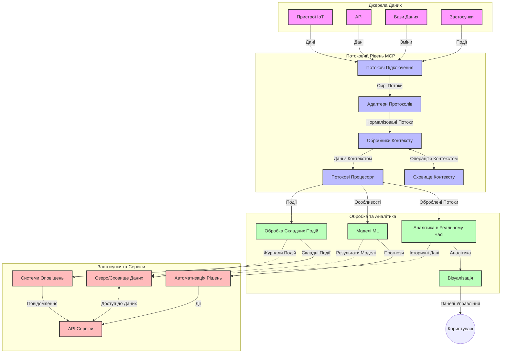

# Протокол Контексту Моделі для Потокової Обробки Даних у Реальному Часі

## Огляд

Потокова обробка даних у реальному часі стала надзвичайно важливою у сучасному світі, керованому даними, де бізнеси та додатки потребують миттєвого доступу до інформації для прийняття своєчасних рішень. Протокол Контексту Моделі (MCP) являє собою значний прорив у оптимізації цих процесів потокової обробки, підвищуючи ефективність обробки даних, підтримуючи цілісність контексту та покращуючи загальну продуктивність систем.

Цей модуль досліджує, як MCP трансформує потокову обробку даних у реальному часі, забезпечуючи стандартизований підхід до управління контекстом між AI-моделями, потоковими платформами та додатками.

## Вступ до Потокової Обробки Даних у Реальному Часі

Потокова обробка даних у реальному часі — це технологічна парадигма, що дозволяє безперервну передачу, обробку та аналіз даних у міру їх генерації, даючи змогу системам негайно реагувати на нову інформацію. На відміну від традиційної пакетної обробки, що працює з фіксованими наборами даних, потокова обробка працює з даними «на льоту», доставляючи інсайти та дії з мінімальною затримкою.

### Основні концепції потокової обробки даних у реальному часі:

- **Безперервний потік даних**: Дані обробляються як безперервний, нескінченний потік подій або записів.
- **Обробка з низькою затримкою**: Системи створені для мінімізації часу між генерацією та обробкою даних.
- **Масштабованість**: Архітектура потоків повинна справлятися з варіативними обсягами та швидкостями даних.
- **Відмовостійкість**: Системи повинні бути стійкими до збоїв, щоб забезпечити безперервний потік даних.
- **Станова обробка**: Збереження контексту між подіями є критично важливим для змістовного аналізу.

### Протокол Контексту Моделі та Потокова Обробка у Реальному Часі

Протокол Контексту Моделі (MCP) вирішує кілька ключових проблем в середовищах потокової обробки у реальному часі:

1. **Контекстуальна безперервність**: MCP стандартизує підтримку контексту між розподіленими компонентами потоків, забезпечуючи AI-моделі та вузли обробки доступом до релевантного історичного та навколишнього контексту.

2. **Ефективне управління станом**: Завдяки структурованим механізмам передачі контексту, MCP зменшує накладні витрати на управління станом у потокових конвеєрах.

3. **Інтероперабельність**: MCP створює спільну мову для обміну контекстом між різноманітними потоковими технологіями та AI-моделями, що дозволяє більш гнучкі та розширювані архітектури.

4. **Оптимізований для потоків контекст**: Реалізації MCP можуть пріоритезувати найбільш релевантні елементи контексту для прийняття рішень у реальному часі, оптимізуючи як продуктивність, так і точність.

5. **Адаптивна обробка**: Завдяки правильному управлінню контекстом через MCP, потокові системи можуть динамічно налаштовувати обробку залежно від змінних умов і закономірностей у даних.

У сучасних застосунках — від IoT-мереж сенсорів до фінансових торгових платформ — інтеграція MCP зі стрімінговими технологіями забезпечує більш інтелектуальну, контекстно-залежну обробку, здатну адекватно реагувати на складні, що розвиваються ситуації у реальному часі.

## Навчальні Цілі

Після завершення цього уроку ви зможете:

- Розуміти основи потокової обробки даних у реальному часі та її виклики
- Пояснити, як Протокол Контексту Моделі (MCP) покращує потокову обробку даних у реальному часі
- Впроваджувати рішення потокової обробки на базі MCP із використанням популярних фреймворків, таких як Kafka та Pulsar
- Проєктувати та розгортати відмовостійкі, високопродуктивні потокові архітектури з MCP
- Застосовувати концепції MCP до IoT, фінансової торгівлі та аналітики, керованої AI
- Оцінювати нові тенденції та майбутні інновації в технологіях потокової обробки на базі MCP

### Визначення та Значення

Потокова обробка даних у реальному часі передбачає безперервну генерацію, обробку та доставку даних з мінімальною затримкою. На відміну від пакетної обробки, де дані збираються та обробляються групами, потокові дані обробляються поступово у міру надходження, забезпечуючи негайні інсайти та дії.

Ключові характеристики потокової обробки даних у реальному часі включають:

- **Низька затримка**: Обробка та аналіз даних у межах мілісекунд або секунд
- **Безперервний потік**: Неперервні потоки даних з різних джерел
- **Миттєва обробка**: Аналіз даних у міру їх надходження, а не пакетами
- **Архітектура, орієнтована на події**: Реагування на події у момент їх виникнення

### Виклики в Традиційній Потоковій Обробці

Традиційні підходи до потокової обробки мають кілька обмежень:

1. **Втрата контексту**: Важко підтримувати контекст у розподілених системах
2. **Проблеми масштабованості**: Виклики з масштабуванням для обробки великих обсягів та швидкостей даних
3. **Складність інтеграції**: Проблеми з інтероперабельністю між різними системами
4. **Управління затримками**: Балансування пропускної здатності та часу обробки
5. **Консистентність даних**: Забезпечення точності та повноти даних в потоці

## Розуміння Протоколу Контексту Моделі (MCP)

### Що таке MCP?

Протокол Контексту Моделі (MCP) — це стандартизований протокол комунікації, створений для полегшення ефективної взаємодії між AI-моделями та додатками. У контексті потокової обробки даних у реальному часі MCP надає фреймворк для:

- Збереження контексту на всьому протязі конвеєра даних
- Стандартизації форматів обміну даними
- Оптимізації передачі великих наборів даних
- Покращення комунікації між моделями та між моделями й додатками

### Основні компоненти та архітектура

Архітектура MCP для потокової обробки в реальному часі складається з кількох ключових компонентів:

1. **Обробники контексту**: Керують та підтримують контекстну інформацію у конвеєрі потоків
2. **Обробники потоків**: Обробляють вхідні потоки даних із використанням методів, що враховують контекст
3. **Протокольні адаптери**: Перетворюють різні стрімінгові протоколи, зберігаючи контекст
4. **Сховище контексту**: Ефективно зберігає та отримує контекстну інформацію
5. **Потокові конектори**: Підключення до різних потокових платформ (Kafka, Pulsar, Kinesis тощо)



### Як MCP покращує обробку даних у реальному часі

MCP вирішує традиційні виклики потокової обробки шляхом:

- **Цілісності контексту**: Підтримка зв’язків між точками даних через увесь конвеєр
- **Оптимізованої передачі**: Зменшення надмірності в обміні даними через інтелектуальне управління контекстом
- **Стандартизованих інтерфейсів**: Забезпечення послідовних API для компонентів стрімінгу
- **Зниження затримок**: Мінімізація накладних витрат обробки через ефективне керування контекстом
- **Покращеної масштабованості**: Підтримка горизонтального масштабування при збереженні контексту

## Інтеграція та Впровадження

Системи потокової обробки даних у реальному часі потребують ретельного архітектурного проєктування та впровадження, щоб забезпечити і продуктивність, і цілісність контексту. Протокол Контексту Моделі пропонує стандартизований підхід до інтеграції AI-моделей і потокових технологій, дозволяючи створювати більш складні, контекстно-залежні конвеєри обробки.

### Огляд інтеграції MCP у потокову архітектуру

Впровадження MCP у середовищах потокової обробки у реальному часі вимагає врахування кількох ключових аспектів:

1. **Серіалізація контексту та транспорт**: MCP забезпечує ефективні механізми кодування контекстної інформації у поточні пакети даних, гарантуючи, що необхідний контекст супроводжує дані на всьому шляху обробки. Сюди входять стандартизовані формати серіалізації, оптимізовані для транспортування потоку.

2. **Станова обробка потоків**: MCP дозволяє здійснювати більш інтелектуальну обробку зі станом, підтримуючи послідовне представлення контексту на вузлах обробки. Це особливо цінно у розподілених потокових архітектурах, де управління станом зазвичай є складним.

3. **Час події проти часу обробки**: Реалізації MCP у потокових системах повинні враховувати поширену проблему розмежування часу виникнення подій та часу їх обробки. Протокол може включати часовий контекст, що зберігає семантику часу події.

4. **Управління обмеженням потоку (backpressure)**: Завдяки стандартизації обробки контексту MCP допомагає управляти обмеженням потоку у системах, дозволяючи компонентам повідомляти про свій процесинговий потенціал та відповідно регулювати потік даних.

5. **Віконні операції та агрегація контексту**: MCP сприяє більш складним операціям з вікнами, надаючи структуроване представлення часових і відносних контекстів, що дозволяє здійснювати змістовні агрегації через потоки подій.

6. **Обробка саме один раз (exactly-once)**: У потокових системах, які вимагають семантики обробки «саме один раз», MCP може включати метадані обробки для відстежування та перевірки статусу обробки у розподілених компонентах.

Впровадження MCP у різних потокових технологіях створює уніфікований підхід до управління контекстом, знижуючи необхідність у кастомному інтеграційному коді та підвищуючи здатність системи підтримувати релевантний контекст у процесі проходження даних конвеєром.

### MCP у різних Фреймворках Потокової Обробки Даних

Ці приклади відповідають нинішній специфікації MCP, яка базується на протоколі JSON-RPC з окремими транспортними механізмами. Код демонструє, як можна реалізувати користувацькі транспорти, що інтегрують стрімінгові платформи, як Kafka та Pulsar, з повною сумісністю з протоколом MCP.

Приклади призначені для показу, як стрімінгові платформи можуть бути інтегровані з MCP для забезпечення обробки даних у реальному часі зі збереженням контекстної обізнаності, що є центральною у MCP. Такий підхід гарантує, що кодові зразки точно відображають поточний стан специфікації MCP станом на червень 2025 року.

MCP можна інтегрувати з популярними стрімінговими фреймворками, зокрема:

#### Інтеграція Apache Kafka

```python
import asyncio
import json
from typing import Dict, Any, Optional
from confluent_kafka import Consumer, Producer, KafkaError
from mcp.client import Client, ClientCapabilities
from mcp.core.message import JsonRpcMessage
from mcp.core.transports import Transport

# Користувацький клас транспорту для з’єднання MCP з Kafka
class KafkaMCPTransport(Transport):
    def __init__(self, bootstrap_servers: str, input_topic: str, output_topic: str):
        self.bootstrap_servers = bootstrap_servers
        self.input_topic = input_topic
        self.output_topic = output_topic
        self.producer = Producer({'bootstrap.servers': bootstrap_servers})
        self.consumer = Consumer({
            'bootstrap.servers': bootstrap_servers,
            'group.id': 'mcp-client-group',
            'auto.offset.reset': 'earliest'
        })
        self.message_queue = asyncio.Queue()
        self.running = False
        self.consumer_task = None
        
    async def connect(self):
        """Connect to Kafka and start consuming messages"""
        self.consumer.subscribe([self.input_topic])
        self.running = True
        self.consumer_task = asyncio.create_task(self._consume_messages())
        return self
        
    async def _consume_messages(self):
        """Background task to consume messages from Kafka and queue them for processing"""
        while self.running:
            try:
                msg = self.consumer.poll(1.0)
                if msg is None:
                    await asyncio.sleep(0.1)
                    continue
                
                if msg.error():
                    if msg.error().code() == KafkaError._PARTITION_EOF:
                        continue
                    print(f"Consumer error: {msg.error()}")
                    continue
                
                # Аналізувати значення повідомлення як JSON-RPC
                try:
                    message_str = msg.value().decode('utf-8')
                    message_data = json.loads(message_str)
                    mcp_message = JsonRpcMessage.from_dict(message_data)
                    await self.message_queue.put(mcp_message)
                except Exception as e:
                    print(f"Error parsing message: {e}")
            except Exception as e:
                print(f"Error in consumer loop: {e}")
                await asyncio.sleep(1)
    
    async def read(self) -> Optional[JsonRpcMessage]:
        """Read the next message from the queue"""
        try:
            message = await self.message_queue.get()
            return message
        except Exception as e:
            print(f"Error reading message: {e}")
            return None
    
    async def write(self, message: JsonRpcMessage) -> None:
        """Write a message to the Kafka output topic"""
        try:
            message_json = json.dumps(message.to_dict())
            self.producer.produce(
                self.output_topic,
                message_json.encode('utf-8'),
                callback=self._delivery_report
            )
            self.producer.poll(0)  # Викликати зворотні виклики
        except Exception as e:
            print(f"Error writing message: {e}")
    
    def _delivery_report(self, err, msg):
        """Kafka producer delivery callback"""
        if err is not None:
            print(f'Message delivery failed: {err}')
        else:
            print(f'Message delivered to {msg.topic()} [{msg.partition()}]')
    
    async def close(self) -> None:
        """Close the transport"""
        self.running = False
        if self.consumer_task:
            self.consumer_task.cancel()
            try:
                await self.consumer_task
            except asyncio.CancelledError:
                pass
        self.consumer.close()
        self.producer.flush()

# Приклад використання транспорту Kafka MCP
async def kafka_mcp_example():
    # Створити клієнта MCP з транспортом Kafka
    client = Client(
        {"name": "kafka-mcp-client", "version": "1.0.0"},
        ClientCapabilities({})
    )
    
    # Створити та підключити транспорт Kafka
    transport = KafkaMCPTransport(
        bootstrap_servers="localhost:9092",
        input_topic="mcp-responses",
        output_topic="mcp-requests"
    )
    
    await client.connect(transport)
    
    try:
        # Ініціалізувати сесію MCP
        await client.initialize()
        
        # Приклад виконання інструменту через MCP
        response = await client.execute_tool(
            "process_data",
            {
                "data": "sample data",
                "metadata": {
                    "source": "sensor-1",
                    "timestamp": "2025-06-12T10:30:00Z"
                }
            }
        )
        
        print(f"Tool execution response: {response}")
        
        # Чисте завершення роботи
        await client.shutdown()
    finally:
        await transport.close()

# Запустити приклад
if __name__ == "__main__":
    asyncio.run(kafka_mcp_example())
```

#### Реалізація Apache Pulsar

```python
import asyncio
import json
import pulsar
from typing import Dict, Any, Optional
from mcp.core.message import JsonRpcMessage
from mcp.core.transports import Transport
from mcp.server import Server, ServerOptions
from mcp.server.tools import Tool, ToolExecutionContext, ToolMetadata

# Створити власний MCP транспорт, який використовує Pulsar
class PulsarMCPTransport(Transport):
    def __init__(self, service_url: str, request_topic: str, response_topic: str):
        self.service_url = service_url
        self.request_topic = request_topic
        self.response_topic = response_topic
        self.client = pulsar.Client(service_url)
        self.producer = self.client.create_producer(response_topic)
        self.consumer = self.client.subscribe(
            request_topic,
            "mcp-server-subscription",
            consumer_type=pulsar.ConsumerType.Shared
        )
        self.message_queue = asyncio.Queue()
        self.running = False
        self.consumer_task = None
    
    async def connect(self):
        """Connect to Pulsar and start consuming messages"""
        self.running = True
        self.consumer_task = asyncio.create_task(self._consume_messages())
        return self
    
    async def _consume_messages(self):
        """Background task to consume messages from Pulsar and queue them for processing"""
        while self.running:
            try:
                # Неблокуюче отримання з таймаутом
                msg = self.consumer.receive(timeout_millis=500)
                
                # Обробити повідомлення
                try:
                    message_str = msg.data().decode('utf-8')
                    message_data = json.loads(message_str)
                    mcp_message = JsonRpcMessage.from_dict(message_data)
                    await self.message_queue.put(mcp_message)
                    
                    # Підтвердити отримання повідомлення
                    self.consumer.acknowledge(msg)
                except Exception as e:
                    print(f"Error processing message: {e}")
                    # Відхилити підтвердження у разі помилки
                    self.consumer.negative_acknowledge(msg)
            except Exception as e:
                # Обробити таймаут або інші виключення
                await asyncio.sleep(0.1)
    
    async def read(self) -> Optional[JsonRpcMessage]:
        """Read the next message from the queue"""
        try:
            message = await self.message_queue.get()
            return message
        except Exception as e:
            print(f"Error reading message: {e}")
            return None
    
    async def write(self, message: JsonRpcMessage) -> None:
        """Write a message to the Pulsar output topic"""
        try:
            message_json = json.dumps(message.to_dict())
            self.producer.send(message_json.encode('utf-8'))
        except Exception as e:
            print(f"Error writing message: {e}")
    
    async def close(self) -> None:
        """Close the transport"""
        self.running = False
        if self.consumer_task:
            self.consumer_task.cancel()
            try:
                await self.consumer_task
            except asyncio.CancelledError:
                pass
        self.consumer.close()
        self.producer.close()
        self.client.close()

# Визначити приклад MCP інструменту для обробки потокових даних
@Tool(
    name="process_streaming_data",
    description="Process streaming data with context preservation",
    metadata=ToolMetadata(
        required_capabilities=["streaming"]
    )
)
async def process_streaming_data(
    ctx: ToolExecutionContext,
    data: str,
    source: str,
    priority: str = "medium"
) -> Dict[str, Any]:
    """
    Process streaming data while preserving context
    
    Args:
        ctx: Tool execution context
        data: The data to process
        source: The source of the data
        priority: Priority level (low, medium, high)
        
    Returns:
        Dict containing processed results and context information
    """
    # Приклад обробки з використанням контексту MCP
    print(f"Processing data from {source} with priority {priority}")
    
    # Отримати доступ до контексту розмови з MCP
    conversation_id = ctx.conversation_id if hasattr(ctx, 'conversation_id') else "unknown"
    
    # Повернути результати з розширеним контекстом
    return {
        "processed_data": f"Processed: {data}",
        "context": {
            "conversation_id": conversation_id,
            "source": source,
            "priority": priority,
            "processing_timestamp": ctx.get_current_time_iso()
        }
    }

# Приклад реалізації MCP сервера з використанням Pulsar транспорту
async def run_mcp_server_with_pulsar():
    # Створити MCP сервер
    server = Server(
        {"name": "pulsar-mcp-server", "version": "1.0.0"},
        ServerOptions(
            capabilities={"streaming": True}
        )
    )
    
    # Зареєструвати наш інструмент
    server.register_tool(process_streaming_data)
    
    # Створити та підключити Pulsar транспорт
    transport = PulsarMCPTransport(
        service_url="pulsar://localhost:6650",
        request_topic="mcp-requests",
        response_topic="mcp-responses"
    )
    
    try:
        # Запустити сервер з Pulsar транспортом
        await server.run(transport)
    finally:
        await transport.close()

# Запустити сервер
if __name__ == "__main__":
    asyncio.run(run_mcp_server_with_pulsar())
```

### Кращі Практики Розгортання

При впровадженні MCP для потокової обробки:

1. **Проєктуйте відмовостійкість**:
   - Впроваджуйте належну обробку помилок
   - Використовуйте черги «dead-letter» для невдалих повідомлень
   - Проєктуйте процесори з ідемпотентністю

2. **Оптимізуйте продуктивність**:
   - Налаштовуйте відповідні розміри буферів
   - Використовуйте пакетну обробку, де доцільно
   - Впроваджуйте механізми backpressure

3. **Моніторинг і спостереження**:
   - Відстежуйте метрики обробки потоків
   - Моніторте розповсюдження контексту
   - Налаштуйте сповіщення про аномалії

4. **Забезпечте безпеку потоків**:
   - Впровадьте шифрування для конфіденційних даних
   - Використовуйте автентифікацію та авторизацію
   - Застосовуйте належний контроль доступу


### MCP у IoT та Обчисленнях на Крайових Пристроях

MCP покращує потокову обробку IoT даних шляхом:

- Збереження контексту пристроїв у конвеєрі обробки
- Забезпечення ефективної потокової передачі від краю до хмари
- Підтримки аналітики в реальному часі за IoT-потоками
- Сприяння комунікації пристрій-пристрій з урахуванням контексту

Приклад: Мережі сенсорів у розумних містах  
```
Sensors → Edge Gateways → MCP Stream Processors → Real-time Analytics → Automated Responses
```

### Роль у Фінансових Транзакціях та Високочастотній Торгівлі

MCP забезпечує значні переваги для фінансової потокової обробки:

- Обробка з ультранизькою затримкою для торгових рішень
- Підтримка контексту транзакцій усього процесингу
- Підтримка складної обробки подій з контекстною обізнаністю
- Забезпечення консистентності даних у розподілених торгових системах

### Покращення Аналітики на Основі AI

MCP відкриває нові можливості для аналітики потоків:

- Навчання та інференс моделей у реальному часі
- Безперервне навчання з потокових даних
- Контекстно-залежне вилучення ознак
- Конвеєри інференсу з кількома моделями збереженим контекстом

## Майбутні Тенденції та Інновації

### Еволюція MCP у Реальному Часі

У майбутньому ми очікуємо розвиток MCP у напрямках:

- **Інтеграція квантових обчислень**: Підготовка до квантово-базованих стрімінгових систем
- **Обробка, орієнтована на край**: Переміщення більшої частини контекстно-чутливої обробки на крайові пристрої
- **Автономне управління потоками**: Самооптимізовані потокові конвеєри
- **Федеративний стрімінг**: Розподілена обробка з гарантією приватності

### Потенційні Технологічні Досягнення

Нові технології, що формуватимуть майбутнє MCP-потоків:

1. **AI-оптимізовані потокові протоколи**: Користувацькі протоколи спеціально для AI-навантажень
2. **Інтеграція нейроморфних обчислень**: Комп’ютинг, натхненний мозком, для обробки потоків
3. **Безсерверний стрімінг**: Подієво-орієнтований, масштабований стрімінг без управління інфраструктурою
4. **Розподілені сховища контексту**: Глобально розподілене, але високозконсистентне управління контекстом

## Практичні Вправи

### Вправа 1: Налаштування Базового MCP Потокового Конвеєра

У цій вправі ви навчитеся:
- Конфігурувати базове MCP потокове середовище
- Впроваджувати обробники контексту для обробки потоків
- Тестувати та перевіряти збереження контексту

### Вправа 2: Побудова Панелі Оперативної Аналітики

Створіть повний додаток, що:
- Приймає потокові дані з MCP
- Обробляє потік із збереженням контексту
- Візуалізує результати у реальному часі

### Вправа 3: Впровадження Складної Обробки Подій з MCP

Просунута вправа, що охоплює:
- Виявлення шаблонів у потоках
- Контекстну кореляцію між кількома потоками
- Генерацію складних подій із збереженим контекстом

## Додаткові Ресурси

- [Model Context Protocol Specification](https://modelcontextprotocol.io) - Офіційна специфікація та документація MCP
- [Apache Kafka Documentation](https://kafka.apache.org/documentation/) - Дізнайтеся про Kafka для потокової обробки
- [Apache Pulsar](https://pulsar.apache.org/) - Уніфікована платформа меседжингу та стрімінгу
- [Streaming Systems: The What, Where, When, and How of Large-Scale Data Processing](https://www.oreilly.com/library/view/streaming-systems/9781491983867/) - Комплексна книга про архітектури потоків
- [Microsoft Azure Event Hubs](https://learn.microsoft.com/azure/event-hubs/event-hubs-about) - Керована служба потокової обробки подій
- [MLflow Documentation](https://mlflow.org/docs/latest/index.html) - Для відстеження та розгортання ML-моделей
- [Real-Time Analytics with Apache Storm](https://storm.apache.org/releases/current/index.html) - Фреймворк для потокового обчислення у реальному часі
- [Flink ML](https://nightlies.apache.org/flink/flink-ml-docs-master/) - Бібліотека машинного навчання для Apache Flink
- [LangChain Documentation](https://python.langchain.com/docs/get_started/introduction) - Створення додатків з LLM

## Результати Навчання

Пройшовши цей модуль, ви зможете:

- Розуміти основи потокової обробки даних у реальному часі та її виклики
- Пояснити, як Протокол Контексту Моделі (MCP) покращує потокову обробку даних у реальному часі
- Впроваджувати MCP-базовані стрімінгові рішення з популярними фреймворками, такими як Kafka та Pulsar
- Проєктувати та розгортати відмовостійкі, високопродуктивні архітектури потоків з MCP
- Застосовувати концепції MCP до IoT, фінансової торгівлі та аналітики на основі AI
- Оцінювати нові тенденції та майбутні інновації у технологіях MCP-базованої потокової обробки

## Що далі

- [5.11 Realtime Search](../mcp-realtimesearch/README.md)

---

<!-- CO-OP TRANSLATOR DISCLAIMER START -->
**Відмова від відповідальності**:
Цей документ було перекладено за допомогою сервісу штучного інтелекту для перекладу [Co-op Translator](https://github.com/Azure/co-op-translator). Хоча ми прагнемо до точності, будь ласка, майте на увазі, що автоматичні переклади можуть містити помилки або неточності. Оригінальний документ рідною мовою слід вважати авторитетним джерелом. Для критично важливої інформації рекомендується професійний людський переклад. Ми не несемо відповідальності за будь-які непорозуміння або неправильні тлумачення, що виникли внаслідок використання цього перекладу.
<!-- CO-OP TRANSLATOR DISCLAIMER END -->