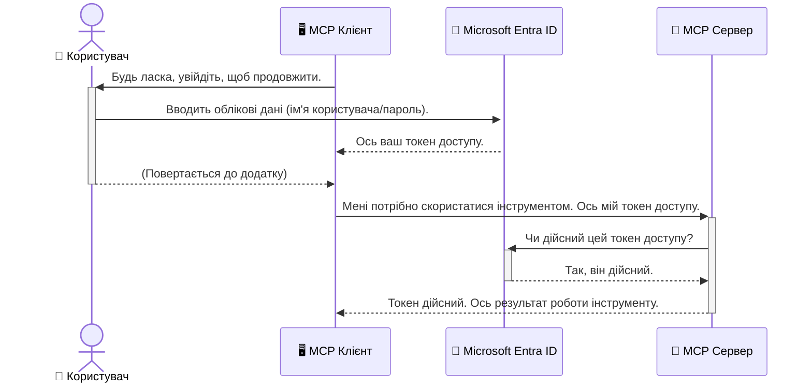

# Захист AI робочих процесів: автентифікація Entra ID для серверів Model Context Protocol

## Вступ
Захист сервера Model Context Protocol (MCP) так само важливий, як зачинити двері вашого будинку. Якщо залишити сервер MCP відкритим, ваші інструменти та дані можуть потрапити до неавторизованого доступу, що може призвести до порушень безпеки. Microsoft Entra ID надає надійне хмарне рішення для управління ідентичністю та доступом, яке допомагає гарантувати, що лише авторизовані користувачі та додатки можуть взаємодіяти із вашим MCP сервером. У цьому розділі ви навчитеся захищати свої AI робочі процеси за допомогою автентифікації Entra ID.

## Навчальні цілі
Після завершення цього розділу ви зможете:

- Розуміти важливість захисту серверів MCP.
- Пояснювати основи Microsoft Entra ID та автентифікації OAuth 2.0.
- Визначати різницю між публічними та конфіденційними клієнтами.
- Реалізувати автентифікацію Entra ID у локальних (публічний клієнт) та віддалених (конфіденційний клієнт) сценаріях MCP серверів.
- Застосовувати найкращі практики безпеки при розробці AI робочих процесів.

## Безпека і MCP

Якщо ви не залишите двері вашого будинку незачиненими, то й не варто залишати ваш MCP сервер відкритим для будь-кого. Захист AI робочих процесів є ключовим для створення надійних, довірених і безпечних додатків. У цьому розділі ви ознайомитеся з використанням Microsoft Entra ID для захисту MCP серверів, забезпечуючи, що лише авторизовані користувачі та додатки можуть взаємодіяти з вашими інструментами та даними.

## Чому безпека важлива для MCP серверів

Уявіть, що ваш MCP сервер має інструмент для надсилання електронної пошти або доступу до бази даних клієнтів. Незахищений сервер означає, що будь-хто потенційно може використовувати цей інструмент, що призведе до несанкціонованого доступу до даних, спаму або інших шкідливих дій.

Впроваджуючи автентифікацію, ви гарантуєте, що кожен запит до вашого сервера перевіряється, підтверджуючи особу користувача або додатка, що робить запит. Це перший і найважливіший крок для захисту ваших AI робочих процесів.

## Вступ до Microsoft Entra ID

[**Microsoft Entra ID**](https://adoption.microsoft.com/microsoft-security/entra/) — це хмарний сервіс для управління ідентичністю та доступом. Уявіть його як універсального охоронця безпеки для ваших додатків. Він обробляє складний процес перевірки ідентичності користувачів (автентифікація) і визначає, що вони можуть робити (авторизація).

Використовуючи Entra ID, ви можете:

- Забезпечити безпечний вхід для користувачів.
- Захищати API та сервіси.
- Керувати політиками доступу з одного централізованого місця.

Для MCP серверів Entra ID надає надійне та широко визнане рішення для управління тим, хто може отримувати доступ до можливостей вашого сервера.

---

## Розуміння магії: як працює автентифікація Entra ID

Entra ID використовує відкриті стандарти, такі як **OAuth 2.0**, для обробки автентифікації. Хоча деталі можуть бути складними, основна ідея проста і може бути зрозуміла через аналогію.

### Легкий вступ до OAuth 2.0: ключ від парковки

Уявіть OAuth 2.0 як сервіс парковки для вашого автомобіля. Коли ви приходите до ресторану, ви не даєте парковнику ваш головний ключ. Натомість ви надаєте **ключ від парковки**, який має обмежені повноваження — він може запустити автомобіль і зачинити двері, але не може відкрити багажник або бардачок.

В цій аналогії:

- **Ви** — це **Користувач**.
- **Ваш автомобіль** — це **MCP сервер** з цінними інструментами та даними.
- **Парковник** — це **Microsoft Entra ID**.
- **Охоронець паркування** — це **MCP клієнт** (додаток, який намагається отримати доступ до сервера).
- **Ключ від парковки** — це **Токен доступу**.

Токен доступу — це захищений рядок тексту, який MCP клієнт отримує від Entra ID після вашого входу. Клієнт потім подає цей токен MCP серверу з кожним запитом. Сервер може перевірити токен, щоб упевнитися, що запит є легітимним і клієнт має необхідні дозволи, усе це без необхідності обробляти ваші реальні облікові дані (наприклад, пароль).

### Потік автентифікації

Ось як цей процес працює на практиці:



### Знайомство з Microsoft Authentication Library (MSAL)

Перш ніж перейти до коду, важливо представити ключовий компонент, який ви побачите в прикладах: **Microsoft Authentication Library (MSAL)**.

MSAL — це бібліотека, розроблена Microsoft, яка значно полегшує роботу розробників з автентифікацією. Замість того, щоб писати весь складний код для обробки токенів безпеки, керування входами та оновлення сесій, MSAL бере на себе всю складну роботу.

Використання бібліотеки типу MSAL дуже рекомендовано, тому що:

- **Вона безпечна:** реалізує галузеві стандарти та найкращі практики безпеки, зменшуючи ризик вразливостей у вашому коді.
- **Спрощує розробку:** абстрагує складність протоколів OAuth 2.0 та OpenID Connect, дозволяючи додати надійну автентифікацію у ваш додаток кількома рядками коду.
- **Підтримується:** Microsoft активно підтримує та оновлює MSAL для захисту від нових загроз безпеки і змін платформ.

MSAL підтримує широкий спектр мов програмування та фреймворків, включно з .NET, JavaScript/TypeScript, Python, Java, Go, а також мобільні платформи як iOS та Android. Це означає, що ви можете використовувати однакові шаблони автентифікації в усьому вашому технологічному стеку.

Дізнатися більше про MSAL можна в офіційній [документації огляду MSAL](https://learn.microsoft.com/entra/identity-platform/msal-overview).

---

## Захист вашого MCP сервера з Entra ID: покроковий посібник

Тепер розглянемо, як захистити локальний MCP сервер (який спілкується через `stdio`) за допомогою Entra ID. Цей приклад використовує **публічний клієнт**, що підходить для додатків, які працюють на машині користувача, як-от десктопний додаток або локальний сервер розробки.

### Сценарій 1: Захист локального MCP сервера (з публічним клієнтом)

У цьому сценарії ми розглянемо MCP сервер, який працює локально, спілкується через `stdio` і використовує Entra ID для автентифікації користувача перед наданням доступу до інструментів. Сервер матиме єдиний інструмент, який отримує інформацію профілю користувача через Microsoft Graph API.

#### 1. Налаштування додатку в Entra ID

Перед тим, як писати код, потрібно зареєструвати ваш додаток у Microsoft Entra ID. Це повідомляє Entra ID про ваш додаток і дає йому дозвіл використовувати сервіс автентифікації.

1. Перейдіть до **[порталу Microsoft Entra](https://entra.microsoft.com/)**.
2. Відкрийте **App registrations** і натисніть **New registration**.
3. Введіть ім’я додатку (наприклад, "My Local MCP Server").
4. Для **Supported account types** виберіть **Accounts in this organizational directory only**.
5. Для цього прикладу **Redirect URI** залиште порожнім.
6. Натисніть **Register**.

Після реєстрації зверніть увагу на **Application (client) ID** та **Directory (tenant) ID**. Вони знадобляться вам у коді.

#### 2. Розбір коду

Розглянемо ключові частини коду, які відповідають за автентифікацію. Повний код цього прикладу доступний у папці [Entra ID - Local - WAM](https://github.com/Azure-Samples/mcp-auth-servers/tree/main/src/entra-id-local-wam) репозиторію [mcp-auth-servers на GitHub](https://github.com/Azure-Samples/mcp-auth-servers).

**`AuthenticationService.cs`**

Цей клас відповідає за взаємодію з Entra ID.

- **`CreateAsync`**: цей метод ініціалізує `PublicClientApplication` з MSAL (Microsoft Authentication Library). Він налаштований з `clientId` та `tenantId` вашого додатку.
- **`WithBroker`**: дозволяє використовувати брокера (наприклад, Windows Web Account Manager), що забезпечує більш безпечний і зручний досвід єдиного входу.
- **`AcquireTokenAsync`**: основний метод. Спочатку намагається отримати токен мовчки (без запиту користувача), якщо сесія все ще дійсна. Якщо це неможливо, ініціює інтерактивний вхід користувача.

```csharp
// Simplified for clarity
public static async Task<AuthenticationService> CreateAsync(ILogger<AuthenticationService> logger)
{
    var msalClient = PublicClientApplicationBuilder
        .Create(_clientId) // Your Application (client) ID
        .WithAuthority(AadAuthorityAudience.AzureAdMyOrg)
        .WithTenantId(_tenantId) // Your Directory (tenant) ID
        .WithBroker(new BrokerOptions(BrokerOptions.OperatingSystems.Windows))
        .Build();

    // ... cache registration ...

    return new AuthenticationService(logger, msalClient);
}

public async Task<string> AcquireTokenAsync()
{
    try
    {
        // Try silent authentication first
        var accounts = await _msalClient.GetAccountsAsync();
        var account = accounts.FirstOrDefault();

        AuthenticationResult? result = null;

        if (account != null)
        {
            result = await _msalClient.AcquireTokenSilent(_scopes, account).ExecuteAsync();
        }
        else
        {
            // If no account, or silent fails, go interactive
            result = await _msalClient.AcquireTokenInteractive(_scopes).ExecuteAsync();
        }

        return result.AccessToken;
    }
    catch (Exception ex)
    {
        _logger.LogError(ex, "An error occurred while acquiring the token.");
        throw; // Optionally rethrow the exception for higher-level handling
    }
}
```

**`Program.cs`**

Тут налаштовується MCP сервер і інтегрується сервіс автентифікації.

- **`AddSingleton<AuthenticationService>`**: реєструє `AuthenticationService` у контейнері для впровадження залежностей, щоб інші частини додатку (наприклад інструмент) могли ним користуватись.
- **Інструмент `GetUserDetailsFromGraph`**: потребує екземпляру `AuthenticationService`. Перед роботою він викликає `authService.AcquireTokenAsync()` для отримання дійсного токена доступу. Якщо автентифікація успішна, інструмент використовує токен для виклику Microsoft Graph API і отримання даних користувача.

```csharp
// Simplified for clarity
[McpServerTool(Name = "GetUserDetailsFromGraph")]
public static async Task<string> GetUserDetailsFromGraph(
    AuthenticationService authService)
{
    try
    {
        // This will trigger the authentication flow
        var accessToken = await authService.AcquireTokenAsync();

        // Use the token to create a GraphServiceClient
        var graphClient = new GraphServiceClient(
            new BaseBearerTokenAuthenticationProvider(new TokenProvider(authService)));

        var user = await graphClient.Me.GetAsync();

        return System.Text.Json.JsonSerializer.Serialize(user);
    }
    catch (Exception ex)
    {
        return $"Error: {ex.Message}";
    }
}
```

#### 3. Як це все працює разом

1. Коли MCP клієнт намагається скористатися інструментом `GetUserDetailsFromGraph`, інструмент спершу викликає `AcquireTokenAsync`.
2. `AcquireTokenAsync` запускає MSAL, щоб перевірити наявність дійсного токена.
3. Якщо токен не знайдено, MSAL через брокера запитує користувача увійти з обліковим записом Entra ID.
4. Після входу користувача Entra ID видає токен доступу.
5. Інструмент отримує токен і використовує його для безпечного запиту до Microsoft Graph API.
6. Дані користувача повертаються MCP клієнту.

Цей процес гарантує, що лише автентифіковані користувачі можуть використовувати інструмент, ефективно захищаючи ваш локальний MCP сервер.

### Сценарій 2: Захист віддаленого MCP сервера (з конфіденційним клієнтом)

Якщо ваш MCP сервер працює на віддаленій машині (наприклад, у хмарі) і спілкується через протокол HTTP Streaming, вимоги до безпеки відрізняються. У цьому випадку слід використовувати **конфіденційного клієнта** та **Authorization Code Flow**. Це більш безпечний метод, оскільки секрети додатка ніколи не передаються до браузера.

Цей приклад використовує MCP сервер на базі TypeScript, який використовує Express.js для обробки HTTP запитів.

#### 1. Налаштування додатку в Entra ID

Налаштування в Entra ID подібне до публічного клієнта, але з однією ключовою відмінністю: потрібно створити **секрет клієнта**.

1. Перейдіть до **[порталу Microsoft Entra](https://entra.microsoft.com/)**.
2. У реєстрації вашого додатку відкрийте вкладку **Certificates & secrets**.
3. Натисніть **New client secret**, додайте опис і натисніть **Add**.
4. **Важливо:** негайно скопіюйте значення секрету. Потім ви не зможете його переглянути знову.
5. Вам також потрібно налаштувати **Redirect URI**. Перейдіть до вкладки **Authentication**, натисніть **Add a platform**, оберіть **Web** і введіть Redirect URI для вашого додатка (наприклад, `http://localhost:3001/auth/callback`).

> **⚠️ Важлива примітка з безпеки:** для продуктивних додатків Microsoft настійно рекомендує використовувати методи автентифікації без секретів, такі як **Managed Identity** або **Workload Identity Federation** замість секретів клієнта. Секрети клієнта становлять загрозу безпеці, оскільки можуть бути викриті або скомпрометовані. Керовані ідентичності надають більш безпечний підхід, усуваючи необхідність зберігати облікові дані в коді або конфігурації.
>
> Для додаткової інформації про керовані ідентичності та як їх впроваджувати дивіться [огляд керованих ідентичностей для ресурсів Azure](https://learn.microsoft.com/entra/identity/managed-identities-azure-resources/overview).

#### 2. Розбір коду

Цей приклад використовує підхід на основі сесій. Коли користувач автентифікується, сервер зберігає токени доступу і оновлення у сесії та видає користувачу токен сесії. Цей токен сесії використовується у подальших запитах. Повний код цього прикладу доступний у папці [Entra ID - Confidential client](https://github.com/Azure-Samples/mcp-auth-servers/tree/main/src/entra-id-cca-session) репозиторію [mcp-auth-servers на GitHub](https://github.com/Azure-Samples/mcp-auth-servers).

**`Server.ts`**

Цей файл налаштовує сервер Express і транспортний рівень MCP.

- **`requireBearerAuth`**: це middleware, що захищає кінцеві точки `/sse` і `/message`. Він перевіряє дійсний токен у заголовку `Authorization` запиту.
- **`EntraIdServerAuthProvider`**: це кастомний клас, який реалізує інтерфейс `McpServerAuthorizationProvider`. Відповідає за обробку OAuth 2.0 потоку.
- **`/auth/callback`**: ця кінцева точка обробляє редирект від Entra ID після автентифікації користувача. Вона обмінює код авторизації на токен доступу і токен оновлення.

```typescript
// Спрощено для ясності
const app = express();
const { server } = createServer();
const provider = new EntraIdServerAuthProvider();

// Захистіть SSE кінцеву точку
app.get("/sse", requireBearerAuth({
  provider,
  requiredScopes: ["User.Read"]
}), async (req, res) => {
  // ... підключіться до транспорту ...
});

// Захистіть кінцеву точку повідомлення
app.post("/message", requireBearerAuth({
  provider,
  requiredScopes: ["User.Read"]
}), async (req, res) => {
  // ... обробіть повідомлення ...
});

// Обробіть зворотний виклик OAuth 2.0
app.get("/auth/callback", (req, res) => {
  provider.handleCallback(req.query.code, req.query.state)
    .then(result => {
      // ... обробіть успіх або невдачу ...
    });
});
```

**`Tools.ts`**

Цей файл визначає інструменти, які надає MCP сервер. Інструмент `getUserDetails` схожий на попередній приклад, але отримує токен доступу зі сесії.

```typescript
// Спрощено для ясності
server.setRequestHandler(CallToolRequestSchema, async (request) => {
  const { name } = request.params;
  const context = request.params?.context as { token?: string } | undefined;
  const sessionToken = context?.token;

  if (name === ToolName.GET_USER_DETAILS) {
    if (!sessionToken) {
      throw new AuthenticationError("Authentication token is missing or invalid. Ensure the token is provided in the request context.");
    }

    // Отримати токен Entra ID із сховища сесії
    const tokenData = tokenStore.getToken(sessionToken);
    const entraIdToken = tokenData.accessToken;

    const graphClient = Client.init({
      authProvider: (done) => {
        done(null, entraIdToken);
      }
    });

    const user = await graphClient.api('/me').get();

    // ... повернути деталі користувача ...
  }
});
```

**`auth/EntraIdServerAuthProvider.ts`**

Цей клас відповідає за:

- Перенаправлення користувача на сторінку входу Entra ID.
- Обмін коду авторизації на токен доступу.
- Збереження токенів у `tokenStore`.
- Оновлення токена доступу при його закінченні.

#### 3. Як це все працює разом

1. Коли користувач вперше намагається підключитися до MCP сервера, middleware `requireBearerAuth` бачить, що в них немає дійсної сесії, і перенаправляє їх на сторінку входу Entra ID.
2. Користувач входить у свій обліковий запис Entra ID.
3. Entra ID перенаправляє користувача назад до кінцевої точки `/auth/callback` з кодом авторизації.  
4. Сервер обмінює код на маркер доступу та маркер оновлення, зберігає їх і створює токен сесії, який надсилається клієнту.  
5. Клієнт тепер може використовувати цей токен сесії в заголовку `Authorization` для всіх майбутніх запитів до сервера MCP.  
6. Коли викликається інструмент `getUserDetails`, він використовує токен сесії для пошуку маркера доступу Entra ID, а потім використовує його для виклику Microsoft Graph API.  

Цей потік складніший за потік для публічного клієнта, але необхідний для кінцевих точок, доступних з Інтернету. Оскільки віддалені сервери MCP доступні через публічний Інтернет, їм потрібні більш суворі заходи безпеки, щоб захиститися від несанкціонованого доступу та потенційних атак.  


## Найкращі практики безпеки

- **Завжди використовуйте HTTPS**: Шифруйте зв’язок між клієнтом і сервером, щоб захистити маркери від перехоплення.  
- **Впроваджуйте контроль доступу на основі ролей (RBAC)**: Перевіряйте не лише *чи* користувач автентифікований, а й *що* йому дозволено робити. Ви можете визначити ролі в Entra ID і перевіряти їх на вашому сервері MCP.  
- **Моніторинг та аудит**: Логуйте всі події автентифікації, щоб виявляти та реагувати на підозрілу активність.  
- **Обробка обмежень швидкості та throttle**: Microsoft Graph та інші API вводять обмеження швидкості для запобігання зловживанням. Впровадьте експоненційне відновлення і повторні спроби в своєму сервері MCP для коректної обробки відповідей HTTP 429 (Too Many Requests). Розгляньте можливість кешування часто використовуваних даних, щоб зменшити кількість API-викликів.  
- **Безпечне зберігання маркерів**: Зберігайте маркери доступу і маркери оновлення надійно. Для локальних додатків використовуйте механізми безпечного зберігання системи. Для серверних додатків розгляньте використання зашифрованого сховища або сервісів безпечного управління ключами, таких як Azure Key Vault.  
- **Обробка терміну дії маркерів**: Маркери доступу мають обмежений термін дії. Впровадьте автоматичне оновлення маркерів за допомогою маркерів оновлення, щоб забезпечити безперервний досвід користувача без повторної автентифікації.  
- **Розгляньте використання Azure API Management**: Хоча реалізація безпеки безпосередньо на вашому сервері MCP дає гнучкий контроль, API шлюзи, як-от Azure API Management, можуть автоматично обробляти багато цих питань безпеки, включаючи автентифікацію, авторизацію, обмеження швидкості та моніторинг. Вони забезпечують централізований рівень безпеки між вашими клієнтами і серверами MCP. Для детальнішої інформації про використання API шлюзів з MCP дивіться наш [Azure API Management Your Auth Gateway For MCP Servers](https://techcommunity.microsoft.com/blog/integrationsonazureblog/azure-api-management-your-auth-gateway-for-mcp-servers/4402690).  


## Ключові висновки

- Захист вашого сервера MCP є критично важливим для безпеки ваших даних і інструментів.  
- Microsoft Entra ID забезпечує надійне та масштабоване рішення для автентифікації та авторизації.  
- Використовуйте **публічного клієнта** для локальних додатків і **конфіденційного клієнта** для віддалених серверів.  
- **Authorization Code Flow** — це найнадійніший варіант для веб-додатків.  


## Завдання

1. Подумайте про сервер MCP, який ви могли б створити. Це буде локальний чи віддалений сервер?  
2. Залежно від вашої відповіді, чи будете ви використовувати публічного чи конфіденційного клієнта?  
3. Які дозволи ваш сервер MCP запросить для виконання дій за допомогою Microsoft Graph?  


## Практичні вправи

### Вправа 1: Зареєструйте додаток у Entra ID  
Перейдіть у портал Microsoft Entra.  
Зареєструйте новий додаток для вашого сервера MCP.  
Запишіть ідентифікатор додатка (client ID) та ідентифікатор каталогу (tenant ID).  

### Вправа 2: Захистіть локальний сервер MCP (Публічний клієнт)  
- Дотримуйтесь прикладу коду, щоб інтегрувати MSAL (Microsoft Authentication Library) для автентифікації користувача.  
- Перевірте потік автентифікації, викликаючи інструмент MCP, який отримує деталі користувача з Microsoft Graph.  

### Вправа 3: Захистіть віддалений сервер MCP (Конфіденційний клієнт)  
- Зареєструйте конфіденційного клієнта в Entra ID і створіть секрет клієнта.  
- Налаштуйте ваш MCP сервер на Express.js, щоб використовувати Authorization Code Flow.  
- Протестуйте захищені кінцеві точки і підтвердіть доступ на основі маркерів.  

### Вправа 4: Застосуйте найкращі практики безпеки  
- Увімкніть HTTPS для вашого локального або віддаленого сервера.  
- Реалізуйте контроль доступу на основі ролей (RBAC) у логіці сервера.  
- Додайте обробку терміну дії маркерів та безпечне зберігання маркерів.  


## Ресурси

1. **Огляд MSAL**  
   Дізнайтеся, як Microsoft Authentication Library (MSAL) забезпечує безпечне отримання маркерів на різних платформах:  
   [MSAL Overview on Microsoft Learn](https://learn.microsoft.com/en-gb/entra/msal/overview)  

2. **GitHub репозиторій Azure-Samples/mcp-auth-servers**  
   Приклади реалізації серверів MCP з демонстрацією потоків автентифікації:  
   [Azure-Samples/mcp-auth-servers on GitHub](https://github.com/Azure-Samples/mcp-auth-servers)  

3. **Огляд Керованих Ідентичностей для ресурсів Azure**  
   Дізнайтеся, як усунути секрети, використовуючи системні або користувацькі керовані ідентичності:  
   [Managed Identities Overview on Microsoft Learn](https://learn.microsoft.com/en-us/entra/identity/managed-identities-azure-resources/)  

4. **Azure API Management: Ваш шлюз автентифікації для серверів MCP**  
   Детальний огляд використання APIM як безпечного шлюзу OAuth2 для серверів MCP:  
   [Azure API Management Your Auth Gateway For MCP Servers](https://techcommunity.microsoft.com/blog/integrationsonazureblog/azure-api-management-your-auth-gateway-for-mcp-servers/4402690)  

5. **Довідник дозволів Microsoft Graph**  
   Повний список делегованих і прикладних дозволів для Microsoft Graph:  
   [Microsoft Graph Permissions Reference](https://learn.microsoft.com/zh-tw/graph/permissions-reference)  


## Результати навчання

Після завершення цього розділу ви зможете:

- Пояснити, чому автентифікація є критичною для серверів MCP і AI робочих процесів.  
- Налаштувати та сконфігурувати автентифікацію Entra ID для сценаріїв як локальних, так і віддалених серверів MCP.  
- Обрати відповідний тип клієнта (публічний чи конфіденційний) залежно від розгортання сервера.  
- Впроваджувати безпечні практики програмування, включаючи зберігання маркерів і авторизацію на основі ролей.  
- Належним чином захищати ваш сервер MCP та його інструменти від несанкціонованого доступу.  

## Що далі

- [5.13 Інтеграція Model Context Protocol (MCP) з Microsoft Foundry](../mcp-foundry-agent-integration/README.md)

---

<!-- CO-OP TRANSLATOR DISCLAIMER START -->
**Відмова від відповідальності**:
Цей документ було перекладено за допомогою сервісу штучного інтелекту для перекладу [Co-op Translator](https://github.com/Azure/co-op-translator). Хоча ми прагнемо до точності, будь ласка, майте на увазі, що автоматичні переклади можуть містити помилки або неточності. Оригінальний документ рідною мовою слід вважати авторитетним джерелом. Для критично важливої інформації рекомендується професійний людський переклад. Ми не несемо відповідальності за будь-які непорозуміння або неправильні тлумачення, що виникли внаслідок використання цього перекладу.
<!-- CO-OP TRANSLATOR DISCLAIMER END -->