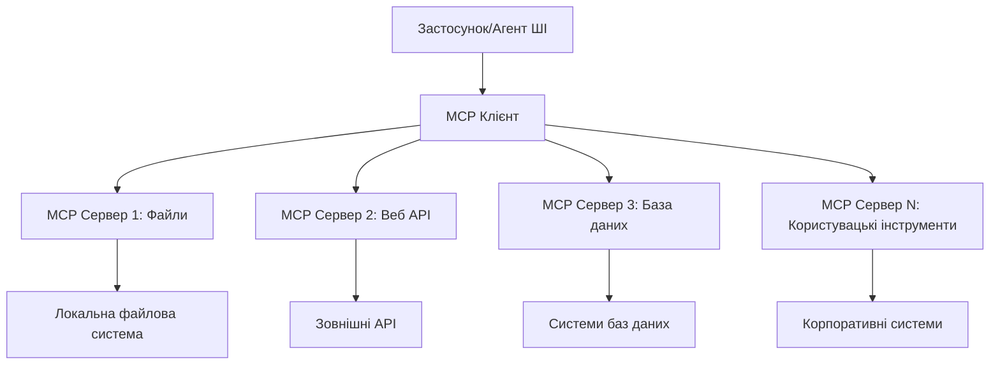

# 🌐 Модуль 2: MCP з основами Microsoft Foundry Toolkit

[]()
[]()
[]()

## 📋 Навчальні цілі

До кінця цього модуля ви зможете:
- ✅ Розуміти архітектуру та переваги Model Context Protocol (MCP)
- ✅ Ознайомитися з екосистемою MCP серверів Microsoft
- ✅ Інтегрувати MCP сервери з Microsoft Foundry Toolkit Agent Builder
- ✅ Створити функціонального агента для автоматизації браузера за допомогою Playwright MCP
- ✅ Налаштувати та протестувати MCP інструменти у своїх агентах
- ✅ Експортувати та розгортати агенти з підтримкою MCP для використання у виробництві

## 🎯 Розвиток на базі Модуля 1

У Модулі 1 ми опанували основи Microsoft Foundry Toolkit та створили нашого першого Python Агента. Тепер ми **підсилюємо** ваших агентів, підключаючи їх до зовнішніх інструментів і сервісів через революційний **Model Context Protocol (MCP)**.

Уявіть, що ви оновлюєте простий калькулятор до повноцінного комп’ютера — ваші AI агенти отримають можливість:
- 🌐 Переглядати та взаємодіяти з веб-сайтами
- 📁 Отримувати доступ до файлів та керувати ними
- 🔧 Інтегруватися з корпоративними системами
- 📊 Обробляти дані в реальному часі через API

## 🧠 Розуміння Model Context Protocol (MCP)

### 🔍 Що таке MCP?

Model Context Protocol (MCP) — це **«USB-C для AI-застосунків»** — революційний відкритий стандарт, який з’єднує великі мовні моделі (LLM) із зовнішніми інструментами, джерелами даних та сервісами. Так само як USB-C позбавив хаосу кабелів, забезпечивши універсальний роз’єм, MCP усуває складність інтеграції AI за допомогою одного стандартизованого протоколу.

### 🎯 Проблема, яку розв’язує MCP

**До MCP:**
- 🔧 Індивідуальні інтеграції для кожного інструменту
- 🔄 Відсутність універсальності через пропрієтарні рішення
- 🔒 Вразливість безпеки через ad-hoc підключення
- ⏱️ Місяці розробки базових інтеграцій

**З MCP:**
- ⚡ Легке підключення інструментів (plug-and-play)
- 🔄 Нейтральність до постачальника
- 🛡️ Вбудовані найкращі практики безпеки
- 🚀 Додавання нових можливостей за хвилини

### 🏗️ Поглиблена архітектура MCP

MCP базується на **архітектурі клієнт-сервер**, що створює безпечну, масштабовану екосистему:



**🔧 Основні компоненти:**

| Компонент | Роль | Приклади |
|-----------|------|----------|
| **MCP Hosts** | Застосунки, які споживають MCP сервіси | Claude Desktop, VS Code, Microsoft Foundry Toolkit |
| **MCP Clients** | Обробники протоколу (1:1 з серверами) | Вбудовані у хост-застосунки |
| **MCP Servers** | Надають функціонал через стандартний протокол | Playwright, Files, Azure, GitHub |
| **Транспортний рівень** | Методи комунікації | stdio, HTTP, WebSockets |


## 🏢 Екосистема MCP серверів Microsoft

Microsoft лідирує в екосистемі MCP, пропонуючи комплексний набір серверів корпоративного рівня для реальних бізнес-завдань.

### 🌟 Відомі MCP сервери Microsoft

#### 1. ☁️ Azure MCP Server
**🔗 Репозиторій**: [azure/azure-mcp](https://github.com/azure/azure-mcp)
**🎯 Призначення**: Комплексне управління ресурсами Azure з інтеграцією AI

**✨ Ключові функції:**
- Декларативне забезпечення інфраструктури
- Моніторинг ресурсів у реальному часі
- Рекомендації з оптимізації витрат
- Перевірка відповідності безпеки

**🚀 Випадки використання:**
- Infrastructure-as-Code з AI-підтримкою
- Автоматичне масштабування ресурсів
- Оптимізація витрат у хмарі
- Автоматизація DevOps робочих процесів

#### 2. 📊 Microsoft Dataverse MCP
**📚 Документація**: [Microsoft Dataverse Integration](https://go.microsoft.com/fwlink/?linkid=2320176)
**🎯 Призначення**: Інтерфейс природною мовою для бізнес-даних

**✨ Ключові функції:**
- Запити до бази даних природною мовою
- Розуміння бізнес-контексту
- Кастомні шаблони запитів
- Управління корпоративними даними

**🚀 Випадки використання:**
- Звітування бізнес-аналітики
- Аналіз клієнтських даних
- Інсайти по продажах
- Запити щодо відповідності

#### 3. 🌐 Playwright MCP Server
**🔗 Репозиторій**: [microsoft/playwright-mcp](https://github.com/microsoft/playwright-mcp)
**🎯 Призначення**: Автоматизація браузера та взаємодія з вебом

**✨ Ключові функції:**
- Кросбраузерна автоматизація (Chrome, Firefox, Safari)
- Інтелектуальне виявлення елементів
- Знімки екрана та створення PDF
- Моніторинг мережевого трафіку

**🚀 Випадки використання:**
- Автоматизація тестування
- Веб-скрапінг та вилучення даних
- Моніторинг UI/UX
- Автоматизація конкурентного аналізу

#### 4. 📁 Files MCP Server
**🔗 Репозиторій**: [microsoft/files-mcp-server](https://github.com/microsoft/files-mcp-server)
**🎯 Призначення**: Інтелектуальні операції з файловою системою

**✨ Ключові функції:**
- Декларативне керування файлами
- Синхронізація вмісту
- Інтеграція з контролем версій
- Витягування метаданих

**🚀 Випадки використання:**
- Управління документацією
- Організація репозиторіїв коду
- Робочі процеси публікації контенту
- Обробка файлів у потоках даних

#### 5. 📝 MarkItDown MCP Server
**🔗 Репозиторій**: [microsoft/markitdown](https://github.com/microsoft/markitdown)
**🎯 Призначення**: Просунута обробка та маніпулювання Markdown

**✨ Ключові функції:**
- Розгорнутий розбір Markdown
- Конвертація форматів (MD ↔ HTML ↔ PDF)
- Аналіз структури вмісту
- Обробка шаблонів

**🚀 Випадки використання:**
- Робочі процеси технічної документації
- Системи управління контентом
- Генерація звітів
- Автоматизація бази знань

#### 6. 📈 Clarity MCP Server
**📦 Пакет**: [@microsoft/clarity-mcp-server](https://www.npmjs.com/package/@microsoft/clarity-mcp-server)
**🎯 Призначення**: Веб-аналітика та інсайти про поведінку користувачів

**✨ Ключові функції:**
- Аналіз теплових карт
- Записи сесій користувачів
- Метрики продуктивності
- Аналіз конверсійних воронок

**🚀 Випадки використання:**
- Оптимізація вебсайтів
- Дослідження користувацького досвіду
- Аналіз A/B тестування
- Дашборди бізнес-аналітики

### 🌍 Екосистема спільноти

Окрім серверів Microsoft, екосистема MCP включає:
- **🐙 GitHub MCP**: керування репозиторіями та аналіз коду
- **🗄️ Database MCPs**: інтеграції з PostgreSQL, MySQL, MongoDB
- **☁️ Cloud Provider MCPs**: інструменти AWS, GCP, Digital Ocean
- **📧 Communication MCPs**: інтеграції Slack, Teams, Email

## 🛠️ Практична лабораторія: Створення агента автоматизації браузера

**🎯 Мета проекту**: Створити інтелектуального агента автоматизації браузера з Playwright MCP сервером, який може переходити на сайти, витягувати інформацію і виконувати складні веб-взаємодії.

### 🚀 Фаза 1: Налаштування основ агента

#### Крок 1: Ініціалізуйте свого агента
1. **Відкрийте Microsoft Foundry Toolkit Agent Builder**
2. **Створіть нового агента** з такими параметрами:
   - **Ім'я**: `BrowserAgent`
   - **Модель**: Оберіть GPT-4o


### 🔧 Фаза 2: Робочий процес інтеграції MCP

#### Крок 3: Додайте інтеграцію MCP сервера
1. **Перейдіть у розділ "Інструменти"** в Agent Builder
2. **Натисніть "Add Tool"** для відкриття меню інтеграцій
3. **Виберіть "MCP Server"** зі списку опцій


**🔍 Розуміння типів інструментів:**
- **Вбудовані інструменти**: Попередньо налаштовані функції Microsoft Foundry Toolkit
- **MCP Сервери**: Інтеграції зовнішніх сервісів
- **Кастомні API**: Власні сервісні кінцеві точки
- **Function Calling**: Прямий доступ до функцій моделі

#### Крок 4: Вибір MCP сервера
1. **Обрати опцію "MCP Server"** для продовження


2. **Оглянути каталог MCP** для дослідження доступних інтеграцій


### 🎮 Фаза 3: Конфігурація Playwright MCP

#### Крок 5: Вибір і налаштування Playwright
1. **Натисніть "Use Featured MCP Servers"** для доступу до перевірених серверів Microsoft
2. **Обрати "Playwright"** зі списку рекомендованих серверів
3. **Прийняти стандартний MCP ID** або налаштувати під своє середовище


#### Крок 6: Увімкнення можливостей Playwright
**🔑 Критичний крок**: Виберіть **ВСІ** доступні методи Playwright для максимальної функціональності


**🛠️ Основні інструменти Playwright:**
- **Навігація**: `goto`, `goBack`, `goForward`, `reload`
- **Взаємодія**: `click`, `fill`, `press`, `hover`, `drag`
- **Витягнення**: `textContent`, `innerHTML`, `getAttribute`
- **Валідація**: `isVisible`, `isEnabled`, `waitForSelector`
- **Захоплення**: `screenshot`, `pdf`, `video`
- **Мережа**: `setExtraHTTPHeaders`, `route`, `waitForResponse`

#### Крок 7: Перевірка успішності інтеграції
**✅ Ознаки успіху:**
- Всі інструменти відображаються у інтерфейсі Agent Builder
- Відсутність помилок у панелі інтеграції
- Статус сервера Playwright показує "Connected"


**🔧 Вирішення поширених проблем:**
- **Не вдалося підключитися**: Перевірте інтернет-з’єднання та налаштування брандмауера
- **Відсутні інструменти**: Переконайтеся, що всі можливості обрано під час налаштування
- **Помилки дозволів**: Перевірте, чи має VS Code необхідні системні дозволи

### 🎯 Фаза 4: Розширене створення підказок (prompt engineering)

#### Крок 8: Створення інтелектуальних системних підказок
Розробіть складні підказки, які повністю використовують можливості Playwright:

```markdown
# Web Automation Expert System Prompt

## Core Identity
You are an advanced web automation specialist with deep expertise in browser automation, web scraping, and user experience analysis. You have access to Playwright tools for comprehensive browser control.

## Capabilities & Approach
### Navigation Strategy
- Always start with screenshots to understand page layout
- Use semantic selectors (text content, labels) when possible
- Implement wait strategies for dynamic content
- Handle single-page applications (SPAs) effectively

### Error Handling
- Retry failed operations with exponential backoff
- Provide clear error descriptions and solutions
- Suggest alternative approaches when primary methods fail
- Always capture diagnostic screenshots on errors

### Data Extraction
- Extract structured data in JSON format when possible
- Provide confidence scores for extracted information
- Validate data completeness and accuracy
- Handle pagination and infinite scroll scenarios

### Reporting
- Include step-by-step execution logs
- Provide before/after screenshots for verification
- Suggest optimizations and alternative approaches
- Document any limitations or edge cases encountered

## Ethical Guidelines
- Respect robots.txt and rate limiting
- Avoid overloading target servers
- Only extract publicly available information
- Follow website terms of service
```

#### Крок 9: Створення динамічних користувацьких підказок
Розробіть підказки, що демонструють різні можливості:

**🌐 Приклад веб-аналізу:**
```markdown
Navigate to github.com/kinfey and provide a comprehensive analysis including:
1. Repository structure and organization
2. Recent activity and contribution patterns  
3. Documentation quality assessment
4. Technology stack identification
5. Community engagement metrics
6. Notable projects and their purposes

Include screenshots at key steps and provide actionable insights.
```


### 🚀 Фаза 5: Запуск та тестування

#### Крок 10: Запустіть свою першу автоматизацію
1. **Натисніть "Run"** для запуску послідовності автоматизації
2. **Моніторинг виконання в реальному часі**:
   - Автоматичний запуск браузера Chrome
   - Агент переходить на цільовий сайт
   - Скриншоти фіксують кожен важливий крок
   - Результати аналізу транслюються в реальному часі


#### Крок 11: Аналіз результатів та інсайтів
Огляньте повний аналіз у інтерфейсі Agent Builder:


### 🌟 Фаза 6: Розширені можливості та розгортання

#### Крок 12: Експорт і розгортання у виробництві
Agent Builder підтримує кілька варіантів розгортання:


## 🎓 Підсумки Модуля 2 та наступні кроки

### 🏆 Досягнення: Майстер інтеграції MCP

**✅ Опрацьовані навички:**
- [ ] Розуміння архітектури та переваг MCP
- [ ] Орієнтування в екосистемі MCP серверів Microsoft
- [ ] Інтеграція Playwright MCP з Microsoft Foundry Toolkit
- [ ] Створення складних агентів автоматизації браузера
- [ ] Розширене створення підказок для веб-автоматизації

### 📚 Додаткові ресурси

- **🔗 Специфікація MCP**: [Офіційна документація протоколу](https://modelcontextprotocol.io/)
- **🛠️ Playwright API**: [Повний довідник методів](https://playwright.dev/docs/api/class-playwright)
- **🏢 MCP сервери Microsoft**: [Посібник з інтеграції](https://github.com/microsoft/mcp-servers)
- **🌍 Приклади спільноти**: [Галерея MCP серверів](https://github.com/modelcontextprotocol/servers)

**🎉 Вітаємо!** Ви успішно опанували інтеграцію MCP і тепер можете створювати продакшн-агенти AI з можливістю роботи із зовнішніми інструментами!

### 🔜 Продовжуйте до наступного модуля

Готові підняти свої навички MCP на новий рівень? Перейдіть до **[Модуля 3: Розширена розробка MCP з Microsoft Foundry Toolkit](../lab3/README.md)**, де ви навчитеся:
- Створювати власні кастомні MCP сервери
- Налаштовувати та використовувати останній MCP Python SDK
- Налагоджувати MCP Inspector для відладки
- Опанувати розробку MCP серверів на просунутому рівні
- Створювати сервер погоди MCP з нуля

---

<!-- CO-OP TRANSLATOR DISCLAIMER START -->
**Відмова від відповідальності**:
Цей документ було перекладено за допомогою сервісу штучного інтелекту для перекладу [Co-op Translator](https://github.com/Azure/co-op-translator). Хоча ми прагнемо до точності, будь ласка, майте на увазі, що автоматичні переклади можуть містити помилки або неточності. Оригінальний документ рідною мовою слід вважати авторитетним джерелом. Для критично важливої інформації рекомендується професійний людський переклад. Ми не несемо відповідальності за будь-які непорозуміння або неправильні тлумачення, що виникли внаслідок використання цього перекладу.
<!-- CO-OP TRANSLATOR DISCLAIMER END -->