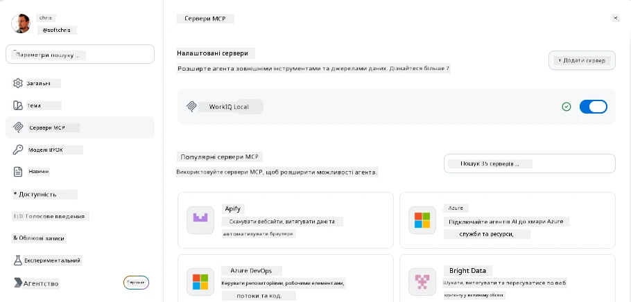
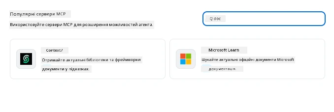
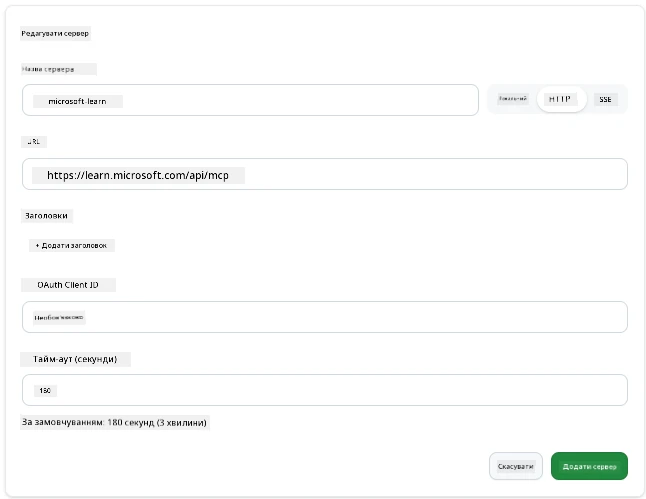
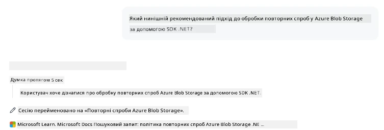
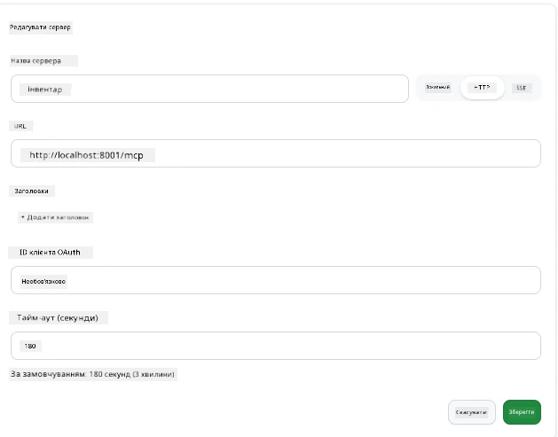
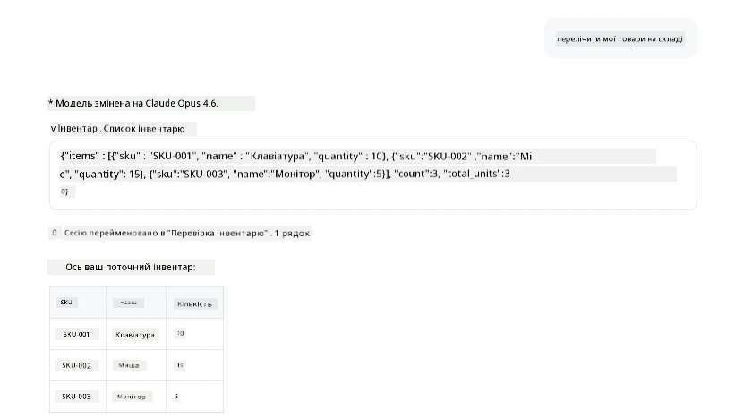
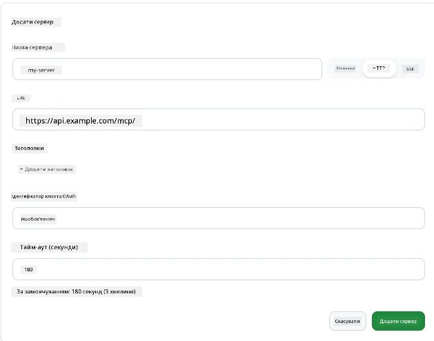
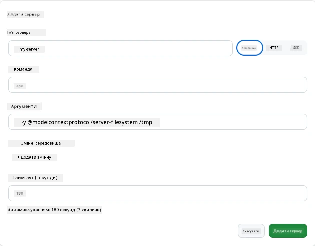

# Використання серверів MCP у застосунку GitHub Copilot

До цього часу ви знаєте, як працює MCP. Ви створили сервери, визначили інструменти та ресурси, і підключили клієнтів. Що ми ще не зробили — це змінити перспективу: замість того, щоб бути тим, хто створює сервер, як це виглядає з *споживацького* боку — як користувача застосунку з підтримкою MCP на базі штучного інтелекту?

[GitHub Copilot App](https://github.com/github/app) — це десктопний застосунок, який може використовувати сервери MCP. Підключивши до нього сервери MCP, ви відкриваєте новий рівень: Copilot тепер може звертатись до вашої документації, викликати ваші внутрішні API, запитувати вашу базу даних або спілкуватися з будь-яким сервісом, який ви обгорнули у сервер. Застосунок стає хостом; ваші сервери MCP — його інструментами.

Цей урок проведе вас через цей досвід від початку до кінця — від пошуку панелі налаштувань MCP до підключення реального сервера документації і налаштування власного кастомного сервера.

## Цілі навчання

До кінця цього уроку ви зможете:

- Знайти та орієнтуватися в панелі серверів MCP у налаштуваннях Copilot App.
- Підключити розміщений сервер документації і використовувати його в сесії.
- Зареєструвати кастомний сервер і перевірити, що Copilot може викликати його інструменти.
- Налаштувати, як сервер викликається, задавши змінні середовища або власні заголовки (якщо HTTP).

## Copilot App як хост MCP

Ось головна ідея: **агенти Copilot розумні, але вони знають лише те, що ви їм скажете.** За замовчуванням агент може читати файли у вашій робочій зоні та запускати термінальні команди, але він не може запитувати вашу базу даних, переглядати ваш календар або викликати кастомний API без допомоги. Саме тут з’являються сервери MCP. Вони діють як мости між Copilot і вашими системами — базами даних, системами контролю версій, API, дизайнерськими інструментами — даючи агентам доступ до потрібної їм інформації та дій для виконання роботи.

Почнемо з пошуку цих налаштувань для управління серверами MCP у вашому застосунку.

## Крок 1: Знаходження панелі налаштувань MCP

Відкрийте Copilot App і знайдіть іконку шестерні у нижньому лівому куті, клацніть на неї.


Переконайтеся, що обрано "MCP Servers", і ви побачите свої вже налаштовані сервери зверху, маркетплейс популярних серверів знизу, а також кнопку "Add Server" зверху ось так:



Це ваш центр керування. Тут ви додаєте, видаляєте, активуєте та деактивуєте сервери. Зміни застосовуються для нових сесій; якщо у вас відкрита сесія, потрібно буде почати нову після зміни цього списку.

## Крок 2: Підключення сервера документації

Давайте зробимо щось корисне одразу. Сервер MCP Microsoft Docs дає Copilot доступ до офіційної документації Microsoft. Це включає Azure, .NET, TypeScript та інше. Замість того, щоб агент спирався на свої навчальні дані (з певною датою відсіку), він може отримувати актуальну документацію в момент запиту.

Ось як його додати:

1. У сітці популярних серверів введіть **learn** та виберіть сервер під назвою "Microsoft Learn".

   

   Після клацання вам відкриється форма, де ім’я, тип транспорту та URL заповнені заздалегідь, залишилось лише натиснути "Add Server".

2. Натисніть "Add Server", підключення займе кілька секунд.

   

   Після додавання сервер має з’явитися вгорі як налаштований сервер. Спробуємо його використати далі.

3. Закрийте діалог і виберіть Quick chat.

4. Введіть запит нижче, щоб викликати інструмент на сервері Microsoft Learn.

   ```text
   What's the current recommended approach for handling Azure Blob Storage 
   retries using the .NET SDK?
   ```

   

Ви повинні побачити, як він звертається до щойно доданого сервера MCP.

## Крок 3: Підключення кастомного stdio сервера

Пресети — це зручно, але справжня сила в підключенні власних серверів. Припустимо, що ви створили сервер (або вам надали один), який надає ваш внутрішній API або корпоративну базу знань. У нашому випадку ми використаємо MCP сервер, який ми створили і який управляє запасами нашої компанії.

1. Клікніть на шестерню і знову виберіть "MCP servers".

2. Натисніть кнопку "Add Server" і виберіть "+ Add Custom server", введіть такі значення:

   - Ім’я: `Inventory Server`
   - Виберіть тип транспорту справа — **http**

   Натисніть "Add Server", і він повинен з’явитись у вашому списку налаштованих серверів.

   

4. Щоб перевірити його, надішліть запит так:

    ```
    list inventory
    ```

   

   Тепер має з’явитися список товарів на складі, який повертається вашим кастомним сервером.

Чудово, тепер ви добре розумієте, як додавати зовнішні, а також власні MCP сервери до Copilot App. Далі поговоримо про роботу з секретами та змінними оточення.

## Крок 4: Розширені налаштування

Поки що ви бачили, як додавати MCP сервери, де потрібно лише вказати ім’я та URL. Але що якщо ваш сервер потребує API-ключ або інше значення? Залежно від типу транспорту, ми можемо передати серверу все, що потрібно.

- **http або SSE транспорт**: Тут можна задати заголовки за потреби.

   Для автентифікації можна вказати заголовок Authorization, наприклад. Значення може бути статичним рядком. Якщо ви використовуєте OAuth, можна замість цього вказати клієнтський ID OAuth.

   

- **stdio транспорт**: Можна задати змінні середовища.

   Тут ви можете вказати будь-яку кількість змінних середовища, які слід передати серверу при запуску.

   

## Підсумок

Copilot App сприймає сервери MCP як повноцінні розширення можливостей агента. Ви побачили повний шлях у цьому уроці — від додавання MCP серверів до їх використання в сесії. Тепер ви можете підключатися до публічних серверів, внутрішніх API та кастомних інструментів, даючи вашим агентам можливість отримувати потрібну інформацію та виконувати завдання автономно.

## 📚 Додаткові ресурси

### Офіційна документація

- [GitHub Copilot App](https://github.com/github/app)
- [MCP Specification](https://modelcontextprotocol.io/specification/2025-03-26) — Специфікація Model Context Protocol

### Спільнота

- [MCP Community Discord](https://discord.com/invite/ByRwuEEgH4) — Живі дискусії
- [GitHub Discussions](https://github.com/microsoft/MCP-Server-and-PostgreSQL-Sample-Retail/discussions) — Запитання та відповіді, обмін досвідом
- [Stack Overflow](https://stackoverflow.com/questions/tagged/model-context-protocol) — Технічні питання

---

<!-- CO-OP TRANSLATOR DISCLAIMER START -->
**Відмова від відповідальності**:
Цей документ було перекладено за допомогою сервісу штучного інтелекту для перекладу [Co-op Translator](https://github.com/Azure/co-op-translator). Хоча ми прагнемо до точності, будь ласка, майте на увазі, що автоматичні переклади можуть містити помилки або неточності. Оригінальний документ рідною мовою слід вважати авторитетним джерелом. Для критично важливої інформації рекомендується професійний людський переклад. Ми не несемо відповідальності за будь-які непорозуміння або неправильні тлумачення, що виникли внаслідок використання цього перекладу.
<!-- CO-OP TRANSLATOR DISCLAIMER END -->