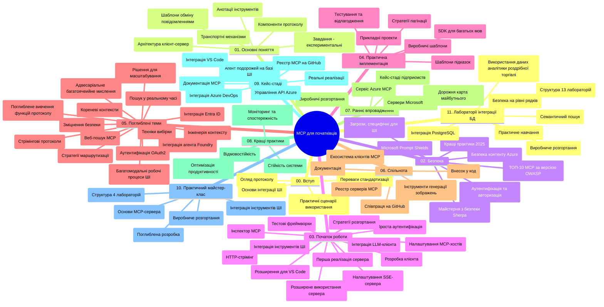

# Протокол Контексту Моделі (MCP) для початківців - Навчальний посібник

Цей навчальний посібник містить огляд структури репозиторію та вмісту курсу "Протокол Контексту Моделі (MCP) для початківців". Використовуйте цей посібник для ефективної навігації репозиторієм і максимальної користі від доступних ресурсів.

## Огляд репозиторію

Протокол Контексту Моделі (MCP) — це стандартизована структура для взаємодій між AI-моделями та клієнтськими додатками. Спочатку створений Anthropic, MCP тепер підтримується ширшою спільнотою MCP через офіційну організацію на GitHub. Цей репозиторій надає всебічний курс із практичними прикладами коду на C#, Java, JavaScript, Python та TypeScript, розроблений для AI-розробників, системних архітекторів та інженерів-програмістів.

## Візуальна карта курсу

## Структура репозиторію

Репозиторій організовано у одинадцять основних розділів, кожен з яких зосереджений на різних аспектах MCP:

1. **Вступ (00-Introduction/)**
   - Огляд Протоколу Контексту Моделі
   - Чому стандартизація важлива в AI-процесах
   - Практичні випадки використання та переваги

2. **Основні поняття (01-CoreConcepts/)**
   - Архітектура клієнт-сервер
   - Ключові компоненти протоколу
   - Патерни обміну повідомленнями в MCP

3. **Безпека (02-Security/)**
   - Загрози безпеці в системах на базі MCP
   - Кращі практики забезпечення безпеки реалізацій
   - Стратегії аутентифікації та авторизації
   - **Комплексна документація з безпеки**:
     - Найкращі практики безпеки MCP 2025
     - Посібник з впровадження Azure Content Safety
     - Контролі та техніки безпеки MCP
     - Швидкий довідник кращих практик MCP
   - **Ключові теми безпеки**:
     - Атаки ін’єкції підказок та отруєння інструментів
     - Ухилення захоплення сесії та проблеми збентеженого посередника
     - Уразливості при передачі токенів
     - Надмірні права доступу та контроль доступу
     - Безпека ланцюга поставок AI-компонентів
     - Інтеграція Microsoft Prompt Shields

4. **Початок роботи (03-GettingStarted/)**
   - Налаштування та конфігурація середовища
   - Створення базових MCP-серверів і клієнтів
   - Інтеграція з існуючими додатками
   - Містить розділи для:
     - Першої реалізації сервера
     - Розробки клієнта
     - Інтеграції LLM клієнта
     - Інтеграції з VS Code
     - Серверів на основі Server-Sent Events (SSE)
     - Розширене використання серверів
     - HTTP-стрімінгу
     - Інтеграції AI Toolkit
     - Стратегій тестування
     - Рекомендацій щодо розгортання

5. **Практична реалізація (04-PracticalImplementation/)**
   - Використання SDK різними мовами програмування
   - Налагодження, тестування та валідація
   - Створення багаторазових шаблонів підказок і робочих процесів
   - Зразки проєктів з прикладами реалізації

6. **Розширені теми (05-AdvancedTopics/)**
   - Техніки інженерії контексту
   - Інтеграція Foundry agent
   - Багатомодальні робочі процеси AI
   - Демонстрації аутентифікації OAuth2
   - Можливості пошуку в реальному часі
   - Потокова передача в реальному часі
   - Впровадження кореневих контекстів
   - Стратегії маршрутизації
   - Техніки вибірки
   - Підходи до масштабування
   - Питання безпеки
   - Інтеграція безпеки Entra ID
   - Інтеграція веб-пошуку
   - Протистояння багатозадачному мультиагентському розумінню (патерни дебатів)

7. **Внески спільноти (06-CommunityContributions/)**
   - Як вносити код та документацію
   - Співпраця через GitHub
   - Розробка та зворотній зв’язок від спільноти
   - Використання різних MCP клієнтів (Claude Desktop, Cline, VSCode)
   - Робота з популярними MCP серверами, включно з генерацією зображень

8. **Уроки раннього впровадження (07-LessonsfromEarlyAdoption/)**
   - Реальні впровадження та історії успіху
   - Побудова та розгортання рішень на базі MCP
   - Тенденції та майбутня дорожня карта
   - **Посібник з Microsoft MCP серверів**: Комплексний посібник по 10 продуктивних серверах Microsoft MCP, включно з:
     - Microsoft Learn Docs MCP Server
     - Azure MCP Server (15+ спеціалізованих конекторів)
     - GitHub MCP Server
     - Azure DevOps MCP Server
     - MarkItDown MCP Server
     - SQL Server MCP Server
     - Playwright MCP Server
     - Dev Box MCP Server
     - Microsoft Foundry MCP Server
     - Microsoft 365 Agents Toolkit MCP Server

9. **Кращі практики (08-BestPractices/)**
   - Налаштування продуктивності та оптимізація
   - Проектування відмовостійких MCP систем
   - Стратегії тестування та стійкості

10. **Кейс-стаді (09-CaseStudy/)**
    - **Сім комплексних кейсів**, що демонструють універсальність MCP у різних сценаріях:
    - **Azure AI Travel Agents**: Багатоагентська оркестрація з Azure OpenAI та AI Search
    - **Інтеграція Azure DevOps**: Автоматизація робочих процесів із оновленнями даних YouTube
    - **Отримання документації в реальному часі**: Python консольний клієнт з HTTP-стрімінгом
    - **Інтерактивний генератор навчальних планів**: веб-додаток Chainlit з розмовним AI
    - **Документація в редакторі**: інтеграція VS Code з робочими процесами GitHub Copilot
    - **Azure API Management**: Інтеграція корпоративного API з створенням MCP серверів
    - **GitHub MCP Registry**: Екосистема та платформа агентної інтеграції
    - Приклади реалізації, що охоплюють корпоративну інтеграцію, продуктивність розробників і розвиток екосистеми

11. **Практичний майстер-клас (10-StreamliningAIWorkflowsBuildingAnMCPServerWithAIToolkit/)**
    - Всебічний практичний майстер-клас, що поєднує MCP з AI Toolkit
    - Створення інтелектуальних додатків, що поєднують AI-моделі з реальними інструментами
    - Практичні модулі з основ MCP, розробки кастомних серверів і стратегії розгортання в продакшен
    - **Структура лабораторних робіт**:
      - Лабораторія 1: Основи MCP серверів
      - Лабораторія 2: Розширена розробка MCP серверів
      - Лабораторія 3: Інтеграція AI Toolkit
      - Лабораторія 4: Розгортання у продакшен та масштабування
    - Навчання на основі лабораторних робіт з покроковими інструкціями

12. **Лабораторії інтеграції MCP серверів з базою даних (11-MCPServerHandsOnLabs/)**
    - **Комплексний навчальний шлях з 13 лабораторій** для створення промислових MCP серверів з інтеграцією PostgreSQL
    - **Реальна імплементація роздрібної аналітики** на прикладі кейсу Zava Retail
    - **Корпоративні патерни** включно з Row Level Security (RLS), семантичним пошуком і багатокористувацьким доступом до даних
    - **Повна структура лабораторій**:
      - **Лабораторії 00-03: Основи** – Вступ, Архітектура, Безпека, Налаштування середовища
      - **Лабораторії 04-06: Створення MCP сервера** – Проєктування бази даних, реалізація MCP сервера, розробка інструментів
      - **Лабораторії 07-09: Розширені функції** – Семантичний пошук, тестування і налагодження, інтеграція з VS Code
      - **Лабораторії 10-12: Продакшен та кращі практики** – Розгортання, моніторинг, оптимізація
    - **Використані технології**: FastMCP framework, PostgreSQL, Azure OpenAI, Azure Container Apps, Application Insights
    - **Результати навчання**: Промислові MCP сервери, патерни інтеграції з базами даних, AI-аналітика, корпоративна безпека

## Додаткові ресурси

У репозиторії також включені допоміжні ресурси:

- **Папка з зображеннями**: містить діаграми та ілюстрації, які використовуються в курсі
- **Переклади**: підтримка багатьох мов з автоматизованими перекладами документації
- **Офіційні ресурси MCP**:
  - [Документація MCP](https://modelcontextprotocol.io/)
  - [Специфікація MCP](https://spec.modelcontextprotocol.io/)
  - [Репозиторій MCP на GitHub](https://github.com/modelcontextprotocol)

## Як використовувати цей репозиторій

1. **Послідовне вивчення**: Дотримуйтесь розділів за порядком (00 до 11) для структурованого навчання.
2. **Фокус на конкретну мову**: Якщо вас цікавить певна мова програмування, досліджуйте каталоги з прикладами реалізацій на обраній мові.
3. **Практична реалізація**: Починайте з розділу "Початок роботи" для налаштування середовища та створення першого MCP сервера і клієнта.
4. **Просунуте вивчення**: Коли відчуєте впевненість у базових знаннях, переходьте до розширених тем для поглиблення знань.
5. **Залучення до спільноти**: Приєднуйтесь до спільноти MCP через дискусії на GitHub та канали Discord, щоб спілкуватися з експертами та іншими розробниками.

## MCP клієнти та інструменти

Курс охоплює різні MCP клієнти та інструменти:

1. **Офіційні клієнти**:
   - Visual Studio Code
   - MCP у Visual Studio Code
   - Claude Desktop
   - Claude у VSCode
   - Claude API

2. **Клієнти спільноти**:
   - Cline (термінальний)
   - Cursor (редактор коду)
   - ChatMCP
   - Windsurf

3. **Інструменти управління MCP**:
   - MCP CLI
   - MCP Manager
   - MCP Linker
   - MCP Router

## Популярні MCP сервери

У репозиторії представлені різні MCP сервери, у тому числі:

1. **Офіційні Microsoft MCP сервери**:
   - Microsoft Learn Docs MCP Server
   - Azure MCP Server (15+ спеціалізованих конекторів)
   - GitHub MCP Server
   - Azure DevOps MCP Server
   - MarkItDown MCP Server
   - SQL Server MCP Server
   - Playwright MCP Server
   - Dev Box MCP Server
   - Microsoft Foundry MCP Server
   - Microsoft 365 Agents Toolkit MCP Server

2. **Офіційні референсні сервери**:
   - Filesystem
   - Fetch
   - Memory
   - Sequential Thinking

3. **Генерація зображень**:
   - Azure OpenAI DALL-E 3
   - Stable Diffusion WebUI
   - Replicate

4. **Інструменти розробки**:
   - Git MCP
   - Terminal Control
   - Code Assistant

5. **Спеціалізовані сервери**:
   - Salesforce
   - Microsoft Teams
   - Jira & Confluence

## Внесок у проєкт

Цей репозиторій вітає внески від спільноти. Дивіться розділ Внески спільноти для рекомендацій щодо ефективного внеску у екосистему MCP.

----

*Цей навчальний посібник оновлено востаннє 5 лютого 2026 року, відображаючи останню Специфікацію MCP 2025-11-25 та надає огляд репозиторію станом на цю дату. Вміст репозиторію може оновлюватися після цієї дати.*

---

<!-- CO-OP TRANSLATOR DISCLAIMER START -->
**Відмова від відповідальності**:
Цей документ було перекладено за допомогою сервісу штучного інтелекту для перекладу [Co-op Translator](https://github.com/Azure/co-op-translator). Хоча ми прагнемо до точності, будь ласка, майте на увазі, що автоматичні переклади можуть містити помилки або неточності. Оригінальний документ рідною мовою слід вважати авторитетним джерелом. Для критично важливої інформації рекомендується професійний людський переклад. Ми не несемо відповідальності за будь-які непорозуміння або неправильні тлумачення, що виникли внаслідок використання цього перекладу.
<!-- CO-OP TRANSLATOR DISCLAIMER END -->