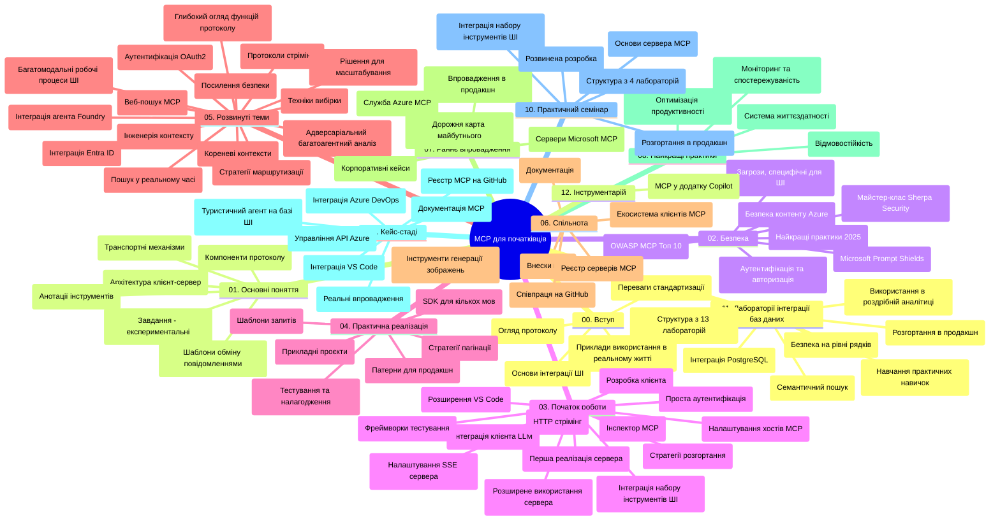

# Протокол контексту моделі (MCP) для початківців - навчальний посібник

Цей навчальний посібник надає огляд структури та змісту репозиторію для курсу "Протокол контексту моделі (MCP) для початківців". Використовуйте цей посібник, щоб ефективно орієнтуватися в репозиторії та максимально використовувати доступні ресурси.

## Огляд репозиторію

Протокол контексту моделі (MCP) — це стандартизована структура для взаємодії між AI-моделями та клієнтськими застосунками. Спочатку створений Anthropic, MCP тепер підтримується широкою спільнотою MCP через офіційну організацію GitHub. Цей репозиторій містить комплексний навчальний курс із практичними прикладами коду на C#, Java, JavaScript, Python і TypeScript, розроблений для AI-розробників, системних архітекторів і програмних інженерів.

## Візуальна карта курсу

## Структура репозиторію

Репозиторій організовано у дванадцять основних розділів, кожен із яких зосереджений на різних аспектах MCP:

1. **Вступ (00-Introduction/)**
   - Огляд Протоколу контексту моделі
   - Чому стандартизація важлива в AI-пайплайнах
   - Практичні кейси та переваги

2. **Основні поняття (01-CoreConcepts/)**
   - Клієнт-серверна архітектура
   - Ключові компоненти протоколу
   - Патерни обміну повідомленнями в MCP

3. **Безпека (02-Security/)**
   - Загрози безпеці в системах на базі MCP
   - Кращі практики для захисту реалізацій
   - Стратегії аутентифікації та авторизації
   - **Комплексна документація з безпеки**:
     - Найкращі практики безпеки MCP 2025
     - Посібник з реалізації Azure Content Safety
     - Контролі та методи безпеки MCP
     - Швидкий довідник найкращих практик MCP
   - **Ключові теми безпеки**:
     - Атаки через ін’єкцію підказок і отруєння інструментів
     - Захоплення сесії та проблеми confused deputy
     - Уразливості через passthrough токенів
     - Надмірні права доступу та контроль доступу
     - Безпека ланцюгів поставок AI-компонентів
     - Інтеграція Microsoft Prompt Shields

4. **Початок роботи (03-GettingStarted/)**
   - Налаштування середовища
   - Створення базових MCP серверів і клієнтів
   - Інтеграція з існуючими застосунками
   - Включає секції:
     - Перша реалізація сервера
     - Розробка клієнта
     - Інтеграція клієнта LLM
     - Інтеграція з VS Code
     - Сервер SSE (Server-Sent Events)
     - Розширене використання сервера
     - HTTP стрімінг
     - Інтеграція AI Toolkit
     - Стратегії тестування
     - Рекомендації з розгортання

5. **Практична реалізація (04-PracticalImplementation/)**
   - Використання SDK для різних мов програмування
   - Техніки налагодження, тестування і валідації
   - Створення багаторазових шаблонів підказок та робочих процесів
   - Демонстраційні проекти з прикладами реалізації

6. **Розширені теми (05-AdvancedTopics/)**
   - Техніки інженерії контексту
   - Інтеграція агента Foundry
   - Мультимодальні AI-робочі процеси
   - Демонстрації аутентифікації OAuth2
   - Можливості пошуку в реальному часі
   - Стрімінг у реальному часі
   - Реалізація кореневих контекстів
   - Стратегії маршрутизації
   - Техніки вибірки
   - Підходи до масштабування
   - Розгляд безпеки
   - Інтеграція безпеки Entra ID
   - Інтеграція веб-пошуку
   - Змагальне багатопотокове розумування (патерни дебатів)

7. **Спільнотні внески (06-CommunityContributions/)**
   - Як долучитися до коду та документації
   - Співпраця через GitHub
   - Розвиток на основі спільноти та зворотній зв’язок
   - Використання різних MCP клієнтів (Claude Desktop, Cline, VSCode)
   - Робота з популярними MCP серверами, включно з генерацією зображень

8. **Уроки з раннього впровадження (07-LessonsfromEarlyAdoption/)**
   - Реальні реалізації та історії успіху
   - Створення та розгортання рішень на базі MCP
   - Тенденції та майбутня дорожня карта
   - **Посібник Microsoft MCP Servers**: Комплексний довідник по 10 готових до виробництва Microsoft MCP серверах, серед яких:
     - Microsoft Learn Docs MCP Server
     - Azure MCP Server (понад 15 спеціалізованих конекторів)
     - GitHub MCP Server
     - Azure DevOps MCP Server
     - MarkItDown MCP Server
     - SQL Server MCP Server
     - Playwright MCP Server
     - Dev Box MCP Server
     - Microsoft Foundry MCP Server
     - Microsoft 365 Agents Toolkit MCP Server

9. **Найкращі практики (08-BestPractices/)**
   - Налаштування продуктивності та оптимізація
   - Проєктування надійних до помилок MCP систем
   - Стратегії тестування та забезпечення стійкості

10. **Кейс-стаді (09-CaseStudy/)**
    - **Сім комплексних кейс-стаді**, які демонструють універсальність MCP у різних сценаріях:
    - **Azure AI Travel Agents**: Оркестрація багатьох агентів за допомогою Azure OpenAI та AI Search
    - **Інтеграція Azure DevOps**: Автоматизація робочих процесів із оновленням даних YouTube
    - **Документація в реальному часі**: Python консольний клієнт зі стрімінгом HTTP
    - **Інтерактивний генератор плану навчання**: Chainlit веб-застосунок з розмовним AI
    - **Документація в редакторі**: Інтеграція VS Code з робочими процесами GitHub Copilot
    - **Azure API Management**: Корпоративна інтеграція API з створенням MCP серверів
    - **GitHub MCP Registry**: Платформа для розвитку екосистеми та агентної інтеграції
    - Приклади реалізації, що охоплюють корпоративну інтеграцію, продуктивність розробників та розвиток екосистеми

11. **Практичний воркшоп (10-StreamliningAIWorkflowsBuildingAnMCPServerWithAIToolkit/)**
    - Комплексний практичний воркшоп, що поєднує MCP з AI Toolkit
    - Створення інтелектуальних застосунків для поєднання AI-моделей із реальними інструментами
    - Практичні модулі з основ, розробки кастомних серверів та стратегій розгортання у продакшн
    - **Структура лабораторій**:
      - Лабораторія 1: Основи MCP серверів
      - Лабораторія 2: Розширена розробка MCP серверів
      - Лабораторія 3: Інтеграція AI Toolkit
      - Лабораторія 4: Продакшн розгортання та масштабування
    - Навчання на базі лабораторій із покроковими інструкціями

12. **Лабораторії з інтеграції баз даних MCP серверів (11-MCPServerHandsOnLabs/)**
    - **Повний навчальний шлях із 13 лабораторій** для створення готових до виробництва MCP серверів з інтеграцією PostgreSQL
    - **Реальна реалізація роздрібної аналітики** на прикладі кейсу Zava Retail
    - **Корпоративні патерни**, включно з Row Level Security (RLS), семантичним пошуком та багатокористувацьким доступом до даних
    - **Повна структура лабораторій**:
      - **Лабораторії 00-03: Основи** – Вступ, архітектура, безпека, налаштування середовища
      - **Лабораторії 04-06: Побудова MCP сервера** – Проєктування бази даних, реалізація MCP сервера, розробка інструментів
      - **Лабораторії 07-09: Розширені функції** – Семантичний пошук, тестування та налагодження, інтеграція з VS Code
      - **Лабораторії 10-12: Продакшн та найкращі практики** – Розгортання, моніторинг, оптимізація
    - **Охоплені технології**: фреймворк FastMCP, PostgreSQL, Azure OpenAI, Azure Container Apps, Application Insights
    - **Результати навчання**: готові до виробництва MCP сервери, патерни інтеграції баз даних, AI-аналітика, корпоративна безпека

13. **Інструменти (12-tooling/)**
    - Навчіться використовувати MCP у додатку Copilot та інших інструментах

## Додаткові ресурси

Репозиторій включає підтримуючі ресурси:

- **Папка зображень**: містить діаграми та ілюстрації, що використовуються в курсі
- **Переклади**: багатомовна підтримка з автоматичним перекладом документації
- **Офіційні ресурси MCP**:
  - [Документація MCP](https://modelcontextprotocol.io/)
  - [Специфікація MCP](https://spec.modelcontextprotocol.io/)
  - [Репозиторій MCP GitHub](https://github.com/modelcontextprotocol)

## Як користуватися цим репозиторієм

1. **Послідовне навчання**: проходьте розділи в порядку (від 00 до 11) для структурованого опанування матеріалу.
2. **Орієнтація на мову програмування**: якщо вас цікавить певна мова програмування, вивчіть каталоги з прикладами на цій мові.
3. **Практична реалізація**: починайте з розділу "Початок роботи", щоб налаштувати середовище та створити свій перший MCP сервер і клієнт.
4. **Поглиблене вивчення**: опанувавши основи, переходьте до розділу з розширеними темами, щоб розширити знання.
5. **Участь у спільноті**: приєднуйтеся до спільноти MCP через дискусії на GitHub та Discord-канали, щоб спілкуватися з експертами та іншими розробниками.

## MCP клієнти та інструменти

Курс охоплює різні MCP клієнти та інструменти:

1. **Офіційні клієнти**:
   - Visual Studio Code
   - MCP у Visual Studio Code
   - Claude Desktop
   - Claude у VSCode
   - Claude API

2. **Клієнти спільноти**:
   - Cline (термінальний)
   - Cursor (редактор коду)
   - ChatMCP
   - Windsurf

3. **Інструменти керування MCP**:
   - MCP CLI
   - MCP Manager
   - MCP Linker
   - MCP Router

## Популярні MCP сервери

У репозиторії представлені різні MCP сервери, включно з:

1. **Офіційні Microsoft MCP сервери**:
   - Microsoft Learn Docs MCP Server
   - Azure MCP Server (понад 15 спеціалізованих конекторів)
   - GitHub MCP Server
   - Azure DevOps MCP Server
   - MarkItDown MCP Server
   - SQL Server MCP Server
   - Playwright MCP Server
   - Dev Box MCP Server
   - Microsoft Foundry MCP Server
   - Microsoft 365 Agents Toolkit MCP Server

2. **Офіційні референтні сервери**:
   - Файлова система
   - Fetch
   - Пам’ять
   - Послідовне мислення

3. **Генерація зображень**:
   - Azure OpenAI DALL-E 3
   - Stable Diffusion WebUI
   - Replicate

4. **Інструменти розробника**:
   - Git MCP
   - Terminal Control
   - Code Assistant

5. **Спеціалізовані сервери**:
   - Salesforce
   - Microsoft Teams
   - Jira та Confluence

## Внесок у розвиток

Цей репозиторій вітає внески від спільноти. Дивіться розділ "Спільнотні внески" для інструкцій щодо ефективної участі у розвитку екосистеми MCP.

----

*Цей навчальний посібник оновлено востаннє 5 лютого 2026 року з урахуванням останньої Специфікації MCP 2025-11-25 і надає огляд стану репозиторію на цю дату. Зміст репозиторію може оновлюватися після цієї дати.*

---

<!-- CO-OP TRANSLATOR DISCLAIMER START -->
**Відмова від відповідальності**:
Цей документ було перекладено за допомогою сервісу штучного інтелекту для перекладу [Co-op Translator](https://github.com/Azure/co-op-translator). Хоча ми прагнемо до точності, будь ласка, майте на увазі, що автоматичні переклади можуть містити помилки або неточності. Оригінальний документ рідною мовою слід вважати авторитетним джерелом. Для критично важливої інформації рекомендується професійний людський переклад. Ми не несемо відповідальності за будь-які непорозуміння або неправильні тлумачення, що виникли внаслідок використання цього перекладу.
<!-- CO-OP TRANSLATOR DISCLAIMER END -->