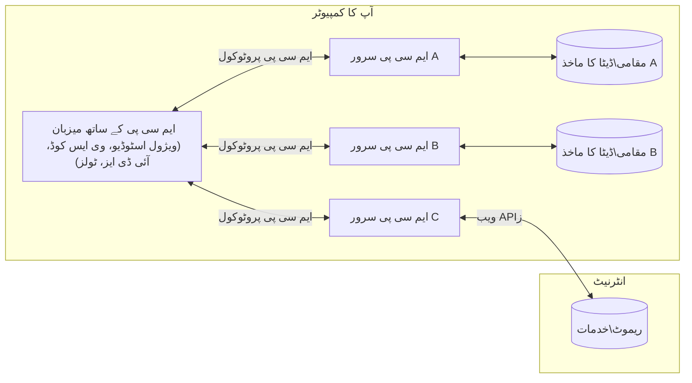

# MCP کور تصورات: AI انضمام کے لیے ماڈل کانٹیکسٹ پروٹوکول میں مہارت

[](https://youtu.be/earDzWGtE84)

_(اس سبق کا ویڈیو دیکھنے کے لیے اوپر دی گئی تصویر پر کلک کریں)_

[Model Context Protocol (MCP)](https://github.com/modelcontextprotocol) ایک طاقتور، معیاری فریم ورک ہے جو بڑے زبان کے ماڈلز (LLMs) اور بیرونی آلات، ایپلی کیشنز، اور ڈیٹا ذرائع کے درمیان مواصلات کو بہتر بناتا ہے۔  
یہ رہنما آپ کو MCP کے بنیادی تصورات سے روشناس کرائے گا۔ آپ اس کی کلائنٹ-سرور فن تعمیر، ضروری اجزاء، مواصلاتی طریقہ کار، اور عمل درآمد کی بہترین مشقوں کے بارے میں سیکھیں گے۔

- **واضح صارف کی رضامندی**: تمام ڈیٹا تک رسائی اور کارروائیاں عمل درآمد سے پہلے واضح صارف کی منظوری کی ضرورت ہوتی ہے۔ صارفین کو اچھی طرح سمجھنا چاہیے کہ کون سا ڈیٹا تک رسائی حاصل کی جائے گی اور کیا کاروائیاں انجام دی جائیں گی، اجازتوں اور اختیارات پر تفصیلی کنٹرول کے ساتھ۔

- **ڈیٹا پرائیویسی کا تحفظ**: صارف کا ڈیٹا صرف واضح رضامندی کے ساتھ سامنے آتا ہے اور پورے تعامل کے دوران مضبوط رسائی کنٹرولز سے محفوظ رکھا جانا چاہیے۔ عمل درآمد میں غیر مجاز ڈیٹا کی منتقلی کو روکا جانا چاہیے اور سخت رازداری کی حد بندی قائم رکھنی چاہیے۔

- **ٹول عمل درآمد کی حفاظت**: ہر ٹول کال کے لیے واضح صارف کی رضامندی درکار ہے، جس میں ٹول کی فعالیت، پیرامیٹرز، اور ممکنہ اثرات کی واضح سمجھ شامل ہے۔ مضبوط حفاظتی ہدایات غیر ارادی، غیر محفوظ، یا بدذہنی پر مبنی ٹول عمل درآمد کو روکیں۔

- **ٹرانسپورٹ پرت کی سیکیورٹی**: تمام مواصلاتی چینلز کو مناسب انکرپشن اور توثیقی طریقوں کا استعمال کرنا چاہیے۔ دور دراز کنکشنز کو محفوظ ٹرانسپورٹ پروٹوکولز اور مناسب اسناد کے انتظام پر عمل کرنا چاہیے۔

#### عمل درآمد کے رہنما اصول:

- **اجازت کے نظام کا انتظام**: باریکی سے اجازت کے نظام نافذ کریں جو صارفین کو کنٹرول کرنے دیں کہ کون سے سرورز، ٹولز، اور وسائل قابل رسائی ہیں  
- **توثیق اور اختیار**: محفوظ توثیقی طریقے استعمال کریں (OAuth، API کیز) درست ٹوکن انتظام اور میعاد کے ساتھ  
- **ان پٹ کی توثیق**: تمام پیرامیٹرز اور ڈیٹا ان پٹ کو متعین اسکیموں کے مطابق درست کریں تاکہ انجیکشن حملوں کو روکا جا سکے  
- **آڈٹ لاگنگ**: سیکیورٹی کی نگرانی اور تعمیل کے لیے تمام کارروائیوں کے جامع لاگز برقرار رکھیں

## جائزہ

یہ سبق ماڈل کانٹیکسٹ پروٹوکول (MCP) ماحولیاتی نظام کی بنیادی فن تعمیر اور اجزاء کا جائزہ لیتا ہے۔ آپ MCP کے کلائنٹ-سرور فن تعمیر، کلیدی اجزاء، اور مواصلاتی طریقہ کار کے بارے میں سیکھیں گے جو MCP تعاملات کو طاقت فراہم کرتے ہیں۔

## اہم سیکھنے کے مقاصد

اس سبق کے اختتام تک آپ:

- MCP کلائنٹ-سرور فن تعمیر کو سمجھیں گے۔  
- ہوسٹس، کلائنٹس، اور سرورز کے کردار اور ذمہ داریاں شناخت کریں گے۔  
- MCP کو ایک لچکدار انضمامی پرت بنانے والی بنیادی خصوصیات کا تجزیہ کریں گے۔  
- MCP ماحولیاتی نظام کے اندر معلومات کے بہاؤ کو سمجھیں گے۔  
- .NET, Java, Python, اور JavaScript میں کوڈ مثالوں کے ذریعے عملی بصیرت حاصل کریں گے۔

## MCP فن تعمیر: تفصیلی جائزہ

MCP ماحولیاتی نظام کلائنٹ-سرور ماڈل پر مبنی ہے۔ یہ ماڈیولر ڈھانچہ AI ایپلی کیشنز کو مؤثر طریقے سے ٹولز، ڈیٹا بیس، APIز، اور سیاق و سباق کے وسائل کے ساتھ تعامل کرنے کی اجازت دیتا ہے۔ آئیے اس فن تعمیر کو اس کے بنیادی اجزاء میں تقسیم کریں۔

اس کے بنیادی میں، MCP کلائنٹ-سرور فن تعمیر کی پیروی کرتا ہے جہاں ہوسٹ ایپلی کیشن متعدد سرورز سے جڑ سکتی ہے:


- **MCP ہوسٹس**: پروگرامز جیسے VSCode, Claude Desktop, IDEs، یا AI ٹولز جو MCP ذریعے ڈیٹا تک رسائی چاہتے ہیں  
- **MCP کلائنٹس**: پروٹوکول کلائنٹس جو سرورز کے ساتھ 1:1 کنیکشنز برقرار رکھتے ہیں  
- **MCP سرورز**: ہلکے پھلکے پروگرام جو ہر ایک معیاری Model Context Protocol کے ذریعے مخصوص صلاحیتیں پیش کرتے ہیں  
- **مقامی ڈیٹا ذرائع**: آپ کے کمپیوٹر کی فائلیں، ڈیٹا بیسز، اور خدمات جن تک MCP سرورز محفوظ طریقے سے رسائی حاصل کر سکتے ہیں  
- **دور دراز خدمات**: بیرونی نظام جو انٹرنیٹ پر دستیاب ہیں اور جن سے MCP سرورز APIs کے ذریعے جڑ سکتے ہیں۔

MCP پروٹوکول ایک ارتقائی معیار ہے جو تاریخ کی بنیاد پر ورژنز (YYYY-MM-DD فارمیٹ) استعمال کرتا ہے۔ موجودہ پروٹوکول ورژن **2025-11-25** ہے۔ آپ تازہ ترین اپ ڈیٹس [پروٹوکول وضاحت](https://modelcontextprotocol.io/specification/2025-11-25/) میں دیکھ سکتے ہیں۔

### 1. ہوسٹس

Model Context Protocol (MCP) میں، **ہوسٹس** وہ AI ایپلی کیشنز ہیں جو صارفین کو پروٹوکول کے ساتھ تعامل کرنے کے لیے بنیادی انٹرفیس فراہم کرتی ہیں۔ ہوسٹس متعدد MCP سرورز سے کنکشنز کو منظم اور کوآرڈینیٹ کرتی ہیں، ہر سرور کنکشن کے لیے مخصوص MCP کلائنٹ بناتی ہیں۔ ہوسٹس کی مثالیں:

- **AI ایپلی کیشنز**: Claude Desktop, Visual Studio Code, Claude Code  
- **ڈیولپمنٹ ماحول**: IDEs اور کوڈ ایڈیٹرز جن میں MCP انضمام ہوتا ہے  
- **حسب ضرورت ایپلی کیشنز**: مقصد کے لیے تیار کردہ AI ایجنٹس اور ٹولز

**ہوسٹس** وہ ایپلی کیشنز ہیں جو AI ماڈلز کے تعاملات کو منظم کرتی ہیں۔ وہ:

- **AI ماڈلز کو منظم کریں**: LLMs کو چلائیں یا ان کے ساتھ بات چیت کریں تاکہ جوابات تیار کیے جائیں اور AI ورک فلو کا انتظام کیا جا سکے  
- **کلائنٹ کنیکشنز کا انتظام کریں**: ہر MCP سرور کنکشن کے لیے ایک MCP کلائنٹ بنائیں اور برقرار رکھیں  
- **یوزر انٹرفیس کنٹرول کریں**: گفتگو کے بہاؤ، صارف کے تعاملات، اور جوابات کی پیشکش سنبھالیں  
- **سیکیورٹی نافذ کریں**: اجازتوں، سیکیورٹی پابندیوں، اور توثیق کو کنٹرول کریں  
- **صارف کی رضامندی سنبھالیں**: ڈیٹا شیئرنگ اور ٹول کی عمل داری کے لیے صارف کی منظوری کا انتظام کریں

### 2. کلائنٹس

**کلائنٹس** اہم اجزاء ہیں جو ہوسٹس اور MCP سرورز کے درمیان مختصراً ایک سے ایک کنکشن کو قائم رکھتے ہیں۔ ہر MCP کلائنٹ ہوسٹ کی جانب سے مخصوص MCP سرور سے جڑنے کے لیے تخلیق کیا جاتا ہے تاکہ منظم اور محفوظ مواصلات ممکن ہو۔ متعدد کلائنٹس ہوسٹس کو اجازت دیتے ہیں کہ وہ بیک وقت متعدد سرورز سے جڑ سکیں۔

**کلائنٹس** ہوسٹ ایپلی کیشن کے اندر کنیکٹرز ہوتے ہیں۔ وہ:

- **پروٹوکول مواصلات**: JSON-RPC 2.0 درخواستیں سرورز کو بھیجیں جن میں پرامپٹس اور ہدایات ہوں  
- **صلاحیت کی گفت و شنید**: آغاز میں سرورز کے ساتھ تعاون یافتہ خصوصیات اور پروٹوکول ورژنز پر گفت و شنید کریں  
- **ٹول عمل درآمد**: ماڈلز کی ٹول کال کی درخواستوں کا انتظام کریں اور جوابات پروسیس کریں  
- **حقیقی وقت کی تازہ کاری**: سرورز سے اطلاعات اور اپ ڈیٹس وصول کریں  
- **جواب کی پروسیسنگ**: سرور کے جوابات کو صارفین کے لیے تیار اور فارمیٹ کریں

### 3. سرورز

**سرورز** وہ پروگرام ہیں جو MCP کلائنٹس کو کانٹیکسٹ، ٹولز، اور صلاحیتیں فراہم کرتے ہیں۔ یہ مقامی مشین (ہوسٹ کے ساتھ) یا دور دراز (بیرونی پلیٹ فارمز پر) چل سکتے ہیں اور کلائنٹ کی درخواستوں کو ہینڈل کر کے ساختہ جوابات فراہم کرتے ہیں۔ سرورز ماڈل کانٹیکسٹ پروٹوکول کے ذریعے مخصوص فعالیت ظاہر کرتے ہیں۔

**سرورز** خدمات ہیں جو کانٹیکسٹ اور صلاحیتیں مہیا کرتی ہیں۔ وہ:

- **خصوصیات کی رجسٹریشن**: دستیاب بنیادی اجزاء (وسائل، پرامپٹس، ٹولز) کو کلائنٹس کے لیے رجسٹر اور سامنے لائیں  
- **درخواستوں کی پروسیسنگ**: کلائنٹس سے ٹول کالز، وسائل کی درخواستیں، اور پرامپٹ کی درخواستیں وصول کریں اور عمل کریں  
- **سیاق و سباق کی فراہمی**: ماڈل کے جوابات کو بہتر بنانے کے لیے سیاقی معلومات اور ڈیٹا فراہم کریں  
- **حالت کا انتظام**: سیشن کی حالت برقرار رکھیں اور ضرورت پڑنے پر ریاستی تعاملات سنبھالیں  
- **حقیقی وقت کے نوٹیفیکیشنز**: صلاحیتوں کی تبدیلیوں اور اپ ڈیٹس کی اطلاع متعلقہ کلائنٹس کو بھیجیں

سرورز کسی بھی شخص کی جانب سے تیار کیے جا سکتے ہیں تاکہ ماڈل کی صلاحیتوں کو مخصوص فعالیت کے ساتھ بڑھایا جا سکے، اور یہ مقامی اور دور دراز دونوں تعیناتی کے منظرناموں کی حمایت کرتے ہیں۔

### 4. سرور بنیادی اجزاء

Model Context Protocol (MCP) میں سرورز تین بنیادی **بنیادی اجزاء** فراہم کرتے ہیں جو کلائنٹس، ہوسٹس، اور زبان کے ماڈلز کے درمیان بھرپور تعامل کے لیے بنیادی بلاکس کی وضاحت کرتے ہیں۔ یہ بنیادی اجزاء پروٹوکول کے ذریعے دستیاب سیاقی معلومات اور عملوں کی اقسام کی وضاحت کرتے ہیں۔

MCP سرورز مندرجہ ذیل تین بنیادی اجزاء کی کسی بھی ترکیب کو سامنے لا سکتے ہیں:

#### وسائل 

**وسائل** ایسے ڈیٹا ذرائع ہیں جو AI ایپلی کیشنز کو سیاقی معلومات فراہم کرتے ہیں۔ یہ جامد یا متحرک مواد کی نمائندگی کرتے ہیں جو ماڈل کی سمجھ بوجھ اور فیصلہ سازی کو بہتر بنا سکتے ہیں:

- **سیاقی ڈیٹا**: AI ماڈل کی کھپت کے لیے ساختہ معلومات اور سیاق و سباق  
- **علمی ذخائر**: دستاویزی ذخیرے، مضامین، ہدایت نامے، اور تحقیقی مقالے  
- **مقامی ڈیٹا ذرائع**: فائلز، ڈیٹا بیسز، اور مقامی نظام کی معلومات  
- **بیرونی ڈیٹا**: API جوابات، ویب خدمات، اور دور دراز نظام کا ڈیٹا  
- **متحرک مواد**: حقیقی وقت میں ڈیٹا جو بیرونی حالات کی بنیاد پر اپ ڈیٹ ہوتا ہے

وسائل URI کے ذریعے شناخت کیے جاتے ہیں اور `resources/list` کے ذریعے دریافت اور `resources/read` کی مدد سے حاصل کیے جاتے ہیں:

```text
file://documents/project-spec.md
database://production/users/schema
api://weather/current
```
  
#### پرامپٹس

**پرامپٹس** دوبارہ استعمال ہونے والے ٹیمپلیٹس ہیں جو زبان کے ماڈلز کے ساتھ بات چیت کو ساخت دیتے ہیں۔ یہ معیاری تعامل کے نمونے اور ٹیمپلیٹ کردہ ورک فلو فراہم کرتے ہیں:

- **ٹیمپلیٹ پر مبنی تعاملات**: پہلے سے ساختہ پیغامات اور گفتگو کے آغاز  
- **ورک فلو ٹیمپلیٹس**: عام کاموں اور تعاملات کے لیے معیاری سلسلے  
- **چند مثالیں**: ماڈل کی ہدایت کے لیے مثال پر مبنی ٹیمپلیٹس  
- **سسٹم پرامپٹس**: بنیا دی پرامپٹس جو ماڈل کے رویے اور سیاق و سباق کا تعین کرتے ہیں  
- **متحرک ٹیمپلیٹس**: مخصوص سیاق کے مطابق ایڈجسٹ کرنے والے پیرامیٹر والے پرامپٹس

پرامپٹس متغیر تبدیلی کی حمایت کرتے ہیں اور `prompts/list` کے ذریعے دریافت اور `prompts/get` کے ذریعے حاصل کیے جا سکتے ہیں:

```markdown
Generate a {{task_type}} for {{product}} targeting {{audience}} with the following requirements: {{requirements}}
```
  
#### ٹولز

**ٹولز** قابل عمل فنکشنز ہوتے ہیں جنہیں AI ماڈلز مخصوص کارروائیاں انجام دینے کے لیے کال کر سکتے ہیں۔ یہ MCP ماحولیاتی نظام کے "فعل" ہیں، جو ماڈلز کو بیرونی نظاموں کے ساتھ تعامل کی اجازت دیتے ہیں:

- **قابل عمل فنکشنز**: مخصوص پیرامیٹرز کے ساتھ فنکشنز جنہیں ماڈلز کال کر سکتے ہیں  
- **بیرونی نظام کے انضمام**: API کالز، ڈیٹا بیس استفسارات، فائل آپریشنز، حساب کتاب  
- **منفرد شناخت**: ہر ٹول کا ایک مخصوص نام، تفصیل، اور پیرامیٹر اسکیمہ ہوتا ہے  
- **ساختہ ان پٹ/آؤٹ پٹ**: ٹولز درست پیرامیٹرز قبول کرتے ہیں اور ساختہ، ٹائپ کیے گئے جوابات دیتے ہیں  
- **عملی صلاحیتیں**: ماڈلز کو حقیقی دنیا کے عمل انجام دینے اور لائیو ڈیٹا حاصل کرنے کی اجازت دیں

ٹولز پیرامیٹر کی توثیق کے لیے JSON Schema کے ساتھ تعریف کیے جاتے ہیں اور `tools/list` کے ذریعے دریافت اور `tools/call` کے ذریعے چلائے جاتے ہیں۔ ٹولز UI پیشکش کو بہتر بنانے کے لیے اضافی میٹا ڈیٹا کے طور پر **آئیکونز** بھی شامل کر سکتے ہیں۔

**ٹول تشریحات**: ٹولز رویے کی تشریحات کو سپورٹ کرتے ہیں (مثلاً `readOnlyHint`, `destructiveHint`) جو بتاتی ہیں کہ آیا ٹول صرف پڑھنے والا ہے یا نقصان دہ ہے، یہ کلائنٹس کو ٹول کے استعمال کے بارے میں معلوماتی فیصلے کرنے میں مدد دیتی ہیں۔

مثال کے طور پر ٹول کی تعریف:

```typescript
server.tool(
  "search_products", 
  {
    query: z.string().describe("Search query for products"),
    category: z.string().optional().describe("Product category filter"),
    max_results: z.number().default(10).describe("Maximum results to return")
  }, 
  async (params) => {
    // تلاش کو انجام دیں اور منظم شدہ نتائج واپس کریں
    return await productService.search(params);
  }
);
```
  
## کلائنٹ بنیادی اجزاء

Model Context Protocol (MCP) میں، **کلائنٹس** ایسے بنیادی اجزاء ظاہر کر سکتے ہیں جو سرورز کو ہوسٹ ایپلیکیشن سے اضافی صلاحیتوں کی درخواست کرنے کی اجازت دیتے ہیں۔ یہ کلائنٹ سائڈ بنیادی اجزاء سرور کی زیادہ بھرپور، مزید متعامل امپلیمنٹیشن کی سہولت دیتے ہیں جو AI ماڈل صلاحیتوں اور صارف کے تعاملات تک رسائی حاصل کر سکتی ہیں۔

### سیمپلنگ

**سیمپلنگ** سرورز کو کلائنٹ کی AI ایپلیکیشن سے زبان کے ماڈل کے مکمل کیے گئے جوابات طلب کرنے کی اجازت دیتا ہے۔ یہ بنیادی سرورز کو اپنی ماڈل انحصار شامل کیے بغیر LLM صلاحیتوں تک رسائی کی اجازت دیتا ہے:

- **ماڈل آزاد رسائی**: سرورز LLM SDKs شامل کیے بغیر یا ماڈل کی رسائی کا انتظام کیے بغیر مکملات کی درخواست کر سکتے ہیں  
- **سرور سے شروع کردہ AI**: سرورز کو کلائنٹ کے AI ماڈل کا استعمال کرتے ہوئے خود مختار مواد تیار کرنے کی اجازت  
- **ریکرسیو LLM تعاملات**: ان پیچیدہ منظرناموں کی حمایت جہاں سرورز کو عمل کاری کے لیے AI مدد کی ضرورت ہو  
- **متحرک مواد کی تخلیق**: ہوسٹ کے ماڈل کا استعمال کرتے ہوئے سیاقی جوابات بنانے کی اجازت  
- **ٹول کال کی حمایت**: سرورز `tools` اور `toolChoice` پیرامیٹرز شامل کر کے سیمپلنگ کے دوران کلائنٹ کے ماڈل کو ٹولز کال کرنے کے قابل بنا سکتے ہیں

سیمپلنگ `sampling/complete` میتھڈ کے ذریعے شروع کی جاتی ہے، جہاں سرورز کلائنٹس کو مکملات کی درخواستیں بھیجتے ہیں۔

### روٹس

**روٹس** ایک معیاری طریقہ فراہم کرتے ہیں جس سے کلائنٹس فائل سسٹم کی حد بندیوں کو سرورز کے سامنے ظاہر کر سکتے ہیں، تاکہ سرورز سمجھ سکیں کہ انہیں کن ڈائریکٹریز اور فائلز کی رسائی حاصل ہے:

- **فائل سسٹم کی حد بندیاں**: تعریف کرتے ہیں کہ سرورز فائل سسٹم کے اندر کہاں کام کر سکتے ہیں  
- **رسائی کنٹرول**: سرورز کو سمجھنے میں مدد دیتے ہیں کہ انہیں کن ڈائریکٹریز اور فائلز کی اجازت ہے  
- **متحرک اپ ڈیٹس**: کلائنٹس سرورز کو بتا سکتے ہیں جب روٹس کی فہرست میں تبدیلی ہو  
- **URI کی بنیاد پر شناخت**: روٹس `file://` URIs استعمال کرتے ہوئے قابل رسائی ڈائریکٹریز اور فائلز کی شناخت کرتے ہیں

روٹس کو `roots/list` کے ذریعے دریافت کیا جاتا ہے، اور کلائنٹس تبدیلیوں پر `notifications/roots/list_changed` بھیجتے ہیں۔

### ایلیسیٹیشن  

**ایلیسیٹیشن** سرورز کو صارفین سے اضافی معلومات یا تصدیق طلب کرنے کی اجازت دیتا ہے کلائنٹ انٹرفیس کے ذریعے:

- **صارف کے ان پٹ کی درخواستیں**: جب ٹول عمل درآمد کے لیے اضافی معلومات کی ضرورت ہو سرورز پوچھ سکتے ہیں  
- **تصدیقی ڈائیلاگز**: حساس یا اثرانداز آپریشنز کے لیے صارف کی منظوری طلب کریں  
- **متعامل ورک فلو**: سرورز کو قدم بہ قدم صارف کے تعاملات بنانے دیں  
- **متحرک پیرامیٹرز کی جمع آوری**: ٹول عمل درآمد کے دوران غائب یا اختیاری پیرامیٹرز اکٹھے کریں

ایلیسیٹیشن کی درخواستیں `elicitation/request` میتھڈ کے ذریعے کی جاتی ہیں تاکہ صارف کی ان پٹ کلائنٹ کے انٹرفیس سے حاصل کی جا سکے۔

**URL موڈ ایلیسیٹیشن**: سرورز URL کی بنیاد پر صارف کے تعاملات بھی درخواست کر سکتے ہیں، جس سے صارفین کو توثیق، تصدیق، یا ڈیٹا انٹری کے لیے بیرونی ویب صفحات پر بھیجا جا سکتا ہے۔

### لاگنگ

**لاگنگ** سرورز کو کلائنٹس کو ساختہ لاگ میسجز بھیجنے کی اجازت دیتی ہے تاکہ ڈیبگنگ، نگرانی، اور عملی شفافیت ممکن ہو:

- **ڈیبگنگ کی حمایت**: سرورز کو تفصیلی عمل درآمد کے لاگز فراہم کرنے کی اجازت  
- **عملی نگرانی**: کلائنٹس کو اسٹیٹس اپ ڈیٹس اور کارکردگی کے میٹرکس بھیجیں  
- **خرابی کی رپورٹنگ**: تفصیلی خرابی کے سیاق و سباق اور تشخیصی معلومات فراہم کریں  
- **آڈٹ ٹریل**: سرور کے عمل اور فیصلوں کے جامع لاگز تیار کریں

لاگنگ میسجز سرور آپریشنز میں شفافیت کے لیے کلائنٹس کو بھیجے جاتے ہیں اور ڈیبگنگ کو آسان بناتے ہیں۔

## MCP میں معلومات کا بہاؤ

Model Context Protocol (MCP) میزبانوں، کلائنٹس، سرورز، اور ماڈلز کے درمیان معلومات کے مربوط بہاؤ کی وضاحت کرتا ہے۔ اس بہاؤ کو سمجھنے سے یہ واضح ہوتا ہے کہ صارف کی درخواستیں کس طرح پروسیس ہوتی ہیں اور بیرونی ٹولز اور ڈیٹا ماڈل جوابات میں کس طرح شامل کیے جاتے ہیں۔
- **میزبان کنکشن کا آغاز کرتا ہے**  
  میزبان ایپلیکیشن (جیسے کہ کوئی IDE یا چیٹ انٹرفیس) عام طور پر STDIO، WebSocket، یا کسی دوسرے سپورٹڈ ٹرانسپورٹ کے ذریعے MCP سرور سے کنکشن قائم کرتی ہے۔

- **صلاحیت کے بارے میں گفت و شنید**  
  کلائنٹ (جو میزبان میں ایمبیڈ ہوتا ہے) اور سرور اپنے سپورٹڈ فیچرز، ٹولز، وسائل، اور پروٹوکول ورژنز کے بارے میں معلومات کا تبادلہ کرتے ہیں۔ اس سے دونوں طرف یقین دہانی ہوتی ہے کہ سیشن کے لیے کون سی صلاحیتیں دستیاب ہیں۔

- **صارف کی درخواست**  
  صارف میزبان کے ساتھ تعامل کرتا ہے (مثلاً کوئی پرامپٹ یا کمانڈ داخل کرتا ہے)۔ میزبان یہ ان پٹ جمع کرتا ہے اور پراسیسنگ کے لیے کلائنٹ کو بھیجتا ہے۔

- **وسائل یا ٹول کا استعمال**  
  - کلائنٹ ماڈل کی سمجھ کو بہتر بنانے کے لیے سرور سے اضافی سیاق و سباق یا وسائل (جیسے فائلیں، ڈیٹابیس اندراجات، یا نالج بیس آرٹیکلز) کی درخواست کر سکتا ہے۔  
  - اگر ماڈل یہ تعین کرے کہ کسی ٹول کی ضرورت ہے (مثلاً ڈیٹا حاصل کرنے، حساب کتاب کرنے، یا API کال کرنے کے لیے)، تو کلائنٹ سرور کو ٹول انوکیشن کی درخواست بھیجتا ہے، جس میں ٹول کا نام اور پیرا میٹرز وضح کیے جاتے ہیں۔

- **سرور کی عمل کاری**  
  سرور وسائل یا ٹول کی درخواست وصول کرتا ہے، ضروری عملیات انجام دیتا ہے (جیسے فنکشن چلانا، ڈیٹابیس سے سوال کرنا، یا فائل بازیافت کرنا)، اور نتائج کو منظم فارمیٹ میں کلائنٹ کو واپس بھیجتا ہے۔

- **جواب تیار کرنا**  
  کلائنٹ سرور کے جوابات (وسائل کا ڈیٹا، ٹول کے آؤٹ پُٹس، وغیرہ) کو موجودہ ماڈل تعامل میں ضم کرتا ہے۔ ماڈل اس معلومات کو استعمال کر کے ایک جامع اور سیاق و سباق کے لحاظ سے متعلقہ جواب تیار کرتا ہے۔

- **نتائج کی پیش کش**  
  میزبان کلائنٹ سے حتمی آؤٹ پٹ وصول کرتا ہے اور اسے صارف کو پیش کرتا ہے، جس میں اکثر ماڈل کی جنریٹ کردہ تحریر کے ساتھ ساتھ ٹولز کی عملدرآمد یا وسائل کی تلاش کے نتائج شامل ہوتے ہیں۔

یہ فلو MCP کو جدید، انٹرایکٹو، اور سیاق و سباق پر مبنی AI ایپلیکیشنز کو سپورٹ کرنے کے قابل بناتا ہے، جو ماڈلز کو بیرونی ٹولز اور ڈیٹا ذرائع سے بے دردی سے جوڑتا ہے۔

## پروٹوکول کا فن تعمیر اور پرتیں

MCP دو منفرد فن تعمیراتی پرتوں پر مشتمل ہے جو ایک مکمل رابطہ کاری کا فریم ورک فراہم کرنے کے لیے مل کر کام کرتی ہیں:

### ڈیٹا پرت

**ڈیٹا پرت** MCP کے بنیادی پروٹوکول کو **JSON-RPC 2.0** کی بنیاد پر نافذ کرتی ہے۔ یہ پرت پیغام کی ساخت، معانی، اور تعامل کے نمونوں کی وضاحت کرتی ہے:

#### بنیادی اجزاء:

- **JSON-RPC 2.0 پروٹوکول**: تمام رابطے کے لیے معیاری JSON-RPC 2.0 پیغام فارمیٹ استعمال ہوتا ہے، بشمول میتھڈ کالز، جوابات، اور نوٹیفیکیشنز  
- **لائف سائیکل مینجمنٹ**: کلائنٹس اور سرورز کے درمیان کنکشن کی شروعات، صلاحیتوں پر گفت و شنید، اور سیشن کا خاتمہ سنبھالتا ہے  
- **سرور پرمیٹیوز**: سرورز کو ٹولز، وسائل، اور پرامپٹس کے ذریعے بنیادی فعالیت فراہم کرنے کی اجازت دیتا ہے  
- **کلائنٹ پرمیٹیوز**: سرورز کو LLMs سے سیمپلنگ کی درخواست کرنے، صارف کی ان پٹ حاصل کرنے، اور لاگ پیغامات بھیجنے کے قابل بناتا ہے  
- **ریئل ٹائم نوٹیفیکیشنز**: پولنگ کے بغیر متحرک اپڈیٹس کے لیے غیر ہموار نوٹیفیکیشنز کو سپورٹ کرتا ہے  

#### کلیدی خصوصیات:

- **پروٹوکول ورژن گفت و شنید**: مطابقت کو یقینی بنانے کے لیے تاریخ پر مبنی ورژننگ (YYYY-MM-DD) استعمال کرتا ہے  
- **صلاحیت کی دریافت**: شروعاتی مرحلے میں کلائنٹس اور سرورز سپورٹڈ فیچرز کی معلومات کا تبادلہ کرتے ہیں  
- **ریاست دار سیشنز**: سیاق و سباق کی تسلسل کے لیے متعدد تعاملات کے دوران کنکشن کی حالت کو برقرار رکھتا ہے  

### ٹرانسپورٹ پرت

**ٹرانسپورٹ پرت** MCP کے شرکاء کے مابین رابطے کے چینلز، پیغام کی فریم بندی، اور توثیق کا انتظام کرتی ہے:

#### سپورٹڈ ٹرانسپورٹ طریقہ کار:

1. **STDIO ٹرانسپورٹ**:  
   - براہ راست پراسیس کمیونیکیشن کے لیے اسٹینڈرڈ ان پٹ/آؤٹ پٹ اسٹریمز استعمال کرتا ہے  
   - ایک ہی مشین پر لوکل پراسیس کے لیے موزوں ہے، بغیر نیٹ ورک کا بوجھ  
   - عموماً مقامی MCP سرور کے نفاذ کے لیے استعمال ہوتا ہے  

2. **اسٹریمیبل HTTP ٹرانسپورٹ**:  
   - کلائنٹ سے سرور کے پیغامات کے لیے HTTP POST استعمال کرتا ہے  
   - اختیاری Server-Sent Events (SSE) سرور سے کلائنٹ کی اسٹریمنگ کے لیے  
   - دور دراز نیٹ ورکس پر سرور کے رابطے کی اجازت دیتا ہے  
   - معیاری HTTP توثیق (بیئرر ٹوکنز، API کیز، کسٹم ہیڈرز) کی حمایت کرتا ہے  
   - MCP محفوظ ٹوکن کی بنیاد پر توثیق کے لیے OAuth کی سفارش کرتا ہے  

#### ٹرانسپورٹ تجرید:

ٹرانسپورٹ پرت مواصلاتی تفصیلات کو ڈیٹا پرت سے الگ کرتی ہے، جس سے تمام ٹرانسپورٹ طریقوں پر ایک جیسا JSON-RPC 2.0 پیغام فارمیٹ استعمال ممکن ہوتا ہے۔ یہ تجرید ایپلیکیشنز کو مقامی اور دور دراز سرورز کے درمیان بغیر رکاوٹ تبدیل ہونے دیتی ہے۔

### سیکیورٹی کے پہلو

MCP اطلاقات کو لازمی طور پر کئی اہم حفاظتی اصولوں پر عمل کرنا چاہیے تاکہ تمام پروٹوکول آپریشنز کے دوران محفوظ، قابل اعتماد، اور محفوظ تعاملات کو یقینی بنایا جا سکے:

- **صارف کی رضامندی اور کنٹرول**: کسی بھی ڈیٹا تک رسائی یا آپریشن شروع کرنے سے پہلے صارف کی واضح رضامندی ضروری ہے۔ انہیں یہ واضح کنٹرول حاصل ہونا چاہیے کہ کون سا ڈیٹا شیئر کیا جاتا ہے اور کون سے اعمال کی اجازت دی گئی ہے، اور ایسا عمل دوستانہ یوزر انٹرفیس کے ذریعے ہونا چاہیے جو سرگرمیوں کا جائزہ لینے اور منظوری دینے کی سہولت دے۔

- **ڈیٹا کی پرائیویسی**: صارف کا ڈیٹا صرف واضح رضامندی کے ساتھ ظاہر کیا جانا چاہیے اور مناسب رسائی کنٹرولز سے محفوظ ہونا چاہیے۔ MCP نفاذات غیر مجاز ڈیٹا کی ترسیل سے بچاؤ کریں اور تمام تعاملات میں پرائیویسی کو برقرار رکھیں۔

- **ٹول کی سلامتی**: کسی بھی ٹول کو استعمال کرنے سے پہلے واضح صارف کی رضامندی ضروری ہے۔ صارفین کو ہر ٹول کی فنکشنلٹی کی واضح سمجھ ہونی چاہیے، اور مضبوط حفاظتی حدود لاگو کی جانی چاہئیں تاکہ غیر ارادی یا غیر محفوظ ٹولز کی عمل درآمد کو روکا جا سکے۔

ان حفاظتی اصولوں پر عمل کر کے MCP صارف کا اعتماد، پرائیویسی، اور سلامتی یقینی بناتا ہے اور طاقتور AI انٹیگریشنز کی اجازت دیتا ہے۔

## کوڈ مثالیں: کلیدی اجزاء

ذیل میں متعدد مقبول پروگرامنگ زبانوں میں کوڈ کی مثالیں دی گئی ہیں جو MCP سرور کے کلیدی اجزاء اور ٹولز کے نفاذ کو ظاہر کرتی ہیں۔

### .NET مثال: ٹولز کے ساتھ ایک آسان MCP سرور بنانا

یہ ایک عملی .NET کوڈ مثال ہے جو دکھاتی ہے کہ کس طرح ایک سادہ MCP سرور کو کسٹم ٹولز کے ساتھ نافذ کیا جائے۔ یہ مثال ٹولز کی تعریف اور رجسٹریشن، درخواستوں کو ہینڈل کرنے، اور ماڈل کانٹیکسٹ پروٹوکول کے ذریعے سرور کو کنیکٹ کرنے کا طریقہ ظاہر کرتی ہے۔

```csharp
using System;
using System.Threading.Tasks;
using ModelContextProtocol.Server;
using ModelContextProtocol.Server.Transport;
using ModelContextProtocol.Server.Tools;

public class WeatherServer
{
    public static async Task Main(string[] args)
    {
        // Create an MCP server
        var server = new McpServer(
            name: "Weather MCP Server",
            version: "1.0.0"
        );
        
        // Register our custom weather tool
        server.AddTool<string, WeatherData>("weatherTool", 
            description: "Gets current weather for a location",
            execute: async (location) => {
                // Call weather API (simplified)
                var weatherData = await GetWeatherDataAsync(location);
                return weatherData;
            });
        
        // Connect the server using stdio transport
        var transport = new StdioServerTransport();
        await server.ConnectAsync(transport);
        
        Console.WriteLine("Weather MCP Server started");
        
        // Keep the server running until process is terminated
        await Task.Delay(-1);
    }
    
    private static async Task<WeatherData> GetWeatherDataAsync(string location)
    {
        // This would normally call a weather API
        // Simplified for demonstration
        await Task.Delay(100); // Simulate API call
        return new WeatherData { 
            Temperature = 72.5,
            Conditions = "Sunny",
            Location = location
        };
    }
}

public class WeatherData
{
    public double Temperature { get; set; }
    public string Conditions { get; set; }
    public string Location { get; set; }
}
```

### جاوا مثال: MCP سرور اجزاء

یہ مثال اوپر دی گئی .NET مثال جیسا MCP سرور اور ٹول رجسٹریشن دکھاتی ہے، لیکن جاوا میں نافذ کی گئی ہے۔

```java
import io.modelcontextprotocol.server.McpServer;
import io.modelcontextprotocol.server.McpToolDefinition;
import io.modelcontextprotocol.server.transport.StdioServerTransport;
import io.modelcontextprotocol.server.tool.ToolExecutionContext;
import io.modelcontextprotocol.server.tool.ToolResponse;

public class WeatherMcpServer {
    public static void main(String[] args) throws Exception {
        // ایک MCP سرور بنائیں
        McpServer server = McpServer.builder()
            .name("Weather MCP Server")
            .version("1.0.0")
            .build();
            
        // موسم کا آلہ رجسٹر کریں
        server.registerTool(McpToolDefinition.builder("weatherTool")
            .description("Gets current weather for a location")
            .parameter("location", String.class)
            .execute((ToolExecutionContext ctx) -> {
                String location = ctx.getParameter("location", String.class);
                
                // موسم کا ڈیٹا حاصل کریں (سادہ بنایا گیا)
                WeatherData data = getWeatherData(location);
                
                // فارمیٹ شدہ جواب واپس کریں
                return ToolResponse.content(
                    String.format("Temperature: %.1f°F, Conditions: %s, Location: %s", 
                    data.getTemperature(), 
                    data.getConditions(), 
                    data.getLocation())
                );
            })
            .build());
        
        // stdio ٹرانسپورٹ کے ذریعے سرور کو کنیکٹ کریں
        try (StdioServerTransport transport = new StdioServerTransport()) {
            server.connect(transport);
            System.out.println("Weather MCP Server started");
            // سرور کو اس وقت تک چلتا رکھیں جب تک عمل ختم نہ ہو جائے
            Thread.currentThread().join();
        }
    }
    
    private static WeatherData getWeatherData(String location) {
        // عملدرآمد موسم کی API کو کال کرے گا
        // مثال کے مقاصد کے لیے آسان بنایا گیا ہے
        return new WeatherData(72.5, "Sunny", location);
    }
}

class WeatherData {
    private double temperature;
    private String conditions;
    private String location;
    
    public WeatherData(double temperature, String conditions, String location) {
        this.temperature = temperature;
        this.conditions = conditions;
        this.location = location;
    }
    
    public double getTemperature() {
        return temperature;
    }
    
    public String getConditions() {
        return conditions;
    }
    
    public String getLocation() {
        return location;
    }
}
```

### پائتھن مثال: MCP سرور کی تعمیر

یہ مثال fastmcp استعمال کرتی ہے، براہ کرم پہلے اسے انسٹال کریں:

```python
pip install fastmcp
```
کوڈ کا نمونہ:

```python
#!/usr/bin/env python3
import asyncio
from fastmcp import FastMCP
from fastmcp.transports.stdio import serve_stdio

# ایک فاسٹ ایم سی پی سرور بنائیں
mcp = FastMCP(
    name="Weather MCP Server",
    version="1.0.0"
)

@mcp.tool()
def get_weather(location: str) -> dict:
    """Gets current weather for a location."""
    return {
        "temperature": 72.5,
        "conditions": "Sunny",
        "location": location
    }

# ایک کلاس کا استعمال کرتے ہوئے متبادل طریقہ
class WeatherTools:
    @mcp.tool()
    def forecast(self, location: str, days: int = 1) -> dict:
        """Gets weather forecast for a location for the specified number of days."""
        return {
            "location": location,
            "forecast": [
                {"day": i+1, "temperature": 70 + i, "conditions": "Partly Cloudy"}
                for i in range(days)
            ]
        }

# کلاس ٹولز رجسٹر کریں
weather_tools = WeatherTools()

# سرور شروع کریں
if __name__ == "__main__":
    asyncio.run(serve_stdio(mcp))
```

### جاوا اسکرپٹ مثال: MCP سرور بنانا

یہ مثال جاوا اسکرپٹ میں MCP سرور بنانے اور موسمیاتی ٹولز کے دو ٹولز کو رجسٹر کرنے کا طریقہ دکھاتی ہے۔

```javascript
// سرکاری ماڈل کانٹیکسٹ پروٹوکول SDK کا استعمال
import { McpServer } from "@modelcontextprotocol/sdk/server/mcp.js";
import { StdioServerTransport } from "@modelcontextprotocol/sdk/server/stdio.js";
import { z } from "zod"; // پیرامیٹر کی تصدیق کے لیے

// MCP سرور بنائیں
const server = new McpServer({
  name: "Weather MCP Server",
  version: "1.0.0"
});

// موسم کا ٹول ڈیفائن کریں
server.tool(
  "weatherTool",
  {
    location: z.string().describe("The location to get weather for")
  },
  async ({ location }) => {
    // یہ عام طور پر موسم کی API کو کال کرے گا
    // مظاہرہ کے لیے سادہ بنایا گیا
    const weatherData = await getWeatherData(location);
    
    return {
      content: [
        { 
          type: "text", 
          text: `Temperature: ${weatherData.temperature}°F, Conditions: ${weatherData.conditions}, Location: ${weatherData.location}` 
        }
      ]
    };
  }
);

// پیش گوئی کا ٹول ڈیفائن کریں
server.tool(
  "forecastTool",
  {
    location: z.string(),
    days: z.number().default(3).describe("Number of days for forecast")
  },
  async ({ location, days }) => {
    // یہ عام طور پر موسم کی API کو کال کرے گا
    // مظاہرہ کے لیے سادہ بنایا گیا
    const forecast = await getForecastData(location, days);
    
    return {
      content: [
        { 
          type: "text", 
          text: `${days}-day forecast for ${location}: ${JSON.stringify(forecast)}` 
        }
      ]
    };
  }
);

// مددگار افعال
async function getWeatherData(location) {
  // API کال کی نقل بنائیں
  return {
    temperature: 72.5,
    conditions: "Sunny",
    location: location
  };
}

async function getForecastData(location, days) {
  // API کال کی نقل بنائیں
  return Array.from({ length: days }, (_, i) => ({
    day: i + 1,
    temperature: 70 + Math.floor(Math.random() * 10),
    conditions: i % 2 === 0 ? "Sunny" : "Partly Cloudy"
  }));
}

// stdio ٹرانسپورٹ کے ذریعے سرور سے رابطہ کریں
const transport = new StdioServerTransport();
server.connect(transport).catch(console.error);

console.log("Weather MCP Server started");
```

یہ جاوا اسکرپٹ مثال دکھاتی ہے کہ کس طرح Model Context Protocol SDK کا استعمال کر کے MCP سرور بنائیں۔ یہ دو ٹولز `weatherTool` اور `forecastTool` کو رجسٹر کرنے اور انہیں `StdioServerTransport` کے ذریعہ MCP کلائنٹس کے لیے دستیاب بنانے کا طریقہ بتاتی ہے۔

## سیکیورٹی اور اجازت

MCP کے اندر سیکیورٹی اور اجازت کے انتظام کے لیے کئی بلٹ ان تصورات اور طریقہ کار شامل ہیں جو پروٹوکول کے تمام عمل میں استعمال ہوتے ہیں:

1. **ٹول اجازت کنٹرول**:  
  کلائنٹس مخصوص کر سکتے ہیں کہ ماڈل کو سیشن کے دوران کون سے ٹولز استعمال کرنے کی اجازت ہے۔ یہ یقینی بناتا ہے کہ صرف واضح طور پر اجازت شدہ ٹولز قابل رسائی ہوں، جس سے غیر مطلوب یا غیر محفوظ آپریشنز کے خطرے کو کم کیا جاتا ہے۔ اجازت کو صارف کی ترجیحات، تنظیمی پالیسیوں، یا تعامل کے سیاق و سباق کے مطابق متحرک طور پر ترتیب دیا جا سکتا ہے۔

2. **توثیق**:  
  سرورز ٹولز، وسائل، یا حساس آپریشنز تک رسائی سے پہلے توثیق کا تقاضا کر سکتے ہیں۔ اس میں API کیز، OAuth ٹوکنز، یا دیگر توثیقی اسکیمیں شامل ہو سکتی ہیں۔ مناسب توثیق یہ یقینی بناتی ہے کہ صرف معتبر کلائنٹس اور صارفین سرور کی صلاحیتوں کو کال کر سکیں۔

3. **تصدیق**:  
  تمام ٹول کالز کے لیے پیرامیٹرز کی جانچ کی جاتی ہے۔ ہر ٹول اپنے پیرامیٹرز کی متوقع اقسام، فارمیٹس، اور پابندیوں کی وضاحت کرتا ہے، اور سرور آنے والی درخواستوں کی اسی طرح تصدیق کرتا ہے۔ یہ ٹول نفاذات تک خراب یا بد نیتی والے ان پٹ کی رسائی کو روکتا ہے اور آپریشنز کی سالمیت کو برقرار رکھتا ہے۔

4. **ریٹ لمٹنگ**:  
  سرور کے وسائل کے ناجائز استعمال سے بچاؤ اور منصفانہ استعمال کو یقینی بنانے کے لیے MCP سرورز ٹول کالز اور وسائل تک رسائی کے لیے ریٹ لمٹنگ نافذ کر سکتے ہیں۔ ریٹ لمٹس صارف، سیشن، یا عالمی سطح پر لاگو کیے جا سکتے ہیں، اور ان کا مقصد ڈینائل آف سروس حملوں یا وسائل کے ضرورت سے زیادہ استعمال کو روکنا ہے۔

ان طریقہ کاروں کے مجموعے سے MCP زبان ماڈلز کو بیرونی ٹولز اور ڈیٹا ذرائع کے ساتھ محفوظ انضمام فراہم کرتا ہے، جبکہ صارفین اور ڈویلپرز کو رسائی اور استعمال پر باریک بینی سے قابو دیتا ہے۔

## پروٹوکول پیغامات اور رابطہ کاری کا بہاؤ

MCP کمیونیکیشن میں واضح اور قابل اعتماد تعاملات کو آسان بنانے کے لیے ساختہ **JSON-RPC 2.0** پیغامات استعمال ہوتے ہیں، جو میزبانوں، کلائنٹس، اور سرورز کے مابین مخصوص پیغام کے نمونے متعین کرتے ہیں:

### بنیادی پیغام کی اقسام:

#### **Initialization Messages**  
- **`initialize` درخواست**: کنکشن قائم کرتی ہے اور پروٹوکول ورژن اور صلاحیتوں پر گفت و شنید کرتی ہے  
- **`initialize` جواب**: سپورٹڈ فیچرز اور سرور کی معلومات کی تصدیق کرتی ہے  
- **`notifications/initialized`**: اشارہ دیتی ہے کہ initialization مکمل ہو چکا ہے اور سیشن تیار ہے  

#### **Discovery Messages**  
- **`tools/list` درخواست**: سرور سے دستیاب ٹولز دریافت کرتی ہے  
- **`resources/list` درخواست**: دستیاب وسائل (ڈیٹا ذرائع) کی فہرست لیتی ہے  
- **`prompts/list` درخواست**: دستیاب پرامپٹ ٹیمپلیٹس لیتی ہے  

#### **Execution Messages**  
- **`tools/call` درخواست**: فراہم کردہ پیرامیٹرز کے ساتھ مخصوص ٹول چلاتی ہے  
- **`resources/read` درخواست**: مخصوص وسیلے سے مواد حاصل کرتی ہے  
- **`prompts/get` درخواست**: اختیاری پیرامیٹرز کے ساتھ پرامپٹ ٹیمپلیٹ لیتی ہے  

#### **Client-side Messages**  
- **`sampling/complete` درخواست**: سرور کلائنٹ سے LLM مکمل ہونے کا مطالبہ کرتا ہے  
- **`elicitation/request`**: سرور کلائنٹ کے ذریعے صارف کی ان پٹ کی درخواست کرتا ہے  
- **لاگنگ پیغامات**: سرور منظم لاگ پیغامات کلائنٹ کو بھیجتا ہے  

#### **Notification Messages**  
- **`notifications/tools/list_changed`**: سرور کلائنٹ کو ٹولز کی تبدیلیوں کے بارے میں مطلع کرتا ہے  
- **`notifications/resources/list_changed`**: سرور کلائنٹ کو وسائل کی تبدیلیوں کے بارے میں مطلع کرتا ہے  
- **`notifications/prompts/list_changed`**: سرور کلائنٹ کو پرامپٹس کی تبدیلیوں کے بارے میں مطلع کرتا ہے  

### پیغام کی ساخت:

تمام MCP پیغامات JSON-RPC 2.0 فارمیٹ کی پیروی کرتے ہیں جس میں:  
- **درخواست پیغامات**: `id`, `method`, اور اختیاری `params` شامل ہوتے ہیں  
- **جواب پیغامات**: `id` اور یا تو `result` یا `error` شامل ہوتے ہیں  
- **نوٹیفیکیشن پیغامات**: `method` اور اختیاری `params` شامل ہوتے ہیں (کسی `id` یا جواب کی توقع نہیں)  

یہ منظم رابطہ کاری قابل اعتماد، قابل ٹریس، اور بڑھانے والے تعاملات کو یقینی بناتی ہے، جو ریئل ٹائم اپڈیٹس، ٹول چیننگ، اور مؤثر خرابی ہینڈلنگ جیسے جدید منظرناموں کی حمایت کرتی ہے۔

### ٹاسکس (تجرباتی)

**ٹاسکس** ایک تجرباتی فیچر ہے جو پائیدار عمل درآمد ریپرز فراہم کرتا ہے جو MCP درخواستوں کے لیے زیر التواء نتائج کی بازیافت اور حیثیت کی نگرانی کی سہولت دیتے ہیں:

- **طویل مدتی آپریشنز**: مہنگی کمپیوٹیشنز، ورک فلو آٹومیشن، اور بیچ پروسیسنگ کا سراغ لگاتے ہیں  
- **زیر التواء نتائج**: ٹاسک کی حیثیت معلوم کرنے اور عملیات مکمل ہونے پر نتائج حاصل کرنے کے لیے پولنگ کرتے ہیں  
- **حیثیت کی نگرانی**: مقررہ لائف سائیکل ریاستوں کے ذریعے ٹاسک کی پیش رفت کا معائنہ کرتے ہیں  
- **کئی مرحلوں پر مشتمل آپریشنز**: متعدد تعاملات پر پھیلے ہوئے پیچیدہ ورک فلو کی حمایت کرتے ہیں  

ٹاسکس معیاری MCP درخواستوں کو لپیٹ کر ایسے غیر متزامن عملدرآمد کے نمونے فعال کرتے ہیں جو فوری مکمل نہیں ہو سکتے۔

## کلیدی نکات

- **فن تعمیر**: MCP ایک کلائنٹ-سرور فن تعمیر استعمال کرتا ہے جہاں میزبان سرورز کے لیے متعدد کلائنٹ کنکشنز کا انتظام کرتے ہیں  
- **شرکاء**: نظام میں میزبان (AI ایپلیکیشنز)، کلائنٹس (پروٹوکول کنیکٹرز)، اور سرورز (صلاحیت فراہم کنندگان) شامل ہیں  
- **ٹرانسپورٹ طریقہ کار**: رابطہ STDIO (لوکل) اور اسٹریمیبل HTTP کے ساتھ اختیاری SSE (دور دراز) کو سپورٹ کرتا ہے  
- **بنیادی پرمیٹیوز**: سرور ٹولز (قابل عمل فنکشنز)، وسائل (ڈیٹا ذرائع)، اور پرامپٹس (ٹیمپلیٹس) پیش کرتے ہیں  
- **کلائنٹ پرمیٹیوز**: سرور LLM سیمپلنگ، صارف ان پٹ (مختلف موڈز سمیت)، رُوٹ کی حدود، اور لاگنگ کلائنٹس سے طلب کر سکتا ہے  
- **تجرباتی خصوصیات**: ٹاسکس طویل مدتی آپریشنز کے لیے پائیدار عمل درآمد ریپرز فراہم کرتے ہیں  
- **پروٹوکول کی بنیاد**: JSON-RPC 2.0 پر مبنی، تاریخ پر مبنی ورژن (موجودہ: 2025-11-25) کے ساتھ  
- **ریئل ٹائم صلاحیتیں**: متحرک اپڈیٹس اور فوری ہم آہنگی کے لیے نوٹیفیکیشنز کی حمایت  
- **سیکیورٹی پہلے**: صارف کی واضح رضامندی، ڈیٹا کی پرائیویسی کا تحفظ، اور محفوظ ٹرانسپورٹ بنیادی تقاضے ہیں  

## مشق

اپنے شعبے میں مفید ایک آسان MCP ٹول ڈیزائن کریں۔ وضاحت کریں:  
1. ٹول کا نام کیا ہوگا  
2. یہ کون سے پیرامیٹر قبول کرے گا  
3. یہ کیا آؤٹ پٹ دے گا  
4. ماڈل کس طرح اس ٹول کو استعمال کرتے ہوئے صارف کے مسائل حل کر سکتا ہے  

---

## اگلا کیا ہے

اگلا: [باب ۲: سیکیورٹی](../02-Security/README.md)

---

<!-- CO-OP TRANSLATOR DISCLAIMER START -->
**ذمہ داری سے مبرا**:
اس دستاویز کا ترجمہ مصنوعی ذہانت کی ترجمہ سروس [Co-op Translator](https://github.com/Azure/co-op-translator) کے ذریعہ کیا گیا ہے۔ جبکہ ہم درستگی کے لیے کوشاں ہیں، براہ کرم خبردار رہیں کہ خودکار ترجموں میں غلطیاں یا غلط فہمیاں ہو سکتی ہیں۔ اصل دستاویز اپنی مادری زبان میں مستند ماخذ سمجھی جانی چاہئے۔ اہم معلومات کے لیے پیشہ ورانہ انسانی ترجمہ کی سفارش کی جاتی ہے۔ اس ترجمے کے استعمال سے پیدا ہونے والی کسی بھی غلط فہمی یا غلط تشریح کے لیے ہم ذمہ دار نہیں ہیں۔
<!-- CO-OP TRANSLATOR DISCLAIMER END -->