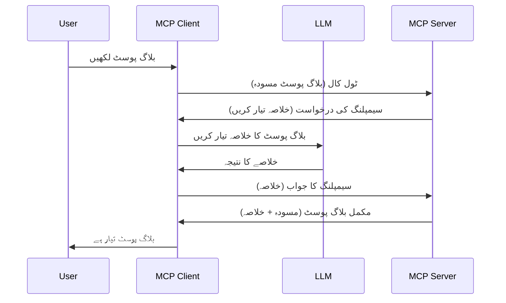

# سیمپلنگ - فیچرز کو کلائنٹ کو تفویض کرنا

کبھی کبھار، آپ کو MCP کلائنٹ اور MCP سرور کو مل کر ایک مشترکہ مقصد حاصل کرنے کی ضرورت ہوتی ہے۔ آپ کے پاس ایک ایسا کیس ہو سکتا ہے جہاں سرور کو کلائنٹ پر موجود LLM کی مدد درکار ہو۔ اس صورت میں، سیمپلنگ وہ طریقہ ہے جو آپ کو استعمال کرنا چاہیے۔

آئیے کچھ استعمال کے کیسز کو دیکھتے ہیں اور سیمپلنگ پر مشتمل حل بنانے کا طریقہ جانتے ہیں۔

## جائزہ

اس سبق میں، ہم سیمپلنگ کب اور کہاں استعمال کرنی ہے اور اسے کیسے ترتیب دینا ہے، اس پر توجہ مرکوز کریں گے۔

## سیکھنے کے مقاصد

اس باب میں، ہم:

- بیان کریں گے کہ سیمپلنگ کیا ہے اور اسے کب استعمال کرنا چاہیے۔
- دکھائیں گے کہ MCP میں سیمپلنگ کو کیسے ترتیب دیا جائے۔
- سیمپلنگ کے عملی استعمال کی مثالیں فراہم کریں گے۔

## سیمپلنگ کیا ہے اور اسے کیوں استعمال کریں؟

سیمپلنگ ایک جدید فیچر ہے جو درج ذیل طریقے سے کام کرتا ہے:



### سیمپلنگ کی درخواست

ٹھیک ہے، اب ہمارے پاس ایک قابل اعتبار منظر نامے کا عمومی جائزہ ہے، آئیے بات کریں اس سیمپلنگ کی درخواست کی جو سرور کلائنٹ کو بھیجتا ہے۔ JSON-RPC فارمیٹ میں ایسی درخواست اس طرح دکھ سکتی ہے:

```json
{
  "jsonrpc": "2.0",
  "id": 1,
  "method": "sampling/createMessage",
  "params": {
    "messages": [
      {
        "role": "user",
        "content": {
          "type": "text",
          "text": "Create a blog post summary of the following blog post: <BLOG POST>"
        }
      }
    ],
    "modelPreferences": {
      "hints": [
        {
          "name": "claude-3-sonnet"
        }
      ],
      "intelligencePriority": 0.8,
      "speedPriority": 0.5
    },
    "systemPrompt": "You are a helpful assistant.",
    "maxTokens": 100
  }
}
```

یہاں کچھ چیزیں قابل ذکر ہیں:

- Prompt، جسے content -> text میں رکھا گیا ہے، ہمارا پرامپٹ ہے جو LLM کو بلاگ پوسٹ کے مواد کا خلاصہ کرنے کی ہدایت دیتا ہے۔

- **modelPreferences**۔ اس سیکشن میں صرف یہ ہے، ایک ترجیح، ایک سفارش کہ LLM کے ساتھ کون سا کنفیگریشن استعمال کیا جائے۔ صارف یہ منتخب کر سکتا ہے کہ وہ ان سفارشات کے ساتھ جائے یا انہیں تبدیل کرے۔ اس کیس میں، ماڈل استعمال کرنے، رفتار اور ذہانت کی ترجیح کے بارے میں سفارشات دی گئی ہیں۔
- **systemPrompt**، یہ آپ کا معمول کا سسٹم پرامپٹ ہے جو آپ کے LLM کو شخصیت دیتا ہے اور ہدایت نامہ شامل ہوتا ہے۔
- **maxTokens**، یہ ایک اور خاصیت ہے جس سے بتایا جاتا ہے کہ اس کام کے لیے کتنے ٹوکن استعمال کرنے کی سفارش کی گئی ہے۔

### سیمپلنگ کا جواب

یہ جواب وہ ہوتا ہے جو MCP کلائنٹ آخر کار MCP سرور کو بھیجتا ہے اور یہ کلائنٹ کے LLM کو کال کرنے، اس کے جواب کا انتظار کرنے اور پھر یہ پیغام تیار کرنے کا نتیجہ ہوتا ہے۔ JSON-RPC میں یہ اس طرح نظر آ سکتا ہے:

```json
{
  "jsonrpc": "2.0",
  "id": 1,
  "result": {
    "role": "assistant",
    "content": {
      "type": "text",
      "text": "Here's your abstract <ABSTRACT>"
    },
    "model": "gpt-5",
    "stopReason": "endTurn"
  }
}
```

نوٹ کریں کہ جواب وہی خلاصہ ہے جو ہم نے بلاگ پوسٹ کے بارے میں طلب کیا تھا۔ همچنین دھیان دیں کہ استعمال شدہ `model` وہ نہیں جو ہم نے مانگا تھا بلکہ "gpt-5" ہے، "claude-3-sonnet" کے مقابلے میں۔ اس سے ظاہر ہوتا ہے کہ صارف اپنی رائے بدل سکتا ہے کہ کیا استعمال کرے اور آپ کی سیمپلنگ کی درخواست ایک سفارش ہے۔

ٹھیک ہے، اب جب ہم اصل بہاؤ کو سمجھ چکے ہیں، اور اس کام کے لیے "بلاگ پوسٹ کی تخلیق + خلاصہ" بہت مفید ہے، تو آئیے دیکھتے ہیں کہ اسے کام کرنے کے لیے ہمیں کیا کرنا ہوگا۔

### پیغام کی اقسام

سیمپلنگ کے پیغامات صرف متن تک محدود نہیں بلکہ آپ تصویریں اور آڈیو بھی بھیج سکتے ہیں۔ JSON-RPC اس طرح مختلف لگتا ہے:

**متن**

```json
{
  "type": "text",
  "text": "The message content"
}
```

**تصویری مواد**

```json
{
  "type": "image",
  "data": "base64-encoded-image-data",
  "mimeType": "image/jpeg"
}
```

**آڈیو مواد**

```json
{
  "type": "audio",
  "data": "base64-encoded-audio-data",
  "mimeType": "audio/wav"
}
```

> [!NOTE] مزید تفصیلی معلومات کے لیے سیمپلنگ پر، [سرکاری دستاویزات](https://modelcontextprotocol.io/specification/2025-11-25/client/sampling) دیکھیں۔

## کلائنٹ میں سیمپلنگ کو کیسے ترتیب دیں

> نوٹ: اگر آپ صرف سرور بنا رہے ہیں، تو آپ کو یہاں زیادہ کچھ کرنے کی ضرورت نہیں۔

کلائنٹ میں، آپ کو درج ذیل فیچر اس طرح متعین کرنا ہوگا:

```json
{
  "capabilities": {
    "sampling": {}
  }
}
```

یہ پھر اس وقت لیا جائے گا جب آپ کا منتخب کیا ہوا کلائنٹ سرور کے ساتھ شروع ہوگا۔

## سیمپلنگ کی عملی مثال - بلاگ پوسٹ بنائیں

آئیں ایک سیمپلنگ سرور کو مل کر کوڈ کریں، ہمیں درج ذیل کرنا ہوگا:

1. سرور پر ایک ٹول بنائیں۔
2. مذکورہ ٹول سیمپلنگ درخواست بنائے۔
3. ٹول کلائنٹ کی سیمپلنگ درخواست کے جواب کا انتظار کرے۔
4. پھر ٹول کا نتیجہ پیدا کرے۔

چلیں مرحلہ وار کوڈ دیکھتے ہیں:

### -1- ٹول بنائیں

**python**

```python
@mcp.tool()
async def create_blog(title: str, content: str, ctx: Context[ServerSession, None]) -> str:
    """Create a blog post and generate a summary"""

```

### -2- سیمپلنگ درخواست بنائیں

اپنے ٹول کو درج ذیل کوڈ کے ساتھ بڑھائیں:

**python**

```python
post = BlogPost(
        id=len(posts) + 1,
        title=title,
        content=content,
        abstract=""
    )

prompt = f"Create an abstract of the following blog post: title: {title} and draft: {content} "

result = await ctx.session.create_message(
        messages=[
            SamplingMessage(
                role="user",
                content=TextContent(type="text", text=prompt),
            )
        ],
        max_tokens=100,
)

```

### -3- جواب کا انتظار کریں اور جواب واپس کریں

**python**

```python
post.abstract = result.content.text

posts.append(post)

# مکمل پیداوار واپس کریں
return json.dumps({
    "id": post.title,
    "abstract": post.abstract
})
```

### -4- مکمل کوڈ

**python**

```python
from starlette.applications import Starlette
from starlette.routing import Mount, Host

from mcp.server.fastmcp import Context, FastMCP

from mcp.server.session import ServerSession
from mcp.types import SamplingMessage, TextContent

import json


from uuid import uuid4
from typing import List
from pydantic import BaseModel


mcp = FastMCP("Blog post generator")

# ایپ = FastAPI()

posts = []

class BlogPost(BaseModel):
    id: int
    title: str
    content: str
    abstract: str

posts: List[BlogPost] = []

@mcp.tool()
async def create_blog(title: str, content: str, ctx: Context[ServerSession, None]) -> str:
    """Create a blog post and generate a summary"""

    post = BlogPost(
        id=len(posts) + 1,
        title=title,
        content=content,
        abstract=""
    )

    prompt = f"Create an abstract of the following blog post: title: {title} and draft: {content} "

    result = await ctx.session.create_message(
        messages=[
            SamplingMessage(
                role="user",
                content=TextContent(type="text", text=prompt),
            )
        ],
        max_tokens=100,
    )

    post.abstract = result.content.text

    posts.append(post)

    # مکمل بلاگ پوسٹ واپس کریں
    return json.dumps({
        "id": post.title,
        "abstract": post.abstract
    })

if __name__ == "__main__":
    print("Starting server...")
    # mcp چلائیں()
    mcp.run(transport="streamable-http")

# ایپ چلائیں: python server.py
```

### -5- Visual Studio Code میں اس کی جانچ کریں

Visual Studio Code میں اس کی جانچ کے لیے درج ذیل کریں:

1. ٹرمینل میں سرور شروع کریں
2. اسے *mcp.json* میں شامل کریں (اور یقینی بنائیں کہ سرور چل رہا ہے)۔ کچھ اس طرح:

   ```json
   "servers": {
      "blog-server": {
        "type": "http",
        "url": "http://localhost:8000/mcp"
      }
   }
   ```

3. پرامپٹ ٹائپ کریں:

   ```text
   create a blog post named "Where Python comes from", the content is "Python is actually named after Monty Python Flying Circus"
   ```

4. سیمپلنگ عمل کو مکمل ہونے دیں۔ پہلی بار جب آپ یہ ٹیسٹ کریں گے تو آپ کے سامنے ایک اضافی ڈائیلاگ آئے گا جسے آپ کو قبول کرنا ہوگا، پھر آپ کو عام ڈائیلاگ نظر آئے گا جس میں ٹول چلانے کی اجازت مانگی جائے گی۔

5. نتائج کا معائنہ کریں۔ آپ نتائج GitHub Copilot Chat میں خوبصورتی سے دیکھ سکیں گے اور ساتھ ہی آپ raw JSON جواب کو بھی دیکھ سکتے ہیں۔

**بونس**۔ Visual Studio Code کا ٹولنگ سیمپلنگ کے لیے بہترین حمایت رکھتا ہے۔ آپ اپنے انسٹال شدہ سرور پر سیمپلنگ تک رسائی درج ذیل سے ترتیب دے سکتے ہیں:

1. ایکسٹینشن حصے میں جائیں۔
2. "MCP SERVERS - INSTALLED" سیکشن میں اپنے انسٹال شدہ سرور کے لیے کوگ آئیکون منتخب کریں۔
3. "Configure Model Access" منتخب کریں، یہاں آپ یہ منتخب کر سکتے ہیں کہ GitHub Copilot سیمپلنگ کرتے وقت کون سے ماڈلز استعمال کر سکتا ہے۔ آپ حالیہ سیمپلنگ کی درخواستیں بھی "Show Sampling requests" منتخب کر کے دیکھ سکتے ہیں۔

## اسائنمنٹ

اس اسائنمنٹ میں، آپ ایک تھوڑا مختلف سیمپلنگ بنائیں گے، یعنی ایک سیمپلنگ انٹیگریشن جو پروڈکٹ کی وضاحت تخلیق کرنے کی حمایت کرتا ہے۔ آپ کا منظر نامہ یہ ہے:

**منظر نامہ**: ایک ای کامرس کے بک آفس ورکر کو مدد کی ضرورت ہے، پروڈکٹ کی وضاحتیں بنانے میں بہت زیادہ وقت لگتا ہے۔ لہٰذا، آپ ایسا حل بنائیں جہاں آپ "create_product" نامی ٹول کو "title" اور "keywords" دلائل کے ساتھ کال کر سکیں اور یہ مکمل پروڈکٹ پیدا کرے، جس میں "description" فیلڈ شامل ہو جو کلائنٹ کے LLM سے بھرا جائے۔

TIP: جو کچھ آپ نے پہلے سیکھا، اسی کو استعمال کرتے ہوئے یہ سرور اور اس کا ٹول سیمپلنگ درخواست کے ذریعے بنائیں۔

## حل

[حل](./solution/README.md)

## اہم نکات

سیمپلنگ ایک طاقتور فیچر ہے جو سرور کو اجازت دیتا ہے کہ جب اسے LLM کی مدد کی ضرورت ہو تو وہ کام کلائنٹ کو تفویض کر دے۔

## آگے کیا ہے

- [باب 4 - عملی نفاذ](../../04-PracticalImplementation/README.md)

---

<!-- CO-OP TRANSLATOR DISCLAIMER START -->
**ڈس کلیمر**:
یہ دستاویز AI ترجمہ سروس [Co-op Translator](https://github.com/Azure/co-op-translator) کے ذریعے ترجمہ کی گئی ہے۔ جبکہ ہم درستگی کے لیے کوشاں ہیں، براہ کرم اس بات سے آگاہ رہیں کہ خودکار ترجمے میں غلطیاں یا عدم درستیاں ہو سکتی ہیں۔ اصل دستاویز اپنے مادری زبان میں مستند ماخذ سمجھی جائے گی۔ حساس معلومات کے لیے پیشہ ور انسانی ترجمہ کی سفارش کی جاتی ہے۔ اس ترجمے کے استعمال سے پیدا ہونے والی کسی بھی غلط فہمی یا غلط تشریح کی ذمہ داری ہم قبول نہیں کرتے۔
<!-- CO-OP TRANSLATOR DISCLAIMER END -->