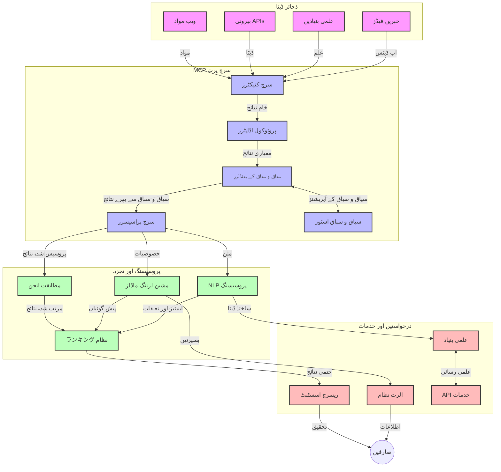
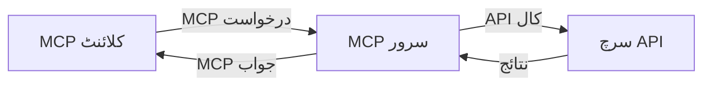
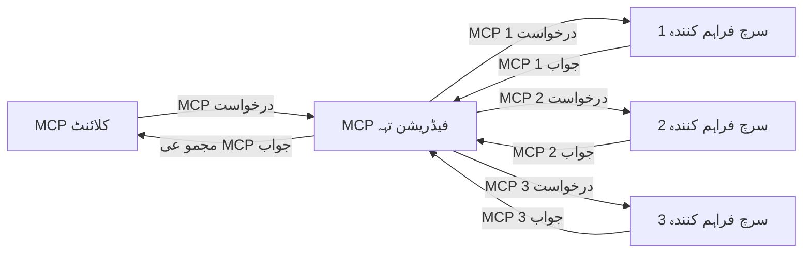
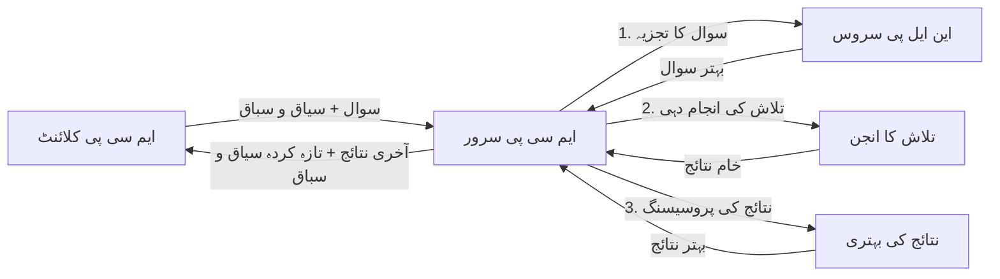

# حقیقی وقت ویب سرچ کے لیے ماڈل کانٹیکسٹ پروٹوکول

## جائزہ

حقیقی وقت ویب سرچ آج کے معلومات پر مبنی ماحول میں نہایت اہم ہو چکی ہے، جہاں ایپلیکیشنز کو انٹرنیٹ پر تازہ ترین معلومات تک فوری رسائی درکار ہوتی ہے تاکہ متعلقہ اور فوری جوابات فراہم کیے جا سکیں۔ ماڈل کانٹیکسٹ پروٹوکول (MCP) ان حقیقی وقت کی تلاش کے عمل کو بہتر بنانے میں ایک نمایاں پیش رفت کی نمائندگی کرتا ہے، تلاش کی کارکردگی کو بڑھانا، کانٹیکسچوئل سالمیت کو برقرار رکھنا اور مجموعی نظام کی کارکردگی کو بہتر بنانا۔

یہ ماڈیول اس بات کو دریافت کرتا ہے کہ MCP کیسے AI ماڈلز، سرچ انجنز اور ایپلیکیشنز کے درمیان کانٹیکسٹ مینجمنٹ کے لیے معیاری طریقہ کار فراہم کر کے حقیقی وقت کی ویب تلاش کو تبدیل کرتا ہے۔

### آپ کیا سیکھیں گے

اس جامع گائیڈ میں آپ دریافت کریں گے:

- MCP کیسے AI ماڈلز اور حقیقی وقت ویب سرچ کی صلاحیتوں کے درمیان ہموار پل قائم کرتا ہے
- MCP کے ساتھ مؤثر اور قابل توسیع سرچ حل بنانے کے لیے آرکیٹیکچرل پیٹرنز
- متعدد سوالات اور تعاملات کے دوران تلاش کے کانٹیکسٹ کو برقرار رکھنے کی تکنیکیں
- مختلف سرچ منظرناموں کے لیے Python اور JavaScript میں عملی کوڈ امپلیمنٹیشنز
- MCP سے چلنے والے تلاش کے نظاموں میں ارتباط، تازگی، اور کارکردگی کے درمیان توازن برقرار رکھنے کے طریقے

## حقیقی وقت ویب سرچ کا تعارف

حقیقی وقت ویب سرچ ایک تکنیکی طریقہ کار ہے جو ویب پر موجود معلومات کی مسلسل تلاش، پراسیسنگ اور تجزیہ کو قابل بناتا ہے جیسے ہی وہ شائع یا اپ ڈیٹ ہوں، تاکہ نظام کم سے کم تاخیر کے ساتھ تازہ اور متعلقہ معلومات فراہم کر سکیں۔ روایتی تلاش کے نظاموں کے برعکس جو انڈیکس شدہ ڈیٹا پر کام کرتے ہیں جو گھنٹوں یا دنوں پرانا ہو سکتا ہے، حقیقی وقت کی تلاش ویب سے لائیو ڈیٹا کو پروسیس کرتی ہے، اور آن لائن مواد کی موجودہ حالت کی عکاسی کرتی معلومات اور بصیرت فراہم کرتی ہے۔

### حقیقی وقت ویب سرچ کے بنیادی تصورات:

- **مسلسل سوال کی پراسیسنگ**: تلاش کے سوالات مستقل اپ ڈیٹ ہونے والے ڈیٹا ذرائع کے خلاف پروسیس کیے جاتے ہیں
- **تازگی کو فوقیت دینا**: نظام تازہ ترین معلومات کو ترجیح دیتے ہیں
- **مناسبیت کا توازن**: ارتباط اور تازگی کے درمیان توازن برقرار رکھنا
- **قابل توسیع فن تعمیر**: نظام کو مختلف سوالات کے حجم اور ڈیٹا کی مقدار سنبھالنی چاہیے
- **سیاق و سباق کی تفہیم**: تلاش کے دوران صارف کے سیاق و سباق کو برقرار رکھنا معنی خیز نتائج کے لیے نہایت اہم ہے
- **متحرک سوال کی دوبارہ تشکیل**: سیاق و سباق اور پچھلے نتائج کے مطابق سوالات کا لچکدار ترمیم کرنا
- **کثیر ماخذ انضمام**: متعدد سرچ فراہم کنندگان اور ویب ذرائع سے نتائج کو یکجا کرنا
- **معنوی سمجھ بوجھ**: صرف کلیدی الفاظ کی بجائے معنی کی بنیاد پر سوالات اور مواد کی پراسیسنگ
- **حقیقی وقت درجہ بندی**: جیسے جیسے نئی معلومات دستیاب ہوں، نتائج کی درجہ بندی کو مسلسل ایڈجسٹ کرنا

### ماڈل کانٹیکسٹ پروٹوکول اور حقیقی وقت ویب سرچ

ماڈل کانٹیکسٹ پروٹوکول (MCP) حقیقی وقت ویب سرچ کے ماحول میں چند اہم چیلنجوں کو حل کرتا ہے:

1. **تلاش کے کانٹیکسٹ کا تحفظ**: MCP معیاری طور پر تلاش کے کانٹیکسٹ کو متعدد تلاش کے اجزاء میں برقرار رکھتا ہے، اس بات کو یقینی بناتا ہے کہ AI ماڈلز اور پراسیسنگ نوڈز کو متعلقہ سوالات کی تاریخ اور صارف کی ترجیحات تک رسائی حاصل ہو۔

2. **موثر سوال مینجمنٹ**: کانٹیکسٹ ٹرانسمیشن کے لیے ساختہ طریقے فراہم کر کے، MCP ہر تلاش کی دوبارہ عملداری میں کانٹیکسٹ دہرانے کے اضافی بوجھ کو کم کرتا ہے۔

3. **انٹرآپریبلٹی**: MCP مختلف تلاش کی ٹیکنالوجیز اور AI ماڈلز کے درمیان کانٹیکسٹ شیئرنگ کے لیے ایک مشترکہ زبان تشکیل دیتا ہے، جو زیادہ لچکدار اور توسیعی فن تعمیرات کو ممکن بناتا ہے۔

4. **تلاش کے لیے بہتر شدہ کانٹیکسٹ**: MCP کی عمل آوری تلاش کی مؤثریت کے لیے سب سے زیادہ متعلقہ کانٹیکسچوئل عناصر کو ترجیح دے سکتی ہے، کارکردگی اور درستگی دونوں کے لیے اصلاح کر کے۔

5. **مطابقت پذیر سرچ پراسیسنگ**: MCP کے ذریعے مناسب کانٹیکسٹ مینجمنٹ کے ساتھ، تلاش کے نظام صارف کی بدلتی ضروریات اور معلومات کے منظرناموں کی بنیاد پر پراسیسنگ کو متحرک طور پر ایڈجسٹ کر سکتے ہیں۔

جدید ایپلیکیشنز جیسے کہ نیوز ایگریگیشن سے لے کر تحقیقی معاون تک MCP اور ویب سرچ ٹیکنالوجیز کی مشترکہ انضمام زیادہ ذہین، سیاق و سباق پر مبنی تلاش کو ممکن بناتی ہے جو صارف کے تعاملات کے ساتھ مزید متعلقہ نتائج فراہم کرتی ہے۔

## سیکھنے کے مقاصد

اس سبق کے اختتام پر آپ قادر ہوں گے کہ:

- حقیقی وقت ویب سرچ کی بنیادی باتوں اور جدید ایپلیکیشنز میں اس کے چیلنجوں کو سمجھیں
- وضاحت کریں کہ ماڈل کانٹیکسٹ پروٹوکول (MCP) حقیقی وقت ویب سرچ کی صلاحیتوں کو کس طرح بہتر بناتا ہے
- مشہور فریم ورکس اور API کے استعمال سے MCP پر مبنی تلاش کے حل نافذ کریں
- MCP کے ساتھ قابل توسیع، اعلی کارکردگی کی سرچ آرکیٹیکچر ڈیزائن اور تعینات کریں
- MCP تصورات کو معنوی سرچ، تحقیقی معاونت، اور AI سے معاونت یافتہ براؤزنگ سمیت مختلف استعمال کے کیسز پر لاگو کریں
- MCP پر مبنی تلاش کی ٹیکنالوجیز میں ابھرتے ہوئے رجحانات اور مستقبل کی جدتوں کا جائزہ لیں
- صارف کے تعاملات سے سیکھنے والے کانٹیکسٹ پر مبنی تلاش کے نظام تیار کریں
- معیاری MCP پروٹوکولز کا استعمال کرتے ہوئے AI معاونین میں ویب تلاش کی صلاحیت کو ضم کریں
- متعدد مراحل کی تلاش کی پائپ لائنز بنائیں جو کانٹیکسٹ کی بنیاد پر نتائج کو بتدریج بہتر بنائیں
- تلاش کی کارکردگی کو بہتر بنائیں جبکہ مکمل کانٹیکسٹ آگاہی برقرار رکھیں

### تعریف اور اہمیت

حقیقی وقت ویب سرچ کا مطلب ہے ویب پر مبنی معلومات کی مسلسل تلاش، بازیابی، اور کم سے کم تاخیر کے ساتھ فراہمی۔ روایتی سرچ انجن جو وقتاً فوقتاً ویب کو کرو کرتے اور انڈیکس بناتے ہیں، کے برعکس، حقیقی وقت سرچ معلومات کو جیسے ہی دستیاب ہو ظاہر کرتی ہے، فوری رسائی فراہم کرتی ہے۔

حقیقی وقت ویب سرچ کی خصوصیات میں شامل ہیں:

- **تازگی**: حالیہ مواد اور اپ ڈیٹس کو اولین ترجیح دینا
- **مسلسل پراسیسنگ**: نئی معلومات کی مستقل نگرانی
- **سوال کی مطابقت**: کانٹیکسٹ اور فیڈ بیک کی بنیاد پر تلاش کے سوالات کی بہتری
- **فوری فراہمی**: کم سے کم تاخیر کے ساتھ تلاش کے نتائج فراہم کرنا
- **کانٹیکسٹ کی برقراری**: بہتر ارتباط کے لیے پچھلے سوالات پر مبنی تعمیر

### روایتی ویب سرچ میں چیلنجز

روایتی ویب سرچ کے طریقے حقیقی وقت کے منظرناموں میں کئی حدود کا سامنا کرتے ہیں:

1. **کانٹیکسٹ کی تقسیم**: متعدد سوالات کے دوران تلاش کے کانٹیکسٹ کو برقرار رکھنے میں دشواری
2. **معلومات کی تازگی**: تازہ ترین معلومات تک رسائی اور اسے ترجیح دینے میں مشکلات
3. **انضمام کی پیچیدگی**: تلاش کے نظاموں اور ایپلیکیشنز کے درمیان انٹرآپریبلٹی کے مسائل
4. **تاخیر کے مسائل**: جواب کے وقت کے تقاضوں کے ساتھ مکمل تلاش کا توازن برقرار رکھنا
5. **مناسبیت کی ایڈجسٹمنٹ**: تازگی کو ترجیح دیتے ہوئے درستگی اور مناسبیت کو یقینی بنانا

## تلاش کے لیے ماڈل کانٹیکسٹ پروٹوکول (MCP) سمجھنا

### تلاش کے سیاق و سباق میں MCP کیا ہے؟

ماڈل کانٹیکسٹ پروٹوکول (MCP) ایک معیاری مواصلاتی پروٹوکول ہے جو AI ماڈلز اور ایپلیکیشنز کے درمیان موثر تعامل کو آسان بناتا ہے۔ حقیقی وقت ویب سرچ کے سیاق میں، MCP کے فریم ورک کے ذریعے یہ ممکن ہوتا ہے:

- سوالات کی تسلسل کے دوران تلاش کے کانٹیکسٹ کو برقرار رکھنا
- تلاش کے سوال اور نتائج کے فارمیٹس کو معیاری بنانا
- تلاش کے پیرا میٹرز اور نتائج کی ترسیل کو بہتر بنانا
- ماڈل اور سرچ انجن کے درمیان مواصلات کو بڑھانا

### بنیادی اجزاء اور فن تعمیر

حقیقی وقت ویب سرچ کے لیے MCP فن تعمیر کے اہم اجزاء یہ ہیں:

1. **سوال کے کانٹیکسٹ ہینڈلرز**: متعدد سوالات کے دوران تلاش کے کانٹیکسٹ کا انتظام اور حفاظت کرتے ہیں
2. **تلاش پروسیسرز**: کانٹیکسٹ آگاہ تکنیکوں کے ذریعے آنے والی تلاش کی درخواستوں کو پراسیس کرتے ہیں
3. **پروٹوکول ایڈاپٹرز**: مختلف سرچ API کے درمیان تبدیلی کرتے ہیں جبکہ کانٹیکسٹ برقرار رکھتے ہیں
4. **کانٹیکسٹ اسٹور**: تلاش کی تاریخ اور ترجیحات کو مؤثر طریقے سے محفوظ اور بازیافت کرتا ہے
5. **تلاش کنیکٹرز**: مختلف سرچ انجنز اور ویب API سے رابطہ قائم کرتے ہیں



### MCP حقیقی وقت ویب سرچ کو کیسے بہتر بناتا ہے

MCP روایتی ویب سرچ چیلنجوں کو درج ذیل طریقوں سے حل کرتا ہے:

- **کانٹیکسچوئل تسلسل**: پوری تلاش سیشن میں سوالات کے تعلقات کو برقرار رکھنا
- **بہتر ترسیل**: ذہین کانٹیکسٹ مینجمنٹ کے ذریعے تلاش کے پیرا میٹرز میں تکرار کم کرنا
- **معیاری انٹرفیسز**: تلاش کے اجزاء کے لیے مستقل API فراہم کرنا
- **کمی تاخیر**: مؤثر کانٹیکسٹ ہینڈلنگ کے ذریعے پراسیسنگ کے بوجھ کو کم کرنا
- **بہتر ارتباط**: متعدد سوالات میں صارف کی نیت کو محفوظ کر کے تلاش کی مطابقت کو بڑھانا

## انضمام اور نفاذ

حقیقی وقت ویب سرچ کے نظاموں کو کارکردگی اور کانٹیکسچوئل سالمیت کو برقرار رکھنے کے لیے محتاط فن تعمیر اور نفاذ کی ضرورت ہوتی ہے۔ ماڈل کانٹیکسٹ پروٹوکول AI ماڈلز اور سرچ ٹیکنالوجیز کے انضمام کے لیے معیاری طریقہ فراہم کرتا ہے، جو زیادہ پیچیدہ اور سیاق و سباق کی بنیاد پر کام کرنے والی سرچ پائپ لائنز کو ممکن بناتا ہے۔

### تلاش کے فن تعمیرات میں MCP انضمام کا جائزہ

حقیقی وقت ویب سرچ کے ماحول میں MCP نافذ کرنے کے لیے چند اہم پہلوؤں پر دھیان دینا ہوتا ہے:

1. **تلاش کے کانٹیکسٹ کی سیریلائزیشن**: MCP تلاش کی درخواستوں میں کانٹیکسچوئل معلومات کو موثر طریقے سے انکوڈ کرنے کے لیے طریقے فراہم کرتا ہے، اس بات کو یقینی بناتے ہوئے کہ ضروری سیاق و سباق پوری پراسیسنگ پائپ لائن کے دوران سوال کے ساتھ چلتا رہے۔ اس میں تلاش سے متعلق میٹا ڈیٹا کے لیے معیاری سیریلائزیشن فارمیٹس شامل ہیں۔

2. **اسٹیٹ فل سرچ پراسیسنگ**: MCP مسلسل کانٹیکسٹ کی نمائندگی کو برقرار رکھتے ہوئے مزید ذہین اسٹیٹ فل پراسیسنگ کو ممکن بناتا ہے۔ یہ خاص طور پر کثیر مرحلہ تلاش پائپ لائنز میں کارآمد ہے جہاں کانٹیکسٹ کی بہتری سے نتائج بہتر ہوتے ہیں۔

3. **سوال کی توسیع اور اصلاح**: MCP کی عمل داری تلاش کے نظام میں جمع شدہ کانٹیکسٹ کی بنیاد پر پیچیدہ سوالات کی توسیع اور اصلاح میں مدد کر سکتی ہے، جس سے تلاش کے دوران نتائج کو بتدریج بہتر بنایا جا سکتا ہے۔

4. **نتائج کی کیشنگ اور ترجیح**: MCP کے ذریعے کانٹیکسٹ ہینڈلنگ کو معیاری بنانے سے نتائج کی کیشنگ اور ترجیح کا انتظام آسان ہوتا ہے، جس سے اجزاء بدلتے ہوئے تلاش کے کانٹیکسٹ کے مطابق خود کو ایڈجسٹ کر سکتے ہیں۔

5. **تلاش کا وفاقی اور مجموعہ عمل**: MCP متعدد بیک اینڈز کے درمیان تلاش کی زیادہ پیچیدہ وفاق سازی کو سہولت فراہم کرتا ہے، تلاش کے کانٹیکسٹ کی ساختہ نمائندگی فراہم کر کے مختلف ذرائع سے نتائج کے معنی خیز مجموعہ کو ممکن بناتا ہے۔

مختلف تلاش کی ٹیکنالوجیز میں MCP کا نفاذ کانٹیکسٹ مینجمنٹ کے لیے ایک متحد طریقہ بناتا ہے، حسب ضرورت انضمام کوڈ کی ضرورت کو کم کرتا ہے اور تلاش کے سوالات کے ارتقا کے دوران معنی خیز کانٹیکسٹ کو برقرار رکھنے کی صلاحیت کو بڑھاتا ہے۔

### مختلف ویب سرچ عمل درآمدات میں MCP

یہ مثالیں موجودہ MCP وضاحت کی پیروی کرتی ہیں جو JSON-RPC پر مبنی پروٹوکول پر مرکوز ہے جس میں مختلف ٹرانسپورٹ میکانزمز شامل ہیں۔ کوڈ دکھاتا ہے کہ آپ کس طرح MCP پروٹوکول کے ساتھ مکمل مطابقت رکھتے ہوئے کسٹم سرچ انضمام کر سکتے ہیں۔

<details>
<summary>جنریٹک سرچ API کے ساتھ Python کی عمل آوری</summary>

```python
import asyncio
import json
import aiohttp
from typing import Dict, Any, Optional, List
from contextlib import asynccontextmanager
from collections.abc import AsyncIterator

# اسٹینڈرڈ MCP لائبریریاں درآمد کریں
from mcp.client.session import ClientSession
from mcp.client.streamable_http import streamablehttp_client
from mcp.types import TextContent, CreateMessageRequestParams, CreateMessageResult
from mcp.server.fastmcp import FastMCP

# ویب سرچ کے لیے FastMCP سرور بنائیں
search_server = FastMCP("WebSearch")

# ویب سرچ کے آپریشنز سنبھالنے کے لیے کلاس
class WebSearchHandler:
    def __init__(self, api_endpoint: str, api_key: str):
        self.api_endpoint = api_endpoint
        self.api_key = api_key
        self.session = None
        
    async def initialize(self):
        """Initialize the HTTP session"""
        self.session = aiohttp.ClientSession(
            headers={"Authorization": f"Bearer {self.api_key}"}
        )
    
    async def close(self):
        """Close the HTTP session"""
        if self.session:
            await self.session.close()
            
    async def perform_search(self, query: str, max_results: int = 5, 
                           include_domains: List[str] = None, 
                           exclude_domains: List[str] = None,
                           time_period: str = "any") -> Dict[str, Any]:
        """Perform web search using the search API"""
        # سرچ پیرا میٹرز تیار کریں
        search_params = {
            "q": query,
            "limit": max_results,
            "time": time_period
        }
        
        if include_domains:
            search_params["site"] = ",".join(include_domains)
            
        if exclude_domains:
            search_params["exclude_site"] = ",".join(exclude_domains)
        
        # سرچ کی درخواست انجام دیں
        try:
            async with self.session.get(
                self.api_endpoint,
                params=search_params
            ) as response:
                if response.status != 200:
                    error_text = await response.text()
                    raise Exception(f"Search API error: {response.status} - {error_text}")
                
                search_data = await response.json()
                
                # API خصوصی جواب کو معیاری فارمیٹ میں تبدیل کریں
                results = []
                for item in search_data.get("results", []):
                    results.append({
                        "title": item.get("title", ""),
                        "url": item.get("url", ""),
                        "snippet": item.get("snippet", ""),
                        "date": item.get("published_date", ""),
                        "source": item.get("source", "")
                    })
                
                return {
                    "query": query,
                    "totalResults": len(results),
                    "results": results
                }
        except Exception as e:
            print(f"Search API request error: {e}")
            raise

# سرچ ہینڈلر کو ابتدائی شکل دیں
search_handler = WebSearchHandler(
    api_endpoint="https://api.search-service.example/search",
    api_key="your-api-key-here"
)

# سرچ ہینڈلر کو منظم کرنے کے لیے زندگی کا دورانیہ سیٹ کریں
@asyncio.asynccontextmanager
async def app_lifespan(server: FastMCP):
    """Manage application lifecycle"""
    await search_handler.initialize()
    try:
        yield {"search_handler": search_handler}
    finally:
        await search_handler.close()

# سرور کے لیے زندگی کا دورانیہ مقرر کریں
search_server = FastMCP("WebSearch", lifespan=app_lifespan)

# ویب سرچ ٹول رجسٹر کریں
@search_server.tool()
async def web_search(query: str, max_results: int = 5, 
                   include_domains: List[str] = None,
                   exclude_domains: List[str] = None,
                   time_period: str = "any") -> Dict[str, Any]:
    """
    Search the web for information
    
    Args:
        query: The search query
        max_results: Maximum number of results to return (default: 5)
        include_domains: List of domains to include in search results
        exclude_domains: List of domains to exclude from search results
        time_period: Time period for results ("day", "week", "month", "any")
        
    Returns:
        Dictionary containing search results
    """
    ctx = search_server.get_context()
    search_handler = ctx.request_context.lifespan_context["search_handler"]
    
    results = await search_handler.perform_search(
        query=query,
        max_results=max_results,
        include_domains=include_domains,
        exclude_domains=exclude_domains,
        time_period=time_period
    )
    
    return results

# کلائنٹ کے استعمال کی مثال
async def client_example():
    # Streamable HTTP ٹرانسپورٹ استعمال کرتے ہوئے سرچ سرور سے کنیکٹ کریں
    async with streamablehttp_client("http://localhost:8000/mcp") as (read, write, _):
        async with ClientSession(read, write) as session:
            # کنکشن کو ابتدائی شکل دیں
            await session.initialize()
            
            # web_search ٹول کال کریں
            search_results = await session.call_tool(
                "web_search", 
                {
                    "query": "latest developments in AI and Model Context Protocol",
                    "max_results": 5,
                    "time_period": "day",
                    "include_domains": ["github.com", "microsoft.com"]
                }
            )
            
            print(f"Search results: {search_results}")

# سرور کی چلانے کی مثال
if __name__ == "__main__":
    # Streamable HTTP ٹرانسپورٹ کے ساتھ سرور چلائیں
    search_server.run(transport="streamable-http")
```
</details> 

<details>
<summary>براؤزر بیسڈ سرچ کے ساتھ JavaScript کی عمل آوری</summary>

```javascript
// ویب سرچ کے لیے MCP سرور کا نفاذ
import { McpServer, ResourceTemplate } from '@modelcontextprotocol/sdk/server/mcp.js';
import { StreamableHTTPServerTransport } from '@modelcontextprotocol/sdk/server/streamableHttp.js';
import { z } from 'zod';

// ویب سرچ کے لیے MCP سرور بنائیں
const searchServer = new McpServer({
    name: "BrowserSearch",
    description: "A server that provides web search capabilities"
});

// سرچ سروس کلاس
class SearchService {
    constructor(searchApiUrl, apiKey) {
        this.searchApiUrl = searchApiUrl;
        this.apiKey = apiKey;
    }

    async performSearch(parameters) {
        const {
            query = '',
            maxResults = 5,
            includeDomains = [],
            excludeDomains = [],
            timePeriod = 'any'
        } = parameters;
        
        // پیرامیٹرز کے ساتھ سرچ URL بنائیں
        const url = new URL(this.searchApiUrl);
        url.searchParams.append('q', query);
        url.searchParams.append('limit', maxResults);
        url.searchParams.append('time', timePeriod);
        
        if (includeDomains.length > 0) {
            url.searchParams.append('site', includeDomains.join(','));
        }
        
        if (excludeDomains.length > 0) {
            url.searchParams.append('exclude_site', excludeDomains.join(','));
        }
        
        try {
            const response = await fetch(url.toString(), {
                method: 'GET',
                headers: {
                    'Authorization': `Bearer ${this.apiKey}`,
                    'Content-Type': 'application/json'
                }
            });
            
            if (!response.ok) {
                const errorText = await response.text();
                throw new Error(`Search API error: ${response.status} - ${errorText}`);
            }
            
            const searchData = await response.json();
            
            // API مخصوص جواب کو معیاری شکل میں تبدیل کریں
            const results = searchData.results?.map(item => ({
                title: item.title || '',
                url: item.url || '',
                snippet: item.snippet || '',
                date: item.published_date || '',
                source: item.source || ''
            })) || [];
            
            return {
                query,
                totalResults: results.length,
                results
            };
        } catch (error) {
            console.error('Search API request error:', error);
            throw error;
        }
    }
}

// سرچ سروس کو initialize کریں
const searchService = new SearchService(
    'https://api.search-service.example/search',
    'your-api-key-here'
);

// سرور کے لیے context provider سیٹ اپ کریں
searchServer.setContextProvider(() => {
    return {
        searchService
    };
});

// ویب سرچ ٹول رجسٹر کریں
searchServer.tool({
    name: 'web_search',
    description: 'Search the web for information',
    parameters: {
        type: 'object',
        properties: {
            query: {
                type: 'string',
                description: 'The search query'
            },
            maxResults: {
                type: 'integer',
                description: 'Maximum number of results to return',
                default: 5
            },
            includeDomains: {
                type: 'array',
                items: { type: 'string' },
                description: 'List of domains to include in search results'
            },
            excludeDomains: {
                type: 'array',
                items: { type: 'string' },
                description: 'List of domains to exclude from search results'
            },
            timePeriod: {
                type: 'string',
                description: 'Time period for results',
                enum: ['day', 'week', 'month', 'any'],
                default: 'any'
            }
        },
        required: ['query']
    },
    handler: async (params, context) => {
        const { searchService } = context;
        return await searchService.performSearch(params);
    }
});

// سرچ سرور سے کنیکٹ ہونے کے لیے کلائنٹ کوڈ کا نمونہ
import { Client } from '@modelcontextprotocol/sdk/client/index.js';
import { StreamableHTTPClientTransport } from '@modelcontextprotocol/sdk/client/streamableHttp.js';

async function connectToSearchServer() {
    // سرچ سرور سے کنیکٹ کریں
    const transport = new StreamableHTTPClientTransport(
        new URL('http://localhost:8000/mcp')
    );
    
    const client = new Client({
        name: 'search-client',
        version: '1.0.0'
    });
    
    await client.connect(transport);
    
    // سرچ ٹول چلائیں
    const searchResults = await client.callTool({
        name: 'web_search',
        arguments: {
            query: 'Model Context Protocol implementation examples',
            maxResults: 10,
            timePeriod: 'week',
            includeDomains: ['github.com', 'docs.microsoft.com']
        }
    });
    
    console.log('Search results:', searchResults);
    
    // صفائی کریں
    await client.disconnect();
}

// سرور شروع کریں
const transport = new StreamableHTTPServerTransport();
await searchServer.connect(transport);
console.log('Search server running at http://localhost:8000/mcp');

// ایک علیحدہ عمل میں یا سرور شروع ہونے کے بعد
// connectToSearchServer().catch(console.error);
```
</details> 

## کوڈ مثالوں کا ڈس کلیمر

> **اہم نوٹ**: ذیل کی کوڈ مثالیں ماڈل کانٹیکسٹ پروٹوکول (MCP) کو ویب سرچ فعالیت کے ساتھ شامل کرنے کا مظاہرہ کرتی ہیں۔ اگرچہ یہ سرکاری MCP SDK کے پیٹرنز اور ڈھانچے کی پیروی کرتی ہیں، مگر تعلیمی مقاصد کے لیے آسان بنائی گئی ہیں۔
> 
> یہ مثالیں پیش کرتی ہیں:
> 
> 1. **Python عمل آوری**: ایک FastMCP سرور کی مثال جو ویب سرچ ٹول فراہم کرتا ہے اور بیرونی سرچ API سے جڑتا ہے۔ یہ مثال زندگی کے دورانیے کے انتظام، کانٹیکسٹ ہینڈلنگ، اور صحیح ٹول امپلیمنٹیشن کو ظاہر کرتی ہے جیسا کہ [سرکاری MCP Python SDK](https://github.com/modelcontextprotocol/python-sdk) میں ہے۔ سرور تجویز کردہ Streamable HTTP ٹرانسپورٹ استعمال کرتا ہے جو پروڈکشن تعینات کے لیے پرانے SSE ٹرانسپورٹ سے بہتر ہے۔
> 
> 2. **JavaScript عمل آوری**: TypeScript/JavaScript میں FastMCP پیٹرن کا استعمال کرتے ہوئے سرکاری MCP TypeScript SDK سے سرچ سرور بنانے کی مثال، مناسب ٹول کی تعریف اور کلائنٹ کنکشنز کے ساتھ۔ یہ سیشن مینجمنٹ اور کانٹیکسٹ تحفظ کے تازہ ترین معیاری پیٹرنز کی پیروی کرتا ہے۔
> 
> یہ مثالیں مزید ایرر ہینڈلنگ، توثیق، اور مخصوص API انضمام کوڈ کی ضرورت رکھتی ہیں تاکہ پروڈکشن میں استعمال کی جا سکیں۔ دکھائے گئے سرچ API اینڈ پوائنٹس (`https://api.search-service.example/search`) پلیس ہولڈر ہیں اور انہیں اصل سرچ سروس اینڈ پوائنٹس سے تبدیل کرنا ہوگا۔
> 
> مکمل نفاذ کی تفصیلات اور تازہ ترین طریقوں کے لیے براہ کرم [سرکاری MCP وضاحت](https://spec.modelcontextprotocol.io/) اور SDK ڈاکیومنٹیشن دیکھیں۔

## بنیادی تصورات

### ماڈل کانٹیکسٹ پروٹوکول (MCP) فریم ورک

اپنے بنیادی اصولوں پر، ماڈل کانٹیکسٹ پروٹوکول AI ماڈلز، ایپلیکیشنز، اور سروسز کے درمیان کانٹیکسٹ کے تبادلے کے لیے معیاری طریقہ فراہم کرتا ہے۔ حقیقی وقت ویب سرچ میں، یہ فریم ورک مربوط، کثیر مرحلہ تلاش کے تجربات تخلیق کرنے کے لیے ناگزیر ہے۔ کلیدی اجزاء شامل ہیں:

1. **کلائنٹ-سرور فن تعمیر**: MCP تلاش کے کلائنٹس (درخواست دہندگان) اور تلاش کے سرورز (فراہم کنندگان) کے درمیان واضح تفریق قائم کرتا ہے، جو لچکدار تعیناتی ماڈلز کو ممکن بناتا ہے۔

2. **JSON-RPC مواصلات**: پروٹوکول پیغامات کے تبادلے کے لیے JSON-RPC استعمال کرتا ہے، جو ویب تکنالوجیز کے ساتھ مطابقت رکھتا ہے اور مختلف پلیٹ فارمز پر آسان نفاذ کی سہولت دیتا ہے۔

3. **کانٹیکسٹ مینجمنٹ**: MCP متعدد تعاملات کے دوران تلاش کے کانٹیکسٹ کو برقرار رکھنے، اپ ڈیٹ کرنے، اور استعمال کرنے کے لیے منظم طریقے متعین کرتا ہے۔

4. **ٹول کی تعریفیں**: تلاش کی صلاحیتوں کو معیاری ٹولز کے طور پر ظاہر کیا جاتا ہے جن کے واضح پیرا میٹرز اور ریٹرن ویلیوز ہوتی ہیں۔

5. **اسٹریمنگ سپورٹ**: پروٹوکول نتائج کے اسٹریمنگ کو سپورٹ کرتا ہے، جو حقیقی وقت تلاش میں ضروری ہے جہاں نتائج بتدریج آ سکتے ہیں۔

### ویب سرچ انضمام کے پیٹرنز

MCP کو ویب سرچ کے ساتھ انضمام کرتے وقت کئی پیٹرن سامنے آتے ہیں:

#### 1. براہ راست سرچ فراہم کنندہ انضمام



اس پیٹرن میں MCP سرور ایک یا زیادہ سرچ API کے ساتھ براہ راست انٹرفیس کرتا ہے، MCP درخواستوں کو API مخصوص کالز میں ترجمہ کرتا ہے اور نتائج کو MCP جوابات کی شکل دیتا ہے۔

#### 2. کانٹیکسٹ تحفظ کے ساتھ وفاقی تلاش



اس پیٹرن میں متعدد MCP مطابقت رکھنے والے سرچ فراہم کنندگان کے درمیان تلاش کے سوالات تقسیم کیے جاتے ہیں، ہر ایک ممکنہ طور پر مختلف قسم کے مواد یا تلاش کی صلاحیتوں میں مہارت رکھتا ہے، جبکہ یکساں کانٹیکسٹ کو برقرار رکھا جاتا ہے۔

#### 3. کانٹیکسٹ سے مالا مال تلاش چین



اس پیٹرن میں تلاش کے عمل کو متعدد مراحل میں تقسیم کیا جاتا ہے، جہاں ہر مرحلے میں کانٹیکسٹ کو بہتر بنایا جاتا ہے، جس سے نتائج بتدریج زیادہ متعلقہ بن جاتے ہیں۔

### تلاش کے کانٹیکسٹ کے اجزاء

MCP پر مبنی ویب تلاش میں کانٹیکسٹ عام طور پر شامل ہوتا ہے:

- **سوالات کی تاریخ**: سیشن میں پچھلے تلاش کے سوالات
- **صارف کی ترجیحات**: زبان، علاقہ، سیف سرچ کی ترتیبات
- **تفاعلات کی تاریخ**: کون سے نتائج پر کلک کیا گیا، نتائج پر گزارا گیا وقت
- **تلاش کے پیرا میٹرز**: فلٹرز، ترتیب کے قواعد، اور دیگر تلاش میں تبدیلیاں
- **موضوعاتی علم**: تلاش سے متعلق موضوعاتی کانٹیکسٹ
- **عصری کانٹیکسٹ**: وقت پر مبنی ارتباط کے عوامل
- **ذرائع کی ترجیحات**: قابل اعتماد یا ترجیحی معلومات کے ذرائع

## استعمال کے کیسز اور ایپلیکیشنز

### تحقیق اور معلومات اکٹھا کرنا

MCP تحقیقی ورک فلو کو بہتر بناتا ہے:

- تلاش کے سیشنز میں تحقیقی کانٹیکسٹ کو برقرار رکھ کر
- زیادہ پیچیدہ اور کانٹیکسچوئل متعلقہ سوالات کو سہولت فراہم کرکے
- کثیر ماخذ سرچ فیڈریشن کی مدد سے
- تلاش کے نتائج سے معلومات کا استخراج آسان بنا کر

### حقیقی وقت خبریں اور رجحانات کی نگرانی

MCP سے چلنے والی تلاش نیوز مانیٹرنگ کے لیے فوائد فراہم کرتی ہے:

- ابھرتی ہوئی خبروں کی تقریباً حقیقی وقت دریافت
- متعلقہ معلومات کا کانٹیکسچوئل فلٹرنگ
- متعدد ذرائع میں موضوعات اور اداروں کا تعاقب
- صارف کے کانٹیکسٹ کی بنیاد پر شخصی خبریں الرٹس

### AI سے معاونت یافتہ براؤزنگ اور تحقیق

MCP AI سے معاونت یافتہ براؤزنگ کے لیے نئی ممکنات تخلیق کرتا ہے:

- موجودہ براؤزر سرگرمی پر مبنی کانٹیکسچوئل تلاش تجاویز
- LLM سے چلنے والے معاونین کے ساتھ ویب تلاش کا ہموار انضمام
- برقرار رہنے والے کانٹیکسٹ کے ساتھ کثیر مرحلہ تلاش کی بہتری
- حقائق کی تصدیق اور معلومات کی جانچ پڑتال میں اضافہ

## مستقبل کے رجحانات اور جدتیں

### ویب سرچ میں MCP کی ترقی

مستقبل کو دیکھتے ہوئے، ہم توقع رکھتے ہیں کہ MCP درج ذیل مسائل کو حل کرنے کے لیے ارتقا پزیر ہوگا:
- **کثیرالنوع تلاش**: متن، تصویر، آڈیو، اور ویڈیو تلاش کو مربوط کرتے ہوئے سیاق و سباق کو محفوظ رکھنا  
- **غیر مرکزی تلاش**: تقسیم شدہ اور وفاقی تلاش کے ماحولیاتی نظام کی حمایت  
- **تلاش کی پرائیویسی**: سیاق و سباق سے واقف پرائیویسی محفوظ تلاش کے طریقے  
- **سوال کی سمجھ بوجھ**: نیچرل لینگویج تلاش کے سوالات کی گہری سیمانٹک تجزیہ  

### ٹیکنالوجی میں ممکنہ پیش رفت

ابھرنے والی ٹیکنالوجیز جو MCP تلاش کے مستقبل کو شکل دیں گی:

1. **نیورل سرچ آرکیٹیکچرز**: MCP کے لیے ایمبیڈنگ پر مبنی تلاش کے نظام  
2. **ذاتی نوعیت کا تلاش سیاق و سباق**: وقت کے ساتھ انفرادی صارف کے تلاش کے نمونوں کو سیکھنا  
3. **نالج گراف انٹیگریشن**: دائرہ کار مخصوص نالج گراف سے بہتر سیاق و سباق کی تلاش  
4. **عبور النوع سیاق و سباق**: مختلف تلاش کے طریقوں کے درمیان سیاق و سباق کو برقرار رکھنا  

## عملی مشقیں

### مشق 1: بنیادی MCP تلاش پائپ لائن کی ترتیب

اس مشق میں، آپ سیکھیں گے کہ کیسے:  
- ایک بنیادی MCP تلاش کا ماحول ترتیب دیں  
- ویب تلاش کے لیے سیاق و سباق کے ہینڈلرز نافذ کریں  
- تلاش کے ادوار کے دوران سیاق و سباق کی حفاظت کی جانچ اور توثیق کریں  

### مشق 2: MCP تلاش کے ساتھ ایک تحقیقی معاون تیار کرنا

ایک مکمل درخواست بنائیں جو:  
- قدرتی زبان میں تحقیقی سوالات کو پروسیس کرے  
- سیاق و سباق کے مطابق ویب تلاش کرے  
- متعدد ذرائع سے معلومات ترکیب کرے  
- منظم تحقیقی نتائج پیش کرے  

### مشق 3: MCP کے ساتھ کثیر ماخذ تلاش وفاق کی عمل آوری

ایڈوانس مشق جس میں شامل ہیں:  
- متعدد تلاش انجنوں کو سیاق و سباق سے واقف سوالات بھیجنا  
- نتائج کی درجہ بندی اور مجموعہ  
- تلاش کے نتائج کی سیاقی نقل کو ختم کرنا  
- ماخذ مخصوص میٹاڈیٹا کا انتظام  

## اضافی وسائل

- [Model Context Protocol Specification](https://spec.modelcontextprotocol.io/) - MCP کی سرکاری وضاحت اور تفصیلی پروٹوکول دستاویزات  
- [Model Context Protocol Documentation](https://modelcontextprotocol.io/) - تفصیلی دروس اور نفاذ کے رہنما  
- [MCP Python SDK](https://github.com/modelcontextprotocol/python-sdk) - MCP پروٹوکول کا سرکاری پائتھن نفاذ  
- [MCP TypeScript SDK](https://github.com/modelcontextprotocol/typescript-sdk) - MCP پروٹوکول کا سرکاری ٹائپ اسکرپٹ نفاذ  
- [MCP Reference Servers](https://github.com/modelcontextprotocol/servers) - MCP سرورز کے حوالہ جاتی نفاذ  
- [Bing Web Search API Documentation](https://learn.microsoft.com/en-us/bing/search-apis/bing-web-search/overview) - مائیکروسافٹ کا ویب سرچ API  
- [Google Custom Search JSON API](https://developers.google.com/custom-search/v1/overview) - گوگل کا قابل پروگرام تلاش انجن  
- [SerpAPI Documentation](https://serpapi.com/search-api) - سرچ انجن نتائج صفحہ API  
- [Meilisearch Documentation](https://www.meilisearch.com/docs) - اوپن سورس تلاش انجن  
- [Elasticsearch Documentation](https://www.elastic.co/guide/index.html) - تقسیم شدہ تلاش اور تجزیاتی انجن  
- [LangChain Documentation](https://python.langchain.com/docs/get_started/introduction) - LLMs کے ساتھ ایپلیکیشنز کی تعمیر  

## سیکھنے کے نتائج

اس ماڈیول کو مکمل کرنے کے بعد، آپ کے قابل ہوں گے کہ:  

- حقیقی وقت کی ویب تلاش کے بنیادی اصولوں اور مسائل کو سمجھیں  
- وضاحت کریں کہ Model Context Protocol (MCP) حقیقی وقت کی ویب تلاش کی صلاحیتوں کو کیسے بہتر بناتا ہے  
- MCP پر مبنی تلاش کے حل کو معروف فریم ورکس اور APIs کے ذریعے نافذ کریں  
- MCP کے ساتھ توسیع پذیر، اعلی کارکردگی کے تلاش کے نظام ڈیزائن اور تعینات کریں  
- مختلف استعمال کے مقدمات جیسے سیمانٹک تلاش، تحقیقی معاونت، اور AI-مدد یافتہ براؤزنگ میں MCP تصورات کا اطلاق کریں  
- MCP پر مبنی تلاش کی ٹیکنالوجیز میں ابھرنے والے رجحانات اور مستقبل کی جدتوں کا جائزہ لیں  

### اعتماد اور حفاظت کے حوالے

جب MCP پر مبنی ویب تلاش کے حل نافذ کر رہے ہوں، تو MCP وضاحت سے مندرجہ ذیل اہم اصول یاد رکھیں:  

1. **صارف کی رضامندی اور کنٹرول**: صارفین کو واضح طور پر تمام ڈیٹا تک رسائی اور آپریشنز کی اجازت دینی ہوگی اور سمجھنا ہوگا۔ خاص طور پر ویب تلاش کی نفاذات کے لیے جو بیرونی ڈیٹا ذرائع تک رسائی حاصل کر سکتی ہیں۔  

2. **ڈیٹا کی پرائیویسی**: تلاش کے سوالات اور نتائج کو مناسب طریقے سے سنبھالیں، خاص طور پر جب وہ حساس معلومات پر مشتمل ہو سکتے ہیں۔ صارف کے ڈیٹا کی حفاظت کے لیے مناسب رسائی کنٹرول نافذ کریں۔  

3. **اوزار کی حفاظت**: تلاش کے اوزار کے لیے مناسب اجازت اور تصدیق نافذ کریں، کیونکہ یہ خودمختار کوڈ کے اجرا کے ذریعے ممکنہ سیکیورٹی خطرات پیش کرتے ہیں۔ اوزار کے رویے کی وضاحت کو تب تک غیر معتبر سمجھیں جب تک وہ کسی معتبر سرور سے حاصل نہ ہو۔  

4. **واضح دستاویزات**: اپنے MCP پر مبنی تلاش کے نفاذ کے صلاحیتوں، حدود، اور سیکیورٹی پہلوؤں کے بارے میں واضح دستاویزات فراہم کریں، MCP وضاحت کے نفاذ کے رہنما خطوط کی پیروی کرتے ہوئے۔  

5. **مضبوط رضامندی کے بہاؤ**: مضبوط رضامندی اور اجازت کے بہاؤ بنائیں جو واضح طور پر بتائیں کہ ہر اوزار کیا کرتا ہے اس کے استعمال کی اجازت دینے سے پہلے، خاص طور پر ان اوزاروں کے لیے جو بیرونی ویب وسائل کے ساتھ تعامل کرتے ہیں۔  

MCP کی سیکورٹی اور اعتماد کے حوالے سے مکمل تفصیلات کے لیے [سرکاری دستاویزات](https://modelcontextprotocol.io/specification/2025-11-25/basic/security_best_practices) دیکھیں۔  

## آگے کیا ہے

- [5.12 انٹرا ID تصدیق برائے Model Context Protocol سرورز](../mcp-security-entra/README.md)

---

<!-- CO-OP TRANSLATOR DISCLAIMER START -->
**ڈس کلیمر**:
یہ دستاویز AI ترجمہ سروس [Co-op Translator](https://github.com/Azure/co-op-translator) کے ذریعے ترجمہ کی گئی ہے۔ جبکہ ہم درستگی کے لیے کوشاں ہیں، براہ کرم اس بات سے آگاہ رہیں کہ خودکار ترجمے میں غلطیاں یا عدم درستیاں ہو سکتی ہیں۔ اصل دستاویز اپنے مادری زبان میں مستند ماخذ سمجھی جائے گی۔ حساس معلومات کے لیے پیشہ ور انسانی ترجمہ کی سفارش کی جاتی ہے۔ اس ترجمے کے استعمال سے پیدا ہونے والی کسی بھی غلط فہمی یا غلط تشریح کی ذمہ داری ہم قبول نہیں کرتے۔
<!-- CO-OP TRANSLATOR DISCLAIMER END -->