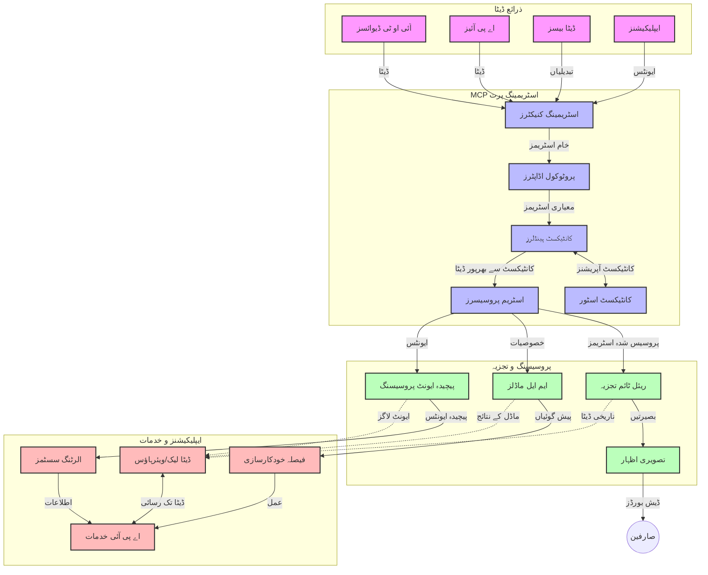

# ریئل ٹائم ڈیٹا اسٹریمینگ کے لیے ماڈل کونٹیکسٹ پروٹوکول

## جائزہ

آج کے ڈیٹا پر مبنی دنیا میں جہاں کاروبار اور ایپلیکیشنز فوری معلومات تک رسائی کے خواہاں ہیں تاکہ بر وقت فیصلے کیے جا سکیں، ریئل ٹائم ڈیٹا اسٹریمینگ لازمی ہو چکی ہے۔ ماڈل کونٹیکسٹ پروٹوکول (MCP) ان ریئل ٹائم اسٹریمینگ کے عمل کو بہتر بنانے میں ایک اہم پیش رفت کی نمائندگی کرتا ہے، جو ڈیٹا پراسیسنگ کی کارکردگی کو بڑھاتا ہے، سیاق و سباق کی سالمیت کو برقرار رکھتا ہے، اور مجموعی نظام کی کارکردگی کو بہتر بناتا ہے۔

یہ ماڈیول MCP کے ذریعے ریئل ٹائم ڈیٹا اسٹریمینگ میں تبدیلی کے طریقہ کار کو دریافت کرتا ہے، جو AI ماڈلز، اسٹریمینگ پلیٹ فارمز، اور ایپلیکیشنز میں سیاق و سباق کے انتظام کے لیے ایک معیاری طریقہ فراہم کرتا ہے۔

## ریئل ٹائم ڈیٹا اسٹریمینگ کا تعارف

ریئل ٹائم ڈیٹا اسٹریمینگ ایک تکنیکی نمونہ ہے جو ڈیٹا کی مسلسل منتقلی، پراسیسنگ، اور تجزیہ کو ممکن بناتا ہے جیسے ہی وہ تیار ہو رہا ہوتا ہے، جس سے نظام نئے معلومات پر فوراً ردعمل ظاہر کر سکتے ہیں۔ روایتی بیچ پراسیسنگ کے برعکس جو جامد ڈیٹا سیٹس پر کام کرتی ہے، اسٹریمینگ حرکت میں موجود ڈیٹا کو پراسیس کرتی ہے، کم تاخیر کے ساتھ بصیرت اور کارروائیاں فراہم کرتی ہے۔

### ریئل ٹائم ڈیٹا اسٹریمینگ کے بنیادی تصورات:

- **مسلسل ڈیٹا کا بہاؤ**: ڈیٹا کو ایک مسلسل، کبھی ختم نہ ہونے والے ایونٹس یا ریکارڈز کے دھارے کی صورت میں پراسیس کیا جاتا ہے۔
- **کم تاخیر کی پراسیسنگ**: نظام اس وقت کو کم سے کم رکھنے کے لیے ڈیزائن کیے گئے ہیں جو ڈیٹا کی تخلیق اور پراسیسنگ کے درمیان ہوتا ہے۔
- **قابل توسیع ہونا**: اسٹریمینگ کے فن تعمیر کو متغیر ڈیٹا مقدار اور رفتار کو سنبھالنا ہوتا ہے۔
- **خرابی برداشت کرنا**: نظاموں کو ناکامیوں کے خلاف مضبوط ہونا چاہیے تاکہ ڈیٹا کا بہاؤ بغیر رکاوٹ جاری رہے۔
- **حالت دار پراسیسنگ**: ایونٹس کے درمیان سیاق و سباق برقرار رکھنا معنی خیز تجزیے کے لیے اہم ہے۔

### ماڈل کونٹیکسٹ پروٹوکول اور ریئل ٹائم اسٹریمینگ

ماڈل کونٹیکسٹ پروٹوکول (MCP) ریئل ٹائم اسٹریمینگ ماحول میں کئی اہم چیلنجز کو حل کرتا ہے:

1. **سیاق و سباق کی تسلسل**: MCP اس بات کو معیاری بناتا ہے کہ سیاق و سباق کو مختلف اسٹریمینگ اجزاء میں کیسے برقرار رکھا جائے، اس بات کو یقینی بناتے ہوئے کہ AI ماڈلز اور پراسیسنگ نوڈز کو اہم تاریخی اور ماحولیاتی سیاق و سباق دستیاب ہو۔

2. **مؤثر حالت کا انتظام**: سیاق و سباق کی ترسیل کے لیے منظم طریقے فراہم کرکے، MCP اسٹریمینگ پائپ لائنز میں حالت کے انتظام کے اضافی بوجھ کو کم کرتا ہے۔

3. **بین العملی صلاحیت**: MCP مختلف اسٹریمینگ ٹیکنالوجیز اور AI ماڈلز کے مابین سیاق و سباق کے اشتراک کے لیے ایک مشترکہ زبان بناتا ہے، جس سے زیادہ لچکدار اور قابل توسیع فن تعمیرات ممکن ہوتی ہیں۔

4. **اسٹریمینگ کے لیے بہتر شدہ سیاق و سباق**: MCP کی عمل آوری ایسے سیاق و سباق کے عناصر کو ترجیح دے سکتی ہے جو ریئل ٹائم فیصلے کے لیے سب سے زیادہ اہم ہیں، کارکردگی اور درستگی دونوں کے لحاظ سے اصلاح کرتے ہوئے۔

5. **مطابقت پذیر پراسیسنگ**: MCP کے ذریعے مناسب سیاق و سباق کے انتظام کے ساتھ، اسٹریمینگ نظام ڈیٹا میں تبدیلیوں اور پیٹرنز کی بنیاد پر پراسیسنگ کو متحرک طور پر ایڈجسٹ کر سکتے ہیں۔

جدید ایپلیکیشنز جیسے کہ IoT سینسر نیٹ ورکس سے لے کر مالیاتی تجارت کے پلیٹ فارمز تک، MCP کے اسٹریمینگ ٹیکنالوجیز کے ساتھ انضمام ذہین، سیاق و سباق سے آگاہ پراسیسنگ کو ممکن بناتا ہے جو حقیقی وقت میں پیچیدہ، بدلتی ہوئی صورتحال کے مطابق مناسب ردعمل دے سکتی ہے۔

## سیکھنے کے مقاصد

اس سبق کے اختتام پر، آپ قادر ہوں گے کہ:

- ریئل ٹائم ڈیٹا اسٹریمینگ کے بنیادی اصولوں اور اس کے چیلنجوں کو سمجھیں
- وضاحت کریں کہ ماڈل کونٹیکسٹ پروٹوکول (MCP) ریئل ٹائم ڈیٹا اسٹریمینگ کو کیسے بہتر بناتا ہے
- مشہور فریم ورکس جیسے Kafka اور Pulsar استعمال کرتے ہوئے MCP پر مبنی اسٹریمینگ حل نافذ کریں
- MCP کے ساتھ خرابی برداشت کرنے والے، اعلی کارکردگی والے اسٹریمینگ فن تعمیرات ڈیزائن اور تعینات کریں
- MCP تصورات کو IoT، مالیاتی تجارت، اور AI پر مبنی تجزیات کے کیس استعمال میں لاگو کریں
- MCP پر مبنی اسٹریمینگ ٹیکنالوجیز میں ابھرتے ہوئے رجحانات اور مستقبل کی جدت کا جائزہ لیں

### تعریف اور اہمیت

ریئل ٹائم ڈیٹا اسٹریمینگ میں کم سے کم تاخیر کے ساتھ ڈیٹا کی مسلسل پیداوار، پراسیسنگ اور فراہمی شامل ہے۔ بیچ پراسیسنگ کے برعکس، جہاں ڈیٹا کو گروہوں میں جمع اور پراسیس کیا جاتا ہے، اسٹریمینگ ڈیٹا کو جیسے ہی وہ آتا ہے مرحلہ وار پراسیس کرتی ہے، فوری بصیرت اور کارروائیاں ممکن بناتی ہے۔

ریئل ٹائم ڈیٹا اسٹریمینگ کی اہم خصوصیات:

- **کم تاخیر**: ڈیٹا کو مِل سیکنڈز سے سیکنڈز میں پروسس اور تجزیہ کرنا
- **مسلسل بہاؤ**: مختلف ذرائع سے غیر منقطع ڈیٹا کے سلسلے
- **فوری پراسیسنگ**: ڈیٹا کو جیسے آتا ہے ویسا تجزیہ کرنا، نہ کہ بیچوں میں
- **ایونٹ پر مبنی فن تعمیر**: ایونٹس کے وقوع پذیر ہونے پر جواب دینا

### روایتی ڈیٹا اسٹریمینگ کے چیلنجز

روایتی ڈیٹا اسٹریمینگ کے طریقے کئی محدودات کا سامنا کرتے ہیں:

1. **سیاق و سباق کا نقصان**: تقسیم شدہ نظاموں میں سیاق و سباق کو برقرار رکھنے میں دشواری
2. **قابل توسیع مسائل**: زیادہ حجم اور رفتار والے ڈیٹا کو سنبھالنے میں مشکلات
3. **انضمام کی پیچیدگی**: مختلف نظاموں کے مابین بین العملی کے مسائل
4. **تاخیر کا انتظام**: پروسیسنگ کے وقت کے ساتھ تھرو پٹ کا توازن قائم کرنا
5. **ڈیٹا کی مطابقت**: اسٹریم میں ڈیٹا کی درستی اور مکملیت کو یقینی بنانا

## ماڈل کونٹیکسٹ پروٹوکول (MCP) کو سمجھنا

### MCP کیا ہے؟

ماڈل کونٹیکسٹ پروٹوکول (MCP) ایک معیاری مواصلاتی پروٹوکول ہے جو AI ماڈلز اور ایپلیکیشنز کے درمیان مؤثر رابطے کو آسان بنانے کے لیے ڈیزائن کیا گیا ہے۔ ریئل ٹائم ڈیٹا اسٹریمینگ کے سیاق میں، MCP درج ذیل کے لیے ایک فریم ورک فراہم کرتا ہے:

- پورے ڈیٹا پائپ لائن میں سیاق و سباق کو محفوظ رکھنا
- ڈیٹا کے تبادلے کے فارمیٹس کو معیاری بنانا
- بڑے ڈیٹا سیٹس کی ترسیل کو بہتر بنانا
- ماڈل سے ماڈل اور ماڈل سے ایپلیکیشن مواصلات کو بڑھانا

### بنیادی اجزاء اور فن تعمیر

ریئل ٹائم اسٹریمینگ کے لیے MCP کا فن تعمیر کئی اہم اجزاء پر مشتمل ہے:

1. **سیاق و سباق ہینڈلرز**: اسٹریمینگ پائپ لائن میں سیاق و سباق کی معلومات کا انتظام اور بحالی کرتے ہیں
2. **اسٹریم پراسیسرز**: سیاق و سباق سے آگاہ تکنیکوں کا استعمال کرتے ہوئے آنے والے ڈیٹا اسٹریم کو پراسیس کرتے ہیں
3. **پروٹوکول اڈاپٹرز**: مختلف اسٹریمینگ پروٹوکولز کے درمیان تبدیلی کرتے ہوئے سیاق و سباق برقرار رکھتے ہیں
4. **سیاق و سباق اسٹور**: سیاق و سباق کی معلومات کو مؤثر طریقے سے ذخیرہ اور بازیافت کرتا ہے
5. **اسٹریمینگ کنیکٹرز**: مختلف اسٹریمینگ پلیٹ فارمز (جیسے Kafka, Pulsar, Kinesis وغیرہ) سے جڑتے ہیں



### MCP ریئل ٹائم ڈیٹا ہینڈلنگ میں کیسے بہتری لاتا ہے

MCP روایتی اسٹریمینگ چیلنجز کو درج ذیل طریقوں سے حل کرتا ہے:

- **سیاق و سباق کی سالمیت**: پورے پائپ لائن میں ڈیٹا پوائنٹس کے درمیان تعلقات کو برقرار رکھنا
- **ترسیل کی اصلاح**: ذہین سیاق و سباق کے انتظام کے ذریعے ڈیٹا تبادلے میں تکرار کو کم کرنا
- **معیاری انٹرفیسز**: اسٹریمینگ اجزاء کے لیے یکساں APIs فراہم کرنا
- **کم تاخیر**: مؤثر سیاق و سباق کی ہینڈلنگ سے پراسیسنگ کے اضافی بوجھ کو کم کرنا
- **بہتر قابل توسیع**: افقی توسیع کی حمایت کرتے ہوئے سیاق و سباق کا تحفظ

## انضمام اور نفاذ

ریئل ٹائم ڈیٹا اسٹریمینگ نظاموں کو کارکردگی اور سیاق و سباق کی سالمیت دونوں کو برقرار رکھنے کے لیے محتاط فن تعمیراتی ڈیزائن اور نفاذ کی ضرورت ہوتی ہے۔ ماڈل کونٹیکسٹ پروٹوکول AI ماڈلز اور اسٹریمینگ ٹیکنالوجیز کے انضمام کے لیے ایک معیاری طریقہ پیش کرتا ہے، جس سے زیادہ پیچیدہ، سیاق و سباق سے آگاہ پراسیسنگ پائپ لائنز ممکن ہوتی ہیں۔

### اسٹریمینگ فن تعمیرات میں MCP کے انضمام کا جائزہ

ریئل ٹائم اسٹریمینگ ماحول میں MCP کا نفاذ کئی اہم پہلوؤں پر مشتمل ہے:

1. **سیاق و سباق کی ترتیب اور نقل و حمل**: MCP سیاق و سباق کی معلومات کو اسٹریمینگ ڈیٹا پیکٹس میں مؤثر طریقے سے انکوڈ کرنے کے طریقے فراہم کرتا ہے، تاکہ ضروری سیاق و سباق پراسیسنگ پائپ لائن میں ڈیٹا کے ساتھ ساتھ چلتا رہے۔ اس میں اسٹریمینگ نقل و حمل کے لیے بہتر کردہ معیاری ترتیب فارمیٹس شامل ہیں۔

2. **حالت دار اسٹریم پراسیسنگ**: MCP مسلسل سیاق و سباق کی نمائندگی برقرار رکھ کر زیادہ ذہین حالت دار پراسیسنگ کو ممکن بناتا ہے۔ یہ خصوصاً تقسیم شدہ اسٹریمینگ فن تعمیرات میں قیمتی ہے جہاں روایتی طور پر حالت کا انتظام مشکل ہوتا ہے۔

3. **ایونٹ ٹائم بمقابلہ پراسیسنگ ٹائم**: اسٹریمینگ نظاموں میں MCP کے نفاذ کو یہ عام چیلنج حل کرنا ہوتا ہے کہ ایونٹس کب واقع ہوئے اور کب ان کی پراسیسنگ ہو رہی ہے۔ پروٹوکول عارضی سیاق و سباق شامل کر سکتا ہے جو ایونٹ ٹائم کی معنویت کو محفوظ رکھتا ہے۔

4. **بیک پریشر مینجمنٹ**: سیاق و سباق کے انتظام کو معیاری بنا کر، MCP اسٹریمینگ نظاموں میں بیک پریشر کو منظم کرنے میں مدد دیتا ہے، جس سے اجزاء اپنی پراسیسنگ صلاحیتوں کا اظہار کر سکتے ہیں اور بہاؤ کو مطابق ایڈجسٹ کر سکتے ہیں۔

5. **سیاق و سباق کی ونڈوئنگ اور اجتماع**: MCP عارضی اور تعلقاتی سیاق و سباق کی منظم نمائندگی فراہم کرکے زیادہ پیچیدہ ونڈوئنگ آپریشنز کی سہولت دیتا ہے، جس سے ایونٹ اسٹریمز میں زیادہ معنی خیز اجتماع ممکن ہوتا ہے۔

6. **بالکل ایک بار کی پراسیسنگ**: ایسے اسٹریمینگ نظاموں میں جنہیں بالکل ایک بار کی معنویت کی ضرورت ہوتی ہے، MCP پراسیسنگ میٹا ڈیٹا شامل کر سکتا ہے تاکہ تقسیم شدہ اجزاء میں پراسیسنگ کی حالت کو ٹریک اور تصدیق کیا جا سکے۔

مختلف اسٹریمینگ ٹیکنالوجیز میں MCP کا نفاذ سیاق و سباق کے انتظام کے لیے متحدہ طریقہ کار بناتا ہے، کسٹم انضمام کوڈ کی ضرورت کو کم کرتے ہوئے نظام کی صلاحیت کو بڑھاتا ہے کہ وہ پائپ لائن میں ڈیٹا کے بہاؤ کے دوران معنی خیز سیاق و سباق برقرار رکھ سکے۔

### مختلف ڈیٹا اسٹریمینگ فریم ورکس میں MCP

یہ مثالیں موجودہ MCP وضاحت کی پیروی کرتی ہیں جو JSON-RPC پر مبنی پروٹوکول اور مختلف نقل و حمل میکانزم پر مرکوز ہے۔ کوڈ دکھاتا ہے کہ آپ کس طرح کسٹم ٹرانسپورٹس نافذ کر سکتے ہیں جو Kafka اور Pulsar جیسے اسٹریمینگ پلیٹ فارمز کو MCP پروٹوکول کے ساتھ مکمل ہم آہنگی کے ساتھ مربوط کرتے ہیں۔

مثالیں یہ دکھانے کے لیے ڈیزائن کی گئی ہیں کہ اسٹریمینگ پلیٹ فارمز MCP کے ساتھ کس طرح مربوط ہو سکتے ہیں تاکہ ریئل ٹائم ڈیٹا پراسیسنگ فراہم کی جا سکے جبکہ MCP کے مرکزی سیاق و سباق کی آگاہی کو برقرار رکھا جائے۔ اس طریقے سے کوڈ نمونے MCP وضاحت کی موجودہ حالت کو جون 2025 تک درست طور پر ظاہر کرتے ہیں۔

MCP کو مشہور اسٹریمینگ فریم ورکس کے ساتھ مربوط کیا جا سکتا ہے بشمول:

#### اپاچی کافکا انضمام

```python
import asyncio
import json
from typing import Dict, Any, Optional
from confluent_kafka import Consumer, Producer, KafkaError
from mcp.client import Client, ClientCapabilities
from mcp.core.message import JsonRpcMessage
from mcp.core.transports import Transport

# MCP کو Kafka سے ملانے کے لیے حسب ضرورت ٹرانسپورٹ کلاس
class KafkaMCPTransport(Transport):
    def __init__(self, bootstrap_servers: str, input_topic: str, output_topic: str):
        self.bootstrap_servers = bootstrap_servers
        self.input_topic = input_topic
        self.output_topic = output_topic
        self.producer = Producer({'bootstrap.servers': bootstrap_servers})
        self.consumer = Consumer({
            'bootstrap.servers': bootstrap_servers,
            'group.id': 'mcp-client-group',
            'auto.offset.reset': 'earliest'
        })
        self.message_queue = asyncio.Queue()
        self.running = False
        self.consumer_task = None
        
    async def connect(self):
        """Connect to Kafka and start consuming messages"""
        self.consumer.subscribe([self.input_topic])
        self.running = True
        self.consumer_task = asyncio.create_task(self._consume_messages())
        return self
        
    async def _consume_messages(self):
        """Background task to consume messages from Kafka and queue them for processing"""
        while self.running:
            try:
                msg = self.consumer.poll(1.0)
                if msg is None:
                    await asyncio.sleep(0.1)
                    continue
                
                if msg.error():
                    if msg.error().code() == KafkaError._PARTITION_EOF:
                        continue
                    print(f"Consumer error: {msg.error()}")
                    continue
                
                # پیغام کی قیمت کو JSON-RPC کے طور پر تجزیہ کریں
                try:
                    message_str = msg.value().decode('utf-8')
                    message_data = json.loads(message_str)
                    mcp_message = JsonRpcMessage.from_dict(message_data)
                    await self.message_queue.put(mcp_message)
                except Exception as e:
                    print(f"Error parsing message: {e}")
            except Exception as e:
                print(f"Error in consumer loop: {e}")
                await asyncio.sleep(1)
    
    async def read(self) -> Optional[JsonRpcMessage]:
        """Read the next message from the queue"""
        try:
            message = await self.message_queue.get()
            return message
        except Exception as e:
            print(f"Error reading message: {e}")
            return None
    
    async def write(self, message: JsonRpcMessage) -> None:
        """Write a message to the Kafka output topic"""
        try:
            message_json = json.dumps(message.to_dict())
            self.producer.produce(
                self.output_topic,
                message_json.encode('utf-8'),
                callback=self._delivery_report
            )
            self.producer.poll(0)  # کال بیکس کو متحرک کریں
        except Exception as e:
            print(f"Error writing message: {e}")
    
    def _delivery_report(self, err, msg):
        """Kafka producer delivery callback"""
        if err is not None:
            print(f'Message delivery failed: {err}')
        else:
            print(f'Message delivered to {msg.topic()} [{msg.partition()}]')
    
    async def close(self) -> None:
        """Close the transport"""
        self.running = False
        if self.consumer_task:
            self.consumer_task.cancel()
            try:
                await self.consumer_task
            except asyncio.CancelledError:
                pass
        self.consumer.close()
        self.producer.flush()

# Kafka MCP ٹرانسپورٹ کے استعمال کی مثال
async def kafka_mcp_example():
    # Kafka ٹرانسپورٹ کے ساتھ MCP کلائنٹ بنائیں
    client = Client(
        {"name": "kafka-mcp-client", "version": "1.0.0"},
        ClientCapabilities({})
    )
    
    # Kafka ٹرانسپورٹ بنائیں اور کنیکٹ کریں
    transport = KafkaMCPTransport(
        bootstrap_servers="localhost:9092",
        input_topic="mcp-responses",
        output_topic="mcp-requests"
    )
    
    await client.connect(transport)
    
    try:
        # MCP سیشن کو شروع کریں
        await client.initialize()
        
        # MCP کے ذریعے آلے کو چلانے کی مثال
        response = await client.execute_tool(
            "process_data",
            {
                "data": "sample data",
                "metadata": {
                    "source": "sensor-1",
                    "timestamp": "2025-06-12T10:30:00Z"
                }
            }
        )
        
        print(f"Tool execution response: {response}")
        
        # صاف شٹ ڈاؤن
        await client.shutdown()
    finally:
        await transport.close()

# مثال چلائیں
if __name__ == "__main__":
    asyncio.run(kafka_mcp_example())
```

#### اپاچی پولسر نفاذ

```python
import asyncio
import json
import pulsar
from typing import Dict, Any, Optional
from mcp.core.message import JsonRpcMessage
from mcp.core.transports import Transport
from mcp.server import Server, ServerOptions
from mcp.server.tools import Tool, ToolExecutionContext, ToolMetadata

# ایک حسب ضرورت MCP ٹرانسپورٹ بنائیں جو Pulsar استعمال کرتا ہے
class PulsarMCPTransport(Transport):
    def __init__(self, service_url: str, request_topic: str, response_topic: str):
        self.service_url = service_url
        self.request_topic = request_topic
        self.response_topic = response_topic
        self.client = pulsar.Client(service_url)
        self.producer = self.client.create_producer(response_topic)
        self.consumer = self.client.subscribe(
            request_topic,
            "mcp-server-subscription",
            consumer_type=pulsar.ConsumerType.Shared
        )
        self.message_queue = asyncio.Queue()
        self.running = False
        self.consumer_task = None
    
    async def connect(self):
        """Connect to Pulsar and start consuming messages"""
        self.running = True
        self.consumer_task = asyncio.create_task(self._consume_messages())
        return self
    
    async def _consume_messages(self):
        """Background task to consume messages from Pulsar and queue them for processing"""
        while self.running:
            try:
                # ٹائم آؤٹ کے ساتھ غیر بلاک کرنے والی وصولی
                msg = self.consumer.receive(timeout_millis=500)
                
                # پیغام پر کارروائی کریں
                try:
                    message_str = msg.data().decode('utf-8')
                    message_data = json.loads(message_str)
                    mcp_message = JsonRpcMessage.from_dict(message_data)
                    await self.message_queue.put(mcp_message)
                    
                    # پیغام کا اقرار کریں
                    self.consumer.acknowledge(msg)
                except Exception as e:
                    print(f"Error processing message: {e}")
                    # اگر کوئی غلطی ہو تو منفی اقرار کریں
                    self.consumer.negative_acknowledge(msg)
            except Exception as e:
                # ٹائم آؤٹ یا دیگر استثناءات کو سنبھالیں
                await asyncio.sleep(0.1)
    
    async def read(self) -> Optional[JsonRpcMessage]:
        """Read the next message from the queue"""
        try:
            message = await self.message_queue.get()
            return message
        except Exception as e:
            print(f"Error reading message: {e}")
            return None
    
    async def write(self, message: JsonRpcMessage) -> None:
        """Write a message to the Pulsar output topic"""
        try:
            message_json = json.dumps(message.to_dict())
            self.producer.send(message_json.encode('utf-8'))
        except Exception as e:
            print(f"Error writing message: {e}")
    
    async def close(self) -> None:
        """Close the transport"""
        self.running = False
        if self.consumer_task:
            self.consumer_task.cancel()
            try:
                await self.consumer_task
            except asyncio.CancelledError:
                pass
        self.consumer.close()
        self.producer.close()
        self.client.close()

# ایک نمونہ MCP ٹول کی تعریف کریں جو اسٹریمنگ ڈیٹا پر کارروائی کرتا ہے
@Tool(
    name="process_streaming_data",
    description="Process streaming data with context preservation",
    metadata=ToolMetadata(
        required_capabilities=["streaming"]
    )
)
async def process_streaming_data(
    ctx: ToolExecutionContext,
    data: str,
    source: str,
    priority: str = "medium"
) -> Dict[str, Any]:
    """
    Process streaming data while preserving context
    
    Args:
        ctx: Tool execution context
        data: The data to process
        source: The source of the data
        priority: Priority level (low, medium, high)
        
    Returns:
        Dict containing processed results and context information
    """
    # MCP سیاق و سباق کا فائدہ اٹھانے والی مثال کی پروسیسنگ
    print(f"Processing data from {source} with priority {priority}")
    
    # MCP سے بات چیت کا سیاق و سباق حاصل کریں
    conversation_id = ctx.conversation_id if hasattr(ctx, 'conversation_id') else "unknown"
    
    # بہتر سیاق و سباق کے ساتھ نتائج واپس کریں
    return {
        "processed_data": f"Processed: {data}",
        "context": {
            "conversation_id": conversation_id,
            "source": source,
            "priority": priority,
            "processing_timestamp": ctx.get_current_time_iso()
        }
    }

# Pulsar ٹرانسپورٹ استعمال کرتے ہوئے MCP سرور کی مثال کی نفاذ
async def run_mcp_server_with_pulsar():
    # MCP سرور بنائیں
    server = Server(
        {"name": "pulsar-mcp-server", "version": "1.0.0"},
        ServerOptions(
            capabilities={"streaming": True}
        )
    )
    
    # ہمارے ٹول کو رجسٹر کریں
    server.register_tool(process_streaming_data)
    
    # Pulsar ٹرانسپورٹ تیار کریں اور جوڑیں
    transport = PulsarMCPTransport(
        service_url="pulsar://localhost:6650",
        request_topic="mcp-requests",
        response_topic="mcp-responses"
    )
    
    try:
        # Pulsar ٹرانسپورٹ کے ساتھ سرور شروع کریں
        await server.run(transport)
    finally:
        await transport.close()

# سرور چلائیں
if __name__ == "__main__":
    asyncio.run(run_mcp_server_with_pulsar())
```

### تعیناتی کے لیے بہترین طریقے

جب MCP کو ریئل ٹائم اسٹریمینگ کے لیے نافذ کیا جائے:

1. **خرابی برداشت کی ڈیزائن**:
   - مناسب ایرر ہینڈلنگ نافذ کریں
   - ناکام پیغامات کے لیے ڈیڈ لیٹر قطاریں استعمال کریں
   - ایڈپوٹینٹ پراسیسرز ڈیزائن کریں

2. **کارکردگی کے لیے اصلاح**:
   - مناسب بفر سائزز ترتیب دیں
   - جہاں مناسب ہو بیچنگ استعمال کریں
   - بیک پریشر میکانزم نافذ کریں

3. **مانیٹرنگ اور نگرانی**:
   - اسٹریم پراسیسنگ میٹرکس کو ٹریک کریں
   - سیاق و سباق کی نقل و حمل کی نگرانی کریں
   - غیر معمولیات کے لیے الارٹ سیٹ اپ کریں

4. **اپنے اسٹریمز کو محفوظ بنائیں**:
   - حساس ڈیٹا کے لیے انکرپشن نافذ کریں
   - تصدیق اور اجازت دیں
   - مناسب رسائی کنٹرولز لاگو کریں


### MCP اور IoT اور ایج کمپیوٹنگ

MCP IoT اسٹریمینگ کو بہتر بناتا ہے:

- پراسیسنگ پائپ لائن میں ڈیوائس کے سیاق و سباق کو برقرار رکھنا
- مؤثر ایج سے کلاؤڈ تک ڈیٹا اسٹریمینگ ممکن بنانا
- IoT ڈیٹا اسٹریمز پر ریئل ٹائم تجزیات کی حمایت کرنا
- سیاق و سباق کے ساتھ ڈیوائس ٹو ڈیوائس مواصلات کو سازگار بنانا

مثال: اسمارٹ سٹی سینسر نیٹ ورکس
```
Sensors → Edge Gateways → MCP Stream Processors → Real-time Analytics → Automated Responses
```

### مالیاتی لین دین اور ہائی فریکوئنسی ٹریڈنگ میں کردار

MCP مالیاتی ڈیٹا اسٹریمینگ کے لیے نمایاں فوائد فراہم کرتا ہے:

- تجارتی فیصلوں کے لیے انتہائی کم تاخیر کی پراسیسنگ
- پراسیسنگ کے دوران لین دین کے سیاق و سباق کو برقرار رکھنا
- سیاق و سباق کی آگاہی کے ساتھ پیچیدہ ایونٹ پراسیسنگ کی حمایت
- تقسیم شدہ تجارتی نظاموں میں ڈیٹا کی مطابقت کو یقینی بنانا

### AI سے چلنے والے ڈیٹا اینالٹکس کو بہتر بنانا

MCP اسٹریمینگ اینالٹکس کے لیے نئی امکانات پیدا کرتا ہے:

- ریئل ٹائم ماڈل کی تربیت اور انفرنس
- اسٹریمینگ ڈیٹا سے مسلسل سیکھنا
- سیاق و سباق کے مطابق فیچر استخراج
- محفوظ شدہ سیاق و سباق کے ساتھ کثیر ماڈل انفرنس پائپ لائنز

## مستقبل کے رجحانات اور جدتیں

### ریئل ٹائم ماحول میں MCP کی ترقی

مستقبل کی توقع ہے کہ MCP درج ذیل مسائل کو حل کرے گا:

- **کوانٹم کمپیوٹنگ انضمام**: کوانٹم پر مبنی اسٹریمینگ نظاموں کی تیاری
- **ایج-نیٹو پراسیسنگ**: زیادہ سیاق و سباق سے آگاہ پراسیسنگ کو ایج ڈیوائسز پر منتقل کرنا
- **خود مختار اسٹریم مینجمنٹ**: خود کو بہتر بنانے والی اسٹریمینگ پائپ لائنز
- **وفاقی اسٹریمینگ**: نجی معلومات کو محفوظ رکھتے ہوئے تقسیم شدہ پراسیسنگ

### ٹیکنالوجی میں ممکنہ پیش رفت

وہ ابھرتی ہوئی ٹیکنالوجیز جو MCP اسٹریمینگ کے مستقبل کو تشکیل دیں گی:

1. **AI کے لیے بہتر کردہ اسٹریمینگ پروٹوکولز**: خاص طور پر AI کے کام کے بوجھ کے لیے ڈیزائن شدہ پروٹوکولز
2. **نیو ر مودورفک کمپیوٹنگ انضمام**: دماغ سے متاثر کمپیوٹنگ برائے اسٹریم پراسیسنگ
3. **سرور لیس اسٹریمینگ**: ایونٹ پر مبنی، اسکیل ایبل اسٹریمینگ بغیر انفراسٹرکچر مینجمنٹ کے
4. **تقسیم شدہ سیاق و سباق اسٹورز**: عالمی سطح پر تقسیم شدہ مگر انتہائی مطابقت شدہ سیاق و سباق کا انتظام

## عملی مشقیں

### مشق 1: ایک بنیادی MCP اسٹریمینگ پائپ لائن قائم کرنا

اس مشق میں آپ سیکھیں گے کہ کیسے:
- ایک بنیادی MCP اسٹریمینگ ماحول ترتیب دیا جائے
- اسٹریم پراسیسنگ کے لیے سیاق و سباق ہینڈلرز نافذ کیے جائیں
- سیاق و سباق کی حفاظت کی جانچ اور توثیق کی جائے

### مشق 2: ریئل ٹائم اینالٹکس ڈیش بورڈ بنانا

ایک مکمل ایپلیکیشن تخلیق کریں جو:
- MCP استعمال کرتے ہوئے اسٹریمینگ ڈیٹا حاصل کرے
- سیاق و سباق برقرار رکھتے ہوئے اسٹریم کو پراسیس کرے
- نتائج کو ریئل ٹائم میں بصری شکل میں پیش کرے

### مشق 3: MCP کے ساتھ پیچیدہ ایونٹ پراسیسنگ نافذ کرنا

اعلی درجے کی مشق جس میں شامل ہیں:
- اسٹریمز میں پیٹرن کی شناخت
- متعدد اسٹریمز میں سیاق و سباق کی ہم آہنگی
- محفوظ شدہ سیاق و سباق کے ساتھ پیچیدہ ایونٹس کی تخلیق

## اضافی وسائل

- [Model Context Protocol Specification](https://modelcontextprotocol.io) - سرکاری MCP وضاحت اور دستاویزات
- [Apache Kafka Documentation](https://kafka.apache.org/documentation/) - اسٹریم پراسیسنگ کے لیے Kafka سیکھیں
- [Apache Pulsar](https://pulsar.apache.org/) - متحدہ میسجنگ اور اسٹریمینگ پلیٹ فارم
- [Streaming Systems: The What, Where, When, and How of Large-Scale Data Processing](https://www.oreilly.com/library/view/streaming-systems/9781491983867/) - اسٹریمینگ فن تعمیرات پر جامع کتاب
- [Microsoft Azure Event Hubs](https://learn.microsoft.com/azure/event-hubs/event-hubs-about) - منظم شدہ ایونٹ اسٹریمینگ سروس
- [MLflow Documentation](https://mlflow.org/docs/latest/index.html) - ML ماڈل ٹریکنگ اور تعیناتی کے لیے
- [Real-Time Analytics with Apache Storm](https://storm.apache.org/releases/current/index.html) - ریئل ٹائم کمپیوٹیشن کے لیے پراسیسنگ فریم ورک
- [Flink ML](https://nightlies.apache.org/flink/flink-ml-docs-master/) - اپاچی فلنک کے لیے مشین لرننگ لائبریری
- [LangChain Documentation](https://python.langchain.com/docs/get_started/introduction) - LLMs کے ساتھ ایپلیکیشنز بنانا

## سیکھنے کے نتائج

اس ماڈیول کو مکمل کرنے کے بعد، آپ قادر ہوں گے کہ:

- ریئل ٹائم ڈیٹا اسٹریمینگ اور اس کے چیلنجوں کے بنیادی اصولوں کو سمجھیں
- وضاحت کریں کہ ماڈل کونٹیکسٹ پروٹوکول (MCP) ریئل ٹائم ڈیٹا اسٹریمینگ کو کیسے بہتر بناتا ہے
- مشہور فریم ورکس جیسے Kafka اور Pulsar استعمال کرتے ہوئے MCP پر مبنی اسٹریمینگ حل نافذ کریں
- MCP کے ساتھ خرابی برداشت کرنے والے، اعلی کارکردگی والے اسٹریمینگ فن تعمیرات ڈیزائن اور تعینات کریں
- MCP تصورات کو IoT، مالیاتی تجارت، اور AI پر مبنی تجزیات کے کیس استعمال میں لاگو کریں
- MCP پر مبنی اسٹریمینگ ٹیکنالوجیز میں ابھرتے ہوئے رجحانات اور مستقبل کی جدت کا جائزہ لیں

## اگلا کیا ہے 

- [5.11 ریئل ٹائم سرچ](../mcp-realtimesearch/README.md)

---

<!-- CO-OP TRANSLATOR DISCLAIMER START -->
**ڈس کلیمر**:
یہ دستاویز AI ترجمہ سروس [Co-op Translator](https://github.com/Azure/co-op-translator) کے ذریعے ترجمہ کی گئی ہے۔ جبکہ ہم درستگی کے لیے کوشاں ہیں، براہ کرم اس بات سے آگاہ رہیں کہ خودکار ترجمے میں غلطیاں یا عدم درستیاں ہو سکتی ہیں۔ اصل دستاویز اپنے مادری زبان میں مستند ماخذ سمجھی جائے گی۔ حساس معلومات کے لیے پیشہ ور انسانی ترجمہ کی سفارش کی جاتی ہے۔ اس ترجمے کے استعمال سے پیدا ہونے والی کسی بھی غلط فہمی یا غلط تشریح کی ذمہ داری ہم قبول نہیں کرتے۔
<!-- CO-OP TRANSLATOR DISCLAIMER END -->