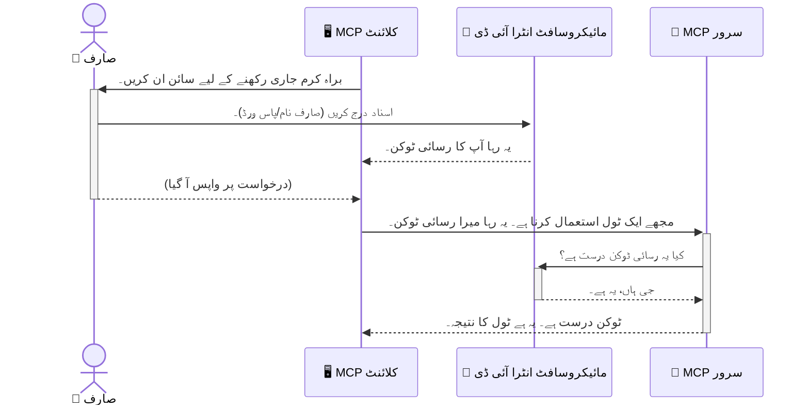

# اے آئی ورک فلو کو محفوظ بنانا: ماڈل کانٹیکسٹ پروٹوکول سرورز کے لیے اینٹرا آئی ڈی توثیق

## تعارف
آپ کے ماڈل کانٹیکسٹ پروٹوکول (MCP) سرور کو محفوظ بنانا بالکل اسی طرح ضروری ہے جیسے آپ اپنے گھر کا مرکزی دروازہ بند کرتے ہیں۔ اپنے MCP سرور کو کھلا چھوڑنے کا مطلب ہے کہ آپ کے اوزار اور ڈیٹا غیر مجاز رسائی کے لیے کھلے رہتے ہیں، جو سیکیورٹی خلاف ورزیوں کا سبب بن سکتا ہے۔ مائیکروسافٹ اینٹرا آئی ڈی ایک مضبوط کلاؤڈ بیسڈ شناختی اور رسائی انتظام کا حل فراہم کرتا ہے، جو اس بات کو یقینی بناتا ہے کہ صرف مجاز صارفین اور ایپلیکیشنز ہی آپ کے MCP سرور سے رابطہ کر سکیں۔ اس سیکشن میں، آپ اینٹرا آئی ڈی توثیق کا استعمال کرتے ہوئے اپنے اے آئی ورک فلو کو محفوظ کرنے کا طریقہ سیکھیں گے۔

## سیکھنے کے مقاصد
اس سیکشن کے اختتام تک، آپ قابل ہوں گے کہ:

- MCP سرورز کو محفوظ بنانے کی اہمیت کو سمجھیں۔
- مائیکروسافٹ اینٹرا آئی ڈی اور OAuth 2.0 توثیق کی بنیادی باتوں کی وضاحت کریں۔
- پبلک کلائنٹ اور کنفیڈینشل کلائنٹ میں فرق شناخت کریں۔
- لوکل (پبلک کلائنٹ) اور ریموٹ (کنفیڈینشل کلائنٹ) MCP سرور کے منظرناموں میں اینٹرا آئی ڈی توثیق کو نافذ کریں۔
- AI ورک فلو تیار کرتے وقت سیکیورٹی کی بہترین مشقیں اپنائیں۔

## سیکیورٹی اور MCP

جیسے آپ اپنے گھر کے مرکزی دروازے کو کھلا نہیں چھوڑتے، آپ کو اپنے MCP سرور کو بھی کسی کے لیے کھلا نہیں چھوڑنا چاہیے۔ اپنے AI ورک فلو کو محفوظ بنانا مضبوط، قابل اعتماد اور محفوظ ایپلیکیشنز بنانے کے لیے ضروری ہے۔ یہ باب آپ کو مائیکروسافٹ اینٹرا آئی ڈی کے ذریعے MCP سرورز کی حفاظت کرنا سکھائے گا، تاکہ صرف مجاز صارفین اور ایپلیکیشنز ہی آپ کے اوزار اور ڈیٹا سے رابطہ کر سکیں۔

## MCP سرورز کے لیے سیکیورٹی کیوں ضروری ہے

تصور کریں کہ آپ کا MCP سرور ایک ایسا آلہ رکھتا ہے جو ای میل بھیج سکتا ہے یا کسٹمر ڈیٹا بیس تک رسائی حاصل کر سکتا ہے۔ ایک غیر محفوظ سرور کا مطلب ہے کہ کوئی بھی اس آلے کا استعمال کر سکتا ہے، جو غیر مجاز ڈیٹا رسائی، اسپیم، یا دیگر نقصان دہ سرگرمیوں کا باعث بن سکتا ہے۔

توثیق لاگو کرنے سے آپ اس بات کو یقینی بناتے ہیں کہ آپ کے سرور کو بھیجے جانے والے ہر درخواست کی تصدیق کی جائے، جس سے درخواست کرنے والے صارف یا ایپلیکیشن کی شناخت ثابت ہوتی ہے۔ یہ آپ کے AI ورک فلو کو محفوظ بنانے کا پہلا اور سب سے اہم قدم ہے۔

## مائیکروسافٹ اینٹرا آئی ڈی کا تعارف

[**مائیکروسافٹ اینٹرا آئی ڈی**](https://adoption.microsoft.com/microsoft-security/entra/) ایک کلاؤڈ بنیادی پر شناخت اور رسائی کا انتظام فراہم کرنے والی خدمت ہے۔ اسے اپنی ایپلیکیشنز کے لیے ایک عالمی سیکیورٹی گارڈ سمجھیں۔ یہ صارف کی شناختوں کی توثیق (authentication) اور انہیں کیا کرنے کی اجازت ہے (authorization) کے پیچیدہ عمل کو سنبھالتا ہے۔

اینٹرا آئی ڈی استعمال کرنے سے آپ کر سکتے ہیں:

- صارفین کے لیے محفوظ سائن ان کی اجازت دینا۔
- APIs اور سروسز کی حفاظت کرنا۔
- رسائی کی پالیسیاں مرکزی جگہ سے منظم کرنا۔

MCP سرورز کے لیے، اینٹرا آئی ڈی ایک مضبوط اور قابل اعتماد حل فراہم کرتا ہے تاکہ یہ طے کیا جا سکے کہ کون آپ کے سرور کی صلاحیتوں تک رسائی حاصل کر سکتا ہے۔

---

## جادُو کو سمجھنا: اینٹرا آئی ڈی توثیق کیسے کام کرتی ہے

اینٹرا آئی ڈی آٹھیکس جیسے اوپن اسٹینڈرڈز کا استعمال کرتا ہے، جیسے **OAuth 2.0** تاکہ توثیق کو سنبھالا جا سکے۔ اگرچہ تفصیلات پیچیدہ ہو سکتی ہیں، لیکن بنیادی تصور آسان ہے اور ایک تشبیہ کے ذریعے سمجھا جا سکتا ہے۔

### OAuth 2.0 کا ہلکا پھلکا تعارف: "ویلیٹ کی"

OAuth 2.0 کو اپنی گاڑی کے لیے ایک ویلیٹ سروس سمجھیں۔ جب آپ کسی ریستوران پہنچتے ہیں، تو آپ ویلیٹ کو اپنی ماسٹر کی نہیں دیتے۔ اس کے بجائے، آپ ایک **ویلیٹ کی** دیتے ہیں جس کی محدود اجازتیں ہوتی ہیں — یہ گاڑی کو اسٹارٹ کر سکتا ہے اور دروازے بند کر سکتا ہے، لیکن ٹرنک یا دبے کو نہیں کھول سکتا۔

اس تشبیہ میں:

- **آپ** ہیں **صارف**۔
- **آپ کی گاڑی** ہے **MCP سرور** جس کے قیمتی اوزار اور ڈیٹا ہیں۔
- **ویلیٹ** ہے **مائیکروسافٹ اینٹرا آئی ڈی**۔
- **پارکنگ اٹنڈنٹ** ہے **MCP کلائنٹ** (وہ ایپلیکیشن جو سرور تک رسائی کی کوشش کرتی ہے)۔
- **ویلیٹ کی** ہے **اکسیس ٹوکن**۔

اکسیس ٹوکن ایک محفوظ متن کی دھار ہے جو MCP کلائنٹ کو اینٹرا آئی ڈی سے سائن ان کے بعد ملتی ہے۔ پھر کلائنٹ ہر درخواست کے ساتھ یہ ٹوکن MCP سرور کو فراہم کرتا ہے۔ سرور اس ٹوکن کی تصدیق کر سکتا ہے تاکہ یقینی بنایا جا سکے کہ درخواست جائز ہے اور کلائنٹ کے پاس مطلوبہ اجازتیں ہیں، بغیر آپ کی اصل اسناد (جیسے پاس ورڈ) کو ہینڈل کیے۔

### توثیق کا عمل

عمل درج ذیل طریقے سے کام کرتا ہے:




### مائیکروسافٹ آتھنٹیکیشن لائبریری (MSAL) کا تعارف

کوڈ میں جانے سے پہلے، ایک مرکزی جزو سے واقف ہونا ضروری ہے جو آپ مثالوں میں دیکھیں گے: **مائیکروسافٹ آتھنٹیکیشن لائبریری (MSAL)**۔

MSAL مائیکروسافٹ کی ایک لائبریری ہے جو ڈویلپرز کے لیے توثیق کی ہینڈلنگ کو آسان بناتی ہے۔ آپ کو اپنے طور پر پیچیدہ کوڈ لکھنے کی بجائے، جو سیکیورٹی ٹوکنز کو سنبھالے، سائن انز کو مینیج کرے، اور سیشن ریفریش کرے، MSAL یہ تمام بوجھ اٹھاتا ہے۔

MSAL استعمال کرنے کی سفارش کی جاتی ہے کیونکہ:

- **یہ محفوظ ہے:** یہ صنعت کے معیار کے پروٹوکولز اور سیکیورٹی کی بہترین مشقیں نافذ کرتا ہے، جس سے آپ کے کوڈ میں کمزوریوں کا خطرہ کم ہوتا ہے۔
- **یہ ترقی آسان بناتا ہے:** یہ OAuth 2.0 اور OpenID Connect پروٹوکولز کی پیچیدگی کو چھپاتا ہے، اور آپ کو چند لائنوں میں مضبوط توثیق اپنی ایپلیکیشن میں شامل کرنے دیتا ہے۔
- **یہ برقرار رکھا جاتا ہے:** مائیکروسافٹ سرگرمی سے MSAL کو اپ ڈیٹ اور برقرار رکھتا ہے تاکہ نئے سیکیورٹی خطرات اور پلیٹ فارم تبدیلیوں کو حل کیا جا سکے۔

MSAL مختلف زبانوں اور ایپلیکیشن فریم ورکس کو سپورٹ کرتا ہے، جن میں .NET، جاوا اسکرپٹ/ٹائپ اسکرپٹ، پائتھون، جاوا، گو، اور موبائل پلیٹ فارمز جیسے آئی او ایس اور اینڈرائیڈ شامل ہیں۔ اس کا مطلب ہے کہ آپ اپنی پوری ٹیکنالوجی اسٹیک میں مستقل توثیقی نمونہ استعمال کر سکتے ہیں۔

MSAL کے بارے میں مزید جاننے کے لیے، آپ اس کے [سرکاری جائزہ دستاویزات](https://learn.microsoft.com/entra/identity-platform/msal-overview) دیکھ سکتے ہیں۔

---

## اینٹرا آئی ڈی کے ساتھ اپنے MCP سرور کو محفوظ بنانا: مرحلہ وار گائیڈ

اب آئیے دیکھیں کہ آپ لوکل MCP سرور (جو `stdio` پر بات چیت کرتا ہے) کو اینٹرا آئی ڈی کے استعمال سے کیسے محفوظ کر سکتے ہیں۔ یہ مثال **پبلک کلائنٹ** کا استعمال کرتی ہے، جو صارف کے کمپیوٹر پر چلنے والی ایپلیکیشنز، جیسے ڈیسک ٹاپ ایپ یا لوکل ڈیولپمنٹ سرور کے لیے مناسب ہے۔

### منظرنامہ 1: لوکل MCP سرور کی حفاظت (پبلک کلائنٹ کے ساتھ)

اس منظرنامے میں، ہم ایک ایسے MCP سرور کو دیکھیں گے جو لوکل چل رہا ہے، `stdio` پر بات چیت کرتا ہے، اور اپنے اوزار تک رسائی کی اجازت دینے سے پہلے صارف کی توثیق کے لیے اینٹرا آئی ڈی استعمال کرتا ہے۔ سرور کے پاس ایک واحد ٹول ہوگا جو مائیکروسافٹ گراف API سے صارف کی پروفائل معلومات حاصل کرتا ہے۔

#### 1. اینٹرا آئی ڈی میں ایپلیکیشن کو سیٹ اپ کرنا

کوڈ لکھنے سے پہلے، آپ کو اپنی ایپلیکیشن کو مائیکروسافٹ اینٹرا آئی ڈی میں رجسٹر کرنا ہوگا۔ اس سے اینٹرا آئی ڈی کو آپ کی ایپلیکیشن کا علم ہوگا اور اسے توثیق سروس استعمال کرنے کی اجازت ملے گی۔

1. **[Microsoft Entra پورٹل](https://entra.microsoft.com/)** پر جائیں۔
2. **App registrations** پر جائیں اور **New registration** پر کلک کریں۔
3. اپنی ایپلیکیشن کو ایک نام دیں (مثلاً "My Local MCP Server")۔
4. **Supported account types** کے لیے، **Accounts in this organizational directory only** منتخب کریں۔
5. اس مثال کے لیے **Redirect URI** خالی چھوڑ سکتے ہیں۔
6. **Register** پر کلک کریں۔

رجسٹر ہونے کے بعد، **Application (client) ID** اور **Directory (tenant) ID** نوٹ کریں۔ آپ کو اپنے کوڈ میں ان کی ضرورت ہوگی۔

#### 2. کوڈ: تفصیل

آئیے ان کوڈ حصوں پر نظر ڈالیں جو توثیق کو ہینڈل کرتے ہیں۔ اس مثال کا مکمل کوڈ [Entra ID - Local - WAM](https://github.com/Azure-Samples/mcp-auth-servers/tree/main/src/entra-id-local-wam) فولڈر میں [mcp-auth-servers GitHub ریپوزٹری](https://github.com/Azure-Samples/mcp-auth-servers) پر دستیاب ہے۔

**`AuthenticationService.cs`**

یہ کلاس اینٹرا آئی ڈی کے ساتھ تعامل کے لیے ذمہ دار ہے۔

- **`CreateAsync`**: یہ طریقہ MSAL سے `PublicClientApplication` کو انیشیئلائز کرتا ہے۔ اسے آپ کی ایپلیکیشن کے `clientId` اور `tenantId` کے ساتھ کنفیگر کیا جاتا ہے۔
- **`WithBroker`**: یہ بروکر کے استعمال کو فعال کرتا ہے (جیسے Windows Web Account Manager)، جو ایک زیادہ محفوظ اور ہموار سنگل سائن آن تجربہ فراہم کرتا ہے۔
- **`AcquireTokenAsync`**: یہ مرکزی طریقہ ہے۔ یہ پہلے خاموشی سے (silent) ٹوکن حاصل کرنے کی کوشش کرتا ہے (یعنی اگر پہلے سے ایک درست سیشن ہے تو صارف کو دوبارہ سائن ان کرنے کی ضرورت نہیں)، اگر خاموش ٹوکن نہیں ملتا تو یہ صارف کو انٹرایکٹو سائن ان کے لیے کہتا ہے۔

```csharp
// Simplified for clarity
public static async Task<AuthenticationService> CreateAsync(ILogger<AuthenticationService> logger)
{
    var msalClient = PublicClientApplicationBuilder
        .Create(_clientId) // Your Application (client) ID
        .WithAuthority(AadAuthorityAudience.AzureAdMyOrg)
        .WithTenantId(_tenantId) // Your Directory (tenant) ID
        .WithBroker(new BrokerOptions(BrokerOptions.OperatingSystems.Windows))
        .Build();

    // ... cache registration ...

    return new AuthenticationService(logger, msalClient);
}

public async Task<string> AcquireTokenAsync()
{
    try
    {
        // Try silent authentication first
        var accounts = await _msalClient.GetAccountsAsync();
        var account = accounts.FirstOrDefault();

        AuthenticationResult? result = null;

        if (account != null)
        {
            result = await _msalClient.AcquireTokenSilent(_scopes, account).ExecuteAsync();
        }
        else
        {
            // If no account, or silent fails, go interactive
            result = await _msalClient.AcquireTokenInteractive(_scopes).ExecuteAsync();
        }

        return result.AccessToken;
    }
    catch (Exception ex)
    {
        _logger.LogError(ex, "An error occurred while acquiring the token.");
        throw; // Optionally rethrow the exception for higher-level handling
    }
}
```


**`Program.cs`**

یہ وہ جگہ ہے جہاں MCP سرور کو سیٹ اپ کیا جاتا ہے اور توثیق کی سروس کو انٹیگریٹ کیا جاتا ہے۔

- **`AddSingleton<AuthenticationService>`**: یہ `AuthenticationService` کو dependency injection کنٹینر میں رجسٹر کرتا ہے، تاکہ اسے ایپلیکیشن کے دوسرے حصوں (جیسے ہمارے ٹول) میں استعمال کیا جا سکے۔
- **`GetUserDetailsFromGraph` ٹول**: اس ٹول کو `AuthenticationService` کی ایک مثال کی ضرورت ہوتی ہے۔ یہ کچھ کرنے سے پہلے `authService.AcquireTokenAsync()` کو کال کرتا ہے تاکہ ایک درست اکسیس ٹوکن حاصل کیا جا سکے۔ اگر توثیق کامیاب ہوتی ہے، تو یہ ٹوکن استعمال کر کے مائیکروسافٹ گراف API کو کال کرتا ہے اور صارف کی تفصیلات حاصل کرتا ہے۔

```csharp
// Simplified for clarity
[McpServerTool(Name = "GetUserDetailsFromGraph")]
public static async Task<string> GetUserDetailsFromGraph(
    AuthenticationService authService)
{
    try
    {
        // This will trigger the authentication flow
        var accessToken = await authService.AcquireTokenAsync();

        // Use the token to create a GraphServiceClient
        var graphClient = new GraphServiceClient(
            new BaseBearerTokenAuthenticationProvider(new TokenProvider(authService)));

        var user = await graphClient.Me.GetAsync();

        return System.Text.Json.JsonSerializer.Serialize(user);
    }
    catch (Exception ex)
    {
        return $"Error: {ex.Message}";
    }
}
```


#### 3. سب کچھ کیسے مل کر کام کرتا ہے

1. جب MCP کلائنٹ `GetUserDetailsFromGraph` ٹول استعمال کرنے کی کوشش کرتا ہے، تو ٹول پہلے `AcquireTokenAsync` کو کال کرتا ہے۔
2. `AcquireTokenAsync` MSAL لائبریری کو درست ٹوکن کے لیے چیک کرنے کا کہتا ہے۔
3. اگر کوئی ٹوکن نہیں ملتا، تو MSAL بروکر کے ذریعے صارف کو انٹرایکٹو سائن ان کے لیے کہتا ہے۔
4. جب صارف سائن ان کر لیتا ہے، تو اینٹرا آئی ڈی ایک اکسیس ٹوکن جاری کرتا ہے۔
5. ٹول اس ٹوکن کو وصول کرتا ہے اور اس کے ذریعے مائیکروسافٹ گراف API کو محفوظ طریقے سے کال کرتا ہے۔
6. صارف کی تفصیلات MCP کلائنٹ کو واپس آ جاتی ہیں۔

یہ عمل یقینی بناتا ہے کہ صرف مستند صارفین ہی اس ٹول کا استعمال کر سکیں، اور آپ کے لوکل MCP سرور کو مؤثر طریقے سے محفوظ کرتا ہے۔

### منظرنامہ 2: ریموٹ MCP سرور کی حفاظت (کنفیڈینشل کلائنٹ کے ساتھ)

جب آپ کا MCP سرور ریموٹ مشین (جیسے کلاؤڈ سرور) پر چل رہا ہو اور HTTP Streaming جیسے پروٹوکول کے ذریعے بات چیت کرتا ہو، تو سیکیورٹی کی ضروریات مختلف ہوتی ہیں۔ اس صورت میں، آپ کو **کنفیڈینشل کلائنٹ** اور **Authorization Code Flow** استعمال کرنا چاہیے۔ یہ زیادہ محفوظ طریقہ ہے کیونکہ ایپلیکیشن کے راز (secrets) براؤزر کے سامنے ظاہر نہیں ہوتے۔

یہ مثال ایک ٹائپ اسکرپٹ بیسڈ MCP سرور استعمال کرتی ہے جو Express.js کے ذریعے HTTP درخواستوں کو ہینڈل کرتا ہے۔

#### 1. اینٹرا آئی ڈی میں ایپلیکیشن کو سیٹ اپ کرنا

اینٹرا آئی ڈی میں سیٹ اپ پبلک کلائنٹ جیسا ہے، لیکن ایک اہم فرق کے ساتھ: آپ کو ایک **client secret** تخلیق کرنا ہوگا۔

1. **[Microsoft Entra پورٹل](https://entra.microsoft.com/)** پر جائیں۔
2. اپنی ایپ رجسٹریشن میں **Certificates & secrets** ٹیب پر جائیں۔
3. **New client secret** پر کلک کریں، ایک وضاحت دیں، اور **Add** پر کلک کریں۔
4. **اہم:** سیکرٹ ویلیو کو فوراً کاپی کر لیں۔ آپ اسے دوبارہ نہیں دیکھ سکیں گے۔
5. آپ کو **Redirect URI** بھی کنفیگر کرنا ہوگا۔ **Authentication** ٹیب پر جائیں، **Add a platform** پر کلک کریں، **Web** منتخب کریں، اور اپنی ایپلیکیشن کے لیے ری ڈائریکٹ URI درج کریں (مثلاً `http://localhost:3001/auth/callback`)۔

> **⚠️ اہم حفاظتی نوٹ:** پروڈکشن ایپلیکیشنز کے لیے، مائیکروسافٹ سختی سے سفارش کرتا ہے کہ **secretless authentication** طریقے استعمال کریں، جیسے **Managed Identity** یا **Workload Identity Federation** بجائے client secrets کے۔ کلائنٹ سیکرٹس سیکیورٹی کے خطرات رکھتے ہیں کیونکہ یہ ظاہر یا سمجھوتہ کیے جا سکتے ہیں۔ مینیجڈ آئی ڈینٹٹیز ایک زیادہ محفوظ طریقہ فراہم کرتی ہیں کیونکہ ان سے آپ کو اپنے کوڈ یا کنفیگریشن میں اسناد ذخیرہ کرنے کی ضرورت نہیں پڑتی۔
>
> مینیجڈ آئی ڈینٹٹیز کے بارے میں مزید معلومات اور ان پر عمل درآمد کے طریقے کے لیے، [Managed identities for Azure resources overview](https://learn.microsoft.com/entra/identity/managed-identities-azure-resources/overview) دیکھیں۔

#### 2. کوڈ: تفصیل

یہ مثال ایک سیشن پر مبنی طریقہ استعمال کرتی ہے۔ جب صارف توثیق کرتا ہے، سرور اکسیس ٹوکن اور ریفریش ٹوکن سیشن میں ذخیرہ کرتا ہے اور صارف کو ایک سیشن ٹوکن دیتا ہے۔ یہ سیشن ٹوکن بعد کی درخواستوں میں استعمال ہوتا ہے۔ اس مثال کا مکمل کوڈ [Entra ID - Confidential client](https://github.com/Azure-Samples/mcp-auth-servers/tree/main/src/entra-id-cca-session) فولڈر میں [mcp-auth-servers GitHub ریپوزٹری](https://github.com/Azure-Samples/mcp-auth-servers) پر دستیاب ہے۔

**`Server.ts`**

یہ فائل Express سرور اور MCP ٹرانسپورٹ لیئر کو سیٹ اپ کرتی ہے۔

- **`requireBearerAuth`**: یہ مڈل ویئر `/sse` اور `/message` endpoints کو محفوظ بناتا ہے۔ یہ درخواست کے `Authorization` ہیڈر میں ایک صحیح بیئرر ٹوکن کی جانچ کرتا ہے۔
- **`EntraIdServerAuthProvider`**: یہ ایک کسٹم کلاس ہے جو `McpServerAuthorizationProvider` انٹرفیس کو نافذ کرتی ہے۔ یہ OAuth 2.0 کے فلو کو ہینڈل کرنے کی ذمہ دار ہے۔
- **`/auth/callback`**: یہ اینڈ پوائنٹ Entra ID سے ری ڈائریکٹ ہینڈل کرتا ہے جب صارف توثیق کر چکا ہو۔ یہ authorization code کو access token اور refresh token میں تبدیل کرتا ہے۔

```typescript
// وضاحت کے لیے آسان بنایا گیا
const app = express();
const { server } = createServer();
const provider = new EntraIdServerAuthProvider();

// SSE اینڈ پوائنٹ کی حفاظت کریں
app.get("/sse", requireBearerAuth({
  provider,
  requiredScopes: ["User.Read"]
}), async (req, res) => {
  // ... ٹرانسپورٹ سے جڑیں ...
});

// پیغام کے اینڈ پوائنٹ کی حفاظت کریں
app.post("/message", requireBearerAuth({
  provider,
  requiredScopes: ["User.Read"]
}), async (req, res) => {
  // ... پیغام کو ہینڈل کریں ...
});

// OAuth 2.0 کال بیک کو ہینڈل کریں
app.get("/auth/callback", (req, res) => {
  provider.handleCallback(req.query.code, req.query.state)
    .then(result => {
      // ... کامیابی یا ناکامی کو ہینڈل کریں ...
    });
});
```


**`Tools.ts`**

یہ فائل ٹولز کی تعریف کرتی ہے جو MCP سرور فراہم کرتا ہے۔ `getUserDetails` ٹول پچھلی مثال کی طرح ہے، لیکن یہ اکسیس ٹوکن سیشن سے حاصل کرتا ہے۔

```typescript
// وضاحت کے لیے آسان بنایا گیا
server.setRequestHandler(CallToolRequestSchema, async (request) => {
  const { name } = request.params;
  const context = request.params?.context as { token?: string } | undefined;
  const sessionToken = context?.token;

  if (name === ToolName.GET_USER_DETAILS) {
    if (!sessionToken) {
      throw new AuthenticationError("Authentication token is missing or invalid. Ensure the token is provided in the request context.");
    }

    // سیشن اسٹور سے Entra ID ٹوکن حاصل کریں
    const tokenData = tokenStore.getToken(sessionToken);
    const entraIdToken = tokenData.accessToken;

    const graphClient = Client.init({
      authProvider: (done) => {
        done(null, entraIdToken);
      }
    });

    const user = await graphClient.api('/me').get();

    // ... صارف کی تفصیلات واپس کریں ...
  }
});
```


**`auth/EntraIdServerAuthProvider.ts`**

یہ کلاس درج ذیل کے لیے لاجک ہینڈل کرتی ہے:

- صارف کو اینٹرا آئی ڈی سائن ان صفحہ پر ری ڈائریکٹ کرنا۔
- authorization code کو اکسیس ٹوکن میں تبدیل کرنا۔
- ٹوکنز کو `tokenStore` میں ذخیرہ کرنا۔
- جب اکسیس ٹوکن میعاد ختم کر دے تو اسے ریفریش کرنا۔

#### 3. سب کچھ کیسے مل کر کام کرتا ہے

1. جب صارف پہلی بار MCP سرور سے کنیکٹ کرنے کی کوشش کرتا ہے، `requireBearerAuth` مڈل ویئر دیکھتا ہے کہ ان کے پاس کوئی درست سیشن نہیں ہے اور انہیں اینٹرا آئی ڈی سائن ان صفحہ پر ری ڈائریکٹ کر دیتا ہے۔
2. صارف اپنے اینٹرا آئی ڈی اکاؤنٹ سے سائن ان کرتا ہے۔
3. انٹریا آئی ڈی صارف کو دوبارہ `/auth/callback` اینڈپوائنٹ پر ایک اجازت نامہ کوڈ کے ساتھ ری ڈائریکٹ کرتا ہے۔  
4. سرور اس کوڈ کو ایکسیس ٹوکن اور ریفریش ٹوکن کے لیے تبدیل کرتا ہے، انہیں محفوظ کرتا ہے، اور ایک سیشن ٹوکن تخلیق کرتا ہے جو کلائنٹ کو بھیجا جاتا ہے۔  
5. اب کلائنٹ اس سیشن ٹوکن کو `Authorization` ہیڈر میں تمام آئندہ درخواستوں کے لیے MCP سرور کو بھیج سکتا ہے۔  
6. جب `getUserDetails` ٹول کو کال کیا جاتا ہے، تو یہ سیشن ٹوکن استعمال کرتا ہے تاکہ انٹریا آئی ڈی ایکسیس ٹوکن کو تلاش کرے اور پھر اسے Microsoft Graph API کو کال کرنے کے لیے استعمال کرتا ہے۔  

یہ فلو عوامی کلائنٹ کے فلو سے زیادہ پیچیدہ ہے، لیکن انٹرنیٹ-سامنا کرنے والے اینڈپوائنٹس کے لیے ضروری ہے۔ چونکہ دور دراز کے MCP سرورز پبلک انٹرنیٹ کے ذریعے قابل رسائی ہوتے ہیں، انہیں غیر مجاز رسائی اور ممکنہ حملوں سے بچانے کے لیے مضبوط حفاظتی اقدامات کی ضرورت ہوتی ہے۔  


## سیکیورٹی کے بہترین طریقے  

- **ہمیشہ HTTPS استعمال کریں**: کلائنٹ اور سرور کے درمیان بات چیت کو انکرپٹ کریں تاکہ ٹوکنز کو مداخلت سے محفوظ رکھا جا سکے۔  
- **رول پر مبنی رسائی کنٹرول (RBAC) نافذ کریں**: صرف یہ نہ چیک کریں کہ صارف تصدیق شدہ ہے یا نہیں؛ بلکہ یہ بھی چیک کریں کہ وہ کیا کرنے کا مجاز ہے۔ آپ انٹریا آئی ڈی میں رولز تعریف کر سکتے ہیں اور انہیں اپنے MCP سرور میں چیک کر سکتے ہیں۔  
- **مانیٹر اور آڈٹ کریں**: تمام تصدیقی ایونٹس کو لاگ کریں تاکہ مشتبہ سرگرمی کا پتہ لگا سکیں اور ردعمل کر سکیں۔  
- **ریٹ لمٹنگ اور تھروٹلنگ کو سنبھالیں**: Microsoft Graph اور دیگر APIs زیادتی سے بچنے کے لیے ریٹ لمٹنگ نافذ کرتے ہیں۔ اپنے MCP سرور میں ایگزیپونینشل بیک آف اور ری ٹرائی لاجک نافذ کریں تاکہ HTTP 429 (بہت زیادہ درخواستیں) کے جوابات کو نرمی سے سنبھالا جا سکے۔ بار بار استعمال ہونے والے ڈیٹا کو کیش کرنے پر غور کریں تاکہ API کالز کم ہوں۔  
- **ٹوکن کو محفوظ طریقے سے محفوظ کریں**: ایکسیس ٹوکنز اور ریفریش ٹوکنز کو محفوظ طریقے سے ذخیرہ کریں۔ مقامی ایپس کے لیے، سسٹم کے محفوظ ذخیرہ کے مکینزم استعمال کریں۔ سرور ایپس کے لیے انکرپٹڈ اسٹوریج یا Azure Key Vault جیسے محفوظ کی مینجمنٹ سروسز پر غور کریں۔  
- **ٹوکن کی میعاد ختم ہونے کا انتظام کریں**: ایکسیس ٹوکنز کی محدود مدت ہوتی ہے۔ مسلسل صارف کی سہولت کے لیے ریفریش ٹوکنز کا استعمال کر کے خودکار ٹوکن ریسرفیش نافذ کریں تاکہ دوبارہ لاگ ان کی ضرورت نہ پڑے۔  
- **Azure API Management کے استعمال پر غور کریں**: اگرچہ حفاظتی انتظامات براہ راست اپنے MCP سرور میں کرنا آپ کو باریک کنٹرول دیتا ہے، API گیٹ ویز جیسے Azure API Management کئی حفاظتی پہلوؤں کو خودکار طریقے سے سنبھالتے ہیں، بشمول تصدیق، اجازت، ریٹ لمٹنگ، اور مانیٹرنگ۔ یہ ایک مرکزی حفاظتی تہہ فراہم کرتے ہیں جو آپ کے کلائنٹس اور MCP سرورز کے درمیان ہوتی ہے۔ MCP کے ساتھ API گیٹ ویز کے استعمال کی مزید تفصیلات کے لیے دیکھیں [Azure API Management Your Auth Gateway For MCP Servers](https://techcommunity.microsoft.com/blog/integrationsonazureblog/azure-api-management-your-auth-gateway-for-mcp-servers/4402690)۔  


## اہم نکات  

- اپنے MCP سرور کی حفاظت آپ کے ڈیٹا اور ٹولز کی حفاظت کے لیے انتہائی ضروری ہے۔  
- Microsoft Entra ID تصدیق اور اجازت کے لیے ایک مضبوط اور مقیاس پذیر حل فراہم کرتا ہے۔  
- مقامی ایپlications کے لیے **public client** اور دور دراز کے سرورز کے لیے **confidential client** استعمال کریں۔  
- **Authorization Code Flow** ویب ایپlications کے لیے سب سے زیادہ محفوظ انتخاب ہے۔  


## مشق  

1. ایک MCP سرور کے بارے میں سوچیں جو آپ بنا سکتے ہیں۔ کیا یہ مقامی سرور ہوگا یا دور دراز سرور؟  
2. اپنے جواب کی بنیاد پر، کیا آپ ایک public یا confidential client استعمال کریں گے؟  
3. Microsoft Graph کے خلاف کارروائیاں کرنے کے لیے آپ کا MCP سرور کونسی اجازت مانگے گا؟  


## عملی مشقیں  

### مشق 1: Entra ID میں ایک ایپلیکیشن رجسٹر کریں  
Microsoft Entra پورٹل پر جائیں۔  
اپنے MCP سرور کے لیے ایک نئی ایپلیکیشن رجسٹر کریں۔  
Application (client) ID اور Directory (tenant) ID ریکارڈ کریں۔  

### مشق 2: مقامی MCP سرور کو محفوظ کریں (Public Client)  
- صارف کی تصدیق کے لیے MSAL (Microsoft Authentication Library) کو شامل کرنے کے لیے کوڈ کی مثال پر عمل کریں۔  
- MCP ٹول کو کال کر کے تصدیقی فلو کی جانچ کریں جو Microsoft Graph سے صارف کی تفصیلات حاصل کرتا ہے۔  

### مشق 3: دور دراز MCP سرور کو محفوظ کریں (Confidential Client)  
- Entra ID میں confidential client رجسٹر کریں اور ایک client secret بنائیں۔  
- اپنے Express.js MCP سرور کو Authorization Code Flow استعمال کرنے کے لیے ترتیب دیں۔  
- محفوظ کیے گئے اینڈپوائنٹس کی جانچ کریں اور ٹوکن پر مبنی رسائی کی تصدیق کریں۔  

### مشق 4: سیکیورٹی کے بہترین طریقے اپلائی کریں  
- اپنے مقامی یا دور دراز سرور کے لیے HTTPS فعال کریں۔  
- اپنے سرور لاجک میں رول پر مبنی رسائی کنٹرول (RBAC) نافذ کریں۔  
- ٹوکن کی میعاد ختم ہونے کا انتظام اور محفوظ ٹوکن اسٹوریج شامل کریں۔  


## وسائل  

1. **MSAL کا تجزیہ دستاویزات**  
   جانیں کہ Microsoft Authentication Library (MSAL) کس طرح مختلف پلیٹ فارمز پر محفوظ ٹوکن حاصل کرنے کا طریقہ فراہم کرتی ہے:  
   [MSAL Overview on Microsoft Learn](https://learn.microsoft.com/en-gb/entra/msal/overview)  

2. **Azure-Samples/mcp-auth-servers گٹ ہب ریپوزیٹری**  
   MCP سرورز کی تصدیق فلو کی عملی مثالیں:  
   [Azure-Samples/mcp-auth-servers on GitHub](https://github.com/Azure-Samples/mcp-auth-servers)  

3. **Azure وسائل کے لیے Managed Identities کا جائزہ**  
   صارف یا سسٹم کے حوالے سے managed identities کے استعمال سے سیکریٹس کو ختم کرنے کا طریقہ سمجھیں:  
   [Managed Identities Overview on Microsoft Learn](https://learn.microsoft.com/en-us/entra/identity/managed-identities-azure-resources/)  

4. **Azure API Management: MCP سرورز کے لیے آپ کا Auth گیٹ وے**  
   MCP سرورز کے لیے APIM کو محفوظ OAuth2 گیٹ وے کے طور پر استعمال کرنے کی تفصیل:  
   [Azure API Management Your Auth Gateway For MCP Servers](https://techcommunity.microsoft.com/blog/integrationsonazureblog/azure-api-management-your-auth-gateway-for-mcp-servers/4402690)  

5. **Microsoft Graph اجازت ناموں کا حوالہ**  
   Microsoft Graph کے لیے تفویض شدہ اور ایپلیکیشن کی اجازتوں کی مکمل فہرست:  
   [Microsoft Graph Permissions Reference](https://learn.microsoft.com/zh-tw/graph/permissions-reference)  


## سیکھنے کے نتائج  
اس سیکشن کو مکمل کرنے کے بعد، آپ قادر ہوں گے کہ:  

- وضاحت کریں کہ MCP سرورز اور AI ورک فلو کے لیے تصدیق کیوں اہم ہے۔  
- مقامی اور دور دراز MCP سرور حالتوں کے لیے Entra ID کی تصدیق کو ترتیب دیں اور کنفیگر کریں۔  
- اپنے سرور کی تعیناتی کی بنیاد پر مناسب کلائنٹ کی قسم (public یا confidential) منتخب کریں۔  
- محفوظ کوڈنگ کے طریقے نافذ کریں، بشمول ٹوکن کی ذخیرہ اندوزی اور رول پر مبنی اجازت۔  
- غیر مجاز رسائی سے اپنے MCP سرور اور اس کے ٹولز کی حفاظت بااعتماد طریقے سے کریں۔  


## آگے کیا ہے  

- [5.13 ماڈل کانٹیکسٹ پروٹوکول (MCP) کی Microsoft Foundry کے ساتھ انضمام](../mcp-foundry-agent-integration/README.md)

---

<!-- CO-OP TRANSLATOR DISCLAIMER START -->
**ڈس کلیمر**:
یہ دستاویز AI ترجمہ سروس [Co-op Translator](https://github.com/Azure/co-op-translator) کے ذریعے ترجمہ کی گئی ہے۔ جبکہ ہم درستگی کے لیے کوشاں ہیں، براہ کرم اس بات سے آگاہ رہیں کہ خودکار ترجمے میں غلطیاں یا عدم درستیاں ہو سکتی ہیں۔ اصل دستاویز اپنے مادری زبان میں مستند ماخذ سمجھی جائے گی۔ حساس معلومات کے لیے پیشہ ور انسانی ترجمہ کی سفارش کی جاتی ہے۔ اس ترجمے کے استعمال سے پیدا ہونے والی کسی بھی غلط فہمی یا غلط تشریح کی ذمہ داری ہم قبول نہیں کرتے۔
<!-- CO-OP TRANSLATOR DISCLAIMER END -->