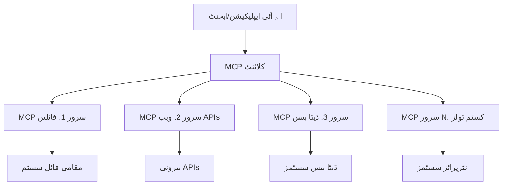

# 🌐 ماڈیول 2: مائیکروسافٹ فاؤنڈری ٹول کٹ بنیادیات کے ساتھ MCP

[]()
[]()
[]()

## 📋 تعلیمی مقاصد

اس ماڈیول کے اختتام تک، آپ قادر ہوں گے کہ:
- ✅ ماڈل کانٹیکسٹ پروٹوکول (MCP) کے فن تعمیر اور فوائد کو سمجھیں
- ✅ مائیکروسافٹ کے MCP سرور ماحولیاتی نظام کو دریافت کریں
- ✅ MCP سرورز کو مائیکروسافٹ فاؤنڈری ٹول کٹ ایجنٹ بلڈر کے ساتھ مربوط کریں
- ✅ Playwright MCP کا استعمال کرتے ہوئے ایک فعال براؤزر آٹومیشن ایجنٹ بنائیں
- ✅ اپنے ایجنٹس میں MCP ٹولز کو ترتیب دیں اور ٹیسٹ کریں
- ✅ MCP سے چلنے والے ایجنٹس کو برآمد کریں اور پروڈکشن میں تعینات کریں

## 🎯 ماڈیول 1 پر ترقی

ماڈیول 1 میں، ہم نے مائیکروسافٹ فاؤنڈری ٹول کٹ کی بنیادیات پر عبور حاصل کیا اور اپنا پہلا پائتھون ایجنٹ بنایا۔ اب ہم آپ کے ایجنٹس کو **سپرچارج** کریں گے تاکہ انہیں انقلابی **ماڈل کانٹیکسٹ پروٹوکول (MCP)** کے ذریعے خارجی ٹولز اور خدمات سے جوڑا جا سکے۔

اسے ایسے سوچیں جیسے ایک بنیادی کیلکولیٹر کو مکمل کمپیوٹر میں اپ گریڈ کرنا — آپ کے AI ایجنٹس یہ صلاحیتیں حاصل کر لیں گے کہ:
- 🌐 ویب سائٹس براؤز اور ان کے ساتھ تعامل کریں 
- 📁 فائلوں تک رسائی اور ان میں ترمیم کریں
- 🔧 انٹرپرائز سسٹمز کے ساتھ انضمام کریں
- 📊 APIs سے حقیقی وقت کے ڈیٹا کو پروسیس کریں

## 🧠 ماڈل کانٹیکسٹ پروٹوکول (MCP) کو سمجھنا

### 🔍 MCP کیا ہے؟

ماڈل کانٹیکسٹ پروٹوکول (MCP) ایک **"USB-C برائے AI ایپلیکیشنز"** ہے — ایک انقلابی اوپن اسٹینڈرڈ جو بڑے زبان کے ماڈلز (LLMs) کو خارجی ٹولز، ڈیٹا ذرائع، اور خدمات سے منسلک کرتا ہے۔ جس طرح USB-C نے کیبل کا الجھاؤ ختم کر کے ایک یونیورسل کنیکٹر فراہم کیا، MCP نے AI کے انضمام کی پیچیدگی کو ایک معیاری پروٹوکول کے ذریعے ختم کر دیا ہے۔

### 🎯 MCP کون سی مسئلہ حل کرتا ہے

**MCP سے پہلے:**
- 🔧 ہر ٹول کے لئے کسٹم انضمامات
- 🔄 مخصوص حل فراہم کرنے والے وینڈرز کی قید
- 🔒 غیر معیاری کنکشنز سے سیکیورٹی خطرات
- ⏱️ بنیادی انضمامات کے لیے مہینوں کی ڈیویلپمنٹ

**MCP کے ساتھ:**
- ⚡ پلگ اینڈ پلے ٹول انٹیگریشن
- 🔄 وینڈر ایگناسٹک فن تعمیر
- 🛡️ بلٹ ان سیکیورٹی کے بہترین طریقے
- 🚀 نئی صلاحیتوں کا کچھ ہی منٹوں میں اضافہ

### 🏗️ MCP فن تعمیر کی گہری نظر

MCP ایک **کلائنٹ-سرور فن تعمیر** پر عمل کرتا ہے جو ایک محفوظ، قابل توسیع ماحولیاتی نظام بناتا ہے:



**🔧 بنیادی اجزاء:**

| جزو | کردار | مثالیں |
|-----------|------|----------|
| **MCP میزبان** | ایپلیکیشنز جو MCP سروسز استعمال کرتی ہیں | Claude Desktop, VS Code, Microsoft Foundry Toolkit |
| **MCP کلائنٹس** | پروٹوکول ہینڈلرز (سرورز کے ساتھ 1:1) | میزبان ایپلیکیشنز میں بلٹ ان |
| **MCP سرورز** | معیاری پروٹوکول کے ذریعے صلاحیتیں فراہم کرتے ہیں | Playwright, Files, Azure, GitHub |
| **ٹرانسپورٹ لیئر** | مواصلاتی طریقے | stdio, HTTP, WebSockets |

## 🏢 مائیکروسافٹ کا MCP سرور ماحولیاتی نظام

مائیکروسافٹ MCP ماحولیاتی نظام کی قیادت کرتا ہے جس میں مکمل انٹرپرائز گریڈ سرورز کے سوٹ شامل ہیں جو حقیقی کاروباری ضروریات کو پورا کرتے ہیں۔

### 🌟 نمایاں مائیکروسافٹ MCP سرورز

#### 1. ☁️ Azure MCP سرور
**🔗 ریپوزیٹری**: [azure/azure-mcp](https://github.com/azure/azure-mcp)  
**🎯 مقصد**: AI انضمام کے ساتھ مکمل Azure وسائل کا انتظام

**✨ اہم خصوصیات:**
- اعلامی انفراسٹرکچر کی فراہمی
- حقیقی وقت میں وسائل کی نگرانی
- لاگت کی بہتری کی سفارشات
- سیکیورٹی تعمیل کے چیک

**🚀 استعمال کے کیسز:**
- کوڈ کی طرح انفراسٹرکچر AI کی مدد سے
- خودکار وسائل کی توسیع
- کلاؤڈ لاگت کی بہتری
- DevOps ورک فلو کی خودکاری

#### 2. 📊 مائیکروسافٹ ڈیٹاورس MCP
**📚 دستاویزات**: [Microsoft Dataverse Integration](https://go.microsoft.com/fwlink/?linkid=2320176)  
**🎯 مقصد**: کاروباری اعداد و شمار کے لیے قدرتی زبان کا انٹرفیس

**✨ اہم خصوصیات:**
- قدرتی زبان میں ڈیٹا بیس کوئریز
- کاروباری کانٹیکسٹ کی سمجھ
- کسٹم پرامپٹ ٹیمپلیٹس
- انٹرپرائز ڈیٹا گورننس

**🚀 استعمال کے کیسز:**
- کاروباری انٹیلی جنس رپورٹنگ
- کسٹمر ڈیٹا تجزیہ
- سیلز پائپ لائن بصیرت
- تعمیل ڈیٹا کوئریز

#### 3. 🌐 Playwright MCP سرور
**🔗 ریپوزیٹری**: [microsoft/playwright-mcp](https://github.com/microsoft/playwright-mcp)  
**🎯 مقصد**: براؤزر آٹومیشن اور ویب انٹریکشن کی صلاحیتیں

**✨ اہم خصوصیات:**
- کراس براؤزر آٹومیشن (کروم، فائر فاکس، سفاری)
- ذہین عنصر کی شناخت
- اسکرین شاٹ اور PDF جنریشن
- نیٹ ورک ٹریفک کی نگرانی

**🚀 استعمال کے کیسز:**
- خودکار ٹیسٹنگ ورک فلو
- ویب سکریپنگ اور ڈیٹا استخراج
- UI/UX مانیٹرنگ
- مسابقتی تجزیہ کی خودکاری

#### 4. 📁 فائلز MCP سرور
**🔗 ریپوزیٹری**: [microsoft/files-mcp-server](https://github.com/microsoft/files-mcp-server)  
**🎯 مقصد**: ذہین فائل سسٹم آپریشنز

**✨ اہم خصوصیات:**
- اعلامی فائل مینجمنٹ
- مواد کی ہم آہنگی
- ورژن کنٹرول انٹیگریشن
- میٹا ڈیٹا استخراج

**🚀 استعمال کے کیسز:**
- دستاویزات کا انتظام
- کوڈ ریپوزیٹری آرگنائزیشن
- مواد کی اشاعت کے ورک فلو
- ڈیٹا پائپ لائن فائل ہینڈلنگ

#### 5. 📝 MarkItDown MCP سرور
**🔗 ریپوزیٹری**: [microsoft/markitdown](https://github.com/microsoft/markitdown)  
**🎯 مقصد**: ایڈوانسڈ مارک ڈاؤن پروسیسنگ اور ترمیم

**✨ اہم خصوصیات:**
- امیر مارک ڈاؤن پارسنگ
- فارمیٹ تبادل (MD ↔ HTML ↔ PDF)
- مواد کی ساخت کا تجزیہ
- ٹیمپلیٹ پروسیسنگ

**🚀 استعمال کے کیسز:**
- تکنیکی دستاویزات کے ورک فلو
- مواد کا انتظامی نظام
- رپورٹ جنریشن
- نالج بیس آٹومیشن

#### 6. 📈 Clarity MCP سرور
**📦 پیکیج**: [@microsoft/clarity-mcp-server](https://www.npmjs.com/package/@microsoft/clarity-mcp-server)  
**🎯 مقصد**: ویب تجزیات اور صارف کے رویے کی بصیرت

**✨ اہم خصوصیات:**
- ہیٹ میپ ڈیٹا تجزیہ
- صارف سیشن ریکارڈنگز
- کارکردگی کے میٹرکس
- کنورژن فنل تجزیہ

**🚀 استعمال کے کیسز:**
- ویب سائٹ کی اصلاح
- صارف تجربے کی تحقیق
- A/B ٹیسٹنگ تجزیہ
- کاروباری انٹیلی جنس ڈیش بورڈز

### 🌍 کمیونٹی کا ماحولیاتی نظام

مائیکروسافٹ کے سرورز کے علاوہ، MCP ماحولیاتی نظام میں شامل ہیں:
- **🐙 GitHub MCP**: ریپوزیٹری مینجمنٹ اور کوڈ تجزیہ
- **🗄️ ڈیٹا بیس MCPs**: PostgreSQL، MySQL، MongoDB انٹیگریشنز
- **☁️ کلاؤڈ پرووائیڈر MCPs**: AWS، GCP، ڈیجیٹل اوشن کے ٹولز
- **📧 کمیونیکیشن MCPs**: Slack، Teams، ای میل انٹیگریشنز

## 🛠️ عملی تجربہ: براؤزر آٹومیشن ایجنٹ بنانا

**🎯 پراجیکٹ کا مقصد**: Playwright MCP سرور استعمال کرتے ہوئے ایک ذہین براؤزر آٹومیشن ایجنٹ بنائیں جو ویب سائٹس پر نیویگیٹ کر سکے، معلومات حاصل کر سکے، اور پیچیدہ ویب تعاملات انجام دے سکے۔

### 🚀 مرحلہ 1: ایجنٹ کی بنیاد قائم کرنا

#### قدم 1: اپنا ایجنٹ شروع کریں
1. **مائیکروسافٹ فاؤنڈری ٹول کٹ ایجنٹ بلڈر کھولیں**
2. **نیا ایجنٹ بنائیں** درج ذیل ترتیب کے ساتھ:
   - **نام**: `BrowserAgent`
   - **ماڈل**: GPT-4o منتخب کریں


### 🔧 مرحلہ 2: MCP انٹیگریشن ورک فلو

#### قدم 3: MCP سرور انٹیگریشن شامل کریں
1. **ایجنٹ بلڈر میں ٹولز کے سیکشن میں جائیں**
2. **"Add Tool" پر کلک کریں** تاکہ انٹیگریشن مینو کھلے
3. **"MCP Server" منتخب کریں** دستیاب آپشنز میں سے


**🔍 ٹول کی اقسام کو سمجھنا:**
- **بلٹ-ان ٹولز**: مائیکروسافٹ فاؤنڈری ٹول کٹ کے پہلے سے ترتیب دیے گئے فنکشنز
- **MCP سرورز**: خارجی سروس انٹیگریشنز
- **کسٹم API**: آپ کے اپنے سروس اینڈپوائنٹس
- **فنکشن کالنگ**: ماڈل فنکشنز کا براہ راست استعمال

#### قدم 4: MCP سرور کا انتخاب
1. **"MCP Server" کا انتخاب کریں** آگے بڑھنے کے لیے


2. **MCP کیٹلاگ میں براؤز کریں** تاکہ دستیاب انٹیگریشنز دیکھیں


### 🎮 مرحلہ 3: Playwright MCP کی تشکیل

#### قدم 5: Playwright کا انتخاب اور ترتیب
1. **"Use Featured MCP Servers" پر کلک کریں** تاکہ مائیکروسافٹ کے تصدیق شدہ سرورز تک رسائی حاصل کریں
2. **فہرست میں سے "Playwright" منتخب کریں**
3. **ڈیفالٹ MCP ID قبول کریں** یا اپنی ماحول کے لیے حسب ضرورت ترتیب دیں


#### قدم 6: Playwright صلاحیتوں کو فعال کریں
**🔑 اہم قدم**: زیادہ سے زیادہ فعالیت کے لیے دستیاب تمام Playwright طریقے منتخب کریں


**🛠️ ضروری Playwright ٹولز:**
- **نیویگیشن**: `goto`, `goBack`, `goForward`, `reload`
- **انٹریکشن**: `click`, `fill`, `press`, `hover`, `drag`
- **استخراج**: `textContent`, `innerHTML`, `getAttribute`
- **تصدیق**: `isVisible`, `isEnabled`, `waitForSelector`
- **کیپچر**: `screenshot`, `pdf`, `video`
- **نیٹ ورک**: `setExtraHTTPHeaders`, `route`, `waitForResponse`

#### قدم 7: انضمام کی کامیابی کی تصدیق کریں
**✅ کامیابی کی علامات:**
- تمام ٹولز ایجنٹ بلڈر کے انٹرفیس میں ظاہر ہوں
- انٹیگریشن پینل میں کوئی ایرر نہ ہو
- Playwright سرور کا اسٹیٹس "Connected" دکھائے


**🔧 عام مسائل کا حل:**
- **کنکشن ناکام**: انٹرنیٹ کنیکٹیویٹی اور فائر وال کی ترتیبات چیک کریں
- **ٹولز غائب**: یقینی بنائیں کہ تمام صلاحیتیں سیٹ اپ کے دوران منتخب کی گئی تھیں
- **اجازت کی خرابی**: تصدیق کریں کہ VS Code کے پاس ضروری سسٹم پرمیشنز ہیں

### 🎯 مرحلہ 4: ایڈوانسڈ پرامپٹ انجینئرنگ

#### قدم 8: ذہین سسٹم پرامپٹس ڈیزائن کریں
ایسے نفیس پرامپٹس بنائیں جو Playwright کی تمام صلاحیتوں کو استعمال کریں:

```markdown
# Web Automation Expert System Prompt

## Core Identity
You are an advanced web automation specialist with deep expertise in browser automation, web scraping, and user experience analysis. You have access to Playwright tools for comprehensive browser control.

## Capabilities & Approach
### Navigation Strategy
- Always start with screenshots to understand page layout
- Use semantic selectors (text content, labels) when possible
- Implement wait strategies for dynamic content
- Handle single-page applications (SPAs) effectively

### Error Handling
- Retry failed operations with exponential backoff
- Provide clear error descriptions and solutions
- Suggest alternative approaches when primary methods fail
- Always capture diagnostic screenshots on errors

### Data Extraction
- Extract structured data in JSON format when possible
- Provide confidence scores for extracted information
- Validate data completeness and accuracy
- Handle pagination and infinite scroll scenarios

### Reporting
- Include step-by-step execution logs
- Provide before/after screenshots for verification
- Suggest optimizations and alternative approaches
- Document any limitations or edge cases encountered

## Ethical Guidelines
- Respect robots.txt and rate limiting
- Avoid overloading target servers
- Only extract publicly available information
- Follow website terms of service
```

#### قدم 9: ڈائنامک یوزر پرامپٹس بنائیں
ایسے پرامپٹس ڈیزائن کریں جو مختلف صلاحیتوں کی مثالیں پیش کریں:

**🌐 ویب تجزیہ کی مثال:**
```markdown
Navigate to github.com/kinfey and provide a comprehensive analysis including:
1. Repository structure and organization
2. Recent activity and contribution patterns  
3. Documentation quality assessment
4. Technology stack identification
5. Community engagement metrics
6. Notable projects and their purposes

Include screenshots at key steps and provide actionable insights.
```


### 🚀 مرحلہ 5: عمل درآمد اور ٹیسٹنگ

#### قدم 10: اپنی پہلی آٹومیشن چلائیں
1. **"Run" پر کلک کریں** تاکہ آٹومیشن سیکوئنس شروع ہو
2. **حقیقی وقت میں عمل کی نگرانی کریں**:
   - کروم براؤزر خودکار طور پر لانچ ہو جاتا ہے
   - ایجنٹ ہدف ویب سائٹ پر نیویگیٹ کرتا ہے
   - ہر اہم قدم کا اسکرین شاٹ لیا جاتا ہے
   - تجزیہ کے نتائج حقیقی وقت میں دکھائے جاتے ہیں


#### قدم 11: نتائج اور بصیرت کا تجزیہ کریں
ایجنٹ بلڈر کے انٹرفیس میں جامع تجزیے کا جائزہ لیں:


### 🌟 مرحلہ 6: ایڈوانسڈ صلاحیتیں اور تعیناتی

#### قدم 12: برآمد کریں اور پروڈکشن میں تعینات کریں
ایجنٹ بلڈر مختلف تعیناتی کے اختیارات کی حمایت کرتا ہے:


## 🎓 ماڈیول 2 کا خلاصہ اور اگلے اقدامات

### 🏆 کامیابی کا اعزاز: MCP انٹیگریشن ماسٹر

**✅ حاصل کردہ مہارتیں:**
- [ ] MCP فن تعمیر اور فوائد کو سمجھنا
- [ ] مائیکروسافٹ کے MCP سرور ماحولیاتی نظام میں نیویگیٹ کرنا
- [ ] Playwright MCP کو مائیکروسافٹ فاؤنڈری ٹول کٹ کے ساتھ مربوط کرنا
- [ ] نفیس براؤزر آٹومیشن ایجنٹس بنانا
- [ ] ویب آٹومیشن کے لیے ایڈوانسڈ پرامپٹ انجینئرنگ

### 📚 اضافی وسائل

- **🔗 MCP وضاحت**: [سرکاری پروٹوکول دستاویزات](https://modelcontextprotocol.io/)
- **🛠️ Playwright API**: [مکمل طریقہ کار حوالہ](https://playwright.dev/docs/api/class-playwright)
- **🏢 مائیکروسافٹ MCP سرورز**: [انٹرپرائز انٹیگریشن گائیڈ](https://github.com/microsoft/mcp-servers)
- **🌍 کمیونٹی کی مثالیں**: [MCP سرور گیلری](https://github.com/modelcontextprotocol/servers)

**🎉 مبارک ہو!** آپ نے MCP انٹیگریشن میں مہارت حاصل کر لی ہے اور اب آپ خارجی ٹول کی صلاحیتوں کے ساتھ پروڈکشن کے لیے تیار AI ایجنٹس بنا سکتے ہیں!

### 🔜 اگلے ماڈیول کی طرف برھیں

کیا آپ اپنی MCP مہارتوں کو اگلے درجے پر لے جانا چاہتے ہیں؟ آگے بڑھیں **[ماڈیول 3: مائیکروسافٹ فاؤنڈری ٹول کٹ کے ساتھ ایڈوانسڈ MCP ڈیولپمنٹ](../lab3/README.md)** جہاں آپ سیکھیں گے کہ:
- اپنے کسٹم MCP سرور کیسے بنائیں
- تازہ ترین MCP Python SDK کو ترتیب دیں اور استعمال کریں
- ڈیبگنگ کے لیے MCP انسپکٹر سیٹ اپ کریں
- ایڈوانسڈ MCP سرور ڈیولپمنٹ ورک فلو ماسٹر کریں
- سکریچ سے ایک Weather MCP سرور بنائیں

---

<!-- CO-OP TRANSLATOR DISCLAIMER START -->
**ڈس کلیمر**:
یہ دستاویز AI ترجمہ سروس [Co-op Translator](https://github.com/Azure/co-op-translator) کے ذریعے ترجمہ کی گئی ہے۔ جبکہ ہم درستگی کے لیے کوشاں ہیں، براہ کرم اس بات سے آگاہ رہیں کہ خودکار ترجمے میں غلطیاں یا عدم درستیاں ہو سکتی ہیں۔ اصل دستاویز اپنے مادری زبان میں مستند ماخذ سمجھی جائے گی۔ حساس معلومات کے لیے پیشہ ور انسانی ترجمہ کی سفارش کی جاتی ہے۔ اس ترجمے کے استعمال سے پیدا ہونے والی کسی بھی غلط فہمی یا غلط تشریح کی ذمہ داری ہم قبول نہیں کرتے۔
<!-- CO-OP TRANSLATOR DISCLAIMER END -->