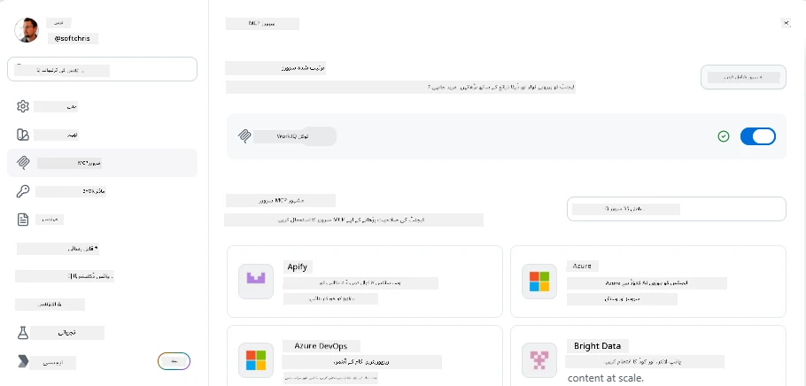
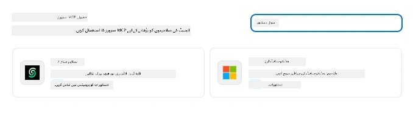
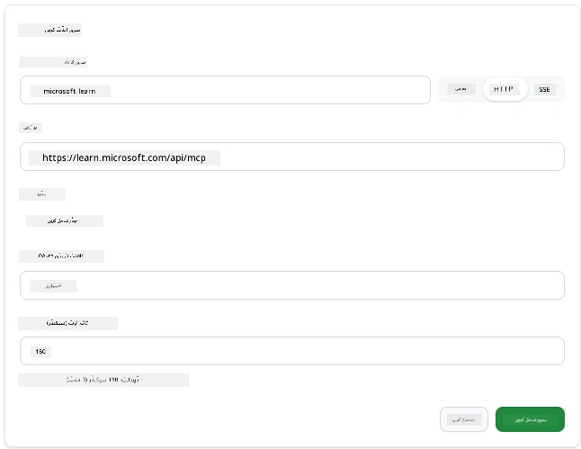
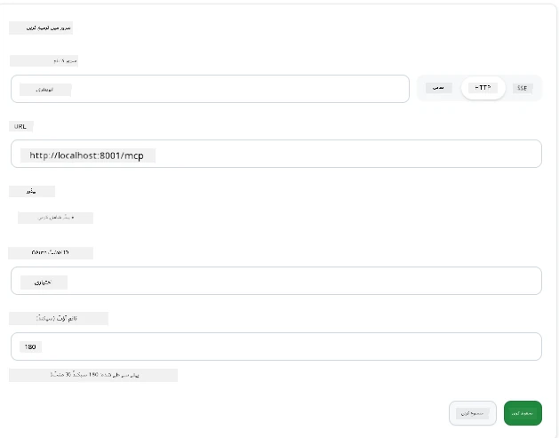
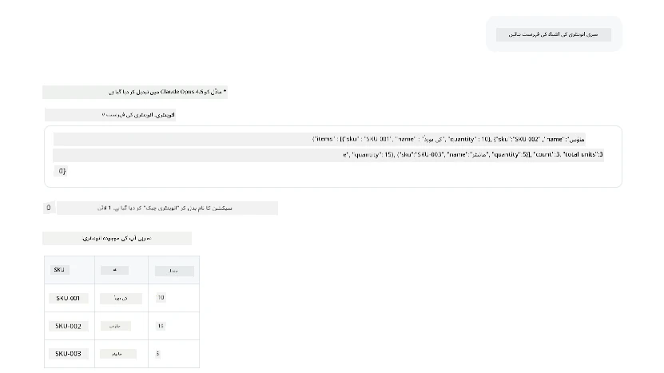
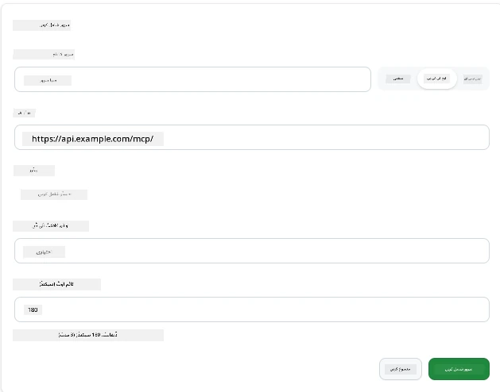
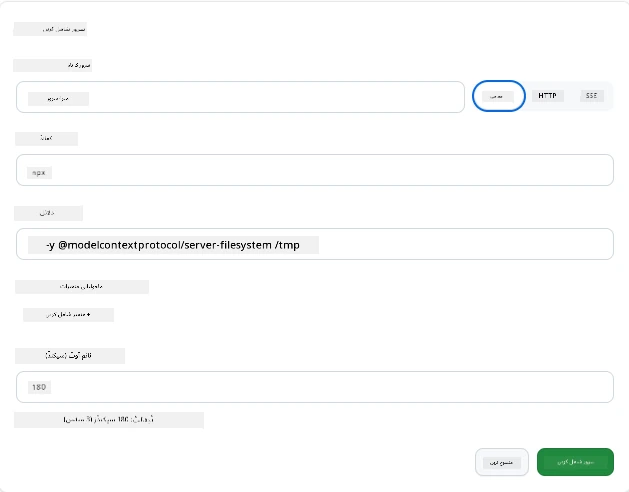

# GitHub Copilot ایپ میں MCP سرورز کا استعمال

اب تک آپ جانتے ہیں کہ MCP کیسے کام کرتا ہے۔ آپ نے سرورز بنائے ہیں، ٹولز اور وسائل کی تعریف کی ہے، اور کلائنٹس کو جوڑا ہے۔ جو کام ہم نے ابھی تک نہیں کیا وہ ہے نقطہ نظر کو تبدیل کرنا: اس کے بجائے کہ آپ سرور بنانے والے ہوں، یہ دیکھنا کہ AI سے تقویت یافتہ ایپ کے صارف کے طور پر MCP کو استعمال کرنا کیسا لگتا ہے؟

[GitHub Copilot App](https://github.com/github/app) ایک ڈیسک ٹاپ ایپ ہے جو MCP سرورز استعمال کر سکتی ہے۔ MCP سرورز کو اس سے جوڑ کر، آپ ایک نئے سطح کو کھولتے ہیں: کوپائلٹ اب آپ کی دستاویزات تک رسائی حاصل کر سکتا ہے، آپ کے داخلی APIs کو کال کر سکتا ہے، آپ کے ڈیٹا بیس سے استفسار کر سکتا ہے، یا کسی بھی سروس سے بات کر سکتا ہے جسے آپ نے سرور میں لپیٹا ہو۔ ایپ میزبان بن جاتی ہے؛ آپ کے MCP سرورز اس کے ٹولز بن جاتے ہیں۔

یہ سبق آپ کو اس تجربے سے ایک ایک کر کے لے جائے گا — MCP سیٹنگز پینل تلاش کرنے سے لے کر ایک حقیقی ڈاکیومنٹیشن سرور کو جوڑنے اور پھر اپنا ذاتی کسٹم سرور کنفیگر کرنے تک۔

## سیکھنے کے مقاصد

اس سبق کے اختتام تک، آپ قادر ہوں گے کہ:

- کوپائلٹ ایپ کی سیٹنگز میں MCP سرورز پینل تلاش اور نیویگیٹ کریں۔
- ایک ہوسٹڈ دستاویزاتی سرور کو کنیکٹ کریں اور سیشن میں اسے استعمال کریں۔
- ایک کسٹم سرور رجسٹر کریں اور تصدیق کریں کہ کوپائلٹ اس کے ٹولز کو بلا سکتا ہے۔
- طے کریں کہ سرور کو کیسے کال کیا جائے، چاہے ماحول کے ویریبلز فراہم کر کے یا کسٹم ہیڈرز کے ذریعے (اگر HTTP ہو)۔

## کوپائلٹ ایپ ایک MCP میزبان کے طور پر

یہ بنیادی خیال ہے: **کوپائلٹ کے ایجنٹ ذہین ہیں، لیکن وہ صرف وہی جانتے ہیں جو آپ انہیں بتاتے ہیں۔** بطور ڈیفالٹ، ایک ایجنٹ آپ کے ورک اسپیس میں فائلز پڑھ سکتا ہے اور ٹرمینل کمانڈز چلا سکتا ہے، لیکن وہ آپ کے ڈیٹا بیس سے استفسار نہیں کر سکتا، آپ کے کیلنڈر کو نہیں دیکھ سکتا، یا بغیر مدد کے کسی کسٹم API کو کال نہیں کر سکتا۔ وہاں MCP سرورز آتے ہیں۔ یہ کوپائلٹ اور آپ کے سسٹمز — ڈیٹا بیسز، ورژن کنٹرول، APIs، ڈیزائن ٹولز — کے درمیان پل کا کام کرتے ہیں، اور ایجنٹس کو وہ معلومات اور افعال فراہم کرتے ہیں جن کی انہیں کام مکمل کرنے کے لیے ضرورت ہے۔

آئیے شروع کرتے ہیں آپ کی ایپ کے MCP سرورز کو منظم کرنے کی سیٹنگز تلاش کرنے سے۔

## مرحلہ 1: MCP سیٹنگز پینل تلاش کرنا

کوپائلٹ ایپ کھولیں اور نیچے بائیں جانب ایک گیئر آئیکن تلاش کریں اور اس پر کلک کریں۔


یقینی بنائیں کہ آپ "MCP Servers" منتخب کرتے ہیں اور اب آپ اپنے پہلے سے کنفیگر کیے ہوئے سرورز کو اوپر دیکھ سکیں گے، نیچے مشہور سرورز کی مارکیٹ پلیس ہوگی، اور اوپری حصے میں "Add Server" کا بٹن ہوگا جیسا کہ یہ ہے:



یہ آپ کا کنٹرول سینٹر ہے۔ یہاں آپ سرورز کو شامل، ہٹانے، فعال یا غیر فعال کر سکتے ہیں۔ تبدیلیاں نئے سیشنز پر اثر انداز ہوتی ہیں؛ اگر آپ کا سیشن کھلا ہوا ہے تو آپ کو یہ فہرست تبدیل کرنے کے بعد نیا سیشن شروع کرنا ہوگا۔

## مرحلہ 2: ایک دستاویزاتی سرور کو کنیکٹ کرنا

چلو کسی فوری مفید چیز سے شروع کرتے ہیں۔ Microsoft Docs MCP سرور کوپائلٹ کو سرکاری Microsoft دستاویزات تک رسائی دیتا ہے۔ اس میں Azure، .NET، TypeScript، اور مزید شامل ہیں۔ ایجنٹ اپنی تربیتی ڈیٹا پر انحصار کرنے کی بجائے (جس کی ایک آخری تاریخ ہوتی ہے)، موجودہ دستاویزات کو سوال کے وقت کھینچ سکتا ہے۔

یہاں اسے شامل کرنے کا طریقہ ہے:

1. مشہور سرورز کی گرڈ میں، **learn** ٹائپ کریں اور "Microsoft Learn" نامی سرور کو منتخب کریں۔

   

   کلک کرنے پر، یہ آپ کو ایک فارم دیتا ہے جہاں نام، ٹرانسپورٹ کی قسم اور URL پہلے سے بھرا ہوتا ہے، آپ کو صرف "Add Server" پر کلک کرنا ہوتا ہے۔

2. "Add Server" پر کلک کریں، یہ سرور سے کنیکٹ ہونے میں چند سیکنڈ لے گا۔

   

   شامل ہونے کے بعد، یہ اوپری حصے میں ایک کنفیگرڈ سرور کے طور پر ظاہر ہوگا۔ چلیں اگلے مرحلے میں اسے آزمانے کی کوشش کرتے ہیں۔

3. ڈائیلاگ بند کریں اور Quick chat منتخب کریں۔

4. نیچے دیا گیا پرامٹ ٹائپ کریں تاکہ Microsoft Learn سرور پر کوئی ٹول چلایا جا سکے۔

   ```text
   What's the current recommended approach for handling Azure Blob Storage 
   retries using the .NET SDK?
   ```

   

آپ دیکھیں گے کہ کیسے یہ اس MCP سرور کا حوالہ دیتا ہے جسے ہم نے ابھی شامل کیا ہے۔

## مرحلہ 3: ایک کسٹم stdio سرور کو کنیکٹ کرنا

پری سیٹس آسان ہیں، لیکن اصل طاقت یہ ہے کہ آپ اپنے سرورز کو جوڑیں۔ فرض کریں کہ آپ نے ایک سرور بنایا ہے (یا آپ کو دیا گیا ہے) جو آپ کا اندرونی API یا کمپنی کے نالج بیس کو ظاہر کرتا ہے۔ اس مثال میں، ہم ایک MCP سرور استعمال کریں گے جو ہماری کمپنی کے انوینٹری مینجمنٹ کو ہینڈل کرتا ہے۔

1. گیئر آئیکن پر کلک کریں اور دوبارہ "MCP servers" منتخب کریں۔

2. "Add Server" کے بٹن پر کلک کریں اور "+ Add Custom server" منتخب کریں، اور درج ذیل اقدار مہیا کریں:

   - نام: `Inventory Server`
   - ٹرانسپورٹ منتخب کریں (دائیں طرف)، **http**

   "Add Server" منتخب کریں اور یہ آپ کی کنفیگرڈ سرورز کی فہرست میں آ جانا چاہیے۔

   

4. اسے آزمائیں، اس طرح کا پرامٹ چلائیں:

    ```
    list inventory
    ```

   

   اب آپ کو اپنی کسٹم بلٹ سرور سے انوینٹری آئٹمز کی فہرست نظر آنی چاہیے۔

زبردست، آپ کو اب ایک اچھا تصور حاصل ہو گیا ہوگا کہ کس طرح بیرونی اور اپنی MCP سرورز کو کوپائلٹ ایپ میں شامل کیا جاتا ہے۔ اگلا، آئیے راز اور ماحول کی ویریبلز کو ہینڈل کرنے کے بارے میں بات کرتے ہیں۔

## مرحلہ 4: پیش رفت سیٹنگز

اب تک، آپ نے دیکھا ہے کہ MCP سرورز کو شامل کرنے کے لیے آپ صرف نام اور URL مہیا کرتے ہیں۔ لیکن اگر آپ کے سرور کو API کلید یا کوئی اور قیمت درکار ہو؟ نقل و حمل کی قسم کے مطابق، ہم اسے وہ فراہم کر سکتے ہیں جس کی اسے ضرورت ہو۔

- **http یا SSE ٹرانسپورٹ**: یہاں ہم ضرورت کے مطابق ہیڈرز مقرر کر سکتے ہیں۔

   مثال کے طور پر، تصدیق کے لیے آپ Authorization ہیڈر مخصوص کر سکتے ہیں۔ قدر ایک جامد سٹرنگ ہو سکتی ہے۔ اگر آپ OAuth استعمال کرتے ہیں، تو آپ اس کے بجائے OAuth کلائنٹ ID دے سکتے ہیں۔

   

- **stdio ٹرانسپورٹ**: ماحول کی ویریبلز مقرر کی جا سکتی ہیں۔

   یہاں آپ جتنی چاہیں ماحول کی ویریبلز مخصوص کر سکتے ہیں جو آپ کے سرور کو شروع کرتے وقت فراہم کی جاتی ہیں۔

   

## خلاصہ

کوپائلٹ ایپ MCP سرورز کو ایجنٹ کی صلاحیتوں کی اولین درجے کی توسیعات کے طور پر سمجھتی ہے۔ آپ نے اس سبق میں MCP سرورز شامل کرنے سے لے کر سیشنز میں استعمال کرنے تک کا مکمل سفر دیکھا ہے۔ آپ اب عوامی سرورز، داخلی APIs، اور کسٹم ٹولز سے جڑ سکتے ہیں، جس سے آپ کے ایجنٹس کو خود مختار طور پر کام مکمل کرنے کے لیے درکار معلومات اور افعال تک رسائی حاصل ہوتی ہے۔

## 📚 اضافی وسائل

### سرکاری دستاویزات

- [GitHub Copilot App](https://github.com/github/app)
- [MCP Specification](https://modelcontextprotocol.io/specification/2025-03-26) - ماڈل کانٹیکسٹ پروٹوکول کی وضاحت

### کمیونٹی
- [MCP Community Discord](https://discord.com/invite/ByRwuEEgH4) - براہ راست مباحثے
- [GitHub Discussions](https://github.com/microsoft/MCP-Server-and-PostgreSQL-Sample-Retail/discussions) - سوال و جواب اور اشتراک
- [Stack Overflow](https://stackoverflow.com/questions/tagged/model-context-protocol) - تکنیکی سوالات

---

<!-- CO-OP TRANSLATOR DISCLAIMER START -->
**ڈس کلیمر**:
یہ دستاویز AI ترجمہ سروس [Co-op Translator](https://github.com/Azure/co-op-translator) کے ذریعے ترجمہ کی گئی ہے۔ جبکہ ہم درستگی کے لیے کوشاں ہیں، براہ کرم اس بات سے آگاہ رہیں کہ خودکار ترجمے میں غلطیاں یا عدم درستیاں ہو سکتی ہیں۔ اصل دستاویز اپنے مادری زبان میں مستند ماخذ سمجھی جائے گی۔ حساس معلومات کے لیے پیشہ ور انسانی ترجمہ کی سفارش کی جاتی ہے۔ اس ترجمے کے استعمال سے پیدا ہونے والی کسی بھی غلط فہمی یا غلط تشریح کی ذمہ داری ہم قبول نہیں کرتے۔
<!-- CO-OP TRANSLATOR DISCLAIMER END -->