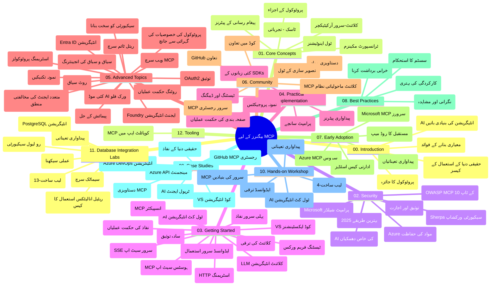

# ماڈل کانٹیکسٹ پروٹوکول (MCP) برائے مبتدی - مطالعہ گائیڈ

یہ مطالعہ گائیڈ "ماڈل کانٹیکسٹ پروٹوکول (MCP) برائے مبتدی" کورس کی ریپوزیٹری کی ساخت اور مواد کا جائزہ فراہم کرتی ہے۔ اس گائیڈ کو استعمال کریں تاکہ ریپوزیٹری کو مؤثر طریقے سے نیویگیٹ کیا جا سکے اور دستیاب وسائل سے زیادہ سے زیادہ فائدہ اٹھایا جا سکے۔

## ریپوزیٹری کا جائزہ

ماڈل کانٹیکسٹ پروٹوکول (MCP) ایک معیاری فریم ورک ہے جو AI ماڈلز اور کلائنٹ ایپلیکیشنز کے درمیان تعاملات کے لیے استعمال ہوتا ہے۔ اسے ابتدائی طور پر انتھروپک نے تیار کیا تھا، اور اب اسے وسیع MCP کمیونٹی آفیشل گٹ ہب تنظیم کے ذریعے برقرار رکھا جاتا ہے۔ یہ ریپوزیٹری ایک جامع نصاب فراہم کرتی ہے جس میں C#، جاوا، جاوا اسکرپٹ، پائتھن، اور ٹائپ اسکرپٹ میں ہینڈز آن کوڈ مثالیں شامل ہیں، جو AI ڈویلپرز، سسٹم آرکیٹیکٹس، اور سافٹ ویئر انجینئرز کے لیے بنائی گئی ہیں۔

## بصری نصاب کا نقشہ

## ریپوزیٹری کی ساخت

ریپوزیٹری بارہ اہم حصوں میں منظم کی گئی ہے، ہر ایک MCP کے مختلف پہلوؤں پر توجہ مرکوز کرتا ہے:

1. **تعارف (00-Introduction/)**
   - ماڈل کانٹیکسٹ پروٹوکول کا جائزہ
   - AI پائپ لائنز میں معیاری بنانے کی اہمیت
   - عملی استعمال کے کیسز اور فوائد

2. **بنیادی تصورات (01-CoreConcepts/)**
   - کلائنٹ-سرور فن تعمیر
   - اہم پروٹوکول اجزاء
   - MCP میں میسجنگ کے نمونے

3. **سیکورٹی (02-Security/)**
   - MCP پر مبنی نظاموں میں سیکورٹی خطرات
   - نفاذ کی حفاظت کے بہترین طریقے
   - تصدیق اور اجازت کی حکمت عملیاں
   - **جامع سیکورٹی دستاویزات**:
     - MCP سیکورٹی بہترین طریقے 2025
     - Azure کانٹینٹ سیفٹی نفاذ گائیڈ
     - MCP سیکورٹی کنٹرولز اور تکنیکس
     - MCP بہترین طریقہ کار فوری حوالہ
   - **اہم سیکورٹی موضوعات**:
     - پرامپٹ انجیکشن اور ٹول پوائزننگ حملے
     - سیشن ہائی جیکنگ اور کنفیوزڈ ڈیپٹی مسائل
     - ٹوکن پاس تھرو کمزوریاں
     - زیادہ اجازتیں اور رسائی کنٹرول
     - AI اجزاء کی سپلائی چین سیکورٹی
     - مائیکروسافٹ پرامپٹ شیلڈز انٹیگریشن

4. **شروع کرنا (03-GettingStarted/)**
   - ماحول کی ترتیب اور کنفیگریشن
   - بنیادی MCP سرور اور کلائنٹ بنانا
   - موجودہ ایپلیکیشنز کے ساتھ انٹیگریشن
   - شامل سیکشنز:
     - پہلا سرور نفاذ
     - کلائنٹ ڈیولپمنٹ
     - LLM کلائنٹ انٹیگریشن
     - VS کوڈ انٹیگریشن
     - سرور-سینٹ ایونٹس (SSE) سرور
     - جدید سرور کا استعمال
     - HTTP اسٹریمنگ
     - AI ٹول کٹ انٹیگریشن
     - ٹیسٹنگ حکمت عملیاں
     - تعیناتی کی رہنمائی

5. **عملی نفاذ (04-PracticalImplementation/)**
   - مختلف پروگرامنگ زبانوں میں SDKs کا استعمال
   - ڈیبگنگ، ٹیسٹنگ، اور تصدیقی تکنیکس
   - قابلِ استعمال پرامپٹ ٹیمپلیٹس اور ورک فلو تیار کرنا
   - نفاذ کی مثالوں کے ساتھ نمونہ پروجیکٹس

6. **جدید موضوعات (05-AdvancedTopics/)**
   - کانٹیکسٹ انجینئرنگ تکنیکس
   - فاؤنڈری ایجنٹ انٹیگریشن
   - ملٹی موڈل AI ورک فلو
   - OAuth2 تصدیقی نمونے
   - ریئل ٹائم تلاش کی صلاحیتیں
   - ریئل ٹائم اسٹریمنگ
   - روٹ کانٹیکسٹس نفاذ
   - روٹنگ حکمت عملیاں
   - سیمپلنگ تکنیکس
   - اسکیلنگ طریقے
   - سیکورٹی اعتبارات
   - انٹرا ID سیکورٹی انٹیگریشن
   - ویب سرچ انٹیگریشن
   - مخالف جماعتی ملٹی ایجنٹ استدلال (ڈبیٹ پیٹرنز)

7. **کمیونٹی تعاون (06-CommunityContributions/)**
   - کوڈ اور دستاویزات میں تعاون کیسے کریں
   - گٹ ہب کے ذریعے تعاون
   - کمیونٹی کی طرف سے بہتریاں اور فیڈ بیک
   - مختلف MCP کلائنٹس کا استعمال (کلاؤڈ ڈیسک ٹاپ، کلائن، VSCode)
   - مقبول MCP سرورز کے ساتھ کام بشمول امیج جنریشن

8. **ابتدائی اپنانے سے سبق (07-LessonsfromEarlyAdoption/)**
   - حقیقی دنیا کی نفاذ اور کامیابی کی کہانیاں
   - MCP پر مبنی حل کی تعمیر اور تعیناتی
   - رحجانات اور مستقبل کا روڈ میپ
   - **مائیکرو سافٹ MCP سرورز گائیڈ**: 10 پروڈکشن ریڈی مائیکرو سافٹ MCP سرورز کی جامع رہنمائی بشمول:
     - مائیکرو سافٹ لرن ڈاکس MCP سرور
     - Azure MCP سرور (15+ خصوصی کنیکٹرز)
     - GitHub MCP سرور
     - Azure DevOps MCP سرور
     - MarkItDown MCP سرور
     - SQL سرور MCP سرور
     - Playwright MCP سرور
     - Dev Box MCP سرور
     - مائیکروسافٹ فاؤنڈری MCP سرور
     - Microsoft 365 Agents Toolkit MCP سرور

9. **بہترین طریقے (08-BestPractices/)**
   - کارکردگی کی ٹیوننگ اور اصلاح
   - خرابی برداشت کرنے والے MCP نظام ڈیزائن کرنا
   - ٹیسٹنگ اور لچکدار حکمت عملیاں

10. **کیس اسٹڈیز (09-CaseStudy/)**
    - **سات جامع کیس اسٹڈیز** جو مختلف حالات میں MCP کی لچک دکھاتی ہیں:
    - **Azure AI ٹریول ایجنٹس**: Azure OpenAI اور AI سرچ کے ساتھ ملٹی-ایجنٹ آرکیسٹریشن
    - **Azure DevOps انٹیگریشن**: یوٹیوب ڈیٹا اپڈیٹس کے ساتھ ورک فلو عمل کی خود کاری
    - **ریئل ٹائم دستاویزات کی بازیافت**: پائتھن کنسول کلائنٹ HTTP اسٹریمنگ کے ساتھ
    - **انٹرایکٹو اسٹڈی پلان جنریٹر**: Chainlit ویب ایپ بات چیتاتی AI کے ساتھ
    - **ایڈیٹر میں دستاویزات**: VS کوڈ انٹیگریشن گٹ ہب کوپائلٹ ورک فلو کے ساتھ
    - **Azure API مینجمنٹ**: MCP سرور تخلیق کے ساتھ انٹرپرائز API انٹیگریشن
    - **GitHub MCP رجسٹری**: ایکو سسٹم ڈیولپمنٹ اور ایجنٹک انٹیگریشن پلیٹ فارم
    - انٹرپرائز انٹیگریشن، ڈویلپر پروڈکٹویٹی، اور ایکو سسٹم ڈیولپمنٹ کی نفاذی مثالیں

11. **عملی ورکشاپ (10-StreamliningAIWorkflowsBuildingAnMCPServerWithAIToolkit/)**
    - AI ٹول کٹ کے ساتھ MCP کو ملا کر جامع عملی ورکشاپ
    - ذہین ایپس بنانا جو AI ماڈلز کو حقیقی دنیا کے آلات سے جوڑتی ہیں
    - عملی ماڈیولز جو بنیادی باتوں، کسٹم سرور ڈیولپمنٹ، اور پروڈکشن تعیناتی حکمت عملیوں کا احاطہ کرتے ہیں
    - **لیب کی ساخت**:
      - لیب 1: MCP سرور کی بنیادیات
      - لیب 2: جدید MCP سرور ڈیولپمنٹ
      - لیب 3: AI ٹول کٹ انٹیگریشن
      - لیب 4: پروڈکشن تعیناتی اور اسکیلنگ
    - لیب پر مبنی تعلیمی طریقہ کار، مرحلہ وار ہدایات کے ساتھ

12. **MCP سرور ڈیٹا بیس انٹیگریشن لیبز (11-MCPServerHandsOnLabs/)**
    - پوسٹگری ایس کیو ایل انٹیگریشن کے ساتھ پروڈکشن ریڈی MCP سرورز بنانے کے لیے **13-لیب جامع تعلیمی راستہ**
    - Zava ریٹیل کے استعمال کیس کے ذریعہ حقیقی دنیا کی ریٹیل تجزیاتی نفاذ
    - انٹرپرائز گریڈ پیٹرنز بشمول رو لیول سیکورٹی (RLS)، سمنٹک سرچ، اور ملٹی ٹیننٹ ڈیٹا رسائی
    - **مکمل لیب کی ساخت**:
      - **لیبز 00-03: بنیادیات** - تعارف، فن تعمیر، سیکورٹی، ماحول کی ترتیب
      - **لیبز 04-06: MCP سرور کی تعمیر** - ڈیٹا بیس ڈیزائن، MCP سرور نفاذ، ٹول ڈیولپمنٹ
      - **لیبز 07-09: جدید خصوصیات** - سمنٹک سرچ، ٹیسٹنگ اور ڈیبگنگ، VS کوڈ انٹیگریشن
      - **لیبز 10-12: پروڈکشن اور بہترین طریقے** - تعیناتی، نگرانی، اصلاح
    - **شامل ٹیکنالوجیز**: FastMCP فریم ورک، پوسٹگری ایس کیو ایل، Azure OpenAI، Azure کنٹینر ایپس، ایپلیکیشن انسائٹس
    - **تعلیمی نتائج**: پروڈکشن ریڈی MCP سرورز، ڈیٹا بیس انٹیگریشن پیٹرنز، AI طاقتور تجزیات، انٹرپرائز سیکورٹی

13. **ٹولنگ (12-tooling/)**
    - MCP کو کوپائلٹ ایپ اور دیگر آلات میں استعمال کرنا سیکھیں

## اضافی وسائل

ریپوزیٹری اضافی معاون وسائل شامل کرتی ہے:

- **Images فولڈر**: نصاب میں استعمال ہونے والے خاکے اور وضاحتی تصاویر
- **Translations**: خودکار ڈاکیومنٹیشن ترجمہ کے ساتھ کثیر لسانی معاونت
- **سرکاری MCP وسائل**:
  - [MCP Documentation](https://modelcontextprotocol.io/)
  - [MCP Specification](https://spec.modelcontextprotocol.io/)
  - [MCP GitHub Repository](https://github.com/modelcontextprotocol)

## اس ریپوزیٹری کو کیسے استعمال کریں

1. **ترتیب وار سیکھنا**: ایک منظم تعلیمی تجربے کے لیے ابواب کو ترتیب سے (00 سے 11 تک) فالو کریں۔
2. **زبان پر مبنی توجہ**: اگر آپ کسی خاص پروگرامنگ زبان میں دلچسپی رکھتے ہیں، تو اپنی پسندیدہ زبان میں نفاذ کے لیے سیمپلز ڈائریکٹریز کو دریافت کریں۔
3. **عملی نفاذ**: "شروع کرنا" سیکشن سے اپنے ماحول کی ترتیب دیں اور اپنا پہلا MCP سرور اور کلائنٹ بنائیں۔
4. **جدید تحقیق**: بنیادی باتوں پر عبور حاصل کرنے کے بعد جدید موضوعات میں جائیں تاکہ اپنے علم کو وسعت دیں۔
5. **کمیونٹی میں حصہ لیں**: گٹ ہب مباحثوں اور ڈسکارڈ چینلز کے ذریعے MCP کمیونٹی میں شامل ہوں تاکہ ماہرین اور دیگر ڈویلپرز سے جڑ سکیں۔

## MCP کلائنٹس اور ٹولز

نصاب میں مختلف MCP کلائنٹس اور ٹولز شامل ہیں:

1. **سرکاری کلائنٹس**:
   - Visual Studio Code
   - Visual Studio Code میں MCP
   - Claude Desktop
   - VSCode میں Claude
   - Claude API

2. **کمیونٹی کلائنٹس**:
   - Cline (ٹرمینل بیسڈ)
   - Cursor (کوڈ ایڈیٹر)
   - ChatMCP
   - Windsurf

3. **MCP مینجمنٹ ٹولز**:
   - MCP CLI
   - MCP Manager
   - MCP Linker
   - MCP Router

## مقبول MCP سرورز

ریپوزیٹری مختلف MCP سرورز متعارف کراتی ہے، بشمول:

1. **سرکاری مائیکرو سافٹ MCP سرورز**:
   - Microsoft Learn Docs MCP سرور
   - Azure MCP سرور (15+ خصوصی کنیکٹرز)
   - GitHub MCP سرور
   - Azure DevOps MCP سرور
   - MarkItDown MCP سرور
   - SQL Server MCP سرور
   - Playwright MCP سرور
   - Dev Box MCP سرور
   - Microsoft Foundry MCP سرور
   - Microsoft 365 Agents Toolkit MCP سرور

2. **سرکاری ریفرنس سرورز**:
   - فائل سسٹم
   - Fetch
   - میموری
   - Sequential Thinking

3. **امیج جنریشن**:
   - Azure OpenAI DALL-E 3
   - Stable Diffusion WebUI
   - Replicate

4. **ڈویلپمنٹ ٹولز**:
   - Git MCP
   - Terminal Control
   - Code Assistant

5. **خصوصی سرورز**:
   - Salesforce
   - Microsoft Teams
   - Jira & Confluence

## تعاون کرنا

یہ ریپوزیٹری کمیونٹی سے تعاون کا خیر مقدم کرتی ہے۔ MCP ایکو سسٹم میں مؤثر تعاون کے لیے کمیونٹی تعاون کے سیکشن کو دیکھیں۔

----

*یہ مطالعہ گائیڈ آخری بار 5 فروری 2026 کو اپ ڈیٹ کی گئی تھی، جو MCP اسپیسفکیشن 2025-11-25 کی تازہ ترین تفصیلات کو ظاہر کرتی ہے اور اس تاریخ کے مطابق ریپوزیٹری کا جائزہ فراہم کرتی ہے۔ ریپوزیٹری کا مواد اس تاریخ کے بعد اپ ڈیٹ ہو سکتا ہے۔*

---

<!-- CO-OP TRANSLATOR DISCLAIMER START -->
**ڈس کلیمر**:
یہ دستاویز AI ترجمہ سروس [Co-op Translator](https://github.com/Azure/co-op-translator) کے ذریعے ترجمہ کی گئی ہے۔ جبکہ ہم درستگی کے لیے کوشاں ہیں، براہ کرم اس بات سے آگاہ رہیں کہ خودکار ترجمے میں غلطیاں یا عدم درستیاں ہو سکتی ہیں۔ اصل دستاویز اپنے مادری زبان میں مستند ماخذ سمجھی جائے گی۔ حساس معلومات کے لیے پیشہ ور انسانی ترجمہ کی سفارش کی جاتی ہے۔ اس ترجمے کے استعمال سے پیدا ہونے والی کسی بھی غلط فہمی یا غلط تشریح کی ذمہ داری ہم قبول نہیں کرتے۔
<!-- CO-OP TRANSLATOR DISCLAIMER END -->