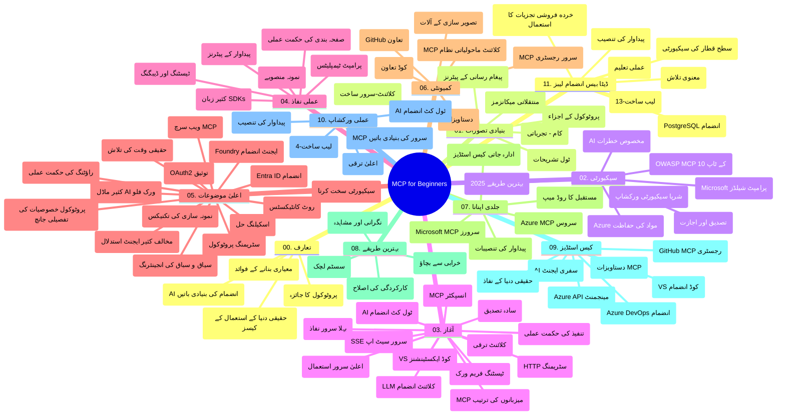

# ماڈل کانٹیکسٹ پروٹوکول (MCP) مبتدیوں کے لیے - مطالعہ گائیڈ

یہ مطالعہ گائیڈ "ماڈل کانٹیکسٹ پروٹوکول (MCP) مبتدیوں کے لیے" نصاب کے لئے ریپوزیٹری کی ساخت اور مواد کا جائزہ فراہم کرتی ہے۔ اس گائیڈ کو مؤثر طریقے سے ریپوزیٹری میں نیویگیٹ کرنے اور دستیاب وسائل سے بھرپور فائدہ اٹھانے کے لیے استعمال کریں۔

## ریپوزیٹری کا جائزہ

ماڈل کانٹیکسٹ پروٹوکول (MCP) اے آئی ماڈلز اور کلائنٹ ایپلیکیشنز کے درمیان تعاملات کے لیے ایک معیاری فریم ورک ہے۔ ابتدا میں اینتھروپک کی طرف سے تیار کیا گیا، MCP اب وسیع MCP کمیونٹی کے ذریعے سرکاری GitHub تنظیم کے ذریعہ برقرار رکھا جا رہا ہے۔ یہ ریپوزیٹری AI ڈویلپرز، سسٹم آرکیٹیکٹس، اور سوفٹ ویئر انجینئرز کے لیے C#، جاوا، جاواسکرپٹ، پائتھون، اور ٹائپ اسکرپٹ میں عملی کوڈ مثالوں کے ساتھ ایک جامع نصاب مہیا کرتی ہے۔

## بصری نصاب کا نقشہ

## ریپوزیٹری کی ساخت

ریپوزیٹری گیارہ بنیادی سیکشنز میں منظم ہے، ہر ایک MCP کے مختلف پہلوؤں پر توجہ مرکوز کرتا ہے:

1. **تعارف (00-Introduction/)**
   - ماڈل کانٹیکسٹ پروٹوکول کا جائزہ
   - AI پائپ لائنز میں معیار بندی کیوں اہم ہے
   - عملی استعمال کے مقدمات اور فوائد

2. **اہم تصورات (01-CoreConcepts/)**
   - کلائنٹ-سرور فن تعمیر
   - پروٹوکول کے کلیدی اجزاء
   - MCP میں پیغام رسانی کے پیٹرنز

3. **سلامتی (02-Security/)**
   - MCP پر مبنی نظاموں میں سیکیورٹی خطرات
   - نفاذ کو محفوظ بنانے کے لئے بہترین طریقے
   - توثیق اور اجازت کی حکمت عملی
   - **جامع سیکیورٹی دستاویزات**:
     - MCP سیکیورٹی بہترین طریقے 2025
     - Azure مواد حفاظت نفاذ گائیڈ
     - MCP سیکیورٹی کنٹرولز اور تکنیکیں
     - MCP بہترین طریقے فوری حوالہ
   - **کلیدی سیکیورٹی موضوعات**:
     - پرامپٹ انجیکشن اور ٹول زہر آلودگی حملے
     - سیشن ہائی جیکنگ اور کنفیوزڈ ڈیپٹی مسائل
     - ٹوکن پاس تھرو کی کمزوریاں
     - ضرورت سے زیادہ اجازتیں اور رسائی کنٹرول
     - AI کے اجزاء کی سپلائی چین سیکیورٹی
     - مائیکروسافٹ پرامپٹ شیلڈز انضمام

4. **شروع کرنے کے لئے (03-GettingStarted/)**
   - ماحول کی ترتیب اور کنفیگریشن
   - بنیادی MCP سرورز اور کلائنٹس بنانا
   - موجودہ ایپلیکیشنز کے ساتھ انضمام
   - شامل شعبے:
     - پہلا سرور نفاذ
     - کلائنٹ ڈویلپمنٹ
     - LLM کلائنٹ انضمام
     - VS کوڈ انضمام
     - سرور سینٹ ایونٹس (SSE) سرور
     - ایڈوانسڈ سرور استعمال
     - HTTP اسٹریمنگ
     - AI ٹول کٹ انضمام
     - ٹیسٹنگ حکمت عملیاں
     - تعیناتی کی ہدایات

5. **عملی نفاذ (04-PracticalImplementation/)**
   - مختلف پروگرامنگ زبانوں میں SDK استعمال کرنا
   - ڈیبگنگ، ٹیسٹنگ، اور تصدیق کی تکنیکیں
   - قابل استعمال پرامپٹ ٹیمپلیٹس اور ورک فلو تیار کرنا
   - عملی مثالوں کے ساتھ پروجیکٹس

6. **جدید موضوعات (05-AdvancedTopics/)**
   - کانٹیکسٹ انجینئرنگ تکنیکیں
   - فاؤنڈری ایجنٹ انضمام
   - کثیر النوع AI ورک فلو
   - OAuth2 توثیق ڈیموز
   - حقیقی وقت کی تلاش کی صلاحیتیں
   - حقیقی وقت اسٹریمنگ
   - روٹ کانٹیکسٹس کا نفاذ
   - روٹنگ حکمت عملیاں
   - سیمپلنگ تکنیکیں
   - اسکیلنگ طریقے
   - سیکیورٹی کے ملاحظات
   - Entra ID سیکیورٹی انضمام
   - ویب سرچ انضمام
   - مخالف کثیر ایجنٹ استدلال (ڈبےٹ پیٹرنز)

7. **کمیونٹی تعاون (06-CommunityContributions/)**
   - کوڈ اور دستاویزات میں تعاون کیسے کریں
   - GitHub کے ذریعے تعاون
   - کمیونٹی سے چلنے والی ترقیات اور تاثرات
   - مختلف MCP کلائنٹس کا استعمال (Claude Desktop, Cline, VSCode)
   - تصویر سازی سمیت مشہور MCP سرورز کے ساتھ کام کرنا

8. **ابتدائی اپنانے کی مثالیں (07-LessonsfromEarlyAdoption/)**
   - حقیقی دنیا کی نفاذ اور کامیابی کی کہانیاں
   - MCP پر مبنی حل تیار کرنا اور تعینات کرنا
   - رجحانات اور مستقبل کا روڈ میپ
   - **مائیکروسافٹ MCP سرورز گائیڈ**: 10 پروڈکشن ریڈی مائیکروسافٹ MCP سرورز کا جامع گائیڈ بشمول:
     - Microsoft Learn Docs MCP سرور
     - Azure MCP سرور (15+ مخصوص کنیکٹرز)
     - GitHub MCP سرور
     - Azure DevOps MCP سرور
     - MarkItDown MCP سرور
     - SQL Server MCP سرور
     - Playwright MCP سرور
     - Dev Box MCP سرور
     - Microsoft Foundry MCP سرور
     - Microsoft 365 Agents Toolkit MCP سرور

9. **بہترین طریقے (08-BestPractices/)**
   - کارکردگی کی بہتری اور اصلاح
   - فولٹ ٹالرنٹ MCP نظام ڈیزائن کرنا
   - ٹیسٹنگ اور مضبوطی کی حکمت عملیاں

10. **کیس اسٹڈیز (09-CaseStudy/)**
    - **سات جامع کیس اسٹڈیز** جو MCP کی لچک کو مختلف حالات میں ظاہر کرتی ہیں:
    - **Azure AI ٹریول ایجنٹس**: Azure OpenAI اور AI سرچ کے ساتھ کثیر ایجنٹ تنظیم
    - **Azure DevOps انضمام**: یوٹیوب ڈیٹا اپ ڈیٹس کے ساتھ ورک فلو عمل کو خودکار بنانا
    - **حقیقی وقت دستاویز بازیافت**: پائتھون کنسول کلائنٹ ایچ ٹی ٹی پی اسٹریمنگ کے ساتھ
    - **انٹرایکٹو اسٹڈی پلان جنریٹر**: Chainlit ویب ایپ گفتگو AI کے ساتھ
    - **ان ایڈیٹر دستاویزات**: VS کوڈ انضمام GitHub Copilot ورک فلو کے ساتھ
    - **Azure API مینجمنٹ**: انٹرپرائز API انضمام اور MCP سرور تخلیق
    - **GitHub MCP رجسٹری**: ایکو سسٹم ڈیولپمنٹ اور ایجنٹک انضمام پلیٹ فارم
    - انٹرپرائز انضمام، ڈویلپر پروڈکٹیویٹی، اور ایکوسسٹم ڈیولپمنٹ کی مثالیں

11. **ہاتھوں ہاتھ ورکشاپ (10-StreamliningAIWorkflowsBuildingAnMCPServerWithAIToolkit/)**
    - MCP کو AI ٹول کٹ کے ساتھ جوڑنے والی مکمل ہاتھوں ہاتھ ورکشاپ
    - AI ماڈلز اور حقیقی دنیا کے ٹولز کے درمیان ذہین ایپلیکیشنز بنانا
    - عملی ماڈیولز بنیادیات، کسٹم سرور ڈویلپمنٹ، اور پروڈکشن تعیناتی حکمت عملیوں کو کور کرتے ہیں
    - **لیب کی ساخت**:
      - لیب 1: MCP سرور بنیادیات
      - لیب 2: ایڈوانسڈ MCP سرور ڈویلپمنٹ
      - لیب 3: AI ٹول کٹ انضمام
      - لیب 4: پروڈکشن تعیناتی اور اسکیلنگ
    - لیب کی بنیاد پر سیکھنے کا طریقہ کار قدم بہ قدم ہدایات کے ساتھ

12. **MCP سرور ڈیٹا بیس انضمام لیبز (11-MCPServerHandsOnLabs/)**
    - **13 لیبز پر مشتمل مکمل سیکھنے کا راستہ** PostgreSQL انضمام کے ساتھ پروڈکشن ریڈی MCP سرور بنانے کے لیے
    - **حقیقی دنیا کی ریٹیل اینالیٹکس نفاذ** Zava Retail استعمال کے کیس کے ذریعے
    - **انٹرپرائز گریڈ پیٹرنز** بشمول رو لیول سیکیورٹی (RLS)، سیمانٹک سرچ، اور کثیر کرایہ دار ڈیٹا رسائی
    - **مکمل لیب کی ساخت**:
      - **لیب 00-03: بنیادیں** - تعارف، فن تعمیر، سیکیورٹی، ماحول کی ترتیب
      - **لیب 04-06: MCP سرور کی تعمیر** - ڈیٹا بیس ڈیزائن، MCP سرور نفاذ، ٹول کی ترقی
      - **لیب 07-09: جدید فیچرز** - سیمانٹک سرچ، ٹیسٹنگ اور ڈیبگنگ، VS کوڈ انضمام
      - **لیب 10-12: تعیناتی اور بہترین طریقے** - تعیناتی، نگرانی، اصلاح
    - **شامل ٹیکنالوجیز**: FastMCP فریم ورک، PostgreSQL، Azure OpenAI، Azure Container Apps، Application Insights
    - **سیکھنے کے نتائج**: پروڈکشن ریڈی MCP سرور، ڈیٹا بیس انضمام پیٹرنز، AI سے چلنے والی اینالیٹکس، انٹرپرائز سیکیورٹی

## اضافی وسائل

ریپوزیٹری میں معاون وسائل شامل ہیں:

- **تصاویر فولڈر**: نصاب میں استعمال ہونے والے خاکے اور تصاویر
- **ترجمے**: دستاویزات کا خودکار ترجمہ کے ساتھ کثیر لسانی معاونت
- **سرکاری MCP وسائل**:
  - [MCP دستاویزات](https://modelcontextprotocol.io/)
  - [MCP وضاحت](https://spec.modelcontextprotocol.io/)
  - [MCP GitHub ریپوزیٹری](https://github.com/modelcontextprotocol)

## اس ریپوزیٹری کا استعمال کیسے کریں

1. **متسلسل سیکھنا**: منظم سیکھنے کے لیے ابواب کو ترتیب سے (00 تا 11) فالو کریں۔
2. **زبان پر توجہ**: اگر آپ کسی خاص پروگرامنگ زبان میں دلچسپی رکھتے ہیں، تو اپنی پسندیدہ زبان میں نفاذ کے لیے نمونہ ڈائریکٹریوں کا جائزہ لیں۔
3. **عملی نفاذ**: "شروع کرنے کے لیے" سیکشن سے شروع کریں تاکہ اپنا ماحول ترتیب دیں اور اپنا پہلا MCP سرور اور کلائنٹ بنائیں۔
4. **جدید کھوج**: بنیادیات میں راحت پانے کے بعد، اپنے علم کو بڑھانے کے لیے جدید موضوعات میں غوطہ لگائیں۔
5. **کمیونٹی کی شرکت**: GitHub مباحثوں اور Discord چینلز کے ذریعے MCP کمیونٹی میں شامل ہوں تاکہ ماہرین اور دیگر ڈویلپرز سے جڑ سکیں۔

## MCP کلائنٹس اور ٹولز

نصاب میں مختلف MCP کلائنٹس اور ٹولز شامل ہیں:

1. **سرکاری کلائنٹس**:
   - Visual Studio Code
   - Visual Studio Code میں MCP
   - Claude Desktop
   - VSCode میں Claude
   - Claude API

2. **کمیونٹی کلائنٹس**:
   - Cline (ٹرمینل بیسڈ)
   - Cursor (کوڈ ایڈیٹر)
   - ChatMCP
   - Windsurf

3. **MCP مینجمنٹ ٹولز**:
   - MCP CLI
   - MCP مینیجر
   - MCP لنکر
   - MCP روٹر

## مشہور MCP سرورز

ریپوزیٹری مختلف MCP سرورز متعارف کرواتی ہے، جن میں شامل ہیں:

1. **سرکاری مائیکروسافٹ MCP سرورز**:
   - Microsoft Learn Docs MCP سرور
   - Azure MCP سرور (15+ خصوصی کنیکٹرز)
   - GitHub MCP سرور
   - Azure DevOps MCP سرور
   - MarkItDown MCP سرور
   - SQL Server MCP سرور
   - Playwright MCP سرور
   - Dev Box MCP سرور
   - Microsoft Foundry MCP سرور
   - Microsoft 365 Agents Toolkit MCP سرور

2. **سرکاری ریفرنس سرورز**:
   - فائل سسٹم
   - Fetch
   - Memory
   - Sequential Thinking

3. **تصویر سازی**:
   - Azure OpenAI DALL-E 3
   - Stable Diffusion WebUI
   - Replicate

4. **ڈیولپمنٹ ٹولز**:
   - Git MCP
   - Terminal Control
   - Code Assistant

5. **خصوصی سرورز**:
   - Salesforce
   - Microsoft Teams
   - Jira & Confluence

## تعاون کرنا

یہ ریپوزیٹری کمیونٹی کے تعاون کا خیرمقدم کرتی ہے۔ MCP ایکو سسٹم میں مؤثر طریقے سے تعاون کرنے کے لیے کمیونٹی تعاون کے سیکشن کو ملاحظہ کریں۔

----

*یہ مطالعہ گائیڈ آخری بار 5 فروری، 2026 کو MCP وضاحت 2025-11-25 کی تازہ ترین معلومات کی عکاسی کرتے ہوئے اپ ڈیٹ کیا گیا تھا اور اس تاریخ کے مطابق ریپوزیٹری کا جائزہ فراہم کرتا ہے۔ اس تاریخ کے بعد ریپوزیٹری کا مواد اپ ڈیٹ ہو سکتا ہے۔*

---

<!-- CO-OP TRANSLATOR DISCLAIMER START -->
**ڈس کلیمر**:
یہ دستاویز AI ترجمہ سروس [Co-op Translator](https://github.com/Azure/co-op-translator) کے ذریعے ترجمہ کی گئی ہے۔ جبکہ ہم درستگی کے لیے کوشاں ہیں، براہ کرم اس بات سے آگاہ رہیں کہ خودکار ترجمے میں غلطیاں یا عدم درستیاں ہو سکتی ہیں۔ اصل دستاویز اپنے مادری زبان میں مستند ماخذ سمجھی جائے گی۔ حساس معلومات کے لیے پیشہ ور انسانی ترجمہ کی سفارش کی جاتی ہے۔ اس ترجمے کے استعمال سے پیدا ہونے والی کسی بھی غلط فہمی یا غلط تشریح کی ذمہ داری ہم قبول نہیں کرتے۔
<!-- CO-OP TRANSLATOR DISCLAIMER END -->