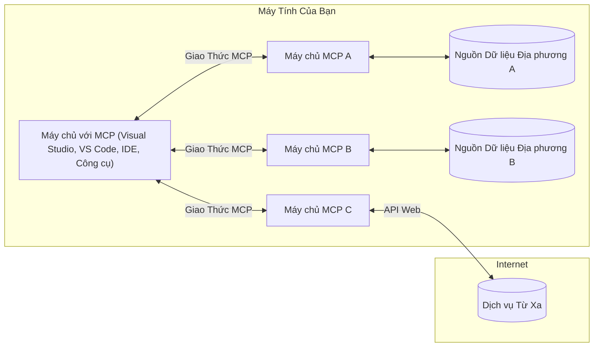

# Khái niệm cốt lõi MCP: Thành thạo Giao thức Ngữ cảnh Mô hình cho tích hợp AI

[](https://youtu.be/earDzWGtE84)

_(Nhấp vào hình ảnh trên để xem video bài học này)_

[Giao thức Ngữ cảnh Mô hình (MCP)](https://github.com/modelcontextprotocol) là một khuôn khổ chuẩn hóa mạnh mẽ giúp tối ưu hóa giao tiếp giữa Các Mô hình Ngôn ngữ Lớn (LLMs) và các công cụ, ứng dụng cũng như nguồn dữ liệu bên ngoài. 
Hướng dẫn này sẽ dẫn bạn qua các khái niệm cốt lõi của MCP. Bạn sẽ tìm hiểu về kiến trúc khách-chủ của nó, các thành phần thiết yếu, cơ chế giao tiếp và các phương pháp triển khai tốt nhất.

- **Sự đồng ý rõ ràng của người dùng**: Mọi truy cập dữ liệu và thao tác đều yêu cầu sự chấp thuận rõ ràng từ người dùng trước khi thực hiện. Người dùng phải hiểu rõ dữ liệu nào sẽ được truy cập và hành động nào sẽ được thực hiện, với khả năng kiểm soát chi tiết các quyền và ủy quyền.

- **Bảo vệ quyền riêng tư dữ liệu**: Dữ liệu người dùng chỉ được tiết lộ khi có sự đồng ý rõ ràng và phải được bảo vệ bằng các kiểm soát truy cập mạnh mẽ trong suốt vòng đời tương tác. Các triển khai phải ngăn chặn việc truyền dữ liệu trái phép và duy trì ranh giới riêng tư nghiêm ngặt.

- **An toàn khi thực thi công cụ**: Mọi lần gọi công cụ đều yêu cầu đồng ý rõ ràng của người dùng với sự hiểu biết đầy đủ về chức năng, tham số và tác động tiềm năng của công cụ. Các ranh giới bảo mật vững chắc phải ngăn chặn việc thực thi công cụ không an toàn, không mong muốn hoặc độc hại.

- **Bảo mật lớp vận chuyển**: Tất cả các kênh giao tiếp nên dùng các cơ chế mã hóa và xác thực phù hợp. Kết nối từ xa nên triển khai các giao thức vận chuyển an toàn và quản lý chứng thực đúng cách.

#### Hướng dẫn triển khai:

- **Quản lý quyền truy cập**: Triển khai hệ thống quyền chi tiết cho phép người dùng kiểm soát máy chủ, công cụ và tài nguyên được phép truy cập
- **Xác thực & Ủy quyền**: Sử dụng các phương pháp xác thực an toàn (OAuth, khóa API) với quản lý token và hết hạn phù hợp  
- **Kiểm tra đầu vào**: Xác thực tất cả tham số và dữ liệu đầu vào theo các sơ đồ định nghĩa để ngăn chặn các cuộc tấn công chèn lệnh
- **Ghi nhật ký kiểm toán**: Duy trì nhật ký toàn diện tất cả các thao tác để giám sát bảo mật và tuân thủ

## Tổng quan

Bài học này khám phá kiến trúc cơ bản và các thành phần tạo nên hệ sinh thái Giao thức Ngữ cảnh Mô hình (MCP). Bạn sẽ tìm hiểu về kiến trúc khách-chủ, các thành phần chủ chốt, và các cơ chế giao tiếp thúc đẩy các tương tác MCP.

## Mục tiêu học tập chính

Sau bài học, bạn sẽ:

- Hiểu kiến trúc khách-chủ của MCP.
- Nhận diện vai trò và trách nhiệm của Hosts, Clients và Servers.
- Phân tích các tính năng cốt lõi giúp MCP trở thành lớp tích hợp linh hoạt.
- Học cách luồng thông tin hoạt động trong hệ sinh thái MCP.
- Đạt được hiểu biết thực tế qua ví dụ mã nguồn trong .NET, Java, Python và JavaScript.

## Kiến trúc MCP: Xem xét sâu hơn

Hệ sinh thái MCP được xây dựng trên mô hình khách-chủ. Cấu trúc mô-đun này cho phép các ứng dụng AI tương tác hiệu quả với công cụ, cơ sở dữ liệu, API và tài nguyên ngữ cảnh. Chúng ta sẽ phân tích kiến trúc này thành các thành phần cốt lõi.

Về cốt lõi, MCP theo kiến trúc khách-chủ, trong đó một ứng dụng host có thể kết nối với nhiều server:


- **MCP Hosts**: Các chương trình như VSCode, Claude Desktop, IDE hoặc công cụ AI muốn truy cập dữ liệu qua MCP
- **MCP Clients**: Các client giao thức giữ kết nối 1:1 với các server
- **MCP Servers**: Các chương trình nhẹ mỗi cái cung cấp các khả năng cụ thể qua Giao thức Ngữ cảnh Mô hình chuẩn hóa
- **Nguồn dữ liệu cục bộ**: File, cơ sở dữ liệu và dịch vụ trên máy tính của bạn mà MCP servers có thể truy cập an toàn
- **Dịch vụ từ xa**: Hệ thống bên ngoài trên internet mà MCP servers có thể kết nối qua API.

Giao thức MCP là tiêu chuẩn phát triển sử dụng phiên bản theo ngày tháng (định dạng YYYY-MM-DD). Phiên bản hiện tại là **2025-11-25**. Bạn có thể xem các cập nhật mới nhất tại [đặc tả giao thức](https://modelcontextprotocol.io/specification/2025-11-25/)

### 1. Hosts

Trong Giao thức Ngữ cảnh Mô hình (MCP), **Hosts** là các ứng dụng AI đóng vai trò giao diện chính mà người dùng tương tác với giao thức. Hosts điều phối và quản lý các kết nối đến nhiều MCP servers bằng cách tạo các MCP client riêng biệt cho từng kết nối server. Ví dụ về Hosts:

- **Ứng dụng AI**: Claude Desktop, Visual Studio Code, Claude Code
- **Môi trường phát triển**: IDE và trình soạn thảo mã tích hợp MCP  
- **Ứng dụng tùy chỉnh**: Các tác nhân AI và công cụ xây dựng theo mục đích

**Hosts** là ứng dụng điều phối các tương tác mô hình AI. Chúng:

- **Điều phối mô hình AI**: Thực thi hoặc tương tác với LLM để tạo phản hồi và điều phối luồng công việc AI
- **Quản lý kết nối client**: Tạo và duy trì một client MCP cho mỗi kết nối đến server MCP
- **Điều khiển giao diện người dùng**: Xử lý luồng hội thoại, tương tác người dùng và hiển thị phản hồi  
- **Áp dụng bảo mật**: Kiểm soát quyền, giới hạn bảo mật và xác thực
- **Xử lý sự đồng ý của người dùng**: Quản lý sự chấp thuận của người dùng cho chia sẻ dữ liệu và thực thi công cụ


### 2. Clients

**Clients** là thành phần quan trọng duy trì các kết nối riêng biệt 1-1 giữa Hosts và MCP servers. Mỗi client MCP được host tạo ra để kết nối đến một server MCP cụ thể, giúp tổ chức và bảo mật kênh giao tiếp. Nhiều client cho phép host kết nối đồng thời tới nhiều server.

**Clients** là các thành phần kết nối bên trong ứng dụng host. Chúng:

- **Giao tiếp giao thức**: Gửi các yêu cầu JSON-RPC 2.0 đến server với các prompt và hướng dẫn
- **Đàm phán tính năng**: Đàm phán các tính năng được hỗ trợ và phiên bản giao thức với server khi khởi tạo
- **Thực thi công cụ**: Quản lý yêu cầu thực thi công cụ từ mô hình và xử lý phản hồi
- **Cập nhật thời gian thực**: Xử lý thông báo và cập nhật thời gian thực từ server
- **Xử lý phản hồi**: Xử lý và định dạng phản hồi của server để hiển thị cho người dùng

### 3. Servers

**Servers** là các chương trình cung cấp ngữ cảnh, công cụ và khả năng cho các client MCP. Chúng có thể thực thi cục bộ (trên cùng máy với Host) hoặc từ xa (trên nền tảng bên ngoài), chịu trách nhiệm xử lý các yêu cầu của client và cung cấp phản hồi có cấu trúc. Các server cung cấp các chức năng cụ thể qua Giao thức Ngữ cảnh Mô hình chuẩn hóa.

**Servers** là dịch vụ cung cấp ngữ cảnh và khả năng. Chúng:

- **Đăng ký tính năng**: Đăng ký và công bố các nguyên thủy sẵn có (tài nguyên, prompt, công cụ) cho client
- **Xử lý yêu cầu**: Nhận và thực thi các cuộc gọi công cụ, yêu cầu tài nguyên và yêu cầu prompt từ client
- **Cung cấp ngữ cảnh**: Cung cấp thông tin và dữ liệu ngữ cảnh để tăng cường phản hồi mô hình
- **Quản lý trạng thái**: Duy trì trạng thái phiên và xử lý các tương tác cần trạng thái khi cần
- **Thông báo thời gian thực**: Gửi thông báo về thay đổi khả năng và cập nhật cho client đã kết nối

Server có thể do bất kỳ ai phát triển để mở rộng khả năng mô hình với chức năng chuyên biệt, và hỗ trợ cả triển khai cục bộ lẫn từ xa.

### 4. Nguyên thủy Server

Các server trong Giao thức Ngữ cảnh Mô hình (MCP) cung cấp ba **nguyên thủy** cốt lõi làm nền tảng cho các tương tác phong phú giữa client, host và mô hình ngôn ngữ. Các nguyên thủy này xác định các loại thông tin ngữ cảnh và hành động có thể sử dụng qua giao thức.

Server MCP có thể cung cấp bất kỳ kết hợp nào của ba nguyên thủy cốt lõi sau:

#### Tài nguyên

**Tài nguyên** là các nguồn dữ liệu cung cấp thông tin ngữ cảnh cho ứng dụng AI. Chúng đại diện cho nội dung tĩnh hoặc động giúp nâng cao khả năng hiểu và ra quyết định của mô hình:

- **Dữ liệu ngữ cảnh**: Thông tin và ngữ cảnh có cấu trúc cho mô hình AI sử dụng
- **Cơ sở tri thức**: Kho tài liệu, bài viết, sách hướng dẫn và nghiên cứu
- **Nguồn dữ liệu cục bộ**: File, cơ sở dữ liệu, và thông tin hệ thống nội bộ  
- **Dữ liệu bên ngoài**: Phản hồi API, dịch vụ web và dữ liệu hệ thống từ xa
- **Nội dung động**: Dữ liệu thời gian thực cập nhật theo điều kiện bên ngoài

Tài nguyên được định danh bằng URI và hỗ trợ khám phá qua phương thức `resources/list` và truy xuất qua `resources/read`:

```text
file://documents/project-spec.md
database://production/users/schema
api://weather/current
```

#### Prompts

**Prompts** là các mẫu sử dụng lại giúp cấu trúc tương tác với mô hình ngôn ngữ. Chúng cung cấp các mẫu tương tác chuẩn hóa và quy trình làm việc theo mẫu:

- **Tương tác theo mẫu**: Các thông điệp và khởi đầu hội thoại được cấu trúc sẵn
- **Mẫu quy trình**: Các chuỗi chuẩn hóa cho các tác vụ và tương tác phổ biến
- **Ví dụ few-shot**: Mẫu dựa trên ví dụ để hướng dẫn mô hình
- **Prompt hệ thống**: Prompt nền tảng xác định hành vi và ngữ cảnh mô hình
- **Mẫu động**: Prompt có tham số điều chỉnh phù hợp ngữ cảnh cụ thể

Prompts hỗ trợ thay thế biến và có thể được khám phá qua `prompts/list` và truy xuất với `prompts/get`:

```markdown
Generate a {{task_type}} for {{product}} targeting {{audience}} with the following requirements: {{requirements}}
```

#### Tools

**Tools** là các chức năng thực thi mà mô hình AI có thể gọi để thực hiện các hành động cụ thể. Chúng đại diện cho các "động từ" trong hệ sinh thái MCP, cho phép mô hình tương tác với các hệ thống bên ngoài:

- **Chức năng có thể thực thi**: Các thao tác rời rạc mà mô hình có thể gọi với tham số cụ thể
- **Tích hợp hệ thống bên ngoài**: Các cuộc gọi API, truy vấn cơ sở dữ liệu, thao tác file, tính toán
- **Định danh duy nhất**: Mỗi công cụ có tên, mô tả và sơ đồ tham số riêng biệt
- **I/O có cấu trúc**: Công cụ nhận các tham số được xác thực và trả về phản hồi có kiểu dữ liệu rõ ràng
- **Khả năng hành động**: Cho phép mô hình thực hiện các hành động thực tế và lấy dữ liệu trực tiếp

Các công cụ được định nghĩa bằng JSON Schema để xác thực tham số, được khám phá qua `tools/list` và thực thi qua `tools/call`. Công cụ cũng có thể bao gồm **biểu tượng** như siêu dữ liệu bổ sung để trình bày giao diện người dùng tốt hơn.

**Ghi chú công cụ**: Công cụ hỗ trợ các chú thích hành vi (ví dụ: `readOnlyHint`, `destructiveHint`) mô tả liệu công cụ chỉ đọc hay có tính chất phá hủy, giúp client đưa ra quyết định thực thi hợp lý.

Ví dụ định nghĩa công cụ:

```typescript
server.tool(
  "search_products", 
  {
    query: z.string().describe("Search query for products"),
    category: z.string().optional().describe("Product category filter"),
    max_results: z.number().default(10).describe("Maximum results to return")
  }, 
  async (params) => {
    // Thực hiện tìm kiếm và trả về kết quả có cấu trúc
    return await productService.search(params);
  }
);
```

## Nguyên thủy Client

Trong Giao thức Ngữ cảnh Mô hình (MCP), **client** có thể cung cấp các nguyên thủy cho phép server yêu cầu thêm khả năng từ ứng dụng host. Các nguyên thủy phía client này cho phép các triển khai server tương tác phong phú hơn, có thể truy cập khả năng mô hình AI và tương tác người dùng.

### Sampling

**Sampling** cho phép server yêu cầu các hoàn thiện mô hình ngôn ngữ từ ứng dụng AI của client. Nguyên thủy này giúp server truy cập khả năng LLM mà không cần nhúng SDK hoặc quản lý quyền truy cập mô hình:

- **Truy cập độc lập mô hình**: Server có thể yêu cầu hoàn thiện mà không nhúng SDK LLM hay quản lý quyền truy cập mô hình
- **AI khởi xướng bởi server**: Cho phép server tự động tạo nội dung dùng mô hình AI của client
- **Tương tác LLM đệ quy**: Hỗ trợ các kịch bản phức tạp cần trợ giúp AI trong xử lý
- **Tạo nội dung động**: Cho phép server tạo phản hồi ngữ cảnh bằng mô hình host
- **Hỗ trợ gọi công cụ**: Server có thể bao gồm tham số `tools` và `toolChoice` để cho phép mô hình client gọi công cụ trong lúc sampling

Sampling được khởi tạo qua phương thức `sampling/complete`, nơi server gửi yêu cầu hoàn thiện đến client.

### Roots

**Roots** cung cấp phương pháp chuẩn để client mở rộng ranh giới hệ thống tệp cho server, giúp server hiểu thư mục và file mà nó được phép truy cập:

- **Ranh giới hệ thống tệp**: Xác định giới hạn nơi server có thể hoạt động trong hệ thống tệp
- **Kiểm soát truy cập**: Giúp server hiểu thư mục và file được phép truy cập
- **Cập nhật động**: Client có thể thông báo cho server khi danh sách roots thay đổi
- **Định danh dựa trên URI**: Roots sử dụng URI `file://` để xác định thư mục và file có thể truy cập

Roots được khám phá qua phương thức `roots/list`, client gửi thông báo `notifications/roots/list_changed` khi roots thay đổi.

### Elicitation  

**Elicitation** cho phép server yêu cầu thêm thông tin hoặc xác nhận từ người dùng qua giao diện client:

- **Yêu cầu đầu vào người dùng**: Server có thể hỏi thêm thông tin khi cần cho thực thi công cụ
- **Hộp thoại xác nhận**: Yêu cầu người dùng đồng ý cho các thao tác nhạy cảm hoặc có tác động lớn
- **Quy trình tương tác**: Cho phép server tạo các bước tương tác với người dùng theo trình tự
- **Thu thập tham số động**: Thu thập các tham số còn thiếu hoặc tùy chọn khi thực thi công cụ

Yêu cầu elicitation được thực hiện dùng phương thức `elicitation/request` để thu thập đầu vào người dùng qua giao diện client.

**Elicitation chế độ URL**: Server cũng có thể yêu cầu tương tác người dùng qua URL, cho phép dẫn người dùng đến trang web ngoài để xác thực, xác nhận hoặc nhập dữ liệu.

### Logging

**Logging** cho phép server gửi thông điệp ghi nhật ký có cấu trúc đến client nhằm mục đích gỡ lỗi, giám sát và minh bạch vận hành:

- **Hỗ trợ gỡ lỗi**: Cho phép server cung cấp nhật ký thực thi chi tiết để xử lý sự cố
- **Giám sát vận hành**: Gửi cập nhật trạng thái và số liệu hiệu năng đến client
- **Báo cáo lỗi**: Cung cấp bối cảnh lỗi chi tiết và thông tin chẩn đoán
- **Theo dõi kiểm toán**: Tạo nhật ký đầy đủ của các hoạt động và quyết định của server

Thông điệp logging được gửi đến client để minh bạch hoạt động server và hỗ trợ gỡ lỗi.

## Luồng thông tin trong MCP

Giao thức Ngữ cảnh Mô hình (MCP) xác định một luồng thông tin có cấu trúc giữa host, client, server và mô hình. Hiểu luồng này giúp làm rõ cách xử lý các yêu cầu người dùng cũng như cách tích hợp công cụ và dữ liệu bên ngoài vào phản hồi mô hình.
- **Máy chủ Khởi tạo Kết nối**  
  Ứng dụng máy chủ (chẳng hạn như IDE hoặc giao diện trò chuyện) thiết lập kết nối tới máy chủ MCP, thường qua STDIO, WebSocket hoặc phương thức truyền tải được hỗ trợ khác.

- **Đàm phán Năng lực**  
  Khách hàng (nhúng trong máy chủ) và máy chủ trao đổi thông tin về các tính năng, công cụ, tài nguyên và phiên bản giao thức được hỗ trợ. Điều này đảm bảo cả hai bên hiểu rõ khả năng có sẵn cho phiên làm việc.

- **Yêu cầu Người dùng**  
  Người dùng tương tác với máy chủ (ví dụ: nhập một lời nhắc hoặc lệnh). Máy chủ thu thập đầu vào này và chuyển cho khách hàng để xử lý.

- **Sử dụng Tài nguyên hoặc Công cụ**  
  - Khách hàng có thể yêu cầu thêm ngữ cảnh hoặc tài nguyên từ máy chủ (như file, mục cơ sở dữ liệu hoặc bài viết cơ sở tri thức) để làm phong phú thêm sự hiểu biết của mô hình.  
  - Nếu mô hình xác định cần một công cụ (ví dụ: để lấy dữ liệu, thực hiện phép tính hoặc gọi API), khách hàng gửi yêu cầu gọi công cụ tới máy chủ, nêu rõ tên công cụ và tham số.

- **Thực thi bởi Máy chủ**  
  Máy chủ nhận yêu cầu tài nguyên hoặc công cụ, thực hiện các thao tác cần thiết (như chạy hàm, truy vấn cơ sở dữ liệu hoặc lấy file) và trả kết quả cho khách hàng dưới dạng cấu trúc.

- **Tạo Phản hồi**  
  Khách hàng tích hợp các phản hồi từ máy chủ (dữ liệu tài nguyên, kết quả công cụ, v.v.) vào tương tác mô hình đang diễn ra. Mô hình sử dụng thông tin này để tạo phản hồi toàn diện và có liên quan theo ngữ cảnh.

- **Trình bày Kết quả**  
  Máy chủ nhận kết quả cuối cùng từ khách hàng và hiển thị cho người dùng, thường gồm văn bản do mô hình tạo ra và bất kỳ kết quả nào từ thực thi công cụ hoặc tra cứu tài nguyên.

Luồng này cho phép MCP hỗ trợ các ứng dụng AI tương tác, nâng cao và nhận thức ngữ cảnh bằng cách kết nối liền mạch các mô hình với công cụ và nguồn dữ liệu bên ngoài.

## Kiến trúc Giao thức & Các Lớp

MCP bao gồm hai lớp kiến trúc riêng biệt hoạt động cùng nhau để cung cấp một khung giao tiếp hoàn chỉnh:

### Lớp Dữ liệu

**Lớp Dữ liệu** triển khai giao thức MCP cốt lõi dựa trên **JSON-RPC 2.0**. Lớp này định nghĩa cấu trúc thông điệp, ngữ nghĩa và kiểu tương tác:

#### Các Thành phần Cốt lõi:

- **Giao thức JSON-RPC 2.0**: Mọi liên lạc sử dụng định dạng chuẩn JSON-RPC 2.0 cho các cuộc gọi phương thức, phản hồi và thông báo  
- **Quản lý Vòng đời**: Xử lý khởi tạo kết nối, đàm phán năng lực và chấm dứt phiên giữa khách hàng và máy chủ  
- **Nguyên thủy Máy chủ**: Cho phép máy chủ cung cấp chức năng cốt lõi qua công cụ, tài nguyên và lời nhắc  
- **Nguyên thủy Khách hàng**: Cho phép máy chủ yêu cầu lấy mẫu từ LLM, thu thập đầu vào người dùng và gửi thông điệp nhật ký  
- **Thông báo Thời gian thực**: Hỗ trợ thông báo bất đồng bộ để cập nhật động mà không cần polling

#### Tính năng Chính:

- **Đàm phán Phiên bản Giao thức**: Sử dụng phiên bản theo ngày (YYYY-MM-DD) để đảm bảo tương thích  
- **Khám phá Năng lực**: Khách hàng và máy chủ trao đổi thông tin tính năng hỗ trợ trong lúc khởi tạo  
- **Phiên Có trạng thái**: Duy trì trạng thái kết nối qua nhiều tương tác để giữ liên tục ngữ cảnh  

### Lớp Vận chuyển

**Lớp Vận chuyển** quản lý kênh giao tiếp, đóng khung thông điệp và xác thực giữa các thành phần MCP:

#### Cơ chế Vận chuyển Hỗ trợ:

1. **Vận chuyển STDIO**:  
   - Sử dụng luồng nhập/xuất tiêu chuẩn cho giao tiếp tiến trình trực tiếp  
   - Tối ưu cho các tiến trình cục bộ trên cùng máy với không có chi phí mạng  
   - Thường dùng cho các triển khai máy chủ MCP cục bộ  

2. **Vận chuyển HTTP có thể Truyền luồng**:  
   - Sử dụng POST HTTP cho thông điệp từ khách hàng đến máy chủ  
   - Tùy chọn Server-Sent Events (SSE) để phát trực tiếp từ máy chủ đến khách hàng  
   - Cho phép giao tiếp máy chủ từ xa qua mạng  
   - Hỗ trợ xác thực HTTP chuẩn (token bearer, khóa API, tiêu đề tùy chỉnh)  
   - MCP khuyến nghị OAuth cho xác thực an toàn dựa trên token  

#### Trừu tượng Vận chuyển:

Lớp vận chuyển trừu tượng chi tiết giao tiếp khỏi lớp dữ liệu, cho phép sử dụng cùng định dạng JSON-RPC 2.0 qua mọi cơ chế vận chuyển. Trừu tượng này giúp ứng dụng chuyển đổi mượt mà giữa các máy chủ cục bộ và từ xa.

### Các Xem xét về Bảo mật

Các triển khai MCP phải tuân thủ nhiều nguyên tắc bảo mật then chốt nhằm đảm bảo tương tác an toàn, đáng tin cậy và bảo mật cho mọi hoạt động giao thức:

- **Sự Đồng thuận và Kiểm soát của Người dùng**: Người dùng phải cung cấp sự đồng thuận rõ ràng trước khi bất kỳ dữ liệu nào được truy cập hoặc thao tác được thực hiện. Họ nên có kiểm soát rõ ràng về dữ liệu chia sẻ và hành động được ủy quyền, kèm theo giao diện người dùng trực quan để xem xét và phê duyệt hoạt động.

- **Bảo mật Dữ liệu**: Dữ liệu người dùng chỉ được tiết lộ khi có sự đồng thuận rõ ràng và phải được bảo vệ bằng các kiểm soát truy cập phù hợp. Triển khai MCP phải ngăn chặn truyền dữ liệu trái phép và đảm bảo quyền riêng tư được duy trì trong toàn bộ tương tác.

- **An toàn Công cụ**: Trước khi gọi công cụ, cần có sự đồng thuận rõ ràng của người dùng. Người dùng cần hiểu rõ chức năng của từng công cụ, đồng thời có các ranh giới bảo mật kiên cố để ngăn ngừa thực thi công cụ không dự kiến hoặc không an toàn.

Bằng cách theo các nguyên tắc bảo mật này, MCP đảm bảo sự tin cậy, quyền riêng tư và an toàn của người dùng trong mọi tương tác giao thức đồng thời kích hoạt tích hợp AI mạnh mẽ.

## Ví dụ Mã: Thành phần Chính

Dưới đây là các ví dụ mã trong một số ngôn ngữ lập trình phổ biến minh họa cách triển khai các thành phần chính và công cụ máy chủ MCP.

### Ví dụ .NET: Tạo Máy chủ MCP Đơn giản với Công cụ

Dưới đây là ví dụ mã .NET thực tế trình bày cách triển khai một máy chủ MCP đơn giản với các công cụ tùy chỉnh. Ví dụ này minh họa cách định nghĩa và đăng ký công cụ, xử lý yêu cầu, và kết nối máy chủ bằng Giao thức Ngữ cảnh Mô hình.

```csharp
using System;
using System.Threading.Tasks;
using ModelContextProtocol.Server;
using ModelContextProtocol.Server.Transport;
using ModelContextProtocol.Server.Tools;

public class WeatherServer
{
    public static async Task Main(string[] args)
    {
        // Create an MCP server
        var server = new McpServer(
            name: "Weather MCP Server",
            version: "1.0.0"
        );
        
        // Register our custom weather tool
        server.AddTool<string, WeatherData>("weatherTool", 
            description: "Gets current weather for a location",
            execute: async (location) => {
                // Call weather API (simplified)
                var weatherData = await GetWeatherDataAsync(location);
                return weatherData;
            });
        
        // Connect the server using stdio transport
        var transport = new StdioServerTransport();
        await server.ConnectAsync(transport);
        
        Console.WriteLine("Weather MCP Server started");
        
        // Keep the server running until process is terminated
        await Task.Delay(-1);
    }
    
    private static async Task<WeatherData> GetWeatherDataAsync(string location)
    {
        // This would normally call a weather API
        // Simplified for demonstration
        await Task.Delay(100); // Simulate API call
        return new WeatherData { 
            Temperature = 72.5,
            Conditions = "Sunny",
            Location = location
        };
    }
}

public class WeatherData
{
    public double Temperature { get; set; }
    public string Conditions { get; set; }
    public string Location { get; set; }
}
```

### Ví dụ Java: Thành phần Máy chủ MCP

Ví dụ này trình bày cùng máy chủ MCP và đăng ký công cụ như ví dụ .NET ở trên, nhưng được triển khai bằng Java.

```java
import io.modelcontextprotocol.server.McpServer;
import io.modelcontextprotocol.server.McpToolDefinition;
import io.modelcontextprotocol.server.transport.StdioServerTransport;
import io.modelcontextprotocol.server.tool.ToolExecutionContext;
import io.modelcontextprotocol.server.tool.ToolResponse;

public class WeatherMcpServer {
    public static void main(String[] args) throws Exception {
        // Tạo một máy chủ MCP
        McpServer server = McpServer.builder()
            .name("Weather MCP Server")
            .version("1.0.0")
            .build();
            
        // Đăng ký một công cụ thời tiết
        server.registerTool(McpToolDefinition.builder("weatherTool")
            .description("Gets current weather for a location")
            .parameter("location", String.class)
            .execute((ToolExecutionContext ctx) -> {
                String location = ctx.getParameter("location", String.class);
                
                // Lấy dữ liệu thời tiết (đơn giản hóa)
                WeatherData data = getWeatherData(location);
                
                // Trả về phản hồi đã định dạng
                return ToolResponse.content(
                    String.format("Temperature: %.1f°F, Conditions: %s, Location: %s", 
                    data.getTemperature(), 
                    data.getConditions(), 
                    data.getLocation())
                );
            })
            .build());
        
        // Kết nối máy chủ sử dụng giao thức stdio
        try (StdioServerTransport transport = new StdioServerTransport()) {
            server.connect(transport);
            System.out.println("Weather MCP Server started");
            // Giữ máy chủ chạy cho đến khi tiến trình bị kết thúc
            Thread.currentThread().join();
        }
    }
    
    private static WeatherData getWeatherData(String location) {
        // Triển khai sẽ gọi API thời tiết
        // Đơn giản hóa cho mục đích ví dụ
        return new WeatherData(72.5, "Sunny", location);
    }
}

class WeatherData {
    private double temperature;
    private String conditions;
    private String location;
    
    public WeatherData(double temperature, String conditions, String location) {
        this.temperature = temperature;
        this.conditions = conditions;
        this.location = location;
    }
    
    public double getTemperature() {
        return temperature;
    }
    
    public String getConditions() {
        return conditions;
    }
    
    public String getLocation() {
        return location;
    }
}
```

### Ví dụ Python: Xây dựng Máy chủ MCP

Ví dụ này sử dụng fastmcp, vì vậy vui lòng đảm bảo bạn đã cài đặt nó trước:

```python
pip install fastmcp
```
Mẫu Mã:

```python
#!/usr/bin/env python3
import asyncio
from fastmcp import FastMCP
from fastmcp.transports.stdio import serve_stdio

# Tạo một máy chủ FastMCP
mcp = FastMCP(
    name="Weather MCP Server",
    version="1.0.0"
)

@mcp.tool()
def get_weather(location: str) -> dict:
    """Gets current weather for a location."""
    return {
        "temperature": 72.5,
        "conditions": "Sunny",
        "location": location
    }

# Cách tiếp cận thay thế sử dụng một lớp
class WeatherTools:
    @mcp.tool()
    def forecast(self, location: str, days: int = 1) -> dict:
        """Gets weather forecast for a location for the specified number of days."""
        return {
            "location": location,
            "forecast": [
                {"day": i+1, "temperature": 70 + i, "conditions": "Partly Cloudy"}
                for i in range(days)
            ]
        }

# Đăng ký các công cụ lớp
weather_tools = WeatherTools()

# Khởi động máy chủ
if __name__ == "__main__":
    asyncio.run(serve_stdio(mcp))
```

### Ví dụ JavaScript: Tạo Máy chủ MCP

Ví dụ này cho thấy cách tạo máy chủ MCP bằng JavaScript và đăng ký hai công cụ liên quan đến thời tiết.

```javascript
// Sử dụng SDK chính thức của Model Context Protocol
import { McpServer } from "@modelcontextprotocol/sdk/server/mcp.js";
import { StdioServerTransport } from "@modelcontextprotocol/sdk/server/stdio.js";
import { z } from "zod"; // Để xác thực tham số

// Tạo một máy chủ MCP
const server = new McpServer({
  name: "Weather MCP Server",
  version: "1.0.0"
});

// Định nghĩa một công cụ thời tiết
server.tool(
  "weatherTool",
  {
    location: z.string().describe("The location to get weather for")
  },
  async ({ location }) => {
    // Thông thường, điều này sẽ gọi một API thời tiết
    // Đơn giản hóa cho mục đích trình diễn
    const weatherData = await getWeatherData(location);
    
    return {
      content: [
        { 
          type: "text", 
          text: `Temperature: ${weatherData.temperature}°F, Conditions: ${weatherData.conditions}, Location: ${weatherData.location}` 
        }
      ]
    };
  }
);

// Định nghĩa một công cụ dự báo
server.tool(
  "forecastTool",
  {
    location: z.string(),
    days: z.number().default(3).describe("Number of days for forecast")
  },
  async ({ location, days }) => {
    // Thông thường, điều này sẽ gọi một API thời tiết
    // Đơn giản hóa cho mục đích trình diễn
    const forecast = await getForecastData(location, days);
    
    return {
      content: [
        { 
          type: "text", 
          text: `${days}-day forecast for ${location}: ${JSON.stringify(forecast)}` 
        }
      ]
    };
  }
);

// Các hàm trợ giúp
async function getWeatherData(location) {
  // Mô phỏng cuộc gọi API
  return {
    temperature: 72.5,
    conditions: "Sunny",
    location: location
  };
}

async function getForecastData(location, days) {
  // Mô phỏng cuộc gọi API
  return Array.from({ length: days }, (_, i) => ({
    day: i + 1,
    temperature: 70 + Math.floor(Math.random() * 10),
    conditions: i % 2 === 0 ? "Sunny" : "Partly Cloudy"
  }));
}

// Kết nối máy chủ sử dụng giao thức stdio transport
const transport = new StdioServerTransport();
server.connect(transport).catch(console.error);

console.log("Weather MCP Server started");
```

Ví dụ JavaScript này minh họa cách tạo máy chủ MCP đăng ký công cụ liên quan thời tiết và kết nối sử dụng vận chuyển stdio để xử lý các yêu cầu khách hàng đến.

## Bảo mật và Ủy quyền

MCP bao gồm một số khái niệm và cơ chế tích hợp để quản lý bảo mật và ủy quyền trong suốt giao thức:

1. **Kiểm soát Quyền Công cụ**:  
  Khách hàng có thể chỉ định công cụ nào mô hình được phép sử dụng trong phiên. Điều này đảm bảo chỉ các công cụ được ủy quyền rõ ràng mới có thể truy cập, giảm nguy cơ thao tác không chủ đích hoặc không an toàn. Quyền có thể được cấu hình động dựa trên sở thích người dùng, chính sách tổ chức hoặc bối cảnh tương tác.

2. **Xác thực**:  
  Máy chủ có thể yêu cầu xác thực trước khi cấp quyền truy cập công cụ, tài nguyên hoặc thao tác nhạy cảm. Điều này có thể bao gồm khóa API, token OAuth hoặc các sơ đồ xác thực khác. Xác thực thích hợp đảm bảo chỉ khách hàng và người dùng đáng tin cậy mới có thể gọi khả năng phía máy chủ.

3. **Xác nhận**:  
  Kiểm tra tham số được thực thi cho mọi cuộc gọi công cụ. Mỗi công cụ định nghĩa kiểu, định dạng và ràng buộc tham số mong đợi, và máy chủ xác nhận các yêu cầu đến tương ứng. Điều này ngăn nhập dữ liệu sai hoặc độc hại ảnh hưởng đến bộ công cụ và giúp duy trì tính toàn vẹn của thao tác.

4. **Hạn chế Tần suất**:  
  Để ngăn lạm dụng và đảm bảo sử dụng công bằng tài nguyên máy chủ, các máy chủ MCP có thể triển khai giới hạn tần suất cho cuộc gọi công cụ và truy cập tài nguyên. Giới hạn có thể áp dụng theo người dùng, phiên hoặc toàn cục, giúp ngăn chặn tấn công từ chối dịch vụ hoặc sử dụng tài nguyên quá mức.

Bằng cách kết hợp các cơ chế này, MCP cung cấp nền tảng an toàn để tích hợp mô hình ngôn ngữ với công cụ và nguồn dữ liệu bên ngoài, đồng thời trao quyền cho người dùng và nhà phát triển quản lý quyền truy cập và sử dụng chi tiết.

## Tin nhắn Giao thức & Luồng Giao tiếp

Giao tiếp MCP sử dụng các thông điệp **JSON-RPC 2.0** có cấu trúc để tạo điều kiện cho tương tác rõ ràng và đáng tin cậy giữa máy chủ, khách hàng và máy chủ. Giao thức định nghĩa các mẫu tin nhắn cụ thể cho các loại thao tác khác nhau:

### Các Loại Thông điệp Cốt lõi:

#### **Thông điệp Khởi tạo**
- Yêu cầu **`initialize`**: Thiết lập kết nối và đàm phán phiên bản giao thức và năng lực  
- Phản hồi **`initialize`**: Xác nhận các tính năng và thông tin máy chủ được hỗ trợ  
- **`notifications/initialized`**: Báo hiệu khởi tạo hoàn tất và phiên sẵn sàng  

#### **Thông điệp Khám phá**
- Yêu cầu **`tools/list`**: Khám phá các công cụ có sẵn từ máy chủ  
- Yêu cầu **`resources/list`**: Liệt kê các tài nguyên (nguồn dữ liệu)  
- Yêu cầu **`prompts/list`**: Lấy mẫu lời nhắc có sẵn  

#### **Thông điệp Thực thi**  
- Yêu cầu **`tools/call`**: Thực thi một công cụ cụ thể với tham số được cung cấp  
- Yêu cầu **`resources/read`**: Lấy nội dung từ một tài nguyên cụ thể  
- Yêu cầu **`prompts/get`**: Lấy mẫu lời nhắc với tham số tùy chọn  

#### **Thông điệp phía Khách hàng**
- Yêu cầu **`sampling/complete`**: Máy chủ yêu cầu hoàn thành LLM từ khách hàng  
- Yêu cầu **`elicitation/request`**: Máy chủ yêu cầu đầu vào người dùng qua giao diện khách hàng  
- Tin nhắn Ghi nhật ký: Máy chủ gửi các tin nhắn nhật ký có cấu trúc tới khách hàng  

#### **Thông điệp Thông báo**
- **`notifications/tools/list_changed`**: Máy chủ thông báo cho khách hàng về thay đổi công cụ  
- **`notifications/resources/list_changed`**: Máy chủ thông báo cho khách hàng về thay đổi tài nguyên  
- **`notifications/prompts/list_changed`**: Máy chủ thông báo cho khách hàng về thay đổi lời nhắc  

### Cấu trúc Thông điệp:

Tất cả thông điệp MCP tuân theo định dạng JSON-RPC 2.0 với:  
- **Thông điệp Yêu cầu**: Bao gồm `id`, `method`, và tham số tùy chọn `params`  
- **Thông điệp Phản hồi**: Bao gồm `id` và `result` hoặc `error`  
- **Thông điệp Thông báo**: Bao gồm `method` và tham số tùy chọn `params` (không có `id` hoặc phản hồi)  

Giao tiếp có cấu trúc này đảm bảo tương tác đáng tin cậy, có khả năng truy vết và mở rộng hỗ trợ các kịch bản tiên tiến như cập nhật thời gian thực, chuỗi công cụ và xử lý lỗi mạnh mẽ.

### Nhiệm vụ (Thử nghiệm)

**Nhiệm vụ** là tính năng thử nghiệm cung cấp lớp đóng gói thực thi bền vững cho phép truy xuất kết quả trì hoãn và theo dõi trạng thái các yêu cầu MCP:

- **Thao tác Chạy dài**: Theo dõi các phép tính đắt đỏ, tự động hóa quy trình và xử lý theo lô  
- **Kết quả Trì hoãn**: Poll trạng thái nhiệm vụ và lấy kết quả khi hoàn tất thao tác  
- **Theo dõi Trạng thái**: Giám sát tiến trình công việc qua các trạng thái vòng đời đã định nghĩa  
- **Thao tác Nhiều bước**: Hỗ trợ quy trình phức tạp trải rộng nhiều tương tác  

Nhiệm vụ đóng gói yêu cầu MCP tiêu chuẩn để cho phép các mẫu thực thi bất đồng bộ cho các thao tác không thể hoàn thành ngay lập tức.

## Những điểm chính

- **Kiến trúc**: MCP sử dụng kiến trúc máy khách-máy chủ với máy chủ quản lý nhiều kết nối khách  
- **Tham gia**: Hệ sinh thái gồm có máy chủ (ứng dụng AI), khách hàng (bộ nối giao thức) và máy chủ (cung cấp năng lực)  
- **Cơ chế Vận chuyển**: Giao tiếp hỗ trợ STDIO (cục bộ) và HTTP có thể truyền luồng với SSE tùy chọn (từ xa)  
- **Nguyên thủy Cốt lõi**: Máy chủ cung cấp công cụ (hàm thực thi), tài nguyên (nguồn dữ liệu) và lời nhắc (mẫu)  
- **Nguyên thủy Khách hàng**: Máy chủ có thể yêu cầu lấy mẫu (hoàn thành LLM có hỗ trợ gọi công cụ), thu thập đầu vào (bao gồm chế độ URL), định nghĩa ranh giới filesystem, và ghi nhật ký từ khách hàng  
- **Tính năng Thử nghiệm**: Nhiệm vụ cung cấp lớp thực thi bền cho các thao tác chạy dài  
- **Nền tảng Giao thức**: Xây dựng trên JSON-RPC 2.0 với định phiên bản theo ngày (hiện tại: 2025-11-25)  
- **Khả năng Thời gian thực**: Hỗ trợ thông báo cập nhật động và đồng bộ thời gian thực  
- **Ưu tiên Bảo mật**: Đồng thuận người dùng rõ ràng, bảo mật dữ liệu và vận chuyển an toàn là yêu cầu cốt lõi  

## Bài tập

Thiết kế một công cụ MCP đơn giản có thể hữu ích trong lĩnh vực của bạn. Xác định:  
1. Tên công cụ bạn sẽ đặt là gì  
2. Các tham số công cụ chấp nhận  
3. Kết quả đầu ra mà công cụ trả về  
4. Cách một mô hình có thể sử dụng công cụ này để giải quyết vấn đề người dùng  

---

## Tiếp theo

Tiếp theo: [Chương 2: Bảo mật](../02-Security/README.md)

---

<!-- CO-OP TRANSLATOR DISCLAIMER START -->
**Tuyên bố từ chối trách nhiệm**:  
Tài liệu này đã được dịch bằng dịch vụ dịch thuật AI [Co-op Translator](https://github.com/Azure/co-op-translator). Mặc dù chúng tôi cố gắng đảm bảo độ chính xác, xin lưu ý rằng các bản dịch tự động có thể chứa lỗi hoặc không chính xác. Tài liệu gốc bằng ngôn ngữ nguyên bản nên được xem là nguồn tham khảo chính xác nhất. Đối với các thông tin quan trọng, nên sử dụng dịch vụ dịch thuật chuyên nghiệp của con người. Chúng tôi không chịu trách nhiệm đối với bất kỳ hiểu nhầm hoặc diễn giải sai nào phát sinh từ việc sử dụng bản dịch này.
<!-- CO-OP TRANSLATOR DISCLAIMER END -->