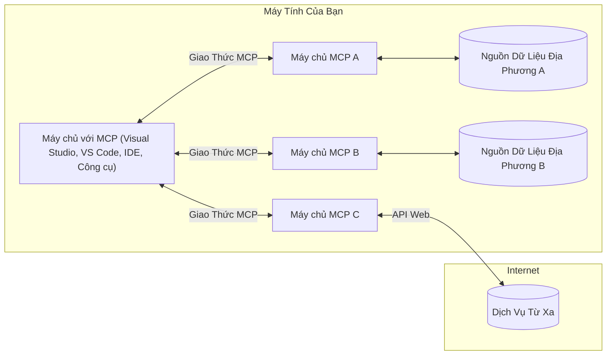

# Khái niệm Cốt lõi MCP: Thành thạo Giao thức Ngữ cảnh Mô hình cho Tích hợp AI

[](https://youtu.be/earDzWGtE84)

_(Nhấp vào hình ảnh trên để xem video bài học này)_

[Giao thức Ngữ cảnh Mô hình (MCP)](https://github.com/modelcontextprotocol) là một khung làm việc tiêu chuẩn hóa mạnh mẽ giúp tối ưu hóa giao tiếp giữa các Mô hình Ngôn ngữ Lớn (LLM) và các công cụ, ứng dụng, nguồn dữ liệu bên ngoài. 
Hướng dẫn này sẽ dẫn bạn qua các khái niệm cốt lõi của MCP. Bạn sẽ tìm hiểu về kiến trúc máy khách-máy chủ của nó, các thành phần thiết yếu, cơ chế giao tiếp và các thực tiễn tốt nhất khi triển khai.

- **Sự đồng ý rõ ràng của người dùng**: Mọi truy cập dữ liệu và thao tác đều yêu cầu sự phê duyệt rõ ràng từ người dùng trước khi thực thi. Người dùng phải hiểu rõ dữ liệu nào sẽ được truy cập và hành động nào sẽ được thực hiện, với quyền kiểm soát chi tiết về các quyền và ủy quyền.

- **Bảo vệ quyền riêng tư dữ liệu**: Dữ liệu người dùng chỉ được hiển thị khi có sự đồng ý rõ ràng và phải được bảo vệ bằng các kiểm soát truy cập chặt chẽ trong suốt vòng đời tương tác. Việc triển khai phải ngăn chặn truyền dữ liệu trái phép và duy trì ranh giới bảo mật nghiêm ngặt.

- **An toàn khi thực thi công cụ**: Mỗi lần gọi công cụ đều yêu cầu sự đồng ý rõ ràng từ người dùng với sự hiểu biết rõ ràng về chức năng, tham số và tác động có thể của công cụ. Ranh giới bảo mật mạnh mẽ phải ngăn chặn thực thi công cụ không an toàn, không mong muốn hoặc gây hại.

- **Bảo mật tầng vận chuyển**: Mọi kênh giao tiếp nên sử dụng cơ chế mã hóa và xác thực phù hợp. Kết nối từ xa cần thực hiện các giao thức truyền tải an toàn và quản lý thông tin đăng nhập đúng cách.

#### Hướng dẫn triển khai:

- **Quản lý quyền**: Triển khai hệ thống quyền tinh vi cho phép người dùng kiểm soát máy chủ, công cụ và tài nguyên nào được truy cập
- **Xác thực & Ủy quyền**: Sử dụng phương pháp xác thực an toàn (OAuth, khóa API) với quản lý token và hết hạn phù hợp  
- **Kiểm tra đầu vào**: Xác thực tất cả tham số và dữ liệu đầu vào theo các lược đồ định nghĩa để ngăn chặn tấn công chèn mã
- **Ghi nhật ký kiểm toán**: Duy trì nhật ký toàn diện các thao tác để theo dõi bảo mật và đáp ứng quy định

## Tổng quan

Bài học này khám phá kiến trúc cơ bản và các thành phần tạo nên hệ sinh thái Giao thức Ngữ cảnh Mô hình (MCP). Bạn sẽ tìm hiểu về kiến trúc máy khách-máy chủ, các thành phần chính, và cơ chế giao tiếp tạo nên các tương tác MCP.

## Mục tiêu học tập chính

Sau bài học, bạn sẽ:

- Hiểu kiến trúc máy khách-máy chủ của MCP.
- Xác định vai trò và trách nhiệm của Hosts, Clients và Servers.
- Phân tích các tính năng cốt lõi làm cho MCP trở thành lớp tích hợp linh hoạt.
- Tìm hiểu cách luồng thông tin trong hệ sinh thái MCP hoạt động.
- Có được hiểu biết thực tế thông qua ví dụ mã trong .NET, Java, Python và JavaScript.

## Kiến trúc MCP: Nhìn sâu

Hệ sinh thái MCP xây dựng trên mô hình máy khách-máy chủ. Cấu trúc mô-đun này cho phép ứng dụng AI tương tác hiệu quả với công cụ, cơ sở dữ liệu, API và tài nguyên theo ngữ cảnh. Hãy cùng phân tích kiến trúc này thành các thành phần cốt lõi.

Về cơ bản, MCP tuân theo kiến trúc máy khách-máy chủ trong đó một ứng dụng host có thể kết nối đến nhiều server:


- **MCP Hosts**: Các chương trình như VSCode, Claude Desktop, IDEs hoặc công cụ AI muốn truy cập dữ liệu qua MCP
- **MCP Clients**: Các client giao thức duy trì kết nối 1:1 với các server
- **MCP Servers**: Các chương trình nhẹ cung cấp các khả năng cụ thể thông qua Giao thức Ngữ cảnh Mô hình tiêu chuẩn hóa
- **Nguồn Dữ liệu Cục bộ**: Các tập tin, cơ sở dữ liệu và dịch vụ trên máy tính của bạn mà máy chủ MCP có thể truy cập an toàn
- **Dịch vụ Từ xa**: Các hệ thống bên ngoài sẵn có qua internet mà server MCP có thể kết nối qua API.

Giao thức MCP là một tiêu chuẩn đang phát triển dùng phiên bản theo ngày tháng (định dạng YYYY-MM-DD). Phiên bản hiện tại của giao thức là **2025-11-25**. Bạn có thể xem các cập nhật mới nhất tại [đặc tả giao thức](https://modelcontextprotocol.io/specification/2025-11-25/)

### 1. Hosts

Trong Giao thức Ngữ cảnh Mô hình (MCP), **Hosts** là các ứng dụng AI đóng vai trò giao diện chính mà người dùng tương tác với giao thức. Hosts điều phối và quản lý các kết nối tới nhiều MCP server bằng cách tạo client MCP riêng cho mỗi kết nối server. Ví dụ về Hosts gồm có:

- **Ứng dụng AI**: Claude Desktop, Visual Studio Code, Claude Code
- **Môi trường Phát triển**: IDE và trình soạn thảo mã tích hợp MCP  
- **Ứng dụng Tùy chỉnh**: các tác nhân AI và công cụ được xây dựng riêng

**Hosts** là các ứng dụng điều phối tương tác với mô hình AI. Họ:

- **Điều phối Mô hình AI**: Thực thi hoặc tương tác với LLM để tạo phản hồi và điều phối quy trình AI
- **Quản lý Kết nối Client**: Tạo và duy trì một client MCP cho mỗi kết nối MCP server
- **Kiểm soát Giao diện Người dùng**: Xử lý luồng hội thoại, tương tác người dùng và hiển thị phản hồi  
- **Thực thi An ninh**: Kiểm soát quyền, ràng buộc bảo mật và xác thực
- **Xử lý Sự đồng ý của Người dùng**: Quản lý phê duyệt chia sẻ dữ liệu và thực thi công cụ

### 2. Clients

**Clients** là các thành phần thiết yếu duy trì các kết nối một-một chuyên biệt giữa Hosts và MCP servers. Mỗi client MCP được Host khởi tạo để kết nối tới một server MCP cụ thể, đảm bảo các kênh giao tiếp được tổ chức và bảo vệ an toàn. Nhiều client cho phép Hosts kết nối đồng thời tới nhiều server.

**Clients** là các thành phần kết nối trong ứng dụng host. Họ:

- **Giao tiếp Giao thức**: Gửi các yêu cầu JSON-RPC 2.0 đến server với lời nhắc và chỉ dẫn
- **Đàm phán Khả năng**: Thương lượng các tính năng được hỗ trợ và phiên bản giao thức với server trong quá trình khởi tạo
- **Thực thi Công cụ**: Quản lý yêu cầu thực thi công cụ từ mô hình và xử lý phản hồi
- **Cập nhật Thời gian Thực**: Xử lý các thông báo và cập nhật thời gian thực từ server
- **Xử lý Phản hồi**: Xử lý và định dạng phản hồi server để hiển thị tới người dùng

### 3. Servers

**Servers** là các chương trình cung cấp ngữ cảnh, công cụ, và khả năng cho client MCP. Chúng có thể chạy cục bộ (trên cùng máy với Host) hoặc từ xa (trên nền tảng bên ngoài), chịu trách nhiệm xử lý các yêu cầu từ client và cung cấp phản hồi có cấu trúc. Server cung cấp chức năng cụ thể qua Giao thức Ngữ cảnh Mô hình tiêu chuẩn.

**Servers** là dịch vụ cung cấp ngữ cảnh và khả năng. Họ:

- **Đăng ký Tính năng**: Đăng ký và cung cấp các nguyên thủy có sẵn (tài nguyên, lời nhắc, công cụ) cho client
- **Xử lý Yêu cầu**: Nhận và thực thi các cuộc gọi công cụ, yêu cầu tài nguyên và yêu cầu lời nhắc từ client
- **Cung cấp Ngữ cảnh**: Cung cấp thông tin và dữ liệu theo ngữ cảnh để nâng cao phản hồi mô hình
- **Quản lý Trạng thái**: Duy trì trạng thái phiên làm việc và xử lý các tương tác có trạng thái khi cần
- **Thông báo Thời gian Thực**: Gửi thông báo về thay đổi và cập nhật khả năng tới client kết nối

Server có thể được phát triển bởi bất kỳ ai để mở rộng khả năng mô hình với chức năng chuyên biệt, hỗ trợ triển khai cục bộ và từ xa.

### 4. Nguyên thủy của Server

Server trong Giao thức Ngữ cảnh Mô hình (MCP) cung cấp ba **nguyên thủy** cốt lõi định nghĩa các khối xây dựng cơ bản cho các tương tác phong phú giữa client, host và mô hình ngôn ngữ. Các nguyên thủy này xác định loại thông tin ngữ cảnh và hành động có sẵn qua giao thức.

Server MCP có thể cung cấp bất kỳ kết hợp nào trong ba nguyên thủy cốt lõi sau:

#### Tài nguyên

**Tài nguyên** là các nguồn dữ liệu cung cấp thông tin ngữ cảnh cho ứng dụng AI. Chúng đại diện cho nội dung tĩnh hoặc động có thể tăng cường sự hiểu biết và ra quyết định của mô hình:

- **Dữ liệu Ngữ cảnh**: Thông tin có cấu trúc và ngữ cảnh cho mô hình AI sử dụng
- **Cơ sở Kiến thức**: Kho tài liệu, bài báo, hướng dẫn và nghiên cứu
- **Nguồn Dữ liệu Cục bộ**: Tập tin, cơ sở dữ liệu và thông tin hệ thống cục bộ  
- **Dữ liệu Bên ngoài**: Phản hồi API, dịch vụ web và dữ liệu hệ thống từ xa
- **Nội dung Động**: Dữ liệu thời gian thực được cập nhật dựa trên điều kiện bên ngoài

Tài nguyên được xác định bằng URI và hỗ trợ khám phá qua `resources/list` và truy xuất qua `resources/read`:

```text
file://documents/project-spec.md
database://production/users/schema
api://weather/current
```

#### Lời nhắc

**Lời nhắc** là các mẫu có thể tái sử dụng giúp cấu trúc các tương tác với mô hình ngôn ngữ. Chúng cung cấp các mẫu tương tác chuẩn hóa và quy trình làm việc theo mẫu:

- **Tương tác Dựa trên Mẫu**: Tin nhắn đã cấu trúc sẵn và câu mở đầu hội thoại
- **Mẫu Quy trình Làm việc**: Chuỗi chuẩn hóa cho các tác vụ và tương tác phổ biến
- **Ví dụ ít bước**: Mẫu dựa trên ví dụ cho chỉ dẫn mô hình
- **Lời nhắc Hệ thống**: Lời nhắc nền tảng định nghĩa hành vi và ngữ cảnh mô hình
- **Mẫu Động**: Lời nhắc có tham số thích ứng với các ngữ cảnh cụ thể

Lời nhắc hỗ trợ thay thế biến và có thể khám phá qua `prompts/list` và truy xuất với `prompts/get`:

```markdown
Generate a {{task_type}} for {{product}} targeting {{audience}} with the following requirements: {{requirements}}
```

#### Công cụ

**Công cụ** là các hàm có thể thực thi mà mô hình AI có thể gọi để thực hiện hành động cụ thể. Chúng đại diện cho "động từ" trong hệ sinh thái MCP, cho phép mô hình tương tác với hệ thống bên ngoài:

- **Hàm Có thể Thực thi**: Các thao tác rời rạc mà mô hình có thể gọi với tham số cụ thể
- **Tích hợp Hệ thống Bên ngoài**: Gọi API, truy vấn cơ sở dữ liệu, thao tác tập tin, tính toán
- **Nhận dạng Riêng biệt**: Mỗi công cụ có tên, mô tả và lược đồ tham số riêng biệt
- **Đầu vào/ra Có cấu trúc**: Công cụ nhận tham số đã được xác thực và trả về phản hồi có kiểu và cấu trúc
- **Khả năng Thực thi Hành động**: Cho phép mô hình thực hiện các hành động trong thế giới thực và truy xuất dữ liệu trực tiếp

Công cụ được định nghĩa với JSON Schema để xác thực tham số, khám phá qua `tools/list` và thực thi qua `tools/call`. Công cụ cũng có thể bao gồm **biểu tượng** như siêu dữ liệu bổ sung để trình bày UI tốt hơn.

**Chú thích Công cụ**: Công cụ hỗ trợ các chú thích hành vi (ví dụ: `readOnlyHint`, `destructiveHint`) mô tả công cụ có phải chỉ đọc hay phá hủy, giúp client đưa ra quyết định thông minh về thực thi công cụ.

Ví dụ định nghĩa công cụ:

```typescript
server.tool(
  "search_products", 
  {
    query: z.string().describe("Search query for products"),
    category: z.string().optional().describe("Product category filter"),
    max_results: z.number().default(10).describe("Maximum results to return")
  }, 
  async (params) => {
    // Thực hiện tìm kiếm và trả về kết quả có cấu trúc
    return await productService.search(params);
  }
);
```

## Nguyên thủy của Client

Trong Giao thức Ngữ cảnh Mô hình (MCP), **clients** có thể cung cấp các nguyên thủy cho phép server yêu cầu các khả năng bổ sung từ ứng dụng host. Các nguyên thủy phía client này cho phép triển khai server tương tác phong phú hơn có thể truy cập khả năng mô hình AI và tương tác người dùng.

### Lấy mẫu

**Lấy mẫu** cho phép server yêu cầu các hoàn thành từ mô hình ngôn ngữ của ứng dụng AI client. Nguyên thủy này cho phép server truy cập khả năng LLM mà không cần nhúng SDK mô hình riêng:

- **Truy cập Độc lập Mô hình**: Server có thể yêu cầu hoàn thành mà không cần bao gồm SDK LLM hay quản lý truy cập mô hình
- **AI Khởi tạo từ Server**: Cho phép server tự động tạo nội dung bằng mô hình AI của client
- **Tương tác LLM đệ quy**: Hỗ trợ các tình huống phức tạp cần AI trợ giúp xử lý
- **Tạo Nội dung Động**: Cho phép server tạo phản hồi theo ngữ cảnh bằng mô hình của host
- **Hỗ trợ Gọi Công cụ**: Server có thể bao gồm tham số `tools` và `toolChoice` để cho phép mô hình client gọi công cụ trong quá trình lấy mẫu

Lấy mẫu được khởi tạo qua phương thức `sampling/complete`, nơi server gửi yêu cầu hoàn thành đến client.

### Gốc

**Gốc** cung cấp cách tiêu chuẩn để clients phơi bày ranh giới hệ thống tập tin cho server, giúp server hiểu thư mục và tập tin nào được phép truy cập:

- **Ranh giới Hệ thống Tập tin**: Định nghĩa giới hạn nơi server có thể hoạt động trong hệ thống tập tin
- **Kiểm soát Truy cập**: Giúp server biết thư mục và tập tin nào họ có quyền truy cập
- **Cập nhật Động**: Client có thể thông báo server khi danh sách các gốc thay đổi
- **Xác định dựa trên URI**: Gốc sử dụng URI `file://` để xác định thư mục và tập tin có thể truy cập

Gốc được khám phá qua phương thức `roots/list`, client gửi `notifications/roots/list_changed` khi gốc thay đổi.

### Gợi Ý

**Gợi Ý** cho phép server yêu cầu thêm thông tin hoặc xác nhận từ người dùng qua giao diện client:

- **Yêu cầu Nhập Liệu Người dùng**: Server có thể hỏi thêm thông tin khi cần cho thực thi công cụ
- **Hộp thoại Xác nhận**: Yêu cầu người dùng phê duyệt cho các thao tác nhạy cảm hoặc tác động cao
- **Quy trình Tương tác Có hướng dẫn**: Cho phép server tạo các tương tác từng bước với người dùng
- **Thu thập Tham số Động**: Thu thập tham số thiếu hoặc tùy chọn trong quá trình thực thi công cụ

Yêu cầu gợi ý được thực hiện qua phương thức `elicitation/request` để thu thập dữ liệu người dùng qua giao diện client.

**Gợi Ý Chế độ URL**: Server cũng có thể yêu cầu tương tác người dùng dựa trên URL, cho phép server hướng người dùng đến trang web bên ngoài để xác thực, xác nhận hoặc nhập dữ liệu.

### Ghi nhật ký

**Ghi nhật ký** cho phép server gửi các thông điệp nhật ký có cấu trúc đến client để gỡ lỗi, giám sát và tăng cường khả năng vận hành:

- **Hỗ trợ Gỡ lỗi**: Cho phép server cung cấp nhật ký thực thi chi tiết cho xử lý sự cố
- **Giám sát Vận hành**: Gửi cập nhật trạng thái và số liệu hiệu suất cho client
- **Báo cáo Lỗi**: Cung cấp bối cảnh lỗi chi tiết và thông tin chẩn đoán
- **Theo dõi Kiểm toán**: Tạo các bản ghi toàn diện về thao tác và quyết định của server

Thông điệp ghi nhật ký được gửi đến client để cung cấp độ minh bạch về hoạt động server và hỗ trợ gỡ lỗi.

## Luồng Thông tin trong MCP

Giao thức Ngữ cảnh Mô hình (MCP) định nghĩa một luồng thông tin có cấu trúc giữa host, client, server và mô hình. Hiểu luồng này giúp làm rõ cách các yêu cầu người dùng được xử lý và cách các công cụ cùng dữ liệu bên ngoài được tích hợp vào phản hồi mô hình.
- **Máy chủ Khởi tạo Kết nối**  
  Ứng dụng máy chủ (chẳng hạn như một IDE hoặc giao diện trò chuyện) thiết lập kết nối với máy chủ MCP, thường qua STDIO, WebSocket, hoặc một phương thức truyền tải được hỗ trợ khác.

- **Đàm phán Khả năng**  
  Khách hàng (nhúng trong máy chủ) và máy chủ trao đổi thông tin về các tính năng, công cụ, tài nguyên và phiên bản giao thức mà họ hỗ trợ. Điều này đảm bảo cả hai bên hiểu những khả năng có sẵn cho phiên làm việc.

- **Yêu cầu Người dùng**  
  Người dùng tương tác với máy chủ (ví dụ như nhập một lời nhắc hoặc lệnh). Máy chủ thu thập đầu vào này và chuyển tiếp cho khách hàng để xử lý.

- **Sử dụng Tài nguyên hoặc Công cụ**  
  - Khách hàng có thể yêu cầu thêm bối cảnh hoặc tài nguyên từ máy chủ (chẳng hạn như tệp, mục cơ sở dữ liệu hoặc bài viết trong cơ sở tri thức) để làm phong phú thêm sự hiểu biết của mô hình.  
  - Nếu mô hình xác định rằng cần sử dụng một công cụ (ví dụ như để lấy dữ liệu, thực hiện phép tính, hoặc gọi API), khách hàng sẽ gửi yêu cầu gọi công cụ đến máy chủ, chỉ định tên công cụ và các tham số.

- **Thực thi trên Máy chủ**  
  Máy chủ nhận yêu cầu tài nguyên hoặc công cụ, thực hiện các thao tác cần thiết (như chạy một hàm, truy vấn cơ sở dữ liệu hoặc truy xuất tệp), và trả kết quả về cho khách hàng ở định dạng có cấu trúc.

- **Tạo Phản hồi**  
  Khách hàng tích hợp các phản hồi từ máy chủ (dữ liệu tài nguyên, kết quả công cụ, v.v.) vào tương tác mô hình đang diễn ra. Mô hình sử dụng thông tin này để tạo ra phản hồi toàn diện và phù hợp với bối cảnh.

- **Trình bày Kết quả**  
  Máy chủ nhận đầu ra cuối cùng từ khách hàng và trình bày cho người dùng, thường bao gồm cả văn bản được mô hình tạo ra và bất kỳ kết quả nào từ việc thực thi công cụ hoặc tra cứu tài nguyên.

Luồng này cho phép MCP hỗ trợ các ứng dụng AI tương tác nâng cao và nhận thức ngữ cảnh bằng cách kết nối liền mạch các mô hình với các công cụ và nguồn dữ liệu bên ngoài.

## Kiến trúc & Các Lớp Giao thức

MCP bao gồm hai lớp kiến trúc riêng biệt làm việc cùng nhau để cung cấp một khuôn khổ giao tiếp hoàn chỉnh:

### Lớp Dữ liệu

**Lớp Dữ liệu** triển khai giao thức lõi MCP sử dụng **JSON-RPC 2.0** làm nền tảng. Lớp này định nghĩa cấu trúc thông điệp, ngữ nghĩa và các mẫu tương tác:

#### Các thành phần chính:

- **Giao thức JSON-RPC 2.0**: Tất cả giao tiếp sử dụng định dạng thông điệp chuẩn JSON-RPC 2.0 cho các cuộc gọi phương thức, phản hồi, và thông báo  
- **Quản lý Vòng đời**: Xử lý khởi tạo kết nối, đàm phán khả năng và kết thúc phiên giữa khách hàng và máy chủ  
- **Thao tác Máy chủ**: Cho phép máy chủ cung cấp chức năng lõi thông qua các công cụ, tài nguyên và lời nhắc  
- **Thao tác Khách hàng**: Cho phép máy chủ yêu cầu lấy mẫu từ LLM, thu thập đầu vào người dùng, và gửi thông điệp nhật ký  
- **Thông báo Thời gian thực**: Hỗ trợ thông báo không đồng bộ để cập nhật động mà không cần hỏi liên tục  

#### Tính năng chính:

- **Đàm phán Phiên bản Giao thức**: Sử dụng đánh số phiên bản theo ngày (YYYY-MM-DD) để đảm bảo tương thích  
- **Khám phá Khả năng**: Khách hàng và máy chủ trao đổi thông tin các tính năng được hỗ trợ trong quá trình khởi tạo  
- **Phiên làm việc có trạng thái**: Duy trì trạng thái kết nối qua nhiều tương tác để giữ liên tục ngữ cảnh  

### Lớp Vận chuyển

**Lớp Vận chuyển** quản lý các kênh giao tiếp, đóng khung thông điệp và xác thực giữa các thành phần MCP:

#### Các phương thức vận chuyển được hỗ trợ:

1. **Vận chuyển STDIO**:  
   - Dùng luồng nhập/xuất tiêu chuẩn cho giao tiếp trực tiếp giữa các tiến trình  
   - Tối ưu cho tiến trình địa phương trên cùng một máy mà không có chi phí mạng  
   - Thường được dùng cho triển khai máy chủ MCP cục bộ  

2. **Vận chuyển HTTP có thể truyền luồng**:  
   - Dùng HTTP POST để gửi thông điệp từ khách hàng đến máy chủ  
   - Tùy chọn Sự kiện Máy chủ Gửi (SSE) để máy chủ truyền luồng về cho khách hàng  
   - Cho phép giao tiếp máy chủ từ xa qua mạng  
   - Hỗ trợ xác thực HTTP chuẩn (token bearer, API key, headers tùy chỉnh)  
   - MCP khuyến nghị dùng OAuth cho xác thực token an toàn  

#### Trừu tượng Vận chuyển:

Lớp vận chuyển trừu tượng hóa các chi tiết giao tiếp khỏi lớp dữ liệu, cho phép cùng định dạng thông điệp JSON-RPC 2.0 được sử dụng trên tất cả các phương thức vận chuyển. Trừu tượng này cho phép các ứng dụng chuyển đổi liền mạch giữa máy chủ cục bộ và máy chủ từ xa.

### Các Xem xét về Bảo mật

Các triển khai MCP phải tuân thủ các nguyên tắc bảo mật quan trọng để đảm bảo các tương tác an toàn, đáng tin cậy và bảo mật trên tất cả các thao tác giao thức:

- **Sự Đồng thuận và Kiểm soát của Người dùng**: Người dùng phải cung cấp đồng thuận rõ ràng trước khi bất kỳ dữ liệu nào bị truy cập hoặc thao tác nào được thực hiện. Họ cần có quyền kiểm soát rõ ràng về dữ liệu được chia sẻ và các hành động được cho phép, hỗ trợ bằng giao diện người dùng trực quan để xem xét và phê duyệt hoạt động.

- **Bảo mật Dữ liệu**: Dữ liệu người dùng chỉ được tiếp xúc khi có sự đồng thuận rõ ràng và phải được bảo vệ bởi các cơ chế kiểm soát truy cập phù hợp. Triển khai MCP phải phòng tránh việc truyền dữ liệu trái phép và đảm bảo quyền riêng tư được duy trì trong suốt các tương tác.

- **An toàn Công cụ**: Trước khi gọi bất kỳ công cụ nào, cần có sự đồng thuận rõ ràng của người dùng. Người dùng cần hiểu rõ chức năng của từng công cụ và các ranh giới bảo mật phải được áp dụng nghiêm ngặt để ngăn ngừa việc thực thi công cụ không mong muốn hoặc không an toàn.

Bằng cách tuân thủ các nguyên tắc bảo mật này, MCP đảm bảo sự tin tưởng, quyền riêng tư và an toàn cho người dùng trong toàn bộ các tương tác giao thức đồng thời cho phép tích hợp AI mạnh mẽ.

## Ví dụ mã: Các Thành phần Chính

Dưới đây là các ví dụ mã trong nhiều ngôn ngữ lập trình phổ biến minh họa cách triển khai các thành phần chính của máy chủ MCP và công cụ.

### Ví dụ .NET: Tạo Máy Chủ MCP Đơn giản Với Công cụ

Ví dụ mã .NET thực tiễn này trình bày cách triển khai một máy chủ MCP đơn giản với các công cụ tùy chỉnh. Ví dụ này cho thấy cách định nghĩa và đăng ký công cụ, xử lý yêu cầu và kết nối máy chủ bằng Giao thức Ngữ cảnh Mô hình.

```csharp
using System;
using System.Threading.Tasks;
using ModelContextProtocol.Server;
using ModelContextProtocol.Server.Transport;
using ModelContextProtocol.Server.Tools;

public class WeatherServer
{
    public static async Task Main(string[] args)
    {
        // Create an MCP server
        var server = new McpServer(
            name: "Weather MCP Server",
            version: "1.0.0"
        );
        
        // Register our custom weather tool
        server.AddTool<string, WeatherData>("weatherTool", 
            description: "Gets current weather for a location",
            execute: async (location) => {
                // Call weather API (simplified)
                var weatherData = await GetWeatherDataAsync(location);
                return weatherData;
            });
        
        // Connect the server using stdio transport
        var transport = new StdioServerTransport();
        await server.ConnectAsync(transport);
        
        Console.WriteLine("Weather MCP Server started");
        
        // Keep the server running until process is terminated
        await Task.Delay(-1);
    }
    
    private static async Task<WeatherData> GetWeatherDataAsync(string location)
    {
        // This would normally call a weather API
        // Simplified for demonstration
        await Task.Delay(100); // Simulate API call
        return new WeatherData { 
            Temperature = 72.5,
            Conditions = "Sunny",
            Location = location
        };
    }
}

public class WeatherData
{
    public double Temperature { get; set; }
    public string Conditions { get; set; }
    public string Location { get; set; }
}
```

### Ví dụ Java: Các Thành phần Máy Chủ MCP

Ví dụ này trình bày máy chủ MCP và đăng ký công cụ giống ví dụ .NET bên trên, nhưng được triển khai bằng Java.

```java
import io.modelcontextprotocol.server.McpServer;
import io.modelcontextprotocol.server.McpToolDefinition;
import io.modelcontextprotocol.server.transport.StdioServerTransport;
import io.modelcontextprotocol.server.tool.ToolExecutionContext;
import io.modelcontextprotocol.server.tool.ToolResponse;

public class WeatherMcpServer {
    public static void main(String[] args) throws Exception {
        // Tạo một máy chủ MCP
        McpServer server = McpServer.builder()
            .name("Weather MCP Server")
            .version("1.0.0")
            .build();
            
        // Đăng ký một công cụ thời tiết
        server.registerTool(McpToolDefinition.builder("weatherTool")
            .description("Gets current weather for a location")
            .parameter("location", String.class)
            .execute((ToolExecutionContext ctx) -> {
                String location = ctx.getParameter("location", String.class);
                
                // Lấy dữ liệu thời tiết (đơn giản hóa)
                WeatherData data = getWeatherData(location);
                
                // Trả về phản hồi đã định dạng
                return ToolResponse.content(
                    String.format("Temperature: %.1f°F, Conditions: %s, Location: %s", 
                    data.getTemperature(), 
                    data.getConditions(), 
                    data.getLocation())
                );
            })
            .build());
        
        // Kết nối máy chủ bằng giao thức stdio
        try (StdioServerTransport transport = new StdioServerTransport()) {
            server.connect(transport);
            System.out.println("Weather MCP Server started");
            // Giữ máy chủ chạy cho đến khi tiến trình bị kết thúc
            Thread.currentThread().join();
        }
    }
    
    private static WeatherData getWeatherData(String location) {
        // Triển khai sẽ gọi API thời tiết
        // Đơn giản hóa để làm ví dụ
        return new WeatherData(72.5, "Sunny", location);
    }
}

class WeatherData {
    private double temperature;
    private String conditions;
    private String location;
    
    public WeatherData(double temperature, String conditions, String location) {
        this.temperature = temperature;
        this.conditions = conditions;
        this.location = location;
    }
    
    public double getTemperature() {
        return temperature;
    }
    
    public String getConditions() {
        return conditions;
    }
    
    public String getLocation() {
        return location;
    }
}
```

### Ví dụ Python: Xây dựng Máy Chủ MCP

Ví dụ này sử dụng fastmcp, vui lòng đảm bảo bạn đã cài đặt nó trước:

```python
pip install fastmcp
```
Mẫu mã:

```python
#!/usr/bin/env python3
import asyncio
from fastmcp import FastMCP
from fastmcp.transports.stdio import serve_stdio

# Tạo một máy chủ FastMCP
mcp = FastMCP(
    name="Weather MCP Server",
    version="1.0.0"
)

@mcp.tool()
def get_weather(location: str) -> dict:
    """Gets current weather for a location."""
    return {
        "temperature": 72.5,
        "conditions": "Sunny",
        "location": location
    }

# Cách tiếp cận thay thế sử dụng lớp
class WeatherTools:
    @mcp.tool()
    def forecast(self, location: str, days: int = 1) -> dict:
        """Gets weather forecast for a location for the specified number of days."""
        return {
            "location": location,
            "forecast": [
                {"day": i+1, "temperature": 70 + i, "conditions": "Partly Cloudy"}
                for i in range(days)
            ]
        }

# Đăng ký các công cụ của lớp
weather_tools = WeatherTools()

# Khởi động máy chủ
if __name__ == "__main__":
    asyncio.run(serve_stdio(mcp))
```

### Ví dụ JavaScript: Tạo Máy Chủ MCP

Ví dụ này trình bày tạo máy chủ MCP bằng JavaScript và cách đăng ký hai công cụ liên quan đến thời tiết.

```javascript
// Sử dụng SDK chính thức của Model Context Protocol
import { McpServer } from "@modelcontextprotocol/sdk/server/mcp.js";
import { StdioServerTransport } from "@modelcontextprotocol/sdk/server/stdio.js";
import { z } from "zod"; // Để xác thực tham số

// Tạo một máy chủ MCP
const server = new McpServer({
  name: "Weather MCP Server",
  version: "1.0.0"
});

// Định nghĩa một công cụ thời tiết
server.tool(
  "weatherTool",
  {
    location: z.string().describe("The location to get weather for")
  },
  async ({ location }) => {
    // Thông thường sẽ gọi một API thời tiết
    // Đơn giản hóa cho mục đích trình diễn
    const weatherData = await getWeatherData(location);
    
    return {
      content: [
        { 
          type: "text", 
          text: `Temperature: ${weatherData.temperature}°F, Conditions: ${weatherData.conditions}, Location: ${weatherData.location}` 
        }
      ]
    };
  }
);

// Định nghĩa một công cụ dự báo
server.tool(
  "forecastTool",
  {
    location: z.string(),
    days: z.number().default(3).describe("Number of days for forecast")
  },
  async ({ location, days }) => {
    // Thông thường sẽ gọi một API thời tiết
    // Đơn giản hóa cho mục đích trình diễn
    const forecast = await getForecastData(location, days);
    
    return {
      content: [
        { 
          type: "text", 
          text: `${days}-day forecast for ${location}: ${JSON.stringify(forecast)}` 
        }
      ]
    };
  }
);

// Các hàm trợ giúp
async function getWeatherData(location) {
  // Mô phỏng gọi API
  return {
    temperature: 72.5,
    conditions: "Sunny",
    location: location
  };
}

async function getForecastData(location, days) {
  // Mô phỏng gọi API
  return Array.from({ length: days }, (_, i) => ({
    day: i + 1,
    temperature: 70 + Math.floor(Math.random() * 10),
    conditions: i % 2 === 0 ? "Sunny" : "Partly Cloudy"
  }));
}

// Kết nối máy chủ sử dụng giao thức stdio
const transport = new StdioServerTransport();
server.connect(transport).catch(console.error);

console.log("Weather MCP Server started");
```

Ví dụ JavaScript này minh họa cách tạo một máy chủ MCP sử dụng SDK Giao thức Ngữ cảnh Mô hình. Nó cho thấy cách đăng ký hai công cụ có tên `weatherTool` và `forecastTool` và làm cho chúng có sẵn cho khách hàng MCP thông qua `StdioServerTransport`.

## Bảo mật và Ủy quyền

MCP bao gồm một số khái niệm và cơ chế tích hợp để quản lý bảo mật và ủy quyền xuyên suốt giao thức:

1. **Kiểm soát Quyền Công cụ**:  
  Khách hàng có thể chỉ định công cụ nào mô hình được phép sử dụng trong phiên làm việc. Điều này đảm bảo chỉ có các công cụ được phép rõ ràng mới được truy cập, giảm rủi ro các thao tác không mong muốn hoặc không an toàn. Quyền có thể được cấu hình động dựa trên sở thích người dùng, chính sách tổ chức hoặc bối cảnh tương tác.

2. **Xác thực**:  
  Máy chủ có thể yêu cầu xác thực trước khi cấp quyền truy cập công cụ, tài nguyên hoặc các thao tác nhạy cảm. Điều này có thể bao gồm API key, token OAuth hoặc các cơ chế xác thực khác. Xác thực đúng đảm bảo chỉ khách hàng và người dùng đáng tin cậy mới có thể gọi các khả năng phía máy chủ.

3. **Kiểm tra**:  
  Việc kiểm tra tham số được thực thi cho tất cả các cuộc gọi công cụ. Mỗi công cụ định nghĩa kiểu, định dạng và các ràng buộc tham số mong đợi, và máy chủ kiểm tra các yêu cầu đến phù hợp. Điều này ngăn chặn dữ liệu đầu vào không hợp lệ hoặc độc hại ảnh hưởng đến triển khai công cụ và giúp duy trì tính toàn vẹn của thao tác.

4. **Giới hạn Tần suất**:  
  Để ngăn ngừa lạm dụng và đảm bảo sử dụng công bằng tài nguyên máy chủ, các máy chủ MCP có thể triển khai giới hạn tần suất cho các cuộc gọi công cụ và truy cập tài nguyên. Giới hạn có thể áp dụng theo người dùng, phiên làm việc, hoặc toàn cục, giúp bảo vệ chống lại tấn công từ chối dịch vụ hoặc tiêu thụ tài nguyên quá mức.

Bằng cách kết hợp các cơ chế này, MCP cung cấp nền tảng an toàn để tích hợp các mô hình ngôn ngữ với công cụ và nguồn dữ liệu bên ngoài, đồng thời trao cho người dùng và nhà phát triển khả năng kiểm soát truy cập và sử dụng chi tiết.

## Thông điệp Giao thức & Luồng Giao tiếp

Giao tiếp MCP sử dụng các thông điệp có cấu trúc **JSON-RPC 2.0** để thuận tiện cho các tương tác rõ ràng và đáng tin cậy giữa máy chủ, khách hàng và máy chủ. Giao thức định nghĩa các mẫu thông điệp cụ thể cho các loại thao tác khác nhau:

### Các loại Thông điệp cốt lõi:

#### **Thông điệp Khởi tạo**
- Yêu cầu **`initialize`**: Thiết lập kết nối và đàm phán phiên bản giao thức và khả năng  
- Phản hồi **`initialize`**: Xác nhận các tính năng hỗ trợ và thông tin máy chủ  
- **`notifications/initialized`**: Báo hiệu quá trình khởi tạo hoàn tất và phiên đã sẵn sàng  

#### **Thông điệp Khám phá**
- Yêu cầu **`tools/list`**: Khám phá các công cụ có sẵn từ máy chủ  
- Yêu cầu **`resources/list`**: Liệt kê các tài nguyên có sẵn (nguồn dữ liệu)  
- Yêu cầu **`prompts/list`**: Lấy danh sách các mẫu lời nhắc  

#### **Thông điệp Thực thi**  
- Yêu cầu **`tools/call`**: Thực thi một công cụ cụ thể với các tham số cung cấp  
- Yêu cầu **`resources/read`**: Lấy nội dung từ một tài nguyên cụ thể  
- Yêu cầu **`prompts/get`**: Truy xuất một mẫu lời nhắc với tham số tùy chọn  

#### **Thông điệp phía Khách hàng**
- Yêu cầu **`sampling/complete`**: Máy chủ yêu cầu hoàn thành LLM từ khách hàng  
- Yêu cầu **`elicitation/request`**: Máy chủ yêu cầu đầu vào người dùng qua giao diện khách hàng  
- Thông điệp Nhật ký: Máy chủ gửi các thông điệp nhật ký có cấu trúc tới khách hàng  

#### **Thông điệp Thông báo**
- **`notifications/tools/list_changed`**: Máy chủ thông báo cho khách hàng về thay đổi công cụ  
- **`notifications/resources/list_changed`**: Máy chủ thông báo cho khách hàng về thay đổi tài nguyên  
- **`notifications/prompts/list_changed`**: Máy chủ thông báo cho khách hàng về thay đổi lời nhắc  

### Cấu trúc Thông điệp:

Tất cả thông điệp MCP tuân theo định dạng JSON-RPC 2.0 với:  
- **Thông điệp Yêu cầu**: Bao gồm `id`, `method`, và tùy chọn `params`  
- **Thông điệp Phản hồi**: Bao gồm `id` và `result` hoặc `error`  
- **Thông điệp Thông báo**: Bao gồm `method` và tùy chọn `params` (không có `id`, không cần phản hồi)  

Giao tiếp cấu trúc này đảm bảo các tương tác đáng tin cậy, có thể truy vết, và mở rộng được, hỗ trợ các kịch bản nâng cao như cập nhật thời gian thực, liên kết công cụ, và xử lý lỗi mạnh mẽ.

### Nhiệm vụ (Thử nghiệm)

**Nhiệm vụ** là tính năng thử nghiệm cung cấp các wrapper thực thi bền vững cho phép truy xuất kết quả trì hoãn và theo dõi trạng thái cho các yêu cầu MCP:

- **Hoạt động kéo dài**: Theo dõi các phép tính tốn nhiều thời gian, tự động hóa quy trình làm việc, và xử lý theo lô  
- **Kết quả Trì hoãn**: Thăm dò trạng thái nhiệm vụ và lấy kết quả khi thao tác hoàn thành  
- **Theo dõi Trạng thái**: Giám sát tiến trình nhiệm vụ qua các trạng thái vòng đời đã định nghĩa  
- **Hoạt động Nhiều Bước**: Hỗ trợ quy trình phức tạp bao gồm nhiều tương tác  

Nhiệm vụ bao bọc các yêu cầu MCP chuẩn để cho phép các mẫu thực thi không đồng bộ cho các thao tác không thể hoàn thành ngay lập tức.

## Những Điểm Chính

- **Kiến trúc**: MCP sử dụng kiến trúc client-server với máy chủ quản lý nhiều kết nối khách hàng đến các máy chủ  
- **Thành phần tham gia**: Hệ sinh thái bao gồm máy chủ (ứng dụng AI), khách hàng (kết nối giao thức), và máy chủ cung cấp khả năng  
- **Phương thức Vận chuyển**: Giao tiếp hỗ trợ STDIO (cục bộ) và HTTP có thể truyền luồng với SSE tùy chọn (từ xa)  
- **Thao tác Lõi**: Máy chủ cung cấp công cụ (hàm thực thi), tài nguyên (nguồn dữ liệu), và lời nhắc (mẫu)  
- **Thao tác Khách hàng**: Máy chủ có thể yêu cầu lấy mẫu (hoàn thành LLM có hỗ trợ gọi công cụ), thu thập (đầu vào người dùng bao gồm chế độ URL), rễ (ranh giới hệ thống tập tin), và ghi nhật ký từ khách hàng  
- **Tính năng Thử nghiệm**: Nhiệm vụ cung cấp wrapper thực thi bền vững cho các thao tác kéo dài  
- **Nền tảng Giao thức**: Xây dựng trên JSON-RPC 2.0 với đánh số phiên bản theo ngày (hiện tại: 2025-11-25)  
- **Khả năng Thời gian Thực**: Hỗ trợ thông báo cập nhật động và đồng bộ hóa thời gian thực  
- **Ưu tiên Bảo mật**: Phải có sự đồng thuận rõ ràng của người dùng, bảo vệ quyền riêng tư dữ liệu, và vận chuyển an toàn  

## Bài Tập

Thiết kế một công cụ MCP đơn giản có thể hữu ích trong lĩnh vực của bạn. Định nghĩa:  
1. Tên công cụ  
2. Tham số mà công cụ nhận  
3. Kết quả mà công cụ trả về  
4. Mô hình có thể sử dụng công cụ này giải quyết vấn đề người dùng như thế nào  

---

## Tiếp theo

Tiếp theo: [Chương 2: Bảo mật](../02-Security/README.md)

---

<!-- CO-OP TRANSLATOR DISCLAIMER START -->
**Tuyên bố từ chối trách nhiệm**:  
Tài liệu này đã được dịch sử dụng dịch vụ dịch thuật AI [Co-op Translator](https://github.com/Azure/co-op-translator). Mặc dù chúng tôi cố gắng đảm bảo độ chính xác, vui lòng lưu ý rằng các bản dịch tự động có thể chứa lỗi hoặc không chính xác. Tài liệu gốc bằng ngôn ngữ gốc của nó nên được xem là nguồn tham khảo chính xác. Đối với thông tin quan trọng, nên sử dụng dịch vụ dịch thuật chuyên nghiệp bởi con người. Chúng tôi không chịu trách nhiệm về bất kỳ sự hiểu lầm hoặc giải thích sai nào phát sinh từ việc sử dụng bản dịch này.
<!-- CO-OP TRANSLATOR DISCLAIMER END -->