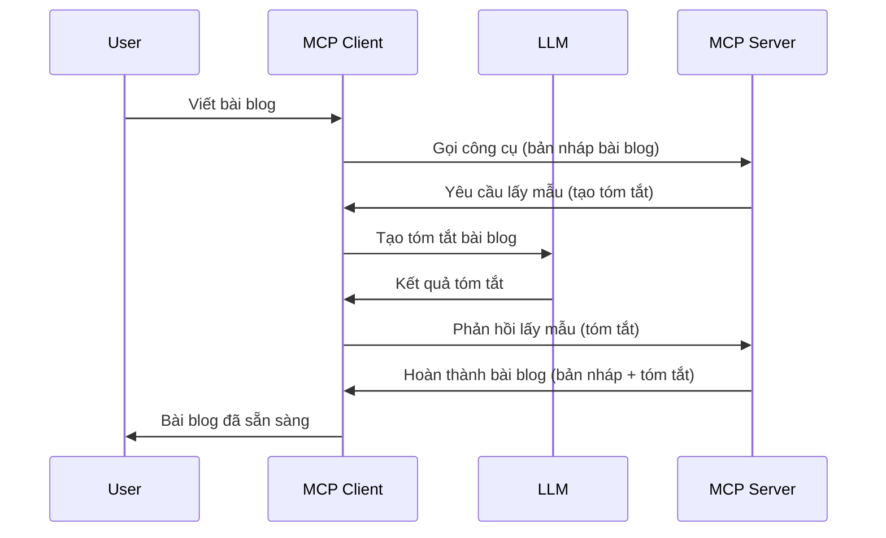

# Lấy mẫu - ủy quyền tính năng cho Client

Đôi khi, bạn cần MCP Client và MCP Server hợp tác để đạt được mục tiêu chung. Bạn có thể có trường hợp Server cần sự trợ giúp của một LLM nằm trên client. Trong tình huống này, lấy mẫu là thứ bạn nên sử dụng.

Hãy cùng khám phá một số trường hợp sử dụng và cách xây dựng giải pháp liên quan đến lấy mẫu.

## Tổng quan

Trong bài học này, chúng ta tập trung giải thích khi nào và ở đâu nên sử dụng Lấy mẫu và cách cấu hình nó.

## Mục tiêu học tập

Trong chương này, chúng ta sẽ:

- Giải thích Lấy mẫu là gì và khi nào sử dụng.
- Hiển thị cách cấu hình Lấy mẫu trong MCP.
- Cung cấp các ví dụ về Lấy mẫu trong thực tế.

## Lấy mẫu là gì và tại sao dùng nó?

Lấy mẫu là một tính năng nâng cao hoạt động theo cách sau:



### Yêu cầu lấy mẫu

Ok, bây giờ chúng ta đã có cái nhìn tổng quan một tình huống đáng tin cậy, hãy nói về yêu cầu lấy mẫu mà server gửi lại cho client. Đây là ví dụ một yêu cầu như vậy ở định dạng JSON-RPC:

```json
{
  "jsonrpc": "2.0",
  "id": 1,
  "method": "sampling/createMessage",
  "params": {
    "messages": [
      {
        "role": "user",
        "content": {
          "type": "text",
          "text": "Create a blog post summary of the following blog post: <BLOG POST>"
        }
      }
    ],
    "modelPreferences": {
      "hints": [
        {
          "name": "claude-3-sonnet"
        }
      ],
      "intelligencePriority": 0.8,
      "speedPriority": 0.5
    },
    "systemPrompt": "You are a helpful assistant.",
    "maxTokens": 100
  }
}
```

Có một vài điều đáng chú ý ở đây:

- Prompt, dưới content -> text, là prompt của chúng ta, một hướng dẫn cho LLM tóm tắt nội dung bài viết blog.

- **modelPreferences**. Phần này chỉ đơn giản là sở thích, một đề xuất cấu hình nên sử dụng với LLM. Người dùng có thể chọn theo đề xuất này hoặc thay đổi chúng. Ở đây có các đề xuất về mô hình nên dùng và ưu tiên tốc độ cũng như trí tuệ.

- **systemPrompt**, đây là prompt hệ thống bình thường của bạn, nó cung cấp cho LLM tính cách và chứa các hướng dẫn chỉ đạo.
- **maxTokens**, đây là thuộc tính nói số token được khuyến nghị sử dụng cho nhiệm vụ này.

### Phản hồi lấy mẫu

Phản hồi này là thứ mà MCP Client gửi lại cho MCP Server, là kết quả của client gọi LLM, chờ phản hồi và sau đó tạo tin nhắn này. Đây là ví dụ dạng JSON-RPC:

```json
{
  "jsonrpc": "2.0",
  "id": 1,
  "result": {
    "role": "assistant",
    "content": {
      "type": "text",
      "text": "Here's your abstract <ABSTRACT>"
    },
    "model": "gpt-5",
    "stopReason": "endTurn"
  }
}
```

Lưu ý phản hồi là tóm tắt bài viết blog đúng như yêu cầu. Cũng lưu ý `model` được dùng không phải là cái ta yêu cầu mà là "gpt-5" thay vì "claude-3-sonnet". Điều này để minh họa người dùng có thể thay đổi quyết định về mô hình sử dụng và yêu cầu lấy mẫu của bạn chỉ là đề xuất.

Ok, giờ chúng ta hiểu luồng chính và tác vụ hữu ích để dùng nó "tạo bài blog + tóm tắt", hãy xem những gì cần làm để nó hoạt động.

### Các loại tin nhắn

Tin nhắn lấy mẫu không bị giới hạn chỉ ở văn bản mà bạn còn có thể gửi hình ảnh và âm thanh. Đây là cách JSON-RPC khác đi:

**Văn bản**

```json
{
  "type": "text",
  "text": "The message content"
}
```

**Nội dung ảnh**

```json
{
  "type": "image",
  "data": "base64-encoded-image-data",
  "mimeType": "image/jpeg"
}
```

**Nội dung âm thanh**

```json
{
  "type": "audio",
  "data": "base64-encoded-audio-data",
  "mimeType": "audio/wav"
}
```

> NOTE: để biết thêm chi tiết về Lấy mẫu, xem [tài liệu chính thức](https://modelcontextprotocol.io/specification/2025-11-25/client/sampling)

## Cách cấu hình Lấy mẫu trong Client

> Lưu ý: nếu bạn chỉ xây dựng server, bạn không cần làm nhiều ở đây.

Trong client, bạn cần chỉ định tính năng sau như sau:

```json
{
  "capabilities": {
    "sampling": {}
  }
}
```

Tính năng này sau đó sẽ được lấy khi client bạn chọn khởi tạo với server.

## Ví dụ về Lấy mẫu trong Thực tế - Tạo bài blog

Hãy cùng code một server lấy mẫu, ta sẽ cần làm những bước sau:

1. Tạo một công cụ trên Server.
1. Công cụ đó tạo yêu cầu lấy mẫu.
1. Công cụ đợi phản hồi yêu cầu lấy mẫu từ client.
1. Sau đó kết quả công cụ được tạo ra.

Hãy xem code từng bước:

### -1- Tạo công cụ

**python**

```python
@mcp.tool()
async def create_blog(title: str, content: str, ctx: Context[ServerSession, None]) -> str:
    """Create a blog post and generate a summary"""

```

### -2- Tạo yêu cầu lấy mẫu

Mở rộng công cụ với đoạn code sau:

**python**

```python
post = BlogPost(
        id=len(posts) + 1,
        title=title,
        content=content,
        abstract=""
    )

prompt = f"Create an abstract of the following blog post: title: {title} and draft: {content} "

result = await ctx.session.create_message(
        messages=[
            SamplingMessage(
                role="user",
                content=TextContent(type="text", text=prompt),
            )
        ],
        max_tokens=100,
)

```

### -3- Đợi phản hồi và trả về phản hồi

**python**

```python
post.abstract = result.content.text

posts.append(post)

# trả về sản phẩm hoàn chỉnh
return json.dumps({
    "id": post.title,
    "abstract": post.abstract
})
```

### -4- Code đầy đủ

**python**

```python
from starlette.applications import Starlette
from starlette.routing import Mount, Host

from mcp.server.fastmcp import Context, FastMCP

from mcp.server.session import ServerSession
from mcp.types import SamplingMessage, TextContent

import json


from uuid import uuid4
from typing import List
from pydantic import BaseModel


mcp = FastMCP("Blog post generator")

# app = FastAPI()

posts = []

class BlogPost(BaseModel):
    id: int
    title: str
    content: str
    abstract: str

posts: List[BlogPost] = []

@mcp.tool()
async def create_blog(title: str, content: str, ctx: Context[ServerSession, None]) -> str:
    """Create a blog post and generate a summary"""

    post = BlogPost(
        id=len(posts) + 1,
        title=title,
        content=content,
        abstract=""
    )

    prompt = f"Create an abstract of the following blog post: title: {title} and draft: {content} "

    result = await ctx.session.create_message(
        messages=[
            SamplingMessage(
                role="user",
                content=TextContent(type="text", text=prompt),
            )
        ],
        max_tokens=100,
    )

    post.abstract = result.content.text

    posts.append(post)

    # trả về bài đăng blog đầy đủ
    return json.dumps({
        "id": post.title,
        "abstract": post.abstract
    })

if __name__ == "__main__":
    print("Starting server...")
    # mcp.run()
    mcp.run(transport="streamable-http")

# chạy ứng dụng với: python server.py
```

### -5- Kiểm thử trên Visual Studio Code

Để kiểm thử trên Visual Studio Code, làm theo các bước:

1. Khởi động server trong terminal
1. Thêm nó vào *mcp.json* (và đảm bảo server đang chạy) ví dụ như sau:

   ```json
   "servers": {
      "blog-server": {
        "type": "http",
        "url": "http://localhost:8000/mcp"
      }
   }
   ```

1. Gõ một prompt:

   ```text
   create a blog post named "Where Python comes from", the content is "Python is actually named after Monty Python Flying Circus"
   ```

1. Cho phép lấy mẫu xảy ra. Lần đầu bạn kiểm thử sẽ thấy một hộp thoại bổ sung bạn phải chấp nhận, sau đó bạn sẽ thấy hộp thoại thông thường hỏi bạn có muốn chạy công cụ hay không

1. Kiểm tra kết quả. Bạn sẽ thấy kết quả được hiển thị đẹp trong GitHub Copilot Chat và bạn cũng có thể kiểm tra phản hồi JSON gốc.

**Phần thưởng**. Công cụ Visual Studio Code hỗ trợ rất tốt cho lấy mẫu. Bạn có thể cấu hình truy cập Lấy mẫu trên server đã cài bằng cách:

1. Vào phần extension.
1. Chọn biểu tượng bánh răng cho server đã cài trong mục "MCP SERVERS - INSTALLED".
1. Chọn "Configure Model Access", tại đây bạn có thể chọn các Mô hình GitHub Copilot được phép dùng khi lấy mẫu. Bạn cũng có thể xem toàn bộ yêu cầu lấy mẫu gần đây bằng cách chọn "Show Sampling requests".

## Bài tập

Trong bài tập này, bạn sẽ xây dựng lấy mẫu hơi khác, cụ thể là một tích hợp lấy mẫu hỗ trợ tạo mô tả sản phẩm. Đây là kịch bản của bạn:

**Kịch bản**: Nhân viên văn phòng sau lưng e-commerce cần trợ giúp, mất quá nhiều thời gian để tạo mô tả sản phẩm. Vì vậy, bạn phải xây dựng giải pháp có thể gọi công cụ "create_product" với các đối số "title" và "keywords" và nó sẽ tạo một sản phẩm hoàn chỉnh bao gồm một trường "description" được điền bởi LLM của client.

TIP: dùng những gì bạn đã học trước đó để xây dựng server và công cụ của nó sử dụng yêu cầu lấy mẫu.

## Giải pháp

[Giải pháp](./solution/README.md)

## Những điểm chính cần nhớ

Lấy mẫu là tính năng mạnh mẽ cho phép server ủy quyền nhiệm vụ cho client khi cần sự trợ giúp của LLM.

## Tiếp theo

- [Chương 4 - Triển khai thực tế](../../04-PracticalImplementation/README.md)

---

<!-- CO-OP TRANSLATOR DISCLAIMER START -->
**Tuyên bố miễn trừ trách nhiệm**:
Tài liệu này đã được dịch bằng dịch vụ dịch thuật AI [Co-op Translator](https://github.com/Azure/co-op-translator). Mặc dù chúng tôi cố gắng đảm bảo độ chính xác, xin lưu ý rằng bản dịch tự động có thể chứa lỗi hoặc sai sót. Tài liệu gốc bằng ngôn ngữ gốc nên được coi là nguồn tin chính thức. Đối với thông tin quan trọng, nên sử dụng dịch vụ dịch thuật chuyên nghiệp bởi con người. Chúng tôi không chịu trách nhiệm về bất kỳ hiểu lầm hoặc giải thích sai nào phát sinh từ việc sử dụng bản dịch này.
<!-- CO-OP TRANSLATOR DISCLAIMER END -->