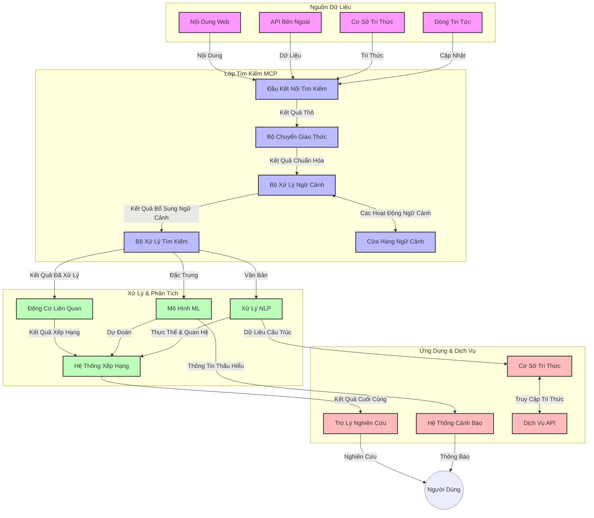
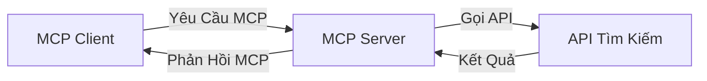
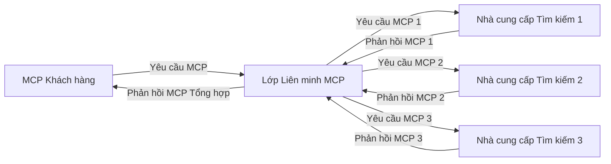
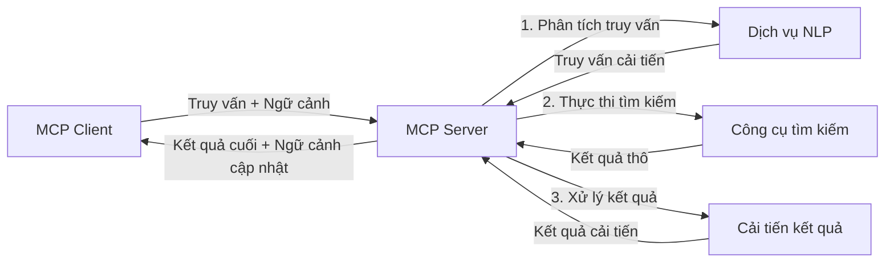

# Giao Thức Ngữ Cảnh Mô Hình cho Tìm Kiếm Web Thời Gian Thực

## Tổng Quan

Tìm kiếm web thời gian thực đã trở thành điều thiết yếu trong môi trường thông tin hiện nay, nơi các ứng dụng cần truy cập ngay lập tức vào thông tin cập nhật trên internet để cung cấp câu trả lời phù hợp và kịp thời. Giao Thức Ngữ Cảnh Mô Hình (MCP) đại diện cho bước tiến quan trọng trong việc tối ưu hóa các quy trình tìm kiếm thời gian thực này, nâng cao hiệu quả tìm kiếm, duy trì tính toàn vẹn của ngữ cảnh và cải thiện hiệu suất hệ thống tổng thể.

Module này khám phá cách MCP biến đổi tìm kiếm web thời gian thực bằng cách cung cấp một phương pháp tiếp cận chuẩn hóa cho quản lý ngữ cảnh giữa các mô hình AI, công cụ tìm kiếm và ứng dụng.

### Những Gì Bạn Sẽ Học

Trong hướng dẫn toàn diện này, bạn sẽ khám phá:

- Cách MCP tạo cầu nối liền mạch giữa các mô hình AI và khả năng tìm kiếm web thời gian thực
- Các mẫu kiến trúc để triển khai các giải pháp tìm kiếm hiệu quả và có thể mở rộng với MCP
- Kỹ thuật bảo tồn ngữ cảnh tìm kiếm qua nhiều truy vấn và tương tác
- Các hiện thực mã thực tiễn bằng Python và JavaScript cho các kịch bản tìm kiếm khác nhau
- Phương pháp cân bằng tính liên quan, tính cập nhật và hiệu suất trong các hệ thống tìm kiếm sử dụng MCP

## Giới Thiệu về Tìm Kiếm Web Thời Gian Thực

Tìm kiếm web thời gian thực là một phương pháp công nghệ cho phép truy vấn, xử lý và phân tích thông tin trên web liên tục khi nó được xuất bản hoặc cập nhật, giúp các hệ thống cung cấp thông tin tươi mới và phù hợp với độ trễ tối thiểu. Khác với các hệ thống tìm kiếm truyền thống hoạt động trên dữ liệu được lập chỉ mục có thể đã bị cũ hàng giờ hoặc hàng ngày, tìm kiếm thời gian thực xử lý dữ liệu trực tiếp từ web, cung cấp kiến thức và thông tin phản ánh trạng thái hiện tại của nội dung trực tuyến.

### Các Khái Niệm Cốt Lõi của Tìm Kiếm Web Thời Gian Thực:

- **Xử Lý Truy Vấn Liên Tục**: Các truy vấn tìm kiếm được xử lý trên các nguồn dữ liệu không ngừng cập nhật
- **Ưu Tiên Tính Cập Nhật**: Hệ thống thiết kế để ưu tiên thông tin mới nhất
- **Cân Bằng Tính Liên Quan**: Duy trì sự cân đối giữa tính liên quan và tính cập nhật
- **Kiến Trúc Có Khả Năng Mở Rộng**: Hệ thống phải xử lý khối lượng truy vấn và dữ liệu biến động
- **Hiểu Biết Ngữ Cảnh**: Duy trì ngữ cảnh người dùng qua nhiều lần tìm kiếm là quan trọng để có kết quả có ý nghĩa
- **Định Nghĩa Lại Truy Vấn Linh Hoạt**: Điều chỉnh truy vấn theo ngữ cảnh và kết quả trước đó
- **Tích Hợp Nhiều Nguồn**: Kết hợp kết quả từ nhiều nhà cung cấp tìm kiếm và nguồn web khác nhau
- **Hiểu Biết Ngữ Nghĩa**: Xử lý truy vấn và nội dung dựa trên ý nghĩa thay vì chỉ từ khóa
- **Xếp Hạng Thời Gian Thực**: Điều chỉnh thứ hạng kết quả liên tục khi thông tin mới có sẵn

### Giao Thức Ngữ Cảnh Mô Hình và Tìm Kiếm Web Thời Gian Thực

Giao Thức Ngữ Cảnh Mô Hình (MCP) giải quyết một số thách thức quan trọng trong môi trường tìm kiếm web thời gian thực:

1. **Bảo Tồn Ngữ Cảnh Tìm Kiếm**: MCP chuẩn hóa cách duy trì ngữ cảnh trong các thành phần tìm kiếm phân tán, đảm bảo mô hình AI và các nút xử lý có quyền truy cập vào lịch sử truy vấn và sở thích người dùng phù hợp.

2. **Quản Lý Truy Vấn Hiệu Quả**: Bằng cách cung cấp cơ chế cấu trúc để truyền tải ngữ cảnh, MCP giảm bớt chi phí lặp lại ngữ cảnh trong mỗi lần tìm kiếm.

3. **Khả Năng Tương Tác**: MCP tạo ra một ngôn ngữ chung để chia sẻ ngữ cảnh giữa các công nghệ tìm kiếm đa dạng và mô hình AI, cho phép kiến trúc linh hoạt và dễ mở rộng hơn.

4. **Ngữ Cảnh Tối Ưu Cho Tìm Kiếm**: Các hiện thực MCP có thể ưu tiên các yếu tố ngữ cảnh quan trọng nhất cho tìm kiếm hiệu quả, tối ưu cho cả hiệu suất và độ chính xác.

5. **Xử Lý Tìm Kiếm Thích Ứng**: Với quản lý ngữ cảnh đúng cách qua MCP, hệ thống tìm kiếm có thể điều chỉnh xử lý một cách linh hoạt dựa trên nhu cầu người dùng và bối cảnh thông tin đang thay đổi.

Trong các ứng dụng hiện đại từ tổng hợp tin tức đến trợ lý nghiên cứu, tích hợp MCP với công nghệ tìm kiếm web cho phép tìm kiếm thông minh hơn, nhận biết ngữ cảnh và mang lại kết quả ngày càng phù hợp khi tương tác của người dùng tiếp tục.

## Mục Tiêu Học Tập

Kết thúc bài học này, bạn sẽ có khả năng:

- Hiểu các nguyên tắc cơ bản của tìm kiếm web thời gian thực và các thách thức trong ứng dụng hiện đại
- Giải thích cách Giao Thức Ngữ Cảnh Mô Hình (MCP) nâng cao khả năng tìm kiếm web thời gian thực
- Triển khai các giải pháp tìm kiếm dựa trên MCP sử dụng các framework và API phổ biến
- Thiết kế và triển khai kiến trúc tìm kiếm có thể mở rộng, hiệu suất cao với MCP
- Áp dụng các khái niệm MCP vào các trường hợp sử dụng khác nhau bao gồm tìm kiếm ngữ nghĩa, trợ giúp nghiên cứu và duyệt web tăng cường AI
- Đánh giá các xu hướng mới nổi và đổi mới tương lai trong công nghệ tìm kiếm dựa trên MCP
- Phát triển hệ thống tìm kiếm nhận biết ngữ cảnh học hỏi từ tương tác người dùng
- Tích hợp khả năng tìm kiếm web vào trợ lý AI sử dụng các giao thức MCP chuẩn hóa
- Tạo quy trình tìm kiếm đa giai đoạn tinh chỉnh kết quả dựa trên ngữ cảnh
- Tối ưu hiệu suất tìm kiếm trong khi duy trì nhận thức ngữ cảnh toàn diện

### Định Nghĩa và Ý Nghĩa

Tìm kiếm web thời gian thực liên quan đến việc truy vấn, truy xuất và cung cấp thông tin trên web liên tục với độ trễ tối thiểu. Khác với các công cụ tìm kiếm truyền thống định kỳ thu thập và lập chỉ mục web, tìm kiếm thời gian thực nhắm đến việc hiển thị thông tin ngay khi nó có sẵn, cho phép truy cập tức thì vào nội dung cập nhật nhất.

Các đặc điểm chính của tìm kiếm web thời gian thực bao gồm:

- **Tính Tươi Mới**: Ưu tiên nội dung và cập nhật gần đây
- **Xử Lý Liên Tục**: Theo dõi liên tục để phát hiện thông tin mới
- **Điều Chỉnh Truy Vấn**: Tinh chỉnh truy vấn tìm kiếm dựa trên ngữ cảnh và phản hồi
- **Cung Cấp Ngay Lập Tức**: Đưa kết quả tìm kiếm với độ trễ tối thiểu
- **Bảo Tồn Ngữ Cảnh**: Xây dựng dựa trên các truy vấn trước đó để cải thiện tính liên quan

### Thách Thức Trong Tìm Kiếm Web Truyền Thống

Các phương pháp tìm kiếm web truyền thống gặp một số hạn chế khi áp dụng cho kịch bản thời gian thực:

1. **Phân Mảnh Ngữ Cảnh**: Khó khăn trong việc duy trì ngữ cảnh tìm kiếm qua nhiều truy vấn
2. **Tính Tươi Mới của Thông Tin**: Thách thức trong truy cập và ưu tiên thông tin cập nhật nhất
3. **Phức Tạp Tích Hợp**: Vấn đề khả năng tương tác giữa các hệ thống tìm kiếm và ứng dụng
4. **Vấn Đề Độ Trễ**: Cân bằng giữa tìm kiếm toàn diện và yêu cầu thời gian phản hồi
5. **Điều Chỉnh Tính Liên Quan**: Đảm bảo độ chính xác và tính phù hợp đồng thời ưu tiên tính cập nhật

## Hiểu Về Giao Thức Ngữ Cảnh Mô Hình (MCP) cho Tìm Kiếm

### MCP Trong Ngữ Cảnh Tìm Kiếm Là Gì?

Giao Thức Ngữ Cảnh Mô Hình (MCP) là một giao thức truyền thông chuẩn hóa được thiết kế để tạo điều kiện tương tác hiệu quả giữa các mô hình AI và ứng dụng. Trong ngữ cảnh tìm kiếm web thời gian thực, MCP cung cấp một khung làm việc để:

- Bảo tồn ngữ cảnh tìm kiếm xuyên suốt chuỗi truy vấn
- Chuẩn hóa định dạng truy vấn và kết quả tìm kiếm
- Tối ưu hóa truyền tải các tham số và kết quả tìm kiếm
- Nâng cao giao tiếp giữa mô hình và công cụ tìm kiếm

### Các Thành Phần Cốt Lõi và Kiến Trúc

Kiến trúc MCP cho tìm kiếm web thời gian thực bao gồm một số thành phần chính:

1. **Bộ Xử Lý Ngữ Cảnh Truy Vấn**: Quản lý và duy trì ngữ cảnh tìm kiếm qua nhiều truy vấn
2. **Bộ Xử Lý Tìm Kiếm**: Xử lý yêu cầu tìm kiếm đến bằng các kỹ thuật nhận biết ngữ cảnh
3. **Bộ Chuyển Đổi Giao Thức**: Chuyển đổi giữa các API tìm kiếm khác nhau trong khi bảo tồn ngữ cảnh
4. **Kho Ngữ Cảnh**: Lưu trữ và truy xuất hiệu quả lịch sử tìm kiếm và sở thích người dùng
5. **Bộ Kết Nối Tìm Kiếm**: Kết nối với các công cụ tìm kiếm và API web khác nhau



### MCP Cải Thiện Tìm Kiếm Web Thời Gian Thực Như Thế Nào

MCP giải quyết các thách thức của tìm kiếm web truyền thống thông qua:

- **Tính Liên Tục Ngữ Cảnh**: Duy trì mối quan hệ giữa các truy vấn trong toàn bộ phiên tìm kiếm
- **Truyền Tải Tối Ưu**: Giảm bớt sự trùng lặp trong các tham số tìm kiếm bằng quản lý ngữ cảnh thông minh
- **Giao Diện Chuẩn Hóa**: Cung cấp API nhất quán cho các thành phần tìm kiếm
- **Giảm Độ Trễ**: Tối thiểu chi phí xử lý thông qua quản lý ngữ cảnh hiệu quả
- **Tăng Tính Liên Quan**: Nâng cao tính liên quan tìm kiếm bằng cách bảo tồn ý định người dùng qua nhiều truy vấn

## Tích Hợp và Triển Khai

Hệ thống tìm kiếm web thời gian thực yêu cầu thiết kế kiến trúc và triển khai cẩn thận để duy trì cả hiệu suất lẫn tính toàn vẹn ngữ cảnh. Giao Thức Ngữ Cảnh Mô Hình cung cấp một phương pháp chuẩn hóa để tích hợp các mô hình AI và công nghệ tìm kiếm, cho phép xây dựng các quy trình tìm kiếm nhận biết ngữ cảnh tinh vi hơn.

### Tổng Quan về Tích Hợp MCP trong Kiến Trúc Tìm Kiếm

Việc triển khai MCP trong môi trường tìm kiếm web thời gian thực liên quan đến một số cân nhắc quan trọng sau:

1. **Tuần Tự Hóa Ngữ Cảnh Tìm Kiếm**: MCP cung cấp các cơ chế hiệu quả để mã hóa thông tin ngữ cảnh trong yêu cầu tìm kiếm, đảm bảo ngữ cảnh thiết yếu đi theo truy vấn xuyên suốt quy trình xử lý. Điều này bao gồm các định dạng tuần tự hóa chuẩn được tối ưu hóa cho siêu dữ liệu liên quan đến tìm kiếm.

2. **Xử Lý Tìm Kiếm Có Trạng Thái**: MCP cho phép xử lý trạng thái thông minh hơn bằng cách duy trì biểu diễn ngữ cảnh nhất quán qua các lần tìm kiếm. Điều này đặc biệt có giá trị trong các quy trình tìm kiếm đa giai đoạn, nơi việc tinh chỉnh ngữ cảnh nâng cao kết quả.

3. **Mở Rộng và Tinh Chỉnh Truy Vấn**: Các hiện thực MCP trong hệ thống tìm kiếm có thể hỗ trợ mở rộng và tinh chỉnh truy vấn phức tạp dựa trên ngữ cảnh tích lũy, cho phép kết quả ngày càng liên quan hơn khi phiên tìm kiếm tiến triển.

4. **Lưu Trữ Bộ Nhớ Đệm Kết Quả và Ưu Tiên**: Bằng cách chuẩn hóa việc xử lý ngữ cảnh, MCP giúp quản lý bộ nhớ đệm kết quả và ưu tiên, cho phép các thành phần điều chỉnh dựa trên ngữ cảnh tìm kiếm thay đổi.

5. **Liên Kết và Tổng Hợp Tìm Kiếm**: MCP tạo điều kiện thực hiện việc liên kết tìm kiếm phức tạp hơn qua nhiều backend bằng cách cung cấp các biểu diễn cấu trúc của ngữ cảnh tìm kiếm, cho phép tổng hợp kết quả có ý nghĩa hơn từ các nguồn đa dạng.

Việc triển khai MCP trên các công nghệ tìm kiếm khác nhau tạo ra phương pháp thống nhất để quản lý ngữ cảnh, giảm nhu cầu mã tích hợp tùy chỉnh trong khi nâng cao khả năng của hệ thống trong việc duy trì ngữ cảnh có ý nghĩa khi truy vấn tìm kiếm phát triển.

### MCP Trong Các Triển Khai Tìm Kiếm Web Đa Dạng

Những ví dụ này tuân theo đặc tả MCP hiện nay tập trung vào giao thức dựa trên JSON-RPC với các cơ chế truyền tải riêng biệt. Mã minh họa cách bạn có thể triển khai tích hợp tìm kiếm tùy chỉnh trong khi vẫn duy trì tương thích đầy đủ với giao thức MCP.


<details>
<summary>Triển Khai Python với API Tìm Kiếm Tổng Quát</summary>

```python
import asyncio
import json
import aiohttp
from typing import Dict, Any, Optional, List
from contextlib import asynccontextmanager
from collections.abc import AsyncIterator

# Nhập các thư viện MCP chuẩn
from mcp.client.session import ClientSession
from mcp.client.streamable_http import streamablehttp_client
from mcp.types import TextContent, CreateMessageRequestParams, CreateMessageResult
from mcp.server.fastmcp import FastMCP

# Tạo máy chủ FastMCP cho tìm kiếm web
search_server = FastMCP("WebSearch")

# Lớp để xử lý các hoạt động tìm kiếm web
class WebSearchHandler:
    def __init__(self, api_endpoint: str, api_key: str):
        self.api_endpoint = api_endpoint
        self.api_key = api_key
        self.session = None
        
    async def initialize(self):
        """Initialize the HTTP session"""
        self.session = aiohttp.ClientSession(
            headers={"Authorization": f"Bearer {self.api_key}"}
        )
    
    async def close(self):
        """Close the HTTP session"""
        if self.session:
            await self.session.close()
            
    async def perform_search(self, query: str, max_results: int = 5, 
                           include_domains: List[str] = None, 
                           exclude_domains: List[str] = None,
                           time_period: str = "any") -> Dict[str, Any]:
        """Perform web search using the search API"""
        # Xây dựng các tham số tìm kiếm
        search_params = {
            "q": query,
            "limit": max_results,
            "time": time_period
        }
        
        if include_domains:
            search_params["site"] = ",".join(include_domains)
            
        if exclude_domains:
            search_params["exclude_site"] = ",".join(exclude_domains)
        
        # Thực hiện yêu cầu tìm kiếm
        try:
            async with self.session.get(
                self.api_endpoint,
                params=search_params
            ) as response:
                if response.status != 200:
                    error_text = await response.text()
                    raise Exception(f"Search API error: {response.status} - {error_text}")
                
                search_data = await response.json()
                
                # Chuyển đổi phản hồi đặc thù API sang định dạng chuẩn
                results = []
                for item in search_data.get("results", []):
                    results.append({
                        "title": item.get("title", ""),
                        "url": item.get("url", ""),
                        "snippet": item.get("snippet", ""),
                        "date": item.get("published_date", ""),
                        "source": item.get("source", "")
                    })
                
                return {
                    "query": query,
                    "totalResults": len(results),
                    "results": results
                }
        except Exception as e:
            print(f"Search API request error: {e}")
            raise

# Khởi tạo trình xử lý tìm kiếm
search_handler = WebSearchHandler(
    api_endpoint="https://api.search-service.example/search",
    api_key="your-api-key-here"
)

# Thiết lập vòng đời để quản lý trình xử lý tìm kiếm
@asyncio.asynccontextmanager
async def app_lifespan(server: FastMCP):
    """Manage application lifecycle"""
    await search_handler.initialize()
    try:
        yield {"search_handler": search_handler}
    finally:
        await search_handler.close()

# Đặt vòng đời cho máy chủ
search_server = FastMCP("WebSearch", lifespan=app_lifespan)

# Đăng ký công cụ tìm kiếm web
@search_server.tool()
async def web_search(query: str, max_results: int = 5, 
                   include_domains: List[str] = None,
                   exclude_domains: List[str] = None,
                   time_period: str = "any") -> Dict[str, Any]:
    """
    Search the web for information
    
    Args:
        query: The search query
        max_results: Maximum number of results to return (default: 5)
        include_domains: List of domains to include in search results
        exclude_domains: List of domains to exclude from search results
        time_period: Time period for results ("day", "week", "month", "any")
        
    Returns:
        Dictionary containing search results
    """
    ctx = search_server.get_context()
    search_handler = ctx.request_context.lifespan_context["search_handler"]
    
    results = await search_handler.perform_search(
        query=query,
        max_results=max_results,
        include_domains=include_domains,
        exclude_domains=exclude_domains,
        time_period=time_period
    )
    
    return results

# Ví dụ sử dụng của client
async def client_example():
    # Kết nối đến máy chủ tìm kiếm sử dụng giao thức Streamable HTTP
    async with streamablehttp_client("http://localhost:8000/mcp") as (read, write, _):
        async with ClientSession(read, write) as session:
            # Khởi tạo kết nối
            await session.initialize()
            
            # Gọi công cụ web_search
            search_results = await session.call_tool(
                "web_search", 
                {
                    "query": "latest developments in AI and Model Context Protocol",
                    "max_results": 5,
                    "time_period": "day",
                    "include_domains": ["github.com", "microsoft.com"]
                }
            )
            
            print(f"Search results: {search_results}")

# Ví dụ chạy máy chủ
if __name__ == "__main__":
    # Chạy máy chủ với giao thức Streamable HTTP
    search_server.run(transport="streamable-http")
```
</details> 

<details>
<summary>Triển Khai JavaScript với Tìm Kiếm Trình Duyệt</summary>


```javascript
// Triển khai máy chủ MCP cho tìm kiếm web
import { McpServer, ResourceTemplate } from '@modelcontextprotocol/sdk/server/mcp.js';
import { StreamableHTTPServerTransport } from '@modelcontextprotocol/sdk/server/streamableHttp.js';
import { z } from 'zod';

// Tạo máy chủ MCP cho tìm kiếm web
const searchServer = new McpServer({
    name: "BrowserSearch",
    description: "A server that provides web search capabilities"
});

// Lớp dịch vụ tìm kiếm
class SearchService {
    constructor(searchApiUrl, apiKey) {
        this.searchApiUrl = searchApiUrl;
        this.apiKey = apiKey;
    }

    async performSearch(parameters) {
        const {
            query = '',
            maxResults = 5,
            includeDomains = [],
            excludeDomains = [],
            timePeriod = 'any'
        } = parameters;
        
        // Xây dựng URL tìm kiếm với các tham số
        const url = new URL(this.searchApiUrl);
        url.searchParams.append('q', query);
        url.searchParams.append('limit', maxResults);
        url.searchParams.append('time', timePeriod);
        
        if (includeDomains.length > 0) {
            url.searchParams.append('site', includeDomains.join(','));
        }
        
        if (excludeDomains.length > 0) {
            url.searchParams.append('exclude_site', excludeDomains.join(','));
        }
        
        try {
            const response = await fetch(url.toString(), {
                method: 'GET',
                headers: {
                    'Authorization': `Bearer ${this.apiKey}`,
                    'Content-Type': 'application/json'
                }
            });
            
            if (!response.ok) {
                const errorText = await response.text();
                throw new Error(`Search API error: ${response.status} - ${errorText}`);
            }
            
            const searchData = await response.json();
            
            // Chuyển đổi phản hồi riêng của API sang định dạng chuẩn
            const results = searchData.results?.map(item => ({
                title: item.title || '',
                url: item.url || '',
                snippet: item.snippet || '',
                date: item.published_date || '',
                source: item.source || ''
            })) || [];
            
            return {
                query,
                totalResults: results.length,
                results
            };
        } catch (error) {
            console.error('Search API request error:', error);
            throw error;
        }
    }
}

// Khởi tạo dịch vụ tìm kiếm
const searchService = new SearchService(
    'https://api.search-service.example/search',
    'your-api-key-here'
);

// Thiết lập nhà cung cấp ngữ cảnh cho máy chủ
searchServer.setContextProvider(() => {
    return {
        searchService
    };
});

// Đăng ký công cụ tìm kiếm web
searchServer.tool({
    name: 'web_search',
    description: 'Search the web for information',
    parameters: {
        type: 'object',
        properties: {
            query: {
                type: 'string',
                description: 'The search query'
            },
            maxResults: {
                type: 'integer',
                description: 'Maximum number of results to return',
                default: 5
            },
            includeDomains: {
                type: 'array',
                items: { type: 'string' },
                description: 'List of domains to include in search results'
            },
            excludeDomains: {
                type: 'array',
                items: { type: 'string' },
                description: 'List of domains to exclude from search results'
            },
            timePeriod: {
                type: 'string',
                description: 'Time period for results',
                enum: ['day', 'week', 'month', 'any'],
                default: 'any'
            }
        },
        required: ['query']
    },
    handler: async (params, context) => {
        const { searchService } = context;
        return await searchService.performSearch(params);
    }
});

// Ví dụ mã khách hàng để kết nối đến máy chủ tìm kiếm
import { Client } from '@modelcontextprotocol/sdk/client/index.js';
import { StreamableHTTPClientTransport } from '@modelcontextprotocol/sdk/client/streamableHttp.js';

async function connectToSearchServer() {
    // Kết nối đến máy chủ tìm kiếm
    const transport = new StreamableHTTPClientTransport(
        new URL('http://localhost:8000/mcp')
    );
    
    const client = new Client({
        name: 'search-client',
        version: '1.0.0'
    });
    
    await client.connect(transport);
    
    // Thực thi công cụ tìm kiếm
    const searchResults = await client.callTool({
        name: 'web_search',
        arguments: {
            query: 'Model Context Protocol implementation examples',
            maxResults: 10,
            timePeriod: 'week',
            includeDomains: ['github.com', 'docs.microsoft.com']
        }
    });
    
    console.log('Search results:', searchResults);
    
    // Dọn dẹp
    await client.disconnect();
}

// Bắt đầu máy chủ
const transport = new StreamableHTTPServerTransport();
await searchServer.connect(transport);
console.log('Search server running at http://localhost:8000/mcp');

// Trong một tiến trình riêng hoặc sau khi máy chủ được khởi động
// connectToSearchServer().catch(console.error);
```
</details> 


## Lời Cảnh Báo Về Ví Dụ Mã

> **Lưu ý Quan Trọng**: Các ví dụ mã dưới đây minh họa việc tích hợp Giao Thức Ngữ Cảnh Mô Hình (MCP) với chức năng tìm kiếm web. Mặc dù chúng tuân theo các mẫu và cấu trúc của các SDK MCP chính thức, các ví dụ này đã được đơn giản hóa cho mục đích giáo dục.
> 
> Những ví dụ này trình bày:
> 
> 1. **Triển Khai Python**: Một máy chủ FastMCP triển khai công cụ tìm kiếm web và kết nối với API tìm kiếm bên ngoài. Ví dụ này minh họa quản lý vòng đời thích hợp, xử lý ngữ cảnh và triển khai công cụ theo mẫu của [SDK Python MCP chính thức](https://github.com/modelcontextprotocol/python-sdk). Máy chủ sử dụng cơ chế truyền tải HTTP Streamable được khuyến nghị đã thay thế cơ chế SSE cũ cho các triển khai sản xuất.
> 
> 2. **Triển Khai JavaScript**: Một hiện thực TypeScript/JavaScript sử dụng mẫu FastMCP từ [SDK TypeScript MCP chính thức](https://github.com/modelcontextprotocol/typescript-sdk) để tạo máy chủ tìm kiếm với định nghĩa công cụ và kết nối client đúng cách. Nó tuân theo mẫu mới nhất được khuyến cáo cho quản lý phiên và bảo tồn ngữ cảnh.
> 
> Các ví dụ này cần bổ sung xử lý lỗi, xác thực và mã tích hợp API cụ thể cho việc sử dụng trong thực tế sản xuất. Các điểm cuối API tìm kiếm được hiển thị (`https://api.search-service.example/search`) chỉ là chỗ giữ chỗ và cần được thay thế bằng các điểm cuối dịch vụ tìm kiếm thực tế.
> 
> Để biết chi tiết triển khai đầy đủ và các phương pháp cập nhật nhất, vui lòng tham khảo [đặc tả MCP chính thức](https://spec.modelcontextprotocol.io/) và tài liệu SDK tương ứng.

## Các Khái Niệm Cốt Lõi

### Khung Giao Thức Ngữ Cảnh Mô Hình (MCP)

Về cơ bản, Giao Thức Ngữ Cảnh Mô Hình cung cấp một cách chuẩn hóa cho các mô hình AI, ứng dụng và dịch vụ trao đổi ngữ cảnh. Trong tìm kiếm web thời gian thực, khung này rất cần thiết để tạo ra trải nghiệm tìm kiếm đa lượt mạch lạc. Các thành phần chính bao gồm:

1. **Kiến Trúc Client-Server**: MCP thiết lập sự phân tách rõ ràng giữa client tìm kiếm (người yêu cầu) và server tìm kiếm (người cung cấp), cho phép mô hình triển khai linh hoạt.

2. **Giao Tiếp JSON-RPC**: Giao thức sử dụng JSON-RPC để trao đổi thông điệp, làm cho nó tương thích với công nghệ web và dễ dàng triển khai trên các nền tảng khác nhau.

3. **Quản Lý Ngữ Cảnh**: MCP định nghĩa các phương pháp cấu trúc để duy trì, cập nhật và tận dụng ngữ cảnh tìm kiếm qua nhiều tương tác.

4. **Định Nghĩa Công Cụ**: Khả năng tìm kiếm được phơi bày như các công cụ chuẩn hóa với các tham số và giá trị trả về rõ ràng.

5. **Hỗ Trợ Streaming**: Giao thức hỗ trợ phát trực tiếp kết quả, điều cần thiết cho tìm kiếm thời gian thực khi kết quả có thể đến theo tiến trình.

### Mẫu Tích Hợp Tìm Kiếm Web

Khi tích hợp MCP với tìm kiếm web, xuất hiện một số mẫu:

#### 1. Tích Hợp Trực Tiếp Nhà Cung Cấp Tìm Kiếm



Trong mẫu này, máy chủ MCP trực tiếp giao tiếp với một hoặc nhiều API tìm kiếm, chuyển đổi các yêu cầu MCP thành các gọi API cụ thể và định dạng kết quả thành phản hồi MCP.

#### 2. Tìm Kiếm Liên Bang Với Bảo Tồn Ngữ Cảnh



Mẫu này phân phối các truy vấn tìm kiếm trên nhiều nhà cung cấp tìm kiếm tương thích MCP, mỗi nhà cung cấp có thể chuyên về các loại nội dung hoặc khả năng tìm kiếm khác nhau, đồng thời duy trì ngữ cảnh thống nhất.

#### 3. Chuỗi Tìm Kiếm Tăng Cường Ngữ Cảnh



Trong mẫu này, quy trình tìm kiếm được chia thành nhiều giai đoạn, với ngữ cảnh được làm giàu tại mỗi bước, dẫn đến kết quả ngày càng phù hợp theo tiến trình.

### Các Thành Phần Ngữ Cảnh Tìm Kiếm

Trong tìm kiếm web dựa trên MCP, ngữ cảnh thường bao gồm:

- **Lịch Sử Truy Vấn**: Các truy vấn tìm kiếm trước đó trong phiên
- **Sở Thích Người Dùng**: Ngôn ngữ, vùng miền, cài đặt tìm kiếm an toàn
- **Lịch Sử Tương Tác**: Các kết quả được nhấp, thời gian dành cho kết quả
- **Tham Số Tìm Kiếm**: Bộ lọc, thứ tự sắp xếp và các yếu tố thay đổi khác
- **Kiến Thức Chuyên Môn**: Ngữ cảnh liên quan đến chủ đề tìm kiếm
- **Ngữ Cảnh Thời Gian**: Yếu tố liên quan dựa trên mốc thời gian
- **Sở Thích Nguồn Thông Tin**: Nguồn tin cậy hoặc ưu tiên

## Trường Hợp Sử Dụng và Ứng Dụng

### Nghiên Cứu và Thu Thập Thông Tin

MCP nâng cao quy trình nghiên cứu bằng cách:

- Bảo tồn ngữ cảnh nghiên cứu qua các phiên tìm kiếm
- Cho phép các truy vấn tinh vi và phù hợp hơn theo ngữ cảnh
- Hỗ trợ liên bang tìm kiếm đa nguồn
- Tạo điều kiện trích xuất kiến thức từ kết quả tìm kiếm

### Giám Sát Tin Tức và Xu Hướng Thời Gian Thực

Tìm kiếm sử dụng MCP mang lại lợi thế cho theo dõi tin tức:

- Phát hiện gần như tức thời các câu chuyện tin tức mới nổi
- Lọc thông tin phù hợp theo ngữ cảnh
- Theo dõi chủ đề và thực thể qua nhiều nguồn
- Cảnh báo tin tức cá nhân hóa dựa trên ngữ cảnh người dùng

### Duyệt Web và Nghiên Cứu Tăng Cường AI

MCP tạo ra các khả năng mới cho duyệt web tăng cường AI:

- Gợi ý tìm kiếm theo ngữ cảnh dựa trên hoạt động trình duyệt hiện tại
- Tích hợp liền mạch giữa tìm kiếm web và trợ lý vận hành LLM
- Tinh chỉnh tìm kiếm đa lượt với ngữ cảnh được bảo tồn
- Nâng cao kiểm chứng sự thật và xác minh thông tin

## Xu Hướng và Đổi Mới Tương Lai

### Sự Tiến Hóa của MCP Trong Tìm Kiếm Web

Nhìn về phía trước, chúng tôi kỳ vọng MCP sẽ phát triển để giải quyết:
- **Tìm kiếm Đa phương thức**: Tích hợp tìm kiếm văn bản, hình ảnh, âm thanh và video với việc giữ nguyên bối cảnh
- **Tìm kiếm Phi tập trung**: Hỗ trợ hệ sinh thái tìm kiếm phân tán và liên kết
- **Bảo mật Tìm kiếm**: Cơ chế tìm kiếm bảo vệ quyền riêng tư dựa trên nhận thức bối cảnh
- **Hiểu Biết Truy vấn**: Phân tích ngữ nghĩa sâu sắc các truy vấn tìm kiếm ngôn ngữ tự nhiên

### Tiềm năng Tiến bộ Công nghệ

Các công nghệ mới nổi sẽ định hình tương lai của tìm kiếm MCP:

1. **Kiến trúc Tìm kiếm Thần kinh**: Hệ thống tìm kiếm dựa trên nhúng được tối ưu hóa cho MCP
2. **Bối cảnh Tìm kiếm Cá nhân hóa**: Học mẫu tìm kiếm cá nhân của người dùng theo thời gian
3. **Tích hợp Đồ thị Kiến thức**: Tìm kiếm ngữ cảnh được nâng cao bằng đồ thị kiến thức chuyên ngành
4. **Bối cảnh Đa phương thức**: Duy trì bối cảnh qua các phương thức tìm kiếm khác nhau

## Bài Tập Thực hành

### Bài Tập 1: Thiết lập Chuỗi Tìm kiếm MCP Cơ bản

Trong bài tập này, bạn sẽ học cách:
- Cấu hình môi trường tìm kiếm MCP cơ bản
- Triển khai bộ xử lý bối cảnh cho tìm kiếm web
- Kiểm tra và xác thực việc giữ nguyên bối cảnh qua các lần tìm kiếm

### Bài Tập 2: Xây dựng Trợ lý Nghiên cứu với Tìm kiếm MCP

Tạo một ứng dụng hoàn chỉnh mà:
- Xử lý các câu hỏi nghiên cứu dạng ngôn ngữ tự nhiên
- Thực hiện tìm kiếm web dựa trên nhận thức bối cảnh
- Tổng hợp thông tin từ nhiều nguồn
- Trình bày các kết quả nghiên cứu được tổ chức

### Bài Tập 3: Triển khai Liên kết Tìm kiếm Đa Nguồn với MCP

Bài tập nâng cao bao gồm:
- Phân phối truy vấn nhận thức bối cảnh tới nhiều công cụ tìm kiếm
- Xếp hạng và tổng hợp kết quả
- Loại trừ trùng lặp theo bối cảnh của kết quả tìm kiếm
- Xử lý siêu dữ liệu đặc thù nguồn

## Tài Nguyên Bổ Sung

- [Model Context Protocol Specification](https://spec.modelcontextprotocol.io/) - Đặc tả chính thức MCP và tài liệu giao thức chi tiết
- [Model Context Protocol Documentation](https://modelcontextprotocol.io/) - Hướng dẫn và tài liệu triển khai chi tiết
- [MCP Python SDK](https://github.com/modelcontextprotocol/python-sdk) - Triển khai Python chính thức của giao thức MCP
- [MCP TypeScript SDK](https://github.com/modelcontextprotocol/typescript-sdk) - Triển khai TypeScript chính thức của giao thức MCP
- [MCP Reference Servers](https://github.com/modelcontextprotocol/servers) - Triển khai tham chiếu các máy chủ MCP
- [Bing Web Search API Documentation](https://learn.microsoft.com/en-us/bing/search-apis/bing-web-search/overview) - API tìm kiếm web của Microsoft
- [Google Custom Search JSON API](https://developers.google.com/custom-search/v1/overview) - Công cụ tìm kiếm lập trình của Google
- [SerpAPI Documentation](https://serpapi.com/search-api) - API trang kết quả công cụ tìm kiếm
- [Meilisearch Documentation](https://www.meilisearch.com/docs) - Công cụ tìm kiếm mã nguồn mở
- [Elasticsearch Documentation](https://www.elastic.co/guide/index.html) - Công cụ tìm kiếm phân tán và phân tích
- [LangChain Documentation](https://python.langchain.com/docs/get_started/introduction) - Xây dựng ứng dụng với LLMs

## Kết Quả Học Tập

Khi hoàn thành mô-đun này, bạn sẽ có thể:

- Hiểu các nguyên tắc cơ bản của tìm kiếm web thời gian thực và các thách thức liên quan
- Giải thích cách Model Context Protocol (MCP) nâng cao khả năng tìm kiếm web thời gian thực
- Triển khai các giải pháp tìm kiếm dựa trên MCP sử dụng các framework và API phổ biến
- Thiết kế và triển khai kiến trúc tìm kiếm có khả năng mở rộng và hiệu suất cao với MCP
- Áp dụng các khái niệm MCP cho các trường hợp sử dụng khác nhau bao gồm tìm kiếm ngữ nghĩa, trợ lý nghiên cứu và duyệt web hỗ trợ AI
- Đánh giá các xu hướng mới nổi và đổi mới tương lai trong công nghệ tìm kiếm dựa trên MCP


### Cân nhắc về Niềm tin và An toàn

Khi triển khai các giải pháp tìm kiếm web dựa trên MCP, hãy nhớ các nguyên tắc quan trọng sau từ đặc tả MCP:

1. **Sự Đồng ý và Kiểm soát của Người dùng**: Người dùng phải đồng ý rõ ràng và hiểu tất cả truy cập dữ liệu và các hành động. Điều này đặc biệt quan trọng với các triển khai tìm kiếm web có thể truy cập nguồn dữ liệu bên ngoài.

2. **Bảo mật Dữ liệu**: Đảm bảo xử lý thích hợp các truy vấn và kết quả tìm kiếm, đặc biệt khi chúng có thể chứa thông tin nhạy cảm. Triển khai kiểm soát truy cập phù hợp để bảo vệ dữ liệu người dùng.

3. **An toàn Công cụ**: Triển khai xác thực và kiểm tra hợp lệ đúng đắn cho các công cụ tìm kiếm, vì chúng có thể là nguy cơ an ninh thông qua việc thực thi mã tùy ý. Mô tả hành vi công cụ nên được coi là không tin cậy trừ khi lấy từ máy chủ tin cậy.

4. **Tài liệu Rõ ràng**: Cung cấp tài liệu rõ ràng về khả năng, giới hạn và các cân nhắc về bảo mật của triển khai tìm kiếm dựa trên MCP, theo hướng dẫn triển khai từ đặc tả MCP.

5. **Quy trình Đồng ý Mạnh mẽ**: Xây dựng quy trình đồng ý và ủy quyền mạnh mẽ giải thích rõ công dụng của từng công cụ trước khi cho phép sử dụng, đặc biệt với các công cụ tương tác với tài nguyên web bên ngoài.

Để biết chi tiết đầy đủ về bảo mật và cân nhắc niềm tin MCP, vui lòng tham khảo [tài liệu chính thức](https://modelcontextprotocol.io/specification/2025-11-25/basic/security_best_practices).

## Tiếp theo là gì

- [5.12 Xác thực Entra ID cho Máy chủ Model Context Protocol](../mcp-security-entra/README.md)

---

<!-- CO-OP TRANSLATOR DISCLAIMER START -->
**Tuyên bố miễn trừ trách nhiệm**:
Tài liệu này đã được dịch bằng dịch vụ dịch thuật AI [Co-op Translator](https://github.com/Azure/co-op-translator). Mặc dù chúng tôi cố gắng đảm bảo độ chính xác, xin lưu ý rằng bản dịch tự động có thể chứa lỗi hoặc sai sót. Tài liệu gốc bằng ngôn ngữ gốc nên được coi là nguồn tin chính thức. Đối với thông tin quan trọng, nên sử dụng dịch vụ dịch thuật chuyên nghiệp bởi con người. Chúng tôi không chịu trách nhiệm về bất kỳ hiểu lầm hoặc giải thích sai nào phát sinh từ việc sử dụng bản dịch này.
<!-- CO-OP TRANSLATOR DISCLAIMER END -->