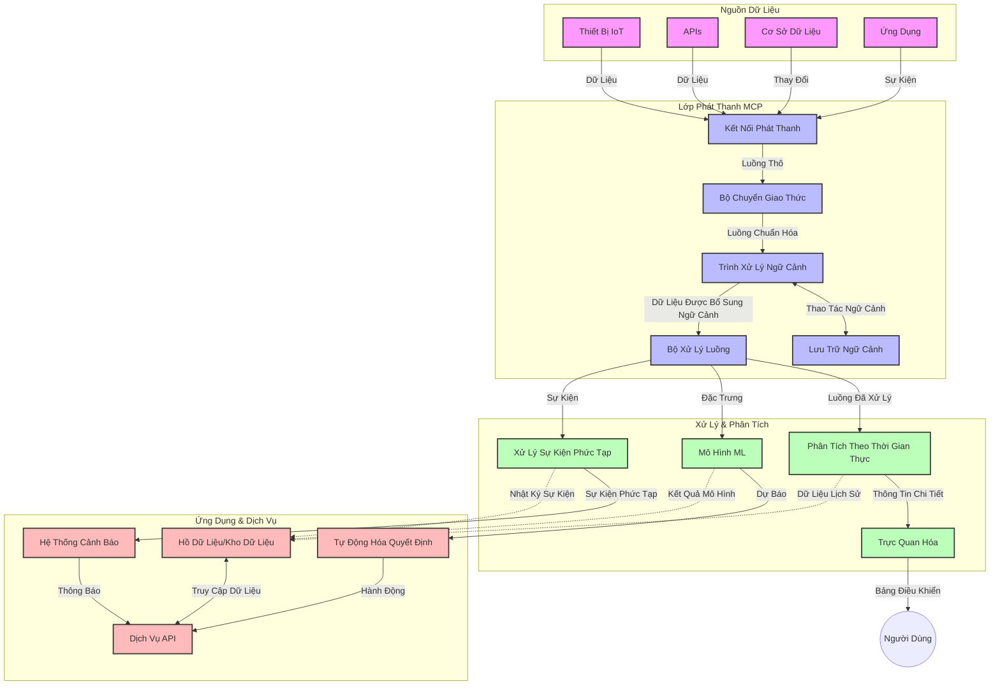

# Giao Thức Ngữ Cảnh Mô Hình cho Truyền Dữ Liệu Thời Gian Thực

## Tổng Quan

Truyền dữ liệu thời gian thực đã trở thành điều thiết yếu trong thế giới dựa trên dữ liệu ngày nay, nơi các doanh nghiệp và ứng dụng cần truy cập thông tin ngay lập tức để đưa ra các quyết định kịp thời. Giao Thức Ngữ Cảnh Mô Hình (MCP) đại diện cho một bước tiến đáng kể trong việc tối ưu hóa các quy trình truyền dữ liệu thời gian thực này, nâng cao hiệu quả xử lý dữ liệu, duy trì tính toàn vẹn ngữ cảnh và cải thiện hiệu suất tổng thể của hệ thống.

Mô-đun này khám phá cách MCP biến đổi truyền dữ liệu thời gian thực bằng cách cung cấp một cách tiếp cận chuẩn hóa quản lý ngữ cảnh trên các mô hình AI, nền tảng streaming và ứng dụng.

## Giới Thiệu về Truyền Dữ Liệu Thời Gian Thực

Truyền dữ liệu thời gian thực là một mô hình công nghệ cho phép chuyển tiếp, xử lý và phân tích dữ liệu liên tục khi nó được tạo ra, cho phép hệ thống phản ứng ngay lập tức với thông tin mới. Khác với xử lý theo lô truyền thống hoạt động trên bộ dữ liệu tĩnh, truyền dữ liệu streaming xử lý dữ liệu khi nó chuyển động, cung cấp thông tin và hành động với độ trễ tối thiểu.

### Các Khái Niệm Cốt Lõi của Truyền Dữ Liệu Thời Gian Thực:

- **Luồng Dữ Liệu Liên Tục**: Dữ liệu được xử lý như một luồng sự kiện hoặc bản ghi liên tục, không bao giờ kết thúc.
- **Xử Lý Độ Trễ Thấp**: Hệ thống được thiết kế để giảm thiểu thời gian giữa việc tạo dữ liệu và xử lý.
- **Khả Năng Mở Rộng**: Kiến trúc streaming phải xử lý được khối lượng và tốc độ dữ liệu biến đổi.
- **Chịu Lỗi Tốt**: Hệ thống cần khả năng chống chịu sự cố để đảm bảo luồng dữ liệu không bị gián đoạn.
- **Xử Lý Có Trạng Thái**: Duy trì ngữ cảnh xuyên suốt các sự kiện là điều cần thiết cho phân tích có ý nghĩa.

### Giao Thức Ngữ Cảnh Mô Hình và Truyền Dữ Liệu Thời Gian Thực

Giao Thức Ngữ Cảnh Mô Hình (MCP) giải quyết nhiều thách thức quan trọng trong môi trường truyền dữ liệu thời gian thực:

1. **Liên Tục Ngữ Cảnh**: MCP chuẩn hóa cách duy trì ngữ cảnh giữa các thành phần streaming phân tán, đảm bảo các mô hình AI và nút xử lý có quyền truy cập vào ngữ cảnh lịch sử và môi trường phù hợp.

2. **Quản Lý Trạng Thái Hiệu Quả**: Bằng cách cung cấp cơ chế có cấu trúc để truyền tải ngữ cảnh, MCP giảm tải quản lý trạng thái trong các pipeline streaming.

3. **Tương Tác Đa Nền Tảng**: MCP tạo ra ngôn ngữ chung để chia sẻ ngữ cảnh giữa các công nghệ streaming và mô hình AI đa dạng, cho phép kiến trúc linh hoạt và dễ mở rộng hơn.

4. **Ngữ Cảnh Tối Ưu cho Streaming**: Các triển khai MCP có thể ưu tiên những phần tử ngữ cảnh có liên quan nhất cho quyết định thời gian thực, tối ưu hóa cả hiệu suất lẫn độ chính xác.

5. **Xử Lý Thích Ứng**: Nhờ quản lý ngữ cảnh đúng cách qua MCP, hệ thống streaming có thể điều chỉnh xử lý dựa trên điều kiện và mẫu dữ liệu đang thay đổi.

Trong các ứng dụng hiện đại từ mạng cảm biến IoT đến nền tảng giao dịch tài chính, tích hợp MCP với công nghệ streaming cho phép xử lý thông minh, nhận thức ngữ cảnh và phản ứng phù hợp với các tình huống phức tạp, biến đổi trong thời gian thực.

## Mục Tiêu Học Tập

Sau bài học này, bạn sẽ có thể:

- Hiểu các nguyên lý cơ bản của truyền dữ liệu thời gian thực và những thách thức của nó
- Giải thích cách Giao Thức Ngữ Cảnh Mô Hình (MCP) nâng cao truyền dữ liệu thời gian thực
- Triển khai các giải pháp streaming dựa trên MCP với các framework phổ biến như Kafka và Pulsar
- Thiết kế và triển khai kiến trúc streaming chịu lỗi, hiệu suất cao với MCP
- Áp dụng các khái niệm MCP vào các trường hợp sử dụng IoT, giao dịch tài chính và phân tích dữ liệu dựa trên AI
- Đánh giá các xu hướng mới nổi và đổi mới trong công nghệ streaming dựa trên MCP

### Định Nghĩa và Ý Nghĩa

Truyền dữ liệu thời gian thực liên quan đến việc tạo ra, xử lý và phân phối dữ liệu liên tục với độ trễ tối thiểu. Khác với xử lý theo lô, nơi dữ liệu được thu thập và xử lý theo nhóm, dữ liệu streaming được xử lý từng phần khi nó đến, cho phép có được thông tin và hành động ngay lập tức.

Các đặc điểm chính của truyền dữ liệu thời gian thực bao gồm:

- **Độ Trễ Thấp**: Xử lý và phân tích dữ liệu trong vòng vài mili giây đến giây
- **Luồng Liên Tục**: Dữ liệu chảy không ngừng từ nhiều nguồn
- **Xử Lý Ngay Lập Tức**: Phân tích dữ liệu ngay khi nó đến thay vì theo lô
- **Kiến Trúc Sự Kiện**: Phản ứng với các sự kiện ngay khi chúng xảy ra

### Thách Thức Trong Truyền Dữ Liệu Truyền Thống

Các phương pháp truyền dữ liệu truyền thống đối mặt với nhiều hạn chế:

1. **Mất Ngữ Cảnh**: Khó khăn trong việc duy trì ngữ cảnh giữa các hệ thống phân tán
2. **Vấn đề Khả Năng Mở Rộng**: Thách thức trong việc mở rộng để xử lý dữ liệu với khối lượng và tốc độ cao
3. **Phức Tạp Tích Hợp**: Vấn đề tương tác giữa các hệ thống khác nhau
4. **Quản Lý Độ Trễ**: Cân bằng giữa lưu lượng truyền và thời gian xử lý
5. **Độ Chính Xác Dữ Liệu**: Đảm bảo dữ liệu chính xác và đầy đủ trên toàn bộ luồng

## Hiểu Về Giao Thức Ngữ Cảnh Mô Hình (MCP)

### MCP là gì?

Giao Thức Ngữ Cảnh Mô Hình (MCP) là một giao thức truyền thông chuẩn hóa được thiết kế để hỗ trợ tương tác hiệu quả giữa các mô hình AI và ứng dụng. Trong bối cảnh truyền dữ liệu thời gian thực, MCP cung cấp một khung để:

- Bảo toàn ngữ cảnh trong suốt pipeline dữ liệu
- Chuẩn hóa định dạng trao đổi dữ liệu
- Tối ưu hóa truyền tải các bộ dữ liệu lớn
- Nâng cao giao tiếp giữa mô hình với mô hình và giữa mô hình với ứng dụng

### Thành Phần Chính và Kiến Trúc

Kiến trúc MCP cho truyền dữ liệu thời gian thực gồm các thành phần chính:

1. **Bộ Xử Lý Ngữ Cảnh**: Quản lý và duy trì thông tin ngữ cảnh khắp pipeline streaming
2. **Bộ Xử Lý Luồng Dữ Liệu**: Xử lý dữ liệu streaming tới bằng kỹ thuật nhận thức ngữ cảnh
3. **Bộ Chuyển Đổi Giao Thức**: Chuyển đổi giữa các giao thức streaming khác nhau trong khi giữ nguyên ngữ cảnh
4. **Kho Ngữ Cảnh**: Lưu trữ và truy xuất thông tin ngữ cảnh hiệu quả
5. **Kết Nối Streaming**: Kết nối với các nền tảng streaming khác nhau (Kafka, Pulsar, Kinesis, v.v.)



### Cách MCP Cải Thiện Xử Lý Dữ Liệu Thời Gian Thực

MCP giải quyết các thách thức của streaming truyền thống thông qua:

- **Tính Toàn Vẹn Ngữ Cảnh**: Duy trì các mối quan hệ giữa các điểm dữ liệu xuyên suốt pipeline
- **Truyền Tải Tối Ưu**: Giảm sự thừa thãi trong trao đổi dữ liệu nhờ quản lý ngữ cảnh thông minh
- **Giao Diện Chuẩn Hóa**: Cung cấp API nhất quán cho các thành phần streaming
- **Giảm Độ Trễ**: Tối thiểu overhead xử lý qua quản lý ngữ cảnh hiệu quả
- **Tăng Khả Năng Mở Rộng**: Hỗ trợ mở rộng ngang mà vẫn giữ được ngữ cảnh

## Tích Hợp và Triển Khai

Hệ thống truyền dữ liệu thời gian thực đòi hỏi thiết kế kiến trúc và triển khai cẩn thận để duy trì cả hiệu suất lẫn tính toàn vẹn ngữ cảnh. Giao Thức Ngữ Cảnh Mô Hình cung cấp cách tiếp cận chuẩn hóa để tích hợp các mô hình AI và công nghệ streaming, cho phép tạo các pipeline xử lý phức tạp, nhận thức ngữ cảnh hơn.

### Tổng Quan Về Tích Hợp MCP trong Kiến Trúc Streaming

Triển khai MCP trong môi trường streaming thời gian thực liên quan đến một số điểm mấu chốt:

1. **Chuẩn Hóa và Truyền Tải Ngữ Cảnh**: MCP cung cấp cơ chế hiệu quả để mã hóa thông tin ngữ cảnh trong các gói dữ liệu streaming, đảm bảo ngữ cảnh quan trọng đi theo dữ liệu suốt pipeline xử lý. Bao gồm các định dạng serialization chuẩn, tối ưu cho truyền tải streaming.

2. **Xử Lý Luồng Có Trạng Thái**: MCP cho phép xử lý trạng thái thông minh hơn bằng cách duy trì biểu diễn ngữ cảnh nhất quán giữa các node xử lý. Điều này đặc biệt hữu ích ở kiến trúc streaming phân tán nơi quản lý trạng thái truyền thống rất khó khăn.

3. **Thời Gian Sự Kiện và Thời Gian Xử Lý**: Các triển khai MCP trong hệ thống streaming phải giải quyết thách thức phân biệt khi nào sự kiện xảy ra và khi nào nó được xử lý. Giao thức có thể bao gồm ngữ cảnh thời gian để giữ nguyên ngữ nghĩa thời gian sự kiện.

4. **Quản Lý Backpressure**: Nhờ chuẩn hóa xử lý ngữ cảnh, MCP giúp quản lý backpressure trong hệ thống streaming, cho phép các thành phần truyền đạt năng lực xử lý và điều chỉnh lưu lượng tương ứng.

5. **Cửa Sổ và Tổng Hợp Ngữ Cảnh**: MCP tạo điều kiện cho các phép toán windowing phức tạp hơn bằng cách cung cấp biểu diễn cấu trúc của các ngữ cảnh thời gian và quan hệ, cho phép tổng hợp có ý nghĩa trên các dòng sự kiện.

6. **Xử Lý Chính Xác Một Lần**: Trong các hệ thống streaming yêu cầu ngữ nghĩa xử lý chính xác một lần, MCP có thể bao gồm metadata xử lý giúp theo dõi và xác minh trạng thái xử lý giữa các thành phần phân tán.

Triển khai MCP trên nhiều công nghệ streaming khác nhau tạo ra một cách tiếp cận thống nhất cho quản lý ngữ cảnh, giảm nhu cầu mã tích hợp tùy chỉnh trong khi nâng cao khả năng duy trì ngữ cảnh có ý nghĩa khi dữ liệu chảy qua pipeline.

### MCP trong Các Framework Streaming Phổ Biến

Các ví dụ này theo đặc tả MCP hiện hành tập trung vào giao thức dựa trên JSON-RPC với các cơ chế truyền tải riêng biệt. Mã nguồn trình bày cách bạn có thể triển khai các cơ chế truyền tải tùy chỉnh tích hợp các nền tảng streaming như Kafka và Pulsar đồng thời giữ tương thích hoàn toàn với giao thức MCP.

Các ví dụ được thiết kế để cho thấy cách nền tảng streaming có thể tích hợp với MCP để cung cấp xử lý dữ liệu thời gian thực đồng thời bảo toàn cảnh nhận thức ngữ cảnh, điều trung tâm trong MCP. Cách tiếp cận này đảm bảo các mẫu mã phản ánh chính xác trạng thái hiện tại của đặc tả MCP tính đến tháng 6 năm 2025.

MCP có thể được tích hợp với các framework streaming phổ biến bao gồm:

#### Tích Hợp Apache Kafka

```python
import asyncio
import json
from typing import Dict, Any, Optional
from confluent_kafka import Consumer, Producer, KafkaError
from mcp.client import Client, ClientCapabilities
from mcp.core.message import JsonRpcMessage
from mcp.core.transports import Transport

# Lớp giao vận tùy chỉnh để kết nối MCP với Kafka
class KafkaMCPTransport(Transport):
    def __init__(self, bootstrap_servers: str, input_topic: str, output_topic: str):
        self.bootstrap_servers = bootstrap_servers
        self.input_topic = input_topic
        self.output_topic = output_topic
        self.producer = Producer({'bootstrap.servers': bootstrap_servers})
        self.consumer = Consumer({
            'bootstrap.servers': bootstrap_servers,
            'group.id': 'mcp-client-group',
            'auto.offset.reset': 'earliest'
        })
        self.message_queue = asyncio.Queue()
        self.running = False
        self.consumer_task = None
        
    async def connect(self):
        """Connect to Kafka and start consuming messages"""
        self.consumer.subscribe([self.input_topic])
        self.running = True
        self.consumer_task = asyncio.create_task(self._consume_messages())
        return self
        
    async def _consume_messages(self):
        """Background task to consume messages from Kafka and queue them for processing"""
        while self.running:
            try:
                msg = self.consumer.poll(1.0)
                if msg is None:
                    await asyncio.sleep(0.1)
                    continue
                
                if msg.error():
                    if msg.error().code() == KafkaError._PARTITION_EOF:
                        continue
                    print(f"Consumer error: {msg.error()}")
                    continue
                
                # Phân tích giá trị tin nhắn dưới dạng JSON-RPC
                try:
                    message_str = msg.value().decode('utf-8')
                    message_data = json.loads(message_str)
                    mcp_message = JsonRpcMessage.from_dict(message_data)
                    await self.message_queue.put(mcp_message)
                except Exception as e:
                    print(f"Error parsing message: {e}")
            except Exception as e:
                print(f"Error in consumer loop: {e}")
                await asyncio.sleep(1)
    
    async def read(self) -> Optional[JsonRpcMessage]:
        """Read the next message from the queue"""
        try:
            message = await self.message_queue.get()
            return message
        except Exception as e:
            print(f"Error reading message: {e}")
            return None
    
    async def write(self, message: JsonRpcMessage) -> None:
        """Write a message to the Kafka output topic"""
        try:
            message_json = json.dumps(message.to_dict())
            self.producer.produce(
                self.output_topic,
                message_json.encode('utf-8'),
                callback=self._delivery_report
            )
            self.producer.poll(0)  # Kích hoạt các hàm gọi lại
        except Exception as e:
            print(f"Error writing message: {e}")
    
    def _delivery_report(self, err, msg):
        """Kafka producer delivery callback"""
        if err is not None:
            print(f'Message delivery failed: {err}')
        else:
            print(f'Message delivered to {msg.topic()} [{msg.partition()}]')
    
    async def close(self) -> None:
        """Close the transport"""
        self.running = False
        if self.consumer_task:
            self.consumer_task.cancel()
            try:
                await self.consumer_task
            except asyncio.CancelledError:
                pass
        self.consumer.close()
        self.producer.flush()

# Ví dụ sử dụng giao vận Kafka MCP
async def kafka_mcp_example():
    # Tạo client MCP với giao vận Kafka
    client = Client(
        {"name": "kafka-mcp-client", "version": "1.0.0"},
        ClientCapabilities({})
    )
    
    # Tạo và kết nối giao vận Kafka
    transport = KafkaMCPTransport(
        bootstrap_servers="localhost:9092",
        input_topic="mcp-responses",
        output_topic="mcp-requests"
    )
    
    await client.connect(transport)
    
    try:
        # Khởi tạo phiên MCP
        await client.initialize()
        
        # Ví dụ thực thi công cụ qua MCP
        response = await client.execute_tool(
            "process_data",
            {
                "data": "sample data",
                "metadata": {
                    "source": "sensor-1",
                    "timestamp": "2025-06-12T10:30:00Z"
                }
            }
        )
        
        print(f"Tool execution response: {response}")
        
        # Tắt máy sạch
        await client.shutdown()
    finally:
        await transport.close()

# Chạy ví dụ
if __name__ == "__main__":
    asyncio.run(kafka_mcp_example())
```

#### Triển Khai Apache Pulsar

```python
import asyncio
import json
import pulsar
from typing import Dict, Any, Optional
from mcp.core.message import JsonRpcMessage
from mcp.core.transports import Transport
from mcp.server import Server, ServerOptions
from mcp.server.tools import Tool, ToolExecutionContext, ToolMetadata

# Tạo một giao thức MCP tùy chỉnh sử dụng Pulsar
class PulsarMCPTransport(Transport):
    def __init__(self, service_url: str, request_topic: str, response_topic: str):
        self.service_url = service_url
        self.request_topic = request_topic
        self.response_topic = response_topic
        self.client = pulsar.Client(service_url)
        self.producer = self.client.create_producer(response_topic)
        self.consumer = self.client.subscribe(
            request_topic,
            "mcp-server-subscription",
            consumer_type=pulsar.ConsumerType.Shared
        )
        self.message_queue = asyncio.Queue()
        self.running = False
        self.consumer_task = None
    
    async def connect(self):
        """Connect to Pulsar and start consuming messages"""
        self.running = True
        self.consumer_task = asyncio.create_task(self._consume_messages())
        return self
    
    async def _consume_messages(self):
        """Background task to consume messages from Pulsar and queue them for processing"""
        while self.running:
            try:
                # Nhận không chặn với thời gian chờ
                msg = self.consumer.receive(timeout_millis=500)
                
                # Xử lý tin nhắn
                try:
                    message_str = msg.data().decode('utf-8')
                    message_data = json.loads(message_str)
                    mcp_message = JsonRpcMessage.from_dict(message_data)
                    await self.message_queue.put(mcp_message)
                    
                    # Xác nhận tin nhắn
                    self.consumer.acknowledge(msg)
                except Exception as e:
                    print(f"Error processing message: {e}")
                    # Phản hồi không xác nhận nếu có lỗi xảy ra
                    self.consumer.negative_acknowledge(msg)
            except Exception as e:
                # Xử lý thời gian chờ hoặc các ngoại lệ khác
                await asyncio.sleep(0.1)
    
    async def read(self) -> Optional[JsonRpcMessage]:
        """Read the next message from the queue"""
        try:
            message = await self.message_queue.get()
            return message
        except Exception as e:
            print(f"Error reading message: {e}")
            return None
    
    async def write(self, message: JsonRpcMessage) -> None:
        """Write a message to the Pulsar output topic"""
        try:
            message_json = json.dumps(message.to_dict())
            self.producer.send(message_json.encode('utf-8'))
        except Exception as e:
            print(f"Error writing message: {e}")
    
    async def close(self) -> None:
        """Close the transport"""
        self.running = False
        if self.consumer_task:
            self.consumer_task.cancel()
            try:
                await self.consumer_task
            except asyncio.CancelledError:
                pass
        self.consumer.close()
        self.producer.close()
        self.client.close()

# Định nghĩa một công cụ MCP mẫu xử lý dữ liệu streaming
@Tool(
    name="process_streaming_data",
    description="Process streaming data with context preservation",
    metadata=ToolMetadata(
        required_capabilities=["streaming"]
    )
)
async def process_streaming_data(
    ctx: ToolExecutionContext,
    data: str,
    source: str,
    priority: str = "medium"
) -> Dict[str, Any]:
    """
    Process streaming data while preserving context
    
    Args:
        ctx: Tool execution context
        data: The data to process
        source: The source of the data
        priority: Priority level (low, medium, high)
        
    Returns:
        Dict containing processed results and context information
    """
    # Ví dụ xử lý tận dụng bối cảnh MCP
    print(f"Processing data from {source} with priority {priority}")
    
    # Truy cập bối cảnh cuộc hội thoại từ MCP
    conversation_id = ctx.conversation_id if hasattr(ctx, 'conversation_id') else "unknown"
    
    # Trả về kết quả với bối cảnh nâng cao
    return {
        "processed_data": f"Processed: {data}",
        "context": {
            "conversation_id": conversation_id,
            "source": source,
            "priority": priority,
            "processing_timestamp": ctx.get_current_time_iso()
        }
    }

# Ví dụ triển khai máy chủ MCP sử dụng giao thức Pulsar
async def run_mcp_server_with_pulsar():
    # Tạo máy chủ MCP
    server = Server(
        {"name": "pulsar-mcp-server", "version": "1.0.0"},
        ServerOptions(
            capabilities={"streaming": True}
        )
    )
    
    # Đăng ký công cụ của chúng ta
    server.register_tool(process_streaming_data)
    
    # Tạo và kết nối giao thức Pulsar
    transport = PulsarMCPTransport(
        service_url="pulsar://localhost:6650",
        request_topic="mcp-requests",
        response_topic="mcp-responses"
    )
    
    try:
        # Khởi động máy chủ với giao thức Pulsar
        await server.run(transport)
    finally:
        await transport.close()

# Chạy máy chủ
if __name__ == "__main__":
    asyncio.run(run_mcp_server_with_pulsar())
```

### Thực Hành Tốt Nhất Khi Triển Khai

Khi triển khai MCP cho truyền dữ liệu thời gian thực:

1. **Thiết Kế để Chịu Lỗi**:
   - Triển khai xử lý lỗi thích hợp
   - Sử dụng hàng đợi dead-letter cho các tin nhắn thất bại
   - Thiết kế bộ xử lý idempotent

2. **Tối Ưu Hiệu Suất**:
   - Cấu hình kích thước bộ đệm phù hợp
   - Sử dụng batch khi có thể
   - Triển khai các cơ chế backpressure

3. **Giám Sát và Quan Sát**:
   - Theo dõi các chỉ số xử lý stream
   - Giám sát sự truyền ngữ cảnh
   - Thiết lập cảnh báo cho sự bất thường

4. **Bảo Mật Dòng Dữ Liệu**:
   - Mã hóa dữ liệu nhạy cảm
   - Sử dụng xác thực và phân quyền
   - Áp dụng kiểm soát truy cập đúng cách


### MCP trong IoT và Điện Toán Biên

MCP nâng cao streaming IoT bằng cách:

- Bảo toàn ngữ cảnh thiết bị xuyên suốt pipeline xử lý
- Hỗ trợ truyền dữ liệu hiệu quả từ biên đến đám mây
- Hỗ trợ phân tích thời gian thực trên luồng dữ liệu IoT
- Thúc đẩy giao tiếp thiết bị với thiết bị có ngữ cảnh

Ví dụ: Mạng Cảm Biến Thành Phố Thông Minh
```
Sensors → Edge Gateways → MCP Stream Processors → Real-time Analytics → Automated Responses
```

### Vai Trò Trong Giao Dịch Tài Chính và Giao Dịch Tần Suất Cao

MCP đem lại lợi ích đáng kể cho truyền dữ liệu tài chính:

- Xử lý độ trễ cực thấp cho quyết định giao dịch
- Duy trì ngữ cảnh giao dịch xuyên suốt xử lý
- Hỗ trợ xử lý sự kiện phức tạp với nhận thức ngữ cảnh
- Đảm bảo dữ liệu nhất quán trên hệ thống giao dịch phân tán

### Nâng Cao Phân Tích Dữ Liệu Dựa Trên AI

MCP tạo ra các khả năng mới cho phân tích streaming:

- Huấn luyện và suy diễn mô hình thời gian thực
- Học liên tục từ dữ liệu streaming
- Trích xuất đặc trưng nhận thức ngữ cảnh
- Pipeline suy diễn đa mô hình với ngữ cảnh được bảo toàn

## Xu Hướng và Đổi Mới Tương Lai

### Sự Tiến Hóa của MCP Trong Môi Trường Thời Gian Thực

Nhìn về phía trước, chúng ta dự đoán MCP sẽ phát triển để giải quyết:

- **Tích Hợp Điện Toán Lượng Tử**: Chuẩn bị cho các hệ thống streaming dựa trên lượng tử
- **Xử Lý Gốc Biên**: Di chuyển nhiều xử lý nhận thức ngữ cảnh sang các thiết bị biên
- **Quản Lý Streaming Tự Động**: Các pipeline streaming tự tối ưu hóa
- **Streaming Liên Liên Đoàn**: Xử lý phân tán đồng thời bảo vệ quyền riêng tư

### Tiến Bộ Công Nghệ Tiềm Năng

Các công nghệ mới sẽ định hình tương lai của streaming MCP:

1. **Giao Thức Streaming Tối Ưu Cho AI**: Giao thức tùy biến thiết kế riêng cho tải công việc AI
2. **Tích Hợp Điện Toán Nhân Tạo Thần Kinh**: Điện toán lấy cảm hứng từ não bộ cho xử lý streaming
3. **Streaming Serverless**: Streaming dựa trên sự kiện, mở rộng linh hoạt mà không cần quản lý hạ tầng
4. **Kho Ngữ Cảnh Phân Tán**: Quản lý ngữ cảnh phân tán toàn cầu nhưng nhất quán cao

## Bài Tập Thực Hành

### Bài Tập 1: Thiết Lập Pipeline Streaming MCP Cơ Bản

Trong bài tập này, bạn sẽ học cách:
- Cấu hình môi trường streaming MCP cơ bản
- Triển khai bộ xử lý ngữ cảnh cho xử lý luồng
- Kiểm thử và xác nhận bảo toàn ngữ cảnh

### Bài Tập 2: Xây Dựng Bảng Điều Khiển Phân Tích Thời Gian Thực

Tạo một ứng dụng hoàn chỉnh mà:
- Thu thập dữ liệu streaming dùng MCP
- Xử lý luồng trong khi duy trì ngữ cảnh
- Hiển thị kết quả theo thời gian thực

### Bài Tập 3: Triển Khai Xử Lý Sự Kiện Phức Tạp với MCP

Bài tập nâng cao bao gồm:
- Phát hiện mẫu trong các luồng
- Tương quan ngữ cảnh giữa nhiều luồng
- Tạo sự kiện phức tạp với ngữ cảnh được bảo toàn

## Tài Nguyên Bổ Sung

- [Model Context Protocol Specification](https://modelcontextprotocol.io) - Đặc tả và tài liệu chính thức của MCP
- [Apache Kafka Documentation](https://kafka.apache.org/documentation/) - Tìm hiểu về Kafka cho xử lý luồng
- [Apache Pulsar](https://pulsar.apache.org/) - Nền tảng nhắn tin và streaming thống nhất
- [Streaming Systems: The What, Where, When, and How of Large-Scale Data Processing](https://www.oreilly.com/library/view/streaming-systems/9781491983867/) - Cuốn sách toàn diện về kiến trúc streaming
- [Microsoft Azure Event Hubs](https://learn.microsoft.com/azure/event-hubs/event-hubs-about) - Dịch vụ streaming sự kiện quản lý
- [MLflow Documentation](https://mlflow.org/docs/latest/index.html) - Theo dõi và triển khai mô hình ML
- [Real-Time Analytics with Apache Storm](https://storm.apache.org/releases/current/index.html) - Framework xử lý tính toán thời gian thực
- [Flink ML](https://nightlies.apache.org/flink/flink-ml-docs-master/) - Thư viện máy học cho Apache Flink
- [LangChain Documentation](https://python.langchain.com/docs/get_started/introduction) - Xây dựng ứng dụng với LLMs


## Kết Quả Học Tập

Sau khi hoàn thành mô-đun này, bạn sẽ có thể:

- Hiểu cơ bản về truyền dữ liệu thời gian thực và các thách thức của nó
- Giải thích cách Giao Thức Ngữ Cảnh Mô Hình (MCP) nâng cao truyền dữ liệu thời gian thực
- Triển khai các giải pháp streaming dựa trên MCP với các framework phổ biến như Kafka và Pulsar
- Thiết kế và triển khai kiến trúc streaming chịu lỗi, hiệu suất cao với MCP
- Áp dụng các khái niệm MCP vào các trường hợp sử dụng IoT, giao dịch tài chính và phân tích dữ liệu dựa trên AI
- Đánh giá các xu hướng mới nổi và đổi mới trong công nghệ streaming dựa trên MCP

## Tiếp theo là

- [5.11 Realtime Search](../mcp-realtimesearch/README.md)

---

<!-- CO-OP TRANSLATOR DISCLAIMER START -->
**Tuyên bố miễn trừ trách nhiệm**:
Tài liệu này đã được dịch bằng dịch vụ dịch thuật AI [Co-op Translator](https://github.com/Azure/co-op-translator). Mặc dù chúng tôi cố gắng đảm bảo độ chính xác, xin lưu ý rằng bản dịch tự động có thể chứa lỗi hoặc sai sót. Tài liệu gốc bằng ngôn ngữ gốc nên được coi là nguồn tin chính thức. Đối với thông tin quan trọng, nên sử dụng dịch vụ dịch thuật chuyên nghiệp bởi con người. Chúng tôi không chịu trách nhiệm về bất kỳ hiểu lầm hoặc giải thích sai nào phát sinh từ việc sử dụng bản dịch này.
<!-- CO-OP TRANSLATOR DISCLAIMER END -->