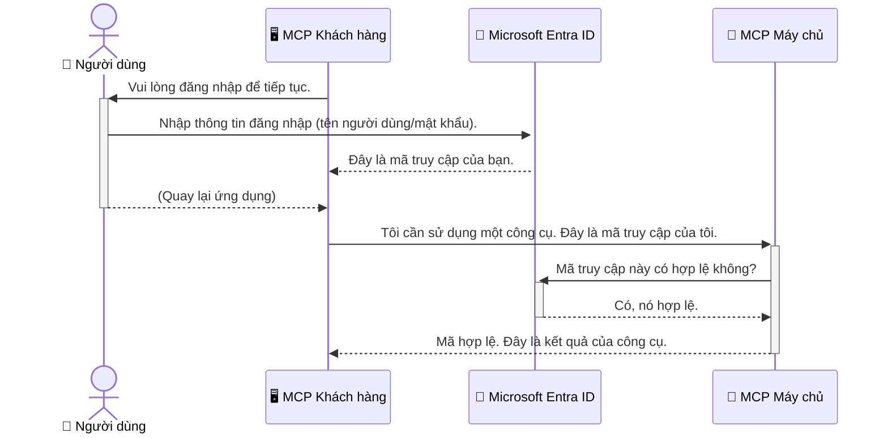

# Bảo mật Quy trình Làm việc AI: Xác thực Entra ID cho Máy chủ Giao thức Ngữ cảnh Mô hình

## Giới thiệu
Bảo mật máy chủ Giao thức Ngữ cảnh Mô hình (MCP) của bạn quan trọng như việc khóa cửa chính ngôi nhà. Để máy chủ MCP mở sẽ làm lộ các công cụ và dữ liệu của bạn cho truy cập trái phép, có thể dẫn đến các vi phạm bảo mật. Microsoft Entra ID cung cấp một giải pháp quản lý danh tính và truy cập dựa trên đám mây mạnh mẽ, giúp đảm bảo chỉ những người dùng và ứng dụng được ủy quyền mới có thể tương tác với máy chủ MCP của bạn. Trong phần này, bạn sẽ học cách bảo vệ quy trình làm việc AI của mình bằng xác thực Entra ID.

## Mục tiêu học tập
Sau phần này, bạn sẽ có thể:

- Hiểu tầm quan trọng của việc bảo mật máy chủ MCP.
- Giải thích các khái niệm cơ bản về Microsoft Entra ID và xác thực OAuth 2.0.
- Nhận biết sự khác biệt giữa khách hàng công khai và khách hàng bảo mật.
- Triển khai xác thực Entra ID trong các kịch bản máy chủ MCP cục bộ (khách hàng công khai) và máy chủ MCP từ xa (khách hàng bảo mật).
- Áp dụng các thực hành bảo mật tốt nhất khi phát triển quy trình làm việc AI.

## Bảo mật và MCP

Giống như bạn không để cửa chính nhà mình mở, bạn cũng không nên để máy chủ MCP mở cho bất kỳ ai truy cập. Bảo mật quy trình làm việc AI rất cần thiết để xây dựng các ứng dụng vững chắc, đáng tin cậy và an toàn. Chương này sẽ giới thiệu cách sử dụng Microsoft Entra ID để bảo mật máy chủ MCP, đảm bảo chỉ người dùng và ứng dụng được ủy quyền mới có thể tương tác với công cụ và dữ liệu của bạn.

## Tại sao bảo mật lại quan trọng đối với máy chủ MCP

Hãy tưởng tượng máy chủ MCP của bạn có một công cụ có thể gửi email hoặc truy cập cơ sở dữ liệu khách hàng. Một máy chủ không được bảo mật có nghĩa là bất kỳ ai cũng có thể sử dụng công cụ đó, dẫn đến truy cập dữ liệu trái phép, spam hoặc các hoạt động độc hại khác.

Bằng cách triển khai xác thực, bạn đảm bảo rằng mỗi yêu cầu gửi đến máy chủ được xác minh, xác nhận danh tính người dùng hoặc ứng dụng gửi yêu cầu. Đây là bước đầu tiên và quan trọng nhất trong việc bảo mật quy trình làm việc AI của bạn.

## Giới thiệu về Microsoft Entra ID

[**Microsoft Entra ID**](https://adoption.microsoft.com/microsoft-security/entra/) là một dịch vụ quản lý danh tính và truy cập dựa trên đám mây. Hãy xem nó như một nhân viên bảo vệ an ninh toàn diện cho các ứng dụng của bạn. Nó xử lý quy trình phức tạp xác minh danh tính người dùng (xác thực) và xác định những gì họ được phép làm (ủy quyền).

Bằng cách sử dụng Entra ID, bạn có thể:

- Kích hoạt đăng nhập an toàn cho người dùng.
- Bảo vệ API và các dịch vụ.
- Quản lý chính sách truy cập từ một điểm trung tâm.

Với máy chủ MCP, Entra ID cung cấp một giải pháp mạnh mẽ và được tin cậy rộng rãi để quản lý ai có thể truy cập các khả năng của máy chủ.

---

## Hiểu về Công nghệ: Cách Xác thực Entra ID Hoạt động

Entra ID sử dụng các tiêu chuẩn mở như **OAuth 2.0** để xử lý xác thực. Mặc dù chi tiết có thể phức tạp, khái niệm cốt lõi rất đơn giản và có thể hiểu qua một phép ẩn dụ.

### Giới thiệu Đơn giản về OAuth 2.0: Chìa khóa nhân viên giữ xe

Hãy tưởng tượng OAuth 2.0 giống như dịch vụ giữ xe cho ô tô của bạn. Khi bạn đến một nhà hàng, bạn không giao chìa khóa chính cho nhân viên giữ xe. Thay vào đó, bạn cung cấp một **chìa khóa nhân viên giữ xe** có quyền hạn giới hạn — nó có thể khởi động xe và khoá cửa, nhưng không thể mở cốp sau hoặc ngăn đựng đồ trong xe.

Trong phép ẩn dụ này:

- **Bạn** là **Người dùng**.
- **Xe của bạn** là **Máy chủ MCP** với các công cụ và dữ liệu giá trị.
- **Nhân viên giữ xe** là **Microsoft Entra ID**.
- **Người trông xe** là **Khách hàng MCP** (ứng dụng cố gắng truy cập máy chủ).
- **Chìa khoá nhân viên giữ xe** là **Token truy cập**.

Token truy cập là chuỗi văn bản bảo mật mà khách hàng MCP nhận được từ Entra ID sau khi bạn đăng nhập. Khách hàng sẽ gửi token này tới máy chủ MCP trong mỗi yêu cầu. Máy chủ có thể xác minh token để đảm bảo yêu cầu hợp lệ và khách hàng có quyền truy cập cần thiết mà không bao giờ phải xử lý trực tiếp thông tin đăng nhập thực của bạn (như mật khẩu).

### Luồng Xác thực

Quy trình hoạt động như sau:


  
### Giới thiệu Thư viện Xác thực Microsoft (MSAL)

Trước khi đi vào mã nguồn, quan trọng là giới thiệu một thành phần chính bạn sẽ gặp trong các ví dụ: **Microsoft Authentication Library (MSAL)**.

MSAL là một thư viện do Microsoft phát triển giúp lập trình viên dễ dàng xử lý xác thực hơn nhiều. Thay vì bạn phải tự viết toàn bộ mã phức tạp để xử lý token bảo mật, quản lý đăng nhập và làm mới phiên, MSAL sẽ lo tất cả.

Sử dụng một thư viện như MSAL rất được khuyến nghị vì:

- **Nó An toàn:** Thư viện tuân thủ các giao thức tiêu chuẩn trong ngành và các thực hành bảo mật tốt nhất, giảm rủi ro lỗ hổng trong mã nguồn của bạn.
- **Nó Đơn giản hóa Phát triển:** MSAL che giấu sự phức tạp của các giao thức OAuth 2.0 và OpenID Connect, cho phép bạn thêm xác thực mạnh mẽ cho ứng dụng chỉ với vài dòng mã.
- **Nó Được Bảo trì:** Microsoft tích cực duy trì và cập nhật MSAL nhằm đối phó với các mối đe dọa bảo mật mới và thay đổi về nền tảng.

MSAL hỗ trợ rất nhiều ngôn ngữ và nền tảng ứng dụng, bao gồm .NET, JavaScript/TypeScript, Python, Java, Go, và các nền tảng di động như iOS và Android. Điều này có nghĩa bạn có thể dùng cùng mẫu xác thực đồng nhất trên toàn bộ hệ thống công nghệ của mình.

Để tìm hiểu thêm về MSAL, bạn có thể tham khảo tài liệu [Tổng quan về MSAL chính thức](https://learn.microsoft.com/entra/identity-platform/msal-overview).

---

## Bảo mật Máy chủ MCP của bạn với Entra ID: Hướng dẫn Từng Bước

Bây giờ, hãy cùng tìm hiểu cách bảo mật một máy chủ MCP cục bộ (giao tiếp qua `stdio`) sử dụng Entra ID. Ví dụ này dùng một **khách hàng công khai**, phù hợp cho các ứng dụng chạy trên máy người dùng, như ứng dụng để bàn hoặc máy chủ phát triển cục bộ.

### Kịch bản 1: Bảo mật Máy chủ MCP Cục bộ (với Khách hàng Công khai)

Trong kịch bản này, chúng ta xem một máy chủ MCP chạy cục bộ, giao tiếp qua `stdio`, và dùng Entra ID để xác thực người dùng trước khi cho phép truy cập công cụ. Máy chủ có một công cụ duy nhất lấy thông tin hồ sơ người dùng từ Microsoft Graph API.

#### 1. Thiết lập Ứng dụng trong Entra ID

Trước khi viết mã, bạn cần đăng ký ứng dụng trong Microsoft Entra ID. Việc này để Entra ID biết về ứng dụng của bạn và cấp quyền sử dụng dịch vụ xác thực.

1. Truy cập **[cổng Microsoft Entra](https://entra.microsoft.com/)**.
2. Vào **App registrations** và nhấn **New registration**.
3. Đặt tên cho ứng dụng (ví dụ: "Máy chủ MCP Cục bộ của tôi").
4. Ở **Supported account types**, chọn **Accounts in this organizational directory only**.
5. Bạn có thể để trống **Redirect URI** trong ví dụ này.
6. Nhấn **Register**.

Sau khi đăng ký, lưu lại **Application (client) ID** và **Directory (tenant) ID**. Bạn sẽ cần chúng trong mã nguồn.

#### 2. Giải thích Mã nguồn

Hãy xem các phần chính của mã xử lý xác thực. Mã đầy đủ ví dụ này có trong thư mục [Entra ID - Local - WAM](https://github.com/Azure-Samples/mcp-auth-servers/tree/main/src/entra-id-local-wam) của kho [mcp-auth-servers trên GitHub](https://github.com/Azure-Samples/mcp-auth-servers).

**`AuthenticationService.cs`**

Lớp này chịu trách nhiệm xử lý tương tác với Entra ID.

- **`CreateAsync`**: Phương thức này khởi tạo `PublicClientApplication` từ MSAL (Thư viện Xác thực Microsoft). Nó được cấu hình với `clientId` và `tenantId` ứng dụng của bạn.
- **`WithBroker`**: Kích hoạt sử dụng trình môi giới (như Windows Web Account Manager), cung cấp trải nghiệm đăng nhập một lần (SSO) an toàn và liền mạch hơn.
- **`AcquireTokenAsync`**: Đây là phương thức chính. Nó cố gắng lấy token một cách thầm lặng trước (nghĩa là người dùng sẽ không phải đăng nhập lại nếu đã có phiên hợp lệ). Nếu không lấy được, nó sẽ yêu cầu người dùng đăng nhập tương tác.

```csharp
// Simplified for clarity
public static async Task<AuthenticationService> CreateAsync(ILogger<AuthenticationService> logger)
{
    var msalClient = PublicClientApplicationBuilder
        .Create(_clientId) // Your Application (client) ID
        .WithAuthority(AadAuthorityAudience.AzureAdMyOrg)
        .WithTenantId(_tenantId) // Your Directory (tenant) ID
        .WithBroker(new BrokerOptions(BrokerOptions.OperatingSystems.Windows))
        .Build();

    // ... cache registration ...

    return new AuthenticationService(logger, msalClient);
}

public async Task<string> AcquireTokenAsync()
{
    try
    {
        // Try silent authentication first
        var accounts = await _msalClient.GetAccountsAsync();
        var account = accounts.FirstOrDefault();

        AuthenticationResult? result = null;

        if (account != null)
        {
            result = await _msalClient.AcquireTokenSilent(_scopes, account).ExecuteAsync();
        }
        else
        {
            // If no account, or silent fails, go interactive
            result = await _msalClient.AcquireTokenInteractive(_scopes).ExecuteAsync();
        }

        return result.AccessToken;
    }
    catch (Exception ex)
    {
        _logger.LogError(ex, "An error occurred while acquiring the token.");
        throw; // Optionally rethrow the exception for higher-level handling
    }
}
```
  
**`Program.cs`**

Đây là nơi thiết lập máy chủ MCP và tích hợp dịch vụ xác thực.

- **`AddSingleton<AuthenticationService>`**: Đăng ký `AuthenticationService` với bộ chứa phụ thuộc, để được dùng bởi các phần khác của ứng dụng (như công cụ của chúng ta).
- **Công cụ `GetUserDetailsFromGraph`**: Công cụ này cần một thể hiện của `AuthenticationService`. Trước khi làm gì, nó gọi `authService.AcquireTokenAsync()` để lấy token truy cập hợp lệ. Nếu xác thực thành công, nó dùng token gọi Microsoft Graph API để lấy thông tin người dùng.

```csharp
// Simplified for clarity
[McpServerTool(Name = "GetUserDetailsFromGraph")]
public static async Task<string> GetUserDetailsFromGraph(
    AuthenticationService authService)
{
    try
    {
        // This will trigger the authentication flow
        var accessToken = await authService.AcquireTokenAsync();

        // Use the token to create a GraphServiceClient
        var graphClient = new GraphServiceClient(
            new BaseBearerTokenAuthenticationProvider(new TokenProvider(authService)));

        var user = await graphClient.Me.GetAsync();

        return System.Text.Json.JsonSerializer.Serialize(user);
    }
    catch (Exception ex)
    {
        return $"Error: {ex.Message}";
    }
}
```
  
#### 3. Cách Các Thành phần Hoạt động Cùng Nhau

1. Khi khách hàng MCP cố gắng dùng công cụ `GetUserDetailsFromGraph`, công cụ gọi `AcquireTokenAsync` trước.
2. `AcquireTokenAsync` kích hoạt thư viện MSAL kiểm tra token còn hiệu lực.
3. Nếu không có token, MSAL qua trình môi giới sẽ yêu cầu người dùng đăng nhập với tài khoản Entra ID.
4. Khi người dùng đăng nhập, Entra ID phát hành token truy cập.
5. Công cụ nhận token và dùng nó gọi an toàn Microsoft Graph API.
6. Thông tin người dùng được trả về cho khách hàng MCP.

Quy trình này đảm bảo chỉ người dùng đã xác thực mới có thể sử dụng công cụ, hiệu quả bảo mật máy chủ MCP cục bộ của bạn.

### Kịch bản 2: Bảo mật Máy chủ MCP Từ xa (với Khách hàng Bảo mật)

Khi máy chủ MCP chạy trên máy từ xa (ví dụ máy chủ đám mây) và giao tiếp qua giao thức như HTTP Streaming, yêu cầu bảo mật khác biệt. Trong trường hợp này, bạn nên dùng **khách hàng bảo mật** và **Luồng Mã ủy quyền (Authorization Code Flow)**. Đây là phương pháp an toàn hơn vì bí mật ứng dụng không bao giờ bị lộ ra trình duyệt.

Ví dụ này dùng một máy chủ MCP dựa trên TypeScript sử dụng Express.js để xử lý các yêu cầu HTTP.

#### 1. Thiết lập Ứng dụng trong Entra ID

Thiết lập trong Entra ID tương tự như khách hàng công khai, nhưng có một điểm khác biệt quan trọng: bạn cần tạo **bí mật khách hàng (client secret)**.

1. Truy cập **[cổng Microsoft Entra](https://entra.microsoft.com/)**.
2. Trong đăng ký ứng dụng, vào tab **Certificates & secrets**.
3. Nhấn **New client secret**, đặt mô tả, rồi nhấn **Add**.
4. **Quan trọng:** Sao chép giá trị bí mật ngay lập tức. Bạn sẽ không xem lại được sau này.
5. Bạn cũng cần cấu hình **Redirect URI**. Vào tab **Authentication**, nhấn **Add a platform**, chọn **Web**, và nhập URI chuyển hướng cho ứng dụng của bạn (ví dụ: `http://localhost:3001/auth/callback`).

> **⚠️ Lưu ý Bảo mật Quan trọng:** Đối với ứng dụng sản xuất, Microsoft khuyến nghị mạnh mẽ sử dụng các phương thức xác thực không dùng bí mật như **Managed Identity** hoặc **Workload Identity Federation** thay vì bí mật khách hàng. Bí mật khách hàng có thể bị lộ hoặc bị tấn công. Managed identity cung cấp cách tiếp cận an toàn hơn bằng cách loại bỏ nhu cầu lưu trữ thông tin đăng nhập trong mã hoặc cấu hình.
> 
> Để biết thêm thông tin về managed identities và cách triển khai, xem [Tổng quan về managed identities cho tài nguyên Azure](https://learn.microsoft.com/entra/identity/managed-identities-azure-resources/overview).

#### 2. Giải thích Mã nguồn

Ví dụ này dùng cách tiếp cận dựa trên phiên (session). Khi người dùng xác thực, máy chủ lưu token truy cập và token làm mới vào phiên và cấp token phiên cho người dùng. Token phiên này được sử dụng trong các yêu cầu tiếp theo. Mã đầy đủ của ví dụ nằm trong thư mục [Entra ID - Confidential client](https://github.com/Azure-Samples/mcp-auth-servers/tree/main/src/entra-id-cca-session) của kho [mcp-auth-servers trên GitHub](https://github.com/Azure-Samples/mcp-auth-servers).

**`Server.ts`**

Tệp này thiết lập máy chủ Express và lớp giao vận MCP.

- **`requireBearerAuth`**: Đây là middleware bảo vệ các điểm cuối `/sse` và `/message`. Nó kiểm tra token bearer hợp lệ trong header `Authorization` của yêu cầu.
- **`EntraIdServerAuthProvider`**: Đây là lớp tùy chỉnh triển khai giao diện `McpServerAuthorizationProvider`. Nó chịu trách nhiệm xử lý luồng OAuth 2.0.
- **`/auth/callback`**: Điểm cuối xử lý chuyển hướng từ Entra ID sau khi người dùng đã xác thực. Nó đổi mã ủy quyền lấy token truy cập và token làm mới.

```typescript
// Đơn giản hóa để rõ ràng hơn
const app = express();
const { server } = createServer();
const provider = new EntraIdServerAuthProvider();

// Bảo vệ điểm cuối SSE
app.get("/sse", requireBearerAuth({
  provider,
  requiredScopes: ["User.Read"]
}), async (req, res) => {
  // ... kết nối đến phương tiện truyền tải ...
});

// Bảo vệ điểm cuối tin nhắn
app.post("/message", requireBearerAuth({
  provider,
  requiredScopes: ["User.Read"]
}), async (req, res) => {
  // ... xử lý tin nhắn ...
});

// Xử lý callback OAuth 2.0
app.get("/auth/callback", (req, res) => {
  provider.handleCallback(req.query.code, req.query.state)
    .then(result => {
      // ... xử lý thành công hoặc thất bại ...
    });
});
```
  
**`Tools.ts`**

Tệp này định nghĩa các công cụ mà máy chủ MCP cung cấp. Công cụ `getUserDetails` giống với ví dụ trước, nhưng lấy token truy cập từ phiên.

```typescript
// Đơn giản hóa để rõ ràng hơn
server.setRequestHandler(CallToolRequestSchema, async (request) => {
  const { name } = request.params;
  const context = request.params?.context as { token?: string } | undefined;
  const sessionToken = context?.token;

  if (name === ToolName.GET_USER_DETAILS) {
    if (!sessionToken) {
      throw new AuthenticationError("Authentication token is missing or invalid. Ensure the token is provided in the request context.");
    }

    // Lấy token Entra ID từ bộ lưu trữ phiên
    const tokenData = tokenStore.getToken(sessionToken);
    const entraIdToken = tokenData.accessToken;

    const graphClient = Client.init({
      authProvider: (done) => {
        done(null, entraIdToken);
      }
    });

    const user = await graphClient.api('/me').get();

    // ... trả về chi tiết người dùng ...
  }
});
```
  
**`auth/EntraIdServerAuthProvider.ts`**

Lớp này xử lý logic cho:

- Chuyển hướng người dùng tới trang đăng nhập Entra ID.
- Đổi mã ủy quyền lấy token truy cập.
- Lưu trữ các token trong `tokenStore`.
- Làm mới token truy cập khi hết hạn.

#### 3. Cách Các Thành phần Hoạt động Cùng Nhau

1. Khi người dùng lần đầu cố gắng kết nối với máy chủ MCP, middleware `requireBearerAuth` sẽ phát hiện họ chưa có phiên hợp lệ và chuyển hướng họ đến trang đăng nhập Entra ID.
2. Người dùng đăng nhập với tài khoản Entra ID của họ.
3. Entra ID chuyển hướng người dùng trở lại điểm cuối `/auth/callback` với mã ủy quyền.
4. Máy chủ trao đổi mã lấy token truy cập và token làm mới, lưu trữ chúng và tạo một token phiên được gửi đến máy khách.
5. Máy khách bây giờ có thể sử dụng token phiên này trong tiêu đề `Authorization` cho tất cả các yêu cầu trong tương lai tới máy chủ MCP.
6. Khi công cụ `getUserDetails` được gọi, nó sử dụng token phiên để tra cứu token truy cập Entra ID rồi dùng token đó gọi API Microsoft Graph.

Luồng này phức tạp hơn so với luồng khách công khai, nhưng cần thiết cho các điểm cuối truy cập qua internet. Vì các máy chủ MCP từ xa truy cập được qua internet công cộng, chúng cần các biện pháp bảo mật mạnh hơn để ngăn chặn truy cập trái phép và các cuộc tấn công tiềm ẩn.


## Thực hành tốt nhất về bảo mật

- **Luôn sử dụng HTTPS**: Mã hóa giao tiếp giữa máy khách và máy chủ để bảo vệ token không bị chặn.
- **Triển khai Kiểm soát truy cập dựa trên vai trò (RBAC)**: Không chỉ kiểm tra *liệu* người dùng đã xác thực; mà còn kiểm tra *họ được phép làm gì*. Bạn có thể định nghĩa các vai trò trong Entra ID và kiểm tra chúng trong máy chủ MCP của bạn.
- **Giám sát và kiểm tra**: Ghi lại tất cả các sự kiện xác thực để có thể phát hiện và phản ứng với hoạt động đáng ngờ.
- **Xử lý giới hạn tốc độ và điều tiết**: Microsoft Graph và các API khác áp dụng giới hạn tốc độ để ngăn lạm dụng. Triển khai chiến lược lùi thời gian theo cấp số nhân và logic thử lại trong máy chủ MCP của bạn để xử lý trơn tru các phản hồi HTTP 429 (Quá nhiều yêu cầu). Cân nhắc lưu bộ đệm dữ liệu truy cập thường xuyên để giảm gọi API.
- **Lưu trữ token an toàn**: Lưu trữ token truy cập và token làm mới một cách an toàn. Với ứng dụng cục bộ, sử dụng các cơ chế lưu trữ an toàn của hệ thống. Với ứng dụng máy chủ, cân nhắc sử dụng lưu trữ mã hóa hoặc các dịch vụ quản lý khóa an toàn như Azure Key Vault.
- **Xử lý hết hạn token**: Token truy cập có thời hạn giới hạn. Triển khai tự động làm mới token sử dụng token làm mới để duy trì trải nghiệm người dùng liền mạch mà không cần xác thực lại.
- **Cân nhắc sử dụng Azure API Management**: Trong khi triển khai bảo mật trực tiếp trong máy chủ MCP cho phép bạn kiểm soát chi tiết, các cổng API như Azure API Management có thể xử lý nhiều vấn đề bảo mật này tự động, bao gồm xác thực, ủy quyền, giới hạn tốc độ và giám sát. Chúng cung cấp một lớp bảo mật tập trung nằm giữa máy khách và các máy chủ MCP của bạn. Để biết thêm chi tiết về việc sử dụng cổng API với MCP, xem bài viết [Azure API Management Your Auth Gateway For MCP Servers](https://techcommunity.microsoft.com/blog/integrationsonazureblog/azure-api-management-your-auth-gateway-for-mcp-servers/4402690).


## Những điểm chính cần nhớ

- Bảo mật máy chủ MCP của bạn là điều then chốt để bảo vệ dữ liệu và công cụ.
- Microsoft Entra ID cung cấp giải pháp xác thực và ủy quyền mạnh mẽ và mở rộng.
- Sử dụng **khách công khai** cho các ứng dụng cục bộ và **khách bí mật** cho máy chủ từ xa.
- **Luồng Mã ủy quyền** là lựa chọn bảo mật nhất cho các ứng dụng web.


## Bài tập

1. Hãy suy nghĩ về một máy chủ MCP mà bạn có thể xây dựng. Nó sẽ là máy chủ cục bộ hay máy chủ từ xa?
2. Dựa trên câu trả lời của bạn, bạn sẽ sử dụng khách công khai hay khách bí mật?
3. Máy chủ MCP của bạn sẽ yêu cầu quyền gì để thực hiện các hành động với Microsoft Graph?


## Bài tập thực hành

### Bài tập 1: Đăng ký ứng dụng trong Entra ID
Đi đến cổng thông tin Microsoft Entra.
Đăng ký một ứng dụng mới cho máy chủ MCP của bạn.
Ghi lại ID ứng dụng (client) và ID thư mục (tenant).

### Bài tập 2: Bảo mật máy chủ MCP cục bộ (Khách công khai)
- Theo ví dụ mã để tích hợp MSAL (Thư viện Xác thực Microsoft) cho xác thực người dùng.
- Kiểm tra luồng xác thực bằng cách gọi công cụ MCP lấy thông tin người dùng từ Microsoft Graph.

### Bài tập 3: Bảo mật máy chủ MCP từ xa (Khách bí mật)
- Đăng ký khách bí mật trong Entra ID và tạo một client secret.
- Cấu hình máy chủ MCP Express.js của bạn sử dụng Luồng Mã ủy quyền.
- Kiểm tra các điểm cuối được bảo vệ và xác nhận quyền truy cập dựa trên token.

### Bài tập 4: Áp dụng thực hành bảo mật tốt nhất
- Bật HTTPS cho máy chủ cục bộ hoặc từ xa.
- Triển khai kiểm soát truy cập dựa trên vai trò (RBAC) trong logic máy chủ.
- Thêm xử lý hết hạn token và lưu trữ token an toàn.

## Tài nguyên

1. **Tài liệu tổng quan về MSAL**  
   Tìm hiểu cách Thư viện Xác thực Microsoft (MSAL) hỗ trợ lấy token an toàn trên nhiều nền tảng:  
   [MSAL Overview on Microsoft Learn](https://learn.microsoft.com/en-gb/entra/msal/overview)

2. **Kho mã nguồn Azure-Samples/mcp-auth-servers trên GitHub**  
   Các ví dụ triển khai máy chủ MCP minh họa luồng xác thực:  
   [Azure-Samples/mcp-auth-servers on GitHub](https://github.com/Azure-Samples/mcp-auth-servers)

3. **Tổng quan về Managed Identities cho tài nguyên Azure**  
   Hiểu cách loại bỏ bí mật bằng cách sử dụng managed identities được hệ thống hoặc người dùng gán:  
   [Managed Identities Overview on Microsoft Learn](https://learn.microsoft.com/en-us/entra/identity/managed-identities-azure-resources/)

4. **Azure API Management: Cổng xác thực của bạn cho các máy chủ MCP**  
   Tìm hiểu sâu về việc sử dụng APIM làm cổng OAuth2 an toàn cho máy chủ MCP:  
   [Azure API Management Your Auth Gateway For MCP Servers](https://techcommunity.microsoft.com/blog/integrationsonazureblog/azure-api-management-your-auth-gateway-for-mcp-servers/4402690)

5. **Tham chiếu quyền của Microsoft Graph**  
   Danh sách đầy đủ các quyền ủy quyền và ứng dụng cho Microsoft Graph:  
   [Microsoft Graph Permissions Reference](https://learn.microsoft.com/zh-tw/graph/permissions-reference)


## Kết quả học tập
Sau khi hoàn thành phần này, bạn sẽ có thể:

- Diễn giải tại sao xác thực lại quan trọng với máy chủ MCP và các luồng công việc AI.
- Thiết lập và cấu hình xác thực Entra ID cho cả kịch bản máy chủ MCP cục bộ và từ xa.
- Chọn loại khách phù hợp (công khai hoặc bí mật) dựa trên cách triển khai máy chủ.
- Triển khai các thực hành viết mã an toàn, bao gồm lưu trữ token và ủy quyền dựa trên vai trò.
- Tự tin bảo vệ máy chủ MCP và các công cụ của bạn khỏi truy cập trái phép.

## Tiếp theo

- [5.13 Tích hợp Giao thức Ngữ cảnh Mô hình (MCP) với Microsoft Foundry](../mcp-foundry-agent-integration/README.md)

---

<!-- CO-OP TRANSLATOR DISCLAIMER START -->
**Tuyên bố miễn trừ trách nhiệm**:
Tài liệu này đã được dịch bằng dịch vụ dịch thuật AI [Co-op Translator](https://github.com/Azure/co-op-translator). Mặc dù chúng tôi cố gắng đảm bảo độ chính xác, xin lưu ý rằng bản dịch tự động có thể chứa lỗi hoặc sai sót. Tài liệu gốc bằng ngôn ngữ gốc nên được coi là nguồn tin chính thức. Đối với thông tin quan trọng, nên sử dụng dịch vụ dịch thuật chuyên nghiệp bởi con người. Chúng tôi không chịu trách nhiệm về bất kỳ hiểu lầm hoặc giải thích sai nào phát sinh từ việc sử dụng bản dịch này.
<!-- CO-OP TRANSLATOR DISCLAIMER END -->