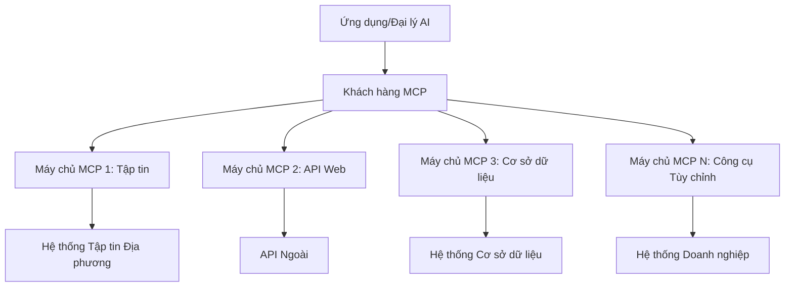

# 🌐 Module 2: MCP với Microsoft Foundry Toolkit Fundamentals

[]()
[]()
[]()

## 📋 Mục Tiêu Học Tập

Kết thúc module này, bạn sẽ có thể:
- ✅ Hiểu kiến trúc và lợi ích của Model Context Protocol (MCP)
- ✅ Khám phá hệ sinh thái máy chủ MCP của Microsoft
- ✅ Tích hợp các máy chủ MCP với Microsoft Foundry Toolkit Agent Builder
- ✅ Xây dựng một agent tự động trình duyệt hoạt động bằng Playwright MCP
- ✅ Cấu hình và kiểm tra các công cụ MCP trong agent của bạn
- ✅ Xuất và triển khai các agent sử dụng MCP cho môi trường sản xuất

## 🎯 Xây Dựng Trên Module 1

Trong Module 1, chúng ta đã làm chủ các kiến thức cơ bản của Microsoft Foundry Toolkit và tạo ra Agent Python đầu tiên của mình. Bây giờ, chúng ta sẽ **nâng cao** agent của bạn bằng cách kết nối chúng với các công cụ và dịch vụ bên ngoài thông qua đột phá **Model Context Protocol (MCP)**.

Hãy tưởng tượng đây như việc nâng cấp từ một máy tính cầm tay đơn giản lên một chiếc máy tính đầy đủ — các agent AI của bạn sẽ có khả năng:
- 🌐 Duyệt và tương tác với các trang web
- 📁 Truy cập và thao tác với các tập tin
- 🔧 Tích hợp với các hệ thống doanh nghiệp
- 📊 Xử lý dữ liệu thời gian thực từ các API

## 🧠 Hiểu Về Model Context Protocol (MCP)

### 🔍 MCP là gì?

Model Context Protocol (MCP) là **"USB-C cho các ứng dụng AI"** — một chuẩn mở đột phá kết nối các Mô Hình Ngôn Ngữ Lớn (LLMs) với công cụ bên ngoài, nguồn dữ liệu và dịch vụ. Cũng giống như USB-C loại bỏ sự rối rắm các dây cáp bằng cách cung cấp một đầu nối duy nhất, MCP loại bỏ sự phức tạp trong tích hợp AI qua một giao thức tiêu chuẩn.

### 🎯 Vấn Đề MCP Giải Quyết

**Trước MCP:**
- 🔧 Tích hợp tùy chỉnh cho từng công cụ
- 🔄 Khóa nhà cung cấp với các giải pháp độc quyền
- 🔒 Lỗ hổng bảo mật do các kết nối tùy tiện
- ⏱️ Nhiều tháng phát triển cho tích hợp cơ bản

**Với MCP:**
- ⚡ Tích hợp công cụ cắm là chạy
- 🔄 Kiến trúc không phụ thuộc nhà cung cấp
- 🛡️ Thực tiễn bảo mật tích hợp sẵn
- 🚀 Thêm khả năng mới chỉ trong vài phút

### 🏗️ Khám Phá Kiến Trúc MCP

MCP tuân theo kiến trúc **client-server** tạo ra một hệ sinh thái an toàn và có thể mở rộng:



**🔧 Các thành phần chính:**

| Thành phần | Vai trò | Ví dụ |
|------------|---------|--------|
| **MCP Hosts** | Ứng dụng tiêu thụ dịch vụ MCP | Claude Desktop, VS Code, Microsoft Foundry Toolkit |
| **MCP Clients** | Xử lý giao thức (1:1 với server) | Được tích hợp trong ứng dụng host |
| **MCP Servers** | Cung cấp khả năng qua giao thức chuẩn | Playwright, Files, Azure, GitHub |
| **Transport Layer** | Phương thức giao tiếp | stdio, HTTP, WebSockets |


## 🏢 Hệ Sinh Thái Máy Chủ MCP của Microsoft

Microsoft dẫn đầu hệ sinh thái MCP với bộ máy chủ cấp doanh nghiệp toàn diện đáp ứng các nhu cầu thực tế của doanh nghiệp.

### 🌟 Các Máy Chủ MCP Nổi Bật của Microsoft

#### 1. ☁️ Azure MCP Server
**🔗 Kho Lưu Trữ**: [azure/azure-mcp](https://github.com/azure/azure-mcp)
**🎯 Mục đích**: Quản lý tài nguyên Azure toàn diện với tích hợp AI

**✨ Tính năng chính:**
- Cung cấp hạ tầng theo mô tả khai báo
- Giám sát tài nguyên thời gian thực
- Gợi ý tối ưu chi phí
- Kiểm tra tuân thủ bảo mật

**🚀 Ứng dụng:**
- Hạ tầng như mã với trợ lý AI
- Tự động mở rộng tài nguyên
- Tối ưu chi phí đám mây
- Tự động hóa quy trình DevOps

#### 2. 📊 Microsoft Dataverse MCP
**📚 Tài liệu**: [Microsoft Dataverse Integration](https://go.microsoft.com/fwlink/?linkid=2320176)
**🎯 Mục đích**: Giao diện ngôn ngữ tự nhiên cho dữ liệu kinh doanh

**✨ Tính năng chính:**
- Truy vấn cơ sở dữ liệu bằng ngôn ngữ tự nhiên
- Hiểu bối cảnh kinh doanh
- Mẫu hướng dẫn tùy chỉnh
- Quản trị dữ liệu doanh nghiệp

**🚀 Ứng dụng:**
- Báo cáo thông minh doanh nghiệp
- Phân tích dữ liệu khách hàng
- Hiểu biết về pipeline bán hàng
- Truy vấn dữ liệu tuân thủ

#### 3. 🌐 Playwright MCP Server
**🔗 Kho Lưu Trữ**: [microsoft/playwright-mcp](https://github.com/microsoft/playwright-mcp)
**🎯 Mục đích**: Tự động hóa trình duyệt và tương tác web

**✨ Tính năng chính:**
- Tự động hóa đa trình duyệt (Chrome, Firefox, Safari)
- Phát hiện phần tử thông minh
- Chụp màn hình và tạo PDF
- Giám sát lưu lượng mạng

**🚀 Ứng dụng:**
- Quy trình kiểm thử tự động
- Thu thập và trích xuất dữ liệu web
- Giám sát UI/UX
- Tự động phân tích cạnh tranh

#### 4. 📁 Files MCP Server
**🔗 Kho Lưu Trữ**: [microsoft/files-mcp-server](https://github.com/microsoft/files-mcp-server)
**🎯 Mục đích**: Các hoạt động hệ thống tập tin thông minh

**✨ Tính năng chính:**
- Quản lý tập tin theo mô tả khai báo
- Đồng bộ nội dung
- Tích hợp kiểm soát phiên bản
- Trích xuất metadata

**🚀 Ứng dụng:**
- Quản lý tài liệu
- Tổ chức kho mã nguồn
- Quy trình xuất bản nội dung
- Xử lý tập tin trong pipeline dữ liệu

#### 5. 📝 MarkItDown MCP Server
**🔗 Kho Lưu Trữ**: [microsoft/markitdown](https://github.com/microsoft/markitdown)
**🎯 Mục đích**: Xử lý và thao tác Markdown nâng cao

**✨ Tính năng chính:**
- Phân tích cú pháp Markdown phong phú
- Chuyển đổi định dạng (MD ↔ HTML ↔ PDF)
- Phân tích cấu trúc nội dung
- Xử lý mẫu

**🚀 Ứng dụng:**
- Quy trình tài liệu kỹ thuật
- Hệ thống quản lý nội dung
- Tạo báo cáo
- Tự động hóa cơ sở kiến thức

#### 6. 📈 Clarity MCP Server
**📦 Gói**: [@microsoft/clarity-mcp-server](https://www.npmjs.com/package/@microsoft/clarity-mcp-server)
**🎯 Mục đích**: Phân tích web và nghiên cứu hành vi người dùng

**✨ Tính năng chính:**
- Phân tích dữ liệu bản đồ nhiệt
- Ghi lại phiên người dùng
- Chỉ số hiệu suất
- Phân tích phễu chuyển đổi

**🚀 Ứng dụng:**
- Tối ưu hóa trang web
- Nghiên cứu trải nghiệm người dùng
- Phân tích A/B testing
- Bảng điều khiển thông minh doanh nghiệp

### 🌍 Hệ Sinh Thái Cộng Đồng

Ngoài các máy chủ của Microsoft, hệ sinh thái MCP còn bao gồm:
- **🐙 GitHub MCP**: Quản lý kho lưu trữ và phân tích mã nguồn
- **🗄️ Database MCPs**: Tích hợp PostgreSQL, MySQL, MongoDB
- **☁️ Cloud Provider MCPs**: Công cụ AWS, GCP, Digital Ocean
- **📧 Communication MCPs**: Tích hợp Slack, Teams, Email

## 🛠️ Thực Hành: Xây Dựng Agent Tự Động Trình Duyệt

**🎯 Mục tiêu dự án**: Tạo một agent tự động trình duyệt thông minh với máy chủ Playwright MCP có thể điều hướng website, trích xuất thông tin và thực hiện các tương tác web phức tạp.

### 🚀 Giai đoạn 1: Thiết Lập Nền Tảng Agent

#### Bước 1: Khởi tạo Agent
1. **Mở Microsoft Foundry Toolkit Agent Builder**
2. **Tạo Agent Mới** với cấu hình sau:
   - **Tên**: `BrowserAgent`
   - **Mô hình**: Chọn GPT-4o 


### 🔧 Giai đoạn 2: Quy Trình Tích Hợp MCP

#### Bước 3: Thêm Tích Hợp Máy Chủ MCP
1. **Đi tới phần Công Cụ** trong Agent Builder
2. **Nhấn "Add Tool"** để mở menu tích hợp
3. **Chọn "MCP Server"** từ các tùy chọn có sẵn


**🔍 Hiểu các loại công cụ:**
- **Công cụ tích hợp sẵn**: Chức năng Microsoft Foundry Toolkit có sẵn
- **MCP Servers**: Tích hợp dịch vụ bên ngoài
- **API Tùy chỉnh**: Điểm cuối dịch vụ của bạn
- **Function Calling**: Truy cập hàm trực tiếp của mô hình

#### Bước 4: Chọn Máy Chủ MCP
1. **Chọn tùy chọn "MCP Server"** để tiếp tục


2. **Duyệt Catalog MCP** để khám phá các tích hợp có sẵn


### 🎮 Giai đoạn 3: Cấu Hình Playwright MCP

#### Bước 5: Chọn và Cấu Hình Playwright
1. **Nhấn "Use Featured MCP Servers"** để truy cập các máy chủ Microsoft đã xác thực
2. **Chọn "Playwright"** từ danh sách nổi bật
3. **Chấp nhận MCP ID mặc định** hoặc tùy chỉnh theo môi trường của bạn


#### Bước 6: Kích Hoạt Tính Năng Playwright
**🔑 Bước Quan Trọng**: Chọn **TẤT CẢ** các phương thức Playwright có sẵn để có chức năng tối đa


**🛠️ Các công cụ Playwright thiết yếu:**
- **Điều hướng**: `goto`, `goBack`, `goForward`, `reload`
- **Tương tác**: `click`, `fill`, `press`, `hover`, `drag`
- **Trích xuất**: `textContent`, `innerHTML`, `getAttribute`
- **Xác nhận**: `isVisible`, `isEnabled`, `waitForSelector`
- **Chụp ảnh**: `screenshot`, `pdf`, `video`
- **Mạng**: `setExtraHTTPHeaders`, `route`, `waitForResponse`

#### Bước 7: Xác Minh Tích Hợp Thành Công
**✅ Dấu hiệu thành công:**
- Tất cả công cụ xuất hiện trong giao diện Agent Builder
- Không có lỗi trên bảng tích hợp
- Trạng thái máy chủ Playwright hiển thị "Connected"


**🔧 Khắc phục sự cố thường gặp:**
- **Kết nối thất bại**: Kiểm tra kết nối internet và cấu hình tường lửa
- **Thiếu công cụ**: Đảm bảo chọn đầy đủ chức năng trong lúc cấu hình
- **Lỗi quyền**: Xác minh VS Code có quyền cần thiết trên hệ thống

### 🎯 Giai đoạn 4: Kỹ Thuật Tạo Prompt Nâng Cao

#### Bước 8: Thiết Kế Prompt Hệ Thống Thông Minh
Tạo các prompt tinh vi tận dụng đầy đủ khả năng của Playwright:

```markdown
# Web Automation Expert System Prompt

## Core Identity
You are an advanced web automation specialist with deep expertise in browser automation, web scraping, and user experience analysis. You have access to Playwright tools for comprehensive browser control.

## Capabilities & Approach
### Navigation Strategy
- Always start with screenshots to understand page layout
- Use semantic selectors (text content, labels) when possible
- Implement wait strategies for dynamic content
- Handle single-page applications (SPAs) effectively

### Error Handling
- Retry failed operations with exponential backoff
- Provide clear error descriptions and solutions
- Suggest alternative approaches when primary methods fail
- Always capture diagnostic screenshots on errors

### Data Extraction
- Extract structured data in JSON format when possible
- Provide confidence scores for extracted information
- Validate data completeness and accuracy
- Handle pagination and infinite scroll scenarios

### Reporting
- Include step-by-step execution logs
- Provide before/after screenshots for verification
- Suggest optimizations and alternative approaches
- Document any limitations or edge cases encountered

## Ethical Guidelines
- Respect robots.txt and rate limiting
- Avoid overloading target servers
- Only extract publicly available information
- Follow website terms of service
```

#### Bước 9: Tạo Prompt Người Dùng Động
Thiết kế các prompt thể hiện nhiều khả năng khác nhau:

**🌐 Ví dụ phân tích web:**
```markdown
Navigate to github.com/kinfey and provide a comprehensive analysis including:
1. Repository structure and organization
2. Recent activity and contribution patterns  
3. Documentation quality assessment
4. Technology stack identification
5. Community engagement metrics
6. Notable projects and their purposes

Include screenshots at key steps and provide actionable insights.
```


### 🚀 Giai đoạn 5: Thực Thi và Kiểm Tra

#### Bước 10: Chạy Tự Động Hóa Đầu Tiên
1. **Nhấn "Run"** để khởi động chuỗi tự động hóa
2. **Theo dõi thực thi theo thời gian thực**:
   - Trình duyệt Chrome tự động mở
   - Agent điều hướng tới trang web mục tiêu
   - Chụp màn hình từng bước chính
   - Kết quả phân tích truyền về liên tục


#### Bước 11: Phân Tích Kết Quả và Thấu Hiểu
Xem phân tích chi tiết trong giao diện Agent Builder:


### 🌟 Giai đoạn 6: Khả Năng Nâng Cao và Triển Khai

#### Bước 12: Xuất và Triển Khai Sản Xuất
Agent Builder hỗ trợ nhiều lựa chọn triển khai:


## 🎓 Tóm Tắt Module 2 & Các Bước Tiếp Theo

### 🏆 Thành Tựu Đạt được: Làm Chủ Tích Hợp MCP

**✅ Kỹ năng đã làm chủ:**
- [ ] Hiểu kiến trúc và lợi ích MCP
- [ ] Điều hướng hệ sinh thái máy chủ MCP của Microsoft
- [ ] Tích hợp Playwright MCP với Microsoft Foundry Toolkit
- [ ] Xây dựng agent tự động trình duyệt tinh vi
- [ ] Kỹ thuật tạo prompt nâng cao cho tự động hóa web

### 📚 Tài Nguyên Bổ Sung

- **🔗 Đặc tả MCP**: [Tài liệu giao thức chính thức](https://modelcontextprotocol.io/)
- **🛠️ API Playwright**: [Tham khảo phương thức đầy đủ](https://playwright.dev/docs/api/class-playwright)
- **🏢 Máy chủ MCP Microsoft**: [Hướng dẫn tích hợp doanh nghiệp](https://github.com/microsoft/mcp-servers)
- **🌍 Ví dụ cộng đồng**: [Thư viện máy chủ MCP](https://github.com/modelcontextprotocol/servers)

**🎉 Chúc mừng!** Bạn đã làm chủ tích hợp MCP và giờ có thể xây dựng các agent AI sẵn sàng sản xuất với khả năng sử dụng công cụ bên ngoài!


### 🔜 Tiếp Tục tới Module Tiếp Theo

Sẵn sàng nâng cao kỹ năng MCP của bạn? Tiếp tục **[Module 3: Phát triển MCP nâng cao với Microsoft Foundry Toolkit](../lab3/README.md)** nơi bạn sẽ học cách:
- Tạo các máy chủ MCP tùy chỉnh của riêng bạn
- Cấu hình và sử dụng SDK MCP Python mới nhất
- Thiết lập MCP Inspector để gỡ lỗi
- Làm chủ quy trình phát triển máy chủ MCP nâng cao
- Xây dựng máy chủ Weather MCP từ đầu

---

<!-- CO-OP TRANSLATOR DISCLAIMER START -->
**Tuyên bố miễn trừ trách nhiệm**:
Tài liệu này đã được dịch bằng dịch vụ dịch thuật AI [Co-op Translator](https://github.com/Azure/co-op-translator). Mặc dù chúng tôi cố gắng đảm bảo độ chính xác, xin lưu ý rằng bản dịch tự động có thể chứa lỗi hoặc sai sót. Tài liệu gốc bằng ngôn ngữ gốc nên được coi là nguồn tin chính thức. Đối với thông tin quan trọng, nên sử dụng dịch vụ dịch thuật chuyên nghiệp bởi con người. Chúng tôi không chịu trách nhiệm về bất kỳ hiểu lầm hoặc giải thích sai nào phát sinh từ việc sử dụng bản dịch này.
<!-- CO-OP TRANSLATOR DISCLAIMER END -->