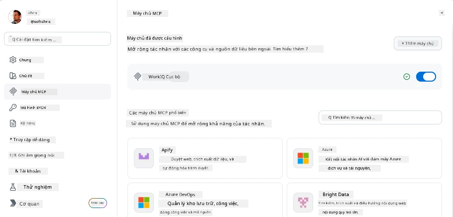
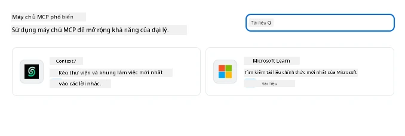
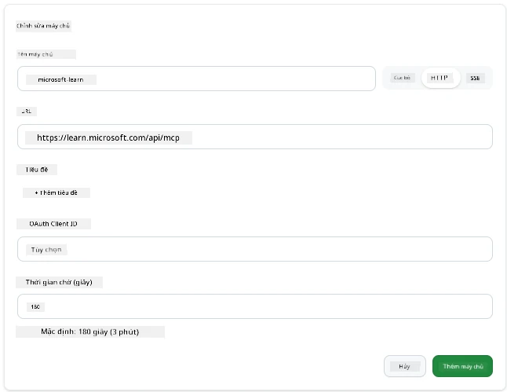
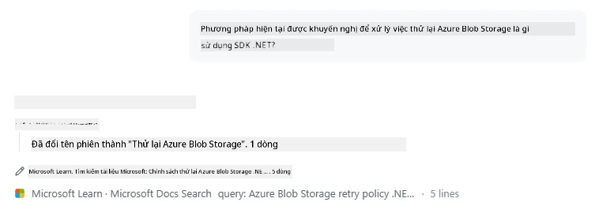
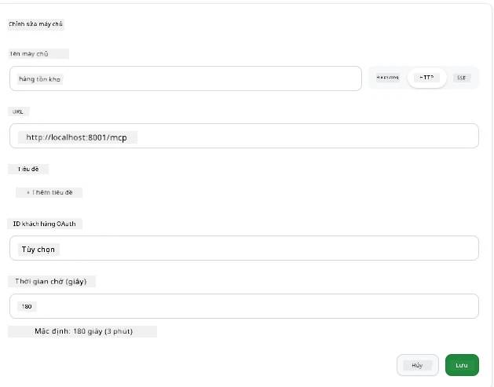
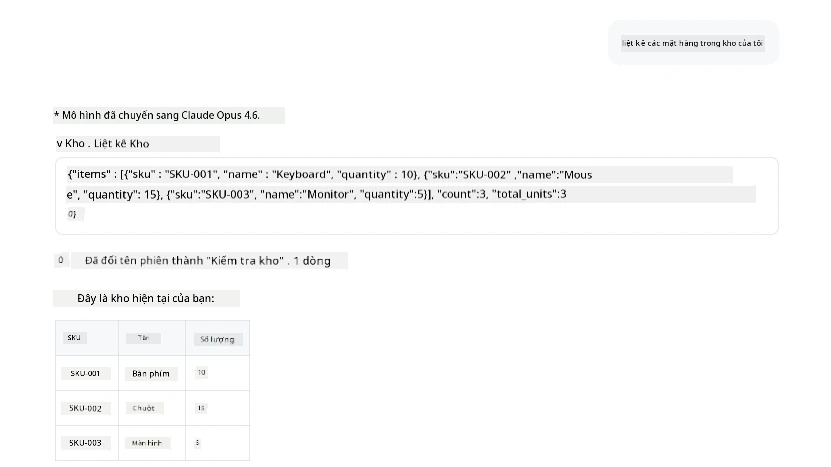
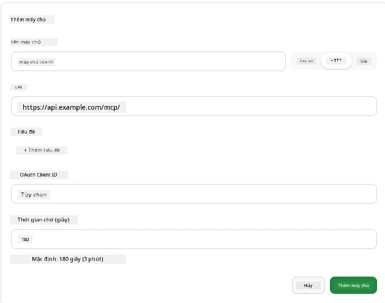
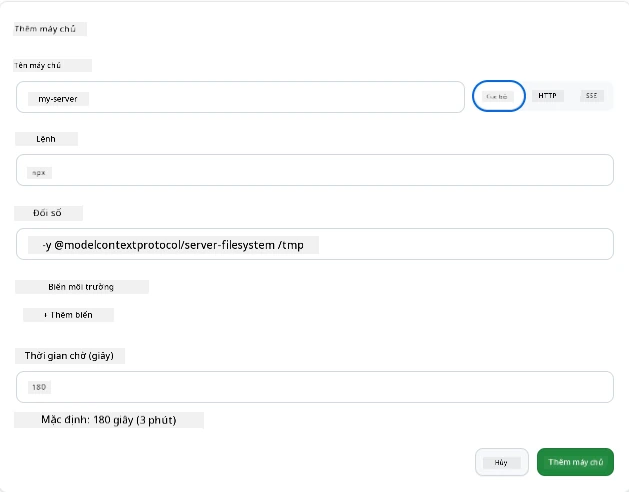

# Sử dụng Máy chủ MCP trong Ứng dụng GitHub Copilot

Đến nay bạn đã biết MCP hoạt động như thế nào. Bạn đã xây dựng máy chủ, định nghĩa công cụ và tài nguyên, và kết nối các khách hàng. Điều mà chúng ta chưa làm là đổi góc nhìn: thay vì bạn là người xây dựng máy chủ, thì trải nghiệm của bên *tiêu thụ* — như một người dùng ứng dụng AI hỗ trợ MCP — sẽ ra sao?

[GitHub Copilot App](https://github.com/github/app) là một ứng dụng máy tính để bàn có thể sử dụng Máy chủ MCP. Bằng cách kết nối các máy chủ MCP với nó, bạn mở khóa một cấp độ mới: Copilot có thể truy cập vào tài liệu của bạn, gọi các API nội bộ, truy vấn cơ sở dữ liệu hoặc kết nối với bất kỳ dịch vụ nào bạn đã gói trong một máy chủ. Ứng dụng trở thành máy chủ chủ; các máy chủ MCP của bạn trở thành công cụ của nó.

Bài học này sẽ hướng dẫn bạn trải nghiệm đó từ đầu đến cuối — từ việc tìm bảng cài đặt MCP đến kết nối một máy chủ tài liệu thực và sau đó kết nối một máy chủ tùy chỉnh của riêng bạn.

## Mục tiêu học tập

Sau bài học này, bạn sẽ có thể:

- Xác định và điều hướng bảng Máy chủ MCP trong cài đặt Ứng dụng Copilot.
- Kết nối máy chủ tài liệu được lưu trữ và sử dụng nó trong phiên làm việc.
- Đăng ký máy chủ tùy chỉnh và xác minh Copilot có thể gọi các công cụ của nó.
- Cấu hình cách gọi máy chủ bằng cách cung cấp biến môi trường hoặc tiêu đề tùy chỉnh (nếu HTTP)

## Ứng dụng Copilot như một Máy chủ MCP

Ý tưởng cơ bản là: **Các tác nhân của Copilot rất thông minh, nhưng chúng chỉ biết những gì bạn nói cho chúng biết.** Theo mặc định, tác nhân có thể đọc các tập tin trong không gian làm việc của bạn và chạy các lệnh terminal, nhưng không thể truy vấn cơ sở dữ liệu, xem lịch trình của bạn hoặc gọi API tùy chỉnh mà không có sự trợ giúp. Đó là vai trò của các máy chủ MCP. Chúng đóng vai trò cầu nối giữa Copilot và các hệ thống của bạn — cơ sở dữ liệu, kiểm soát phiên bản, API, công cụ thiết kế — cung cấp cho các tác nhân quyền truy cập vào thông tin và hành động cần thiết để hoàn thành công việc.

Hãy bắt đầu bằng cách tìm cài đặt để quản lý Máy chủ MCP trong ứng dụng của bạn.

## Bước 1: Tìm bảng cài đặt MCP

Mở Ứng dụng Copilot và tìm biểu tượng bánh răng ở góc dưới bên trái, rồi nhấp vào đó.


Đảm bảo bạn chọn "MCP Servers" và bạn sẽ thấy máy chủ đã cấu hình ở trên cùng, một chợ máy chủ phổ biến ở dưới cùng, cùng nút "Add Server" ở trên đầu như sau:



Đây là trung tâm điều khiển của bạn. Bạn thêm, xóa, bật và tắt máy chủ tại đây. Các thay đổi có hiệu lực cho các phiên làm việc mới; nếu bạn đang mở một phiên làm việc, bạn cần bắt đầu phiên mới sau khi thay đổi danh sách này.

## Bước 2: Kết nối Máy chủ tài liệu

Hãy làm một điều hữu ích ngay lập tức. Máy chủ Microsoft Docs MCP cho phép Copilot truy cập vào tài liệu chính thức của Microsoft. Bao gồm Azure, .NET, TypeScript và nhiều hơn nữa. Thay vì tác nhân dựa vào dữ liệu huấn luyện (có ngày ngắt), nó có thể kéo tài liệu hiện tại vào lúc truy vấn.

Cách thêm nó:

1. Trong lưới máy chủ phổ biến, gõ **learn** và chọn máy chủ có tên "Microsoft Learn".

   

   Khi nhấp vào, một biểu mẫu xuất hiện với tên, loại truyền và URL đã được điền sẵn, bạn chỉ phải nhấn "Add Server".

2. Nhấn "Add Server", sẽ mất vài giây để kết nối máy chủ.

   

   Khi thêm xong, máy chủ sẽ xuất hiện ở phía trên như một máy chủ đã cấu hình. Hãy thử dùng nó tiếp theo.

3. Đóng hộp thoại và chọn Quick chat.

4. Gõ lệnh sau để kích hoạt một công cụ trên máy chủ Microsoft Learn.

   ```text
   What's the current recommended approach for handling Azure Blob Storage 
   retries using the .NET SDK?
   ```

   

Bạn sẽ thấy cách nó tham chiếu đến Máy chủ MCP vừa thêm.

## Bước 3: Kết nối Máy chủ stdio tùy chỉnh

Các cấu hình sẵn rất tiện, nhưng sức mạnh thực sự là kết nối máy chủ riêng của bạn. Giả sử bạn đã xây dựng hoặc được cung cấp một máy chủ phơi bày API nội bộ hoặc cơ sở tri thức công ty. Trong trường hợp này, chúng ta sẽ dùng một Máy chủ MCP tự tạo xử lý quản lý kho hàng công ty.

1. Nhấp vào bánh răng và chọn lại "MCP servers".

2. Nhấn nút "Add Server" rồi "+ Add Custom server", và nhập các giá trị sau:

   - Name: `Inventory Server`
   - Chọn loại truyền (ở bên phải), **http**

   Nhấn "Add Server" và máy chủ sẽ xuất hiện trong danh sách máy chủ đã cấu hình.

   

4. Để thử, gõ lệnh như sau:

    ```
    list inventory
    ```

   

   Bây giờ bạn sẽ thấy danh sách các mặt hàng kho được trả về từ máy chủ tùy chỉnh của bạn.

Tuyệt vời, bạn đã hiểu cách thêm cả máy chủ bên ngoài cũng như máy chủ MCP của riêng bạn vào Ứng dụng Copilot. Tiếp theo, hãy nói về cách xử lý bí mật và biến môi trường.

## Bước 4: Cài đặt nâng cao

Cho đến nay, bạn đã thấy cách thêm Máy chủ MCP chỉ với tên và URL. Nhưng nếu máy chủ của bạn cần khóa API hoặc giá trị khác? Tùy thuộc loại truyền, bạn có thể cung cấp những gì nó cần.

- **truyền http hoặc SSE**: Ở đây ta có thể thiết lập tiêu đề tùy ý.

   Để xác thực, bạn có thể chỉ định tiêu đề Authorization, ví dụ. Giá trị có thể là chuỗi tĩnh. Nếu bạn dùng OAuth, bạn có thể cung cấp ID khách hàng OAuth.

   

- **truyền stdio**: Có thể thiết lập biến môi trường.

   Ở đây bạn khai báo các biến môi trường cần thiết để truyền vào máy chủ khi khởi động.

   

## Tóm tắt

Ứng dụng Copilot coi máy chủ MCP như phần mở rộng hàng đầu của khả năng tác nhân. Bạn đã thấy toàn bộ quá trình trong bài học này từ thêm máy chủ MCP đến sử dụng chúng trong phiên làm việc. Bạn giờ có thể kết nối với máy chủ công khai, API nội bộ và công cụ tùy chỉnh, giúp tác nhân truy cập thông tin và hành động cần thiết để hoàn thành nhiệm vụ một cách tự chủ.

## 📚 Tài nguyên bổ sung

### Tài liệu chính thức

- [GitHub Copilot App](https://github.com/github/app)
- [MCP Specification](https://modelcontextprotocol.io/specification/2025-03-26) - Đặc tả giao thức Model Context

### Cộng đồng
- [MCP Community Discord](https://discord.com/invite/ByRwuEEgH4) - Thảo luận trực tiếp
- [GitHub Discussions](https://github.com/microsoft/MCP-Server-and-PostgreSQL-Sample-Retail/discussions) - Hỏi đáp và chia sẻ
- [Stack Overflow](https://stackoverflow.com/questions/tagged/model-context-protocol) - Câu hỏi kỹ thuật

---

<!-- CO-OP TRANSLATOR DISCLAIMER START -->
**Tuyên bố miễn trừ trách nhiệm**:
Tài liệu này đã được dịch bằng dịch vụ dịch thuật AI [Co-op Translator](https://github.com/Azure/co-op-translator). Mặc dù chúng tôi cố gắng đảm bảo độ chính xác, xin lưu ý rằng bản dịch tự động có thể chứa lỗi hoặc sai sót. Tài liệu gốc bằng ngôn ngữ gốc nên được coi là nguồn tin chính thức. Đối với thông tin quan trọng, nên sử dụng dịch vụ dịch thuật chuyên nghiệp bởi con người. Chúng tôi không chịu trách nhiệm về bất kỳ hiểu lầm hoặc giải thích sai nào phát sinh từ việc sử dụng bản dịch này.
<!-- CO-OP TRANSLATOR DISCLAIMER END -->