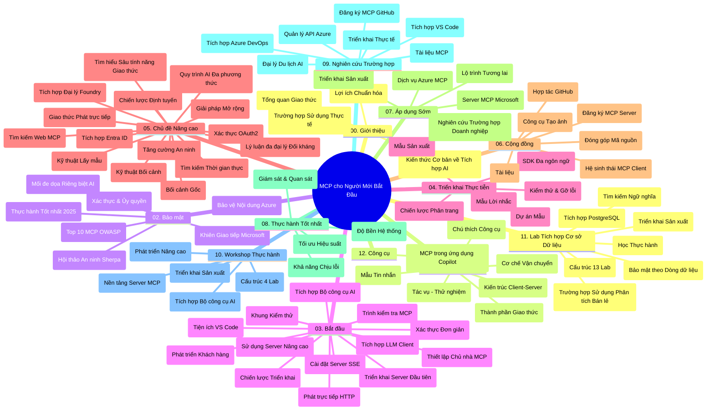

# Giao thức Ngữ cảnh Mô hình (MCP) cho Người mới bắt đầu - Hướng dẫn học tập

Hướng dẫn học tập này cung cấp tổng quan về cấu trúc và nội dung kho lưu trữ cho chương trình "Giao thức Ngữ cảnh Mô hình (MCP) cho Người mới bắt đầu". Sử dụng hướng dẫn này để điều hướng kho lưu trữ một cách hiệu quả và tận dụng tối đa các tài nguyên có sẵn.

## Tổng quan kho lưu trữ

Giao thức Ngữ cảnh Mô hình (MCP) là một khuôn khổ chuẩn hóa cho các tương tác giữa các mô hình AI và ứng dụng khách. Ban đầu được tạo bởi Anthropic, MCP hiện được duy trì bởi cộng đồng MCP rộng lớn hơn thông qua tổ chức GitHub chính thức. Kho lưu trữ này cung cấp một chương trình học toàn diện với các ví dụ mã thực hành bằng C#, Java, JavaScript, Python và TypeScript, được thiết kế cho các nhà phát triển AI, kiến trúc sư hệ thống và kỹ sư phần mềm.

## Bản đồ Chương trình học trực quan

## Cấu trúc kho lưu trữ

Kho lưu trữ được tổ chức thành mười hai phần chính, mỗi phần tập trung vào các khía cạnh khác nhau của MCP:

1. **Giới thiệu (00-Introduction/)**
   - Tổng quan về Giao thức Ngữ cảnh Mô hình
   - Tại sao chuẩn hóa lại quan trọng trong quy trình AI
   - Các trường hợp sử dụng thực tế và lợi ích

2. **Các Khái niệm Cốt lõi (01-CoreConcepts/)**
   - Kiến trúc máy khách-máy chủ
   - Các thành phần chính của giao thức
   - Các mẫu nhắn tin trong MCP

3. **Bảo mật (02-Security/)**
   - Các mối đe dọa bảo mật trong hệ thống dựa trên MCP
   - Thực tiễn tốt nhất để bảo vệ triển khai
   - Chiến lược xác thực và phân quyền
   - **Tài liệu bảo mật toàn diện**:
     - Thực tiễn bảo mật MCP 2025
     - Hướng dẫn triển khai Azure Content Safety
     - Kiểm soát và kỹ thuật bảo mật MCP
     - Tham khảo nhanh các thực tiễn tốt nhất MCP
   - **Chủ đề bảo mật chính**:
     - Tấn công tiêm lệnh và đầu độc công cụ
     - Chiếm đoạt phiên và vấn đề đại diện nhầm lẫn
     - Lỗ hổng chuyển tiếp token
     - Quyền hạn quá mức và kiểm soát truy cập
     - An ninh chuỗi cung ứng cho các thành phần AI
     - Tích hợp Microsoft Prompt Shields

4. **Bắt đầu (03-GettingStarted/)**
   - Thiết lập và cấu hình môi trường
   - Tạo máy chủ MCP và máy khách cơ bản
   - Tích hợp với các ứng dụng hiện có
   - Bao gồm các phần:
     - Triển khai máy chủ đầu tiên
     - Phát triển máy khách
     - Tích hợp máy khách LLM
     - Tích hợp VS Code
     - Máy chủ Sự kiện Gửi từ Máy chủ (SSE)
     - Sử dụng máy chủ nâng cao
     - Streaming HTTP
     - Tích hợp Bộ công cụ AI
     - Chiến lược kiểm thử
     - Hướng dẫn triển khai

5. **Triển khai Thực tế (04-PracticalImplementation/)**
   - Sử dụng SDK trên các ngôn ngữ lập trình khác nhau
   - Kỹ thuật gỡ lỗi, kiểm thử và xác thực
   - Tạo mẫu nhắc lệnh và quy trình làm việc tái sử dụng
   - Dự án mẫu với ví dụ triển khai

6. **Chủ đề Nâng cao (05-AdvancedTopics/)**
   - Kỹ thuật kỹ sư ngữ cảnh
   - Tích hợp đại lý Foundry
   - Quy trình làm việc AI đa phương thức
   - Demo xác thực OAuth2
   - Khả năng tìm kiếm thời gian thực
   - Streaming thời gian thực
   - Triển khai ngữ cảnh gốc
   - Chiến lược định tuyến
   - Kỹ thuật lấy mẫu
   - Phương pháp mở rộng
   - Cân nhắc về bảo mật
   - Tích hợp bảo mật Entra ID
   - Tích hợp tìm kiếm web
   - Lý luận đa đại lý đối kháng (mô hình tranh luận)

7. **Đóng góp Cộng đồng (06-CommunityContributions/)**
   - Cách đóng góp mã và tài liệu
   - Hợp tác qua GitHub
   - Nâng cấp và phản hồi do cộng đồng tạo ra
   - Sử dụng các máy khách MCP khác nhau (Claude Desktop, Cline, VSCode)
   - Làm việc với máy chủ MCP phổ biến bao gồm tạo ảnh

8. **Bài học từ Việc áp dụng sớm (07-LessonsfromEarlyAdoption/)**
   - Triển khai thực tế và câu chuyện thành công
   - Xây dựng và triển khai giải pháp dựa trên MCP
   - Xu hướng và lộ trình tương lai
   - **Hướng dẫn Máy chủ MCP của Microsoft**: Hướng dẫn toàn diện về 10 máy chủ MCP Microsoft sẵn sàng sản xuất bao gồm:
     - Microsoft Learn Docs MCP Server
     - Azure MCP Server (15+ kết nối chuyên biệt)
     - GitHub MCP Server
     - Azure DevOps MCP Server
     - MarkItDown MCP Server
     - SQL Server MCP Server
     - Playwright MCP Server
     - Dev Box MCP Server
     - Microsoft Foundry MCP Server
     - Bộ công cụ tác vụ Microsoft 365 MCP Server

9. **Thực tiễn Tốt nhất (08-BestPractices/)**
   - Tối ưu hóa và tinh chỉnh hiệu suất
   - Thiết kế hệ thống MCP chịu lỗi
   - Chiến lược kiểm thử và khả năng phục hồi

10. **Nghiên cứu Trường hợp (09-CaseStudy/)**
    - **Bảy nghiên cứu trường hợp toàn diện** thể hiện tính đa dụng của MCP qua các kịch bản đa dạng:
    - **Đại lý du lịch AI Azure**: Điều phối đa đại lý với Azure OpenAI và AI Search
    - **Tích hợp Azure DevOps**: Tự động hóa quy trình làm việc với cập nhật dữ liệu YouTube
    - **Truy xuất tài liệu thời gian thực**: Máy khách console Python với streaming HTTP
    - **Trình tạo kế hoạch học tập tương tác**: Ứng dụng web Chainlit với AI hội thoại
    - **Tài liệu trong trình chỉnh sửa**: Tích hợp VS Code với quy trình GitHub Copilot
    - **Quản lý API Azure**: Tích hợp API doanh nghiệp với tạo máy chủ MCP
    - **Đăng ký MCP GitHub**: Phát triển hệ sinh thái và nền tảng tích hợp tác vụ đại lý
    - Ví dụ triển khai bao phủ tích hợp doanh nghiệp, năng suất nhà phát triển và phát triển hệ sinh thái

11. **Hội thảo Thực hành (10-StreamliningAIWorkflowsBuildingAnMCPServerWithAIToolkit/)**
    - Hội thảo thực hành toàn diện kết hợp MCP với Bộ công cụ AI
    - Xây dựng các ứng dụng thông minh kết nối mô hình AI với công cụ thực tế
    - Các mô-đun thực tiễn bao gồm cơ bản, phát triển máy chủ tùy chỉnh và chiến lược triển khai sản xuất
    - **Cấu trúc phòng thí nghiệm**:
      - Phòng thí nghiệm 1: Cơ sở Máy chủ MCP
      - Phòng thí nghiệm 2: Phát triển Máy chủ MCP nâng cao
      - Phòng thí nghiệm 3: Tích hợp Bộ công cụ AI
      - Phòng thí nghiệm 4: Triển khai sản xuất và mở rộng quy mô
    - Phương pháp học dựa trên phòng thí nghiệm với hướng dẫn từng bước

12. **Phòng thí nghiệm Tích hợp Cơ sở dữ liệu Máy chủ MCP (11-MCPServerHandsOnLabs/)**
    - **Lộ trình học 13 phòng thí nghiệm toàn diện** xây dựng máy chủ MCP sẵn sàng sản xuất tích hợp PostgreSQL
    - **Triển khai phân tích bán lẻ thực tế** sử dụng trường hợp Zava Retail
    - **Mẫu doanh nghiệp tiêu chuẩn** bao gồm Bảo mật Cấp độ Hàng (RLS), tìm kiếm ngữ nghĩa và truy cập dữ liệu đa người thuê
    - **Cấu trúc phòng thí nghiệm hoàn chỉnh**:
      - **Phòng thí nghiệm 00-03: Nền tảng** - Giới thiệu, Kiến trúc, Bảo mật, Thiết lập môi trường
      - **Phòng thí nghiệm 04-06: Xây dựng Máy chủ MCP** - Thiết kế cơ sở dữ liệu, Triển khai máy chủ MCP, Phát triển công cụ
      - **Phòng thí nghiệm 07-09: Tính năng Nâng cao** - Tìm kiếm ngữ nghĩa, Kiểm thử & gỡ lỗi, Tích hợp VS Code
      - **Phòng thí nghiệm 10-12: Sản xuất & Thực tiễn Tốt nhất** - Triển khai, Giám sát, Tối ưu hóa
    - **Công nghệ sử dụng**: Framework FastMCP, PostgreSQL, Azure OpenAI, Azure Container Apps, Application Insights
    - **Kết quả học tập**: Máy chủ MCP sẵn sàng sản xuất, mẫu tích hợp cơ sở dữ liệu, phân tích AI hỗ trợ, bảo mật doanh nghiệp

13. **Công cụ (12-tooling/)**
    - Học cách sử dụng MCP trong ứng dụng Copilot và các công cụ khác

## Tài nguyên bổ sung

Kho lưu trữ bao gồm các tài nguyên hỗ trợ:

- **Thư mục hình ảnh**: Chứa sơ đồ và minh họa được sử dụng trong suốt chương trình học
- **Bản dịch**: Hỗ trợ đa ngôn ngữ với bản dịch tự động tài liệu
- **Tài nguyên chính thức MCP**:
  - [Tài liệu MCP](https://modelcontextprotocol.io/)
  - [Đặc tả MCP](https://spec.modelcontextprotocol.io/)
  - [Kho lưu trữ GitHub MCP](https://github.com/modelcontextprotocol)

## Cách sử dụng Kho lưu trữ này

1. **Học tuần tự**: Theo dõi các chương theo thứ tự (00 đến 11) để trải nghiệm học có cấu trúc.
2. **Tập trung theo ngôn ngữ**: Nếu bạn quan tâm đến một ngôn ngữ lập trình cụ thể, hãy khám phá thư mục mẫu cho các triển khai ngôn ngữ bạn ưa thích.
3. **Triển khai thực tế**: Bắt đầu với phần "Bắt đầu" để thiết lập môi trường và tạo máy chủ MCP cùng máy khách đầu tiên.
4. **Khám phá nâng cao**: Khi đã nắm vững nền tảng, hãy đi sâu vào các chủ đề nâng cao để mở rộng kiến thức.
5. **Tham gia cộng đồng**: Tham gia cộng đồng MCP qua các cuộc thảo luận GitHub và kênh Discord để kết nối với các chuyên gia và nhà phát triển đồng nghiệp.

## Máy khách và Công cụ MCP

Chương trình học bao gồm các máy khách và công cụ MCP khác nhau:

1. **Máy khách chính thức**:
   - Visual Studio Code
   - MCP trong Visual Studio Code
   - Claude Desktop
   - Claude trong VSCode
   - Claude API

2. **Máy khách cộng đồng**:
   - Cline (dựa trên terminal)
   - Cursor (trình chỉnh sửa mã)
   - ChatMCP
   - Windsurf

3. **Công cụ quản lý MCP**:
   - MCP CLI
   - MCP Manager
   - MCP Linker
   - MCP Router

## Các máy chủ MCP phổ biến

Kho lưu trữ giới thiệu nhiều máy chủ MCP, bao gồm:

1. **Máy chủ MCP Microsoft chính thức**:
   - Microsoft Learn Docs MCP Server
   - Azure MCP Server (15+ kết nối chuyên biệt)
   - GitHub MCP Server
   - Azure DevOps MCP Server
   - MarkItDown MCP Server
   - SQL Server MCP Server
   - Playwright MCP Server
   - Dev Box MCP Server
   - Microsoft Foundry MCP Server
   - Bộ công cụ tác vụ Microsoft 365 MCP Server

2. **Máy chủ tham chiếu chính thức**:
   - Filesystem
   - Fetch
   - Memory
   - Sequential Thinking

3. **Tạo hình ảnh**:
   - Azure OpenAI DALL-E 3
   - Stable Diffusion WebUI
   - Replicate

4. **Công cụ phát triển**:
   - Git MCP
   - Terminal Control
   - Code Assistant

5. **Máy chủ chuyên biệt**:
   - Salesforce
   - Microsoft Teams
   - Jira & Confluence

## Đóng góp

Kho lưu trữ này hoan nghênh các đóng góp từ cộng đồng. Xem phần Đóng góp Cộng đồng để biết hướng dẫn cách đóng góp hiệu quả cho hệ sinh thái MCP.

----

*Hướng dẫn học tập này được cập nhật lần cuối vào ngày 5 tháng 2 năm 2026, phản ánh đặc tả MCP mới nhất 2025-11-25 và cung cấp tổng quan về kho lưu trữ tính đến ngày đó. Nội dung kho lưu trữ có thể được cập nhật sau ngày này.*

---

<!-- CO-OP TRANSLATOR DISCLAIMER START -->
**Tuyên bố miễn trừ trách nhiệm**:
Tài liệu này đã được dịch bằng dịch vụ dịch thuật AI [Co-op Translator](https://github.com/Azure/co-op-translator). Mặc dù chúng tôi cố gắng đảm bảo độ chính xác, xin lưu ý rằng bản dịch tự động có thể chứa lỗi hoặc sai sót. Tài liệu gốc bằng ngôn ngữ gốc nên được coi là nguồn tin chính thức. Đối với thông tin quan trọng, nên sử dụng dịch vụ dịch thuật chuyên nghiệp bởi con người. Chúng tôi không chịu trách nhiệm về bất kỳ hiểu lầm hoặc giải thích sai nào phát sinh từ việc sử dụng bản dịch này.
<!-- CO-OP TRANSLATOR DISCLAIMER END -->