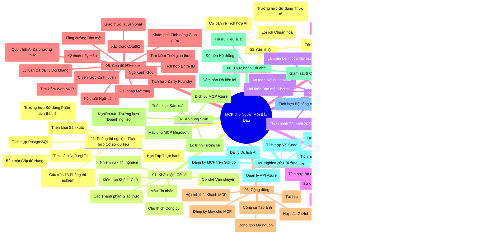

# Giao Thức Ngữ Cảnh Mô Hình (MCP) cho Người Mới Bắt Đầu - Hướng Dẫn Học Tập

Hướng dẫn học tập này cung cấp tổng quan về cấu trúc và nội dung kho lưu trữ cho chương trình "Giao Thức Ngữ Cảnh Mô Hình (MCP) cho Người Mới Bắt Đầu". Sử dụng hướng dẫn này để điều hướng kho lưu trữ một cách hiệu quả và tận dụng tối đa các tài nguyên sẵn có.

## Tổng Quan Kho Lưu Trữ

Giao Thức Ngữ Cảnh Mô Hình (MCP) là một khuôn khổ chuẩn hóa cho các tương tác giữa mô hình AI và ứng dụng khách. Ban đầu được tạo bởi Anthropic, MCP hiện do cộng đồng MCP rộng lớn hơn duy trì thông qua tổ chức GitHub chính thức. Kho lưu trữ này cung cấp chương trình giảng dạy toàn diện với các ví dụ mã thực hành bằng C#, Java, JavaScript, Python và TypeScript, được thiết kế cho các nhà phát triển AI, kiến trúc sư hệ thống và kỹ sư phần mềm.

## Bản Đồ Chương Trình Trực Quan

## Cấu Trúc Kho Lưu Trữ

Kho lưu trữ được tổ chức thành mười một phần chính, mỗi phần tập trung vào các khía cạnh khác nhau của MCP:

1. **Giới thiệu (00-Introduction/)**
   - Tổng quan về Giao Thức Ngữ Cảnh Mô Hình
   - Tại sao chuẩn hóa lại quan trọng trong pipeline AI
   - Các trường hợp sử dụng thực tiễn và lợi ích

2. **Khái Niệm Cốt Lõi (01-CoreConcepts/)**
   - Kiến trúc khách-chủ
   - Thành phần chính của giao thức
   - Các mô hình gửi tin nhắn trong MCP

3. **Bảo Mật (02-Security/)**
   - Các mối đe dọa bảo mật trong hệ thống dựa trên MCP
   - Thực hành tốt nhất để bảo mật triển khai
   - Chiến lược xác thực và ủy quyền
   - **Tài liệu Bảo Mật Toàn Diện**:
     - Thực hành tốt nhất về bảo mật MCP 2025
     - Hướng dẫn triển khai Azure Content Safety
     - Kiểm soát và kỹ thuật bảo mật MCP
     - Tham chiếu nhanh Thực hành tốt nhất MCP
   - **Chủ đề Bảo Mật Chính**:
     - Tấn công tiêm lệnh và đầu độc công cụ
     - Chiếm quyền phiên làm việc và vấn đề confused deputy
     - Lỗ hổng chuyển tiếp token
     - Quyền truy cập quá mức và kiểm soát truy cập
     - Bảo mật chuỗi cung ứng cho các thành phần AI
     - Tích hợp Microsoft Prompt Shields

4. **Bắt Đầu (03-GettingStarted/)**
   - Thiết lập môi trường và cấu hình
   - Tạo máy chủ và khách MCP cơ bản
   - Tích hợp với ứng dụng hiện có
   - Bao gồm các phần:
     - Triển khai máy chủ đầu tiên
     - Phát triển khách
     - Tích hợp khách LLM
     - Tích hợp VS Code
     - Máy chủ Sự kiện Phát trực tiếp (SSE)
     - Sử dụng máy chủ nâng cao
     - Streaming HTTP
     - Tích hợp AI Toolkit
     - Chiến lược kiểm thử
     - Hướng dẫn triển khai

5. **Triển Khai Thực Tiễn (04-PracticalImplementation/)**
   - Sử dụng SDK trên các ngôn ngữ lập trình khác nhau
   - Kỹ thuật gỡ lỗi, kiểm thử và xác thực
   - Tạo mẫu prompt và workflow tái sử dụng
   - Các dự án mẫu với ví dụ triển khai

6. **Chủ Đề Nâng Cao (05-AdvancedTopics/)**
   - Kỹ thuật kỹ thuật ngữ cảnh
   - Tích hợp agent Foundry
   - Quy trình làm việc AI đa phương thức
   - Demo xác thực OAuth2
   - Khả năng tìm kiếm thời gian thực
   - Streaming thời gian thực
   - Triển khai root contexts
   - Chiến lược định tuyến
   - Kỹ thuật sampling
   - Phương pháp mở rộng
   - Các cân nhắc bảo mật
   - Tích hợp bảo mật Entra ID
   - Tích hợp tìm kiếm web
   - Lý luận đa tác nhân đối kháng (mẫu tranh luận)

7. **Đóng Góp Cộng Đồng (06-CommunityContributions/)**
   - Cách đóng góp mã và tài liệu
   - Hợp tác qua GitHub
   - Nâng cao và phản hồi do cộng đồng điều phối
   - Sử dụng các khách MCP khác nhau (Claude Desktop, Cline, VSCode)
   - Làm việc với các máy chủ MCP phổ biến bao gồm tạo ảnh

8. **Bài Học Từ Giai Đoạn Áp Dụng Sớm (07-LessonsfromEarlyAdoption/)**
   - Triển khai thực tế và câu chuyện thành công
   - Xây dựng và triển khai giải pháp dựa trên MCP
   - Xu hướng và lộ trình tương lai
   - **Hướng Dẫn Máy Chủ MCP Microsoft**: Hướng dẫn toàn diện 10 máy chủ MCP Microsoft sẵn sàng sản xuất bao gồm:
     - Máy chủ Microsoft Learn Docs MCP
     - Máy chủ Azure MCP (15+ kết nối chuyên biệt)
     - Máy chủ GitHub MCP
     - Máy chủ Azure DevOps MCP
     - Máy chủ MarkItDown MCP
     - Máy chủ SQL Server MCP
     - Máy chủ Playwright MCP
     - Máy chủ Dev Box MCP
     - Máy chủ Microsoft Foundry MCP
     - Máy chủ Microsoft 365 Agents Toolkit MCP

9. **Thực Hành Tốt Nhất (08-BestPractices/)**
   - Tinh chỉnh hiệu suất và tối ưu hóa
   - Thiết kế hệ thống MCP chịu lỗi
   - Chiến lược kiểm thử và độ bền

10. **Nghiên Cứu Tình Huống (09-CaseStudy/)**
    - **Bảy nghiên cứu tình huống toàn diện** minh họa sự đa năng của MCP trên các kịch bản đa dạng:
    - **Azure AI Travel Agents**: Điều phối đa tác nhân với Azure OpenAI và AI Search
    - **Tích hợp Azure DevOps**: Tự động hóa quy trình làm việc với cập nhật dữ liệu YouTube
    - **Truy xuất tài liệu thời gian thực**: Khách Python console với streaming HTTP
    - **Trình tạo kế hoạch học tập tương tác**: Ứng dụng web Chainlit với AI hội thoại
    - **Tài liệu trong trình soạn thảo**: Tích hợp VS Code với workflow GitHub Copilot
    - **Quản lý API Azure**: Tích hợp API doanh nghiệp với tạo máy chủ MCP
    - **GitHub MCP Registry**: Nền tảng phát triển hệ sinh thái và tích hợp agent
    - Ví dụ triển khai bao quát tích hợp doanh nghiệp, năng suất nhà phát triển và phát triển hệ sinh thái

11. **Workshop Thực Hành (10-StreamliningAIWorkflowsBuildingAnMCPServerWithAIToolkit/)**
    - Workshop thực hành toàn diện kết hợp MCP với AI Toolkit
    - Xây dựng ứng dụng thông minh kết nối mô hình AI với công cụ thực tế
    - Các module thực hành bao gồm nền tảng, phát triển máy chủ tùy chỉnh và chiến lược triển khai sản xuất
    - **Cấu trúc Lab**:
      - Lab 1: Nền tảng Máy chủ MCP
      - Lab 2: Phát triển Máy chủ MCP Nâng cao
      - Lab 3: Tích hợp AI Toolkit
      - Lab 4: Triển khai và mở rộng sản xuất
    - Phương pháp học dựa trên lab với hướng dẫn từng bước

12. **Lab Tích Hợp Cơ Sở Dữ Liệu Máy Chủ MCP (11-MCPServerHandsOnLabs/)**
    - **Hành trình học 13 lab toàn diện** xây dựng máy chủ MCP sản xuất sẵn với tích hợp PostgreSQL
    - **Triển khai phân tích bán lẻ thực tiễn** với trường hợp sử dụng Zava Retail
    - **Mẫu hình doanh nghiệp** bao gồm Row Level Security (RLS), tìm kiếm ngữ nghĩa, truy cập đa khách hàng
    - **Cấu trúc Lab Hoàn chỉnh**:
      - **Labs 00-03: Nền tảng** - Giới thiệu, Kiến trúc, Bảo mật, Thiết lập môi trường
      - **Labs 04-06: Xây dựng Máy chủ MCP** - Thiết kế cơ sở dữ liệu, Triển khai Máy chủ MCP, Phát triển công cụ
      - **Labs 07-09: Tính năng Nâng cao** - Tìm kiếm ngữ nghĩa, Kiểm thử & Gỡ lỗi, Tích hợp VS Code
      - **Labs 10-12: Sản xuất & Thực hành Tốt nhất** - Triển khai, Giám sát, Tối ưu hóa
    - **Công nghệ Bao phủ**: Framework FastMCP, PostgreSQL, Azure OpenAI, Azure Container Apps, Application Insights
    - **Kết quả học tập**: Máy chủ MCP sẵn sàng sản xuất, mẫu tích hợp cơ sở dữ liệu, phân tích AI, bảo mật doanh nghiệp

## Tài Nguyên Bổ Sung

Kho lưu trữ bao gồm các tài nguyên hỗ trợ:

- **Thư mục Hình ảnh**: Chứa sơ đồ và hình minh họa được sử dụng trong toàn bộ chương trình
- **Bản dịch**: Hỗ trợ đa ngôn ngữ với bản dịch tự động tài liệu
- **Tài nguyên MCP Chính thức**:
  - [Tài liệu MCP](https://modelcontextprotocol.io/)
  - [Đặc tả MCP](https://spec.modelcontextprotocol.io/)
  - [Kho MCP trên GitHub](https://github.com/modelcontextprotocol)

## Cách Sử Dụng Kho Lưu Trữ Này

1. **Học theo tuần tự**: Theo dõi các chương từ 00 đến 11 để có trải nghiệm học bài bản.
2. **Tập trung theo ngôn ngữ**: Nếu bạn quan tâm đến ngôn ngữ lập trình cụ thể, khám phá thư mục mẫu cho các triển khai bằng ngôn ngữ bạn chọn.
3. **Triển khai thực tế**: Bắt đầu với phần "Bắt Đầu" để thiết lập môi trường và tạo máy chủ cùng khách MCP đầu tiên.
4. **Khám phá nâng cao**: Khi đã quen với các kiến thức cơ bản, mở rộng sang các chủ đề nâng cao.
5. **Tham gia cộng đồng**: Tham gia cộng đồng MCP qua các cuộc thảo luận trên GitHub và kênh Discord để kết nối với chuyên gia và những nhà phát triển khác.

## Các Khách MCP và Công Cụ

Chương trình bao gồm nhiều khách MCP và công cụ:

1. **Khách Chính Thức**:
   - Visual Studio Code 
   - MCP trong Visual Studio Code
   - Claude Desktop
   - Claude trong VSCode 
   - Claude API

2. **Khách Cộng Đồng**:
   - Cline (dựa trên terminal)
   - Cursor (trình soạn thảo mã)
   - ChatMCP
   - Windsurf

3. **Công Cụ Quản Lý MCP**:
   - MCP CLI
   - MCP Manager
   - MCP Linker
   - MCP Router

## Các Máy Chủ MCP Phổ Biến

Kho lưu trữ giới thiệu nhiều máy chủ MCP, bao gồm:

1. **Máy Chủ MCP Microsoft Chính Thức**:
   - Máy chủ Microsoft Learn Docs MCP
   - Máy chủ Azure MCP (15+ kết nối chuyên biệt)
   - Máy chủ GitHub MCP
   - Máy chủ Azure DevOps MCP
   - Máy chủ MarkItDown MCP
   - Máy chủ SQL Server MCP
   - Máy chủ Playwright MCP
   - Máy chủ Dev Box MCP
   - Máy chủ Microsoft Foundry MCP
   - Máy chủ Microsoft 365 Agents Toolkit MCP

2. **Máy Chủ Tham Chiếu Chính Thức**:
   - Filesystem
   - Fetch
   - Memory
   - Sequential Thinking

3. **Tạo Ảnh**:
   - Azure OpenAI DALL-E 3
   - Stable Diffusion WebUI
   - Replicate

4. **Công Cụ Phát Triển**:
   - Git MCP
   - Terminal Control
   - Code Assistant

5. **Máy Chủ Chuyên Biệt**:
   - Salesforce
   - Microsoft Teams
   - Jira & Confluence

## Đóng Góp

Kho lưu trữ này hoan nghênh các đóng góp từ cộng đồng. Xem phần Đóng Góp Cộng Đồng để biết hướng dẫn cách đóng góp hiệu quả cho hệ sinh thái MCP.

----

*Hướng dẫn học tập này được cập nhật lần cuối vào ngày 5 tháng 2 năm 2026, phản ánh Đặc tả MCP mới nhất 2025-11-25 và cung cấp tổng quan về kho lưu trữ tính đến ngày đó. Nội dung kho lưu trữ có thể được cập nhật sau ngày này.*

---

<!-- CO-OP TRANSLATOR DISCLAIMER START -->
**Tuyên bố miễn trừ trách nhiệm**:
Tài liệu này đã được dịch bằng dịch vụ dịch thuật AI [Co-op Translator](https://github.com/Azure/co-op-translator). Mặc dù chúng tôi cố gắng đảm bảo độ chính xác, xin lưu ý rằng bản dịch tự động có thể chứa lỗi hoặc sai sót. Tài liệu gốc bằng ngôn ngữ gốc nên được coi là nguồn tin chính thức. Đối với thông tin quan trọng, nên sử dụng dịch vụ dịch thuật chuyên nghiệp bởi con người. Chúng tôi không chịu trách nhiệm về bất kỳ hiểu lầm hoặc giải thích sai nào phát sinh từ việc sử dụng bản dịch này.
<!-- CO-OP TRANSLATOR DISCLAIMER END -->