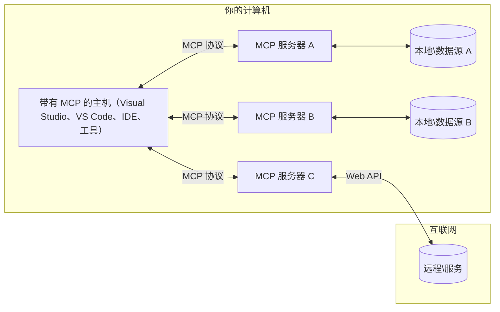

# MCP 核心概念：掌握 AI 集成的模型上下文协议

[](https://youtu.be/earDzWGtE84)

_(点击上方图片观看本课视频)_

[模型上下文协议（Model Context Protocol, MCP）](https://github.com/modelcontextprotocol) 是一个强大且标准化的框架，用于优化大型语言模型（LLM）与外部工具、应用和数据源之间的通信。  
本指南将带您了解 MCP 的核心概念。您将学习其客户端-服务器架构、重要组件、通信机制及实现最佳实践。

- **显式用户同意**：所有数据访问和操作必须在执行前获得用户明确批准。用户必须清晰了解将访问哪些数据，执行哪些操作，并具备权限和授权的细粒度控制。

- **数据隐私保护**：仅在用户明确同意下暴露用户数据，并且在整个交互生命周期内必须通过强健的访问控制保护数据。实现必须防止未经授权的数据传输，维护严格隐私边界。

- **工具执行安全**：每次工具调用都需获得用户明确同意，用户应清楚理解工具功能、参数及潜在影响。强健的安全边界防止意外、不安全或恶意的工具执行。

- **传输层安全**：所有通信通道应使用合适的加密和身份验证机制。远程连接应实现安全传输协议和恰当的凭据管理。

#### 实现指南：

- **权限管理**：实施细粒度权限系统，允许用户控制可访问的服务器、工具和资源  
- **身份认证与授权**：使用安全身份认证方法（OAuth、API 密钥），配合恰当的令牌管理和过期策略  
- **输入验证**：根据定义的模式验证所有参数和数据输入，防止注入攻击  
- **审计日志**：维护全面的操作日志以支持安全监控和合规性

## 概述

本课将探讨构成模型上下文协议（MCP）生态系统的基础架构和组件。您将了解 MCP 的客户端-服务器架构、关键组件及其驱动 MCP 交互的通信机制。

## 主要学习目标

完成本课后，您将：

- 理解 MCP 的客户端-服务器架构。  
- 明确 Hosts、Clients 和 Servers 的角色与职责。  
- 分析使 MCP 成为灵活集成层的核心特性。  
- 学习 MCP 生态中信息的流动方式。  
- 通过 .NET、Java、Python 和 JavaScript 代码示例获得实用见解。

## MCP 架构：深入解析

MCP 生态系统基于客户端-服务器模型构建。该模块化结构允许 AI 应用高效地与工具、数据库、API 和上下文资源交互。下面将拆解此架构的核心组件。

MCP 核心架构遵循客户端-服务器模型，主机应用可以连接多个服务器：


- **MCP 主机（Hosts）**：如 VSCode、Claude Desktop、IDE 或希望通过 MCP 访问数据的 AI 工具  
- **MCP 客户端（Clients）**：协议客户端，维护与服务器的一对一连接  
- **MCP 服务器（Servers）**：轻量程序，通过标准化模型上下文协议暴露特定能力  
- **本地数据源**：您的计算机文件、数据库及 MCP 服务器可安全访问的服务  
- **远程服务**：通过互联网访问、MCP 服务器可通过 API 连接的外部系统  

MCP 协议是一个不断发展的标准，使用基于日期的版本管理（YYYY-MM-DD 格式）。当前协议版本为 **2025-11-25**。您可查阅最新更新的[协议规范](https://modelcontextprotocol.io/specification/2025-11-25/)。

### 1. 主机（Hosts）

在模型上下文协议（MCP）中，**主机**是 AI 应用，它们作为用户与协议交互的主要界面。主机负责协调和管理与多个 MCP 服务器的连接，为每个服务器连接创建专用 MCP 客户端。主机示例包括：

- **AI 应用**：Claude Desktop、Visual Studio Code、Claude Code  
- **开发环境**：集成 MCP 的 IDE 和代码编辑器  
- **定制应用**：专用的 AI 代理和工具  

**主机**是协调 AI 模型交互的应用，它们：

- **编排 AI 模型**：执行或交互大型语言模型以生成响应和协调 AI 工作流程  
- **管理客户端连接**：为每个 MCP 服务器连接创建和维护一个 MCP 客户端  
- **控制用户界面**：处理对话流程、用户交互和响应呈现  
- **实施安全策略**：管理权限、安全约束和身份验证  
- **处理用户同意**：管理用户对数据共享和工具执行的审批  

### 2. 客户端（Clients）

**客户端**是维持主机与 MCP 服务器之间专用一对一连接的重要组件。每个 MCP 客户端由主机实例化，用于连接特定 MCP 服务器，确保通信渠道的组织性和安全性。多个客户端允许主机同时连接多个服务器。

**客户端**是主机应用内部的连接组件，它们：

- **协议通信**：以 JSON-RPC 2.0 格式向服务器发送带有提示和指令的请求  
- **能力协商**：初始化时与服务器协商支持的功能和协议版本  
- **工具执行**：管理模型的工具执行请求并处理响应  
- **实时更新**：处理来自服务器的通知和实时更新  
- **响应处理**：处理并格式化服务器响应，供用户展示  

### 3. 服务器（Servers）

**服务器**是向 MCP 客户端提供上下文、工具和能力的程序。它们可以本地运行（与主机同一台机器）或远程运行（外部平台），负责处理客户端请求并提供结构化响应。服务器通过标准化的模型上下文协议暴露特定功能。

**服务器**是提供上下文和能力的服务，它们：

- **功能注册**：注册并向客户端暴露可用原语（资源、提示、工具）  
- **请求处理**：接收并执行客户端的工具调用、资源请求和提示请求  
- **上下文提供**：提供上下文信息和数据，增强模型响应  
- **状态管理**：维护会话状态，必要时处理有状态交互  
- **实时通知**：向连接的客户端发送能力变更和更新通知  

任何人都可开发服务器，用专门功能扩展模型能力，且支持本地与远程部署场景。

### 4. 服务器原语（Server Primitives）

模型上下文协议（MCP）中的服务器提供三种核心**原语**，定义客户端、主机和语言模型之间丰富交互的基础构建块。这些原语指定协议中可用的上下文信息类型和操作。

MCP 服务器可以暴露以下三种核心原语的任意组合：

#### 资源（Resources）

**资源**是为 AI 应用提供上下文信息的数据源。它们代表可增强模型理解和决策的静态或动态内容：

- **上下文数据**：供 AI 模型使用的结构化信息和上下文  
- **知识库**：文档库、文章、手册和研究论文  
- **本地数据源**：文件、数据库及本地系统信息  
- **外部数据**：API 响应、网络服务和远程系统数据  
- **动态内容**：基于外部条件实时更新的数据  

资源通过 URI 标识，并支持通过 `resources/list` 发现和通过 `resources/read` 访问：

```text
file://documents/project-spec.md
database://production/users/schema
api://weather/current
```
  
#### 提示（Prompts）

**提示**是帮助结构化与语言模型交互的可复用模板。它们提供标准化的交互模式和模板化工作流程：

- **基于模板的交互**：预结构化的消息和对话启动提示  
- **工作流模板**：针对常见任务和交互的标准化序列   
- **少量示例**：基于示例的模型指令模板  
- **系统提示**：定义模型行为和上下文的基础提示  
- **动态模板**：可参参数化、适应特定上下文的提示  

提示支持变量替换，可通过 `prompts/list` 发现，利用 `prompts/get` 获取：

```markdown
Generate a {{task_type}} for {{product}} targeting {{audience}} with the following requirements: {{requirements}}
```
  
#### 工具（Tools）

**工具**是 AI 模型可调用以执行特定动作的可执行函数。它们是 MCP 生态的“动词”，使模型能够与外部系统交互：

- **可执行函数**：模型可调用的、带有具体参数的离散操作  
- **外部系统集成**：API 调用、数据库查询、文件操作和计算  
- **唯一身份**：每个工具有独特名称、描述和参数模式  
- **结构化输入输出**：工具接受验证参数并返回结构化、类型化的响应  
- **操作能力**：使模型能执行真实世界操作并检索实时数据  

工具通过 JSON Schema 定义参数验证，支持通过 `tools/list` 发现，利用 `tools/call` 执行。工具还可包含用于更佳 UI 展示的**图标**元数据。

**工具注解**：工具支持行为注解（如 `readOnlyHint`、`destructiveHint`），说明工具是否只读或具破坏性，帮助客户端做出执行决策。

示例工具定义：

```typescript
server.tool(
  "search_products", 
  {
    query: z.string().describe("Search query for products"),
    category: z.string().optional().describe("Product category filter"),
    max_results: z.number().default(10).describe("Maximum results to return")
  }, 
  async (params) => {
    // 执行搜索并返回结构化结果
    return await productService.search(params);
  }
);
```
  
## 客户端原语（Client Primitives）

在模型上下文协议（MCP）中，**客户端**可以暴露原语，使服务器能够请求主机应用的额外能力。客户端原语支持更丰富、更交互性的服务器实现，可以访问 AI 模型能力和用户交互。

### 采样（Sampling）

**采样**允许服务器请求来自客户端 AI 应用的语言模型补全。此原语使服务器能够在不嵌入自身模型依赖的情况下访问 LLM 能力：

- **模型无关访问**：服务器请求补全无须包含 LLM SDK 或管理模型访问  
- **服务器发起 AI**：使服务器能自主使用客户端的 AI 模型生成内容  
- **递归 LLM 交互**：支持服务器需要 AI 协助处理的复杂场景  
- **动态内容生成**：允许服务器利用主机模型创建上下文响应  
- **工具调用支持**：服务器请求可包含 `tools` 和 `toolChoice` 参数，使客户端模型在采样中调用工具  

采样通过 `sampling/complete` 方法启动，服务器向客户端发送补全请求。

### 根路径（Roots）

**根路径**为客户端向服务器暴露文件系统边界提供标准方式，帮助服务器了解能访问哪些目录和文件：

- **文件系统边界**：定义服务器可操作的文件系统范围  
- **访问控制**：帮助服务器了解可访问的目录和文件权限  
- **动态更新**：客户端在根列表变化时通知服务器  
- **基于 URI 标识**：根路径使用 `file://` URI 标识可访问目录和文件  

根路径通过 `roots/list` 发现，客户端在根变更时发送 `notifications/roots/list_changed`。

### 诱导（Elicitation）  

**诱导**使服务器能通过客户端界面请求用户额外信息或确认：

- **用户输入请求**：服务器在执行工具时请求缺失信息  
- **确认对话**：请求用户批准敏感或重要操作  
- **交互式工作流**：支持服务器创建分步用户交互  
- **动态参数采集**：操作执行时收集遗漏或可选参数  

诱导请求通过 `elicitation/request` 方法实施，通过客户端界面收集用户输入。

**URL 模式诱导**：服务器还可请求基于 URL 的用户交互，指引用户访问外部网页以完成认证、确认或数据录入。

### 日志（Logging）

**日志**允许服务器向客户端发送结构化日志消息，以支持调试、监控和运行可见性：

- **调试支持**：使服务器能提供详细执行日志帮助排障  
- **运行监控**：发送状态更新和性能指标至客户端  
- **错误报告**：提供详细错误上下文和诊断信息  
- **审计追踪**：创建服务器操作和决策的完整日志  

日志消息发送给客户端，增强服务器操作透明度并便于调试。

## MCP 中的信息流

模型上下文协议（MCP）定义了主机、客户端、服务器与模型之间信息的结构化流动。理解此流程有助于阐明用户请求如何被处理，以及外部工具和数据如何整合进模型响应中。
- **主机发起连接**  
  主机应用程序（例如 IDE 或聊天界面）与 MCP 服务器建立连接，通常通过 STDIO、WebSocket 或其他支持的传输方式。

- **能力协商**  
  客户端（嵌入在主机中）和服务器交换它们支持的功能、工具、资源和协议版本信息。这确保双方了解会话可用的能力。

- **用户请求**  
  用户与主机交互（例如输入提示或命令）。主机收集此输入并将其传递给客户端进行处理。

- **资源或工具使用**  
  - 客户端可能请求服务器提供额外的上下文或资源（例如文件、数据库条目或知识库文章）以丰富模型的理解。  
  - 如果模型判断需要工具（例如获取数据、执行计算或调用 API），客户端将发送工具调用请求给服务器，指定工具名称和参数。

- **服务器执行**  
  服务器接收资源或工具请求，执行必要操作（例如运行函数、查询数据库或检索文件），并以结构化格式将结果返回给客户端。

- **响应生成**  
  客户端将服务器响应（资源数据、工具输出等）整合到正在进行的模型交互中。模型使用这些信息生成全面且上下文相关的响应。

- **结果展示**  
  主机从客户端接收最终输出并向用户展示，通常包括模型生成的文本及工具执行或资源查询的任何结果。

此流程使 MCP 能通过无缝连接模型与外部工具和数据源，支持先进的、交互式和上下文感知的 AI 应用。

## 协议架构与层次

MCP 由两个彼此协作的独立架构层组成，共同提供完整的通信框架：

### 数据层

**数据层** 基于 **JSON-RPC 2.0** 实现 MCP 协议的核心。该层定义消息结构、语义和交互模式：

#### 核心组件：

- **JSON-RPC 2.0 协议**：所有通信使用标准化的 JSON-RPC 2.0 消息格式进行方法调用、响应和通知  
- **生命周期管理**：处理客户端与服务器间的连接初始化、能力协商和会话终止  
- **服务器原语**：支持服务器通过工具、资源和提示提供核心功能  
- **客户端原语**：支持服务器请求大模型采样、用户输入诱导及日志消息发送  
- **实时通知**：支持异步通知实现动态更新，无需轮询

#### 关键特性：

- **协议版本协商**：采用基于日期的版本控制（YYYY-MM-DD）确保兼容性  
- **能力发现**：客户端与服务器在初始化期间交换支持的功能信息  
- **有状态会话**：维护多次交互的连接状态以保持上下文连续性

### 传输层

**传输层** 管理 MCP 参与者之间的通信通道、消息框架及认证：

#### 支持的传输机制：

1. **STDIO 传输**：  
   - 使用标准输入/输出流进行直接进程通信  
   - 适用于同一台机器上的本地进程，无网络开销  
   - 常用于本地 MCP 服务器实现  

2. **可流式 HTTP 传输**：  
   - 使用 HTTP POST 传递客户端到服务器的消息  
   - 可选的服务器发送事件（SSE）用于服务器到客户端的流式传输  
   - 支持跨网络的远程服务器通信  
   - 支持标准 HTTP 身份验证（承载令牌、API 密钥、自定义头）  
   - MCP 推荐使用 OAuth 进行安全的基于令牌认证

#### 传输抽象：

传输层将通信细节对数据层抽象化，使所有传输机制均采用相同的 JSON-RPC 2.0 消息格式。该抽象允许应用在本地与远程服务器之间无缝切换。

### 安全考虑

MCP 实现必须遵守若干关键安全原则，确保协议操作过程中的交互安全、可信：

- **用户同意与控制**：用户必须明确同意后，方可访问任何数据或执行操作。用户应对进行的数据共享及授权的操作有清晰的控制权，并通过直观的用户界面进行活动审批。

- **数据隐私**：用户数据仅在明确同意下暴露，须通过适当的访问控制保护。MCP 实现必须防止未经授权的数据传输，确保所有交互中的隐私得到维护。

- **工具安全**：调用任何工具前需明确用户同意。用户应清楚了解每个工具的功能，并执行严格的安全边界，防止误用或不安全的工具执行。

遵循这些安全原则，MCP 在保障用户信任、隐私与安全的前提下，实现强大的 AI 集成。

## 代码示例：关键组件

以下示例展示几种流行编程语言中 MCP 服务器关键组件及工具的实现示例。

### .NET 示例：创建带工具的简单 MCP 服务器

这是一个实用的 .NET 代码示例，演示如何实现带有自定义工具的简单 MCP 服务器。该示例展示了如何定义和注册工具，处理请求，以及使用模型上下文协议连接服务器。

```csharp
using System;
using System.Threading.Tasks;
using ModelContextProtocol.Server;
using ModelContextProtocol.Server.Transport;
using ModelContextProtocol.Server.Tools;

public class WeatherServer
{
    public static async Task Main(string[] args)
    {
        // Create an MCP server
        var server = new McpServer(
            name: "Weather MCP Server",
            version: "1.0.0"
        );
        
        // Register our custom weather tool
        server.AddTool<string, WeatherData>("weatherTool", 
            description: "Gets current weather for a location",
            execute: async (location) => {
                // Call weather API (simplified)
                var weatherData = await GetWeatherDataAsync(location);
                return weatherData;
            });
        
        // Connect the server using stdio transport
        var transport = new StdioServerTransport();
        await server.ConnectAsync(transport);
        
        Console.WriteLine("Weather MCP Server started");
        
        // Keep the server running until process is terminated
        await Task.Delay(-1);
    }
    
    private static async Task<WeatherData> GetWeatherDataAsync(string location)
    {
        // This would normally call a weather API
        // Simplified for demonstration
        await Task.Delay(100); // Simulate API call
        return new WeatherData { 
            Temperature = 72.5,
            Conditions = "Sunny",
            Location = location
        };
    }
}

public class WeatherData
{
    public double Temperature { get; set; }
    public string Conditions { get; set; }
    public string Location { get; set; }
}
```

### Java 示例：MCP 服务器组件

此示例演示与上述 .NET 示例相同的 MCP 服务器和工具注册，但使用 Java 实现。

```java
import io.modelcontextprotocol.server.McpServer;
import io.modelcontextprotocol.server.McpToolDefinition;
import io.modelcontextprotocol.server.transport.StdioServerTransport;
import io.modelcontextprotocol.server.tool.ToolExecutionContext;
import io.modelcontextprotocol.server.tool.ToolResponse;

public class WeatherMcpServer {
    public static void main(String[] args) throws Exception {
        // 创建一个MCP服务器
        McpServer server = McpServer.builder()
            .name("Weather MCP Server")
            .version("1.0.0")
            .build();
            
        // 注册一个天气工具
        server.registerTool(McpToolDefinition.builder("weatherTool")
            .description("Gets current weather for a location")
            .parameter("location", String.class)
            .execute((ToolExecutionContext ctx) -> {
                String location = ctx.getParameter("location", String.class);
                
                // 获取天气数据（简化）
                WeatherData data = getWeatherData(location);
                
                // 返回格式化的响应
                return ToolResponse.content(
                    String.format("Temperature: %.1f°F, Conditions: %s, Location: %s", 
                    data.getTemperature(), 
                    data.getConditions(), 
                    data.getLocation())
                );
            })
            .build());
        
        // 使用标准输入输出传输连接服务器
        try (StdioServerTransport transport = new StdioServerTransport()) {
            server.connect(transport);
            System.out.println("Weather MCP Server started");
            // 保持服务器运行直到进程终止
            Thread.currentThread().join();
        }
    }
    
    private static WeatherData getWeatherData(String location) {
        // 实现将调用天气API
        // 为示例目的简化
        return new WeatherData(72.5, "Sunny", location);
    }
}

class WeatherData {
    private double temperature;
    private String conditions;
    private String location;
    
    public WeatherData(double temperature, String conditions, String location) {
        this.temperature = temperature;
        this.conditions = conditions;
        this.location = location;
    }
    
    public double getTemperature() {
        return temperature;
    }
    
    public String getConditions() {
        return conditions;
    }
    
    public String getLocation() {
        return location;
    }
}
```

### Python 示例：构建 MCP 服务器

此示例使用 fastmcp，请确保先安装它：

```python
pip install fastmcp
```
代码示例：

```python
#!/usr/bin/env python3
import asyncio
from fastmcp import FastMCP
from fastmcp.transports.stdio import serve_stdio

# 创建一个 FastMCP 服务器
mcp = FastMCP(
    name="Weather MCP Server",
    version="1.0.0"
)

@mcp.tool()
def get_weather(location: str) -> dict:
    """Gets current weather for a location."""
    return {
        "temperature": 72.5,
        "conditions": "Sunny",
        "location": location
    }

# 使用类的替代方法
class WeatherTools:
    @mcp.tool()
    def forecast(self, location: str, days: int = 1) -> dict:
        """Gets weather forecast for a location for the specified number of days."""
        return {
            "location": location,
            "forecast": [
                {"day": i+1, "temperature": 70 + i, "conditions": "Partly Cloudy"}
                for i in range(days)
            ]
        }

# 注册类工具
weather_tools = WeatherTools()

# 启动服务器
if __name__ == "__main__":
    asyncio.run(serve_stdio(mcp))
```

### JavaScript 示例：创建 MCP 服务器

此示例展示如何使用 JavaScript 创建 MCP 服务器及注册两个天气相关工具。

```javascript
// 使用官方模型上下文协议SDK
import { McpServer } from "@modelcontextprotocol/sdk/server/mcp.js";
import { StdioServerTransport } from "@modelcontextprotocol/sdk/server/stdio.js";
import { z } from "zod"; // 用于参数验证

// 创建MCP服务器
const server = new McpServer({
  name: "Weather MCP Server",
  version: "1.0.0"
});

// 定义一个天气工具
server.tool(
  "weatherTool",
  {
    location: z.string().describe("The location to get weather for")
  },
  async ({ location }) => {
    // 通常会调用天气API
    // 为演示简化
    const weatherData = await getWeatherData(location);
    
    return {
      content: [
        { 
          type: "text", 
          text: `Temperature: ${weatherData.temperature}°F, Conditions: ${weatherData.conditions}, Location: ${weatherData.location}` 
        }
      ]
    };
  }
);

// 定义一个预报工具
server.tool(
  "forecastTool",
  {
    location: z.string(),
    days: z.number().default(3).describe("Number of days for forecast")
  },
  async ({ location, days }) => {
    // 通常会调用天气API
    // 为演示简化
    const forecast = await getForecastData(location, days);
    
    return {
      content: [
        { 
          type: "text", 
          text: `${days}-day forecast for ${location}: ${JSON.stringify(forecast)}` 
        }
      ]
    };
  }
);

// 辅助函数
async function getWeatherData(location) {
  // 模拟API调用
  return {
    temperature: 72.5,
    conditions: "Sunny",
    location: location
  };
}

async function getForecastData(location, days) {
  // 模拟API调用
  return Array.from({ length: days }, (_, i) => ({
    day: i + 1,
    temperature: 70 + Math.floor(Math.random() * 10),
    conditions: i % 2 === 0 ? "Sunny" : "Partly Cloudy"
  }));
}

// 使用stdio传输连接服务器
const transport = new StdioServerTransport();
server.connect(transport).catch(console.error);

console.log("Weather MCP Server started");
```

该 JavaScript 示例展示了如何使用模型上下文协议 SDK 创建 MCP 服务器。示例中注册了两个工具 `weatherTool` 和 `forecastTool`，并通过 `StdioServerTransport` 使其可用于 MCP 客户端。

## 安全与授权

MCP 包含多个内建概念和机制，用于管理协议中的安全性和授权：

1. **工具权限控制**：  
  客户端可指定模型会话中允许使用的工具，确保仅授权工具可访问，降低误用或不安全操作风险。权限可根据用户偏好、组织策略或交互上下文动态配置。

2. **身份认证**：  
  服务器可要求身份验证后才授权使用工具、资源或敏感操作，可能采用 API 密钥、OAuth 令牌等认证方案。合理的认证保证仅可信客户端和用户能调用服务器端功能。

3. **参数验证**：  
  对所有工具调用执行参数验证。每个工具定义其参数的预期类型、格式和约束，服务器据此验证请求有效性，防止恶意或格式错误输入影响工具实现并保障操作完整性。

4. **速率限制**：  
  为防止滥用并保障服务器资源公平使用，MCP 服务器可对工具调用和资源访问实施速率限制。限制可基于用户、会话或全局策略，防护拒绝服务攻击或过度资源消耗。

结合这些机制，MCP 为将语言模型与外部工具及数据源集成提供安全基础，同时赋予用户和开发者对访问与使用的细粒度控制。

## 协议消息与通信流程

MCP 采用结构化的 **JSON-RPC 2.0** 消息，实现主机、客户端和服务器间清晰可靠的交互。协议定义了不同操作类型的特定消息模式：

### 核心消息类型：

#### **初始化消息**
- **`initialize` 请求**：建立连接，协商协议版本和能力  
- **`initialize` 响应**：确认支持的特性和服务器信息  
- **`notifications/initialized`**：表示初始化完成，会话已就绪

#### **发现消息**
- **`tools/list` 请求**：查询服务器可用工具列表  
- **`resources/list` 请求**：列出可用资源（数据源）  
- **`prompts/list` 请求**：获取可用提示模板

#### **执行消息**  
- **`tools/call` 请求**：执行指定工具及参数  
- **`resources/read` 请求**：获取指定资源内容  
- **`prompts/get` 请求**：获取支持参数的提示模板

#### **客户端消息**
- **`sampling/complete` 请求**：服务器请求客户端进行大模型采样完成  
- **`elicitation/request`**：服务器通过客户端界面请求用户输入  
- **日志消息**：服务器向客户端发送结构化日志

#### **通知消息**
- **`notifications/tools/list_changed`**：服务器通知工具列表变更  
- **`notifications/resources/list_changed`**：服务器通知资源列表变更  
- **`notifications/prompts/list_changed`**：服务器通知提示变更

### 消息结构：

所有 MCP 消息均遵循 JSON-RPC 2.0 格式，包括：  
- **请求消息**：包含 `id`、`method` 和可选 `params`  
- **响应消息**：包含 `id` 和 `result` 或 `error`  
- **通知消息**：包含 `method` 和可选 `params`，无 `id`，无响应

这种结构化通信保证了可靠、可追踪和可扩展的交互，支持实时更新、工具链和健壮错误处理等高级场景。

### 任务（实验性）

**任务** 是实验性功能，提供持久执行包装，支持 MCP 请求的延迟结果获取和状态跟踪：

- **长时运行操作**：跟踪复杂计算、工作流自动化和批量处理  
- **延迟结果**：轮询任务状态，操作完成后获取结果  
- **状态跟踪**：通过定义的生命周期状态监控任务进度  
- **多步骤操作**：支持跨多次交互的复杂工作流

任务通过封装标准 MCP 请求，实现无法立即完成操作的异步执行模式。

## 关键要点

- **架构**：MCP 采用客户端-服务器架构，主机管理多个到服务器的客户端连接  
- **参与者**：生态包含主机（AI 应用）、客户端（协议连接器）和服务器（能力提供者）  
- **传输机制**：通信支持本地 STDIO 与可流式 HTTP（含可选 SSE 的远程）  
- **核心原语**：服务器暴露工具（可执行函数）、资源（数据源）和提示（模板）  
- **客户端原语**：服务器可请求采样（支持工具调用的大模型完成）、诱导（含 URL 模式的用户输入）、根目录（文件系统边界）和日志  
- **实验性功能**：任务功能提供长时运行操作的持久执行封装  
- **协议基础**：基于 JSON-RPC 2.0，采用基于日期的版本控制（当前版本：2025-11-25）  
- **实时能力**：支持动态更新和实时同步的通知  
- **安全优先**：明确的用户同意、数据隐私保护和安全传输为核心要求

## 练习

设计一个对你领域有用的简单 MCP 工具。定义：  
1. 工具名称  
2. 接受的参数  
3. 返回的输出  
4. 模型如何使用该工具解决用户问题

---

## 下一步

下一章：[第 2 章：安全](../02-Security/README.md)

---

<!-- CO-OP TRANSLATOR DISCLAIMER START -->
**免责声明**：  
本文件由 AI 翻译服务 [Co-op Translator](https://github.com/Azure/co-op-translator) 进行翻译。尽管我们力求准确，但请注意，自动翻译可能存在错误或不准确之处。原始文件的母语版本应被视为权威来源。对于重要信息，建议使用专业人工翻译。对于因使用本翻译而产生的任何误解或错误解释，我们不承担任何责任。
<!-- CO-OP TRANSLATOR DISCLAIMER END -->