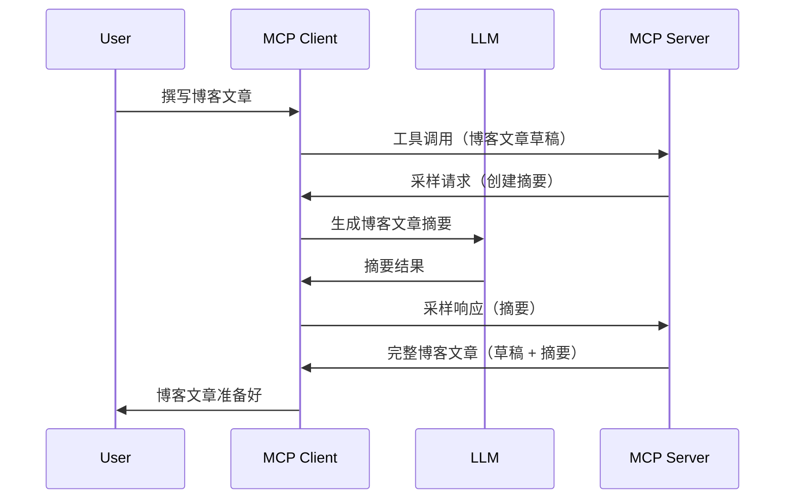

# 采样 - 将功能委托给客户端

有时，您需要 MCP 客户端和 MCP 服务器协同工作以实现共同目标。您可能遇到服务器需要客户端上运行的 LLM 帮助的情况。对于这种情况，采样是您应该使用的功能。

让我们探索一些用例以及如何构建涉及采样的解决方案。

## 概述

本课我们重点说明何时何地使用采样以及如何配置它。

## 学习目标

本章中，我们将：

- 解释什么是采样以及何时使用它。
- 展示如何在 MCP 中配置采样。
- 提供采样实际应用的例子。

## 什么是采样以及为何使用它？

采样是一项高级功能，其工作原理如下：



### 采样请求

好了，现在我们对一个可信的场景有了一个全局视角，接下来讲讲服务器发送给客户端的采样请求。下面是该请求的 JSON-RPC 格式示例：

```json
{
  "jsonrpc": "2.0",
  "id": 1,
  "method": "sampling/createMessage",
  "params": {
    "messages": [
      {
        "role": "user",
        "content": {
          "type": "text",
          "text": "Create a blog post summary of the following blog post: <BLOG POST>"
        }
      }
    ],
    "modelPreferences": {
      "hints": [
        {
          "name": "claude-3-sonnet"
        }
      ],
      "intelligencePriority": 0.8,
      "speedPriority": 0.5
    },
    "systemPrompt": "You are a helpful assistant.",
    "maxTokens": 100
  }
}
```

这里有几点值得说明：

- 在 content -> text 下的 Prompt 是我们的提示词，是给 LLM 的指令，用于总结博客文章内容。

- **modelPreferences**。这部分就是偏好，是对 LLM 使用配置的建议推荐。用户可以选择是否按照这些建议或自行更改。本例中对模型使用、速度和智能优先级给出了建议。
- **systemPrompt**，这是你常用的系统提示，给你的 LLM 赋予个性，并包含指引说明。
- **maxTokens**，这是用来说明推荐本任务使用多少token的属性。

### 采样响应

此响应是 MCP 客户端调用 LLM 并等待其响应后，发送回 MCP 服务器的结果。其 JSON-RPC 格式示例如下：

```json
{
  "jsonrpc": "2.0",
  "id": 1,
  "result": {
    "role": "assistant",
    "content": {
      "type": "text",
      "text": "Here's your abstract <ABSTRACT>"
    },
    "model": "gpt-5",
    "stopReason": "endTurn"
  }
}
```

注意响应是对博客文章的摘要，正如我们所要求的。同时注意使用的 `model` 不是请求中的那个，而是“gpt-5”代替了“claude-3-sonnet”。这用来说明用户可以改变使用的模型，你发出的采样请求只是建议。

好了，理解了主要流程和一个有用的任务范例“博客文章创作+摘要”，接下来看看需要做哪些操作才能使其工作。

### 消息类型

采样消息不仅限于文本传递，还可以发送图片和音频。下面展示了 JSON-RPC 的不同表现形式：

<strong>文本</strong>

```json
{
  "type": "text",
  "text": "The message content"
}
```

<strong>图片内容</strong>

```json
{
  "type": "image",
  "data": "base64-encoded-image-data",
  "mimeType": "image/jpeg"
}
```

<strong>音频内容</strong>

```json
{
  "type": "audio",
  "data": "base64-encoded-audio-data",
  "mimeType": "audio/wav"
}
```

> 注意：有关采样的更多详细信息，请查看[官方文档](https://modelcontextprotocol.io/specification/2025-11-25/client/sampling)

## 如何在客户端配置采样

> 注意：如果你只构建服务器，这里无需做太多操作。

在客户端，需要像下面这样指定以下功能：

```json
{
  "capabilities": {
    "sampling": {}
  }
}
```

此配置将在您的客户端启动并连接服务器时被识别。

## 采样示例 - 创建博客文章

让我们一起编写一个采样服务器，我们需要完成以下步骤：

1. 在服务器端创建一个工具。
2. 该工具应创建一个采样请求。
3. 工具等待客户端采样请求的响应。
4. 然后产生工具结果。

逐步来看代码：

### -1- 创建工具

**python**

```python
@mcp.tool()
async def create_blog(title: str, content: str, ctx: Context[ServerSession, None]) -> str:
    """Create a blog post and generate a summary"""

```

### -2- 创建采样请求

用以下代码扩展你的工具：

**python**

```python
post = BlogPost(
        id=len(posts) + 1,
        title=title,
        content=content,
        abstract=""
    )

prompt = f"Create an abstract of the following blog post: title: {title} and draft: {content} "

result = await ctx.session.create_message(
        messages=[
            SamplingMessage(
                role="user",
                content=TextContent(type="text", text=prompt),
            )
        ],
        max_tokens=100,
)

```

### -3- 等待响应并返回结果

**python**

```python
post.abstract = result.content.text

posts.append(post)

# 返回完整的产品
return json.dumps({
    "id": post.title,
    "abstract": post.abstract
})
```

### -4- 完整代码

**python**

```python
from starlette.applications import Starlette
from starlette.routing import Mount, Host

from mcp.server.fastmcp import Context, FastMCP

from mcp.server.session import ServerSession
from mcp.types import SamplingMessage, TextContent

import json


from uuid import uuid4
from typing import List
from pydantic import BaseModel


mcp = FastMCP("Blog post generator")

# app = FastAPI()

posts = []

class BlogPost(BaseModel):
    id: int
    title: str
    content: str
    abstract: str

posts: List[BlogPost] = []

@mcp.tool()
async def create_blog(title: str, content: str, ctx: Context[ServerSession, None]) -> str:
    """Create a blog post and generate a summary"""

    post = BlogPost(
        id=len(posts) + 1,
        title=title,
        content=content,
        abstract=""
    )

    prompt = f"Create an abstract of the following blog post: title: {title} and draft: {content} "

    result = await ctx.session.create_message(
        messages=[
            SamplingMessage(
                role="user",
                content=TextContent(type="text", text=prompt),
            )
        ],
        max_tokens=100,
    )

    post.abstract = result.content.text

    posts.append(post)

    # 返回完整的博客文章
    return json.dumps({
        "id": post.title,
        "abstract": post.abstract
    })

if __name__ == "__main__":
    print("Starting server...")
    # mcp.run()
    mcp.run(transport="streamable-http")

# 使用以下命令运行应用：python server.py
```

### -5- 在 Visual Studio Code 中测试

要在 Visual Studio Code 中测试，请执行如下操作：

1. 在终端启动服务器
1. 将其添加到 *mcp.json* 中（并确保服务器已启动），例如如下：

   ```json
   "servers": {
      "blog-server": {
        "type": "http",
        "url": "http://localhost:8000/mcp"
      }
   }
   ```

1. 输入提示词：

   ```text
   create a blog post named "Where Python comes from", the content is "Python is actually named after Monty Python Flying Circus"
   ```

1. 允许采样发生。首次测试时你会看到一个额外对话框，需要你确认，随后你将看到正常的工具运行确认对话框。

1. 检查结果。你将看到 GitHub Copilot Chat 中美观显示的结果，同时也可以查看原始 JSON 响应。

<strong>附加</strong>。Visual Studio Code 工具对采样支持极好。你可以这样配置你已安装服务器的采样访问权限：

1. 进入扩展部分。
1. 在“MCP SERVERS - INSTALLED”章节选择已安装服务器旁的齿轮图标。
1. 选择“Configure Model Access”，在这里你可以选择 GitHub Copilot 允许在采样时使用哪些模型。你还可以通过选择“Show Sampling requests”查看最近的采样请求记录。

## 练习作业

在本作业中，你将构建一个稍有不同的采样集成，即支持生成产品描述的采样。你的情境如下：

<strong>场景</strong>：电商后台工作人员需要帮助，生成产品描述耗费时间过长。因此，你需要构建一个解决方案，可以调用名为“create_product”的工具，参数包含“title”和“keywords”，并由客户端 LLM 生成完整产品，包括一个由客户端填充的“description”字段。

提示：利用之前学到的内容，通过采样请求构造该服务器及其工具。

## 解决方案

[解决方案](./solution/README.md)

## 关键要点

采样是一项强大功能，当服务器需要 LLM 帮助时，它可以将任务委托给客户端。

## 接下来

- [第4章 - 实际实现](../../04-PracticalImplementation/README.md)

---

<!-- CO-OP TRANSLATOR DISCLAIMER START -->
**免责声明**：
本文件由 AI 翻译服务 [Co-op Translator](https://github.com/Azure/co-op-translator) 翻译完成。尽管我们力求准确，但请注意，自动翻译可能包含错误或不准确之处。原始语言版文件应视为权威来源。对于重要信息，建议使用专业人工翻译。我们对因使用本翻译而产生的任何误解或误释不承担责任。
<!-- CO-OP TRANSLATOR DISCLAIMER END -->