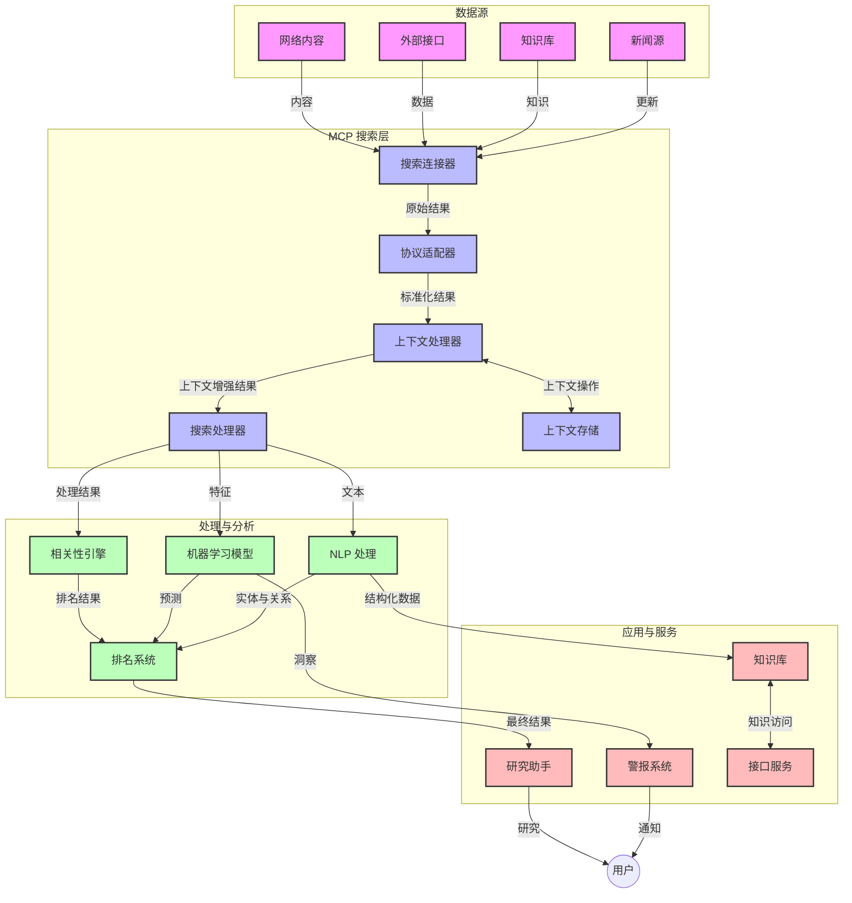
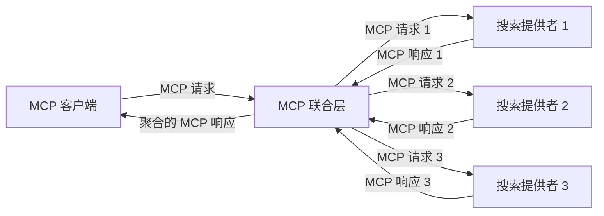
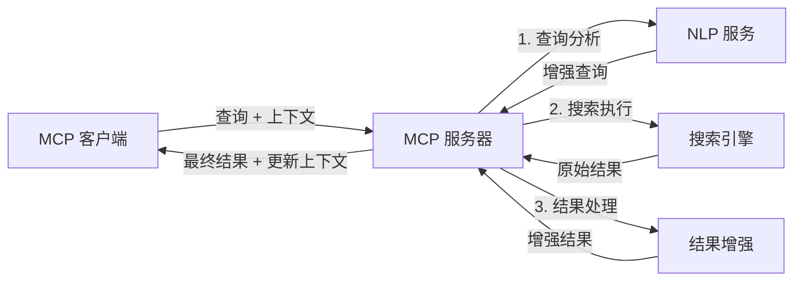

# 实时网络搜索的模型上下文协议

## 概述

实时网络搜索在当今信息驱动的环境中变得至关重要，应用程序需要即时访问互联网上的最新信息以提供相关且及时的响应。模型上下文协议（MCP）代表了优化这些实时搜索流程的重要进展，提升搜索效率，保持上下文完整性，并改善整体系统性能。

本模块探讨了 MCP 如何通过为 AI 模型、搜索引擎和应用程序提供标准化的上下文管理方法，变革实时网络搜索。

### 你将学到的内容

在本综合指南中，你将了解：

- MCP 如何在 AI 模型和实时网络搜索功能之间构建无缝桥梁
- 使用 MCP 实现高效且可扩展搜索解决方案的架构模式
- 跨多次查询和交互保持搜索上下文的技术
- 针对各种搜索场景的 Python 和 JavaScript 实践代码实现
- 在 MCP 驱动的搜索系统中平衡相关性、时效性和性能的方法

## 实时网络搜索简介

实时网络搜索是一种技术方法，能够在网页信息发布或更新时连续查询、处理和分析这些信息，使系统能够以极低的延迟提供新鲜且相关的信息。不同于基于索引数据、可能延迟数小时甚至数天的传统搜索系统，实时搜索处理来自网络的实时数据，提供反映当前在线内容状态的洞察与信息。

### 实时网络搜索的核心概念：

- <strong>连续查询处理</strong>：搜索查询针对不断更新的数据源进行处理
- <strong>时效优先</strong>：系统设计优先考虑新鲜信息
- <strong>相关性平衡</strong>：保持相关性与时效性的平衡
- <strong>可扩展架构</strong>：系统必须应对可变的查询负载和数据规模
- <strong>上下文理解</strong>：跨多个搜索迭代保持用户上下文对获取有意义结果尤为重要
- <strong>动态查询重构</strong>：基于上下文和先前结果动态调整查询
- <strong>多源整合</strong>：结合多个搜索提供商和网络资源的结果
- <strong>语义理解</strong>：基于意义而非关键词处理查询和内容
- <strong>实时排序</strong>：随着新信息不断出现，持续调整结果排序

### 模型上下文协议与实时网络搜索

模型上下文协议（MCP）针对实时网络搜索环境中的几个关键挑战：

1. <strong>搜索上下文保持</strong>：MCP 标准化了分布式搜索组件间上下文的维护方式，确保 AI 模型和处理节点可以访问相关的查询历史和用户偏好。

2. <strong>高效查询管理</strong>：通过提供结构化的上下文传递机制，MCP 减少在每次搜索迭代中重复传递上下文的开销。

3. <strong>互操作性</strong>：MCP 为不同搜索技术和 AI 模型之间的上下文共享创建了通用语言，支持更灵活和可扩展的架构。

4. <strong>搜索优化的上下文</strong>：MCP 实现可以优先处理对有效搜索最相关的上下文元素，优化性能和准确性。

5. <strong>自适应搜索处理</strong>：通过 MCP 的适当上下文管理，搜索系统可以根据不断变化的用户需求和信息环境动态调整处理流程。

在从新闻聚合到研究助手的现代应用中，MCP 与网络搜索技术的集成实现了更智能、上下文感知的搜索，随着用户交互的继续，能够提供越来越相关的结果。

## 学习目标

本课结束时，你将能够：

- 理解实时网络搜索的基础及其在现代应用中的挑战
- 解释模型上下文协议（MCP）如何增强实时网络搜索能力
- 使用流行框架和 API 实现基于 MCP 的搜索解决方案
- 设计和部署可扩展、高性能的 MCP 搜索架构
- 将 MCP 概念应用于语义搜索、研究辅助与 AI 增强浏览等多场景
- 评估基于 MCP 的搜索技术的最新趋势和未来创新
- 开发从用户交互中学习的上下文感知搜索系统
- 使用标准化 MCP 协议将网络搜索功能集成到 AI 助手中
- 创建分阶段搜索管道，根据上下文逐步优化结果
- 优化搜索性能，同时保持全面的上下文意识

### 定义与意义

实时网络搜索涉及连续查询、检索和传递基于网络的信息，且延迟极低。不同于周期性爬取和索引网页的传统搜索引擎，实时搜索旨在尽快呈现信息，使用户能立即访问最新内容。

实时网络搜索的关键特征包括：

- <strong>新鲜性</strong>：优先最新的内容和更新
- <strong>连续处理</strong>：持续监控新信息
- <strong>查询适应</strong>：基于上下文和反馈细化查询
- <strong>即时交付</strong>：以最小延迟提供搜索结果
- <strong>上下文保留</strong>：基于之前的查询改进相关性

### 传统网络搜索的挑战

传统网络搜索在实时场景下存在若干限制：

1. <strong>上下文碎片化</strong>：难以跨多次查询保持搜索上下文
2. <strong>信息新鲜度</strong>：难以访问和优先最新信息
3. <strong>集成复杂性</strong>：搜索系统与应用间互操作问题
4. <strong>延迟问题</strong>：在全面搜索与响应时间之间平衡
5. <strong>相关性调优</strong>：在优先时效的同时确保准确与相关

## 理解实时搜索中的模型上下文协议（MCP）

### MCP 在搜索场景中是什么？

模型上下文协议（MCP）是一种标准化通信协议，旨在促进 AI 模型和应用之间高效交互。在实时网络搜索中，MCP 提供框架用于：

- 整个查询序列中保持搜索上下文
- 标准化搜索查询和结果格式
- 优化搜索参数和结果的传输
- 增强模型与搜索引擎的通信

### 核心组件与架构

面向实时网络搜索的 MCP 架构由几个关键组件组成：

1. <strong>查询上下文处理器</strong>：管理并维持多次查询的搜索上下文
2. <strong>搜索处理器</strong>：使用上下文感知技术处理搜索请求
3. <strong>协议适配器</strong>：在不同搜索 API 之间转换，同时保持上下文
4. <strong>上下文存储</strong>：高效存储和检索搜索历史与偏好
5. <strong>搜索连接器</strong>：连接各种搜索引擎和网络 API



### MCP 如何提升实时网络搜索

MCP 通过以下方式应对传统网络搜索的挑战：

- <strong>上下文连续性</strong>：维护整个搜索会话中查询间的关联
- <strong>优化传输</strong>：通过智能上下文管理减少搜索参数冗余
- <strong>标准接口</strong>：提供一致的搜索组件 API
- <strong>降低延迟</strong>：通过高效上下文处理减少处理开销
- <strong>增强相关性</strong>：通过跨多次查询保持用户意图提升相关性

## 集成与实现

实时网络搜索系统需要精心设计架构和实现，以保持性能和上下文完整性。模型上下文协议提供了在 AI 模型和搜索技术之间集成的标准化方法，实现更复杂和上下文感知的搜索管道。

### MCP 在搜索架构中的集成概述

在实时网络搜索环境中实现 MCP 涉及几个关键要点：

1. <strong>搜索上下文序列化</strong>：MCP 提供高效机制，将上下文信息编码进搜索请求，确保关键上下文在整个处理流程中传递，包含针对搜索相关元数据优化的标准化序列化格式。

2. <strong>有状态搜索处理</strong>：MCP 通过在多次搜索迭代中维护一致的上下文表达，实现更智能的有状态处理，特别适用于上下文逐步细化的多阶段搜索管道。

3. <strong>查询扩展与细化</strong>：MCP 实现在搜索系统中可促进基于累积上下文的复杂查询扩展与细化，使搜索会话进展时结果越来越相关。

4. <strong>结果缓存与优先级</strong>：通过标准化上下文处理，MCP 有助于管理结果缓存和优先级，使组件能根据变化的搜索上下文调整行为。

5. <strong>搜索联合与聚合</strong>：MCP 提供结构化的搜索上下文表达，促进跨多个后端的高级搜索联合，实现来自多样来源的结果更有意义的聚合。

MCP 在多种搜索技术间的实现创建了一种统一的上下文管理方法，减少了定制集成代码的需求，同时增强系统在搜索查询演变过程中保持有意义上下文的能力。

### MCP 在各类网络搜索实现中的应用

以下示例遵循当前 MCP 规范，聚焦基于 JSON-RPC 的协议及不同传输机制。代码展示了如何实现自定义搜索集成，同时保持与 MCP 协议的完全兼容。

<details>
<summary>使用通用搜索 API 的 Python 实现</summary>

```python
import asyncio
import json
import aiohttp
from typing import Dict, Any, Optional, List
from contextlib import asynccontextmanager
from collections.abc import AsyncIterator

# 导入标准的MCP库
from mcp.client.session import ClientSession
from mcp.client.streamable_http import streamablehttp_client
from mcp.types import TextContent, CreateMessageRequestParams, CreateMessageResult
from mcp.server.fastmcp import FastMCP

# 创建一个用于网络搜索的FastMCP服务器
search_server = FastMCP("WebSearch")

# 处理网络搜索操作的类
class WebSearchHandler:
    def __init__(self, api_endpoint: str, api_key: str):
        self.api_endpoint = api_endpoint
        self.api_key = api_key
        self.session = None
        
    async def initialize(self):
        """Initialize the HTTP session"""
        self.session = aiohttp.ClientSession(
            headers={"Authorization": f"Bearer {self.api_key}"}
        )
    
    async def close(self):
        """Close the HTTP session"""
        if self.session:
            await self.session.close()
            
    async def perform_search(self, query: str, max_results: int = 5, 
                           include_domains: List[str] = None, 
                           exclude_domains: List[str] = None,
                           time_period: str = "any") -> Dict[str, Any]:
        """Perform web search using the search API"""
        # 构造搜索参数
        search_params = {
            "q": query,
            "limit": max_results,
            "time": time_period
        }
        
        if include_domains:
            search_params["site"] = ",".join(include_domains)
            
        if exclude_domains:
            search_params["exclude_site"] = ",".join(exclude_domains)
        
        # 执行搜索请求
        try:
            async with self.session.get(
                self.api_endpoint,
                params=search_params
            ) as response:
                if response.status != 200:
                    error_text = await response.text()
                    raise Exception(f"Search API error: {response.status} - {error_text}")
                
                search_data = await response.json()
                
                # 将API特定的响应转换为标准格式
                results = []
                for item in search_data.get("results", []):
                    results.append({
                        "title": item.get("title", ""),
                        "url": item.get("url", ""),
                        "snippet": item.get("snippet", ""),
                        "date": item.get("published_date", ""),
                        "source": item.get("source", "")
                    })
                
                return {
                    "query": query,
                    "totalResults": len(results),
                    "results": results
                }
        except Exception as e:
            print(f"Search API request error: {e}")
            raise

# 初始化搜索处理器
search_handler = WebSearchHandler(
    api_endpoint="https://api.search-service.example/search",
    api_key="your-api-key-here"
)

# 设置生命周期以管理搜索处理器
@asyncio.asynccontextmanager
async def app_lifespan(server: FastMCP):
    """Manage application lifecycle"""
    await search_handler.initialize()
    try:
        yield {"search_handler": search_handler}
    finally:
        await search_handler.close()

# 为服务器设置生命周期
search_server = FastMCP("WebSearch", lifespan=app_lifespan)

# 注册一个网络搜索工具
@search_server.tool()
async def web_search(query: str, max_results: int = 5, 
                   include_domains: List[str] = None,
                   exclude_domains: List[str] = None,
                   time_period: str = "any") -> Dict[str, Any]:
    """
    Search the web for information
    
    Args:
        query: The search query
        max_results: Maximum number of results to return (default: 5)
        include_domains: List of domains to include in search results
        exclude_domains: List of domains to exclude from search results
        time_period: Time period for results ("day", "week", "month", "any")
        
    Returns:
        Dictionary containing search results
    """
    ctx = search_server.get_context()
    search_handler = ctx.request_context.lifespan_context["search_handler"]
    
    results = await search_handler.perform_search(
        query=query,
        max_results=max_results,
        include_domains=include_domains,
        exclude_domains=exclude_domains,
        time_period=time_period
    )
    
    return results

# 客户端使用示例
async def client_example():
    # 使用可流式HTTP传输连接到搜索服务器
    async with streamablehttp_client("http://localhost:8000/mcp") as (read, write, _):
        async with ClientSession(read, write) as session:
            # 初始化连接
            await session.initialize()
            
            # 调用web_search工具
            search_results = await session.call_tool(
                "web_search", 
                {
                    "query": "latest developments in AI and Model Context Protocol",
                    "max_results": 5,
                    "time_period": "day",
                    "include_domains": ["github.com", "microsoft.com"]
                }
            )
            
            print(f"Search results: {search_results}")

# 服务器执行示例
if __name__ == "__main__":
    # 使用可流式HTTP传输运行服务器
    search_server.run(transport="streamable-http")
```
</details>

<details>
<summary>基于浏览器的 JavaScript 实现</summary>

```javascript
// 用于网络搜索的 MCP 服务器实现
import { McpServer, ResourceTemplate } from '@modelcontextprotocol/sdk/server/mcp.js';
import { StreamableHTTPServerTransport } from '@modelcontextprotocol/sdk/server/streamableHttp.js';
import { z } from 'zod';

// 创建一个用于网络搜索的 MCP 服务器
const searchServer = new McpServer({
    name: "BrowserSearch",
    description: "A server that provides web search capabilities"
});

// 搜索服务类
class SearchService {
    constructor(searchApiUrl, apiKey) {
        this.searchApiUrl = searchApiUrl;
        this.apiKey = apiKey;
    }

    async performSearch(parameters) {
        const {
            query = '',
            maxResults = 5,
            includeDomains = [],
            excludeDomains = [],
            timePeriod = 'any'
        } = parameters;
        
        // 使用参数构建搜索 URL
        const url = new URL(this.searchApiUrl);
        url.searchParams.append('q', query);
        url.searchParams.append('limit', maxResults);
        url.searchParams.append('time', timePeriod);
        
        if (includeDomains.length > 0) {
            url.searchParams.append('site', includeDomains.join(','));
        }
        
        if (excludeDomains.length > 0) {
            url.searchParams.append('exclude_site', excludeDomains.join(','));
        }
        
        try {
            const response = await fetch(url.toString(), {
                method: 'GET',
                headers: {
                    'Authorization': `Bearer ${this.apiKey}`,
                    'Content-Type': 'application/json'
                }
            });
            
            if (!response.ok) {
                const errorText = await response.text();
                throw new Error(`Search API error: ${response.status} - ${errorText}`);
            }
            
            const searchData = await response.json();
            
            // 将特定 API 的响应转换为标准格式
            const results = searchData.results?.map(item => ({
                title: item.title || '',
                url: item.url || '',
                snippet: item.snippet || '',
                date: item.published_date || '',
                source: item.source || ''
            })) || [];
            
            return {
                query,
                totalResults: results.length,
                results
            };
        } catch (error) {
            console.error('Search API request error:', error);
            throw error;
        }
    }
}

// 初始化搜索服务
const searchService = new SearchService(
    'https://api.search-service.example/search',
    'your-api-key-here'
);

// 设置服务器的上下文提供者
searchServer.setContextProvider(() => {
    return {
        searchService
    };
});

// 注册网络搜索工具
searchServer.tool({
    name: 'web_search',
    description: 'Search the web for information',
    parameters: {
        type: 'object',
        properties: {
            query: {
                type: 'string',
                description: 'The search query'
            },
            maxResults: {
                type: 'integer',
                description: 'Maximum number of results to return',
                default: 5
            },
            includeDomains: {
                type: 'array',
                items: { type: 'string' },
                description: 'List of domains to include in search results'
            },
            excludeDomains: {
                type: 'array',
                items: { type: 'string' },
                description: 'List of domains to exclude from search results'
            },
            timePeriod: {
                type: 'string',
                description: 'Time period for results',
                enum: ['day', 'week', 'month', 'any'],
                default: 'any'
            }
        },
        required: ['query']
    },
    handler: async (params, context) => {
        const { searchService } = context;
        return await searchService.performSearch(params);
    }
});

// 连接到搜索服务器的示例客户端代码
import { Client } from '@modelcontextprotocol/sdk/client/index.js';
import { StreamableHTTPClientTransport } from '@modelcontextprotocol/sdk/client/streamableHttp.js';

async function connectToSearchServer() {
    // 连接到搜索服务器
    const transport = new StreamableHTTPClientTransport(
        new URL('http://localhost:8000/mcp')
    );
    
    const client = new Client({
        name: 'search-client',
        version: '1.0.0'
    });
    
    await client.connect(transport);
    
    // 执行搜索工具
    const searchResults = await client.callTool({
        name: 'web_search',
        arguments: {
            query: 'Model Context Protocol implementation examples',
            maxResults: 10,
            timePeriod: 'week',
            includeDomains: ['github.com', 'docs.microsoft.com']
        }
    });
    
    console.log('Search results:', searchResults);
    
    // 清理
    await client.disconnect();
}

// 启动服务器
const transport = new StreamableHTTPServerTransport();
await searchServer.connect(transport);
console.log('Search server running at http://localhost:8000/mcp');

// 在单独的进程或服务器启动后
// connectToSearchServer().catch(console.error);
```
</details>

## 代码示例免责声明

> <strong>重要说明</strong>：以下代码示例演示了模型上下文协议（MCP）与网络搜索功能的集成。尽管它们遵循官方 MCP SDK 的模式和结构，但为了教学目的进行了简化。
> 
> 示例内容包括：
> 
> 1. **Python 实现**：一个 FastMCP 服务器实现，提供了一个网络搜索工具并连接至外部搜索 API。此示例展示了合理的生命周期管理、上下文处理和工具实现，遵循 [官方 MCP Python SDK](https://github.com/modelcontextprotocol/python-sdk) 的模式。服务器使用推荐的 Streamable HTTP 传输，取代了旧的生产环境 SSE 传输。
> 
> 2. **JavaScript 实现**：使用 [官方 MCP TypeScript SDK](https://github.com/modelcontextprotocol/typescript-sdk) 中 FastMCP 模式的 TypeScript/JavaScript 实现，创建一个具有合适工具定义和客户端连接的搜索服务器，遵循最新推荐的会话管理和上下文保持模式。
> 
> 这些示例在生产环境中需添加额外的错误处理、鉴权和具体 API 集成代码。示例中的搜索 API 端点（`https://api.search-service.example/search`）为占位符，需要替换为真实搜索服务端点。
> 
> 如需完整实现细节和最新方法，请参阅 [官方 MCP 规范](https://spec.modelcontextprotocol.io/) 和 SDK 文档。

## 核心概念

### 模型上下文协议（MCP）框架

MCP 从根本上为 AI 模型、应用和服务之间交换上下文提供了标准化方式。在实时网络搜索中，该框架对创建连贯的多轮搜索体验至关重要。核心组件包括：

1. **客户端-服务器架构**：MCP 明确区分搜索客户端（请求方）和搜索服务器（提供方），支持灵活部署模型。

2. **JSON-RPC 通信**：协议采用 JSON-RPC 进行消息交换，兼容网络技术且易于跨平台实现。

3. <strong>上下文管理</strong>：定义结构化方法以维护、更新和利用跨多次交互的搜索上下文。

4. <strong>工具定义</strong>：搜索能力以标准工具形式暴露，具备明确的参数和返回值。

5. <strong>流式支持</strong>：协议支持结果流式传输，适合结果可能逐步到达的实时搜索。

### 网络搜索集成模式

将 MCP 与网络搜索集成时，出现了几种模式：

#### 1. 直接搜索提供商集成


  
此模式中，MCP 服务器直接与一个或多个搜索 API 交互，将 MCP 请求转换为 API 特定调用，并将结果格式化为 MCP 响应。

#### 2. 保持上下文的联合搜索


  
此模式在多个兼容 MCP 的搜索提供商间分发查询，每个提供商可能专注于不同内容或搜索能力，同时保持统一上下文。

#### 3. 上下文增强的搜索链


  
此模式将搜索过程分为多个阶段，每个步骤都丰富上下文，带来逐步更相关的结果。

### 搜索上下文组成

在基于 MCP 的网络搜索中，上下文通常包括：

- <strong>查询历史</strong>：会话中的先前搜索查询
- <strong>用户偏好</strong>：语言、区域、安全搜索设置
- <strong>交互历史</strong>：点击的结果、浏览时间
- <strong>搜索参数</strong>：过滤器、排序方式及其他修饰条件
- <strong>领域知识</strong>：与搜索相关的特定主题上下文
- <strong>时间上下文</strong>：基于时间的相关性因素
- <strong>源偏好</strong>：可信或优选的信息来源

## 应用案例与场景

### 研究与信息收集

MCP 通过以下方式增强研究工作流：

- 在搜索会话间保持研究上下文
- 实现更复杂和上下文相关的查询
- 支持多源搜索联合
- 促进从搜索结果中提取知识

### 实时新闻与趋势监控

MCP 驱动的搜索在新闻监控方面优势显著：

- 近实时发现新兴新闻事件
- 上下文过滤相关信息
- 在多来源间跟踪主题和实体
- 基于用户上下文的个性化新闻提醒

### AI 增强的浏览与研究

MCP 为 AI 增强浏览创造新可能：

- 基于当前浏览器活动提供上下文搜索建议
- 与基于大型语言模型的助手无缝集成网络搜索
- 多轮搜索细化，保持上下文
- 增强事实核查和信息验证

## 未来趋势与创新

### MCP 在网络搜索中的演进

展望未来，预计 MCP 将持续演进以应对：
- <strong>多模态搜索</strong>：集成文本、图像、音频和视频搜索并保持上下文
- <strong>去中心化搜索</strong>：支持分布式和联合搜索生态系统
- <strong>搜索隐私</strong>：基于上下文的隐私保护搜索机制
- <strong>查询理解</strong>：自然语言搜索查询的深层语义解析

### 未来技术的潜在进展

将塑造MCP搜索未来的新兴技术：

1. <strong>神经搜索架构</strong>：针对MCP优化的基于嵌入的搜索系统
2. <strong>个性化搜索上下文</strong>：随着时间学习个人用户的搜索模式
3. <strong>知识图谱集成</strong>：通过领域特定知识图谱增强上下文搜索
4. <strong>跨模态上下文</strong>：保持不同搜索模态之间的上下文连贯性

## 实践练习

### 练习1：搭建基础的MCP搜索流水线

在此练习中，您将学习如何：
- 配置基础的MCP搜索环境
- 实现面向网络搜索的上下文处理器
- 测试并验证跨多次搜索迭代的上下文保持

### 练习2：使用MCP搜索构建研究助理

创建一个完整的应用，能够：
- 处理自然语言研究问题
- 执行基于上下文的网络搜索
- 汇总来自多个来源的信息
- 展示有条理的研究成果

### 练习3：使用MCP实现多源搜索联合

高级练习内容包括：
- 面向多个搜索引擎的上下文感知查询调度
- 结果排序与聚合
- 上下文相关的搜索结果去重
- 处理源特定的元数据

## 附加资源

- [Model Context Protocol Specification](https://spec.modelcontextprotocol.io/) - MCP官方规范及详细协议文档
- [Model Context Protocol Documentation](https://modelcontextprotocol.io/) - 详尽的教程和实施指南
- [MCP Python SDK](https://github.com/modelcontextprotocol/python-sdk) - MCP协议官方Python实现
- [MCP TypeScript SDK](https://github.com/modelcontextprotocol/typescript-sdk) - MCP协议官方TypeScript实现
- [MCP Reference Servers](https://github.com/modelcontextprotocol/servers) - MCP服务器参考实现
- [Bing Web Search API Documentation](https://learn.microsoft.com/en-us/bing/search-apis/bing-web-search/overview) - 微软网页搜索API
- [Google Custom Search JSON API](https://developers.google.com/custom-search/v1/overview) - 谷歌可编程搜索引擎
- [SerpAPI Documentation](https://serpapi.com/search-api) - 搜索引擎结果页API
- [Meilisearch Documentation](https://www.meilisearch.com/docs) - 开源搜索引擎
- [Elasticsearch Documentation](https://www.elastic.co/guide/index.html) - 分布式搜索与分析引擎
- [LangChain Documentation](https://python.langchain.com/docs/get_started/introduction) - 基于LLM构建应用

## 学习成果

完成本模块后，您将能够：

- 理解实时网络搜索的基础及其挑战
- 解释Model Context Protocol (MCP) 如何增强实时网络搜索能力
- 使用流行框架和API实现基于MCP的搜索解决方案
- 设计并部署可扩展、高性能的MCP搜索架构
- 将MCP概念应用于语义搜索、研究助手和AI增强浏览等多种用例
- 评估MCP搜索技术的新兴趋势和未来创新

### 信任与安全考量

实现基于MCP的网络搜索解决方案时，请牢记MCP规范中的这些重要原则：

1. <strong>用户同意与控制</strong>：用户必须明确同意并理解所有数据访问和操作。尤其是对于可能访问外部数据源的网络搜索实现，这至关重要。

2. <strong>数据隐私</strong>：确保对搜索查询和结果的适当处理，特别是它们可能包含敏感信息时。实施适当的访问控制以保护用户数据。

3. <strong>工具安全</strong>：对搜索工具实施恰当的授权和验证，因为它们通过任意代码执行可能带来安全风险。除非来自可信服务器，否则工具行为描述应视为不可信。

4. <strong>清晰文档</strong>：根据MCP规范的实施指南，提供关于您的MCP搜索实现的功能、限制和安全考虑的清晰文档。

5. <strong>健全的同意流程</strong>：构建完善的同意及授权流程，明确说明每个工具的作用，特别是针对与外部网络资源交互的工具，在授权使用前进行说明。

有关MCP安全与信任的完整详情，请参阅[官方文档](https://modelcontextprotocol.io/specification/2025-11-25/basic/security_best_practices)。

## 后续内容

- [5.12 Entra ID Authentication for Model Context Protocol Servers](../mcp-security-entra/README.md)

---

<!-- CO-OP TRANSLATOR DISCLAIMER START -->
**免责声明**：
本文件由 AI 翻译服务 [Co-op Translator](https://github.com/Azure/co-op-translator) 翻译完成。尽管我们力求准确，但请注意，自动翻译可能包含错误或不准确之处。原始语言版文件应视为权威来源。对于重要信息，建议使用专业人工翻译。我们对因使用本翻译而产生的任何误解或误释不承担责任。
<!-- CO-OP TRANSLATOR DISCLAIMER END -->