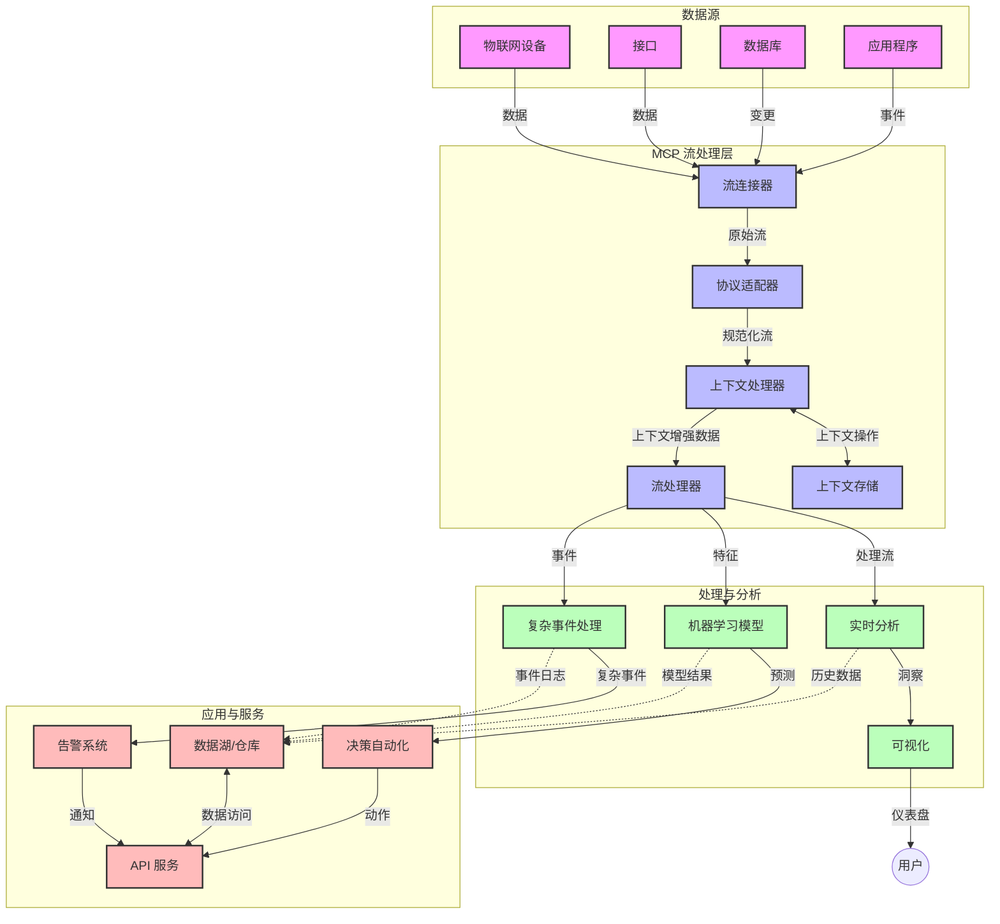

# 实时数据流传输的模型上下文协议

## 概述

实时数据流传输在当今数据驱动的世界中变得至关重要，企业和应用程序需要即时访问信息以做出及时决策。模型上下文协议（MCP）代表了优化这些实时流处理过程的重大进展，提升了数据处理效率，维护了上下文完整性，并改善了整体系统性能。

本模块探讨了MCP如何通过为AI模型、流平台和应用程序提供标准化的上下文管理方法，变革实时数据流传输。

## 实时数据流传输简介

实时数据流传输是一种技术范式，能够实现数据在生成时的持续传输、处理和分析，使系统能够对新信息立即做出反应。与操作静态数据集的传统批处理不同，流处理对动态数据进行实时处理，以极低的延迟提供洞察和操作。

### 实时数据流传输的核心概念：

- <strong>连续数据流</strong>：数据作为连续不断的事件或记录流被处理。
- <strong>低延迟处理</strong>：系统设计以最小化数据生成与处理之间的时间。
- <strong>可扩展性</strong>：流架构必须能够处理不同的数据量和速度。
- <strong>容错性</strong>：系统需要具备抗故障能力，确保数据流不中断。
- <strong>有状态处理</strong>：跨事件保持上下文对于有意义的分析至关重要。

### 模型上下文协议与实时流传输

模型上下文协议（MCP）针对实时流环境中的几个关键挑战：

1. <strong>上下文连续性</strong>：MCP规范了分布式流组件间上下文的维护方式，确保AI模型和处理节点可以访问相关的历史和环境上下文。

2. <strong>高效状态管理</strong>：通过提供结构化的上下文传输机制，MCP降低了流式管道中状态管理的开销。

3. <strong>互操作性</strong>：MCP为不同流技术和AI模型之间的上下文共享创建了通用语言，支持更灵活和可扩展的架构。

4. <strong>流优化的上下文</strong>：MCP实现可以优先考虑最适用于实时决策的上下文元素，兼顾性能与准确性。

5. <strong>自适应处理</strong>：通过MCP的适当上下文管理，流处理系统能根据数据中不断变化的条件和模式动态调整处理。

在从物联网传感器网络到金融交易平台的现代应用中，MCP与流技术的集成使处理更智能、更具上下文感知能力，能够实时恰当地响应复杂不断变化的情况。

## 学习目标

完成本课后，您将能够：

- 理解实时数据流的基本原理及其挑战
- 解释模型上下文协议（MCP）如何增强实时数据流传输
- 使用Kafka和Pulsar等主流框架实现基于MCP的流处理解决方案
- 设计并部署具有容错性和高性能的MCP流架构
- 将MCP概念应用于物联网、金融交易和AI驱动的分析用例
- 评估MCP基于流技术的最新趋势和未来创新

### 定义与意义

实时数据流传输涉及数据的连续生成、处理和交付，延迟极低。与收集并批量处理数据的批处理不同，流数据逐步到达便被处理，实现即时洞察与操作。

实时数据流传输的关键特性包括：

- <strong>低延迟</strong>：在毫秒到秒级时间内完成数据处理与分析
- <strong>连续流</strong>：各类来源持续不断的数据流
- <strong>即时处理</strong>：数据一到达即进行分析，而非批处理
- <strong>事件驱动架构</strong>：基于事件发生即刻响应

### 传统数据流传输中的挑战

传统数据流方法面临多项限制：

1. <strong>上下文丢失</strong>：难以在分布式系统中维持上下文
2. <strong>可扩展性问题</strong>：难以应对高容量高速度数据
3. <strong>集成复杂性</strong>：不同系统间互操作存在问题
4. <strong>延迟管理</strong>：需权衡吞吐量与处理时间
5. <strong>数据一致性</strong>：确保流中数据准确完整

## 理解模型上下文协议（MCP）

### 什么是MCP？

模型上下文协议（MCP）是一种标准化通信协议，旨在促进AI模型和应用之间的高效交互。在实时数据流传输中，MCP提供了：

- 保留整个数据管道上下文
- 标准化数据交换格式
- 优化大规模数据集传输
- 增强模型间及模型与应用间通信

### 核心组成与架构

实时流的MCP架构包括几个关键组成部分：

1. <strong>上下文处理器</strong>：管理并维护流处理管道中的上下文信息
2. <strong>流处理器</strong>：利用上下文感知技术处理传入流数据
3. <strong>协议适配器</strong>：在不同流协议间转换，保持上下文不丢失
4. <strong>上下文存储</strong>：高效存储和检索上下文信息
5. <strong>流连接器</strong>：连接各类流平台（Kafka、Pulsar、Kinesis等）



### MCP如何提升实时数据处理

MCP通过以下方式应对传统流处理挑战：

- <strong>上下文完整性</strong>：维护跨管道的数据点间联系
- <strong>优化传输</strong>：通过智能上下文管理减少数据交换冗余
- <strong>标准化接口</strong>：为流组件提供统一API
- <strong>降低延迟</strong>：高效上下文处理减少处理开销
- <strong>增强可扩展性</strong>：支持水平扩展同时保留上下文

## 集成与实现

实时数据流处理系统需要精心设计架构与实现，以兼顾性能和上下文完整性。模型上下文协议提供了标准化方案，将AI模型与流技术整合，构建更复杂的上下文感知处理管道。

### 流架构中MCP集成概述

在实时流环境中实现MCP涉及若干要点：

1. <strong>上下文序列化与传输</strong>：MCP提供高效机制，将上下文编码进流数据包，确保至关重要的上下文伴随数据流过处理管道。包括为流传输优化的标准化序列化格式。

2. <strong>有状态流处理</strong>：MCP支持更智能的有状态处理，保持处理节点间上下文表示一致。这在分布式流架构中尤为重要，因状态管理传统上具有挑战。

3. <strong>事件时间与处理时间</strong>：MCP实现需解决事件发生时间与处理时间的区别，协议可包含维护事件时间语义的时间上下文。

4. <strong>背压管理</strong>：通过标准化上下文处理，MCP有助于流系统管理背压，让组件能表明自身处理能力，动态调整流速。

5. <strong>上下文窗口和聚合</strong>：MCP以结构化形式表示时间和关联上下文，支持更复杂的窗口操作，实现跨事件流的有意义聚合。

6. <strong>完全一次处理</strong>：在要求完全一次语义的流系统中，MCP可集成处理元数据，帮助跟踪和验证分布式组件间的处理状态。

MCP在多类流技术上的实现，形成了统一的上下文管理方法，减少了定制集成代码需求，同时提升了数据流通过管道过程中的上下文维护能力。

### MCP在多种数据流框架中的应用

以下示例基于当前MCP规范，采用基于JSON-RPC的协议及不同传输机制。代码展示如何实现自定义传输，将Kafka和Pulsar等流平台集成，同时完全兼容MCP协议。

示例旨在展示如何将流平台与MCP整合，实现实时数据处理的同时保留MCP核心的上下文感知能力。该方法保证示例代码准确反映2025年6月的MCP规范状态。

MCP可以集成于以下流框架：

#### Apache Kafka集成

```python
import asyncio
import json
from typing import Dict, Any, Optional
from confluent_kafka import Consumer, Producer, KafkaError
from mcp.client import Client, ClientCapabilities
from mcp.core.message import JsonRpcMessage
from mcp.core.transports import Transport

# 自定义传输类，用于连接MCP与Kafka
class KafkaMCPTransport(Transport):
    def __init__(self, bootstrap_servers: str, input_topic: str, output_topic: str):
        self.bootstrap_servers = bootstrap_servers
        self.input_topic = input_topic
        self.output_topic = output_topic
        self.producer = Producer({'bootstrap.servers': bootstrap_servers})
        self.consumer = Consumer({
            'bootstrap.servers': bootstrap_servers,
            'group.id': 'mcp-client-group',
            'auto.offset.reset': 'earliest'
        })
        self.message_queue = asyncio.Queue()
        self.running = False
        self.consumer_task = None
        
    async def connect(self):
        """Connect to Kafka and start consuming messages"""
        self.consumer.subscribe([self.input_topic])
        self.running = True
        self.consumer_task = asyncio.create_task(self._consume_messages())
        return self
        
    async def _consume_messages(self):
        """Background task to consume messages from Kafka and queue them for processing"""
        while self.running:
            try:
                msg = self.consumer.poll(1.0)
                if msg is None:
                    await asyncio.sleep(0.1)
                    continue
                
                if msg.error():
                    if msg.error().code() == KafkaError._PARTITION_EOF:
                        continue
                    print(f"Consumer error: {msg.error()}")
                    continue
                
                # 将消息值解析为JSON-RPC
                try:
                    message_str = msg.value().decode('utf-8')
                    message_data = json.loads(message_str)
                    mcp_message = JsonRpcMessage.from_dict(message_data)
                    await self.message_queue.put(mcp_message)
                except Exception as e:
                    print(f"Error parsing message: {e}")
            except Exception as e:
                print(f"Error in consumer loop: {e}")
                await asyncio.sleep(1)
    
    async def read(self) -> Optional[JsonRpcMessage]:
        """Read the next message from the queue"""
        try:
            message = await self.message_queue.get()
            return message
        except Exception as e:
            print(f"Error reading message: {e}")
            return None
    
    async def write(self, message: JsonRpcMessage) -> None:
        """Write a message to the Kafka output topic"""
        try:
            message_json = json.dumps(message.to_dict())
            self.producer.produce(
                self.output_topic,
                message_json.encode('utf-8'),
                callback=self._delivery_report
            )
            self.producer.poll(0)  # 触发回调函数
        except Exception as e:
            print(f"Error writing message: {e}")
    
    def _delivery_report(self, err, msg):
        """Kafka producer delivery callback"""
        if err is not None:
            print(f'Message delivery failed: {err}')
        else:
            print(f'Message delivered to {msg.topic()} [{msg.partition()}]')
    
    async def close(self) -> None:
        """Close the transport"""
        self.running = False
        if self.consumer_task:
            self.consumer_task.cancel()
            try:
                await self.consumer_task
            except asyncio.CancelledError:
                pass
        self.consumer.close()
        self.producer.flush()

# Kafka MCP传输的示例用法
async def kafka_mcp_example():
    # 使用Kafka传输创建MCP客户端
    client = Client(
        {"name": "kafka-mcp-client", "version": "1.0.0"},
        ClientCapabilities({})
    )
    
    # 创建并连接Kafka传输
    transport = KafkaMCPTransport(
        bootstrap_servers="localhost:9092",
        input_topic="mcp-responses",
        output_topic="mcp-requests"
    )
    
    await client.connect(transport)
    
    try:
        # 初始化MCP会话
        await client.initialize()
        
        # 通过MCP执行工具的示例
        response = await client.execute_tool(
            "process_data",
            {
                "data": "sample data",
                "metadata": {
                    "source": "sensor-1",
                    "timestamp": "2025-06-12T10:30:00Z"
                }
            }
        )
        
        print(f"Tool execution response: {response}")
        
        # 安全关闭
        await client.shutdown()
    finally:
        await transport.close()

# 运行示例
if __name__ == "__main__":
    asyncio.run(kafka_mcp_example())
```

#### Apache Pulsar实现

```python
import asyncio
import json
import pulsar
from typing import Dict, Any, Optional
from mcp.core.message import JsonRpcMessage
from mcp.core.transports import Transport
from mcp.server import Server, ServerOptions
from mcp.server.tools import Tool, ToolExecutionContext, ToolMetadata

# 创建一个使用 Pulsar 的自定义 MCP 传输
class PulsarMCPTransport(Transport):
    def __init__(self, service_url: str, request_topic: str, response_topic: str):
        self.service_url = service_url
        self.request_topic = request_topic
        self.response_topic = response_topic
        self.client = pulsar.Client(service_url)
        self.producer = self.client.create_producer(response_topic)
        self.consumer = self.client.subscribe(
            request_topic,
            "mcp-server-subscription",
            consumer_type=pulsar.ConsumerType.Shared
        )
        self.message_queue = asyncio.Queue()
        self.running = False
        self.consumer_task = None
    
    async def connect(self):
        """Connect to Pulsar and start consuming messages"""
        self.running = True
        self.consumer_task = asyncio.create_task(self._consume_messages())
        return self
    
    async def _consume_messages(self):
        """Background task to consume messages from Pulsar and queue them for processing"""
        while self.running:
            try:
                # 带超时的非阻塞接收
                msg = self.consumer.receive(timeout_millis=500)
                
                # 处理消息
                try:
                    message_str = msg.data().decode('utf-8')
                    message_data = json.loads(message_str)
                    mcp_message = JsonRpcMessage.from_dict(message_data)
                    await self.message_queue.put(mcp_message)
                    
                    # 确认消息
                    self.consumer.acknowledge(msg)
                except Exception as e:
                    print(f"Error processing message: {e}")
                    # 如果发生错误则否定确认
                    self.consumer.negative_acknowledge(msg)
            except Exception as e:
                # 处理超时或其他异常
                await asyncio.sleep(0.1)
    
    async def read(self) -> Optional[JsonRpcMessage]:
        """Read the next message from the queue"""
        try:
            message = await self.message_queue.get()
            return message
        except Exception as e:
            print(f"Error reading message: {e}")
            return None
    
    async def write(self, message: JsonRpcMessage) -> None:
        """Write a message to the Pulsar output topic"""
        try:
            message_json = json.dumps(message.to_dict())
            self.producer.send(message_json.encode('utf-8'))
        except Exception as e:
            print(f"Error writing message: {e}")
    
    async def close(self) -> None:
        """Close the transport"""
        self.running = False
        if self.consumer_task:
            self.consumer_task.cancel()
            try:
                await self.consumer_task
            except asyncio.CancelledError:
                pass
        self.consumer.close()
        self.producer.close()
        self.client.close()

# 定义一个处理流数据的示例 MCP 工具
@Tool(
    name="process_streaming_data",
    description="Process streaming data with context preservation",
    metadata=ToolMetadata(
        required_capabilities=["streaming"]
    )
)
async def process_streaming_data(
    ctx: ToolExecutionContext,
    data: str,
    source: str,
    priority: str = "medium"
) -> Dict[str, Any]:
    """
    Process streaming data while preserving context
    
    Args:
        ctx: Tool execution context
        data: The data to process
        source: The source of the data
        priority: Priority level (low, medium, high)
        
    Returns:
        Dict containing processed results and context information
    """
    # 利用 MCP 上下文的示例处理
    print(f"Processing data from {source} with priority {priority}")
    
    # 从 MCP 访问对话上下文
    conversation_id = ctx.conversation_id if hasattr(ctx, 'conversation_id') else "unknown"
    
    # 返回带增强上下文的结果
    return {
        "processed_data": f"Processed: {data}",
        "context": {
            "conversation_id": conversation_id,
            "source": source,
            "priority": priority,
            "processing_timestamp": ctx.get_current_time_iso()
        }
    }

# 使用 Pulsar 传输的示例 MCP 服务器实现
async def run_mcp_server_with_pulsar():
    # 创建 MCP 服务器
    server = Server(
        {"name": "pulsar-mcp-server", "version": "1.0.0"},
        ServerOptions(
            capabilities={"streaming": True}
        )
    )
    
    # 注册我们的工具
    server.register_tool(process_streaming_data)
    
    # 创建并连接 Pulsar 传输
    transport = PulsarMCPTransport(
        service_url="pulsar://localhost:6650",
        request_topic="mcp-requests",
        response_topic="mcp-responses"
    )
    
    try:
        # 使用 Pulsar 传输启动服务器
        await server.run(transport)
    finally:
        await transport.close()

# 运行服务器
if __name__ == "__main__":
    asyncio.run(run_mcp_server_with_pulsar())
```

### 部署最佳实践

实现MCP实时流处理时建议：

1. <strong>设计容错性</strong>：
   - 实施适当错误处理
   - 使用失败消息死信队列
   - 设计幂等处理器

2. <strong>优化性能</strong>：
   - 配置合适缓冲区大小
   - 适时采用批处理
   - 实施背压机制

3. <strong>监控与观测</strong>：
   - 跟踪流处理指标
   - 监控上下文传播
   - 设置异常告警

4. <strong>保护流安全</strong>：
   - 对敏感数据加密
   - 实现认证和授权
   - 应用合适访问控制


### MCP在物联网与边缘计算中的作用

MCP增强物联网流传输能力：

- 跨处理管道保留设备上下文
- 支持高效边缘到云数据流传输
- 支持物联网数据流实时分析
- 促进设备间带上下文通信

示例：智能城市传感器网络
```
Sensors → Edge Gateways → MCP Stream Processors → Real-time Analytics → Automated Responses
```

### 在金融交易与高频交易中的作用

MCP为金融数据流传输带来显著优势：

- 超低延迟处理支持交易决策
- 全程维护交易上下文
- 支持具上下文认知的复杂事件处理
- 确保分布式交易系统间数据一致性

### 增强AI驱动的数据分析

MCP为流分析开辟新可能：

- 实时模型训练和推理
- 从流数据持续学习
- 上下文感知特征提取
- 保持上下文的多模型推理管道

## 未来趋势与创新

### 实时环境中MCP的发展

展望未来，预见MCP将解决：

- <strong>量子计算集成</strong>：为量子流处理系统做准备
- <strong>边缘原生处理</strong>：更多上下文感知处理移至边缘设备
- <strong>自主流管理</strong>：自动优化流处理管道
- <strong>联邦流处理</strong>：在保护隐私前提下实现分布式处理

### 技术潜在进展

将塑造MCP未来的先进技术包括：

1. **AI优化流协议**：专为AI工作负载设计的定制协议
2. <strong>类脑计算集成</strong>：基于脑启发的流处理计算
3. <strong>无服务器流处理</strong>：事件驱动、可扩展的无需基础设施管理的流
4. <strong>分布式上下文存储</strong>：全球分布且高度一致的上下文管理

## 实践练习

### 练习1：搭建基础MCP流处理管道

本练习帮助您学会：
- 配置基础的MCP流环境
- 实现流处理上下文处理器
- 测试并验证上下文保持

### 练习2：构建实时分析仪表盘

创建完整应用：
- 使用MCP摄取流数据
- 在处理流时维护上下文
- 实时可视化结果

### 练习3：用MCP实现复杂事件处理

高级练习涵盖：
- 流中的模式检测
- 多流间的上下文关联
- 保持上下文的复杂事件生成

## 参考资料

- [模型上下文协议规范](https://modelcontextprotocol.io) - MCP官方规范与文档
- [Apache Kafka文档](https://kafka.apache.org/documentation/) - Kafka流处理教程
- [Apache Pulsar](https://pulsar.apache.org/) - 统一消息与流平台
- [Streaming Systems: The What, Where, When, and How of Large-Scale Data Processing](https://www.oreilly.com/library/view/streaming-systems/9781491983867/) - 流架构综合书籍
- [Microsoft Azure Event Hubs](https://learn.microsoft.com/azure/event-hubs/event-hubs-about) - 托管事件流服务
- [MLflow文档](https://mlflow.org/docs/latest/index.html) - 机器学习模型跟踪与部署
- [Apache Storm实时分析](https://storm.apache.org/releases/current/index.html) - 实时计算处理框架
- [Flink ML](https://nightlies.apache.org/flink/flink-ml-docs-master/) - Apache Flink的机器学习库
- [LangChain文档](https://python.langchain.com/docs/get_started/introduction) - 构建大型语言模型应用

## 学习成果

完成本模块后，您将能够：

- 理解实时数据流的基本原理及其挑战
- 解释模型上下文协议（MCP）如何增强实时数据流传输
- 使用Kafka和Pulsar等主流框架实现基于MCP的流处理解决方案
- 设计并部署具有容错性和高性能的MCP流架构
- 将MCP概念应用于物联网、金融交易和AI驱动的分析用例
- 评估MCP基于流技术的最新趋势和未来创新

## 接下来学习

- [5.11 实时搜索](../mcp-realtimesearch/README.md)

---

<!-- CO-OP TRANSLATOR DISCLAIMER START -->
**免责声明**：
本文件由 AI 翻译服务 [Co-op Translator](https://github.com/Azure/co-op-translator) 翻译完成。尽管我们力求准确，但请注意，自动翻译可能包含错误或不准确之处。原始语言版文件应视为权威来源。对于重要信息，建议使用专业人工翻译。我们对因使用本翻译而产生的任何误解或误释不承担责任。
<!-- CO-OP TRANSLATOR DISCLAIMER END -->