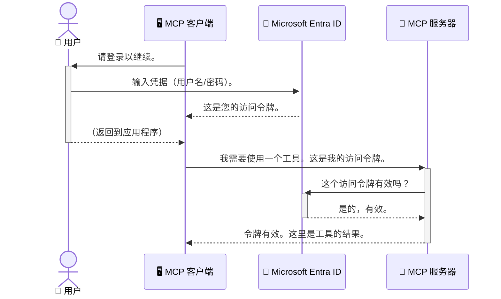

# 保护 AI 工作流：为模型上下文协议服务器启用 Entra ID 认证

## 介绍
保护您的模型上下文协议（MCP）服务器就像锁好家门一样重要。将 MCP 服务器开放会使您的工具和数据面临未经授权的访问风险，进而导致安全漏洞。Microsoft Entra ID 提供了强大的基于云的身份和访问管理解决方案，帮助确保只有授权用户和应用程序能够与您的 MCP 服务器交互。在本节中，您将学习如何通过 Entra ID 认证保护 AI 工作流。

## 学习目标
完成本节后，您将能够：

- 了解保护 MCP 服务器的重要性。
- 解释 Microsoft Entra ID 和 OAuth 2.0 认证的基础知识。
- 识别公共客户端与机密客户端的区别。
- 在本地（公共客户端）和远程（机密客户端）MCP 服务器场景中实施 Entra ID 认证。
- 在开发 AI 工作流时应用安全最佳实践。

## 安全性与 MCP

正如您不会让家门随意敞开一样，也不应让 MCP 服务器任由任何人访问。保护您的 AI 工作流对于构建强大、可信且安全的应用至关重要。本章将介绍如何使用 Microsoft Entra ID 保护 MCP 服务器，确保只有授权的用户和应用程序能够访问您的工具和数据。

## MCP 服务器安全为何重要

假设您的 MCP 服务器有一个工具可以发送电子邮件或访问客户数据库。一个未受保护的服务器意味着任何人都可能使用该工具，导致未经授权的数据访问、垃圾邮件或其他恶意活动。

通过实施认证，您确保每一个对服务器的请求都是经过验证的，确认发出请求的用户或应用程序身份。这是保护 AI 工作流的首要且最关键的步骤。

## Microsoft Entra ID 简介

[**Microsoft Entra ID**](https://adoption.microsoft.com/microsoft-security/entra/) 是一项基于云的身份和访问管理服务。可以将它看作您应用程序的通用安全卫士。它处理了验证用户身份（认证）以及确定用户权限（授权）的复杂过程。

使用 Entra ID，您可以：

- 实现安全的用户登录。
- 保护 API 和服务。
- 统一管理访问策略。

对于 MCP 服务器，Entra ID 提供了一个强大且广泛信赖的解决方案，用于管理谁可以访问服务器的功能。

---

## 认识原理：Entra ID 认证如何工作

Entra ID 使用开放标准如 **OAuth 2.0** 来处理认证。虽然细节可能复杂，但其核心概念简单，可以用一个类比来理解。

### OAuth 2.0 入门：代客钥匙

将 OAuth 2.0 想象成您汽车的代客泊车服务。当您到达餐厅时，您不会把汽车的总钥匙交给代客，而是提供一把<strong>代客钥匙</strong>，权限有限——它可以启动汽车并锁门，但无法打开后备箱或手套箱。

在这个类比中：

- <strong>您</strong> 是 <strong>用户</strong>。
- <strong>您的汽车</strong> 是拥有宝贵工具和数据的 **MCP 服务器**。
- <strong>代客</strong> 是 **Microsoft Entra ID**。
- <strong>泊车员</strong> 是试图访问服务器的 **MCP 客户端**（应用程序）。
- <strong>代客钥匙</strong> 是 **访问令牌（Access Token）**。

访问令牌是用户登录后，MCP 客户端从 Entra ID 获取的一串安全文本。客户端随每次请求向 MCP 服务器提供此令牌。服务器可以验证令牌，以确保请求合法且客户端具备必要权限，而且完全无需处理用户的真实凭据（如密码）。

### 认证流程

流程大致如下：



### 介绍 Microsoft 认证库 (MSAL)

在深入代码之前，先介绍一个您会在示例中看到的关键组件：**Microsoft 认证库 (MSAL)**。

MSAL 是微软开发的一个库，使开发者处理认证变得更加简单。您无需自己编写复杂的代码来处理安全令牌、管理登录和刷新会话，MSAL 会帮您完成大部分工作。

推荐使用 MSAL 因为：

- <strong>安全性强</strong>：它实现了业界标准协议和安全最佳实践，降低代码中出现漏洞的风险。
- <strong>简化开发</strong>：抽象了 OAuth 2.0 和 OpenID Connect 协议的复杂性，让您用几行代码就能为应用添加强健的认证。
- <strong>持续维护</strong>：微软积极维护和更新 MSAL，以应对新的安全威胁和平台变更。

MSAL 支持多种语言和应用框架，包括 .NET、JavaScript/TypeScript、Python、Java、Go 以及 iOS 和 Android 等移动平台。您可以在整个技术栈中采用一致的认证模式。

想了解更多 MSAL，可查阅官方 [MSAL 概述文档](https://learn.microsoft.com/entra/identity-platform/msal-overview)。

---

## 使用 Entra ID 保护您的 MCP 服务器：逐步指南

现在，带您演示如何使用 Entra ID 保护一个本地 MCP 服务器（通过 `stdio` 通信）。此示例使用<strong>公共客户端</strong>，适合运行在用户机器上的应用，比如桌面应用或本地开发服务器。

### 场景 1：保护本地 MCP 服务器（公共客户端）

本场景中，我们展示一个运行在本地、通过 `stdio` 通信的 MCP 服务器，使用 Entra ID 认证用户后才允许访问其工具。服务器提供一个从 Microsoft Graph API 获取用户个人资料信息的工具。

#### 1. 在 Entra ID 中设置应用

编写代码前，您需要在 Microsoft Entra ID 中注册应用。注册应用告知 Entra ID 您的应用信息，并授予其使用认证服务的权限。

1. 访问 **[Microsoft Entra 门户](https://entra.microsoft.com/)**。
2. 进入 <strong>应用注册</strong>，点击 <strong>新注册</strong>。
3. 给应用命名（例如 “My Local MCP Server”）。
4. 选择 <strong>受支持的账户类型</strong> 为 <strong>仅限此组织目录中的账户</strong>。
5. 本示例中可留空 **重定向 URI**。
6. 点击 <strong>注册</strong>。

注册成功后，记下 **应用程序（客户端）ID** 和 **目录（租户）ID**，在代码中需要用到。

#### 2. 代码解析

下面查看代码中处理认证的关键部分。完整代码可在 [mcp-auth-servers GitHub 仓库](https://github.com/Azure-Samples/mcp-auth-servers) 的 [Entra ID - Local - WAM](https://github.com/Azure-Samples/mcp-auth-servers/tree/main/src/entra-id-local-wam) 文件夹中找到。

**`AuthenticationService.cs`**

此类负责与 Entra ID 交互。

- **`CreateAsync`**：初始化 MSAL 中的 `PublicClientApplication`，配置您的应用 `clientId` 和 `tenantId`。
- **`WithBroker`**：启用使用代理（比如 Windows Web 账户管理器），提供更安全且无缝的单点登录体验。
- **`AcquireTokenAsync`**：核心方法。它首先尝试静默获取令牌（如果已有有效会话，用户无需重新登录）。若无法静默获取，则会提示用户交互式登录。

```csharp
// Simplified for clarity
public static async Task<AuthenticationService> CreateAsync(ILogger<AuthenticationService> logger)
{
    var msalClient = PublicClientApplicationBuilder
        .Create(_clientId) // Your Application (client) ID
        .WithAuthority(AadAuthorityAudience.AzureAdMyOrg)
        .WithTenantId(_tenantId) // Your Directory (tenant) ID
        .WithBroker(new BrokerOptions(BrokerOptions.OperatingSystems.Windows))
        .Build();

    // ... cache registration ...

    return new AuthenticationService(logger, msalClient);
}

public async Task<string> AcquireTokenAsync()
{
    try
    {
        // Try silent authentication first
        var accounts = await _msalClient.GetAccountsAsync();
        var account = accounts.FirstOrDefault();

        AuthenticationResult? result = null;

        if (account != null)
        {
            result = await _msalClient.AcquireTokenSilent(_scopes, account).ExecuteAsync();
        }
        else
        {
            // If no account, or silent fails, go interactive
            result = await _msalClient.AcquireTokenInteractive(_scopes).ExecuteAsync();
        }

        return result.AccessToken;
    }
    catch (Exception ex)
    {
        _logger.LogError(ex, "An error occurred while acquiring the token.");
        throw; // Optionally rethrow the exception for higher-level handling
    }
}
```

**`Program.cs`**

此文件设置 MCP 服务器并集成认证服务。

- **`AddSingleton<AuthenticationService>`**：将 `AuthenticationService` 注册进依赖注入容器，使应用其他部分（如工具）可使用。
- **`GetUserDetailsFromGraph` 工具**：此工具需要 `AuthenticationService` 实例，调用 `authService.AcquireTokenAsync()` 获取有效访问令牌。认证成功后，用令牌调用 Microsoft Graph API 获取用户信息。

```csharp
// Simplified for clarity
[McpServerTool(Name = "GetUserDetailsFromGraph")]
public static async Task<string> GetUserDetailsFromGraph(
    AuthenticationService authService)
{
    try
    {
        // This will trigger the authentication flow
        var accessToken = await authService.AcquireTokenAsync();

        // Use the token to create a GraphServiceClient
        var graphClient = new GraphServiceClient(
            new BaseBearerTokenAuthenticationProvider(new TokenProvider(authService)));

        var user = await graphClient.Me.GetAsync();

        return System.Text.Json.JsonSerializer.Serialize(user);
    }
    catch (Exception ex)
    {
        return $"Error: {ex.Message}";
    }
}
```

#### 3. 各环节协同工作流程

1. 当 MCP 客户端尝试使用 `GetUserDetailsFromGraph` 工具时，工具先调用 `AcquireTokenAsync`。
2. 该方法触发 MSAL 库检查是否有有效令牌。
3. 若无令牌，从代理启动用户交互登录窗口，登录其 Entra ID 账户。
4. 用户登录成功后，Entra ID 颁发访问令牌。
5. 工具获得令牌，用于安全请求 Microsoft Graph API。
6. MCP 客户端返回用户详细信息。

此过程确保只有通过认证的用户能使用工具，有效保护本地 MCP 服务器。

### 场景 2：保护远程 MCP 服务器（机密客户端）

当 MCP 服务器运行于远程机器（如云服务器），并通过 HTTP 流式协议通信时，安全需求不同。这时应使用<strong>机密客户端</strong>和<strong>授权码流程</strong>。该方法更安全，因为应用机密信息不会暴露给浏览器。

此示例是基于 TypeScript 的 MCP 服务器，使用 Express.js 处理 HTTP 请求。

#### 1. 在 Entra ID 中设置应用

配置与公共客户端类似，但需新增<strong>客户端密钥</strong>。

1. 访问 **[Microsoft Entra 门户](https://entra.microsoft.com/)**。
2. 在应用注册中，进入 <strong>证书和密钥</strong> 标签。
3. 点击 <strong>新建客户端密钥</strong>，填写描述，点击 <strong>添加</strong>。
4. <strong>重要</strong>：请即时复制密钥值，此后无法再次查看。
5. 配置 **重定向 URI**。进入 <strong>认证</strong> 标签，点击 <strong>添加平台</strong>，选择 **Web**，输入应用的重定向 URI（如 `http://localhost:3001/auth/callback`）。

> **⚠️ 重要安全提示：** 对于生产应用，微软强烈建议使用<strong>无密钥认证</strong>方式，如<strong>托管身份 (Managed Identity)</strong> 或 **工作负载身份联合 (Workload Identity Federation)**，而非客户端密钥。客户端密钥存在泄露风险。托管身份通过避免在代码或配置中存储凭据，提供了更安全的方案。
>
> 详情请参阅[Azure 资源托管身份概述](https://learn.microsoft.com/entra/identity/managed-identities-azure-resources/overview)。

#### 2. 代码解析

该示例采用基于会话的认证方式。用户认证后，服务器将访问令牌和刷新令牌存储在会话中，并发放会话令牌。后续请求使用此会话令牌。完整代码在 [mcp-auth-servers GitHub 仓库](https://github.com/Azure-Samples/mcp-auth-servers) 的 [Entra ID - Confidential client](https://github.com/Azure-Samples/mcp-auth-servers/tree/main/src/entra-id-cca-session) 文件夹中。

**`Server.ts`**

该文件设置 Express 服务器及 MCP 传输层。

- **`requireBearerAuth`**：中间件，保护 `/sse` 和 `/message` 端点，检查请求的 `Authorization` 头中是否有有效的 Bearer 令牌。
- **`EntraIdServerAuthProvider`**：自定义类，实现了 `McpServerAuthorizationProvider` 接口，负责处理 OAuth 2.0 流程。
- **`/auth/callback`**：处理用户认证后从 Entra ID 重定向的端点，将授权码兑换为访问令牌和刷新令牌。

```typescript
// 简化以提高清晰度
const app = express();
const { server } = createServer();
const provider = new EntraIdServerAuthProvider();

// 保护 SSE 端点
app.get("/sse", requireBearerAuth({
  provider,
  requiredScopes: ["User.Read"]
}), async (req, res) => {
  // ... 连接到传输 ...
});

// 保护消息端点
app.post("/message", requireBearerAuth({
  provider,
  requiredScopes: ["User.Read"]
}), async (req, res) => {
  // ... 处理消息 ...
});

// 处理 OAuth 2.0 回调
app.get("/auth/callback", (req, res) => {
  provider.handleCallback(req.query.code, req.query.state)
    .then(result => {
      // ... 处理成功或失败 ...
    });
});
```

**`Tools.ts`**

该文件定义 MCP 服务器提供的工具。`getUserDetails` 工具与前一示例类似，但从会话中获取访问令牌。

```typescript
// 简化以提高清晰度
server.setRequestHandler(CallToolRequestSchema, async (request) => {
  const { name } = request.params;
  const context = request.params?.context as { token?: string } | undefined;
  const sessionToken = context?.token;

  if (name === ToolName.GET_USER_DETAILS) {
    if (!sessionToken) {
      throw new AuthenticationError("Authentication token is missing or invalid. Ensure the token is provided in the request context.");
    }

    // 从会话存储中获取Entra ID令牌
    const tokenData = tokenStore.getToken(sessionToken);
    const entraIdToken = tokenData.accessToken;

    const graphClient = Client.init({
      authProvider: (done) => {
        done(null, entraIdToken);
      }
    });

    const user = await graphClient.api('/me').get();

    // ... 返回用户详细信息 ...
  }
});
```

**`auth/EntraIdServerAuthProvider.ts`**

此类处理以下逻辑：

- 重定向用户至 Entra ID 登录页面。
- 用授权码兑换访问令牌。
- 将令牌存储于 `tokenStore`。
- 刷新过期访问令牌。

#### 3. 各环节协同工作流程

1. 当用户首次尝试连接 MCP 服务器时，`requireBearerAuth` 中间件发现无有效会话，会将用户重定向到 Entra ID 登录页面。
2. 用户使用其 Entra ID 账户登录。

3. Entra ID 将用户重定向回带有授权代码的 `/auth/callback` 端点。  
4. 服务器用该代码交换访问令牌和刷新令牌，存储它们，并创建一个会话令牌发送给客户端。  
5. 客户端现在可以在所有对 MCP 服务器的后续请求中，在 `Authorization` 头中使用此会话令牌。  
6. 当调用 `getUserDetails` 工具时，它使用会话令牌查找 Entra ID 访问令牌，然后使用该令牌调用 Microsoft Graph API。  

此流程比公共客户端流程更复杂，但对于面向互联网的端点是必须的。由于远程 MCP 服务器可以通过公共互联网访问，它们需要更强的安全措施以防止未经授权的访问和潜在攻击。  


## 安全最佳实践

- **始终使用 HTTPS**：加密客户端和服务器之间的通信，防止令牌被拦截。  
- **实施基于角色的访问控制 (RBAC)**：不仅要检查用户是否已验证身份，还要检查他们被授权执行的操作。您可以在 Entra ID 中定义角色，并在 MCP 服务器中进行检查。  
- <strong>监控和审计</strong>：记录所有身份验证事件，以便检测和响应可疑活动。  
- <strong>处理速率限制和节流</strong>：Microsoft Graph 和其他 API 实施速率限制以防止滥用。 在您的 MCP 服务器中实现指数退避和重试逻辑，以优雅地处理 HTTP 429（请求过多）响应。考虑缓存经常访问的数据以减少 API 调用。  
- <strong>安全存储令牌</strong>：安全地存储访问令牌和刷新令牌。对于本地应用，使用系统的安全存储机制。对于服务器应用，考虑使用加密存储或安全密钥管理服务，如 Azure Key Vault。  
- <strong>令牌过期处理</strong>：访问令牌具有有限的生命周期。使用刷新令牌实现自动令牌刷新，确保无缝的用户体验，无需重新认证。  
- **考虑使用 Azure API Management**：虽然在 MCP 服务器中直接实施安全性为您提供细粒度的控制，但像 Azure API Management 这样的 API 网关可以自动处理许多安全问题，包括身份验证、授权、速率限制和监控。它们提供位于客户端和 MCP 服务器之间的集中安全层。有关将 API 网关与 MCP 一起使用的更多详细信息，请参见我们的[Azure API Management Your Auth Gateway For MCP Servers](https://techcommunity.microsoft.com/blog/integrationsonazureblog/azure-api-management-your-auth-gateway-for-mcp-servers/4402690)。


## 关键要点

- 保护您的 MCP 服务器对保护数据和工具至关重要。  
- Microsoft Entra ID 提供了强大且可扩展的身份验证和授权解决方案。  
- 对于本地应用，使用<strong>公共客户端</strong>；对于远程服务器，使用<strong>机密客户端</strong>。  
- <strong>授权代码流程</strong>是 Web 应用中最安全的选项。  


## 练习

1. 思考您可能构建的 MCP 服务器。它会是本地服务器还是远程服务器？  
2. 根据您的答案，您会使用公共客户端还是机密客户端？  
3. 您的 MCP 服务器会请求什么权限，以便对 Microsoft Graph 执行动作？  


## 动手练习

### 练习 1：在 Entra ID 中注册应用  
导航到 Microsoft Entra 门户。  
为您的 MCP 服务器注册新应用。  
记录应用程序（客户端）ID 和目录（租户）ID。  

### 练习 2：保护本地 MCP 服务器（公共客户端）  
- 按照代码示例集成 MSAL（Microsoft 认证库）进行用户身份验证。  
- 通过调用从 Microsoft Graph 获取用户详细信息的 MCP 工具测试身份验证流程。  

### 练习 3：保护远程 MCP 服务器（机密客户端）  
- 在 Entra ID 中注册机密客户端并创建客户端密钥。  
- 配置您的 Express.js MCP 服务器以使用授权代码流程。  
- 测试受保护的端点并确认基于令牌的访问。  

### 练习 4：应用安全最佳实践  
- 为您的本地或远程服务器启用 HTTPS。  
- 在服务器逻辑中实现基于角色的访问控制（RBAC）。  
- 添加令牌过期处理和安全的令牌存储。  

## 资源

1. **MSAL 概述文档**  
   了解 Microsoft 认证库（MSAL）如何实现跨平台的安全令牌获取：  
   [MSAL Overview on Microsoft Learn](https://learn.microsoft.com/en-gb/entra/msal/overview)  

2. **Azure-Samples/mcp-auth-servers GitHub 仓库**  
   MCP 服务器的参考实现，展示了认证流程：  
   [Azure-Samples/mcp-auth-servers on GitHub](https://github.com/Azure-Samples/mcp-auth-servers)  

3. **Azure 资源管理的托管身份概述**  
   了解如何通过使用系统分配或用户分配的托管身份消除机密：  
   [Managed Identities Overview on Microsoft Learn](https://learn.microsoft.com/en-us/entra/identity/managed-identities-azure-resources/)  

4. **Azure API Management：您的 MCP 服务器身份验证网关**  
   深入探讨如何将 APIM 用作 MCP 服务器的安全 OAuth2 网关：  
   [Azure API Management Your Auth Gateway For MCP Servers](https://techcommunity.microsoft.com/blog/integrationsonazureblog/azure-api-management-your-auth-gateway-for-mcp-servers/4402690)  

5. **Microsoft Graph 权限参考**  
   Microsoft Graph 的委托权限和应用权限完整列表：  
   [Microsoft Graph Permissions Reference](https://learn.microsoft.com/zh-tw/graph/permissions-reference)  


## 学习成果
完成本节后，您将能够：

- 阐述身份验证为何对 MCP 服务器和 AI 工作流至关重要。  
- 设置并配置 Entra ID 身份验证，适用于本地和远程 MCP 服务器场景。  
- 根据服务器部署选择合适的客户端类型（公共或机密客户端）。  
- 实施安全编码实践，包括令牌存储和基于角色的授权。  
- 自信地保护您的 MCP 服务器及其工具，防止未授权访问。  

## 后续内容

- [5.13 Model Context Protocol (MCP) 与 Microsoft Foundry 集成](../mcp-foundry-agent-integration/README.md)

---

<!-- CO-OP TRANSLATOR DISCLAIMER START -->
**免责声明**：
本文件由 AI 翻译服务 [Co-op Translator](https://github.com/Azure/co-op-translator) 翻译完成。尽管我们力求准确，但请注意，自动翻译可能包含错误或不准确之处。原始语言版文件应视为权威来源。对于重要信息，建议使用专业人工翻译。我们对因使用本翻译而产生的任何误解或误释不承担责任。
<!-- CO-OP TRANSLATOR DISCLAIMER END -->