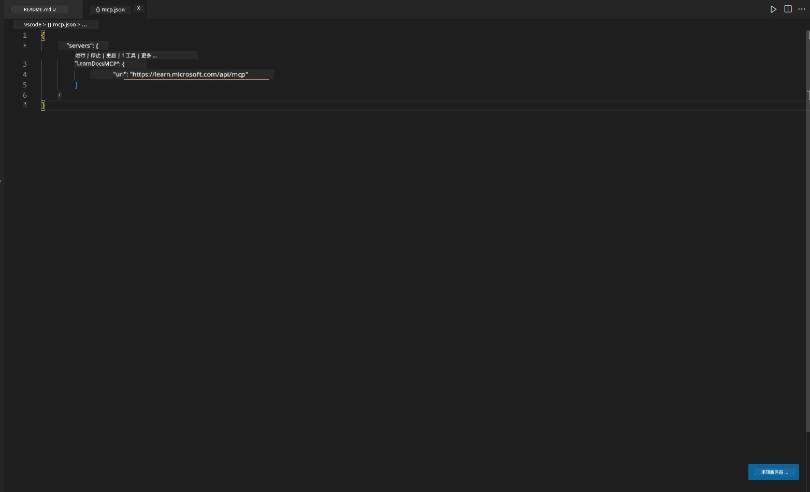
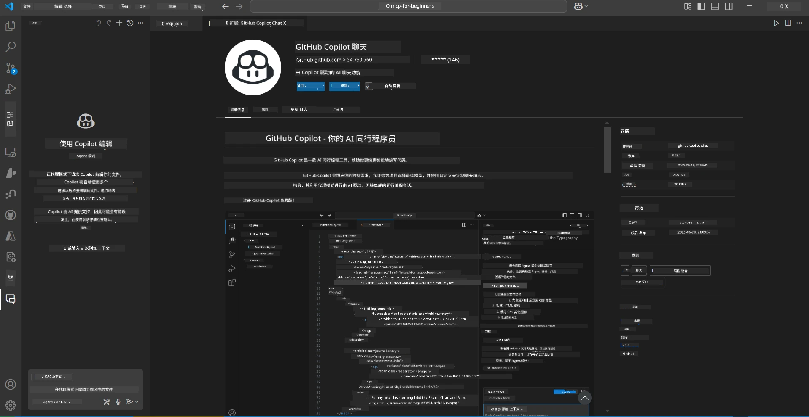
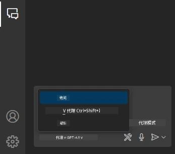
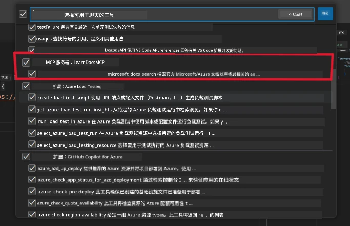
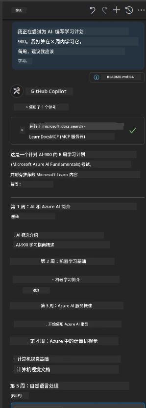
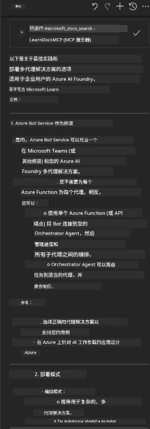

# 场景 3：在 VS Code 中使用 MCP 服务器查看编辑器内文档

## 概述

在此场景中，您将学习如何通过 MCP 服务器将 Microsoft Learn 文档直接带入您的 Visual Studio Code 环境。无需不断切换浏览器标签页查找文档，您可以在编辑器内访问、搜索和引用官方文档。这种方法简化了您的工作流程，让您更加专注，并实现与 GitHub Copilot 等工具的无缝集成。

- 在 VS Code 内部搜索和阅读文档，无需离开编码环境。
- 直接在 README 或课程文件中引用文档并插入链接。
- 将 GitHub Copilot 和 MCP 结合使用，实现无缝、AI 驱动的文档工作流程。

## 学习目标

完成本章后，您将了解如何在 VS Code 中设置和使用 MCP 服务器，以增强您的文档和开发工作流程。您将能够：

- 配置工作区以使用 MCP 服务器进行文档查询。
- 在 VS Code 内直接搜索并插入文档内容。
- 结合 GitHub Copilot 和 MCP 的强大功能，实现更高效的 AI 增强工作流程。

这些技能将帮助您保持专注，提高文档质量，并提升您作为开发者或技术写作人员的生产力。

## 解决方案

为了实现编辑器内文档访问，您将遵循一系列将 MCP 服务器与 VS Code 和 GitHub Copilot 集成的步骤。此解决方案非常适合课程作者、文档编写人员和希望在编辑器内集中精力处理文档及 Copilot 的开发人员。

- 在编写课程或项目文档时快速向 README 添加引用链接。
- 使用 Copilot 生成代码，使用 MCP 立即查找并引用相关文档。
- 保持编辑器专注，提高生产力。

### 分步指南

开始之前，请按照以下步骤操作。对于每个步骤，您可以从资源文件夹添加截图，以直观展示操作过程。

1. **添加 MCP 配置：**
   在项目根目录创建 `.vscode/mcp.json` 文件，并添加以下配置：
   ```json
   {
     "servers": {
       "LearnDocsMCP": {
         "url": "https://learn.microsoft.com/api/mcp"
       }
     }
   }
   ```
   此配置告知 VS Code 如何连接到 [`Microsoft Learn Docs MCP 服务器`](https://github.com/MicrosoftDocs/mcp)。

   
    
2. **打开 GitHub Copilot 聊天面板：**
   如果尚未安装 GitHub Copilot 扩展，请转到 VS Code 的扩展视图中进行安装。您也可以从 [Visual Studio Code Marketplace](https://marketplace.visualstudio.com/items?itemName=GitHub.copilot-chat) 直接下载安装。然后从侧边栏打开 Copilot 聊天面板。

   

3. **启用代理模式并验证工具：**
   在 Copilot 聊天面板中启用代理模式。

   

   启用代理模式后，确认 MCP 服务器是否列为可用工具之一。这确保 Copilot 代理能够访问文档服务器以获取相关信息。

   
4. **开始新聊天并提示代理：**
   在 Copilot 聊天面板中开启新聊天。您现在可以向代理提交文档查询。代理将通过 MCP 服务器获取并在编辑器中直接显示相关的 Microsoft Learn 文档。

   - *“我想为主题 X 制定一个学习计划，准备学习 8 周，请为每周建议我应该学习的内容。”*

   

5. **实时查询：**

   > 以下是来自 Microsoft Foundry Discord [#get-help](https://discord.gg/D6cRhjHWSC) 版块的实时查询（[查看原始消息](https://discord.com/channels/1113626258182504448/1385498306720829572)）：
   
   *“我想了解如何部署一个基于 Azure AI Foundry 开发的多代理解决方案。我发现没有直接的部署方法，比如 Copilot Studio 频道。那么，企业用户如何通过不同的方式进行部署，以便互动和完成工作？有很多文章/博客提到我们可以使用 Azure Bot 服务作为 MS Teams 和 Azure AI Foundry 代理之间的桥梁。如果我设置一个连接到 Azure AI Foundry 上 Orchestrator 代理的 Azure 函数的 Azure Bot 来执行协调，这样会奏效吗？还是需要为多代理解决方案中的每个 AI 代理都创建 Azure 函数，在 Bot 框架内进行协调？欢迎任何其他建议。”*

   

   代理将响应相关的文档链接和摘要，您可以直接将内容插入 markdown 文件或用作代码中的引用。
   
### 示例查询

以下是一些您可以尝试的示例查询。这些查询将演示 MCP 服务器和 Copilot 如何协同工作，在不离开 VS Code 的情况下，提供即时、上下文相关的文档和引用：

- “告诉我如何使用 Azure Functions 触发器。”
- “插入到 Azure Key Vault 官方文档的链接。”
- “保护 Azure 资源的最佳实践有哪些？”
- “查找 Azure AI 服务的快速入门指南。”

这些查询将演示 MCP 服务器和 Copilot 如何协同工作，在不离开 VS Code 的情况下，提供即时、上下文相关的文档和引用。

---

---

<!-- CO-OP TRANSLATOR DISCLAIMER START -->
**免责声明**：
本文件由 AI 翻译服务 [Co-op Translator](https://github.com/Azure/co-op-translator) 翻译完成。尽管我们力求准确，但请注意，自动翻译可能包含错误或不准确之处。原始语言版文件应视为权威来源。对于重要信息，建议使用专业人工翻译。我们对因使用本翻译而产生的任何误解或误释不承担责任。
<!-- CO-OP TRANSLATOR DISCLAIMER END -->