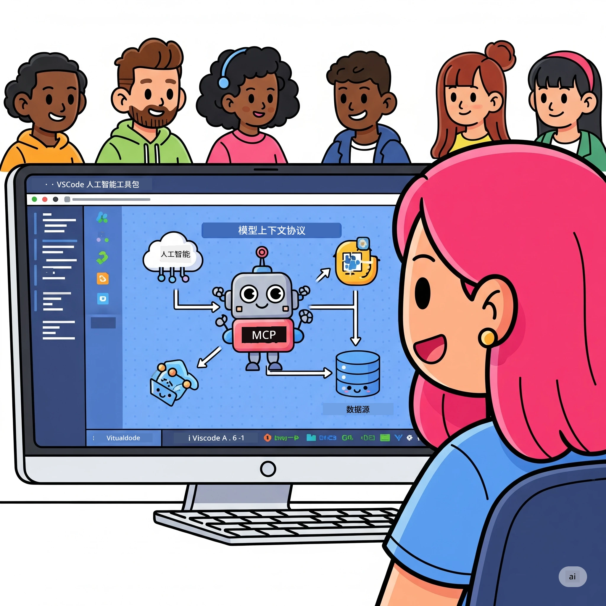
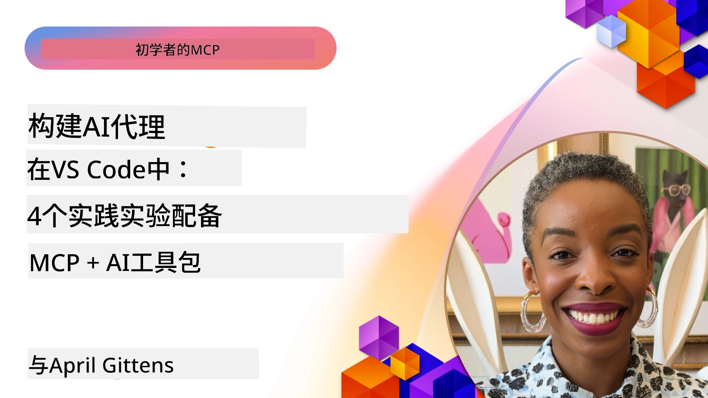

# 简化 AI 工作流：使用 Microsoft Foundry Toolkit 构建 MCP 服务器

## 🎯 概述

_(点击上方图片观看本课视频)_

欢迎参加 **模型上下文协议 (MCP) 研讨会**！本综合动手研讨会结合两种前沿技术，革新 AI 应用开发：

- **🔗 模型上下文协议（MCP）**：实现 AI 工具无缝集成的开放标准
- **🛠️ Microsoft Foundry Toolkit VS Code 扩展**：微软强大的 AI 开发扩展

### 🎓 您将学到什么

完成本研讨会后，您将掌握构建智能应用的技巧，实现 AI 模型与实际工具和服务的连接。从自动化测试到自定义 API 集成，获得解决复杂业务挑战的实用技能。

## 🏗️ 技术栈

### 🔌 模型上下文协议（MCP）

MCP 是 AI 领域的 **“USB-C”** — 为 AI 模型连接外部工具和数据源提供通用标准。

**✨ 主要特点：**

- 🔄 <strong>标准化集成</strong>：AI 工具连接的通用接口
- 🏛️ <strong>灵活架构</strong>：支持本地及远程服务器，基于 stdio/SSE 传输
- 🧰 <strong>丰富生态系统</strong>：协议内包含工具、提示和资源
- 🔒 <strong>企业级准备</strong>：内建安全性与可靠性

**🎯 MCP 的重要性：**  
正如 USB-C 解决了线缆混乱问题，MCP 消除 AI 集成的复杂性。单一协议，无限可能。

### 🤖 Microsoft Foundry Toolkit VS Code 扩展

微软旗舰 AI 开发扩展，将 VS Code 转变为 AI 强力工具。

**🚀 核心功能：**

- 📦 <strong>模型目录</strong>：访问来自 Azure AI、GitHub、Hugging Face、Ollama 的模型
- ⚡ <strong>本地推理</strong>：ONNX 优化的 CPU/GPU/NPU 执行
- 🏗️ <strong>代理构建器</strong>：视觉化 AI 代理开发，支持 MCP 集成
- 🎭 <strong>多模态支持</strong>：文本、视觉及结构化输出

**💡 开发优势：**

- 零配置模型部署
- 视觉化提示工程
- 实时测试沙盒
- 无缝 MCP 服务器集成

## 📚 学习旅程

### [🚀 模块 1：Microsoft Foundry Toolkit 基础](./lab1/README.md)

<strong>时长</strong>：15 分钟

- 🛠️ 安装配置 Microsoft Foundry Toolkit VS Code 扩展
- 🗂️ 探索模型目录（包括 GitHub、ONNX、OpenAI、Anthropic、Google 的 100+ 模型）
- 🎮 掌握交互式沙盒进行实时模型测试
- 🤖 使用代理构建器创建首个 AI 代理
- 📊 利用内置指标评估模型表现（F1、相关性、相似度、一致性）
- ⚡ 学习批量处理和多模态功能

**🎯 学习成果**：创建功能齐全的 AI 代理，全面理解 Microsoft Foundry Toolkit 功能

### [🌐 模块 2：结合 Microsoft Foundry Toolkit 的 MCP 基础](./lab2/README.md)

<strong>时长</strong>：20 分钟

- 🧠 掌握模型上下文协议（MCP）的架构和核心概念
- 🌐 探索微软 MCP 服务器生态系统
- 🤖 使用 Playwright MCP 服务器构建浏览器自动化代理
- 🔧 将 MCP 服务器整合进 Microsoft Foundry Toolkit 代理构建器
- 📊 配置并测试代理中的 MCP 工具
- 🚀 导出并部署基于 MCP 的智能代理到生产环境

**🎯 学习成果**：部署可通过 MCP 外部工具增强的 AI 代理

### [🔧 模块 3：Microsoft Foundry Toolkit 高级 MCP 开发](./lab3/README.md)

<strong>时长</strong>：20 分钟

- 💻 使用 Microsoft Foundry Toolkit 创建自定义 MCP 服务器
- 🐍 配置并使用最新 MCP Python SDK（v1.9.3）
- 🔍 设置并使用 MCP Inspector 进行调试
- 🛠️ 构建具备专业调试流程的天气 MCP 服务器
- 🧪 在代理构建器和 Inspector 环境中调试 MCP 服务器

**🎯 学习成果**：利用现代工具开发并调试自定义 MCP 服务器

### [🐙 模块 4：实战 MCP 开发 - 自定义 GitHub 克隆服务器](./lab4/README.md)

<strong>时长</strong>：30 分钟

- 🏗️ 构建用于开发流程的真实 GitHub 克隆 MCP 服务器
- 🔄 实现智能仓库克隆，包含验证与错误处理
- 📁 创建智能目录管理及 VS Code 集成
- 🤖 结合 GitHub Copilot 代理模式和自定义 MCP 工具
- 🛡️ 实现面向生产的可靠性和跨平台兼容性

**🎯 学习成果**：部署适用于真实开发流程的生产级 MCP 服务器

## 💡 真实世界应用及影响

### 🏢 企业使用案例

#### 🔄 DevOps 自动化

革命化您的开发工作流：

- <strong>智能仓库管理</strong>：AI 驱动的代码审查与合并决策
- **智能 CI/CD**：基于代码更改自动优化流水线
- <strong>问题分流</strong>：自动分类和指派 Bug

#### 🧪 质量保障革命

提升测试效率，借助 AI 自动化：

- <strong>智能测试生成</strong>：自动创建全面测试套件
- <strong>视觉回归测试</strong>：AI 驱动的 UI 变化检测
- <strong>性能监控</strong>：主动识别和解决问题

#### 📊 数据管道智能化

构建更智能的数据处理流程：

- **自适应 ETL 过程**：数据转换自我优化
- <strong>异常检测</strong>：实时数据质量监控
- <strong>智能路由</strong>：智能管理数据流转

#### 🎧 客户体验提升

打造卓越客户交互体验：

- <strong>上下文感知支持</strong>：AI 代理访问客户历史
- <strong>主动问题解决</strong>：预测式客户服务
- <strong>多渠道整合</strong>：跨平台统一 AI 体验

## 🛠️ 先决条件与安装设置

### 💻 系统要求

| 组件 | 要求 | 备注 |
|-----------|-------------|-------|
| <strong>操作系统</strong> | Windows 10 及以上，macOS 10.15 及以上，Linux | 任意现代操作系统 |
| **Visual Studio Code** | 最新稳定版本 | Microsoft Foundry Toolkit 依赖 |
| **Node.js** | v18.0 以上及 npm | 用于 MCP 服务器开发 |
| **Python** | 3.10 以上 | Python MCP 服务器可选 |
| <strong>内存</strong> | 最少 8GB RAM | 本地模型建议 16GB |

### 🔧 开发环境

#### 推荐的 VS Code 扩展

- **Microsoft Foundry Toolkit** (ms-windows-ai-studio.windows-ai-studio)
- **Python** (ms-python.python)
- **Python 调试器** (ms-python.debugpy)
- **GitHub Copilot** (GitHub.copilot) - 可选，辅助开发

#### 可选工具

- **uv**：现代 Python 包管理器
- **MCP Inspector**：MCP 服务器可视化调试工具
- **Playwright**：用于网页自动化示例

## 🎖️ 学习成果与认证路径

### 🏆 技能掌握核对清单

完成本研讨会后，您将掌握：

#### 🎯 核心能力

- [ ] **MCP 协议精通**：深入理解架构与实现模式
- [ ] **Microsoft Foundry Toolkit 精通**：专家级快速开发使用
- [ ] <strong>自定义服务器开发</strong>：构建、部署并维护生产级 MCP 服务器
- [ ] <strong>工具集成卓越</strong>：无缝连接 AI 与现有开发流程
- [ ] <strong>问题解决应用</strong>：将技能应用于实际业务挑战

#### 🔧 技术技能

- [ ] 在 VS Code 中设置并配置 Microsoft Foundry Toolkit
- [ ] 设计并实现自定义 MCP 服务器
- [ ] 将 GitHub 模型集成到 MCP 架构
- [ ] 利用 Playwright 构建自动化测试流程
- [ ] 部署 AI 代理至生产环境
- [ ] 调试并优化 MCP 服务器性能

#### 🚀 高级能力

- [ ] 设计企业级 AI 集成架构
- [ ] 实施 AI 应用安全最佳实践
- [ ] 设计可扩展的 MCP 服务器架构
- [ ] 创建针对特定领域的自定义工具链
- [ ] 指导他人进行 AI 原生开发

## 📖 额外资源

- [MCP 规范（2025-11-25）](https://spec.modelcontextprotocol.io/specification/2025-11-25/)
- [Microsoft Foundry Toolkit GitHub 仓库](https://github.com/microsoft/vscode-ai-toolkit)
- [MCP 服务器示例合集](https://github.com/modelcontextprotocol/servers)
- [最佳实践指南](https://modelcontextprotocol.io/docs/best-practices)
- [OWASP MCP 前十](https://microsoft.github.io/mcp-azure-security-guide/mcp/) - 安全最佳实践

---

**🚀 准备好革新您的 AI 开发工作流了吗？**

让我们携手使用 MCP 和 Microsoft Foundry Toolkit 构建智能应用的未来！

## 下一步

继续学习：[模块 11：MCP 服务器实操实验](../11-MCPServerHandsOnLabs/README.md)

---

<!-- CO-OP TRANSLATOR DISCLAIMER START -->
**免责声明**：
本文件由 AI 翻译服务 [Co-op Translator](https://github.com/Azure/co-op-translator) 翻译完成。尽管我们力求准确，但请注意，自动翻译可能包含错误或不准确之处。原始语言版文件应视为权威来源。对于重要信息，建议使用专业人工翻译。我们对因使用本翻译而产生的任何误解或误释不承担责任。
<!-- CO-OP TRANSLATOR DISCLAIMER END -->