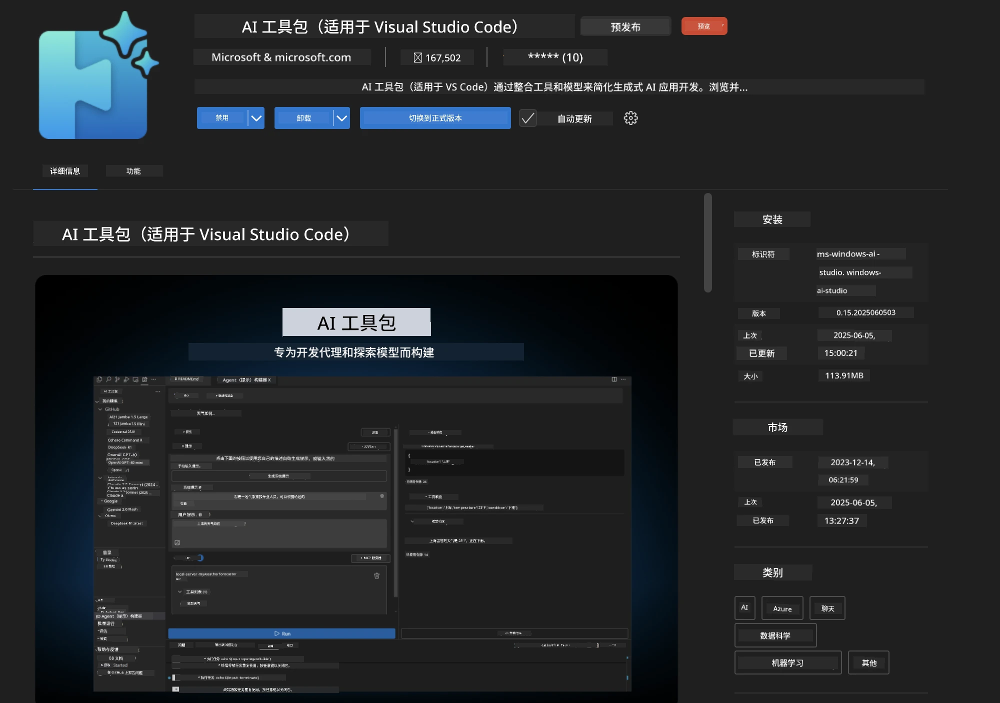
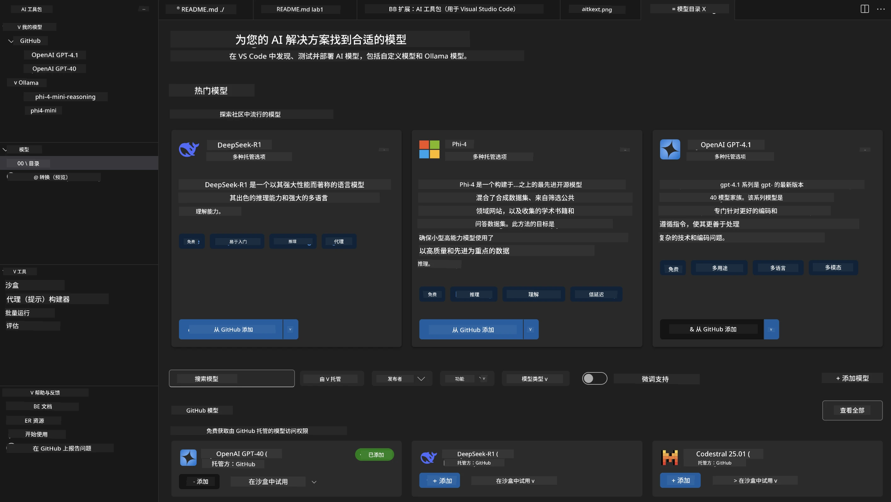
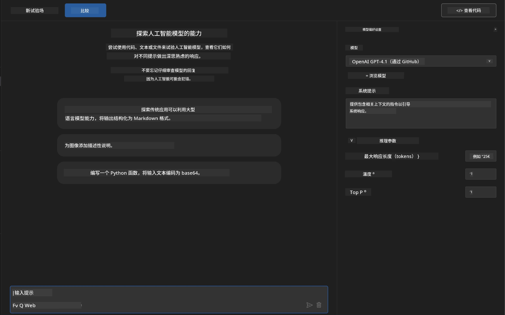
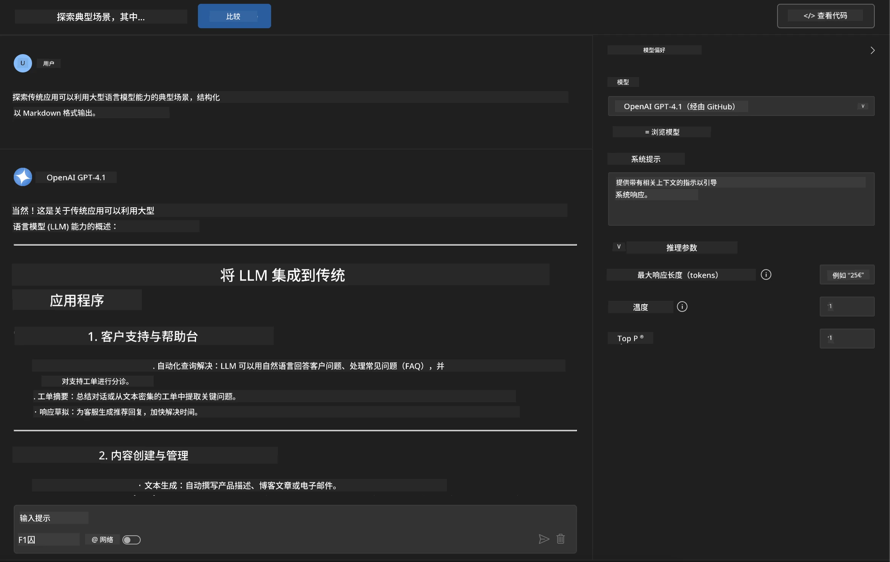
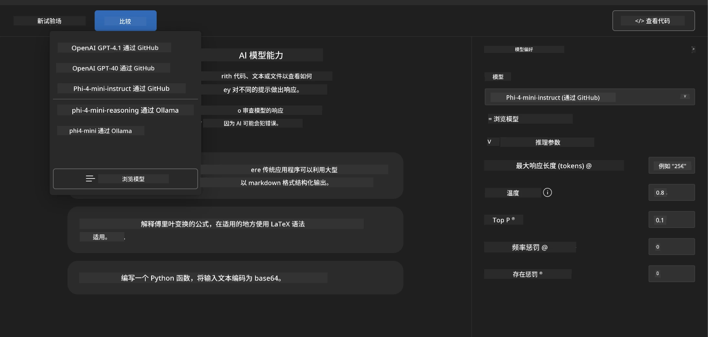
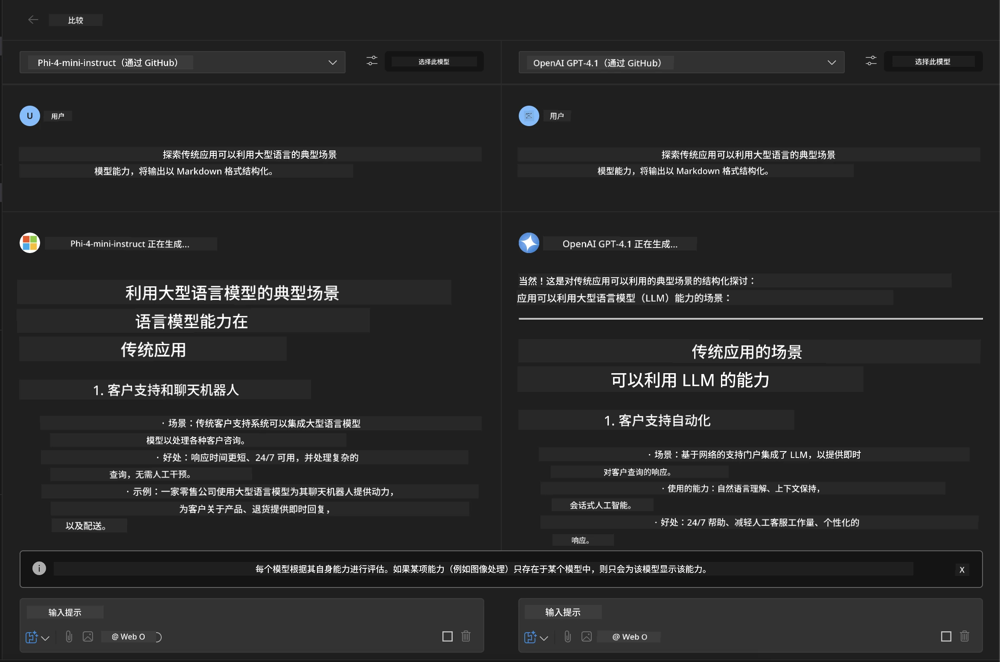
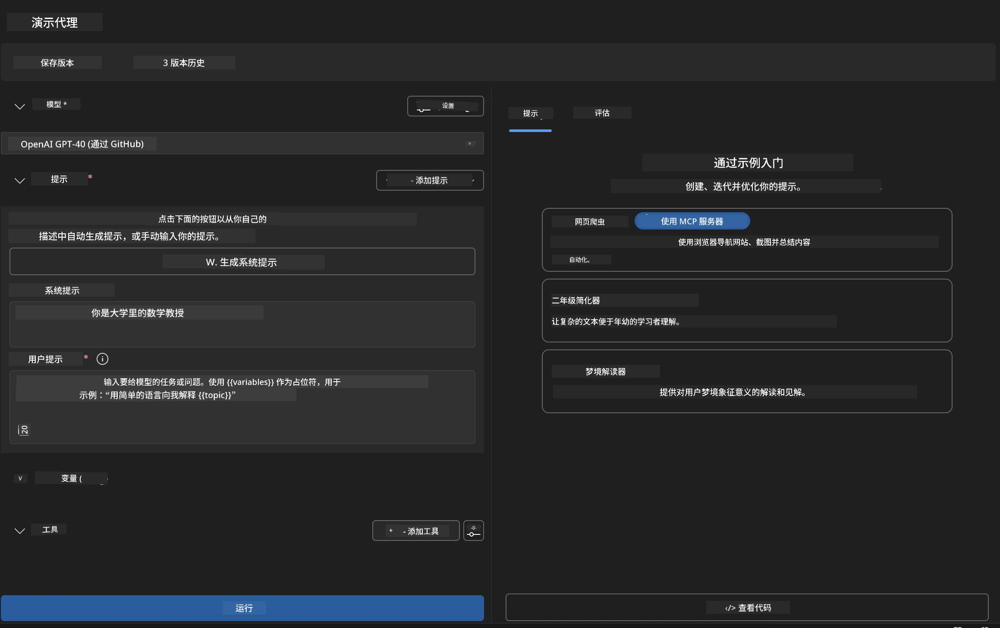
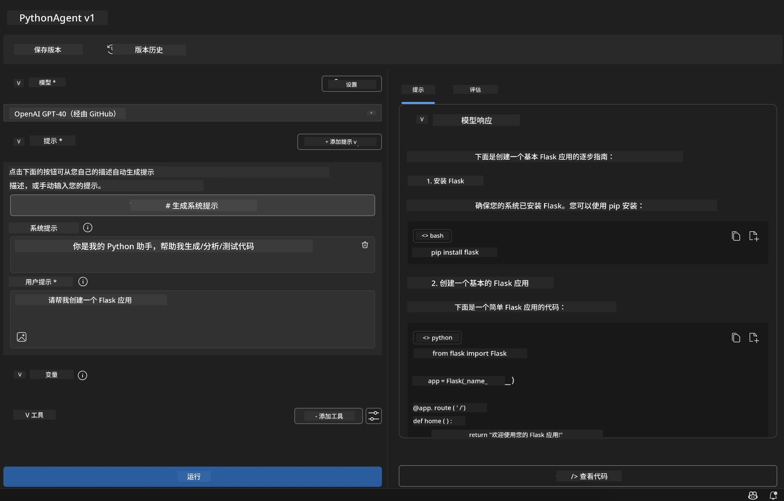

# 🚀 模块 1：Microsoft Foundry Toolkit 基础

[]()
[]()
[]()

## 📋 学习目标

完成本模块后，您将能够：
- ✅ 安装并配置 Microsoft Foundry Toolkit VS Code 扩展
- ✅ 浏览模型目录并了解不同的模型来源
- ✅ 使用 Playground 进行模型测试和实验
- ✅ 使用 Agent Builder 创建定制的 AI 代理
- ✅ 比较不同提供商的模型性能
- ✅ 应用提示工程的最佳实践

## 🧠 Microsoft Foundry Toolkit 介绍

**Microsoft Foundry Toolkit VS Code 扩展** 是微软的旗舰扩展，将 VS Code 转变为一个全面的 AI 开发环境。它弥合了 AI 研究与实际应用开发之间的鸿沟，使生成式 AI 可被各技能水平的开发者轻松访问。

### 🌟 关键功能

| 功能 | 描述 | 使用场景 |
|---------|-------------|----------|
| **🗂️ 模型目录** | 访问来自 GitHub、ONNX、OpenAI、Anthropic、Google 的 100+ 模型 | 模型发现与选择 |
| **🔌 BYOM 支持** | 集成您自己的模型（本地/远程） | 定制模型部署 |
| **🎮 交互式游乐场** | 使用聊天界面实时测试模型 | 快速原型制作和测试 |
| **📎 多模态支持** | 处理文本、图像和附件 | 复杂的 AI 应用 |
| **⚡ 批处理** | 同时运行多个提示 | 高效的测试工作流 |
| **📊 模型评估** | 内置指标（F1、相关性、相似性、一致性） | 性能评估 |

### 🎯 Microsoft Foundry Toolkit 的重要性

- **🚀 加速开发**：从想法到原型只需几分钟
- **🔄 统一工作流**：多 AI 提供商统一界面
- **🧪 轻松实验**：无需复杂配置即可比较模型
- **📈 生产就绪**：原型到部署无缝衔接

## 🛠️ 先决条件与设置

### 📦 安装 Microsoft Foundry Toolkit 扩展

**步骤 1：访问扩展市场**
1. 打开 Visual Studio Code
2. 进入扩展视图（`Ctrl+Shift+X` 或 `Cmd+Shift+X`）
3. 搜索 “Microsoft Foundry Toolkit”

**步骤 2：选择您的版本**
- **🟢 正式版**：推荐用于生产环境
- **🔶 预发布版**：抢先体验最新功能

**步骤 3：安装并激活**



### ✅ 验证清单
- [ ] VS Code 侧边栏出现 Microsoft Foundry Toolkit 图标
- [ ] 扩展已启用并激活
- [ ] 输出面板无安装错误

## 🧪 实操练习 1：探索 GitHub 模型

**🎯 目标**：掌握模型目录并测试您的首个 AI 模型

### 📊 第 1 步：浏览模型目录

模型目录是您进入 AI 生态的门户。它汇聚来自多个提供商的模型，方便发现和比较选项。

**🔍 导航指南：**

点击 Microsoft Foundry Toolkit 侧边栏中的 **MODELS - Catalog**



**💡 实用小贴士**：寻找具备匹配您用例的具体功能的模型（例如代码生成、创作写作、分析）。

**⚠️ 注意**：GitHub 托管的模型（即 GitHub 模型）可免费使用，但请求和令牌有限制。如果您想访问非 GitHub 模型（通过 Azure AI 或其他端点托管的外部模型），需要提供相应的 API 密钥或认证。

### 🚀 第 2 步：添加并配置您的第一个模型

**模型选择策略：**
- **GPT-4.1**：适合复杂推理和分析
- **Phi-4-mini**：轻量、快速响应，适合简单任务

**🔧 配置流程：**
1. 从目录中选择 **OpenAI GPT-4.1**
2. 点击 <strong>添加到我的模型</strong> — 注册模型以供使用
3. 选择 **在 Playground 中试用** 以启动测试环境
4. 等待模型初始化（首次设置可能需稍等）



**⚙️ 理解模型参数：**
- **Temperature**：控制创造力（0 = 确定性，1 = 创造性）
- **Max Tokens**：最大响应长度
- **Top-p**：核采样，控制响应多样性

### 🎯 第 3 步：熟练掌握 Playground 界面

Playground 是您的 AI 实验室。以下是发挥其潜力的关键：

**🎨 提示工程最佳实践：**
1. <strong>具体明确</strong>：清晰且详细的指令效果更佳
2. <strong>提供上下文</strong>：包括相关背景信息
3. <strong>使用示例</strong>：通过示范告知模型您的需求
4. <strong>迭代优化</strong>：根据初步结果调整提示

**🧪 测试场景：**
```markdown
# Example 1: Code Generation
"Write a Python function that calculates the factorial of a number using recursion. Include error handling and docstrings."

# Example 2: Creative Writing
"Write a professional email to a client explaining a project delay, maintaining a positive tone while being transparent about challenges."

# Example 3: Data Analysis
"Analyze this sales data and provide insights: [paste your data]. Focus on trends, anomalies, and actionable recommendations."
```



### 🏆 挑战练习：模型性能比较

**🎯 目标**：使用相同提示比较不同模型以了解其优势

**📋 说明：**
1. 将 **Phi-4-mini** 添加到您的工作区
2. 对 GPT-4.1 和 Phi-4-mini 使用同一提示



3. 比较响应质量、速度和准确性
4. 在结果部分记录您的发现



**💡 关键洞察：**
- 何时使用大语言模型 vs 小语言模型
- 成本与性能权衡
- 不同模型的专长能力

## 🤖 实操练习 2：使用 Agent Builder 构建定制代理

**🎯 目标**：创建针对特定任务与工作流的专用 AI 代理

### 🏗️ 第 1 步：了解 Agent Builder

Agent Builder 是 Microsoft Foundry Toolkit 的核心功能。它允许您创建专用 AI 助手，结合大型语言模型的能力与定制指令、特定参数和专业知识。

**🧠 代理架构组件：**
- <strong>核心模型</strong>：基础 LLM（GPT-4、Groks、Phi 等）
- <strong>系统提示</strong>：定义代理个性与行为
- <strong>参数</strong>：针对最佳性能优化的设置
- <strong>工具集成</strong>：连接外部 API 和 MCP 服务
- <strong>记忆</strong>：对话上下文与会话持久化



### ⚙️ 第 2 步：深入代理配置

**🎨 创建有效的系统提示：**
```markdown
# Template Structure:
## Role Definition
You are a [specific role] with expertise in [domain].

## Capabilities
- List specific abilities
- Define scope of knowledge
- Clarify limitations

## Behavior Guidelines
- Response style (formal, casual, technical)
- Output format preferences
- Error handling approach

## Examples
Provide 2-3 examples of ideal interactions
```

*当然，您也可以使用生成系统提示功能，让 AI 帮助生成和优化提示*

**🔧 参数优化：**
| 参数 | 推荐范围 | 使用场景 |
|-----------|------------------|----------|
| **Temperature** | 0.1-0.3 | 技术/事实回复 |
| **Temperature** | 0.7-0.9 | 创意/头脑风暴任务 |
| **Max Tokens** | 500-1000 | 简洁回复 |
| **Max Tokens** | 2000-4000 | 详细说明 |

### 🐍 第 3 步：实战演练 - Python 编程代理

**🎯 任务**：创建专用的 Python 编码助手

**📋 配置步骤：**

1. <strong>模型选择</strong>：选择 **Claude 3.5 Sonnet**（优秀的代码处理能力）

2. <strong>系统提示设计</strong>：
```markdown
# Python Programming Expert Agent

## Role
You are a senior Python developer with 10+ years of experience. You excel at writing clean, efficient, and well-documented Python code.

## Capabilities
- Write production-ready Python code
- Debug complex issues
- Explain code concepts clearly
- Suggest best practices and optimizations
- Provide complete working examples

## Response Format
- Always include docstrings
- Add inline comments for complex logic
- Suggest testing approaches
- Mention relevant libraries when applicable

## Code Quality Standards
- Follow PEP 8 style guidelines
- Use type hints where appropriate
- Handle exceptions gracefully
- Write readable, maintainable code
```

3. <strong>参数配置</strong>：
   - Temperature: 0.2 （保持代码一致且可靠）
   - Max Tokens: 2000 （详细解释）
   - Top-p: 0.9 （平衡创造力）



### 🧪 第 4 步：测试您的 Python 代理

**测试场景：**
1. <strong>基本功能</strong>：“创建一个用来查找素数的函数”
2. <strong>复杂算法</strong>：“实现包含插入、删除和搜索方法的二叉搜索树”
3. <strong>实际问题</strong>：“构建一个处理速率限制和重试的网页爬虫”
4. <strong>调试</strong>：“修复这段代码 [粘贴有缺陷的代码]”

**🏆 成功标准：**
- ✅ 代码无错误运行
- ✅ 包含合适文档
- ✅ 遵循 Python 最佳实践
- ✅ 提供清晰解释
- ✅ 提出改进建议

## 🎓 模块 1 结语与后续步骤

### 📊 知识检测

测试您的理解：
- [ ] 能否解释目录中模型的区别？
- [ ] 是否成功创建并测试了自定义代理？
- [ ] 是否理解如何针对不同用例优化参数？
- [ ] 能否设计有效的系统提示？

### 📚 额外资源

- **Microsoft Foundry Toolkit 文档**： [官方 Microsoft 文档](https://github.com/microsoft/vscode-ai-toolkit)
- <strong>提示工程指南</strong>： [最佳实践](https://platform.openai.com/docs/guides/prompt-engineering)
- **Microsoft Foundry Toolkit 中的模型**： [开发中的模型](https://github.com/microsoft/vscode-ai-toolkit/blob/main/doc/models.md)

**🎉 恭喜！** 您已掌握 Microsoft Foundry Toolkit 的基础知识，准备构建更高级的 AI 应用！

### 🔜 继续到下一模块

准备好学习更高级功能了吗？继续阅读 **[模块 2：Microsoft Foundry Toolkit MCP 基础](../lab2/README.md)**，您将学习如何：
- 使用模型上下文协议 (MCP) 将代理连接到外部工具
- 使用 Playwright 构建浏览器自动化代理
- 将 MCP 服务器与 Microsoft Foundry Toolkit 代理集成
- 通过外部数据和功能增强您的代理

---

<!-- CO-OP TRANSLATOR DISCLAIMER START -->
**免责声明**：
本文件由 AI 翻译服务 [Co-op Translator](https://github.com/Azure/co-op-translator) 翻译完成。尽管我们力求准确，但请注意，自动翻译可能包含错误或不准确之处。原始语言版文件应视为权威来源。对于重要信息，建议使用专业人工翻译。我们对因使用本翻译而产生的任何误解或误释不承担责任。
<!-- CO-OP TRANSLATOR DISCLAIMER END -->