# 🌐 模块 2：使用 Microsoft Foundry Toolkit 进行 MCP 基础

[]()
[]()
[]()

## 📋 学习目标

完成本模块后，您将能够：
- ✅ 理解模型上下文协议（MCP）架构及其优势
- ✅ 探索微软的 MCP 服务器生态系统
- ✅ 将 MCP 服务器集成到 Microsoft Foundry Toolkit Agent Builder 中
- ✅ 使用 Playwright MCP 构建功能性浏览器自动化代理
- ✅ 配置并测试代理中的 MCP 工具
- ✅ 导出并部署基于 MCP 的代理用于生产环境

## 🎯 基于模块 1 的扩展

在模块 1 中，我们掌握了 Microsoft Foundry Toolkit 的基础知识并创建了第一个 Python 代理。现在，我们将通过革命性的<strong>模型上下文协议（MCP）</strong>，让您的代理实现连接外部工具和服务的<strong>超级强化</strong>。

可以把这看作是从基础计算器升级到完整计算机——您的 AI 代理将具备以下能力：
- 🌐 浏览和交互网站
- 📁 访问和操作文件
- 🔧 集成企业系统
- 📊 处理来自 API 的实时数据

## 🧠 理解模型上下文协议（MCP）

### 🔍 什么是 MCP？

模型上下文协议（MCP）是AI应用的<strong>“USB-C”</strong>——一种革命性开放标准，连接大型语言模型（LLM）与外部工具、数据源和服务。正如 USB-C 统一了接口，消除了线缆混乱，MCP 以单一标准协议消除 AI 集成的复杂性。

### 🎯 MCP 解决的问题

**MCP 之前：**
- 🔧 每个工具都需定制集成
- 🔄 供应商锁定于专有解决方案
- 🔒 临时连接带来的安全风险
- ⏱️ 基础集成需耗费数月开发

**使用 MCP：**
- ⚡ 即插即用工具集成
- 🔄 供应商无关架构
- 🛡️ 内置安全最佳实践
- 🚀 几分钟即可新增能力

### 🏗️ MCP 架构深度解析

MCP 遵循<strong>客户端-服务器架构</strong>，构建安全且可扩展的生态系统：

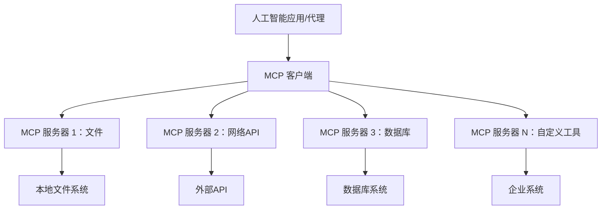

**🔧 核心组件：**

| 组件 | 角色 | 示例 |
|-----------|------|----------|
| **MCP 主机** | 消费 MCP 服务的应用 | Claude Desktop、VS Code、Microsoft Foundry Toolkit |
| **MCP 客户端** | 协议处理器（1:1 服务器关联） | 集成于主机应用 |
| **MCP 服务器** | 通过标准协议提供功能 | Playwright、Files、Azure、GitHub |
| <strong>传输层</strong> | 通讯方式 | stdio、HTTP、WebSockets |


## 🏢 微软的 MCP 服务器生态系统

微软引领 MCP 生态，提供全面的企业级服务器套件，贴合现实业务需求。

### 🌟 微软 MCP 服务器精选

#### 1. ☁️ Azure MCP 服务器
**🔗 仓库**： [azure/azure-mcp](https://github.com/azure/azure-mcp)  
**🎯 目的**：结合 AI 的全面 Azure 资源管理

**✨ 主要功能：**
- 声明式基础设施配置
- 实时资源监控
- 成本优化建议
- 安全合规检查

**🚀 使用场景：**
- 基于 AI 的基础设施即代码
- 自动资源扩展
- 云成本优化
- DevOps 工作流自动化

#### 2. 📊 Microsoft Dataverse MCP
**📚 文档**：[Microsoft Dataverse Integration](https://go.microsoft.com/fwlink/?linkid=2320176)  
**🎯 目的**：业务数据的自然语言接口

**✨ 主要功能：**
- 自然语言数据库查询
- 业务上下文理解
- 自定义提示模板
- 企业数据治理

**🚀 使用场景：**
- 商业智能报告
- 客户数据分析
- 销售管道洞察
- 合规数据查询

#### 3. 🌐 Playwright MCP 服务器
**🔗 仓库**：[microsoft/playwright-mcp](https://github.com/microsoft/playwright-mcp)  
**🎯 目的**：浏览器自动化与网页交互能力

**✨ 主要功能：**
- 跨浏览器自动化（Chrome、Firefox、Safari）
- 智能元素检测
- 截图和 PDF 生成
- 网络流量监控

**🚀 使用场景：**
- 自动化测试流程
- 网页抓取与数据提取
- UI/UX 监控
- 竞品分析自动化

#### 4. 📁 Files MCP 服务器
**🔗 仓库**：[microsoft/files-mcp-server](https://github.com/microsoft/files-mcp-server)  
**🎯 目的**：智能文件系统操作

**✨ 主要功能：**
- 声明式文件管理
- 内容同步
- 版本控制集成
- 元数据提取

**🚀 使用场景：**
- 文档管理
- 代码仓库组织
- 内容发布工作流
- 数据管道文件处理

#### 5. 📝 MarkItDown MCP 服务器
**🔗 仓库**：[microsoft/markitdown](https://github.com/microsoft/markitdown)  
**🎯 目的**：高级 Markdown 处理和操作

**✨ 主要功能：**
- 丰富的 Markdown 解析
- 格式转换（MD ↔ HTML ↔ PDF）
- 内容结构分析
- 模板处理

**🚀 使用场景：**
- 技术文档工作流
- 内容管理系统
- 报告生成
- 知识库自动化

#### 6. 📈 Clarity MCP 服务器
**📦 包**：[@microsoft/clarity-mcp-server](https://www.npmjs.com/package/@microsoft/clarity-mcp-server)  
**🎯 目的**：网页分析与用户行为洞察

**✨ 主要功能：**
- 热力图数据分析
- 用户会话录制
- 性能指标
- 转化漏斗分析

**🚀 使用场景：**
- 网站优化
- 用户体验研究
- A/B 测试分析
- 商业智能仪表盘

### 🌍 社区生态系统

除微软服务器外，MCP 生态包括：
- **🐙 GitHub MCP**：仓库管理与代码分析
- **🗄️ 数据库 MCP**：PostgreSQL、MySQL、MongoDB 集成
- **☁️ 云服务提供商 MCP**：AWS、GCP、Digital Ocean 工具
- **📧 通信 MCP**：Slack、Teams、邮箱集成

## 🛠️ 实操实验：构建浏览器自动化代理

**🎯 项目目标**：使用 Playwright MCP 服务器创建智能浏览器自动化代理，能够导航网站、提取信息并执行复杂的网页交互。

### 🚀 阶段 1：代理基础设置

#### 第 1 步：初始化您的代理
1. **打开 Microsoft Foundry Toolkit Agent Builder**  
2. <strong>新建代理</strong>，配置如下：  
   - <strong>名称</strong>：`BrowserAgent`  
   - <strong>模型</strong>：选择 GPT-4o  

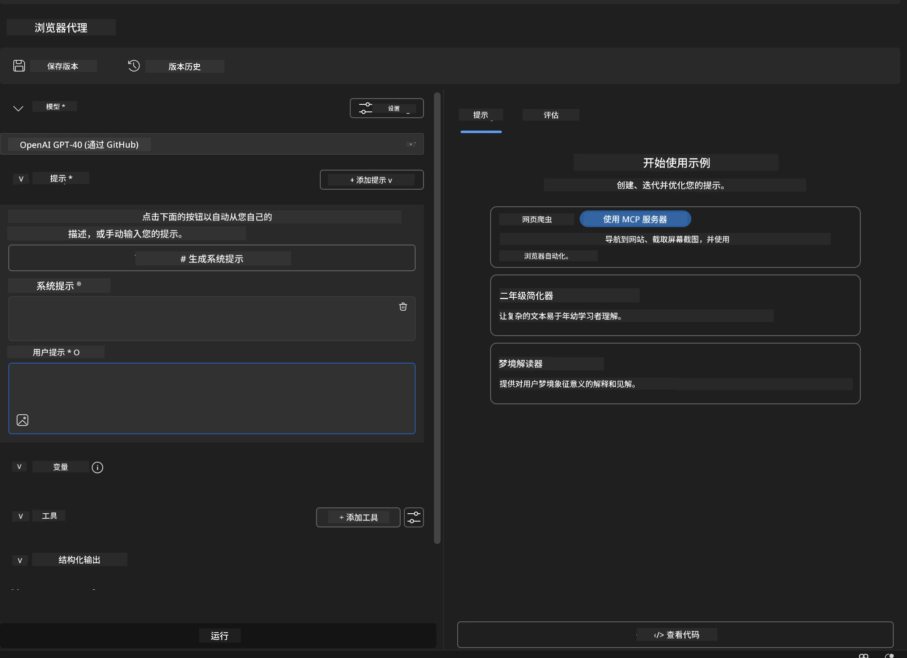


### 🔧 阶段 2：MCP 集成流程

#### 第 3 步：添加 MCP 服务器集成
1. <strong>进入代理构建器的工具部分</strong>  
2. <strong>点击“添加工具”</strong>打开集成菜单  
3. <strong>选择“ MCP 服务器”</strong>选项  

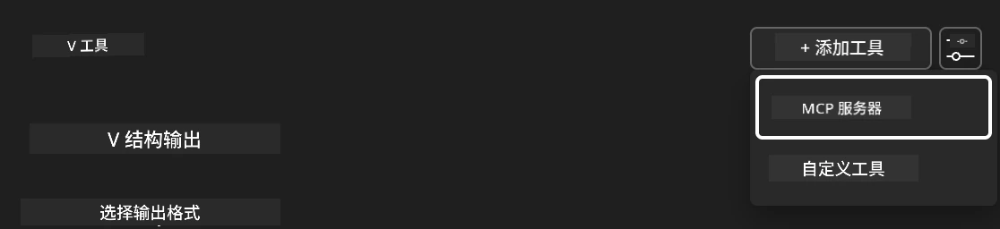

**🔍 理解工具类型：**
- <strong>内置工具</strong>：预配置的 Microsoft Foundry Toolkit 功能
- **MCP 服务器**：外部服务集成
- **自定义 API**：您自己的服务端点
- <strong>函数调用</strong>：直接访问模型函数

#### 第 4 步：选择 MCP 服务器
1. <strong>选择“MCP 服务器”</strong>继续  
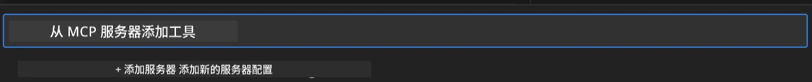

2. <strong>浏览 MCP 目录</strong>以探索可用集成  
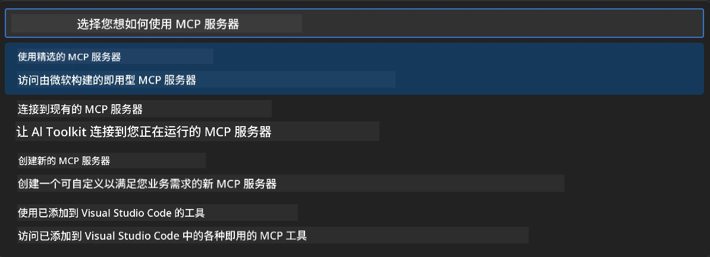


### 🎮 阶段 3：Playwright MCP 配置

#### 第 5 步：选择并配置 Playwright
1. <strong>点击“使用精选 MCP 服务器”</strong>访问微软认证服务器  
2. **从精选列表中选择“Playwright”**  
3. <strong>接受默认 MCP ID</strong>或根据环境自定义  

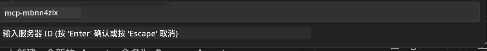

#### 第 6 步：启用 Playwright 功能
**🔑 关键步骤**：选择 Playwright 的<strong>全部</strong>方法以获得最大功能

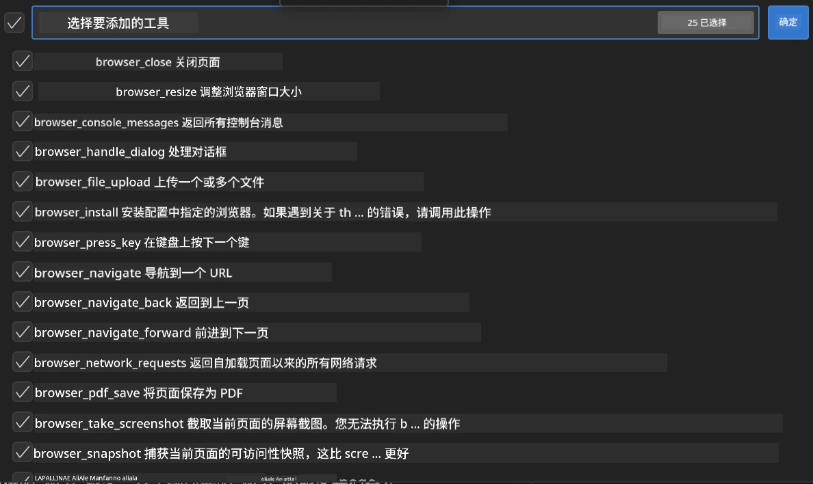

**🛠️ Playwright 必备工具：**
- <strong>导航</strong>：`goto`，`goBack`，`goForward`，`reload`
- <strong>交互</strong>：`click`，`fill`，`press`，`hover`，`drag`
- <strong>提取</strong>：`textContent`，`innerHTML`，`getAttribute`
- <strong>验证</strong>：`isVisible`，`isEnabled`，`waitForSelector`
- <strong>捕获</strong>：`screenshot`，`pdf`，`video`
- <strong>网络</strong>：`setExtraHTTPHeaders`，`route`，`waitForResponse`

#### 第 7 步：验证集成成功
**✅ 成功标志：**  
- 所有工具均显示在代理构建器界面中  
- 集成面板无错误信息  
- Playwright 服务器状态显示“已连接”  

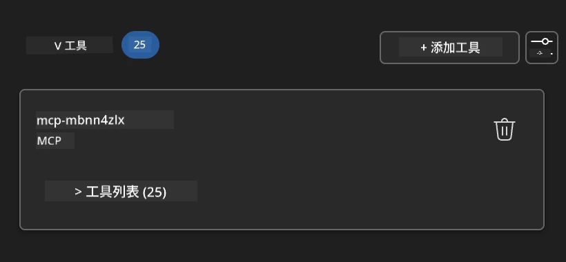

**🔧 常见问题排查：**  
- <strong>连接失败</strong>：检查网络连接和防火墙设置  
- <strong>工具缺失</strong>：确保设置过程中已勾选所有功能  
- <strong>权限错误</strong>：确认 VS Code 拥有必要的系统权限  

### 🎯 阶段 4：高级提示工程

#### 第 8 步：设计智能系统提示
创建利用 Playwright 全部功能的复杂提示：

```markdown
# Web Automation Expert System Prompt

## Core Identity
You are an advanced web automation specialist with deep expertise in browser automation, web scraping, and user experience analysis. You have access to Playwright tools for comprehensive browser control.

## Capabilities & Approach
### Navigation Strategy
- Always start with screenshots to understand page layout
- Use semantic selectors (text content, labels) when possible
- Implement wait strategies for dynamic content
- Handle single-page applications (SPAs) effectively

### Error Handling
- Retry failed operations with exponential backoff
- Provide clear error descriptions and solutions
- Suggest alternative approaches when primary methods fail
- Always capture diagnostic screenshots on errors

### Data Extraction
- Extract structured data in JSON format when possible
- Provide confidence scores for extracted information
- Validate data completeness and accuracy
- Handle pagination and infinite scroll scenarios

### Reporting
- Include step-by-step execution logs
- Provide before/after screenshots for verification
- Suggest optimizations and alternative approaches
- Document any limitations or edge cases encountered

## Ethical Guidelines
- Respect robots.txt and rate limiting
- Avoid overloading target servers
- Only extract publicly available information
- Follow website terms of service
```

#### 第 9 步：创建动态用户提示
设计展现多种能力的提示：

**🌐 网页分析示例：**
```markdown
Navigate to github.com/kinfey and provide a comprehensive analysis including:
1. Repository structure and organization
2. Recent activity and contribution patterns  
3. Documentation quality assessment
4. Technology stack identification
5. Community engagement metrics
6. Notable projects and their purposes

Include screenshots at key steps and provide actionable insights.
```

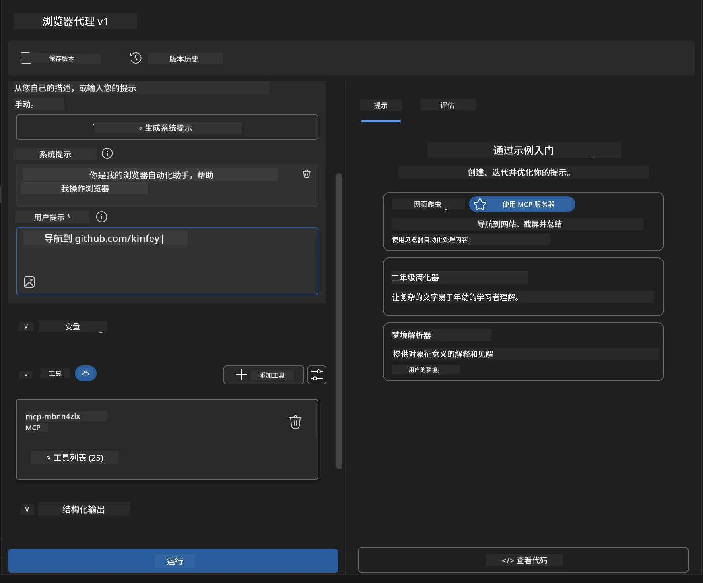

### 🚀 阶段 5：执行与测试

#### 第 10 步：执行首次自动化
1. <strong>点击“运行”</strong>启动自动化序列  
2. <strong>实时监控执行过程</strong>：  
   - 自动启动 Chrome 浏览器  
   - 代理导航至目标网站  
   - 关键步骤截图保存  
   - 分析结果实时流式展示  

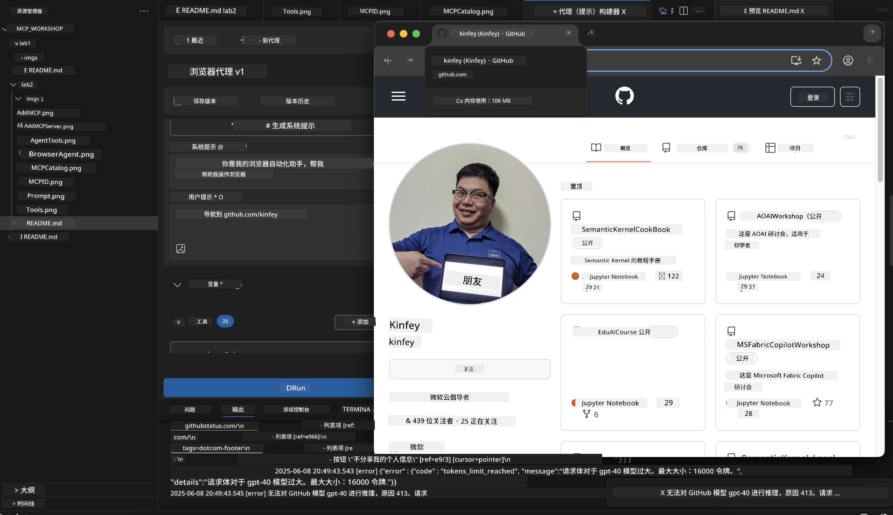

#### 第 11 步：分析结果与洞察
在代理构建器界面查看完整分析结果：

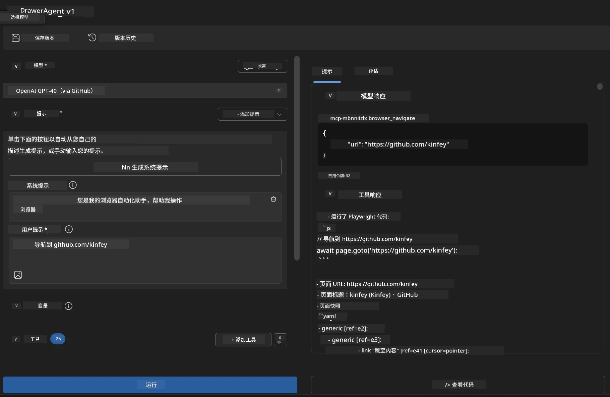

### 🌟 阶段 6：高级功能与部署

#### 第 12 步：导出与生产部署
代理构建器支持多种部署选项：

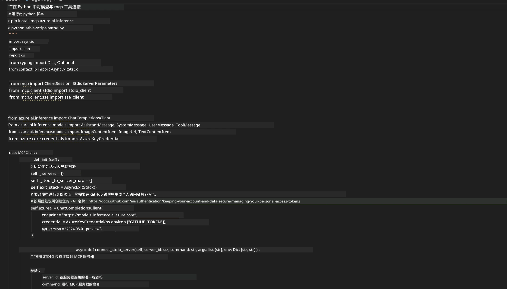

## 🎓 模块 2 总结与后续

### 🏆 成就解锁：MCP 集成大师

**✅ 掌握技能：**
- [ ] 理解 MCP 架构及优势
- [ ] 熟悉微软的 MCP 服务器生态
- [ ] 将 Playwright MCP 与 Microsoft Foundry Toolkit 集成
- [ ] 构建复杂的浏览器自动化代理
- [ ] 针对网页自动化的高级提示工程

### 📚 附加资源

- **🔗 MCP 规范**：[官方协议文档](https://modelcontextprotocol.io/)
- **🛠️ Playwright API**：[完整方法参考](https://playwright.dev/docs/api/class-playwright)
- **🏢 微软 MCP 服务器**：[企业集成指南](https://github.com/microsoft/mcp-servers)
- **🌍 社区示例**：[MCP 服务器画廊](https://github.com/modelcontextprotocol/servers)

**🎉 恭喜！** 您已成功掌握 MCP 集成，现在可以构建具备外部工具功能的生产级 AI 代理！

### 🔜 继续到下一个模块

准备好提升 MCP 技能了吗？请前往 **[模块 3：使用 Microsoft Foundry Toolkit 进行高级 MCP 开发](../lab3/README.md)**，您将学习如何：
- 创建自定义 MCP 服务器
- 配置并使用最新 MCP Python SDK
- 设置 MCP Inspector 进行调试
- 掌握高级 MCP 服务器开发工作流
- 从零打造天气 MCP 服务器

---

<!-- CO-OP TRANSLATOR DISCLAIMER START -->
**免责声明**：
本文件由 AI 翻译服务 [Co-op Translator](https://github.com/Azure/co-op-translator) 翻译完成。尽管我们力求准确，但请注意，自动翻译可能包含错误或不准确之处。原始语言版文件应视为权威来源。对于重要信息，建议使用专业人工翻译。我们对因使用本翻译而产生的任何误解或误释不承担责任。
<!-- CO-OP TRANSLATOR DISCLAIMER END -->