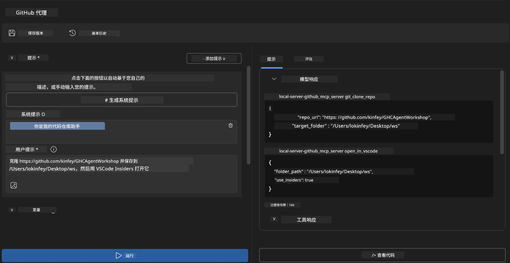
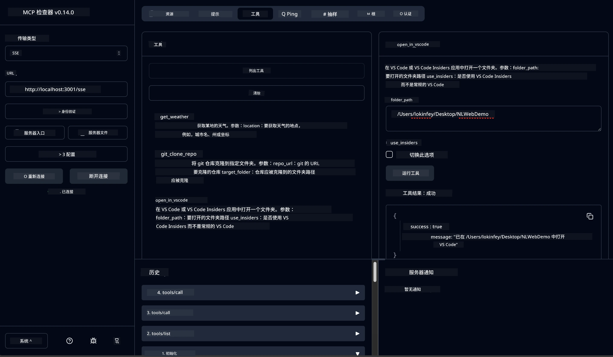

# 🐙 模块 4：实用 MCP 开发 - 自定义 GitHub 克隆服务器


> **⚡ 快速开始：** 仅用 30 分钟构建一个生产就绪的 MCP 服务器，实现 GitHub 仓库克隆和 VS Code 集成自动化！

## 🎯 学习目标

完成本实验后，您将能够：

- ✅ 创建适用于真实开发工作流的自定义 MCP 服务器
- ✅ 通过 MCP 实现 GitHub 仓库克隆功能
- ✅ 将自定义 MCP 服务器与 VS Code 及 Agent Builder 集成
- ✅ 使用 GitHub Copilot Agent 模式配合自定义 MCP 工具
- ✅ 在生产环境中测试和部署自定义 MCP 服务器

## 📋 先决条件

- 完成 Labs 1-3（MCP 基础与高级开发）
- GitHub Copilot 订阅（[可免费注册](https://github.com/github-copilot/signup)）
- 安装了 Microsoft Foundry Toolkit 和 GitHub Copilot 扩展的 VS Code
- 安装并配置好的 Git CLI

## 🏗️ 项目概述

### <strong>真实开发挑战</strong>
作为开发者，我们经常使用 GitHub 克隆仓库并在 VS Code 或 VS Code Insiders 中打开。这个手动过程包括：
1. 打开终端/命令提示符
2. 切换到目标目录
3. 运行 `git clone` 命令
4. 在克隆目录中打开 VS Code

**我们的 MCP 解决方案将其精简为一个智能命令！**

### <strong>你将构建的内容</strong>
一个 **GitHub 克隆 MCP 服务器** (`git_mcp_server`)，它提供：

| 功能 | 描述 | 优势 |
|---------|-------------|---------|
| 🔄 <strong>智能仓库克隆</strong> | 带校验的 GitHub 仓库克隆 | 自动进行错误检查 |
| 📁 <strong>智能目录管理</strong> | 安全检查并创建目录 | 防止目录覆盖 |
| 🚀 **跨平台 VS Code 集成** | 在 VS Code/Insiders 中打开项目 | 流程无缝衔接 |
| 🛡️ <strong>强健的错误处理</strong> | 处理网络、权限和路径问题 | 生产环境可靠性 |

---

## 📖 逐步实现

### 第 1 步：在 Agent Builder 中创建 GitHub Agent

1. 通过 Microsoft Foundry Toolkit 扩展启动 Agent Builder
2. 使用以下配置<strong>创建新 Agent</strong>：
   ```
   Agent Name: GitHubAgent
   ```

3. **初始化自定义 MCP 服务器：**
   - 转到 **Tools** → **Add Tool** → **MCP Server**
   - 选择 **“创建新的 MCP 服务器”**
   - 选择 **Python 模板** 以获得最大灵活性
   - **服务器名称：** `git_mcp_server`

### 第 2 步：配置 GitHub Copilot Agent 模式

1. 在 VS Code 中打开 GitHub Copilot（Ctrl/Cmd + Shift + P → “GitHub Copilot: Open”）
2. 在 Copilot 界面中选择 Agent 模型
3. 选择 **Claude 3.7 模型**，以增强推理能力
4. 启用 MCP 集成以访问工具

> **💡 专业提示：** Claude 3.7 在理解开发工作流和错误处理模式方面表现更优。

### 第 3 步：实现核心 MCP 服务器功能

**使用以下详细提示搭配 GitHub Copilot Agent 模式：**

```
Create two MCP tools with the following comprehensive requirements:

🔧 TOOL A: clone_repository
Requirements:
- Clone any GitHub repository to a specified local folder
- Return the absolute path of the successfully cloned project
- Implement comprehensive validation:
  ✓ Check if target directory already exists (return error if exists)
  ✓ Validate GitHub URL format (https://github.com/user/repo)
  ✓ Verify git command availability (prompt installation if missing)
  ✓ Handle network connectivity issues
  ✓ Provide clear error messages for all failure scenarios

🚀 TOOL B: open_in_vscode
Requirements:
- Open specified folder in VS Code or VS Code Insiders
- Cross-platform compatibility (Windows/Linux/macOS)
- Use direct application launch (not terminal commands)
- Auto-detect available VS Code installations
- Handle cases where VS Code is not installed
- Provide user-friendly error messages

Additional Requirements:
- Follow MCP 1.9.3 best practices
- Include proper type hints and documentation
- Implement logging for debugging purposes
- Add input validation for all parameters
- Include comprehensive error handling
```

### 第 4 步：测试你的 MCP 服务器

#### 4a. 在 Agent Builder 中测试

1. 启动 Agent Builder 的调试配置
2. 使用以下系统提示配置你的 Agent：

```
SYSTEM_PROMPT:
You are my intelligent coding repository assistant. You help developers efficiently clone GitHub repositories and set up their development environment. Always provide clear feedback about operations and handle errors gracefully.
```

3. 使用真实的用户场景进行测试：

```
USER_PROMPT EXAMPLES:

Scenario : Basic Clone and Open
"Clone {Your GitHub Repo link such as https://github.com/kinfey/GHCAgentWorkshop
 } and save to {The global path you specify}, then open it with VS Code Insiders"
```



**预期结果：**
- ✅ 成功克隆并确认路径
- ✅ 自动启动 VS Code
- ✅ 对无效情况显示清晰错误信息
- ✅ 正确处理边缘情况

#### 4b. 在 MCP Inspector 中测试




---


**🎉 祝贺！** 您已成功创建了一个实用的、生产就绪的 MCP 服务器，解决了真实开发流程中的挑战。您的自定义 GitHub 克隆服务器展示了 MCP 在自动化和提升开发者生产力方面的强大能力。

### 🏆 取得的成就：
- ✅ **MCP 开发者** - 创建自定义 MCP 服务器
- ✅ <strong>工作流自动化者</strong> - 简化开发流程  
- ✅ <strong>集成专家</strong> - 连接多个开发工具
- ✅ <strong>生产就绪</strong> - 构建可部署解决方案

---

## 🎓 研讨会完成：您的 Model Context Protocol 之旅

**亲爱的研讨会参与者，**

恭喜您完成 Model Context Protocol 研讨会的全部四个模块！您已经从掌握 Microsoft Foundry Toolkit 基础知识，成长为能够构建解决真实开发挑战的生产就绪 MCP 服务器的开发者。

### 🚀 您的学习路径回顾：

**[模块 1](../lab1/README.md)**：您开始探索 Microsoft Foundry Toolkit 的基础、模型测试和创建首个 AI Agent。

**[模块 2](../lab2/README.md)**：学习 MCP 架构，集成 Playwright MCP，并构建第一个浏览器自动化 Agent。

**[模块 3](../lab3/README.md)**：深入定制 MCP 服务器开发，使用天气 MCP 服务器练习，并掌握调试工具。

**[模块 4](../lab4/README.md)**：现在您将所学应用于创建实用的 GitHub 仓库工作流自动化工具。

### 🌟 您掌握的技能：

- ✅ **Microsoft Foundry Toolkit 生态**：模型、Agent 及集成模式
- ✅ **MCP 架构**：客户端-服务器设计、传输协议和安全性
- ✅ <strong>开发工具</strong>：从 Playground 到 Inspector 再到生产部署
- ✅ <strong>自定义开发</strong>：构建、测试和部署您自己的 MCP 服务器
- ✅ <strong>实用应用</strong>：用 AI 解决真实工作流问题

### 🔮 您的下一步：

1. **构建您自己的 MCP 服务器**：应用所学自动化您的独特工作流
2. **加入 MCP 社区**：分享您的创作并向他人学习
3. <strong>探索高级集成</strong>：将 MCP 服务器连接到企业系统
4. <strong>贡献开源项目</strong>：助力完善 MCP 工具和文档

请记住，研讨会只是起点。Model Context Protocol 生态正在快速发展，您已经具备领先于 AI 驱动开发工具前沿的能力。

**感谢您的参与和学习热情！**

我们希望研讨会激发了您对于如何构建和交互 AI 工具的新思路，助力您未来的开发之路。

**祝编码愉快！**

---

## 接下来是什么

恭喜您完成模块 10 的所有实验！

- 返回：[模块 10 概览](../README.md)
- 继续：[模块 11：MCP 服务器实操实验](../../11-MCPServerHandsOnLabs/README.md)

---

<!-- CO-OP TRANSLATOR DISCLAIMER START -->
**免责声明**：
本文件由 AI 翻译服务 [Co-op Translator](https://github.com/Azure/co-op-translator) 翻译完成。尽管我们力求准确，但请注意，自动翻译可能包含错误或不准确之处。原始语言版文件应视为权威来源。对于重要信息，建议使用专业人工翻译。我们对因使用本翻译而产生的任何误解或误释不承担责任。
<!-- CO-OP TRANSLATOR DISCLAIMER END -->