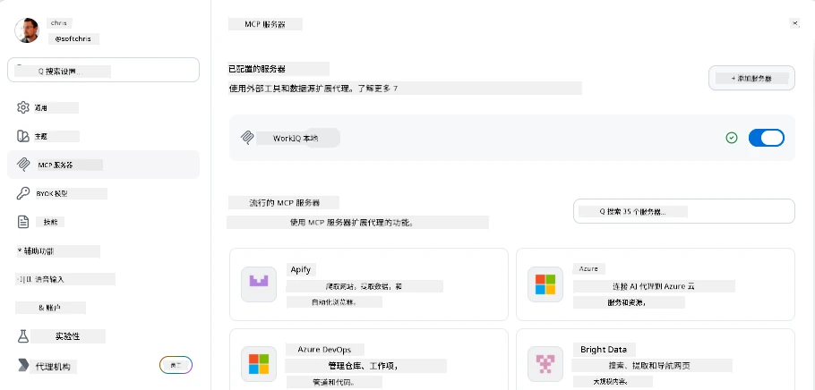
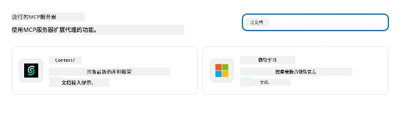
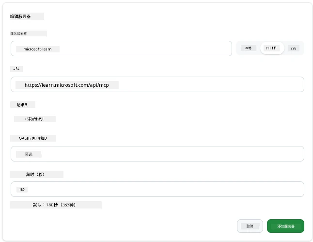
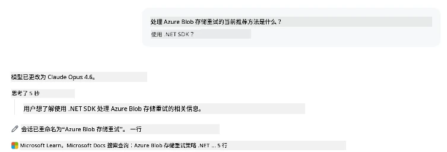
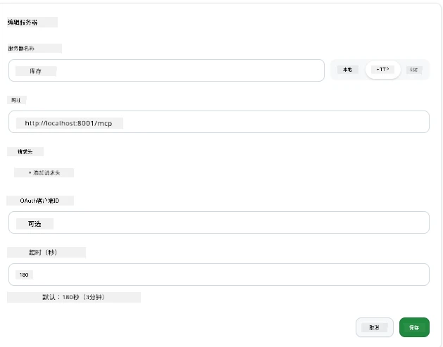
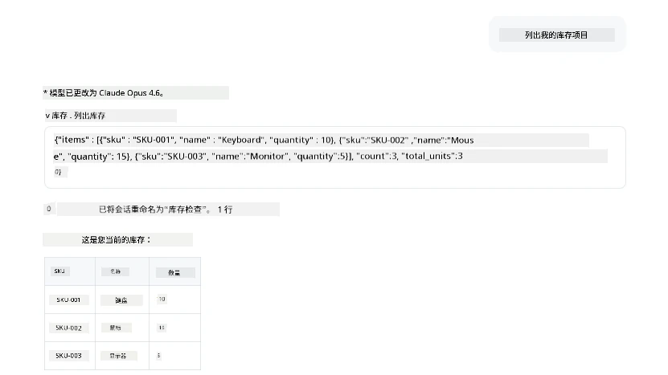
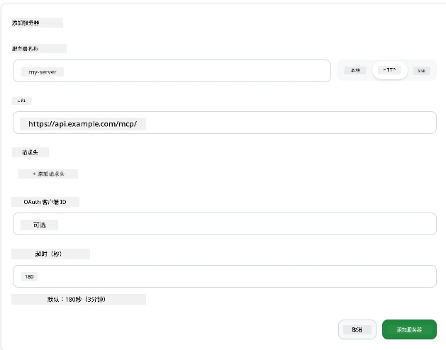
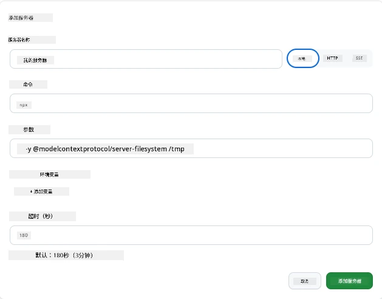

# 在 GitHub Copilot 应用中使用 MCP 服务器

到目前为止你已经了解了 MCP 是如何工作的。你已经构建了服务器，定义了工具和资源，并连接了客户端。我们还没有做的是转换视角：不是你构建服务器，而是作为一个支持 MCP 的 AI 驱动应用的用户，<em>消费</em> 这一端是什么样子？

[GitHub Copilot App](https://github.com/github/app) 是一款可以使用 MCP 服务器的桌面应用。通过连接 MCP 服务器，你可以解锁一个新层面：Copilot 现在可以访问你的文档，调用你的内部 API，查询你的数据库，或者与任何你封装在服务器中的服务交互。应用成为宿主；你的 MCP 服务器成为它的工具。

本课程将带你体验这一过程的完整流程——从找到 MCP 设置面板，到连接一个真实的文档服务器，再到自己连接一个定制服务器。

## 学习目标

完成本课程后，你将能够：

- 定位并导航 Copilot 应用中的 MCP 服务器面板。
- 连接一个托管的文档服务器并在会话中使用它。
- 注册一个自定义服务器，验证 Copilot 能调用其工具。
- 配置服务器调用方式，提供环境变量或自定义头（如果是 HTTP）。

## Copilot 应用作为 MCP 宿主

核心理念：<strong>Copilot 的代理是智能的，但它只知道你告诉它的内容。</strong>默认情况下，代理可以读取你的工作区文件和运行终端命令，但它不能查询你的数据库，查看日历，或调用自定义 API，除非有帮助。这就是 MCP 服务器的作用。它们作为 Copilot 与你的系统（数据库、版本控制、API、设计工具等）之间的桥梁，赋予代理完成工作所需的信息和操作权限。

我们先来找到管理应用中 MCP 服务器的设置。

## 第一步：找到 MCP 设置面板

打开 Copilot 应用，找到左下角的齿轮图标并点击它。


确保选择“MCP 服务器”，你应该能看到顶部已配置的服务器列表，下面是流行服务器市场，下方还有“添加服务器”按钮，如下所示：



这里是你的控制中心。你可以在这里添加、删除、启用和禁用服务器。更改对新会话生效；如果当前有会话打开，需更换配置后重新开启新会话。

## 第二步：连接一个文档服务器

让我们做点立即有用的事。Microsoft Docs MCP 服务器让 Copilot 能访问官方微软文档，包括 Azure、.NET、TypeScript 等。不用只依赖有截止日期的训练数据，代理可以实时拉取最新文档。

添加步骤如下：

1. 在流行服务器网格中，输入 **learn**，选择名为“Microsoft Learn”的服务器。

   

   点击后会出现一个表单，名称、传输类型和 URL 都已填写好，你只需点击“添加服务器”。

2. 点击“添加服务器”，连接服务器需要几秒钟。

   

   添加后应显示在顶部已配置服务器区。接下来试试它。

3. 关闭对话框，选择快速聊天。

4. 输入下面的提示以触发 Microsoft Learn 服务器上的工具。

   ```text
   What's the current recommended approach for handling Azure Blob Storage 
   retries using the .NET SDK?
   ```

   

你应该能看到它引用了我们刚添加的 MCP 服务器。

## 第三步：连接自定义 stdio 服务器

预设服务器很方便，但真正强大的是连接你自己的服务器。假设你构建了一个服务器（或者被提供了一个），它暴露了你的内部 API 或企业知识库。这里我们用一个处理公司库存管理的 MCP 服务器为例。

1. 点击齿轮，再次选择“MCP 服务器”。

2. 点击“添加服务器”，选择“+ 添加自定义服务器”，填写以下内容：

   - 名称：`Inventory Server`
   - 选择传输方式（右侧），**http**

   点击“添加服务器”，它应出现在已配置服务器列表中。

   

4. 测试用以下提示：

    ```
    list inventory
    ```

   

你应该能看到来自自定义服务器返回的库存项列表。

太棒了，现在你应该掌握了如何向 Copilot App 添加外部和自定义的 MCP 服务器。接下来，我们讲讲如何处理秘钥和环境变量。

## 第四步：高级设置

到目前为止，你看到的 MCP 服务器只需提供名称和 URL。但是如果服务器需要 API 密钥或其他值怎么办？根据传输类型，我们可以提供他们需要的内容。

- **http 或 SSE 传输**：这里可以设置所需的请求头。

   例如认证时可以指定 Authorization 头，值可以是静态字符串。如果使用 OAuth，可以提供 OAuth 客户端 ID。

   

- **stdio 传输**：可以设置环境变量。

   这里可以指定任意数量的环境变量，供启动服务器时传入。

   

## 总结

Copilot App 将 MCP 服务器视为代理能力的一级扩展。本课展示了从添加 MCP 服务器到会话中使用它们的全过程。你现在可以连接公共服务器、内部 API 和自定义工具，赋予你的代理访问完成任务所需信息和操作的能力。

## 📚 其他资源

### 官方文档

- [GitHub Copilot App](https://github.com/github/app)
- [MCP 规范](https://modelcontextprotocol.io/specification/2025-03-26) - Model Context Protocol 规范

### 社区
- [MCP 社区 Discord](https://discord.com/invite/ByRwuEEgH4) - 实时讨论
- [GitHub 讨论区](https://github.com/microsoft/MCP-Server-and-PostgreSQL-Sample-Retail/discussions) - 问答与分享
- [Stack Overflow](https://stackoverflow.com/questions/tagged/model-context-protocol) - 技术问答

---

<!-- CO-OP TRANSLATOR DISCLAIMER START -->
**免责声明**：
本文件由 AI 翻译服务 [Co-op Translator](https://github.com/Azure/co-op-translator) 翻译完成。尽管我们力求准确，但请注意，自动翻译可能包含错误或不准确之处。原始语言版文件应视为权威来源。对于重要信息，建议使用专业人工翻译。我们对因使用本翻译而产生的任何误解或误释不承担责任。
<!-- CO-OP TRANSLATOR DISCLAIMER END -->