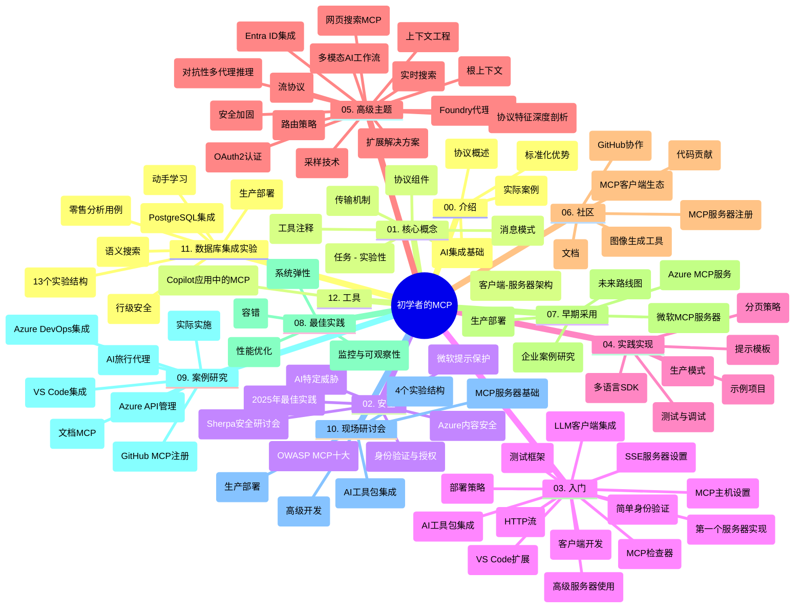

# 面向初学者的模型上下文协议 (MCP) - 学习指南

本学习指南提供了“面向初学者的模型上下文协议 (MCP)”课程的仓库结构和内容概述。使用本指南可高效浏览仓库并充分利用可用资源。

## 仓库概述

模型上下文协议 (MCP) 是用于 AI 模型与客户端应用间交互的标准化框架。最初由 Anthropic 创建，现由更广泛的 MCP 社区通过官方 GitHub 组织维护。本仓库提供全面课程，包含 C#、Java、JavaScript、Python 和 TypeScript 的实操代码示例，面向 AI 开发人员、系统架构师和软件工程师。

## 课程视觉地图

## 仓库结构

仓库分为十二个主要部分，每部分聚焦 MCP 的不同方面：

1. **简介 (00-Introduction/)**
   - 模型上下文协议概述
   - AI 流水线中标准化的重要性
   - 实际用例与优势

2. **核心概念 (01-CoreConcepts/)**
   - 客户端-服务器架构
   - 关键协议组件
   - MCP 中的消息模式

3. **安全性 (02-Security/)**
   - 基于 MCP 的系统中的安全威胁
   - 实现安全的最佳实践
   - 身份验证和授权策略
   - <strong>全面安全文档</strong>：
     - 2025 年 MCP 安全最佳实践
     - Azure 内容安全实施指南
     - MCP 安全控制与技术
     - MCP 最佳实践快速参考
   - <strong>关键安全话题</strong>：
     - 提示注入和工具中毒攻击
     - 会话劫持与混淆代理问题
     - 令牌透传漏洞
     - 权限过度及访问控制
     - AI 组件的供应链安全
     - 集成微软提示盾牌

4. **入门指南 (03-GettingStarted/)**
   - 环境搭建与配置
   - 创建基础 MCP 服务器和客户端
   - 与现有应用整合
   - 包含模块：
     - 第一个服务器实现
     - 客户端开发
     - LLM 客户端集成
     - VS Code 集成
     - 服务器推送事件 (SSE) 服务器
     - 高级服务器使用
     - HTTP 流式传输
     - AI 工具包集成
     - 测试策略
     - 部署指南

5. **实用实现 (04-PracticalImplementation/)**
   - 使用不同编程语言的 SDK
   - 调试、测试与验证技巧
   - 制作可复用的提示模板和工作流
   - 实例项目与实现示例

6. **高级主题 (05-AdvancedTopics/)**
   - 上下文工程技术
   - Foundry 代理集成
   - 多模态 AI 工作流
   - OAuth2 身份验证演示
   - 实时搜索能力
   - 实时流处理
   - 根上下文实现
   - 路由策略
   - 采样技术
   - 扩展方案
   - 安全考量
   - Entra ID 安全集成
   - 网络搜索集成
   - 对抗性多代理推理（辩论模式）

7. **社区贡献 (06-CommunityContributions/)**
   - 如何贡献代码和文档
   - 通过 GitHub 协作
   - 社区驱动的增强与反馈
   - 使用多种 MCP 客户端（Claude 桌面版、Cline、VSCode）
   - 配合流行 MCP 服务器，包括图像生成

8. **早期采用经验 (07-LessonsfromEarlyAdoption/)**
   - 真实世界实现与成功案例
   - 基于 MCP 的解决方案构建与部署
   - 趋势与未来路线图
   - **微软 MCP 服务器指南**：涵盖 10 个生产就绪的微软 MCP 服务器，包括：
     - Microsoft Learn Docs MCP 服务器
     - Azure MCP 服务器（15+ 专业连接器）
     - GitHub MCP 服务器
     - Azure DevOps MCP 服务器
     - MarkItDown MCP 服务器
     - SQL Server MCP 服务器
     - Playwright MCP 服务器
     - Dev Box MCP 服务器
     - Microsoft Foundry MCP 服务器
     - Microsoft 365 Agents Toolkit MCP 服务器

9. **最佳实践 (08-BestPractices/)**
   - 性能调优与优化
   - 设计容错性的 MCP 系统
   - 测试及弹性策略

10. **案例研究 (09-CaseStudy/)**
    - <strong>七个全面案例研究</strong>，展现 MCP 在不同场景的多样性：
    - **Azure AI 行程代理**：使用 Azure OpenAI 和 AI 搜索的多代理编排
    - **Azure DevOps 集成**：借助 YouTube 数据自动化工作流
    - <strong>实时文档检索</strong>：带流式 HTTP 的 Python 控制台客户端
    - <strong>交互式学习计划生成器</strong>：基于 Chainlit 的对话式 AI Web 应用
    - <strong>编辑器中的文档</strong>：VS Code 集成 GitHub Copilot 工作流
    - **Azure API 管理**：企业 API 集成及 MCP 服务器创建
    - **GitHub MCP 注册中心**：生态发展与代理集成平台
    - 涉及企业集成、开发者生产力和生态系统开发的实现示例

11. **实操研讨会 (10-StreamliningAIWorkflowsBuildingAnMCPServerWithAIToolkit/)**
    - 结合 MCP 与 AI 工具包的全面实操研讨会
    - 构建连接 AI 模型和现实工具的智能应用
    - 实用模块涵盖基础、定制服务器开发和生产部署策略
    - <strong>实验室结构</strong>：
      - 实验室 1：MCP 服务器基础
      - 实验室 2：高级 MCP 服务器开发
      - 实验室 3：AI 工具包集成
      - 实验室 4：生产部署与扩展
    - 基于实验室的学习，逐步指导

12. **MCP 服务器数据库集成实验室 (11-MCPServerHandsOnLabs/)**
    - **全面的 13 个实验室学习路径**，构建生产级 MCP 服务器，集成 PostgreSQL
    - **使用 Zava Retail 零售用例的真实场景实现**
    - <strong>企业级模式</strong>，包括行级安全（RLS）、语义搜索和多租户数据访问
    - <strong>完整实验室结构</strong>：
      - **实验室 00-03：基础** - 介绍、架构、安全、环境配置
      - **实验室 04-06：搭建 MCP 服务器** - 数据库设计、MCP 服务器实现、工具开发
      - **实验室 07-09：高级功能** - 语义搜索、测试与调试、VS Code 集成
      - **实验室 10-12：生产与最佳实践** - 部署、监控、优化
    - <strong>涵盖技术</strong>：FastMCP 框架、PostgreSQL、Azure OpenAI、Azure 容器应用、应用洞察
    - <strong>学习成果</strong>：生产级 MCP 服务器、数据库集成模式、AI 驱动的分析、企业安全

13. **工具链 (12-tooling/)**
    - 学习如何在 Copilot 应用和其他工具中使用 MCP

## 附加资源

仓库包括支持资源：

- **Images 文件夹**：课程中使用的图表和插图
- <strong>翻译</strong>：文档多语言支持及自动翻译
- **官方 MCP 资源**：
  - [MCP 文档](https://modelcontextprotocol.io/)
  - [MCP 规范](https://spec.modelcontextprotocol.io/)
  - [MCP GitHub 仓库](https://github.com/modelcontextprotocol)

## 如何使用本仓库

1. <strong>顺序学习</strong>：按章节顺序（00 到 11）学习，结构化学习体验。
2. <strong>语言专项</strong>：若关注特定编程语言，浏览样例目录查找对应实现。
3. <strong>实用实现</strong>：从“入门指南”开始，搭建环境并创建首个 MCP 服务器与客户端。
4. <strong>高级探索</strong>：掌握基础后，深入高级主题扩展知识。
5. <strong>社区参与</strong>：通过 GitHub 讨论和 Discord 频道加入 MCP 社区，与专家和开发者交流。

## MCP 客户端与工具

课程涵盖多种 MCP 客户端和工具：

1. <strong>官方客户端</strong>：
   - Visual Studio Code
   - Visual Studio Code 中的 MCP
   - Claude 桌面版
   - VSCode 中的 Claude
   - Claude API

2. <strong>社区客户端</strong>：
   - Cline（终端）
   - Cursor（代码编辑器）
   - ChatMCP
   - Windsurf

3. **MCP 管理工具**：
   - MCP CLI
   - MCP Manager
   - MCP Linker
   - MCP Router

## 流行 MCP 服务器

仓库介绍多种 MCP 服务器，包括：

1. **微软官方 MCP 服务器**：
   - Microsoft Learn Docs MCP 服务器
   - Azure MCP 服务器（15+ 专业连接器）
   - GitHub MCP 服务器
   - Azure DevOps MCP 服务器
   - MarkItDown MCP 服务器
   - SQL Server MCP 服务器
   - Playwright MCP 服务器
   - Dev Box MCP 服务器
   - Microsoft Foundry MCP 服务器
   - Microsoft 365 Agents Toolkit MCP 服务器

2. <strong>官方参考服务器</strong>：
   - 文件系统
   - Fetch
   - 内存
   - 顺序思维

3. <strong>图像生成</strong>：
   - Azure OpenAI DALL-E 3
   - Stable Diffusion WebUI
   - Replicate

4. <strong>开发工具</strong>：
   - Git MCP
   - 终端控制
   - 代码助手

5. <strong>专业服务器</strong>：
   - Salesforce
   - Microsoft Teams
   - Jira 与 Confluence

## 贡献

欢迎社区贡献代码与文档。详见社区贡献章节，了解如何高效助力 MCP 生态系统。

----

*本学习指南最后更新于 2026 年 2 月 5 日，反映最新 MCP 规范 2025-11-25，并提供当时仓库内容概述。仓库内容可能在此日期后更新。*

---

<!-- CO-OP TRANSLATOR DISCLAIMER START -->
**免责声明**：
本文件由 AI 翻译服务 [Co-op Translator](https://github.com/Azure/co-op-translator) 翻译完成。尽管我们力求准确，但请注意，自动翻译可能包含错误或不准确之处。原始语言版文件应视为权威来源。对于重要信息，建议使用专业人工翻译。我们对因使用本翻译而产生的任何误解或误释不承担责任。
<!-- CO-OP TRANSLATOR DISCLAIMER END -->