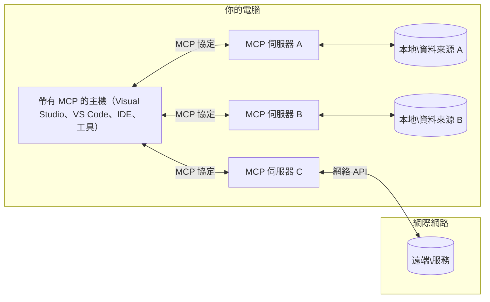

# MCP 核心概念：掌握用於 AI 集成的模型上下文協議

[](https://youtu.be/earDzWGtE84)

_(點擊上方圖片觀看本課程影片)_

[模型上下文協議 (Model Context Protocol, MCP)](https://github.com/modelcontextprotocol) 是一個強大且標準化的框架，優化大型語言模型（LLM）與外部工具、應用程式及資料來源之間的通訊。
本指南將引導你了解 MCP 的核心概念，讓你熟悉其客戶端-伺服器架構、主要組件、通訊機制及實作最佳實踐。

- **明確的用戶同意**：所有資料存取及操作均需用戶明確批准後方可執行。用戶必須清楚了解將存取哪些資料及執行哪些動作，並可對權限與授權進行細部控制。

- **資料隱私保護**：用戶資料僅於明確同意下揭露，且須在整個互動生命週期內透過嚴密存取控制加以保護。實作須防止未授權資料傳送並維護嚴格的隱私邊界。

- **工具執行安全**：每次工具調用均須用戶明確同意，並清楚理解工具的功能、參數及可能影響。須建立強健的安全邊界，防止非預期、不安全或惡意的工具執行。

- **傳輸層安全**：所有通訊通道應採用適當的加密與認證機制。遠端連線須實施安全的傳輸協定及妥善的憑證管理。

#### 實作指南：

- **權限管理**：實施細緻的權限系統，允許用戶控制可存取的伺服器、工具與資源
- **身份認證與授權**：使用安全的認證方法（OAuth、API 金鑰），搭配適當的令牌管理與過期機制
- **輸入驗證**：依照定義的架構校驗所有參數及資料輸入，以防止注入攻擊
- **稽核日誌**：維護全面的操作記錄，以利安全監控與合規性

## 概覽

本課程探討組成模型上下文協議（MCP）生態系的基礎架構與元件。你將了解客戶端-伺服器架構、主要組件，以及推動 MCP 互動的通訊機制。

## 主要學習目標

完成本課程後，你將會：

- 理解 MCP 的客戶端-伺服器架構。
- 辨識 Host、Client 與 Server 的角色與職責。
- 分析使 MCP 成為靈活整合層的核心特色。
- 學習 MCP 生態系中資訊流動方式。
- 透過 .NET、Java、Python 及 JavaScript 的程式碼範例獲得實務見解。

## MCP 架構：深入解析

MCP 生態系基於客戶端-伺服器模型建構。這種模組化結構使 AI 應用程式能有效率地與工具、資料庫、API 及情境化資源互動。以下將此架構細分為核心組件。

MCP 基本採用客戶端-伺服器架構，由一個 Host 應用程式連接多個伺服器組成：


- **MCP Hosts**：像是 VSCode、Claude Desktop、IDE 或希望透過 MCP 存取資料的 AI 工具
- **MCP Clients**：維護與伺服器 1:1 連接的協議客戶端
- **MCP Servers**：各自透過標準化模型上下文協議暴露特定功能的輕量程式
- **本地資料來源**：你的電腦檔案、資料庫和 MCP 伺服器可安全存取的服務
- **遠端服務**：透過 API 連接，MCP 伺服器可存取的互聯網外部系統

MCP 協議使用日期版本標記（YYYY-MM-DD 格式）持續演進。當前協議版本為 **2025-11-25**。你可瀏覽最新更新的[協議規範](https://modelcontextprotocol.io/specification/2025-11-25/)。

### 1. Hosts

在模型上下文協議（MCP）中，**Hosts** 是作為主要介面的 AI 應用程式，使用戶能透過它們與協議互動。Hosts 負責協調並管理與多個 MCP 伺服器的連線，為每個伺服器連線建立專屬的 MCP 客戶端。Hosts 範例包括：

- **AI 應用程式**：Claude Desktop、Visual Studio Code、Claude Code
- **開發環境**：整合 MCP 的 IDE 及程式碼編輯器
- **自訂應用程式**：專門打造的 AI 代理與工具

**Hosts** 是協調 AI 模型互動的應用程式。他們：

- **協調 AI 模型**：執行或與 LLM 互動生成回應及管理 AI 工作流程
- **管理客戶端連線**：為每個 MCP 伺服器連線建立及維護一個 MCP 客戶端
- **控制用戶介面**：處理對話流程、用戶互動及回應呈現
- **執行安全控管**：管理權限、安全限制及認證
- **處理用戶同意**：管理用戶對資料共享和工具執行的批准

### 2. Clients

**Clients** 是不可或缺的組件，負責維護 Hosts 與 MCP 伺服器間一對一的專用連線。Host 為連接特定伺服器建立的每個 MCP 客戶端，確保通訊通道有序且安全。多個客戶端允許 Host 同時連接多個伺服器。

**Clients** 是 Host 應用程式內的連接元件。他們：

- **協議通訊**：利用 JSON-RPC 2.0 向伺服器發送提示與指令請求
- **能力協商**：在初始化階段與伺服器協商支援的功能與協議版本
- **工具執行**：管理模型的工具執行請求並處理回應
- **即時更新**：處理來自伺服器的通知及即時更新
- **回應處理**：處理並格式化伺服器回應以呈現給用戶

### 3. Servers

**Servers** 是為 MCP 客戶端提供上下文、工具與功能的程式。可於本機（與 Host 同一台機器）或遠端（外部平台）執行，負責處理客戶端請求並提供結構化回應。伺服器透過標準化模型上下文協議暴露特定功能。

**Servers** 是提供上下文與功能的服務。他們：

- **功能註冊**：向客戶端註冊並暴露可用的原語（資源、提示、工具）
- **請求處理**：接收並執行客戶端的工具呼叫、資源請求和提示請求
- **上下文供應**：提供上下文資訊與資料以增強模型回應
- **狀態管理**：維持會話狀態並在需要時處理有狀態互動
- **即時通知**：向連線客戶端發送有關能力變更及更新的通知

伺服器可由任何人開發，以專門化功能擴展模型能力，並支援本地與遠端部署。

### 4. 伺服器原語

模型上下文協議（MCP）中的伺服器提供三種核心 **原語**，定義了客戶端、Host 與語言模型之間豐富互動的基礎構件。這些原語指定了透過協議可使用的上下文資訊與動作類型。

MCP 伺服器可選擇同時暴露以下三種核心原語的任意組合：

#### 資源

**資源** 是為 AI 應用程式提供上下文資訊的資料來源。它們代表可增強模型理解與決策的靜態或動態內容：

- **上下文資料**：供 AI 模型使用的結構化資訊與情境
- **知識庫**：文件庫、文章、手冊與研究論文
- **本地資料來源**：檔案、資料庫與本地系統資訊
- **外部資料**：API 回應、網路服務與遠端系統資料
- **動態內容**：根據外部狀況更新的即時資料

資源以 URI 識別並支援透過 `resources/list` 查詢及 `resources/read` 取用：

```text
file://documents/project-spec.md
database://production/users/schema
api://weather/current
```

#### 提示

**提示** 是用於結構化與語言模型互動的可重複使用範本。它們提供標準化的互動模式及範本化工作流程：

- **基於範本的互動**：預先結構化的訊息及對話起始語
- **工作流程範本**：常用任務與互動的標準序列
- **少量示例**：用於模型指令的範例範本
- **系統提示**：定義模型行為與上下文的基礎提示
- **動態範本**：可參數化提示，適應特定上下文

提示支援變數替換，可透過 `prompts/list` 查詢及 `prompts/get` 取得：

```markdown
Generate a {{task_type}} for {{product}} targeting {{audience}} with the following requirements: {{requirements}}
```

#### 工具

**工具** 是 AI 模型可調用以執行特定動作的可執行函數。它們是 MCP 生態系中的「動詞」，使模型能與外部系統互動：

- **可執行函數**：模型可使用特定參數調用的離散操作
- **外部系統整合**：API 呼叫、資料庫查詢、檔案操作、計算
- **獨特識別**：每個工具具明確名稱、說明與參數結構
- **結構化輸入輸出**：工具接受驗證參數並回傳結構化、類型化的回應
- **操作能力**：使模型能執行真實世界動作與取得即時資料

工具以 JSON Schema 描述參數驗證，並可透過 `tools/list` 查找及 `tools/call` 執行。工具還可包含**圖示**作為附加資訊以優化 UI 表現。

**工具註解**：工具支援行為註解（如 `readOnlyHint`、`destructiveHint`），描述工具是否唯讀或具毀損性，協助客戶端就工具執行做出明智判斷。

工具定義範例：

```typescript
server.tool(
  "search_products", 
  {
    query: z.string().describe("Search query for products"),
    category: z.string().optional().describe("Product category filter"),
    max_results: z.number().default(10).describe("Maximum results to return")
  }, 
  async (params) => {
    // 執行搜尋並返回結構化結果
    return await productService.search(params);
  }
);
```

## 客戶端原語

在模型上下文協議（MCP）中，**客戶端** 可暴露原語使伺服器向 Host 應用程式請求額外功能。這些客戶端原語使伺服器端可進行更豐富、更互動的實作，以存取 AI 模型能力與用戶互動。

### 取樣

**取樣** 允許伺服器從客戶端的 AI 應用程式請求語言模型補全。此原語使伺服器能在不內嵌自身模型依賴的前提下，存取 LLM 功能：

- **獨立模型存取**：伺服器可請求補全，無需包含 LLM SDK 或管理模型存取
- **伺服器主導的 AI**：允許伺服器自動利用客戶端模型生成內容
- **遞迴 LLM 互動**：支援伺服器需要 AI 協助處理的複雜情境
- **動態內容生成**：使伺服器能用 Host 的模型創建情境化回應
- **工具調用支援**：伺服器可包含 `tools` 和 `toolChoice` 參數，使客戶端模型在取樣過程中調用工具

透過 `sampling/complete` 方法啟動取樣，伺服器將補全請求傳送給客戶端。

### Roots（根目錄）

**Roots** 提供客戶端向伺服器標準化曝露檔案系統界線的機制，協助伺服器了解可存取的目錄與檔案範圍：

- **檔案系統界線**：定義伺服器可操作的檔案系統區域邊界
- **存取控制**：幫助伺服器了解可存取的目錄與檔案
- **動態更新**：當根目錄列表改變時，客戶端可通知伺服器
- **基於 URI 的標識**：Roots 使用 `file://` URI 識別可訪問的目錄與檔案

Roots 透過 `roots/list` 方法提供發現，當根目錄變動時由客戶端發送 `notifications/roots/list_changed` 通知。

### 誘導（Elicitation）  

**誘導** 使伺服器可透過客戶端介面請求用戶提供額外資訊或確認：

- **用戶輸入請求**：伺服器在需要工具執行資訊時可向用戶詢問
- **確認對話框**：請求用戶批准敏感或具影響操作
- **互動工作流程**：允許伺服器建立步驟式用戶互動
- **動態參數收集**：在工具執行過程中收集缺少或可選參數

誘導請求使用 `elicitation/request` 方法，透過客戶端介面收集用戶輸入。

**URL 模式誘導**：伺服器亦可請求以 URL 為基礎的用戶互動，讓伺服器指引用戶前往外部網頁進行認證、確認或資料輸入。

### 日誌記錄（Logging）

**日誌記錄** 允許伺服器向客戶端傳送結構化日誌訊息，用於除錯、監控與營運可見性：

- **除錯支援**：使伺服器能提供詳細執行記錄以便故障診斷
- **營運監控**：向客戶端送達狀態更新與效能指標
- **錯誤報告**：提供詳細錯誤內容與診斷資料
- **稽核軌跡**：建立伺服器操作與決策的完整紀錄

日誌訊息傳送給客戶端，提供伺服器操作透明度與助於除錯。

## MCP 中的資訊流動

模型上下文協議（MCP）定義了 Host、Client、Server 與模型之間的結構化資訊流動。理解此流程有助於釐清用戶請求如何被處理，及外部工具與資料如何整合到模型回應中。
- **主機啟動連線**  
  主機應用程式（例如 IDE 或聊天介面）與 MCP 伺服器建立連線，通常透過 STDIO、WebSocket 或其他支援的傳輸方式。

- **功能協商**  
  用戶端（嵌入主機）與伺服器交換彼此支援的功能、工具、資源和協定版本資訊。這確保雙方了解本次會話可用的能力。

- **使用者請求**  
  使用者與主機互動（例如輸入提示或指令）。主機收集此輸入並傳遞給用戶端處理。

- **資源或工具使用**  
  - 用戶端可能會向伺服器請求額外的上下文或資源（如檔案、資料庫條目或知識庫文章），以增強模型理解。  
  - 若模型判定需要工具（例如取得資料、執行計算或呼叫 API），用戶端會向伺服器送出工具調用請求，指定工具名稱和參數。

- **伺服器執行**  
  伺服器接收資源或工具請求，執行必要的操作（如運行函式、查詢資料庫或取得檔案），並以結構化格式回傳結果給用戶端。

- **回應生成**  
  用戶端整合伺服器回應（資源資料、工具輸出等）於現有模型互動。模型使用這些資訊產生全面且具上下文相關性的回應。

- **結果呈現**  
  主機接收用戶端的最終輸出並展示給使用者，通常包含模型生成的文字以及任何工具執行或資源查詢的結果。

此流程使 MCP 能支援進階、互動且具上下文感知的 AI 應用，透過無縫連結模型與外部工具及資料來源。

## 協定架構與層級

MCP 由兩個獨立的架構層級組成，協同提供完整的通訊框架：

### 資料層

**資料層** 使用 **JSON-RPC 2.0** 作為基礎實作 MCP 核心協定。此層定義訊息結構、語意及互動模式：

#### 核心元件：

- **JSON-RPC 2.0 協定**：所有通訊採用標準化的 JSON-RPC 2.0 訊息格式進行方法呼叫、回應與通知  
- **生命週期管理**：處理用戶端與伺服器間的連線初始化、功能協商及會話終止  
- **伺服器基元**：使伺服器能透過工具、資源和提示提供核心功能  
- **用戶端基元**：使伺服器能請求大型語言模型（LLM）取樣、引導用戶輸入和傳送日誌訊息  
- **即時通知**：支援非同步通知以動態更新且無需輪詢

#### 主要特色：

- **協定版本協商**：使用日期型版本控制（YYYY-MM-DD）確保相容性  
- **功能發現**：用戶端與伺服器於初始化階段交換支援的功能資訊  
- **有狀態會話**：在多次互動中維持連線狀態以保持上下文連續性

### 傳輸層

**傳輸層** 管理 MCP 參與者間的通訊管道、訊息封包與驗證認證：

#### 支援的傳輸機制：

1. **STDIO 傳輸**：
   - 使用標準輸入/輸出串流進行進程間通訊  
   - 適合同一主機上之本地進程，無網路負擔  
   - 常用於本地 MCP 伺服器實作

2. **可串流 HTTP 傳輸**：
   - 客戶端對伺服器訊息使用 HTTP POST  
   - 伺服器可選用 Server-Sent Events (SSE) 向客戶端串流資料  
   - 支援跨網路的遠端伺服器通訊  
   - 支援標準 HTTP 認證（Bearer token、API key、自定標頭）  
   - MCP 建議使用 OAuth 進行安全的基於 token 認證

#### 傳輸抽象：

傳輸層將通訊細節從資料層抽象化，使所有傳輸機制皆使用相同 JSON-RPC 2.0 訊息格式。此抽象化使應用能無縫切換本地與遠端伺服器。

### 安全考量

MCP 的實作必須遵守多項關鍵安全原則，確保所有協定操作的安全、可信賴及保密性：

- **使用者同意與控制**：執行任何資料存取或操作前必須獲得使用者明確同意。使用者應清楚控制分享的資料及授權的行為，並透過直覺化介面審核及批准活動。

- **資料隱私**：使用者資料只能在明確同意下暴露，並須受到適當存取控管。MCP 實作需防範未授權資料傳輸，確保持續保護隱私。

- **工具安全性**：任何工具呼叫前必須取得使用者明確同意。使用者應了解每個工具功能，且應強制嚴格安全邊界防止不當或危險的工具執行。

遵循此等安全原則，MCP 在促成強大 AI 整合的同時，維繫使用者信任、隱私與安全。

## 程式碼範例：主要元件

以下以多種流行程式語言示範如何實作 MCP 伺服器主要元件與工具。

### .NET 範例：建立簡單 MCP 伺服器與工具

此 .NET 範例示範如何實作一個簡單 MCP 伺服器並註冊自訂工具。範例示範工具定義與註冊、請求處理以及如何使用 Model Context Protocol 連接伺服器。

```csharp
using System;
using System.Threading.Tasks;
using ModelContextProtocol.Server;
using ModelContextProtocol.Server.Transport;
using ModelContextProtocol.Server.Tools;

public class WeatherServer
{
    public static async Task Main(string[] args)
    {
        // Create an MCP server
        var server = new McpServer(
            name: "Weather MCP Server",
            version: "1.0.0"
        );
        
        // Register our custom weather tool
        server.AddTool<string, WeatherData>("weatherTool", 
            description: "Gets current weather for a location",
            execute: async (location) => {
                // Call weather API (simplified)
                var weatherData = await GetWeatherDataAsync(location);
                return weatherData;
            });
        
        // Connect the server using stdio transport
        var transport = new StdioServerTransport();
        await server.ConnectAsync(transport);
        
        Console.WriteLine("Weather MCP Server started");
        
        // Keep the server running until process is terminated
        await Task.Delay(-1);
    }
    
    private static async Task<WeatherData> GetWeatherDataAsync(string location)
    {
        // This would normally call a weather API
        // Simplified for demonstration
        await Task.Delay(100); // Simulate API call
        return new WeatherData { 
            Temperature = 72.5,
            Conditions = "Sunny",
            Location = location
        };
    }
}

public class WeatherData
{
    public double Temperature { get; set; }
    public string Conditions { get; set; }
    public string Location { get; set; }
}
```

### Java 範例：MCP 伺服器元件

此範例示範與上述 .NET 範例相同的 MCP 伺服器及工具註冊，但使用 Java 實作。

```java
import io.modelcontextprotocol.server.McpServer;
import io.modelcontextprotocol.server.McpToolDefinition;
import io.modelcontextprotocol.server.transport.StdioServerTransport;
import io.modelcontextprotocol.server.tool.ToolExecutionContext;
import io.modelcontextprotocol.server.tool.ToolResponse;

public class WeatherMcpServer {
    public static void main(String[] args) throws Exception {
        // 建立一個 MCP 伺服器
        McpServer server = McpServer.builder()
            .name("Weather MCP Server")
            .version("1.0.0")
            .build();
            
        // 註冊一個天氣工具
        server.registerTool(McpToolDefinition.builder("weatherTool")
            .description("Gets current weather for a location")
            .parameter("location", String.class)
            .execute((ToolExecutionContext ctx) -> {
                String location = ctx.getParameter("location", String.class);
                
                // 獲取天氣數據（簡化版）
                WeatherData data = getWeatherData(location);
                
                // 回傳格式化回應
                return ToolResponse.content(
                    String.format("Temperature: %.1f°F, Conditions: %s, Location: %s", 
                    data.getTemperature(), 
                    data.getConditions(), 
                    data.getLocation())
                );
            })
            .build());
        
        // 使用 stdio 傳輸連接伺服器
        try (StdioServerTransport transport = new StdioServerTransport()) {
            server.connect(transport);
            System.out.println("Weather MCP Server started");
            // 保持伺服器運行直到程序終止
            Thread.currentThread().join();
        }
    }
    
    private static WeatherData getWeatherData(String location) {
        // 實作會呼叫天氣 API
        // 為示範目的而簡化
        return new WeatherData(72.5, "Sunny", location);
    }
}

class WeatherData {
    private double temperature;
    private String conditions;
    private String location;
    
    public WeatherData(double temperature, String conditions, String location) {
        this.temperature = temperature;
        this.conditions = conditions;
        this.location = location;
    }
    
    public double getTemperature() {
        return temperature;
    }
    
    public String getConditions() {
        return conditions;
    }
    
    public String getLocation() {
        return location;
    }
}
```

### Python 範例：構建 MCP 伺服器

此範例使用 fastmcp，請先安裝此套件：

```python
pip install fastmcp
```
Code Sample:

```python
#!/usr/bin/env python3
import asyncio
from fastmcp import FastMCP
from fastmcp.transports.stdio import serve_stdio

# 建立一個 FastMCP 服務器
mcp = FastMCP(
    name="Weather MCP Server",
    version="1.0.0"
)

@mcp.tool()
def get_weather(location: str) -> dict:
    """Gets current weather for a location."""
    return {
        "temperature": 72.5,
        "conditions": "Sunny",
        "location": location
    }

# 使用類別的替代方法
class WeatherTools:
    @mcp.tool()
    def forecast(self, location: str, days: int = 1) -> dict:
        """Gets weather forecast for a location for the specified number of days."""
        return {
            "location": location,
            "forecast": [
                {"day": i+1, "temperature": 70 + i, "conditions": "Partly Cloudy"}
                for i in range(days)
            ]
        }

# 註冊類別工具
weather_tools = WeatherTools()

# 啟動服務器
if __name__ == "__main__":
    asyncio.run(serve_stdio(mcp))
```

### JavaScript 範例：建立 MCP 伺服器

此範例示範如何用 JavaScript 建立 MCP 伺服器並註冊兩個與天氣相關的工具。

```javascript
// 使用官方的模型上下文協議SDK
import { McpServer } from "@modelcontextprotocol/sdk/server/mcp.js";
import { StdioServerTransport } from "@modelcontextprotocol/sdk/server/stdio.js";
import { z } from "zod"; // 用於參數驗證

// 創建一個MCP服務器
const server = new McpServer({
  name: "Weather MCP Server",
  version: "1.0.0"
});

// 定義一個天氣工具
server.tool(
  "weatherTool",
  {
    location: z.string().describe("The location to get weather for")
  },
  async ({ location }) => {
    // 通常會調用天氣API
    // 簡化以作示範
    const weatherData = await getWeatherData(location);
    
    return {
      content: [
        { 
          type: "text", 
          text: `Temperature: ${weatherData.temperature}°F, Conditions: ${weatherData.conditions}, Location: ${weatherData.location}` 
        }
      ]
    };
  }
);

// 定義預報工具
server.tool(
  "forecastTool",
  {
    location: z.string(),
    days: z.number().default(3).describe("Number of days for forecast")
  },
  async ({ location, days }) => {
    // 通常會調用天氣API
    // 簡化以作示範
    const forecast = await getForecastData(location, days);
    
    return {
      content: [
        { 
          type: "text", 
          text: `${days}-day forecast for ${location}: ${JSON.stringify(forecast)}` 
        }
      ]
    };
  }
);

// 輔助函數
async function getWeatherData(location) {
  // 模擬API調用
  return {
    temperature: 72.5,
    conditions: "Sunny",
    location: location
  };
}

async function getForecastData(location, days) {
  // 模擬API調用
  return Array.from({ length: days }, (_, i) => ({
    day: i + 1,
    temperature: 70 + Math.floor(Math.random() * 10),
    conditions: i % 2 === 0 ? "Sunny" : "Partly Cloudy"
  }));
}

// 使用stdio傳輸連接服務器
const transport = new StdioServerTransport();
server.connect(transport).catch(console.error);

console.log("Weather MCP Server started");
```

此 JavaScript 範例展示如何建立 MCP 伺服器，使用 stdio 傳輸連接並處理來自客戶端的請求，註冊與天氣相關的工具。

## 安全與授權

MCP 包含多項內建概念與機制用以管理整個協定的安全與授權：

1. **工具權限控管**：  
  用戶端可指定模型可使用的工具範圍。此機制確保僅能存取明確授權的工具，降低非預期或不安全操作的風險。權限可依使用者偏好、組織政策或互動上下文動態設定。

2. **身份驗證**：  
  伺服器可要求身份驗證以授權工具、資源或敏感操作的存取。機制可能包含 API key、OAuth token 或其他驗證方式。適當的驗證確保只有受信任的用戶端與使用者能呼叫伺服器端功能。

3. **參數驗證**：  
  所有工具呼叫均強制執行參數驗證。每個工具定義參數的預期類型、格式及限制，伺服器根據這些規則驗證請求。此措施防止錯誤或惡意輸入影響工具實作，維持操作完整性。

4. **流量限制**：  
  為防濫用並確保公平使用伺服器資源，MCP 伺服器可針對工具呼叫和資源存取實施速率限制。限制可依使用者、會話或全域設定，保護系統免於拒絕服務攻擊或資源過度消耗。

結合上述機制，MCP 為將語言模型與外部工具及資料來源整合建立安全基礎，同時提供使用者與開發者細緻的存取及使用控制。

## 協定訊息與通訊流程

MCP 通訊採用結構化**JSON-RPC 2.0**訊息以促進主機、用戶端和伺服器間清晰且可靠的互動。協定定義特定訊息模式對應不同操作類型：

### 核心訊息類型：

#### **初始化訊息**
- **`initialize` 請求**：建立連線並協商協定版本與功能  
- **`initialize` 回應**：確認支援功能及伺服器資訊  
- **`notifications/initialized`**：通知初始化完成並會話已準備就緒

#### **發現訊息**
- **`tools/list` 請求**：查詢伺服器的可用工具列表  
- **`resources/list` 請求**：列出可用資源（資料來源）  
- **`prompts/list` 請求**：取得可用提示模板

#### **執行訊息**  
- **`tools/call` 請求**：呼叫指定工具並提供參數  
- **`resources/read` 請求**：讀取特定資源內容  
- **`prompts/get` 請求**：取得提示模板及可選參數

#### **用戶端訊息**
- **`sampling/complete` 請求**：伺服器請求用戶端完成 LLM 取樣輸出  
- **`elicitation/request`**：伺服器透過用戶端介面請求使用者輸入  
- **日誌訊息**：伺服器向用戶端傳送結構化日誌

#### **通知訊息**
- **`notifications/tools/list_changed`**：伺服器通知工具列表變更  
- **`notifications/resources/list_changed`**：伺服器通知資源列表變更  
- **`notifications/prompts/list_changed`**：伺服器通知提示列表變更

### 訊息結構：

所有 MCP 訊息遵循 JSON-RPC 2.0 格式：
- **請求訊息**：包含 `id`、`method` 及選用的 `params`  
- **回應訊息**：包含 `id` 並包含 `result` 或 `error`  
- **通知訊息**：包含 `method` 及選用的 `params`（無 `id`，無回應期望）

此結構化通訊確保穩定、可追蹤且可擴充互動，支援即時更新、工具串接與穩健錯誤處理等高階場景。

### 任務 (實驗性)

**任務** 為實驗性功能，提供可持久執行封裝，使 MCP 請求能延遲結果取得與狀態追蹤：

- **長時間操作**：追蹤耗時計算、自動化工作流程與批次處理  
- **延遲結果**：輪詢任務狀態並在完成時取得結果  
- **狀態追蹤**：透過定義的生命週期狀態監控任務進度  
- **多步驟操作**：支援跨多次互動的複雜工作流程

任務將標準 MCP 請求改包裝，以支援無法即時完成操作的非同步執行模式。

## 重要重點整理

- **架構**：MCP 採用客戶端-伺服器架構，主機管理多個用戶端連線至伺服器  
- **參與者**：生態系包含主機（AI 應用）、用戶端（協定連接器）與伺服器（能力提供者）  
- **傳輸機制**：通訊支援 STDIO（本地）及可串流 HTTP（遠端）並選用 SSE  
- **核心基元**：伺服器公開工具（可執行函式）、資源（資料來源）和提示（模板）  
- **用戶端基元**：伺服器可向用戶端請求取樣（含工具呼叫支援）、引導（含 URL 模式）、根目錄（檔案系統界線）與日誌  
- **實驗性功能**：任務提供長時間操作的持久執行封裝  
- **協定基礎**：建構於 JSON-RPC 2.0 且使用日期型版本控制（目前版本：2025-11-25）  
- **即時能力**：支援動態更新通知及即時同步  
- **安全優先**：明確使用者同意、資料隱私保護與安全傳輸為核心要求

## 練習題

設計一個在您的領域中有用的簡單 MCP 工具。請定義：
1. 該工具的名稱  
2. 它會接受哪些參數  
3. 它會回傳什麼輸出  
4. 模型可能如何使用此工具來解決使用者問題


---

## 後續進度

下一章：[第二章：安全性](../02-Security/README.md)

---

<!-- CO-OP TRANSLATOR DISCLAIMER START -->
**免責聲明**：  
本文件乃使用 AI 翻譯服務 [Co-op Translator](https://github.com/Azure/co-op-translator) 翻譯所得。儘管我們致力於提供準確的翻譯，但請注意自動翻譯可能包含錯誤或不準確之處。原始文件之母語版本應被視為權威來源。對於重要資訊，建議尋求專業人工翻譯。我們不對因使用本翻譯而產生的任何誤解或誤譯承擔責任。
<!-- CO-OP TRANSLATOR DISCLAIMER END -->