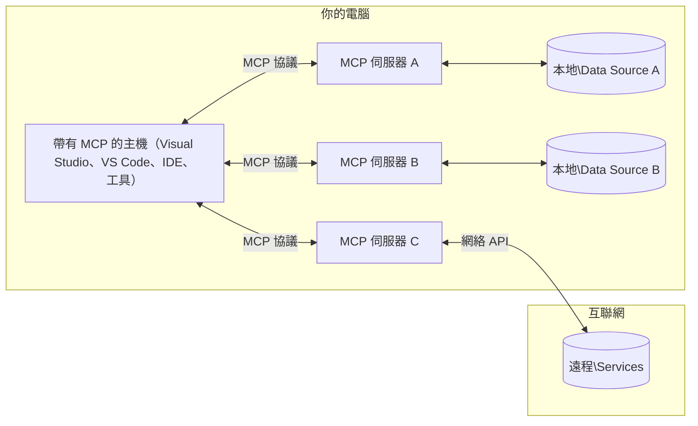

# MCP 核心概念：掌握 AI 整合的模型上下文協議

[](https://youtu.be/earDzWGtE84)

_(點擊上方圖片觀看本課程影片)_

[模型上下文協議（MCP）](https://github.com/modelcontextprotocol) 是一個強大且標準化的框架，優化大型語言模型（LLM）與外部工具、應用程式和資料來源之間的通訊。  
本指南將帶你了解 MCP 的核心概念，學習其客戶端-伺服器架構、基本組件、通訊機制及實作最佳實踐。

- **明確用戶同意**：所有資料存取與操作均需在執行前取得明確的用戶批准。用戶必須清楚了解將存取哪些資料及將執行哪些動作，並擁有細緻的權限控制。
- **資料隱私保護**：僅在明確同意的情況下曝光用戶資料，且必須透過強健的存取控管保障整個互動流程。實作需防止未授權資料傳輸，維持嚴格隱私界限。
- **工具執行安全**：每次工具呼叫均需取得明確用戶同意，且用戶需明白工具功能、參數及可能影響。必須有嚴密安全界限，避免意外、不安全或惡意的工具執行。
- **傳輸層安全**：所有通訊管道應使用適當的加密及身份驗證機制。遠端連線應實作安全傳輸協議與妥善的憑證管理。

#### 實作指引：

- **權限管理**：實作細緻的權限系統，讓用戶能控制可存取的伺服器、工具及資源
- **身份驗證與授權**：採用安全的身份驗證方法（OAuth、API 金鑰），搭配妥善的令牌管理與過期機制
- **輸入驗證**：根據定義的結構驗證所有參數與資料輸入，避免注入攻擊
- **稽核日誌**：維護完整的操作日誌以利安全監控與合規檢查

## 概述

本課程將深入探討構成模型上下文協議（MCP）生態系的基本架構與元件。你將了解客戶端-伺服器架構、主要組件，以及支撐 MCP 互動的通訊機制。

## 主要學習目標

完成本課程後，你將能：

- 理解 MCP 的客戶端-伺服器架構
- 辨識主機、客戶端與伺服器的角色與責任
- 分析 MCP 作為彈性整合層的核心特性
- 學習 MCP 生態系中的資訊流動方式
- 透過 .NET、Java、Python 和 JavaScript 範例獲得實際見解

## MCP 架構：深入解析

MCP 生態系建立於客戶端-伺服器模型。此模組化架構讓 AI 應用程式能有效地與工具、資料庫、API 和上下文資源互動。下面將此架構拆解為核心組件。

MCP 的核心採用客戶端-伺服器架構，主機應用程式可連接多個伺服器：


- **MCP 主機**：如 VSCode、Claude Desktop、IDE 或想透過 MCP 存取資料的 AI 工具程式
- **MCP 客戶端**：與伺服器保持一對一連線的協議客戶端
- **MCP 伺服器**：透過標準化模型上下文協議揭露特定功能的輕量程式
- **本地資料來源**：你的電腦檔案、資料庫及 MCP 伺服器可安全存取的服務
- **遠端服務**：網路上可用的外部系統，MCP 伺服器透過 API 連接

MCP 協議是以日期為基礎版本的演進標準（格式為 YYYY-MM-DD）。目前協議版本為 **2025-11-25**。你可以查看最新更新的 [協議規範](https://modelcontextprotocol.io/specification/2025-11-25/)

### 1. 主機

在模型上下文協議（MCP）中，**主機**是 AI 應用程式，作為用戶與協議互動的主要介面。主機負責協調管理對多個 MCP 伺服器的連線，為每個伺服器連線建立專屬 MCP 客戶端。主機範例包括：

- **AI 應用程式**：Claude Desktop、Visual Studio Code、Claude Code
- **開發環境**：具 MCP 整合功能的 IDE 和程式編輯器  
- **自定應用程式**：專門建置的 AI 代理與工具

**主機**是協調 AI 模型互動的應用程式。牠們：

- **編排 AI 模型**：執行或與 LLM 互動以生成回應並協調 AI 工作流程
- **管理客戶端連線**：為每個 MCP 伺服器連線建立並維護一個 MCP 客戶端
- **控制用戶介面**：掌控對話流程、用戶互動及回應呈現  
- **強化安全性**：控制權限、安全限制及身份驗證
- **處理用戶同意**：管理用戶對資料共享及工具執行的批准

### 2. 客戶端

**客戶端**是關鍵元件，保持主機與 MCP 伺服器間一對一的專屬連線。每個 MCP 客戶端皆由主機建立以連接指定的 MCP 伺服器，確保通訊渠道的有序與安全。多個客戶端使主機能同時連接多台伺服器。

**客戶端**是宿主應用程式中的連接器元件。牠們：

- **協議通訊**：以 JSON-RPC 2.0 格式向伺服器發送提示與指令請求
- **功能協商**：於初始化時與伺服器協商支援的功能及協議版本
- **工具執行管理**：處理模型工具執行請求並處理回應
- **即時更新**：接收伺服器通知與即時更新
- **回應處理**：處理並格式化伺服器回應以供用戶顯示

### 3. 伺服器

**伺服器**是向 MCP 客戶端提供上下文、工具與功能的程式。伺服器可在本地（與主機同機器）或遠端（外部平台）執行，負責處理客戶端請求及回應結構化資料。伺服器透過標準化模型上下文協議揭露特定功能。

**伺服器**是提供上下文和功能的服務。牠們：

- **功能註冊**：向客戶端註冊並揭露可用的原語（資源、提示、工具）
- **請求處理**：接收並執行工具呼叫、資源請求與提示請求
- **上下文提供**：提供上下文資訊與資料以強化模型回應
- **狀態管理**：維護會話狀態，並在需要時處理有狀態互動
- **即時通知**：將功能變更與更新通知已連線客戶端

任何人皆可開發伺服器，擴充模型功能與專屬特性，並支持本地與遠端部署。

### 4. 伺服器原語

在模型上下文協議（MCP）中，伺服器提供三種核心**原語**，定義客戶端、主機與語言模型間豐富互動的基本構成。這些原語規範可透過協議提供的上下文資訊與動作類型。

MCP 伺服器可透過以下三種核心原語任意組合揭露功能：

#### 資源

**資源**是為 AI 應用程式提供上下文資訊的資料來源。它們代表靜態或動態內容，能增強模型的理解與決策：

- **上下文資料**：結構化資訊與模型用上下文
- **知識庫**：文件庫、文章、手冊與研究論文
- **本地資料來源**：檔案、資料庫與本地系統資訊  
- **外部資料**：API 回應、網路服務與遠端系統資料
- **動態內容**：依外部條件即時更新的資料

資源透過 URI 識別，支援以 `resources/list` 發現及用 `resources/read` 取用：

```text
file://documents/project-spec.md
database://production/users/schema
api://weather/current
```

#### 提示

**提示**是可重複使用的範本，協助結構化與語言模型的互動。它們提供標準化互動模式與範本化工作流程：

- **範本化互動**：事先結構化的訊息與對話開場白
- **工作流程範本**：常用任務與互動的標準化序列
- **少量示例**：示例基範本用於模型指令
- **系統提示**：定義模型行為與上下文的基礎提示
- **動態範本**：可根據特定上下文調整的參數化提示

提示支援變數替換，可透過 `prompts/list` 查詢並用 `prompts/get` 取得：

```markdown
Generate a {{task_type}} for {{product}} targeting {{audience}} with the following requirements: {{requirements}}
```

#### 工具

**工具**是 AI 模型可呼叫以執行特定行為的可執行函式，它們是 MCP 生態系的「動詞」，使模型能與外部系統互動：

- **可執行函式**：模型可帶入特定參數呼叫的離散操作
- **外部系統整合**：API 呼叫、資料庫查詢、檔案操作、計算
- **唯一身份**：每個工具有明確名稱、描述與參數結構
- **結構化輸入/輸出**：工具接受驗證過的參數並返回結構化、型別化回應
- **行動能力**：支持模型執行真實世界操作並檢索即時資料

工具用 JSON Schema 定義參數驗證，透過 `tools/list` 發現並用 `tools/call` 執行。工具也可帶有**圖示**作為額外 UI 呈現元資料。

**工具註釋**：工具支持行為註釋（如 `readOnlyHint`、`destructiveHint`），描述工具是唯讀或具破壞性，協助客戶端判斷是否執行。

工具定義範例：

```typescript
server.tool(
  "search_products", 
  {
    query: z.string().describe("Search query for products"),
    category: z.string().optional().describe("Product category filter"),
    max_results: z.number().default(10).describe("Maximum results to return")
  }, 
  async (params) => {
    // 執行搜尋並返回結構化結果
    return await productService.search(params);
  }
);
```

## 客戶端原語

在模型上下文協議（MCP）中，**客戶端**也可揭露原語，讓伺服器向主機應用請求額外功能。此類客戶端原語使伺服器能更豐富互動，存取 AI 模型能力與用戶互動。

### 抽樣

**抽樣**允許伺服器向客戶端的 AI 應用請求語言模型補全。此原語使伺服器能不須內嵌模型相依，仍可使用 LLM 能力：

- **模型無關訪問**：伺服器可請求補全，無需包含 LLM SDK 或管理模型存取
- **伺服器主動 AI**：支援伺服器主動使用客戶端 AI 模型生成內容
- **遞迴 LLM 互動**：支援伺服器在複雜場景下向 AI 請助處理
- **動態內容生成**：讓伺服器利用主機模型產生上下文回應
- **工具呼叫支援**：伺服器可帶入 `tools` 與 `toolChoice` 參數，讓客戶端模型在抽樣時呼叫工具

抽樣透過 `sampling/complete` 方法啟動，伺服器向客戶端發送補全請求。

### 根目錄

**根目錄**提供一個標準化的方式，讓客戶端向伺服器揭露檔案系統範圍，幫助伺服器了解可存取的目錄與檔案：

- **檔案系統界線**：定義伺服器可操作的檔案系統範圍
- **存取控制**：讓伺服器了解擁有哪些目錄和檔案存取權限
- **動態更新**：客戶端可在根目錄變更時通知伺服器
- **基於 URI 識別**：根目錄使用 `file://` URI 識別存取的目錄與檔案

根目錄可透過 `roots/list` 發現，客戶端變更時可送出 `notifications/roots/list_changed`。

### 引導

**引導**允許伺服器經由客戶端介面向用戶請求額外資訊或確認：

- **用戶輸入請求**：伺服器於執行工具時可索取追加資訊
- **確認對話框**：要求用戶批准敏感或影響大的操作
- **互動工作流程**：使伺服器可以建立分步的用戶互動流程
- **動態收集參數**：在工具執行期間收集缺失或選用參數

引導請求使用 `elicitation/request` 方法透過客戶端介面收集用戶輸入。

**URL 模式引導**：伺服器也可請求基於 URL 的用戶互動，將用戶導向外部網頁做身分驗證、確認或資料輸入。

### 紀錄

**紀錄**讓伺服器向客戶端發送結構化的日誌消息，用於除錯、監控與作業透明：

- **除錯支援**：使伺服器提供詳細執行日誌，便於問題排查
- **作業監控**：送出狀態更新與效能指標給客戶端
- **錯誤回報**：提供詳細錯誤上下文與診斷資訊
- **稽核追蹤**：建立伺服器操作與決策的完整日誌

紀錄訊息送達客戶端，提升伺服器作業透明度與輔助除錯。

## MCP 中的資訊流

模型上下文協議（MCP）定義主機、客戶端、伺服器與模型間的結構化資訊流。了解此流動有助釐清用戶請求如何處理，以及外部工具與資料如何整合進模型回應。
- **主機啟動連線**  
  主機應用程式（例如 IDE 或聊天介面）與 MCP 伺服器建立連線，通常透過 STDIO、WebSocket 或其他支援的傳輸方式。

- **功能協商**  
  嵌入主機的客戶端與伺服器交換彼此支援的功能、工具、資源與協定版本資訊。確保雙方了解本次會議可用的功能。

- **使用者請求**  
  使用者與主機互動（例如輸入提示或指令）。主機收集該輸入，並傳給客戶端處理。

- **資源或工具使用**  
  - 客戶端可能會向伺服器請求額外的上下文或資源（例如檔案、資料庫條目或知識庫文章）以豐富模型理解。  
  - 若模型判斷需要使用工具（例如取得資料、執行計算或呼叫 API），客戶端會向伺服器發送工具調用請求，並指定工具名稱及參數。

- **伺服器執行**  
  伺服器接收資源或工具請求，執行必要操作（例如執行函式、查詢資料庫或擷取檔案），並以結構化格式回傳結果給客戶端。

- **回應生成**  
  客戶端整合伺服器的回應（資源資料、工具輸出等）於持續的模型互動中。模型利用這些資訊產生完整且貼切的回應。

- **結果呈現**  
  主機從客戶端接收最終輸出並展示給使用者，通常包含模型生成的文字以及執行工具或查詢資源的結果。

此流程使 MCP 能支持進階、互動式且具上下文感知的 AI 應用，透過將模型無縫連結外部工具與資料來源來實現。

## 協定架構與層級

MCP 由兩個不同的架構層級組成，協同提供完整的通訊框架：

### 資料層

**資料層**採用**JSON-RPC 2.0**為基礎，實作 MCP 協定的核心。此層定義訊息結構、語意及互動模式：

#### 核心元件：

- **JSON-RPC 2.0 協定**：所有通訊均使用標準化的 JSON-RPC 2.0 訊息格式，用於方法呼叫、回應與通知  
- **生命週期管理**：管理客戶端與伺服器間的連線初始化、功能協商與會話終止  
- **伺服器原語**：使伺服器能透過工具、資源與提示提供核心功能  
- **客戶端原語**：使伺服器能請求大型語言模型取樣、引發使用者輸入、並傳送日誌訊息  
- **即時通知**：支援非同步通知以實現無輪詢的動態更新  

#### 主要特性：

- **協定版本協商**：採用日期格式的版本編號（YYYY-MM-DD）以確保相容性  
- **功能探索**：初始化階段，客戶端與伺服器交換支援功能資訊  
- **有狀態會話**：於多重互動間維持連線狀態以保持上下文連續性  

### 傳輸層

**傳輸層**管理 MCP 參與者間的通訊通道、訊息框架與驗證機制：

#### 支援的傳輸機制：

1. **STDIO 傳輸**：
   - 使用標準輸入/輸出串流進行直接程序通訊  
   - 對於同機器上的本地流程為佳，無網路開銷  
   - 常用於本地 MCP 伺服器實作  

2. **可串流 HTTP 傳輸**：
   - 用 HTTP POST 傳輸客戶端到伺服器消息  
   - 可選的伺服器推送事件（SSE）用於伺服器到客戶端串流  
   - 支援跨網路遠端伺服器通訊  
   - 支援標準 HTTP 驗證（承載令牌、API 金鑰、自訂標頭）  
   - MCP 建議使用 OAuth 實現安全的基於令牌驗證  

#### 傳輸抽象：

傳輸層將通訊細節與資料層分離，確保無論傳輸機制如何，均使用相同的 JSON-RPC 2.0 訊息格式。此抽象允許應用程式無縫切換本地與遠端伺服器。

### 安全考量

MCP 實作必須遵守多項關鍵安全原則，確保所有協定操作的安全、可信與隱私：

- **使用者同意與控制**  
  任何資料訪問或操作執行前均須取得使用者明確同意。使用者應清楚管理分享資料內容與授權行為，且應提供直觀界面供審查與批准。

- **資料隱私**  
  使用者資料僅可在明確同意下曝光，並須受適當存取控制保護。MCP 實作必須防止未授權資料傳輸，確保全流程隱私維護。

- **工具安全**  
  呼叫工具前需取得明確的使用者同意。使用者應充分理解工具功能，且必須強化安全邊界避免意外或不安全的工具執行。

藉由遵循上述安全原則，MCP 確保各項協定互動中的使用者信任、隱私與安全，同時提供強大 AI 整合功能。

## 程式碼範例：關鍵元件

以下為數種熱門程式語言的程式碼範例，示範如何實作 MCP 伺服器關鍵元件與工具。

### .NET 範例：建立簡單 MCP 伺服器及工具

這是一個實務上的 .NET 程式碼範例，示範如何實作一個簡單的 MCP 伺服器並註冊自訂工具。範例展示工具定義、註冊、請求處理及使用 Model Context Protocol 連線。

```csharp
using System;
using System.Threading.Tasks;
using ModelContextProtocol.Server;
using ModelContextProtocol.Server.Transport;
using ModelContextProtocol.Server.Tools;

public class WeatherServer
{
    public static async Task Main(string[] args)
    {
        // Create an MCP server
        var server = new McpServer(
            name: "Weather MCP Server",
            version: "1.0.0"
        );
        
        // Register our custom weather tool
        server.AddTool<string, WeatherData>("weatherTool", 
            description: "Gets current weather for a location",
            execute: async (location) => {
                // Call weather API (simplified)
                var weatherData = await GetWeatherDataAsync(location);
                return weatherData;
            });
        
        // Connect the server using stdio transport
        var transport = new StdioServerTransport();
        await server.ConnectAsync(transport);
        
        Console.WriteLine("Weather MCP Server started");
        
        // Keep the server running until process is terminated
        await Task.Delay(-1);
    }
    
    private static async Task<WeatherData> GetWeatherDataAsync(string location)
    {
        // This would normally call a weather API
        // Simplified for demonstration
        await Task.Delay(100); // Simulate API call
        return new WeatherData { 
            Temperature = 72.5,
            Conditions = "Sunny",
            Location = location
        };
    }
}

public class WeatherData
{
    public double Temperature { get; set; }
    public string Conditions { get; set; }
    public string Location { get; set; }
}
```

### Java 範例：MCP 伺服器元件

此範例與上述 .NET 範例示範相同 MCP 伺服器與工具註冊，但以 Java 實作。

```java
import io.modelcontextprotocol.server.McpServer;
import io.modelcontextprotocol.server.McpToolDefinition;
import io.modelcontextprotocol.server.transport.StdioServerTransport;
import io.modelcontextprotocol.server.tool.ToolExecutionContext;
import io.modelcontextprotocol.server.tool.ToolResponse;

public class WeatherMcpServer {
    public static void main(String[] args) throws Exception {
        // 建立一個 MCP 伺服器
        McpServer server = McpServer.builder()
            .name("Weather MCP Server")
            .version("1.0.0")
            .build();
            
        // 註冊一個天氣工具
        server.registerTool(McpToolDefinition.builder("weatherTool")
            .description("Gets current weather for a location")
            .parameter("location", String.class)
            .execute((ToolExecutionContext ctx) -> {
                String location = ctx.getParameter("location", String.class);
                
                // 獲取天氣資料（簡化版）
                WeatherData data = getWeatherData(location);
                
                // 傳回格式化的回應
                return ToolResponse.content(
                    String.format("Temperature: %.1f°F, Conditions: %s, Location: %s", 
                    data.getTemperature(), 
                    data.getConditions(), 
                    data.getLocation())
                );
            })
            .build());
        
        // 使用 stdio 傳輸連接伺服器
        try (StdioServerTransport transport = new StdioServerTransport()) {
            server.connect(transport);
            System.out.println("Weather MCP Server started");
            // 令伺服器持續運行直至進程終止
            Thread.currentThread().join();
        }
    }
    
    private static WeatherData getWeatherData(String location) {
        // 實作會呼叫天氣 API
        // 因示範目的而簡化
        return new WeatherData(72.5, "Sunny", location);
    }
}

class WeatherData {
    private double temperature;
    private String conditions;
    private String location;
    
    public WeatherData(double temperature, String conditions, String location) {
        this.temperature = temperature;
        this.conditions = conditions;
        this.location = location;
    }
    
    public double getTemperature() {
        return temperature;
    }
    
    public String getConditions() {
        return conditions;
    }
    
    public String getLocation() {
        return location;
    }
}
```

### Python 範例：建構 MCP 伺服器

此範例使用 fastmcp，請確保先安裝：

```python
pip install fastmcp
```
程式範例：

```python
#!/usr/bin/env python3
import asyncio
from fastmcp import FastMCP
from fastmcp.transports.stdio import serve_stdio

# 建立一個 FastMCP 伺服器
mcp = FastMCP(
    name="Weather MCP Server",
    version="1.0.0"
)

@mcp.tool()
def get_weather(location: str) -> dict:
    """Gets current weather for a location."""
    return {
        "temperature": 72.5,
        "conditions": "Sunny",
        "location": location
    }

# 使用類別的替代方法
class WeatherTools:
    @mcp.tool()
    def forecast(self, location: str, days: int = 1) -> dict:
        """Gets weather forecast for a location for the specified number of days."""
        return {
            "location": location,
            "forecast": [
                {"day": i+1, "temperature": 70 + i, "conditions": "Partly Cloudy"}
                for i in range(days)
            ]
        }

# 註冊類別工具
weather_tools = WeatherTools()

# 啟動伺服器
if __name__ == "__main__":
    asyncio.run(serve_stdio(mcp))
```

### JavaScript 範例：建立 MCP 伺服器

此範例展示如何以 JavaScript 建立 MCP 伺服器，及註冊兩個與天氣相關的工具。

```javascript
// 使用官方的模型上下文協議 SDK
import { McpServer } from "@modelcontextprotocol/sdk/server/mcp.js";
import { StdioServerTransport } from "@modelcontextprotocol/sdk/server/stdio.js";
import { z } from "zod"; // 用於參數驗證

// 建立一個 MCP 伺服器
const server = new McpServer({
  name: "Weather MCP Server",
  version: "1.0.0"
});

// 定義一個天氣工具
server.tool(
  "weatherTool",
  {
    location: z.string().describe("The location to get weather for")
  },
  async ({ location }) => {
    // 通常會調用天氣 API
    // 為演示而簡化
    const weatherData = await getWeatherData(location);
    
    return {
      content: [
        { 
          type: "text", 
          text: `Temperature: ${weatherData.temperature}°F, Conditions: ${weatherData.conditions}, Location: ${weatherData.location}` 
        }
      ]
    };
  }
);

// 定義一個預報工具
server.tool(
  "forecastTool",
  {
    location: z.string(),
    days: z.number().default(3).describe("Number of days for forecast")
  },
  async ({ location, days }) => {
    // 通常會調用天氣 API
    // 為演示而簡化
    const forecast = await getForecastData(location, days);
    
    return {
      content: [
        { 
          type: "text", 
          text: `${days}-day forecast for ${location}: ${JSON.stringify(forecast)}` 
        }
      ]
    };
  }
);

// 輔助函數
async function getWeatherData(location) {
  // 模擬 API 調用
  return {
    temperature: 72.5,
    conditions: "Sunny",
    location: location
  };
}

async function getForecastData(location, days) {
  // 模擬 API 調用
  return Array.from({ length: days }, (_, i) => ({
    day: i + 1,
    temperature: 70 + Math.floor(Math.random() * 10),
    conditions: i % 2 === 0 ? "Sunny" : "Partly Cloudy"
  }));
}

// 使用 stdio 傳輸連接伺服器
const transport = new StdioServerTransport();
server.connect(transport).catch(console.error);

console.log("Weather MCP Server started");
```

此 JavaScript 範例示範如何使用 Model Context Protocol SDK 建立 MCP 伺服器。展示如何註冊名為 `weatherTool` 與 `forecastTool` 的兩個工具，並透過 `StdioServerTransport` 提供給 MCP 客戶端使用。

## 安全與授權

MCP 融合多項內建觀念與機制，以管理整個協定過程中的安全與授權：

1. **工具許可控制**  
  客戶端可指定模型在會話中允許使用哪些工具。確保僅有明確授權工具可存取，減少非預期或不安全操作風險。許可可依使用者偏好、組織策略或互動上下文動態調整。

2. **驗證**  
  伺服器可要求驗證以授予工具、資源或敏感操作存取權。可能包含 API 金鑰、OAuth 令牌或其他驗證機制。妥善驗證確保僅授權的客戶端和使用者能呼叫伺服器端功能。

3. **效力驗證**  
  所有工具調用必須執行參數驗證。每個工具定義其參數的類型、格式與約束，伺服器會依此驗證請求。防止惡意或格式錯誤輸入影響工具執行，維持操作完整性。

4. **速率限制**  
  為防止濫用並確保伺服器資源公平使用，MCP 伺服器可對工具呼叫及資源存取實施速率限制。可針對使用者、會話或全局套用，有助抵禦阻斷服務攻擊或過度資源消耗。

結合上述機制，MCP 為語言模型與外部工具和資料來源整合提供安全基礎，並讓使用者及開發者能細膩控管存取與使用。

## 協定訊息與通訊流程

MCP 通訊使用結構化 **JSON-RPC 2.0** 訊息，促進主機、客戶端與伺服器間明確且可靠的互動。協定定義不同操作的特定訊息模式：

### 核心訊息類型：

#### **初始化訊息**
- **`initialize` 請求**：建立連線並協商協定版本與功能  
- **`initialize` 回應**：確認支援的功能與伺服器資訊  
- **`notifications/initialized`**：表示初始化完成，會話準備就緒  

#### **探索訊息**
- **`tools/list` 請求**：探索伺服器上的可用工具  
- **`resources/list` 請求**：列出可用資源（資料來源）  
- **`prompts/list` 請求**：取得可用提示範本  

#### **執行訊息**  
- **`tools/call` 請求**：執行指定工具，帶入參數  
- **`resources/read` 請求**：讀取特定資源內容  
- **`prompts/get` 請求**：擷取提示範本，可附加參數  

#### **客戶端端訊息**
- **`sampling/complete` 請求**：伺服器請求客戶端裡的大型語言模型完成  
- **`elicitation/request`**：伺服器透過客戶端介面請求使用者輸入  
- **日誌訊息**：伺服器向客戶端傳送結構化日誌  

#### **通知訊息**
- **`notifications/tools/list_changed`**：伺服器通知客戶端工具列表變更  
- **`notifications/resources/list_changed`**：伺服器通知客戶端資源列表變更  
- **`notifications/prompts/list_changed`**：伺服器通知客戶端提示列表變更  

### 訊息結構：

所有 MCP 訊息皆遵循 JSON-RPC 2.0 格式：

- **請求訊息**：包含 `id`、`method` 與可選 `params`  
- **回應訊息**：包含 `id`，以及 `result` 或 `error`  
- **通知訊息**：包含 `method` 與可選 `params`，無 `id`，且不需回應  

此結構化通訊確保互動具可追蹤性、可擴充及高可靠性，支援即時更新、工具鏈結及強健錯誤處理等進階場景。

### 工作（實驗性）

**工作（Tasks）** 是一項實驗性功能，提供耐久執行包裝器，使 MCP 請求能延後取得結果及追蹤狀態：

- **長時間運作**：追蹤耗時計算、流程自動化與批量處理  
- **延遲結果**：輪詢工作狀態，操作完成後擷取結果  
- **狀態追蹤**：監控工作進度，透過定義的生命週期狀態  
- **多步驟操作**：支援跨多次互動的複雜流程  

工作包裝標準 MCP 請求，啟用無法立即完成的操作之非同步執行模式。

## 主要重點總結

- **架構**：MCP 採用客戶端-伺服器架構，主機管理多個客戶端連線至伺服器  
- **參與者**：生態包含主機（AI 應用）、客戶端（協定連接器）與伺服器（功能提供者）  
- **傳輸機制**：通訊支援本地 STDIO 及遠端可串流 HTTP（可選 SSE）  
- **核心原語**：伺服器揭露工具（可執行函式）、資源（資料來源）與提示（範本）  
- **客戶端原語**：伺服器可請求取樣（支援工具呼叫的 LLM 完成）、引發（含 URL 模式的使用者輸入）、根目錄（檔案系統邊界）與日誌  
- **實驗功能**：工作提供耐久執行包裝器，適用長時間運作  
- **協定基礎**：搭建於 JSON-RPC 2.0 且採用日期版本控制（現行：2025-11-25）  
- **即時能力**：支援通知以動態更新與即時同步  
- **安全第一**：強調明確使用者同意、資料隱私保護與安全傳輸  

## 練習

設計一個在你的領域內有用的簡單 MCP 工具。請定義：
1. 這個工具的名稱  
2. 它會接受哪些參數  
3. 它會回傳什麼輸出  
4. 模型如何利用此工具解決使用者問題  

---

## 後續內容

後續： [第 2 章：安全](../02-Security/README.md)

---

<!-- CO-OP TRANSLATOR DISCLAIMER START -->
**免責聲明**：
本文件乃使用人工智能翻譯服務 [Co-op Translator](https://github.com/Azure/co-op-translator) 進行翻譯。儘管我們力求準確，但請注意，自動翻譯可能包含錯誤或不準確之處。原始文件的母語版本應被視為權威來源。對於重要資訊，建議使用專業人工翻譯。我們不對因使用本翻譯而產生的任何誤解或誤釋承擔責任。
<!-- CO-OP TRANSLATOR DISCLAIMER END -->