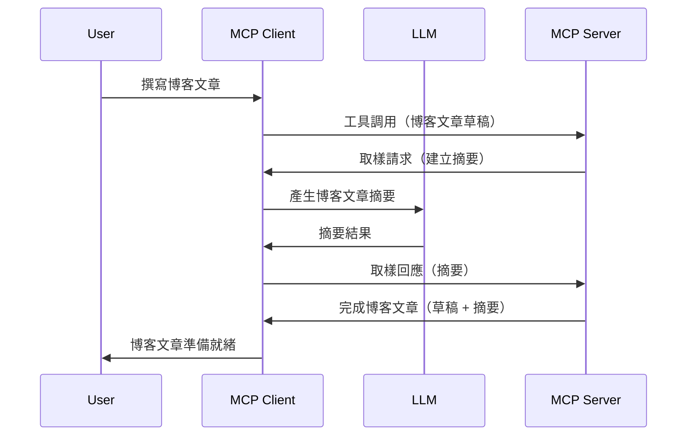

# 採樣 - 將功能委派給客戶端

有時，你需要 MCP 客戶端與 MCP 伺服器合作以達成共同目標。你可能遇到伺服器需要客戶端上的 LLM 協助的情況。對於這種情況，應使用採樣。

讓我們來探索一些使用案例以及如何建立包含採樣的解決方案。

## 概覽

本課程專注於說明何時以及在哪裡使用採樣，以及如何配置它。

## 學習目標

在本章中，我們將：

- 解釋什麼是採樣以及何時使用它。
- 展示如何在 MCP 中配置採樣。
- 提供採樣實際操作的範例。

## 什麼是採樣以及為什麼使用它？

採樣是一項進階功能，其運作方式如下：



### 採樣請求

好，現在我們對一個合理的場景有了全貌，讓我們談談伺服器回傳給客戶端的採樣請求。以下是此類請求的 JSON-RPC 格式示例：

```json
{
  "jsonrpc": "2.0",
  "id": 1,
  "method": "sampling/createMessage",
  "params": {
    "messages": [
      {
        "role": "user",
        "content": {
          "type": "text",
          "text": "Create a blog post summary of the following blog post: <BLOG POST>"
        }
      }
    ],
    "modelPreferences": {
      "hints": [
        {
          "name": "claude-3-sonnet"
        }
      ],
      "intelligencePriority": 0.8,
      "speedPriority": 0.5
    },
    "systemPrompt": "You are a helpful assistant.",
    "maxTokens": 100
  }
}
```

這裡有幾點值得說明：

- 在 content -> text 底下的 Prompt ，是給 LLM 用來總結部落格文章內容的指示。

- **modelPreferences**。這一節就是偏好設定，是針對使用何種配置建議給 LLM。用戶可以選擇是否接受這些建議或更改它們。在此案例中，有關模型使用及速度與智慧優先的建議。
- **systemPrompt**，這是普通的系統提示，用來賦予 LLM 性格並包含指導說明。
- **maxTokens**，另一屬性，用於告知建議的最大使用標記數目。

### 採樣回應

此回應是 MCP 客戶端經呼叫 LLM、等待回應後發送回 MCP 伺服器的結果。以下是其 JSON-RPC 格式示例：

```json
{
  "jsonrpc": "2.0",
  "id": 1,
  "result": {
    "role": "assistant",
    "content": {
      "type": "text",
      "text": "Here's your abstract <ABSTRACT>"
    },
    "model": "gpt-5",
    "stopReason": "endTurn"
  }
}
```

注意回應是符合我們要求的部落格文章摘要。另外注意所使用的 `model` 並非我們請求的，而是 "gpt-5" 替代 "claude-3-sonnet"。此舉是為了說明使用者可以改變選擇，而你的採樣請求是建議而非硬性要求。

好了，現在我們了解主要流程以及採樣適用於「部落格文章創作＋摘要」這項任務，接下來看看我們要做哪些設定以使其運作。

### 訊息類型

採樣訊息不僅限於文字，也可以傳送圖片和音訊。以下是 JSON-RPC 的不同表現形式：

<strong>文字</strong>

```json
{
  "type": "text",
  "text": "The message content"
}
```

<strong>影像內容</strong>

```json
{
  "type": "image",
  "data": "base64-encoded-image-data",
  "mimeType": "image/jpeg"
}
```

<strong>音訊內容</strong>

```json
{
  "type": "audio",
  "data": "base64-encoded-audio-data",
  "mimeType": "audio/wav"
}
```

> NOTE: 有關採樣的詳細資訊，請參閱[官方文件](https://modelcontextprotocol.io/specification/2025-11-25/client/sampling)

## 如何在客戶端配置採樣

> 注意：如果你只是在建立伺服器，這方面不需太多操作。

在客戶端，需要如以下方式指定此功能：

```json
{
  "capabilities": {
    "sampling": {}
  }
}
```

這樣在你選擇的客戶端初始化並連接伺服器時，就會被採用。

## 採樣實作範例 - 建立部落格文章

讓我們一起編寫採樣伺服器，需要完成以下步驟：

1. 在伺服器端建立工具。
1. 該工具應建立採樣請求。
1. 工具等候客戶端對採樣請求的回應。
1. 然後產生工具結果。

逐步看代碼：

### -1- 建立工具

**python**

```python
@mcp.tool()
async def create_blog(title: str, content: str, ctx: Context[ServerSession, None]) -> str:
    """Create a blog post and generate a summary"""

```

### -2- 建立採樣請求

擴充你的工具加上以下程式：

**python**

```python
post = BlogPost(
        id=len(posts) + 1,
        title=title,
        content=content,
        abstract=""
    )

prompt = f"Create an abstract of the following blog post: title: {title} and draft: {content} "

result = await ctx.session.create_message(
        messages=[
            SamplingMessage(
                role="user",
                content=TextContent(type="text", text=prompt),
            )
        ],
        max_tokens=100,
)

```

### -3- 等待回應並回傳結果

**python**

```python
post.abstract = result.content.text

posts.append(post)

# 返回完整的產品
return json.dumps({
    "id": post.title,
    "abstract": post.abstract
})
```

### -4- 完整代碼

**python**

```python
from starlette.applications import Starlette
from starlette.routing import Mount, Host

from mcp.server.fastmcp import Context, FastMCP

from mcp.server.session import ServerSession
from mcp.types import SamplingMessage, TextContent

import json


from uuid import uuid4
from typing import List
from pydantic import BaseModel


mcp = FastMCP("Blog post generator")

# app = FastAPI()

posts = []

class BlogPost(BaseModel):
    id: int
    title: str
    content: str
    abstract: str

posts: List[BlogPost] = []

@mcp.tool()
async def create_blog(title: str, content: str, ctx: Context[ServerSession, None]) -> str:
    """Create a blog post and generate a summary"""

    post = BlogPost(
        id=len(posts) + 1,
        title=title,
        content=content,
        abstract=""
    )

    prompt = f"Create an abstract of the following blog post: title: {title} and draft: {content} "

    result = await ctx.session.create_message(
        messages=[
            SamplingMessage(
                role="user",
                content=TextContent(type="text", text=prompt),
            )
        ],
        max_tokens=100,
    )

    post.abstract = result.content.text

    posts.append(post)

    # 返回完整的博客文章
    return json.dumps({
        "id": post.title,
        "abstract": post.abstract
    })

if __name__ == "__main__":
    print("Starting server...")
    # mcp.run()
    mcp.run(transport="streamable-http")

# 以 python server.py 執行應用程式
```

### -5- 在 Visual Studio Code 中測試

在 Visual Studio Code 中測試此程式，請執行：

1. 在終端機啟動伺服器
1. 將其加到 *mcp.json* （確保啟動），例如如下：

   ```json
   "servers": {
      "blog-server": {
        "type": "http",
        "url": "http://localhost:8000/mcp"
      }
   }
   ```

1. 輸入提示：

   ```text
   create a blog post named "Where Python comes from", the content is "Python is actually named after Monty Python Flying Circus"
   ```

1. 允許採樣進行。首次測試時會出現額外對話視窗，需要你同意，接著將顯示正常對話框要求你執行工具。

1. 檢視結果。你將會在 GitHub Copilot Chat 頁面看到精美呈現的結果，也可檢視原始 JSON 回應。

<strong>額外好處</strong>。Visual Studio Code 工具對採樣具有良好支援。你可以透過以下方式設定已安裝伺服器的採樣存取權：

1. 前往擴充功能區。
1. 在「MCP SERVERS - INSTALLED」區段選擇已安裝伺服器的齒輪圖示。
1. 選擇「Configure Model Access」，你可以選擇 GitHub Copilot 在執行採樣時允許使用哪些模型。也可選擇「Show Sampling requests」查看最近的所有採樣請求。

## 作業

這次作業中，你將建置稍有不同的採樣功能，也就是一個支援生成產品說明的採樣整合。你的情境是：

<strong>情境</strong>：電商後台員工需要協助，生成產品說明花太多時間。因此你要建立一個解決方案，可以呼叫名為 "create_product" 的工具，帶入 "title" 及 "keywords" 作為參數，並應產出包含由客戶端 LLM 生成的 "description" 欄位的完整產品描述。

TIP：利用之前學到的知識，使用採樣請求設計此伺服器及工具。

## 解答

[解答](./solution/README.md)

## 重要重點

採樣是一項強大功能，允許伺服器在需要 LLM 協助時將任務委派給客戶端。

## 後續內容

- [第 4 章 - 實務實作](../../04-PracticalImplementation/README.md)

---

<!-- CO-OP TRANSLATOR DISCLAIMER START -->
**免責聲明**：
本文件由 AI 翻譯服務 [Co-op Translator](https://github.com/Azure/co-op-translator) 翻譯而成。雖然我們致力於確保準確性，但請注意，機器自動翻譯可能包含錯誤或不準確之處。原始文件的母語版本應被視為權威來源。對於重要資訊，建議進行專業人工翻譯。我們不對因使用本翻譯而產生的任何誤解或誤釋承擔責任。
<!-- CO-OP TRANSLATOR DISCLAIMER END -->