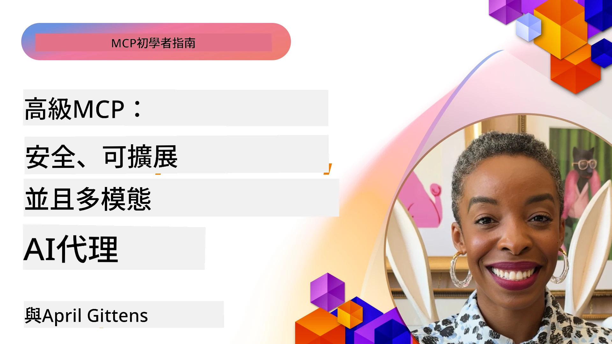

# MCP 高階主題

_(點擊上方圖片觀看本課影片)_

本章涵蓋模型上下文協議（MCP）實作中的一系列高階主題，包括多模態整合、可擴展性、安全最佳實踐及企業整合。這些主題對於構建穩健且生產環境可用的 MCP 應用程式非常重要，以滿足現代 AI 系統的需求。

## 概覽

本課探討模型上下文協議實作的高階概念，專注於多模態整合、可擴展性、安全最佳實踐及企業整合。這些主題對於構建能應付企業環境複雜需求的生產級 MCP 應用至關重要。

## 學習目標

完成本課後，您將能夠：

- 在 MCP 框架中實作多模態能力
- 設計可擴展的 MCP 架構以應付高負載場景
- 應用符合 MCP 安全原則的安全最佳實踐
- 將 MCP 整合至企業 AI 系統與框架
- 優化生產環境中的效能與可靠性

## 課程與範例專案

| 連結 | 標題 | 說明 |
|------|-------|-------------|
| [5.1 Integration with Azure](./mcp-integration/README.md) | 與 Azure 整合 | 學習如何在 Azure 上整合您的 MCP 伺服器 |
| [5.2 Multi modal sample](./mcp-multi-modality/README.md) | MCP 多模態範例  | 音訊、影像及多模態回應範例 |
| [5.3 MCP OAuth2 sample](../../../05-AdvancedTopics/mcp-oauth2-demo) | MCP OAuth2 示範 | 最小化 Spring Boot 應用展示 MCP 中的 OAuth2，包含授權與資源伺服器，示範安全的令牌簽發、受保護端點、Azure 容器應用部署及 API 管理整合。 |
| [5.4 Root Contexts](./mcp-root-contexts/README.md) | 根上下文  | 深入瞭解根上下文及其實作方法 |
| [5.5 Routing](./mcp-routing/README.md) | 路由 | 學習不同類型的路由 |
| [5.6 Sampling](./mcp-sampling/README.md) | 取樣 | 學習如何運用取樣 |
| [5.7 Scaling](./mcp-scaling/README.md) | 擴展  | 學習關於擴展的知識 |
| [5.8 Security](./mcp-security/README.md) | 安全  | 保護您的 MCP 伺服器 |
| [5.9 Web Search sample](./web-search-mcp/README.md) | Web 搜尋 MCP | Python MCP 伺服器與客戶端整合 SerpAPI，提供即時網頁、新聞、產品搜尋及問答。示範多工具編排、外部 API 整合及穩健錯誤處理。 |
| [5.10 Realtime Streaming](./mcp-realtimestreaming/README.md) | 串流  | 即時資料串流在當今以資料驅動的世界中變得必不可少，企業與應用需即時存取資訊以做出及時決策。 |
| [5.11 Realtime Web Search](./mcp-realtimesearch/README.md) | 網路即時搜尋 | MCP 如何透過提供跨 AI 模型、搜尋引擎與應用的標準化上下文管理，改變即時網路搜尋。 | 
| [5.12  Entra ID Authentication for Model Context Protocol Servers](./mcp-security-entra/README.md) | Entra ID 身分驗證 | Microsoft Entra ID 提供強健的雲端身分與存取管理解決方案，幫助確保僅授權用戶和應用能與您的 MCP 伺服器互動。 |
| [5.13 Microsoft Foundry Agent Integration](./mcp-foundry-agent-integration/README.md) | Microsoft Foundry 整合 | 學習如何將模型上下文協議伺服器與 Microsoft Foundry 代理整合，使強大的工具編排和企業 AI 能力透過標準化外部資料來源連接成為可能。 |
| [5.14 Context Engineering](./mcp-contextengineering/README.md) | 上下文工程 | MCP 伺服器上下文工程技術的未來機遇，包括上下文優化、動態上下文管理，及 MCP 框架中有效提示工程的策略。 |
| [5.15 MCP Custom Transport](./mcp-transport/README.md) | 自訂傳輸 | 學習如何針對專門的 MCP 通訊場景實作自訂傳輸機制。 |
| [5.16 Protocol Features Deep Dive](./mcp-protocol-features/README.md) | 協議功能 | 精通進階協議功能，包括進度通知、請求取消、資源範本及錯誤處理模式。 |
| [5.17 Adversarial Multi-Agent Reasoning](./mcp-adversarial-agents/README.md) | 對抗式智能代理 | 使用兩個持對立立場的代理，共用單一 MCP 工具組，藉由結構化辯論偵測幻覺、揭露邊緣案例並產生更具校準性的輸出。 |

> **MCP 規範 2025-11-25 新增**：規範現加入實驗性支援 <strong>任務</strong>（具進度追蹤的長時間執行操作）、<strong>工具註解</strong>（關於工具行為的安全元資料）、**URL 模式引導**（從客戶端請求特定 URL 內容），以及強化的 <strong>根</strong>（工作區上下文管理）。詳情請參閱 [MCP 規範變更日誌](https://spec.modelcontextprotocol.io/)。

## 其他參考資料

關於 MCP 高階主題的最新資訊，請參考：
- [MCP 文件](https://modelcontextprotocol.io/)
- [MCP 規範 (2025-11-25)](https://spec.modelcontextprotocol.io/specification/2025-11-25/)
- [GitHub 倉庫](https://github.com/modelcontextprotocol)
- [OWASP MCP Top 10](https://microsoft.github.io/mcp-azure-security-guide/mcp/) - 安全風險與緩解策略
- [MCP 安全高峰工作坊 (Sherpa)](https://azure-samples.github.io/sherpa/) - 實作安全訓練

## 重要重點

- 多模態 MCP 實作擴展 AI 能力，突破純文字處理限制
- 可擴展性對企業部署至關重要，可透過水平與垂直擴展解決
- 全面的安全措施保障資料安全並確保適當存取控制
- 與 Azure OpenAI 及 Microsoft AI Foundry 等平台的企業整合提升 MCP 能力
- 高階 MCP 實作受益於優化架構與謹慎資源管理

## 練習題

為特定使用案例設計企業級 MCP 實作：

1. 確認使用案例的多模態需求
2. 概述保護敏感資料所需的安全控管措施
3. 設計能應對變動負載的可擴展架構
4. 規劃與企業 AI 系統的整合點
5. 文件化潛在效能瓶頸及其緩解策略

## 其他資源

- [Azure OpenAI 文件](https://learn.microsoft.com/en-us/azure/ai-services/openai/)
- [Microsoft AI Foundry 文件](https://learn.microsoft.com/en-us/ai-services/)

---

## 下一步

從本模組的課程開始學習：[5.1 MCP Integration](./mcp-integration/README.md)

完成本模組後，繼續學習：[模組 6：社群貢獻](../06-CommunityContributions/README.md)

---

<!-- CO-OP TRANSLATOR DISCLAIMER START -->
**免責聲明**：
本文件由 AI 翻譯服務 [Co-op Translator](https://github.com/Azure/co-op-translator) 翻譯而成。雖然我們致力於確保準確性，但請注意，機器自動翻譯可能包含錯誤或不準確之處。原始文件的母語版本應被視為權威來源。對於重要資訊，建議進行專業人工翻譯。我們不對因使用本翻譯而產生的任何誤解或誤釋承擔責任。
<!-- CO-OP TRANSLATOR DISCLAIMER END -->