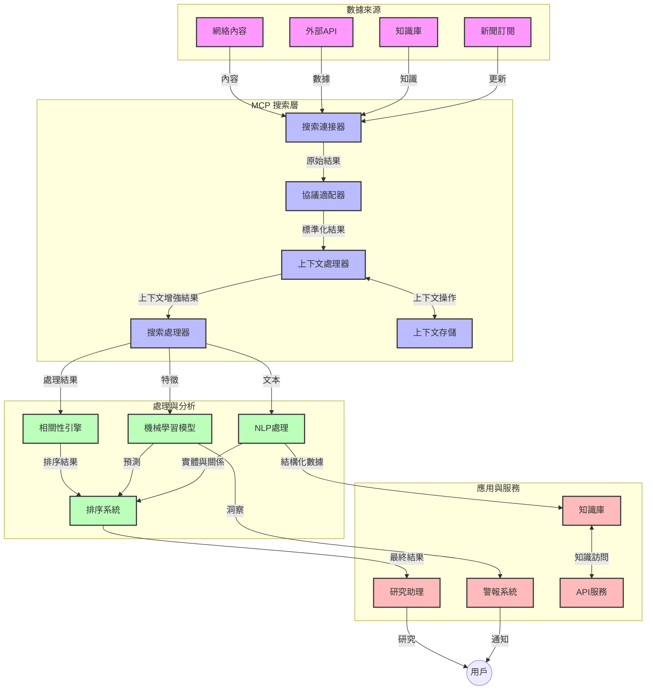
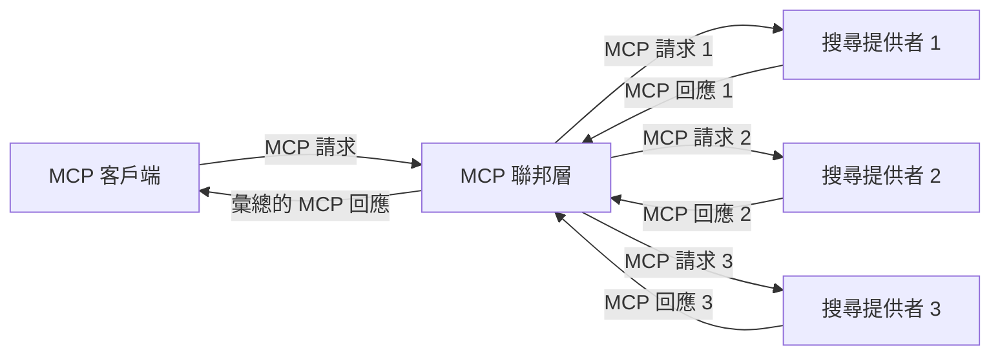
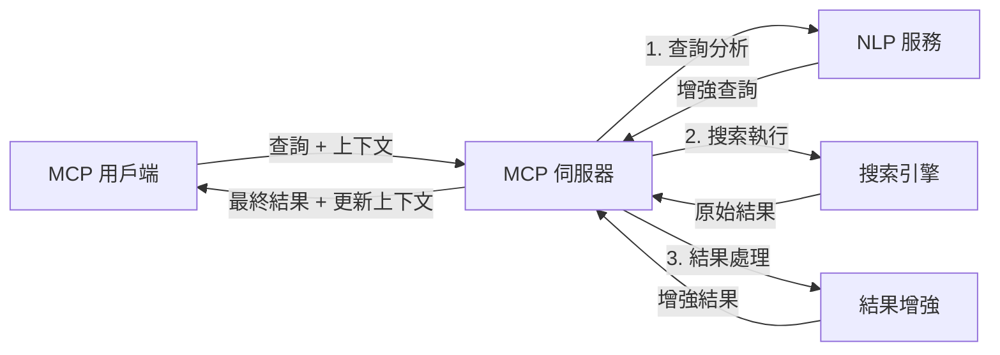

# 實時網絡搜尋的模型上下文協議

## 概覽

實時網絡搜尋在當今以資訊為驅動的環境中變得至關重要，應用程式需要即時存取互聯網上的最新資訊，以提供相關且及時的回應。模型上下文協議（MCP）在優化這些實時搜尋流程方面代表了一項重大進展，提升搜尋效率，維護上下文完整性，並改善整體系統性能。

本模組探討 MCP 如何通過為 AI 模型、搜尋引擎和應用程式提供標準化的上下文管理方式，改變實時網絡搜尋。

### 你將學到的內容

在這份全面指南中，你會發現：

- MCP 如何建立 AI 模型與實時網絡搜尋功能之間的無縫橋樑
- 使用 MCP 實現高效且可擴展搜尋解決方案的架構模式
- 保持多次查詢與互動中搜尋上下文的技巧
- 用 Python 和 JavaScript 進行多種搜尋場景的實作程式碼
- 在 MCP 支持的搜尋系統中平衡相關性、新穎性與性能的方法

## 實時網絡搜尋簡介

實時網絡搜尋是一種技術方法，能夠在網頁資訊發布或更新時持續進行查詢、處理與分析，讓系統能以最小延遲提供新鮮且相關的資訊。與運作於可能延遲數小時或數天的索引資料的傳統搜尋系統不同，實時搜尋處理來自網絡的即時資料，提供反映在線內容現況的見解和資訊。

### 實時網絡搜尋的核心概念：

- <strong>持續查詢處理</strong>：搜尋查詢針對不斷更新的資料來源進行處理
- <strong>新穎性優先</strong>：系統設計優先處理新鮮資訊
- <strong>相關性平衡</strong>：在相關性和新穎性之間維持平衡
- <strong>可擴展架構</strong>：系統須能處理不同查詢負載和資料量
- <strong>上下文理解</strong>：跨多次搜尋迭代維持使用者上下文對獲得有意義結果至關重要
- <strong>動態查詢重構</strong>：根據上下文和過去結果自適應修改查詢
- <strong>多源整合</strong>：將多個搜尋提供者和網路來源的結果結合
- <strong>語意理解</strong>：根據意義處理查詢和內容，而非僅關鍵字
- <strong>實時排名</strong>：隨著新資訊可用不斷調整結果排名

### 模型上下文協議與實時網絡搜尋

模型上下文協議（MCP）解決了實時網絡搜尋環境中的若干關鍵挑戰：

1. <strong>搜尋上下文保存</strong>：MCP 標準化了分散式搜尋組件間的上下文維護方式，確保 AI 模型和處理節點能存取相關的查詢歷史及使用者偏好。

2. <strong>高效查詢管理</strong>：通過提供結構化的上下文傳輸機制，MCP 減少了每次搜尋迭代中重複傳送上下文的負擔。

3. <strong>互操作性</strong>：MCP 建立了多元搜尋技術和 AI 模型間共用的上下文語言，實現更靈活且可擴展的架構。

4. <strong>搜尋優化上下文</strong>：MCP 實作可優先考慮對有效搜尋最為重要的上下文元素，兼顧性能與準確性。

5. <strong>自適應搜尋處理</strong>：透過 MCP 的適當上下文管理，搜尋系統可根據使用者需求和資訊環境的變化動態調整處理流程。

在從新聞聚合到研究助手等現代應用中，MCP 與網絡搜尋技術的整合使搜尋更加智慧且具備上下文感知，能隨著使用者互動不斷提供更相關的結果。

## 學習目標

完成本課程後，你將能夠：

- 理解實時網絡搜尋的基本原理及現代應用中的挑戰
- 解釋模型上下文協議（MCP）如何提升實時網絡搜尋能力
- 使用流行框架與 API 實作基於 MCP 的搜尋解決方案
- 設計與部署具擴展性、高性能的 MCP 搜尋架構
- 將 MCP 概念應用於語義搜尋、研究輔助與 AI 增強瀏覽等多種用例
- 評估 MCP 搜尋技術的新興趨勢與未來創新
- 開發能從使用者互動中學習的上下文感知搜尋系統
- 利用標準化 MCP 協議將網絡搜尋功能整合至 AI 助理
- 建立多階段搜尋管線，根據上下文逐步優化結果
- 在維持全面上下文感知的同時優化搜尋性能

### 定義與重要性

實時網絡搜尋涉及持續查詢、檢索和交付網絡資訊，延遲極低。不同於定期爬蟲及索引網絡的傳統搜尋引擎，實時搜尋目標是將資訊即時呈現，讓用戶立刻存取最新內容。

實時網絡搜尋的主要特性包括：

- <strong>新鮮度</strong>：優先呈現近期內容與更新
- <strong>持續處理</strong>：持續監控新資訊
- <strong>查詢適應</strong>：根據上下文及反饋調整搜尋查詢
- <strong>即時交付</strong>：以最小延遲提供搜尋結果
- <strong>上下文保留</strong>：基於過往查詢提升相關性

### 傳統網絡搜尋面臨的挑戰

傳統網絡搜尋在實時場景下存在多項限制：

1. <strong>上下文碎片化</strong>：難以跨多個查詢維持搜尋上下文
2. <strong>資訊新鮮度</strong>：難以取得及優先最新資訊
3. <strong>整合複雜性</strong>：搜尋系統與應用間互操作困難
4. <strong>延遲問題</strong>：需在全面搜尋與響應時間間取得平衡
5. <strong>相關性調整</strong>：在優先新穎性的同時確保準確性與相關性

## 理解搜尋領域的模型上下文協議（MCP）

### MCP 在搜尋上下文中的意義

模型上下文協議（MCP）是一種標準化的通訊協議，設計來促進 AI 模型與應用程式間的高效交互。在實時網絡搜尋中，MCP 提供了以下框架：

- 在查詢序列中保存搜尋上下文
- 標準化搜尋查詢和結果格式
- 優化搜尋參數與結果的傳送
- 增強模型與搜尋引擎間的溝通

### 核心元件與架構

實時網絡搜尋的 MCP 架構包含若干關鍵元件：

1. <strong>查詢上下文處理器</strong>：管理並維護多次查詢間的搜尋上下文
2. <strong>搜尋處理器</strong>：使用具上下文感知技術處理進來的搜尋請求
3. <strong>協議轉接器</strong>：在不同搜尋 API 間轉換，同時保留上下文
4. <strong>上下文存儲</strong>：高效儲存及讀取搜尋歷史和偏好設定
5. <strong>搜尋連接器</strong>：連結各種搜尋引擎及網路 API



### MCP 如何改進實時網絡搜尋

MCP 透過以下方式解決傳統網絡搜尋的問題：

- <strong>上下文連續性</strong>：在整個搜尋會話中維持查詢間的關聯
- <strong>優化傳輸</strong>：透過智能上下文管理減少搜尋參數的冗餘
- <strong>標準化介面</strong>：為搜尋元件提供一致的 API
- <strong>降低延遲</strong>：透過高效上下文處理減少處理負擔
- <strong>提升相關性</strong>：保留多次查詢中的使用者意圖改善搜尋結果

## 整合與實作

實時網絡搜尋系統需精心設計並實施架構，以兼顧性能與上下文完整性。模型上下文協議提供標準化方法，整合 AI 模型與搜尋技術，實現更複雜、有上下文感知的搜尋流程。

### 搜尋架構中 MCP 整合概覽

在實時網絡搜尋環境中實施 MCP 時需考慮：

1. <strong>搜尋上下文序列化</strong>：MCP 提供有效機制，將上下文資訊編碼於搜尋請求中，確保核心上下文隨查詢穿越整個處理管線。包含優化搜尋相關元資料的標準序列化格式。

2. <strong>有狀態搜尋處理</strong>：MCP 支持跨搜尋迭代維持一致上下文表示，更智能的有狀態處理。在多階段搜尋管線中，上下文優化能改善結果。

3. <strong>查詢擴展與細化</strong>：MCP 實作能根據累積上下文促進複雜的查詢擴展和細化，讓搜尋過程成果日趨相關。

4. <strong>結果快取與優先排序</strong>：藉由標準化上下文處理，MCP 幫助管理結果快取和排序，使元件能根據演變的搜尋上下文調整。

5. <strong>搜尋聯合與彙整</strong>：MCP 透過提供結構化搜尋上下文表示，促進跨多個後端更精細的搜尋聯合，從多元來源更有意義地彙整結果。

在多種搜尋技術中實施 MCP，締造統一的上下文管理方式，減少客製整合程式碼需求，同時增強系統在查詢演變中維持有意義上下文的能力。

### MCP 在多樣網絡搜尋實作中的應用

以下範例遵循現行 MCP 規範，核心為基於 JSON-RPC 的協議，搭配多種傳輸機制。程式碼示範如何實作自訂搜尋整合，同時完全相容 MCP 協議。

<details>
<summary>通用搜尋 API 的 Python 實作</summary>

```python
import asyncio
import json
import aiohttp
from typing import Dict, Any, Optional, List
from contextlib import asynccontextmanager
from collections.abc import AsyncIterator

# 匯入標準 MCP 庫
from mcp.client.session import ClientSession
from mcp.client.streamable_http import streamablehttp_client
from mcp.types import TextContent, CreateMessageRequestParams, CreateMessageResult
from mcp.server.fastmcp import FastMCP

# 建立一個用於網頁搜尋的 FastMCP 伺服器
search_server = FastMCP("WebSearch")

# 用於處理網頁搜尋操作的類別
class WebSearchHandler:
    def __init__(self, api_endpoint: str, api_key: str):
        self.api_endpoint = api_endpoint
        self.api_key = api_key
        self.session = None
        
    async def initialize(self):
        """Initialize the HTTP session"""
        self.session = aiohttp.ClientSession(
            headers={"Authorization": f"Bearer {self.api_key}"}
        )
    
    async def close(self):
        """Close the HTTP session"""
        if self.session:
            await self.session.close()
            
    async def perform_search(self, query: str, max_results: int = 5, 
                           include_domains: List[str] = None, 
                           exclude_domains: List[str] = None,
                           time_period: str = "any") -> Dict[str, Any]:
        """Perform web search using the search API"""
        # 建構搜尋參數
        search_params = {
            "q": query,
            "limit": max_results,
            "time": time_period
        }
        
        if include_domains:
            search_params["site"] = ",".join(include_domains)
            
        if exclude_domains:
            search_params["exclude_site"] = ",".join(exclude_domains)
        
        # 執行搜尋請求
        try:
            async with self.session.get(
                self.api_endpoint,
                params=search_params
            ) as response:
                if response.status != 200:
                    error_text = await response.text()
                    raise Exception(f"Search API error: {response.status} - {error_text}")
                
                search_data = await response.json()
                
                # 將 API 專用回應轉換為標準格式
                results = []
                for item in search_data.get("results", []):
                    results.append({
                        "title": item.get("title", ""),
                        "url": item.get("url", ""),
                        "snippet": item.get("snippet", ""),
                        "date": item.get("published_date", ""),
                        "source": item.get("source", "")
                    })
                
                return {
                    "query": query,
                    "totalResults": len(results),
                    "results": results
                }
        except Exception as e:
            print(f"Search API request error: {e}")
            raise

# 初始化搜尋處理器
search_handler = WebSearchHandler(
    api_endpoint="https://api.search-service.example/search",
    api_key="your-api-key-here"
)

# 設定生命週期以管理搜尋處理器
@asyncio.asynccontextmanager
async def app_lifespan(server: FastMCP):
    """Manage application lifecycle"""
    await search_handler.initialize()
    try:
        yield {"search_handler": search_handler}
    finally:
        await search_handler.close()

# 設定伺服器的生命週期
search_server = FastMCP("WebSearch", lifespan=app_lifespan)

# 註冊一個網頁搜尋工具
@search_server.tool()
async def web_search(query: str, max_results: int = 5, 
                   include_domains: List[str] = None,
                   exclude_domains: List[str] = None,
                   time_period: str = "any") -> Dict[str, Any]:
    """
    Search the web for information
    
    Args:
        query: The search query
        max_results: Maximum number of results to return (default: 5)
        include_domains: List of domains to include in search results
        exclude_domains: List of domains to exclude from search results
        time_period: Time period for results ("day", "week", "month", "any")
        
    Returns:
        Dictionary containing search results
    """
    ctx = search_server.get_context()
    search_handler = ctx.request_context.lifespan_context["search_handler"]
    
    results = await search_handler.perform_search(
        query=query,
        max_results=max_results,
        include_domains=include_domains,
        exclude_domains=exclude_domains,
        time_period=time_period
    )
    
    return results

# 用戶端使用範例
async def client_example():
    # 使用可串流的 HTTP 傳輸連線到搜尋伺服器
    async with streamablehttp_client("http://localhost:8000/mcp") as (read, write, _):
        async with ClientSession(read, write) as session:
            # 初始化連線
            await session.initialize()
            
            # 呼叫 web_search 工具
            search_results = await session.call_tool(
                "web_search", 
                {
                    "query": "latest developments in AI and Model Context Protocol",
                    "max_results": 5,
                    "time_period": "day",
                    "include_domains": ["github.com", "microsoft.com"]
                }
            )
            
            print(f"Search results: {search_results}")

# 伺服器執行範例
if __name__ == "__main__":
    # 使用可串流的 HTTP 傳輸執行伺服器
    search_server.run(transport="streamable-http")
```
</details> 

<details>
<summary>瀏覽器基礎搜尋的 JavaScript 實作</summary>

```javascript
// MCP 伺服器實現用於網絡搜尋
import { McpServer, ResourceTemplate } from '@modelcontextprotocol/sdk/server/mcp.js';
import { StreamableHTTPServerTransport } from '@modelcontextprotocol/sdk/server/streamableHttp.js';
import { z } from 'zod';

// 建立一個用於網絡搜尋的 MCP 伺服器
const searchServer = new McpServer({
    name: "BrowserSearch",
    description: "A server that provides web search capabilities"
});

// 搜尋服務類別
class SearchService {
    constructor(searchApiUrl, apiKey) {
        this.searchApiUrl = searchApiUrl;
        this.apiKey = apiKey;
    }

    async performSearch(parameters) {
        const {
            query = '',
            maxResults = 5,
            includeDomains = [],
            excludeDomains = [],
            timePeriod = 'any'
        } = parameters;
        
        // 使用參數構造搜尋 URL
        const url = new URL(this.searchApiUrl);
        url.searchParams.append('q', query);
        url.searchParams.append('limit', maxResults);
        url.searchParams.append('time', timePeriod);
        
        if (includeDomains.length > 0) {
            url.searchParams.append('site', includeDomains.join(','));
        }
        
        if (excludeDomains.length > 0) {
            url.searchParams.append('exclude_site', excludeDomains.join(','));
        }
        
        try {
            const response = await fetch(url.toString(), {
                method: 'GET',
                headers: {
                    'Authorization': `Bearer ${this.apiKey}`,
                    'Content-Type': 'application/json'
                }
            });
            
            if (!response.ok) {
                const errorText = await response.text();
                throw new Error(`Search API error: ${response.status} - ${errorText}`);
            }
            
            const searchData = await response.json();
            
            // 將 API 特定回應轉換為標準格式
            const results = searchData.results?.map(item => ({
                title: item.title || '',
                url: item.url || '',
                snippet: item.snippet || '',
                date: item.published_date || '',
                source: item.source || ''
            })) || [];
            
            return {
                query,
                totalResults: results.length,
                results
            };
        } catch (error) {
            console.error('Search API request error:', error);
            throw error;
        }
    }
}

// 初始化搜尋服務
const searchService = new SearchService(
    'https://api.search-service.example/search',
    'your-api-key-here'
);

// 設定伺服器的上下文提供者
searchServer.setContextProvider(() => {
    return {
        searchService
    };
});

// 註冊網絡搜尋工具
searchServer.tool({
    name: 'web_search',
    description: 'Search the web for information',
    parameters: {
        type: 'object',
        properties: {
            query: {
                type: 'string',
                description: 'The search query'
            },
            maxResults: {
                type: 'integer',
                description: 'Maximum number of results to return',
                default: 5
            },
            includeDomains: {
                type: 'array',
                items: { type: 'string' },
                description: 'List of domains to include in search results'
            },
            excludeDomains: {
                type: 'array',
                items: { type: 'string' },
                description: 'List of domains to exclude from search results'
            },
            timePeriod: {
                type: 'string',
                description: 'Time period for results',
                enum: ['day', 'week', 'month', 'any'],
                default: 'any'
            }
        },
        required: ['query']
    },
    handler: async (params, context) => {
        const { searchService } = context;
        return await searchService.performSearch(params);
    }
});

// 連接搜尋伺服器的範例客戶端程式碼
import { Client } from '@modelcontextprotocol/sdk/client/index.js';
import { StreamableHTTPClientTransport } from '@modelcontextprotocol/sdk/client/streamableHttp.js';

async function connectToSearchServer() {
    // 連接到搜尋伺服器
    const transport = new StreamableHTTPClientTransport(
        new URL('http://localhost:8000/mcp')
    );
    
    const client = new Client({
        name: 'search-client',
        version: '1.0.0'
    });
    
    await client.connect(transport);
    
    // 執行搜尋工具
    const searchResults = await client.callTool({
        name: 'web_search',
        arguments: {
            query: 'Model Context Protocol implementation examples',
            maxResults: 10,
            timePeriod: 'week',
            includeDomains: ['github.com', 'docs.microsoft.com']
        }
    });
    
    console.log('Search results:', searchResults);
    
    // 清理工作
    await client.disconnect();
}

// 啟動伺服器
const transport = new StreamableHTTPServerTransport();
await searchServer.connect(transport);
console.log('Search server running at http://localhost:8000/mcp');

// 在獨立進程或伺服器啟動後
// connectToSearchServer().catch(console.error);
```
</details> 

## 程式碼範例免責聲明

> <strong>重要提示</strong>：以下程式碼範例示範了模型上下文協議（MCP）與網絡搜尋功能整合。雖然採用官方 MCP SDK 的結構與模式，但為了教學目的而簡化。
> 
> 範例內容包括：
> 
> 1. **Python 實作**：以 FastMCP 伺服器實作，提供網絡搜尋工具，並連接到外部搜尋 API。示範了適當的生命週期管理、上下文處理與工具實作，遵循 [官方 MCP Python SDK](https://github.com/modelcontextprotocol/python-sdk) 的模式。伺服器使用推薦的 Streamable HTTP 傳輸，已取代較舊的 SSE 傳輸以適用於正式部署。
> 
> 2. **JavaScript 實作**：採用 [官方 MCP TypeScript SDK](https://github.com/modelcontextprotocol/typescript-sdk) 的 FastMCP 模式，實作 TypeScript/JavaScript 搜尋伺服器，包含正確的工具定義與客戶端連接。遵循最新推薦的會話管理與上下文保存模式。
> 
> 若用於生產環境，這些範例仍需額外的錯誤處理、認證與特定 API 整合程式碼。顯示的搜尋 API 端點（`https://api.search-service.example/search`）為占位符，需替換為真實服務端點。
> 
> 詳細實作與最新方法請參考 [官方 MCP 規範](https://spec.modelcontextprotocol.io/) 及 SDK 文件。

## 核心概念

### 模型上下文協議（MCP）框架

MCP 的基礎是為 AI 模型、應用程式與服務間交換上下文提供標準化方式。在實時網絡搜尋中，此框架對構建連貫、多回合搜尋體驗至關重要。主要元件包括：

1. **客戶端-服務器架構**：MCP 建立搜尋客戶端（請求方）與搜尋伺服器（提供方）間的明確分離，允許靈活部署模式。

2. **JSON-RPC 通訊**：協議使用 JSON-RPC 進行訊息交換，兼容網絡技術且便於各平台實現。

3. <strong>上下文管理</strong>：MCP 定義結構化方法以維護、更新並利用多次互動間的搜尋上下文。

4. <strong>工具定義</strong>：將搜尋功能作為標準化工具暴露，包含明確的參數與回傳值。

5. <strong>串流支援</strong>：協議支持結果串流，對於結果可能逐步到達的實時搜尋至關重要。

### 網絡搜尋整合模式

整合 MCP 與網絡搜尋時，常見以下模式：

#### 1. 直接搜尋提供者整合


  
此模式中，MCP 伺服器直接介接一個或多個搜尋 API，將 MCP 請求轉換為特定 API 調用，並將結果格式化為 MCP 回應。

#### 2. 帶上下文保存的聯合搜尋


  
此模式將搜尋查詢分散至多個 MCP 相容的搜尋提供者，各自可能專攻不同內容或搜尋能力，同時維持統一的上下文。

#### 3. 具上下文增強的搜尋鏈


  
此模式中，搜尋流程劃分為多個階段，每步驟中對上下文進行豐富，最終產出逐步更相關的結果。

### 搜尋上下文組成要素

基於 MCP 的網絡搜尋中，上下文通常包括：

- <strong>查詢歷史</strong>：會話中的先前搜尋查詢
- <strong>使用者偏好</strong>：語言、地區、安全搜尋設定
- <strong>互動歷史</strong>：點選結果、在結果上的停留時間
- <strong>搜尋參數</strong>：篩選器、排序規則及其他搜尋修飾
- <strong>領域知識</strong>：與搜尋相關的主題特定上下文
- <strong>時間上下文</strong>：基於時間的相關性因子
- <strong>來源偏好</strong>：信賴或偏好的資訊來源

## 用例與應用

### 研究與資訊蒐集

MCP 通過以下方式強化研究工作流程：

- 跨搜尋會話保存研究上下文
- 支援更複雜與具上下文關聯性的查詢
- 支援多來源搜尋聯合
- 協助從搜尋結果中擷取知識

### 實時新聞與趨勢監控

MCP 支持新聞監控的優勢：

- 近實時發現新興新聞事件
- 依上下文篩選相關資訊
- 跨多個來源追蹤主題與實體
- 基於使用者上下文提供個人化新聞通知

### AI 增強瀏覽與研究

MCP 為 AI 增強瀏覽創造新可能：

- 根據當前瀏覽活動提供上下文搜尋建議
- 無縫整合網絡搜尋與大型語言模型驅動助手
- 維持上下文的多回合搜尋優化
- 強化事實查證與資訊驗證

## 未來趨勢與創新

### MCP 在網絡搜尋中的演進

展望未來，我們預期 MCP 將持續發展，以應對：
- <strong>多模態搜尋</strong>：結合文本、圖像、音訊和影片搜尋，並保留上下文
- <strong>去中心化搜尋</strong>：支援分散式及聯邦搜尋生態系統
- <strong>搜尋隱私</strong>：具上下文感知的隱私保護搜尋機制
- <strong>查詢理解</strong>：對自然語言搜尋查詢進行深層語義解析

### 技術潛在進展

塑造 MCP 搜尋未來的新興技術：

1. <strong>神經搜尋架構</strong>：針對 MCP 優化的嵌入式搜尋系統
2. <strong>個人化搜尋上下文</strong>：隨時間學習用戶個別搜尋模式
3. <strong>知識圖譜整合</strong>：以領域知識圖譜增強的上下文搜尋
4. <strong>跨模態上下文</strong>：在不同搜尋模態間維持上下文

## 實作練習

### 練習 1：設定基本的 MCP 搜尋管線

本練習將教你如何：
- 配置基本的 MCP 搜尋環境
- 實作網頁搜尋的上下文處理器
- 測試並驗證跨搜尋循環的上下文保留

### 練習 2：使用 MCP 搜尋打造研究助理

建立完整應用程式，以：
- 處理自然語言研究問題
- 執行具上下文感知的網頁搜尋
- 從多個來源綜合資訊
- 呈現有組織的研究結果

### 練習 3：利用 MCP 實現多來源搜尋聯邦

進階練習涵蓋：
- 具上下文感知的查詢派送至多個搜尋引擎
- 結果排序與彙整
- 上下文去重複搜尋結果
- 處理來源特有的元資料

## 附加資源

- [Model Context Protocol 規範](https://spec.modelcontextprotocol.io/) - 官方 MCP 規範與詳細協議文檔
- [Model Context Protocol 文件](https://modelcontextprotocol.io/) - 詳細教學與實作指南
- [MCP Python SDK](https://github.com/modelcontextprotocol/python-sdk) - MCP 協議的官方 Python 實作
- [MCP TypeScript SDK](https://github.com/modelcontextprotocol/typescript-sdk) - MCP 協議的官方 TypeScript 實作
- [MCP 參考伺服器](https://github.com/modelcontextprotocol/servers) - MCP 伺服器的參考實作
- [Bing Web Search API 文件](https://learn.microsoft.com/en-us/bing/search-apis/bing-web-search/overview) - 微軟網頁搜尋 API
- [Google Custom Search JSON API](https://developers.google.com/custom-search/v1/overview) - Google 可編程搜尋引擎
- [SerpAPI 文件](https://serpapi.com/search-api) - 搜尋引擎結果頁 API
- [Meilisearch 文件](https://www.meilisearch.com/docs) - 開源搜尋引擎
- [Elasticsearch 文件](https://www.elastic.co/guide/index.html) - 分散式搜尋和分析引擎
- [LangChain 文件](https://python.langchain.com/docs/get_started/introduction) - 利用大型語言模型構建應用

## 學習成果

完成本模組後，你將能夠：

- 理解即時網頁搜尋的基礎及挑戰
- 說明 Model Context Protocol (MCP) 如何提升即時網頁搜尋能力
- 使用流行框架和 API 實作基於 MCP 的搜尋解決方案
- 設計並部署具擴充性且高效能的 MCP 搜尋架構
- 將 MCP 概念應用於語義搜尋、研究助理及 AI 輔助瀏覽等多種用例
- 評估基於 MCP 搜尋技術的新興趨勢與未來創新

### 信任與安全考量

實作基於 MCP 的網頁搜尋解決方案時，務必遵守 MCP 規範中的重要原則：

1. <strong>用戶同意與控制權</strong>：用戶必須明確同意並了解所有資料存取及操作。此點對可能存取外部資料來源的網頁搜尋實作尤為重要。

2. <strong>資料隱私</strong>：妥善處理搜尋查詢與結果，特別是可能包含敏感資訊時。實施適當的存取控制以保護用戶資料。

3. <strong>工具安全</strong>：對搜尋工具進行適當授權與驗證，因其可能透過任意程式碼執行帶來安全風險。除非來自可信伺服器，請視工具行為描述為不可信。

4. <strong>清楚文件說明</strong>：依 MCP 規範的實作指南，提供清楚的搜索能力、限制及安全性說明文件。

5. <strong>健全同意流程</strong>：建立健全的同意與授權流程，於授權使用前明確解釋每項工具的功能，尤其是與外部網路資源互動的工具。

完整 MCP 安全與信任考量，請參閱[官方文件](https://modelcontextprotocol.io/specification/2025-11-25/basic/security_best_practices)。

## 下一步

- [5.12 Model Context Protocol 伺服器的 Entra ID 認證](../mcp-security-entra/README.md)

---

<!-- CO-OP TRANSLATOR DISCLAIMER START -->
**免責聲明**：
本文件由 AI 翻譯服務 [Co-op Translator](https://github.com/Azure/co-op-translator) 翻譯而成。雖然我們致力於確保準確性，但請注意，機器自動翻譯可能包含錯誤或不準確之處。原始文件的母語版本應被視為權威來源。對於重要資訊，建議進行專業人工翻譯。我們不對因使用本翻譯而產生的任何誤解或誤釋承擔責任。
<!-- CO-OP TRANSLATOR DISCLAIMER END -->