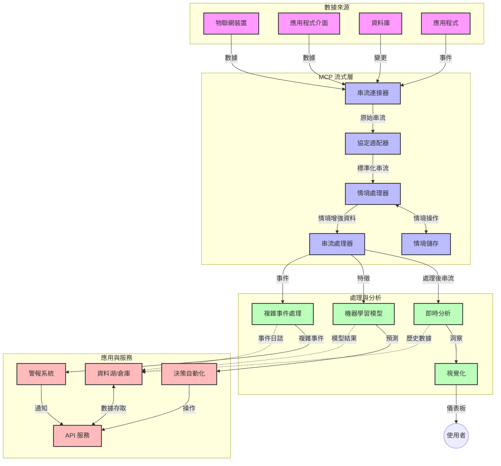

# 實時數據串流的模型上下文協議

## 概述

在今日以數據為驅動的世界中，實時數據串流已成為不可或缺的技術，企業與應用程式需要即時獲取資訊以作出迅速決策。模型上下文協議（Model Context Protocol，MCP）對優化這些實時串流過程帶來了重要突破，提高數據處理效率、維護上下文完整性，並增強整體系統性能。

本模組探討 MCP 如何透過為 AI 模型、串流平台及應用程式提供標準化的上下文管理方法，改變實時數據串流領域。

## 實時數據串流介紹

實時數據串流是一種技術範式，允許數據在產生時即持續傳輸、處理與分析，使系統能對新資訊即刻作出反應。不同於傳統批次處理只對靜態資料集作業，串流以動態資料流形式處理數據，提供延遲極低的洞察和行動。

### 實時數據串流的核心概念：

- <strong>連續數據流</strong>：數據以不間斷事件或記錄串流方式被處理。
- <strong>低延遲處理</strong>：系統設計以將數據生成到處理的時間降至最低。
- <strong>可擴展性</strong>：串流架構須能應付可變的數據量與流速。
- <strong>容錯能力</strong>：系統需具備故障韌性，確保數據流不中斷。
- <strong>有狀態處理</strong>：跨事件維持上下文對有意義分析至關重要。

### 模型上下文協議與實時串流

模型上下文協議（MCP）解決了實時串流環境中的多項關鍵挑戰：

1. <strong>上下文連續性</strong>：MCP 標準化分散式串流元件間的上下文維護，確保 AI 模型與處理節點能取得相關的歷史與環境上下文。

2. <strong>高效狀態管理</strong>：透過提供結構化的上下文傳輸機制，MCP 降低了串流管線中狀態管理的負擔。

3. <strong>互操作性</strong>：MCP 建立多元串流技術與 AI 模型間共通的上下文分享語言，促進更靈活與可擴充的架構。

4. <strong>串流優化的上下文</strong>：MCP 實作可優先處理對實時決策最相關的上下文元素，兼顧效能與準確性。

5. <strong>自適應處理</strong>：透過 MCP 的正確上下文管理，串流系統能依據數據中變化的條件與模式動態調整處理流程。

在從物聯網感測網絡到金融交易平台的現代應用中，MCP 與串流技術的整合使處理能更智能、具上下文感知，實時回應複雜且演變的情境。

## 學習目標

本課程結束後，您將能：

- 理解實時數據串流的基本原理及其挑戰
- 說明模型上下文協議（MCP）如何增強實時數據串流
- 使用 Kafka、Pulsar 等流行框架實作基於 MCP 的串流解決方案
- 設計與部署具容錯能力且高效能的 MCP 串流架構
- 將 MCP 概念應用於物聯網、金融交易及 AI 分析案例
- 評估基於 MCP 的串流技術新興趨勢與未來創新

### 定義與重要性

實時數據串流涉及數據的連續產生、處理與傳遞，延遲極低。與批次處理將數據分批收集與處理不同，串流數據隨到即處理，產生即時洞察與行動。

實時數據串流的核心特性包括：

- <strong>低延遲</strong>：在毫秒至秒級內處理與分析數據
- <strong>連續流動</strong>：來自多個來源不間斷的數據流
- <strong>即時處理</strong>：數據到達即被分析而非批次處理
- <strong>事件驅動架構</strong>：即時對事件發生做出反應

### 傳統數據串流的挑戰

傳統數據串流面臨多項限制：

1. <strong>上下文遺失</strong>：難以跨分散系統保持上下文
2. <strong>可擴展性問題</strong>：難以規模化處理高量及高速度數據
3. <strong>整合複雜性</strong>：系統間互通困難
4. <strong>延遲管理</strong>：須平衡吞吐量與處理時間
5. <strong>數據一致性</strong>：確保串流中數據的準確性與完整性

## 認識模型上下文協議（MCP）

### MCP 是什麼？

模型上下文協議（MCP）是一套標準化通訊協議，旨在促進 AI 模型與應用間的高效互動。在實時數據串流中，MCP 提供框架來：

- 保留整個數據管線的上下文
- 標準化數據交換格式
- 優化龐大數據集的傳輸
- 強化模型對模型及模型對應用的通訊

### 核心組件與架構

MCP 面向實時串流的架構包含數個核心元件：

1. <strong>上下文處理器</strong>：管理並維持串流管線中的上下文資訊
2. <strong>串流處理器</strong>：利用上下文感知技術處理輸入數據流
3. <strong>協議轉換器</strong>：在不同串流協議間轉換，且保留上下文
4. <strong>上下文存儲</strong>：高效儲存及檢索上下文資訊
5. <strong>串流連接器</strong>：連接各種串流平台（Kafka、Pulsar、Kinesis 等）




### MCP 如何提升實時數據處理

MCP 解決傳統串流挑戰包括：

- <strong>上下文完整性</strong>：維繫整條管線中數據點間關聯
- <strong>優化傳輸</strong>：透過智慧上下文管理減少交換的冗餘數據
- <strong>標準化介面</strong>：為串流元件提供一致的 API
- <strong>降低延遲</strong>：藉優化上下文處理減少處理負擔
- <strong>強化可擴展性</strong>：支援橫向擴展同時保持上下文

## 整合與實作

實時數據串流系統需謹慎架構設計與實施，以兼顧性能與上下文完整性。模型上下文協議提供標準方法整合 AI 模型及串流技術，打造更複雜且具上下文感知的處理管線。

### MCP 在串流架構中的整合概述

在實時串流環境實施 MCP 涉及多項關鍵考量：

1. <strong>上下文序列化與傳輸</strong>：MCP 提供高效編碼機制，將上下文資訊嵌入串流數據包中，確保重要上下文隨數據流經整個處理管線。包含優化串流傳輸的標準化序列化格式。

2. <strong>有狀態串流處理</strong>：MCP 通過保持處理節點間一致的上下文表示，支持更智能的有狀態處理。此特性對分散式串流架構尤為重要，而此類架構往往面臨狀態管理挑戰。

3. <strong>事件時間與處理時間</strong>：MCP 在串流系統中須處理事件發生時間與處理時間的區分挑戰。協議可加入保留事件時間語意的時間上下文。

4. <strong>背壓管理</strong>：透過標準化上下文處理，MCP 協助管理串流系統背壓，使元件能表達處理能力並相應調整流量。

5. <strong>上下文窗口與聚合</strong>：MCP 支援更先進的窗口操作，透過結構化時間與關聯上下文表示，使事件流間能做更有意義的聚合。

6. <strong>精確一次處理</strong>：對於需精確一次語意的串流系統，MCP 可涵蓋處理元資料，有助追蹤並驗證分散元件的處理狀況。

MCP 在多種串流技術中的實作打造統一的上下文管理方法，降低自訂整合程式碼需求，同時提升系統在數據流經管線時維護有效上下文的能力。

### MCP 在不同數據串流框架中的應用

以下範例遵循目前 MCP 規範，基於 JSON-RPC 協議並配有多樣化傳輸機制。程式碼示範您如何實作自訂傳輸，整合 Kafka 與 Pulsar 等串流平台，同時完全相容 MCP 協議。

這些範例旨在展示如何以 MCP 保留核心上下文感知，實現串流平台即時數據處理。此方式保證範例程式碼準確反映至 2025 年 6 月 MCP 規範現狀。

MCP 可整合常見串流框架，包含：

#### Apache Kafka 整合

```python
import asyncio
import json
from typing import Dict, Any, Optional
from confluent_kafka import Consumer, Producer, KafkaError
from mcp.client import Client, ClientCapabilities
from mcp.core.message import JsonRpcMessage
from mcp.core.transports import Transport

# 自訂傳輸類別以橋接 MCP 與 Kafka
class KafkaMCPTransport(Transport):
    def __init__(self, bootstrap_servers: str, input_topic: str, output_topic: str):
        self.bootstrap_servers = bootstrap_servers
        self.input_topic = input_topic
        self.output_topic = output_topic
        self.producer = Producer({'bootstrap.servers': bootstrap_servers})
        self.consumer = Consumer({
            'bootstrap.servers': bootstrap_servers,
            'group.id': 'mcp-client-group',
            'auto.offset.reset': 'earliest'
        })
        self.message_queue = asyncio.Queue()
        self.running = False
        self.consumer_task = None
        
    async def connect(self):
        """Connect to Kafka and start consuming messages"""
        self.consumer.subscribe([self.input_topic])
        self.running = True
        self.consumer_task = asyncio.create_task(self._consume_messages())
        return self
        
    async def _consume_messages(self):
        """Background task to consume messages from Kafka and queue them for processing"""
        while self.running:
            try:
                msg = self.consumer.poll(1.0)
                if msg is None:
                    await asyncio.sleep(0.1)
                    continue
                
                if msg.error():
                    if msg.error().code() == KafkaError._PARTITION_EOF:
                        continue
                    print(f"Consumer error: {msg.error()}")
                    continue
                
                # 將訊息值解析為 JSON-RPC
                try:
                    message_str = msg.value().decode('utf-8')
                    message_data = json.loads(message_str)
                    mcp_message = JsonRpcMessage.from_dict(message_data)
                    await self.message_queue.put(mcp_message)
                except Exception as e:
                    print(f"Error parsing message: {e}")
            except Exception as e:
                print(f"Error in consumer loop: {e}")
                await asyncio.sleep(1)
    
    async def read(self) -> Optional[JsonRpcMessage]:
        """Read the next message from the queue"""
        try:
            message = await self.message_queue.get()
            return message
        except Exception as e:
            print(f"Error reading message: {e}")
            return None
    
    async def write(self, message: JsonRpcMessage) -> None:
        """Write a message to the Kafka output topic"""
        try:
            message_json = json.dumps(message.to_dict())
            self.producer.produce(
                self.output_topic,
                message_json.encode('utf-8'),
                callback=self._delivery_report
            )
            self.producer.poll(0)  # 觸發回呼函式
        except Exception as e:
            print(f"Error writing message: {e}")
    
    def _delivery_report(self, err, msg):
        """Kafka producer delivery callback"""
        if err is not None:
            print(f'Message delivery failed: {err}')
        else:
            print(f'Message delivered to {msg.topic()} [{msg.partition()}]')
    
    async def close(self) -> None:
        """Close the transport"""
        self.running = False
        if self.consumer_task:
            self.consumer_task.cancel()
            try:
                await self.consumer_task
            except asyncio.CancelledError:
                pass
        self.consumer.close()
        self.producer.flush()

# Kafka MCP 傳輸的範例用法
async def kafka_mcp_example():
    # 使用 Kafka 傳輸建立 MCP 用戶端
    client = Client(
        {"name": "kafka-mcp-client", "version": "1.0.0"},
        ClientCapabilities({})
    )
    
    # 建立並連線 Kafka 傳輸
    transport = KafkaMCPTransport(
        bootstrap_servers="localhost:9092",
        input_topic="mcp-responses",
        output_topic="mcp-requests"
    )
    
    await client.connect(transport)
    
    try:
        # 初始化 MCP 工作階段
        await client.initialize()
        
        # 透過 MCP 執行工具的範例
        response = await client.execute_tool(
            "process_data",
            {
                "data": "sample data",
                "metadata": {
                    "source": "sensor-1",
                    "timestamp": "2025-06-12T10:30:00Z"
                }
            }
        )
        
        print(f"Tool execution response: {response}")
        
        # 乾淨關閉
        await client.shutdown()
    finally:
        await transport.close()

# 執行範例
if __name__ == "__main__":
    asyncio.run(kafka_mcp_example())
```


#### Apache Pulsar 實作

```python
import asyncio
import json
import pulsar
from typing import Dict, Any, Optional
from mcp.core.message import JsonRpcMessage
from mcp.core.transports import Transport
from mcp.server import Server, ServerOptions
from mcp.server.tools import Tool, ToolExecutionContext, ToolMetadata

# 建立一個使用 Pulsar 的自訂 MCP 傳輸
class PulsarMCPTransport(Transport):
    def __init__(self, service_url: str, request_topic: str, response_topic: str):
        self.service_url = service_url
        self.request_topic = request_topic
        self.response_topic = response_topic
        self.client = pulsar.Client(service_url)
        self.producer = self.client.create_producer(response_topic)
        self.consumer = self.client.subscribe(
            request_topic,
            "mcp-server-subscription",
            consumer_type=pulsar.ConsumerType.Shared
        )
        self.message_queue = asyncio.Queue()
        self.running = False
        self.consumer_task = None
    
    async def connect(self):
        """Connect to Pulsar and start consuming messages"""
        self.running = True
        self.consumer_task = asyncio.create_task(self._consume_messages())
        return self
    
    async def _consume_messages(self):
        """Background task to consume messages from Pulsar and queue them for processing"""
        while self.running:
            try:
                # 非阻塞接收並設有超時
                msg = self.consumer.receive(timeout_millis=500)
                
                # 處理訊息
                try:
                    message_str = msg.data().decode('utf-8')
                    message_data = json.loads(message_str)
                    mcp_message = JsonRpcMessage.from_dict(message_data)
                    await self.message_queue.put(mcp_message)
                    
                    # 確認訊息
                    self.consumer.acknowledge(msg)
                except Exception as e:
                    print(f"Error processing message: {e}")
                    # 發生錯誤時否認訊息
                    self.consumer.negative_acknowledge(msg)
            except Exception as e:
                # 處理超時或其他例外狀況
                await asyncio.sleep(0.1)
    
    async def read(self) -> Optional[JsonRpcMessage]:
        """Read the next message from the queue"""
        try:
            message = await self.message_queue.get()
            return message
        except Exception as e:
            print(f"Error reading message: {e}")
            return None
    
    async def write(self, message: JsonRpcMessage) -> None:
        """Write a message to the Pulsar output topic"""
        try:
            message_json = json.dumps(message.to_dict())
            self.producer.send(message_json.encode('utf-8'))
        except Exception as e:
            print(f"Error writing message: {e}")
    
    async def close(self) -> None:
        """Close the transport"""
        self.running = False
        if self.consumer_task:
            self.consumer_task.cancel()
            try:
                await self.consumer_task
            except asyncio.CancelledError:
                pass
        self.consumer.close()
        self.producer.close()
        self.client.close()

# 定義一個用來處理串流資料的示例 MCP 工具
@Tool(
    name="process_streaming_data",
    description="Process streaming data with context preservation",
    metadata=ToolMetadata(
        required_capabilities=["streaming"]
    )
)
async def process_streaming_data(
    ctx: ToolExecutionContext,
    data: str,
    source: str,
    priority: str = "medium"
) -> Dict[str, Any]:
    """
    Process streaming data while preserving context
    
    Args:
        ctx: Tool execution context
        data: The data to process
        source: The source of the data
        priority: Priority level (low, medium, high)
        
    Returns:
        Dict containing processed results and context information
    """
    # 利用 MCP 上下文的示例處理
    print(f"Processing data from {source} with priority {priority}")
    
    # 從 MCP 存取會話上下文
    conversation_id = ctx.conversation_id if hasattr(ctx, 'conversation_id') else "unknown"
    
    # 回傳附加強化上下文的結果
    return {
        "processed_data": f"Processed: {data}",
        "context": {
            "conversation_id": conversation_id,
            "source": source,
            "priority": priority,
            "processing_timestamp": ctx.get_current_time_iso()
        }
    }

# 使用 Pulsar 傳輸的 MCP 伺服器示例實作
async def run_mcp_server_with_pulsar():
    # 建立 MCP 伺服器
    server = Server(
        {"name": "pulsar-mcp-server", "version": "1.0.0"},
        ServerOptions(
            capabilities={"streaming": True}
        )
    )
    
    # 註冊我們的工具
    server.register_tool(process_streaming_data)
    
    # 建立並連接 Pulsar 傳輸
    transport = PulsarMCPTransport(
        service_url="pulsar://localhost:6650",
        request_topic="mcp-requests",
        response_topic="mcp-responses"
    )
    
    try:
        # 用 Pulsar 傳輸啟動伺服器
        await server.run(transport)
    finally:
        await transport.close()

# 運行伺服器
if __name__ == "__main__":
    asyncio.run(run_mcp_server_with_pulsar())
```


### 部署最佳實踐

實施 MCP 實時串流時應：

1. <strong>設計容錯能力</strong>：
   - 實作適當錯誤處理
   - 使用死信佇列處理失敗訊息
   - 設計冪等處理器

2. <strong>優化效能</strong>：
   - 配置合適的緩衝區大小
   - 適用時使用批次處理
   - 實施背壓機制

3. <strong>監控與觀察</strong>：
   - 追蹤串流處理指標
   - 監視上下文傳播情況
   - 設置異常警報

4. <strong>保護串流安全</strong>：
   - 對敏感資料實施加密
   - 採用身份驗證與授權
   - 應用適當存取控制


### MCP 在物聯網與邊緣運算的應用

MCP 透過以下方式強化物聯網串流：

- 在處理管線中保留設備上下文
- 支援高效邊緣至雲端數據串流
- 支持物聯網數據串流的實時分析
- 促進具上下文的設備間通信

範例：智慧城市感測器網絡  
```
Sensors → Edge Gateways → MCP Stream Processors → Real-time Analytics → Automated Responses
```


### 在金融交易與高頻交易中的角色

MCP 為金融數據串流帶來顯著優勢：

- 超低延遲處理以支持交易決策
- 在整個處理中維護交易上下文
- 支持帶上下文感知的複雜事件處理
- 確保分散式交易系統的數據一致性

### 強化 AI 驅動的數據分析

MCP 開啟串流分析新可能：

- 實時模型訓練與推論
- 從串流數據持續學習
- 上下文感知的特徵提取
- 維持上下文的多模型推論管線

## 未來趨勢與創新

### MCP 在實時環境中的演進

未來展望 MCP 將解決：

- <strong>量子計算整合</strong>：為量子串流系統做準備
- <strong>邊緣原生處理</strong>：將更多上下文感知處理移至邊緣設備
- <strong>自主串流管理</strong>：自我優化串流管線
- <strong>聯邦串流</strong>：在維護隱私下實現分散處理

### 潛在技術突破

將塑造 MCP 串流未來的技術：

1. **AI 優化串流協議**：專為 AI 工作負載設計的定制協議
2. <strong>神經形態計算整合</strong>：靈感來自大腦的串流處理計算
3. <strong>無伺服器串流</strong>：事件驅動且可擴展的串流，無需基礎設施管理
4. <strong>分散式上下文存儲</strong>：全球分布但高度一致的上下文管理

## 實作練習

### 練習一：建立基本 MCP 串流管線

在此練習中，您將學習如何：
- 配置基本 MCP 串流環境
- 實作串流處理的上下文處理器
- 測試與驗證上下文保存

### 練習二：打造實時分析儀表板

建立完整應用程式，能：
- 使用 MCP 讀入串流數據
- 在保持上下文的情況下處理串流
- 實時視覺化結果

### 練習三：用 MCP 實作複雜事件處理

進階練習涵蓋：
- 串流中的模式偵測
- 多串流間的上下文關聯
- 生成帶上下文的複雜事件

## 其他資源

- [Model Context Protocol Specification](https://modelcontextprotocol.io) - 官方 MCP 規範與文件
- [Apache Kafka Documentation](https://kafka.apache.org/documentation/) - 學習 Kafka 串流處理
- [Apache Pulsar](https://pulsar.apache.org/) - 統一訊息與串流平台
- [Streaming Systems: The What, Where, When, and How of Large-Scale Data Processing](https://www.oreilly.com/library/view/streaming-systems/9781491983867/) - 全面介紹串流架構的書籍
- [Microsoft Azure Event Hubs](https://learn.microsoft.com/azure/event-hubs/event-hubs-about) - 託管事件串流服務
- [MLflow Documentation](https://mlflow.org/docs/latest/index.html) - 用於機器學習模型追蹤與部署
- [Real-Time Analytics with Apache Storm](https://storm.apache.org/releases/current/index.html) - 雲端實時計算框架
- [Flink ML](https://nightlies.apache.org/flink/flink-ml-docs-master/) - Apache Flink 機器學習庫
- [LangChain Documentation](https://python.langchain.com/docs/get_started/introduction) - 使用大型語言模型構建應用程式


## 學習成果

完成本模組後，您將能：

- 了解實時數據串流的基礎與挑戰
- 說明模型上下文協議（MCP）如何提升實時數據串流
- 使用 Kafka 與 Pulsar 等流行框架實作基於 MCP 的串流方案
- 設計並部署具容錯且高效能的 MCP 串流架構
- 將 MCP 概念應用於物聯網、金融交易及 AI 分析案例
- 評估 MCP 串流技術的新興趨勢與未來創新

## 接下來的內容

- [5.11 實時搜尋](../mcp-realtimesearch/README.md)

---

<!-- CO-OP TRANSLATOR DISCLAIMER START -->
**免責聲明**：
本文件由 AI 翻譯服務 [Co-op Translator](https://github.com/Azure/co-op-translator) 翻譯而成。雖然我們致力於確保準確性，但請注意，機器自動翻譯可能包含錯誤或不準確之處。原始文件的母語版本應被視為權威來源。對於重要資訊，建議進行專業人工翻譯。我們不對因使用本翻譯而產生的任何誤解或誤釋承擔責任。
<!-- CO-OP TRANSLATOR DISCLAIMER END -->