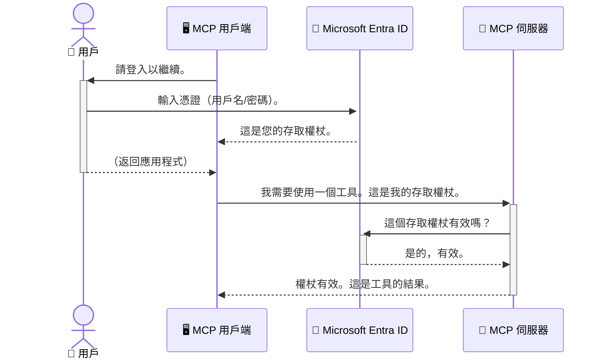

# 保護 AI 工作流程：Entra ID 驗證用於模型上下文協議伺服器

## 介紹
保護您的模型上下文協議（MCP）伺服器就像鎖好您家的前門一樣重要。將您的 MCP 伺服器開放，會使您的工具和數據暴露於未經授權的存取，可能導致安全漏洞。Microsoft Entra ID 提供強大的雲端身份和存取管理方案，可協助確保只有授權的使用者和應用程式能與您的 MCP 伺服器互動。在本節中，您將學習如何使用 Entra ID 驗證來保護您的 AI 工作流程。

## 學習目標
完成本節後，您將能夠：

- 了解保護 MCP 伺服器的重要性。
- 解釋 Microsoft Entra ID 和 OAuth 2.0 驗證的基礎知識。
- 辨識公開用戶端與機密用戶端的差異。
- 在本地（公開用戶端）和遠端（機密用戶端）MCP 伺服器情境中實作 Entra ID 驗證。
- 在開發 AI 工作流程時應用安全最佳實務。

## 安全與 MCP

就像您不會將家門敞開一樣，也不應讓任何人都能訪問您的 MCP 伺服器。保護您的 AI 工作流程是構建健全、可靠且安全應用的關鍵。本章將介紹如何使用 Microsoft Entra ID 來保護您的 MCP 伺服器，確保只有授權的使用者和應用程式能使用您的工具和數據。

## 為什麼 MCP 伺服器的安全很重要

想像您的 MCP 伺服器有一個可以發送電子郵件或存取客戶資料庫的工具。若未加以保護，任何人都可能使用該工具，導致未經授權的資料存取、垃圾郵件或其他惡意行為。

透過實作驗證，您可確保每一個對伺服器的請求都會經過核實，確認請求者的身份（使用者或應用程式）。這是保護您的 AI 工作流程的第一步，也是最關鍵的一步。

## Microsoft Entra ID 介紹

[**Microsoft Entra ID**](https://adoption.microsoft.com/microsoft-security/entra/) 是一項基於雲端的身份和存取管理服務。您可以想像成您的應用程式的通用保安。它負責複雜的驗證流程（確認使用者身份）及授權流程（決定使用者可執行的操作）。

使用 Entra ID，您可以：

- 啟用安全的使用者登入。
- 保護 API 和服務。
- 從中央位置管理存取政策。

對 MCP 伺服器而言，Entra ID 提供強大且廣泛信任的解決方案，以管理誰能存取伺服器的功能。

---

## 揭開神秘面紗：Entra ID 驗證的運作方式

Entra ID 使用像是 **OAuth 2.0** 這樣的開放標準來處理驗證。雖然細節可能複雜，但核心概念簡單，可透過類比理解。

### OAuth 2.0 溫和入門：代客鑰匙

把 OAuth 2.0 想像成您車子的代客泊車服務。當您到達餐廳時，不會把車子的主鑰匙給代客，而是給他一把擁有限制權限的 <strong>代客鑰匙</strong>——它能啟動車子並鎖門，但不能打開後備箱或手套箱。

在這個類比中：

- <strong>您</strong> 是 <strong>使用者</strong>。
- <strong>您的車</strong> 是擁有寶貴工具和數據的 **MCP 伺服器**。
- <strong>代客</strong> 是 **Microsoft Entra ID**。
- <strong>停車場服務員</strong> 是 **MCP 用戶端**（嘗試連接伺服器的應用程式）。
- <strong>代客鑰匙</strong> 是 **存取權杖（Access Token）**。

存取權杖是安全的文字串，由 MCP 用戶端在您登入後從 Entra ID 收到。用戶端隨每次請求都會帶著這個權杖給 MCP 伺服器，伺服器即可驗證這個權杖，確保請求合法且擁有必要權限，且無需處理您的實際憑證（例如密碼）。

### 驗證流程

實際流程如下：



### 介紹 Microsoft Authentication Library (MSAL)

在深入程式碼前，須先介紹您在範例中會看到的重要元件：**Microsoft Authentication Library (MSAL)**。

MSAL 是由 Microsoft 開發的函式庫，使開發者輕鬆處理驗證。您不必自行編寫複雜程式碼來處理安全權杖、管理登入與重新整理階段，MSAL 會幫您處理這些繁重任務。

建議使用 MSAL 的原因包括：

- **安全性高：** 它實作產業標準協定和安全最佳實務，減少程式碼漏洞風險。
- **簡化開發：** 它抽象化 OAuth 2.0 和 OpenID Connect 協定的複雜性，只需少量程式碼便可增加強健的驗證功能。
- **持續維護：** Microsoft 持續維護和更新 MSAL，以應對新安全威脅和平台變動。

MSAL 支援多種語言和應用框架，包括 .NET、JavaScript/TypeScript、Python、Java、Go 以及 iOS 和 Android 等行動平台。意即您可在整個技術堆疊中使用一致的驗證模式。

欲了解 MSAL 詳情，請參考官方 [MSAL 總覽文件](https://learn.microsoft.com/entra/identity-platform/msal-overview)。

---

## 使用 Entra ID 保護您的 MCP 伺服器：逐步指南

現在，我們來示範如何使用 Entra ID 保護本地 MCP 伺服器（透過 `stdio` 通訊）。本範例使用 <strong>公開用戶端</strong>，適用於執行於使用者電腦上的應用程式（例如桌面應用或本地開發伺服器）。

### 情境一：保護本地 MCP 伺服器（使用公開用戶端）

在此情境中，我們有一個本地運行、透過 `stdio` 通訊的 MCP 伺服器，使用 Entra ID 驗證使用者後，才准許存取其工具。該伺服器有一個工具，可以從 Microsoft Graph API 取得使用者的個人資料。

#### 1. 在 Entra ID 中設定應用程式

在撰寫程式碼前，您需要先在 Microsoft Entra ID 中註冊您的應用程式。這會告訴 Entra ID 您的應用程式，並授予其使用驗證服務的權限。

1. 前往 **[Microsoft Entra 入口網站](https://entra.microsoft.com/)**。
2. 進入 **App registrations**，點選 **New registration**。
3. 為您的應用程式命名（例如：「My Local MCP Server」）。
4. 在 **Supported account types** 選擇 **Accounts in this organizational directory only**。
5. 這個範例中，可將 **Redirect URI** 留空。
6. 點擊 **Register**。

註冊完成後，請記下 **Application (client) ID** 和 **Directory (tenant) ID**，稍後程式碼需使用。

#### 2. 程式碼解析

以下是處理驗證核心程式碼片段。完整範例可在 [mcp-auth-servers GitHub 倉庫](https://github.com/Azure-Samples/mcp-auth-servers) 的 [Entra ID - Local - WAM](https://github.com/Azure-Samples/mcp-auth-servers/tree/main/src/entra-id-local-wam) 資料夾找到。

**`AuthenticationService.cs`**

此類別負責與 Entra ID 互動。

- **`CreateAsync`**：使用 MSAL（Microsoft Authentication Library）初始化 `PublicClientApplication`。設定包括您的應用程式 `clientId` 和 `tenantId`。
- **`WithBroker`**：啟用使用代理（例如 Windows Web Account Manager），提供更安全且無縫的單一登入體驗。
- **`AcquireTokenAsync`**：核心方法。它首先嘗試靜默取得權杖（若使用者已有有效登入則無需再次登入）。若無法靜默取得權杖，將互動式提示使用者登入。

```csharp
// Simplified for clarity
public static async Task<AuthenticationService> CreateAsync(ILogger<AuthenticationService> logger)
{
    var msalClient = PublicClientApplicationBuilder
        .Create(_clientId) // Your Application (client) ID
        .WithAuthority(AadAuthorityAudience.AzureAdMyOrg)
        .WithTenantId(_tenantId) // Your Directory (tenant) ID
        .WithBroker(new BrokerOptions(BrokerOptions.OperatingSystems.Windows))
        .Build();

    // ... cache registration ...

    return new AuthenticationService(logger, msalClient);
}

public async Task<string> AcquireTokenAsync()
{
    try
    {
        // Try silent authentication first
        var accounts = await _msalClient.GetAccountsAsync();
        var account = accounts.FirstOrDefault();

        AuthenticationResult? result = null;

        if (account != null)
        {
            result = await _msalClient.AcquireTokenSilent(_scopes, account).ExecuteAsync();
        }
        else
        {
            // If no account, or silent fails, go interactive
            result = await _msalClient.AcquireTokenInteractive(_scopes).ExecuteAsync();
        }

        return result.AccessToken;
    }
    catch (Exception ex)
    {
        _logger.LogError(ex, "An error occurred while acquiring the token.");
        throw; // Optionally rethrow the exception for higher-level handling
    }
}
```

**`Program.cs`**

此處設定 MCP 伺服器並整合驗證服務。

- **`AddSingleton<AuthenticationService>`**：將 `AuthenticationService` 註冊至依賴注入容器，供應用其他部分（如工具）使用。
- **`GetUserDetailsFromGraph` 工具**：此工具需 `AuthenticationService` 實例。使用前先呼叫 `authService.AcquireTokenAsync()` 取得有效存取權杖。驗證成功後，使用該權杖呼叫 Microsoft Graph API 取得使用者資料。

```csharp
// Simplified for clarity
[McpServerTool(Name = "GetUserDetailsFromGraph")]
public static async Task<string> GetUserDetailsFromGraph(
    AuthenticationService authService)
{
    try
    {
        // This will trigger the authentication flow
        var accessToken = await authService.AcquireTokenAsync();

        // Use the token to create a GraphServiceClient
        var graphClient = new GraphServiceClient(
            new BaseBearerTokenAuthenticationProvider(new TokenProvider(authService)));

        var user = await graphClient.Me.GetAsync();

        return System.Text.Json.JsonSerializer.Serialize(user);
    }
    catch (Exception ex)
    {
        return $"Error: {ex.Message}";
    }
}
```

#### 3. 全流程協作說明

1. 當 MCP 用戶端試圖使用 `GetUserDetailsFromGraph` 工具時，工具先呼叫 `AcquireTokenAsync`。
2. `AcquireTokenAsync` 觸發 MSAL 庫檢查有效權杖。
3. 若無權杖，MSAL 透過代理，提示使用者以 Entra ID 帳戶登入。
4. 使用者登入後，Entra ID 頒發存取權杖。
5. 工具取得權杖，使用它安全呼叫 Microsoft Graph API。
6. 使用者詳細資料回傳給 MCP 用戶端。

此流程確保只有通過驗證的使用者能使用工具，有效保護您的本地 MCP 伺服器。

### 情境二：保護遠端 MCP 伺服器（使用機密用戶端）

當 MCP 伺服器運行於遠端機器（如雲端伺服器），並透過 HTTP Streaming 類協定通訊時，安全需求有所不同。這時應使用 <strong>機密用戶端</strong> 與 **授權碼流程（Authorization Code Flow）**。此方法較安全，因為應用程式秘密不會暴露給瀏覽器。

本範例使用 TypeScript 實作 MCP 伺服器，並以 Express.js 處理 HTTP 請求。

#### 1. 在 Entra ID 中設定應用程式

Entra ID 中的設定與公開用戶端相似，但需多做一件重要事：建立 **客戶端秘密（client secret）**。

1. 前往 **[Microsoft Entra 入口網站](https://entra.microsoft.com/)**。
2. 在您的應用程式註冊中，前往 **Certificates & secrets** 分頁。
3. 點選 **New client secret**，輸入描述後新增。
4. **重要：** 立即複製秘密值，之後無法再查閱。
5. 您還需設定 **Redirect URI**。前往 **Authentication** 分頁，點選 **Add a platform**，選擇 **Web**，輸入應用程式的重導向 URI（例如：`http://localhost:3001/auth/callback`）。

> **⚠️ 重要安全提示：** 對於生產環境應用程式，Microsoft 強烈建議使用 <strong>無秘密驗證</strong> 方法，例如 **Managed Identity** 或 **Workload Identity Federation**，取代客戶端秘密。客戶端秘密存在暴露或洩漏風險。Managed Identity 提供更安全的方案，無需在程式碼或設定中儲存憑證。
>
> 有關管理身分的更多資訊及實作說明，請參閱 [Azure 資源的管理身分總覽](https://learn.microsoft.com/entra/identity/managed-identities-azure-resources/overview)。

#### 2. 程式碼解析

本範例採用基於 session 的方法。當使用者驗證時，伺服器會在 session 中存放存取權杖和重新整理權杖，並發放 session 令牌。之後請求均使用此 session 令牌。完整程式碼可在 [mcp-auth-servers GitHub 倉庫](https://github.com/Azure-Samples/mcp-auth-servers) 的 [Entra ID - Confidential client](https://github.com/Azure-Samples/mcp-auth-servers/tree/main/src/entra-id-cca-session) 資料夾找到。

**`Server.ts`**

此檔設定 Express 伺服器及 MCP 傳輸層。

- **`requireBearerAuth`**：中介軟體，保護 `/sse` 與 `/message` 端點。會檢查請求的 `Authorization` 標頭是否帶有有效的 bearer 令牌。
- **`EntraIdServerAuthProvider`**：自訂類別，實作 `McpServerAuthorizationProvider` 介面。負責處理 OAuth 2.0 流程。
- **`/auth/callback`**：用戶驗證後，Entra ID 會將使用者導向此端點。此端點負責把授權碼兌換成存取權杖和重新整理權杖。

```typescript
// 簡化以提高清晰度
const app = express();
const { server } = createServer();
const provider = new EntraIdServerAuthProvider();

// 保護 SSE 端點
app.get("/sse", requireBearerAuth({
  provider,
  requiredScopes: ["User.Read"]
}), async (req, res) => {
  // … 連接傳輸層 …
});

// 保護訊息端點
app.post("/message", requireBearerAuth({
  provider,
  requiredScopes: ["User.Read"]
}), async (req, res) => {
  // … 處理訊息 …
});

// 處理 OAuth 2.0 回調
app.get("/auth/callback", (req, res) => {
  provider.handleCallback(req.query.code, req.query.state)
    .then(result => {
      // … 處理成功或失敗 …
    });
});
```

**`Tools.ts`**

此檔定義 MCP 伺服器提供的工具。`getUserDetails` 工具與前例相似，但從 session 取得存取權杖。

```typescript
// 簡化以提高清晰度
server.setRequestHandler(CallToolRequestSchema, async (request) => {
  const { name } = request.params;
  const context = request.params?.context as { token?: string } | undefined;
  const sessionToken = context?.token;

  if (name === ToolName.GET_USER_DETAILS) {
    if (!sessionToken) {
      throw new AuthenticationError("Authentication token is missing or invalid. Ensure the token is provided in the request context.");
    }

    // 從會話存儲中獲取 Entra ID 令牌
    const tokenData = tokenStore.getToken(sessionToken);
    const entraIdToken = tokenData.accessToken;

    const graphClient = Client.init({
      authProvider: (done) => {
        done(null, entraIdToken);
      }
    });

    const user = await graphClient.api('/me').get();

    // ... 返回用戶詳情 ...
  }
});
```

**`auth/EntraIdServerAuthProvider.ts`**

此類別負責：

- 導向使用者至 Entra ID 登入頁面。
- 用授權碼兌換存取權杖。
- 將權杖存入 `tokenStore`。
- 存取權杖過期時自動刷新。

#### 3. 全流程協作說明

1. 使用者首次嘗試連接 MCP 伺服器時，`requireBearerAuth` 中介軟體會發現其無有效 session，將其導向 Entra ID 登入頁面。
2. 使用者以 Entra ID 帳號登入。
3. Entra ID 會將使用者重新導向回 `/auth/callback` 端點，並附帶授權碼。
4. 伺服器會將該授權碼換取存取權杖和更新權杖，並將它們儲存起來，接著建立一個會話權杖並傳送到客戶端。
5. 客戶端現在可以在往後對 MCP 伺服器的所有請求中，在 `Authorization` 標頭裡使用此會話權杖。
6. 當呼叫 `getUserDetails` 工具時，它會使用會話權杖查找 Entra ID 的存取權杖，然後使用該權杖呼叫 Microsoft Graph API。

此流程比公開用戶端流程更複雜，但對於面向網際網路的端點是必要的。由於遠端 MCP 伺服器可透過公共網際網路存取，因此需要更強的安全措施來防止未授權存取和潛在攻擊。


## 安全最佳實踐

- **始終使用 HTTPS**：加密客戶端與伺服器之間的通信，以保護權杖不被攔截。
- **實施基於角色的存取控制 (RBAC)**：不要只檢查使用者是否已驗證；還要檢查他們被授權執行哪些操作。您可以在 Entra ID 中定義角色，並在您的 MCP 伺服器中檢查這些角色。
- <strong>監控與稽核</strong>：記錄所有驗證事件，以便您能偵測並回應可疑活動。
- <strong>處理速率限制和節流</strong>：Microsoft Graph 和其他 API 實施速率限制以防止濫用。在您的 MCP 伺服器中實現指數退避和重試機制，以優雅地處理 HTTP 429（請求過多）回應。考慮快取常用資料以減少 API 呼叫次數。
- <strong>安全管理權杖儲存</strong>：安全地儲存存取權杖和更新權杖。對於本機應用程式，使用系統的安全儲存機制。對於伺服器應用程式，考慮使用加密儲存或安全金鑰管理服務，如 Azure Key Vault。
- <strong>權杖過期處理</strong>：存取權杖有使用期限。使用更新權杖自動刷新權杖，維持無縫的使用者體驗，無需重新驗證。
- **考慮使用 Azure API 管理**：雖然直接在 MCP 伺服器中實作安全可讓您進行更細緻的控制，API 閘道如 Azure API 管理可以自動處理許多安全相關問題，包括驗證、授權、速率限制和監控。它們提供一個集中式的安全層，位於您的客戶端與 MCP 伺服器之間。關於在 MCP 中使用 API 閘道的詳細資訊，請參閱我們的[Azure API 管理：MCP 伺服器的驗證閘道](https://techcommunity.microsoft.com/blog/integrationsonazureblog/azure-api-management-your-auth-gateway-for-mcp-servers/4402690)。


## 主要重點

- 保護您的 MCP 伺服器對保護資料和工具至關重要。
- Microsoft Entra ID 提供強大且可擴充的驗證和授權解決方案。
- 本地應用程式使用 <strong>公開用戶端</strong>，遠端伺服器使用 <strong>機密用戶端</strong>。
- <strong>授權碼流程</strong> 是網頁應用程式中最安全的選擇。


## 練習

1. 想想您可能會建立的 MCP 伺服器，是本地伺服器還是遠端伺服器？
2. 根據您的答案，您會使用公開用戶端還是機密用戶端？
3. 您的 MCP 伺服器會請求哪些權限來對 Microsoft Graph 執行操作？


## 實作練習

### 練習 1：在 Entra ID 註冊應用程式
前往 Microsoft Entra 入口網站。
為您的 MCP 伺服器註冊新應用程式。
記錄應用程式（用戶端）ID 和目錄（租用戶）ID。

### 練習 2：保護本地 MCP 伺服器（公開用戶端）
- 按照程式碼範例整合 MSAL（Microsoft Authentication Library）進行使用者驗證。
- 透過呼叫 MCP 工具來從 Microsoft Graph 擷取使用者詳細資料，測試驗證流程。

### 練習 3：保護遠端 MCP 伺服器（機密用戶端）
- 在 Entra ID 中註冊機密用戶端並建立用戶端密鑰。
- 配置您的 Express.js MCP 伺服器使用授權碼流程。
- 測試受保護的端點並確認基於權杖的存取。

### 練習 4：應用安全最佳實踐
- 為您的本地或遠端伺服器啟用 HTTPS。
- 在伺服器邏輯中實施基於角色的存取控制 (RBAC)。
- 新增權杖過期處理及安全的權杖儲存。

## 資源

1. **MSAL 概述文件**  
   了解 Microsoft Authentication Library (MSAL) 如何跨平台實現安全的權杖取得：  
   [MSAL Overview on Microsoft Learn](https://learn.microsoft.com/en-gb/entra/msal/overview)

2. **Azure-Samples/mcp-auth-servers GitHub 倉庫**  
   MCP 伺服器驗證流程的參考實作：  
   [Azure-Samples/mcp-auth-servers on GitHub](https://github.com/Azure-Samples/mcp-auth-servers)

3. **Azure 資源管理身分概覽**  
   了解如何使用系統指派或使用者指派的管理身分，消除密碼需求：  
   [Managed Identities Overview on Microsoft Learn](https://learn.microsoft.com/en-us/entra/identity/managed-identities-azure-resources/)

4. **Azure API 管理：MCP 伺服器的驗證閘道**  
   深入探討如何使用 APIM 作為 MCP 伺服器的安全 OAuth2 閘道：  
   [Azure API Management Your Auth Gateway For MCP Servers](https://techcommunity.microsoft.com/blog/integrationsonazureblog/azure-api-management-your-auth-gateway-for-mcp-servers/4402690)

5. **Microsoft Graph 權限參考**  
   Microsoft Graph 的委派與應用程式權限完全列表：  
   [Microsoft Graph Permissions Reference](https://learn.microsoft.com/zh-tw/graph/permissions-reference)


## 學習成果
完成本節後，您將能夠：

- 說明為何驗證對 MCP 伺服器及 AI 工作流程至關重要。
- 設置並配置 Entra ID 驗證，適用於本地及遠端 MCP 伺服器情境。
- 根據伺服器部署選擇合適的用戶端類型（公開或機密）。
- 實施安全編碼實務，包括權杖儲存與基於角色的授權。
- 自信地保護您的 MCP 伺服器及其工具，免受未授權存取。

## 下一步

- [5.13 以 Microsoft Foundry 整合模型上下文協定 (MCP)](../mcp-foundry-agent-integration/README.md)

---

<!-- CO-OP TRANSLATOR DISCLAIMER START -->
**免責聲明**：
本文件由 AI 翻譯服務 [Co-op Translator](https://github.com/Azure/co-op-translator) 翻譯而成。雖然我們致力於確保準確性，但請注意，機器自動翻譯可能包含錯誤或不準確之處。原始文件的母語版本應被視為權威來源。對於重要資訊，建議進行專業人工翻譯。我們不對因使用本翻譯而產生的任何誤解或誤釋承擔責任。
<!-- CO-OP TRANSLATOR DISCLAIMER END -->