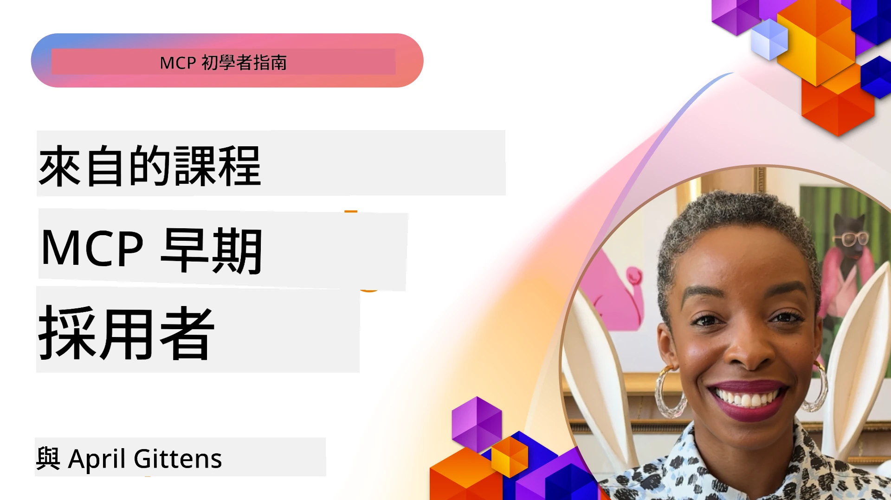

# 🌟 來自早期採用者的經驗教訓

[](https://youtu.be/jds7dSmNptE)

_(點擊上方圖片觀看本課程影片)_

## 🎯 本模組涵蓋內容

本模組探討真實組織和開發者如何運用模型上下文協議（Model Context Protocol，MCP）來解決實際挑戰並推動創新。透過詳細的案例研究、實作專案以及實務範例，你將發現 MCP 如何實現安全、可擴充的 AI 整合，連結語言模型、工具與企業資料。

### 📚 觀察 MCP 的實際應用

想看看這些原則如何應用於可投入生產的工具？請參考我們的[**10 個正在改變開發者生產力的 Microsoft MCP 伺服器**](microsoft-mcp-servers.md)，展示你今天即可使用的真實 Microsoft MCP 伺服器。

## 概覽

本課程探討早期採用者如何運用模型上下文協議（MCP）解決真實世界挑戰並推動跨產業創新。透過詳細的案例研究與實作專案，你將了解 MCP 如何促成標準化、安全且可擴充的 AI 整合 —— 在統一架構中連結大型語言模型、工具與企業資料。你將獲得設計和建置基於 MCP 解決方案的實務經驗，學習經過驗證的實作範式，並了解 MCP 在生產環境中部署的最佳實務。課程同時強調新興趨勢、未來方向及開源資源，協助你掌握 MCP 技術及其演進生態系的前沿。

## 學習目標

- 分析跨不同產業的真實 MCP 實作
- 設計並建立完整 MCP 應用程式
- 探索 MCP 技術的新興趨勢與未來方向
- 在實際開發場景中應用最佳實務

## 真實世界的 MCP 實作

### 案例研究 1：企業客戶支援自動化

一間跨國企業實作基於 MCP 的解決方案，標準化旗下客戶支援系統的 AI 互動，達成以下目標：

- 建立多個大型語言模型提供者的統一介面
- 各部門維護一致的提示詞管理
- 實作強健的安全與合規控管
- 根據需求靈活切換不同 AI 模型

**技術實作：**

```python
# Python MCP 伺服器實現用於客戶支援
import logging
import asyncio
from modelcontextprotocol import create_server, ServerConfig
from modelcontextprotocol.server import MCPServer
from modelcontextprotocol.transports import create_http_transport
from modelcontextprotocol.resources import ResourceDefinition
from modelcontextprotocol.prompts import PromptDefinition
from modelcontextprotocol.tool import ToolDefinition

# 配置日誌記錄
logging.basicConfig(level=logging.INFO)

async def main():
    # 創建伺服器配置
    config = ServerConfig(
        name="Enterprise Customer Support Server",
        version="1.0.0",
        description="MCP server for handling customer support inquiries"
    )
    
    # 初始化 MCP 伺服器
    server = create_server(config)
    
    # 註冊知識庫資源
    server.resources.register(
        ResourceDefinition(
            name="customer_kb",
            description="Customer knowledge base documentation"
        ),
        lambda params: get_customer_documentation(params)
    )
    
    # 註冊提示範本
    server.prompts.register(
        PromptDefinition(
            name="support_template",
            description="Templates for customer support responses"
        ),
        lambda params: get_support_templates(params)
    )
    
    # 註冊支援工具
    server.tools.register(
        ToolDefinition(
            name="ticketing",
            description="Create and update support tickets"
        ),
        handle_ticketing_operations
    )
    
    # 使用 HTTP 傳輸啟動伺服器
    transport = create_http_transport(port=8080)
    await server.run(transport)

if __name__ == "__main__":
    asyncio.run(main())
```
  
**成果：** 降低模型成本 30%，提升回應一致性 45%，並在全球營運中強化合規。

### 案例研究 2：醫療診斷助理

一家醫療服務機構建立 MCP 架構以整合多個專科醫療 AI 模型，同時確保敏感病患資料安全：

- 無縫切換通用及專科醫療模型
- 嚴格的隱私控管與稽核追蹤
- 與現有電子病歷系統（EHR）整合
- 醫療專業術語的統一提示詞工程

**技術實作：**

```csharp
// C# MCP host application implementation in healthcare application
using Microsoft.Extensions.DependencyInjection;
using ModelContextProtocol.SDK.Client;
using ModelContextProtocol.SDK.Security;
using ModelContextProtocol.SDK.Resources;

public class DiagnosticAssistant
{
    private readonly MCPHostClient _mcpClient;
    private readonly PatientContext _patientContext;
    
    public DiagnosticAssistant(PatientContext patientContext)
    {
        _patientContext = patientContext;
        
        // Configure MCP client with healthcare-specific settings
        var clientOptions = new ClientOptions
        {
            Name = "Healthcare Diagnostic Assistant",
            Version = "1.0.0",
            Security = new SecurityOptions
            {
                Encryption = EncryptionLevel.Medical,
                AuditEnabled = true
            }
        };
        
        _mcpClient = new MCPHostClientBuilder()
            .WithOptions(clientOptions)
            .WithTransport(new HttpTransport("https://healthcare-mcp.example.org"))
            .WithAuthentication(new HIPAACompliantAuthProvider())
            .Build();
    }
    
    public async Task<DiagnosticSuggestion> GetDiagnosticAssistance(
        string symptoms, string patientHistory)
    {
        // Create request with appropriate resources and tool access
        var resourceRequest = new ResourceRequest
        {
            Name = "patient_records",
            Parameters = new Dictionary<string, object>
            {
                ["patientId"] = _patientContext.PatientId,
                ["requestingProvider"] = _patientContext.ProviderId
            }
        };
        
        // Request diagnostic assistance using appropriate prompt
        var response = await _mcpClient.SendPromptRequestAsync(
            promptName: "diagnostic_assistance",
            parameters: new Dictionary<string, object>
            {
                ["symptoms"] = symptoms,
                patientHistory = patientHistory,
                relevantGuidelines = _patientContext.GetRelevantGuidelines()
            });
            
        return DiagnosticSuggestion.FromMCPResponse(response);
    }
}
```
  
**成果：** 改善醫師診斷建議，同時完全符合 HIPAA 規定，並明顯降低系統間上下文切換次數。

### 案例研究 3：金融服務風險分析

一間金融機構運用 MCP 標準化其跨部門風險分析流程：

- 建立信用風險、詐欺檢測與投資風險模型的統一接口
- 實施嚴格的存取控制與模型版本管理
- 確保所有 AI 建議均可稽核
- 各系統間保持一致的資料格式

**技術實作：**

```java
// 用於財務風險評估的Java MCP伺服器
import org.mcp.server.*;
import org.mcp.security.*;

public class FinancialRiskMCPServer {
    public static void main(String[] args) {
        // 建立具備財務合規功能的MCP伺服器
        MCPServer server = new MCPServerBuilder()
            .withModelProviders(
                new ModelProvider("risk-assessment-primary", new AzureOpenAIProvider()),
                new ModelProvider("risk-assessment-audit", new LocalLlamaProvider())
            )
            .withPromptTemplateDirectory("./compliance/templates")
            .withAccessControls(new SOCCompliantAccessControl())
            .withDataEncryption(EncryptionStandard.FINANCIAL_GRADE)
            .withVersionControl(true)
            .withAuditLogging(new DatabaseAuditLogger())
            .build();
            
        server.addRequestValidator(new FinancialDataValidator());
        server.addResponseFilter(new PII_RedactionFilter());
        
        server.start(9000);
        
        System.out.println("Financial Risk MCP Server running on port 9000");
    }
}
```
  
**成果：** 改善監管合規性，模型部署週期加快 40%，提升跨部門風險評估一致性。

### 案例研究 4：Microsoft Playwright MCP 伺服器實現瀏覽器自動化

微軟開發了[Playwright MCP 伺服器](https://github.com/microsoft/playwright-mcp)，利用模型上下文協議提供安全、標準化的瀏覽器自動化。此生產就緒伺服器允許 AI 代理人及大型語言模型以受控、可稽核且可延伸方式互動瀏覽器，支持自動化網頁測試、資料擷取與端對端工作流程。

> **🎯 生產就緒工具**  
>  
> 此案例呈現你今天即可使用的真實 MCP 伺服器！想了解 Playwright MCP 伺服器及其他 9 個生產就緒的 Microsoft MCP 伺服器，請參閱我們的[**Microsoft MCP 伺服器指南**](microsoft-mcp-servers.md#8--playwright-mcp-server)。

**主要功能：**  
- 將瀏覽器自動化功能（導覽、填表、截圖等）作為 MCP 工具公開  
- 建立嚴謹存取控制與沙盒機制以防止未授權操作  
- 提供所有瀏覽器互動的詳細稽核日誌  
- 支援與 Azure OpenAI 及其他大型語言模型供應商整合以促成代理人驅動的自動化  
- 為 GitHub Copilot 的程式碼代理人提供網頁瀏覽功能

**技術實作：**

```typescript
// TypeScript：在 MCP 伺服器中註冊 Playwright 瀏覽器自動化工具
import { createServer, ToolDefinition } from 'modelcontextprotocol';
import { launch } from 'playwright';

const server = createServer({
  name: 'Playwright MCP Server',
  version: '1.0.0',
  description: 'MCP server for browser automation using Playwright'
});

// 註冊一個用於導覽到 URL 及截取螢幕截圖的工具
server.tools.register(
  new ToolDefinition({
    name: 'navigate_and_screenshot',
    description: 'Navigate to a URL and capture a screenshot',
    parameters: {
      url: { type: 'string', description: 'The URL to visit' }
    }
  }),
  async ({ url }) => {
    const browser = await launch();
    const page = await browser.newPage();
    await page.goto(url);
    const screenshot = await page.screenshot();
    await browser.close();
    return { screenshot };
  }
);

// 啟動 MCP 伺服器
server.listen(8080);
```
  
**成果：**

- 實現 AI 代理人與大型語言模型的安全程式化瀏覽器自動化  
- 降低手動測試工作量並提升網頁應用測試涵蓋率  
- 提供可重用、可擴充的企業環境瀏覽器工具整合框架  
- 支持 GitHub Copilot 的網頁瀏覽功能

**參考資料：**  
- [Playwright MCP Server GitHub Repo](https://github.com/microsoft/playwright-mcp)  
- [Microsoft AI 與自動化方案](https://azure.microsoft.com/en-us/products/ai-services/)

### 案例研究 5：Azure MCP – 企業級 Model Context Protocol 即服務

Azure MCP 伺服器（[https://aka.ms/azmcp](https://aka.ms/azmcp)）是微軟管理的企業級 MCP 實作，設計為提供可擴展、安全且合規的 MCP 伺服器雲端服務。Azure MCP 使組織能快速部署、管理及整合 MCP 伺服器與 Azure AI、資料與安全服務，降低營運成本，加速 AI 採用。

> **🎯 生產就緒工具**  
>  
> 這是你今天即可使用的真實 MCP 伺服器！欲了解 Microsoft Foundry MCP 伺服器，請參閱我們的[**Microsoft MCP 伺服器指南**](microsoft-mcp-servers.md)。

- 完全管理 MCP 伺服器主機，內建擴充、監控與安全功能  
- 與 Azure OpenAI、Azure AI 搜尋及其他 Azure 服務原生整合  
- 透過 Microsoft Entra ID 實現企業身份驗證與授權  
- 支援自訂工具、提示詞範本及資源連接器  
- 符合企業安全與監管要求

**技術實作：**

```yaml
# Example: Azure MCP server deployment configuration (YAML)
apiVersion: mcp.microsoft.com/v1
kind: McpServer
metadata:
  name: enterprise-mcp-server
spec:
  modelProviders:
    - name: azure-openai
      type: AzureOpenAI
      endpoint: https://<your-openai-resource>.openai.azure.com/
      apiKeySecret: <your-azure-keyvault-secret>
  tools:
    - name: document_search
      type: AzureAISearch
      endpoint: https://<your-search-resource>.search.windows.net/
      apiKeySecret: <your-azure-keyvault-secret>
  authentication:
    type: EntraID
    tenantId: <your-tenant-id>
  monitoring:
    enabled: true
    logAnalyticsWorkspace: <your-log-analytics-id>
```
  
**成果：**  
- 提供即時可用、合規且可靠的 MCP 伺服器平台，縮短企業 AI 專案的價值實現時間  
- 簡化大型語言模型、工具與企業資料來源整合  
- 強化 MCP 工作負載的安全性、可觀察性與營運效率  
- 依照 Azure SDK 最佳實務及現代身份驗證模式提升程式碼品質

**參考資料：**  
- [Azure MCP 文件](https://aka.ms/azmcp)  
- [Azure MCP Server GitHub Repo](https://github.com/Azure/azure-mcp)  
- [Azure AI 服務](https://azure.microsoft.com/en-us/products/ai-services/)  
- [Microsoft MCP 中心](https://mcp.azure.com)

## 案例研究 6：NLWeb  
MCP（模型上下文協議）是一種新興協定，使聊天機器人與 AI 助理能與工具互動。每個 NLWeb 實例同時也是 MCP 伺服器，支援一個核心方法 ask，可向網站以自然語言提問。回傳的回答利用 schema.org 作為描述網頁資料的通用詞彙。簡言之，MCP 就像 HTTP 對 HTML 一樣，是 NLWeb 的平台。NLWeb 結合協定、Schema.org 格式與範例程式碼，幫助站點快速建立此類端點，既造福使用者的對話界面，也促進機器之間自然的代理互動。

NLWeb 有兩個主要組成部分：
- 一套非常簡易的協定，讓自然語言介面向網站提問，並透過 json 與 schema.org 格式回傳答案。請參考 REST API 文件了解詳情。  
- 基於（1）的簡單實作，利用現有標記，針對可抽象為項目列表（如商品、食譜、景點、評論等）的網站。加上使用者介面元件，網站能輕鬆提供對話式內容介面。工作原理詳見「聊天查詢的生命週期」文件。

**參考資料：**  
- [Azure MCP 文件](https://aka.ms/azmcp)  
- [NLWeb](https://github.com/microsoft/NlWeb)

### 案例研究 7：Microsoft Foundry MCP 伺服器 —— 企業 AI 代理整合

Microsoft Foundry MCP 伺服器展示 MCP 如何用於企業環境中協調及管理 AI 代理與工作流程。藉由與 Microsoft Foundry 整合，組織得以標準化代理互動、利用 Foundry 的工作流程管理功能，且確保部署安全、可擴充。

> **🎯 生產就緒工具**  
>  
> 這是你今天即可使用的真實 MCP 伺服器！想了解 Microsoft Foundry MCP 伺服器，請參閱我們的[**Microsoft MCP 伺服器指南**](microsoft-mcp-servers.md#9--microsoft-foundry-mcp-server)。

**主要功能：**  
- 完整存取 Azure AI 生態系，包括模型目錄與部署管理  
- 使用 Azure AI 搜尋進行知識索引，支援 RAG 應用  
- AI 模型效能及品質保證評估工具  
- 整合 Microsoft Foundry 目錄與實驗室的前沿研究模型  
- 代理管理與生產環境評估能力

**成果：**  
- 快速原型開發與 AI 代理工作流程的健全監控  
- 與 Azure AI 服務無縫整合以支援高階應用  
- 統一介面用於構建、部署與監控代理管線  
- 強化企業安全性、合規性及營運效率  
- 加速 AI 採用，同時維護對複雜代理流程的控制權

**參考資料：**  
- [Microsoft Foundry MCP Server GitHub Repo](https://github.com/azure-ai-foundry/mcp-foundry)  
- [透過 MCP 整合 Azure AI 代理 (Microsoft Foundry Blog)](https://devblogs.microsoft.com/foundry/integrating-azure-ai-agents-mcp/)

### 案例研究 8：Foundry MCP Playground —— 實驗與原型製作

Foundry MCP Playground 提供一個即用型環境，便於實驗 MCP 伺服器與 Microsoft Foundry 整合。開發者可迅速建置原型、測試並評估 AI 模型及代理工作流程，利用 Microsoft Foundry 目錄與實驗室的資源。此遊樂場簡化設定、提供範例專案並支援協作開發，使探索最佳實務與新場景更為容易，是希望驗證想法、分享實驗及加速學習的團隊利器，無需複雜基礎架構。透過降低進入門檻，它有助促進 MCP 與 Microsoft Foundry 生態系的創新與社群貢獻。

**參考資料：**  
- [Foundry MCP Playground GitHub Repo](https://github.com/azure-ai-foundry/foundry-mcp-playground)

### 案例研究 9：Microsoft Learn Docs MCP 伺服器 —— AI 驅動的文件存取

Microsoft Learn Docs MCP 伺服器是一個雲端託管服務，透過模型上下文協議為 AI 助理提供即時存取官方微軟文件的功能。此生產就緒伺服器連結 Microsoft Learn 全面生態系，支持跨所有官方資料源的語義搜尋。

> **🎯 生產就緒工具**  
>  
> 這是你今天即可使用的真實 MCP 伺服器！想了解 Microsoft Learn Docs MCP 伺服器，請參閱我們的[**Microsoft MCP 伺服器指南**](microsoft-mcp-servers.md#1--microsoft-learn-docs-mcp-server)。

**主要功能：**  
- 即時存取官方 Microsoft 文件、Azure 文件與 Microsoft 365 文件  
- 先進的語義搜尋功能，能理解上下文與意圖  
- Microsoft Learn 內容更新時資料自動同步  
- 全面涵蓋 Microsoft Learn、Azure 文件及 Microsoft 365 資源  
- 回傳最多 10 份高品質內容塊，含文章標題與 URL

**重要性：**  
- 解決微軟技術「AI 知識過時」的問題  
- 確保 AI 助理掌握最新的 .NET、C#、Azure 與 Microsoft 365 功能  
- 提供權威的一手資訊，協助精準程式碼生成  
- 對於使用快速演進微軟技術的開發者至關重要

**成果：**  
- 顯著提升 AI 生成微軟技術程式碼的準確度  
- 減少尋找最新文件與最佳實務的時間  
- 透過上下文感知的文件擷取提升開發者生產力  
- 與開發工作流程無縫整合，不需離開 IDE

**參考資料：**  
- [Microsoft Learn Docs MCP Server GitHub Repo](https://github.com/MicrosoftDocs/mcp)  
- [Microsoft Learn 文件](https://learn.microsoft.com/)

## 實作專案

### 專案 1：建置多供應商 MCP 伺服器

**目標：** 建立可根據特定條件將請求路由至多個 AI 模型供應商的 MCP 伺服器。

**需求：**

- 支援至少三個不同模型供應商（如 OpenAI、Anthropic、地方模型）  
- 實作依據請求元資料的路由機制  
- 建立管理供應商憑證的設定系統  
- 新增快取功能以優化效能與成本  
- 建立簡單儀表板以監控使用狀況

**實作步驟：**

1. 設定基本 MCP 伺服器架構  
2. 為各 AI 模型服務實作供應商適配器  
3. 根據請求屬性建立路由邏輯  
4. 新增常見請求的快取機制  
5. 開發監控儀表板  
6. 以各種請求模式進行測試

<strong>技術建議：</strong>可選擇 Python（.NET/Java/Python 皆可依偏好使用）、Redis 作為快取，以及簡易的 Web 框架打造儀表板。

### 專案 2：企業提示詞管理系統

**目標：** 開發一套 MCP 基礎系統，用於管理、版本控管及部署企業內的提示詞範本。

**需求：**
- 建立一個提示模板的集中儲存庫  
- 實施版本控管和審批工作流程  
- 建立帶有範例輸入的模板測試功能  
- 開發基於角色的存取控制  
- 創建用於模板檢索與部署的 API  

**實施步驟：**  

1. 設計模板存儲的資料庫架構  
2. 建立模板 CRUD 作業的核心 API  
3. 實現版本控管系統  
4. 建置審批工作流程  
5. 開發測試框架  
6. 創建簡易的管理用網頁介面  
7. 與 MCP 服務器整合  

**技術選型：** 您可自由選擇後端框架、SQL 或 NoSQL 資料庫，以及管理介面的前端框架。  

### 專案 3：基於 MCP 的內容生成平台  

**目標：** 建立一個利用 MCP 實現不同內容類型一致性結果的內容生成平台。  

**需求：**  

- 支援多種內容格式（部落格文章、社交媒體、行銷文案）  
- 實施基於模板的生成並支持自訂選項  
- 創建內容審核及反饋系統  
- 跟踪內容效能指標  
- 支援內容版本控管與迭代  

**實施步驟：**  

1. 設置 MCP 用戶端基礎設施  
2. 建立不同內容類型的模板  
3. 建置內容生成流程  
4. 實現審核系統  
5. 開發效能指標追蹤系統  
6. 建立模板管理與內容生成功能的用戶介面  

**技術選型：** 您偏好的程式語言、網頁框架和資料庫系統。  

## MCP 技術未來方向  

### 新興趨勢  

1. **多模態 MCP**  
   - 擴展 MCP 以標準化與影像、音訊與視訊模型的互動  
   - 發展跨模態推理能力  
   - 為不同模態打造標準化的提示格式  

2. **聯邦 MCP 基礎架構**  
   - 可跨組織共享資源的分散式 MCP 網絡  
   - 用於安全模型共享的標準協定  
   - 隱私保護計算技術  

3. **MCP 市場生態系統**  
   - MCP 模板和插件的分享與貨幣化生態系統  
   - 品質保證與認證流程  
   - 與模型市場的整合  

4. **適用於邊緣運算的 MCP**  
   - 為資源受限的邊緣裝置調整 MCP 標準  
   - 為低頻寬環境優化的協議  
   - 為物聯網生態系統量身打造的 MCP 實作  

5. <strong>法規架構</strong>  
   - MCP 擴展以符合法規要求的開發  
   - 標準的審計軌跡與解釋介面  
   - 與新興 AI 治理架構的整合  

### 微軟 MCP 解決方案  

微軟與 Azure 已開發多個開源資源庫，協助開發者在各種場景中實作 MCP：  

#### Microsoft 組織  

1. [playwright-mcp](https://github.com/microsoft/playwright-mcp) - 用於瀏覽器自動化與測試的 Playwright MCP 服務器  
2. [files-mcp-server](https://github.com/microsoft/files-mcp-server) - OneDrive MCP 服務器實作，用於本地測試及社群貢獻  
3. [NLWeb](https://github.com/microsoft/NlWeb) - NLWeb 是一套開放協定及相關開源工具，著重於建立 AI 網絡的基礎層  

#### Azure-Samples 組織  

1. [mcp](https://github.com/Azure-Samples/mcp) - 用多種語言於 Azure 上建立與整合 MCP 服務的範例、工具與資源連結  
2. [mcp-auth-servers](https://github.com/Azure-Samples/mcp-auth-servers) - 展示當前 Model Context Protocol 規範身分驗證的參考 MCP 服務器  
3. [remote-mcp-functions](https://github.com/Azure-Samples/remote-mcp-functions) - Azure Functions 中的遠端 MCP 服務器實作著陸頁及語言專用資源庫鏈接  
4. [remote-mcp-functions-python](https://github.com/Azure-Samples/remote-mcp-functions-python) - 使用 Python 與 Azure Functions 建置部署自訂遠端 MCP 服務器的快速入門範本  
5. [remote-mcp-functions-dotnet](https://github.com/Azure-Samples/remote-mcp-functions-dotnet) - 使用 .NET/C# 與 Azure Functions 建置部署自訂遠端 MCP 服務器的快速入門範本  
6. [remote-mcp-functions-typescript](https://github.com/Azure-Samples/remote-mcp-functions-typescript) - 使用 TypeScript 與 Azure Functions 建置部署自訂遠端 MCP 服務器的快速入門範本  
7. [remote-mcp-apim-functions-python](https://github.com/Azure-Samples/remote-mcp-apim-functions-python) - 使用 Python 透過 Azure API 管理作為通往遠端 MCP 服務器的 AI 閘道  
8. [AI-Gateway](https://github.com/Azure-Samples/AI-Gateway) - 包含 MCP 功能的 APIM ❤️ AI 實驗室，整合 Azure OpenAI 與 AI Foundry  

這些資源庫涵蓋了從基本服務器實作、身分驗證、雲端部署到企業整合等多種場域，為不同程式語言與 Azure 服務提供豐富範例和模板。  

#### MCP 資源目錄  

官方 Microsoft MCP 儲存庫中的 [MCP Resources 目錄](https://github.com/microsoft/mcp/tree/main/Resources) 提供精選範例資源、提示模板與工具定義，幫助開發者快速啟動 MCP 並使用可重用組件及最佳實踐範例，包括：  

- **提示模板：** 可直接使用且適用多種 AI 任務與情境的提示模板，可依需求調整為 MCP 服務器實作。  
- **工具定義：** 範例工具架構及元資料，用於標準化工具整合與調用，適用不同 MCP 服務器。  
- **資源範例：** 用於連接資料來源、API 與外部服務的範例定義，適用於 MCP 框架。  
- **參考實作：** 實務範例展示如何在真實 MCP 專案中組織配置資源、提示與工具。  

這些資源有助於加速開發、推動標準化，並確保在 MCP 解決方案建置及部署時採納最佳實務。  

#### MCP 資源目錄  

- [MCP Resources（範例提示、工具與資源定義）](https://github.com/microsoft/mcp/tree/main/Resources)  

### 研究機會  

- MCP 框架內的高效提示優化技術  
- 多租戶 MCP 部署的安全模型  
- 不同 MCP 實作間的效能基準測試  
- MCP 服務器的形式化驗證方法  

## 結論  

Model Context Protocol (MCP) 正快速推動標準化、安全且可互操作的 AI 整合未來。透過本課程中的案例研究與實作專案，您已見識到早期採用者包含微軟與 Azure 如何利用 MCP 解決實際問題，加速 AI 採用，同時確保合規性、安全性與擴展性。MCP 的模組化方法使組織能在統一且可稽核的框架下連接大型語言模型、工具與企業資料。隨著 MCP 持續演進，持續參與社群、探索開源資源並採納最佳實務是構建堅實且面向未來的 AI 解決方案的關鍵。  

## 其他資源  

- [MCP Foundry GitHub 儲存庫](https://github.com/azure-ai-foundry/mcp-foundry)  
- [Foundry MCP Playground](https://github.com/azure-ai-foundry/foundry-mcp-playground)  
- [將 Azure AI Agents 與 MCP 整合（微軟 Foundry 部落格）](https://devblogs.microsoft.com/foundry/integrating-azure-ai-agents-mcp/)  
- [MCP GitHub 儲存庫（微軟）](https://github.com/microsoft/mcp)  
- [MCP 資源目錄（範例提示、工具與資源定義）](https://github.com/microsoft/mcp/tree/main/Resources)  
- [MCP 社群與文件](https://modelcontextprotocol.io/introduction)  
- [MCP 規範 (2025-11-25)](https://spec.modelcontextprotocol.io/specification/2025-11-25/)  
- [Azure MCP 文件](https://aka.ms/azmcp)  
- [OWASP MCP 前十名](https://microsoft.github.io/mcp-azure-security-guide/mcp/) - 安全最佳實踐  
- [Playwright MCP 服務器 GitHub 儲存庫](https://github.com/microsoft/playwright-mcp)  
- [Files MCP 服務器 (OneDrive)](https://github.com/microsoft/files-mcp-server)  
- [Azure-Samples MCP](https://github.com/Azure-Samples/mcp)  
- [MCP 身分驗證服務器 (Azure-Samples)](https://github.com/Azure-Samples/mcp-auth-servers)  
- [遠端 MCP 函數 (Azure-Samples)](https://github.com/Azure-Samples/remote-mcp-functions)  
- [遠端 MCP 函數 Python (Azure-Samples)](https://github.com/Azure-Samples/remote-mcp-functions-python)  
- [遠端 MCP 函數 .NET (Azure-Samples)](https://github.com/Azure-Samples/remote-mcp-functions-dotnet)  
- [遠端 MCP 函數 TypeScript (Azure-Samples)](https://github.com/Azure-Samples/remote-mcp-functions-typescript)  
- [遠端 MCP APIM 函數 Python (Azure-Samples)](https://github.com/Azure-Samples/remote-mcp-apim-functions-python)  
- [AI-Gateway (Azure-Samples)](https://github.com/Azure-Samples/AI-Gateway)  
- [微軟 AI 與自動化方案](https://azure.microsoft.com/en-us/products/ai-services/)  

## 練習題  

1. 分析一個案例研究並提出替代實作方法。  
2. 選擇一個專案想法並制定詳細的技術規格。  
3. 研究一個案例研究未涵蓋的產業，並概述 MCP 如何解決該產業的特定挑戰。  
4. 探索未來方向之一，並設計支持其的新 MCP 擴展概念。  

## 下一步  

深入探索：[Microsoft MCP Servers](./microsoft-mcp-servers.md)  

繼續閱讀：[第 8 單元：最佳實務](../08-BestPractices/README.md)

---

<!-- CO-OP TRANSLATOR DISCLAIMER START -->
**免責聲明**：
本文件由 AI 翻譯服務 [Co-op Translator](https://github.com/Azure/co-op-translator) 翻譯而成。雖然我們致力於確保準確性，但請注意，機器自動翻譯可能包含錯誤或不準確之處。原始文件的母語版本應被視為權威來源。對於重要資訊，建議進行專業人工翻譯。我們不對因使用本翻譯而產生的任何誤解或誤釋承擔責任。
<!-- CO-OP TRANSLATOR DISCLAIMER END -->