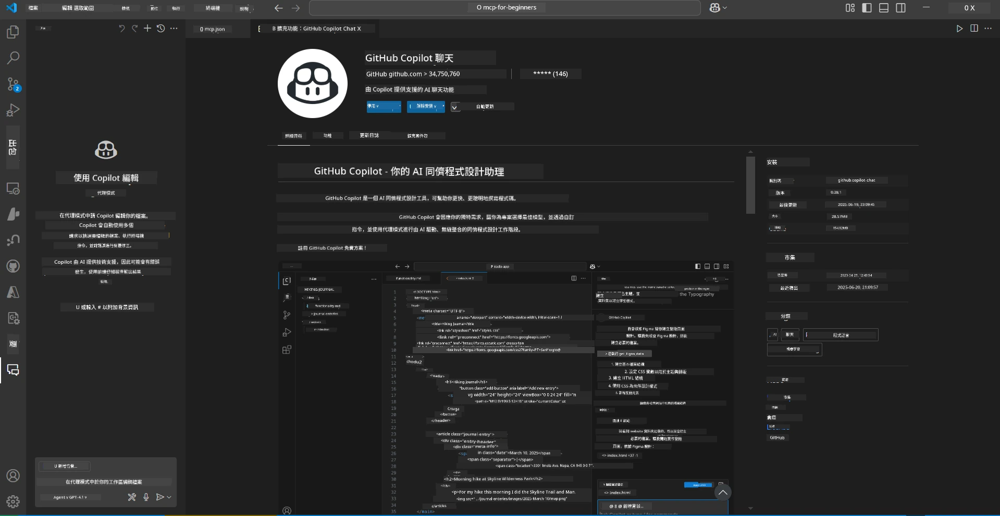
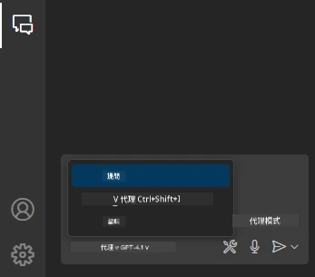
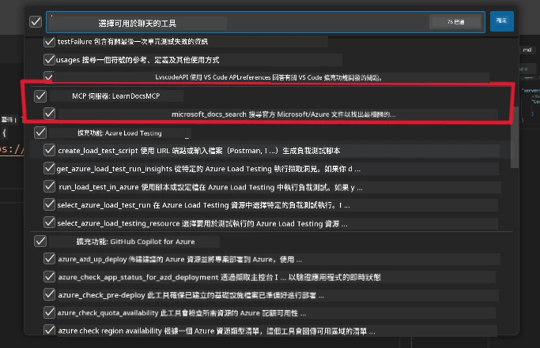
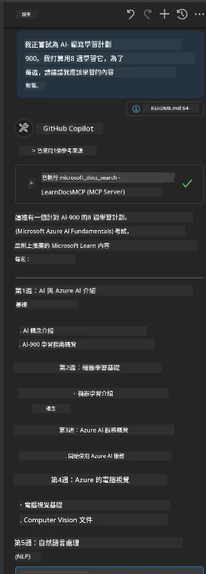
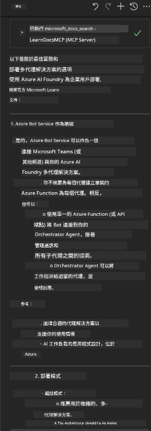

# 情境 3：在 VS Code 編輯器內使用 MCP 伺服器查看文件

## 概覽

在此情境中，您將學習如何透過 MCP 伺服器，將 Microsoft Learn 文件直接帶入您的 Visual Studio Code 環境。您不需不斷切換瀏覽器分頁來搜尋文件，而是可以直接在編輯器內存取、搜尋及引用官方文件。此方法能簡化您的工作流程，讓您保持專注，並可無縫整合 GitHub Copilot 等工具。

- 在 VS Code 內搜尋及閱讀文件，不用離開您的編碼環境。
- 直接在 README 或課程檔案中引用文件及插入連結。
- 結合 GitHub Copilot 與 MCP，實現無縫的 AI 驅動文件工作流程。

## 學習目標

在本章結束後，您將了解如何在 VS Code 內設定並使用 MCP 伺服器，以提升您的文件及開發工作流程。您將能夠：

- 配置工作區以使用 MCP 伺服器進行文件查詢。
- 直接在 VS Code 內搜尋並插入文件內容。
- 結合 GitHub Copilot 與 MCP 的強大功能，打造更高效的 AI 擴充工作流程。

這些技能將幫助您保持專注、提升文件品質，並增強作為開發者或技術作家時的生產力。

## 解決方案

為實現編輯器內文件存取，您將依序執行一系列步驟，將 MCP 伺服器與 VS Code 和 GitHub Copilot 整合。此方案適合課程作者、文件撰寫者及開發者，讓您在編輯器內同時掌握文件與 Copilot。

- 撰寫課程或專案文件時，快速將引用連結加到 README。
- 使用 Copilot 生成程式碼，並用 MCP 即時查找、引用相關文件。
- 保持專注在編輯器內，提升生產力。

### 分步指南

開始請依照以下步驟。每步驟都可加入資產資料夾中的截圖來視覺化說明流程。

1. **新增 MCP 配置：**  
   在專案根目錄建立 `.vscode/mcp.json` 檔案，並加入以下配置：  
   ```json
   {
     "servers": {
       "LearnDocsMCP": {
         "url": "https://learn.microsoft.com/api/mcp"
       }
     }
   }
   ```
   此配置告訴 VS Code 如何連接至 [`Microsoft Learn Docs MCP 伺服器`](https://github.com/MicrosoftDocs/mcp)。
   
   
    
2. **開啟 GitHub Copilot Chat 面板：**  
   若尚未安裝 GitHub Copilot 擴充功能，請至 VS Code 擴充功能檢視安裝。您可直接從 [Visual Studio Code Marketplace](https://marketplace.visualstudio.com/items?itemName=GitHub.copilot-chat) 下載。接著，從側邊欄開啟 Copilot Chat 面板。

   

3. **啟用代理模式並驗證工具：**  
   在 Copilot Chat 面板啟用代理模式。

   

   啟用後，確認 MCP 伺服器列為可用工具之一。確保 Copilot 代理能存取該文件伺服器，以取得相關資訊。
   
   
4. **開始新的對話並提示代理：**  
   在 Copilot Chat 面板開啟新對話。您現在可以用您的文件查詢提示代理。代理將使用 MCP 伺服器，在編輯器內直接抓取並顯示相關 Microsoft Learn 文件。

   - *「我想為議題 X 撰寫學習計劃，計畫用 8 週時間學習，請為每週建議我應學習的內容。」*

   

5. **即時查詢：**

   > 以下取自 Microsoft Foundry Discord [#get-help](https://discord.gg/D6cRhjHWSC) 專區的即時查詢（[檢視原始訊息](https://discord.com/channels/1113626258182504448/1385498306720829572)）：  
   
   *「我正在尋找如何部署多代理解決方案的答案，這些代理是在 Azure AI Foundry 上開發的。我發現沒有直接的部署方式，例如 Copilot Studio 頻道。那麼，企業用戶要如何部署，才能互動並完成工作？  
有許多文章/部落格說我們可以用 Azure Bot 服務作為 MS Teams 與 Azure AI Foundry 代理的橋樑，那麼如果我設置 Azure bot，透過 Azure function 連接 Azure AI Foundry 上的 Orchestrator 代理來執行協調，這樣可行嗎？還是我必須為多代理解決方案中的每個 AI 代理創建 Azure function，透過 Bot framework 來做協調？任何其他建議都非常歡迎。」*

   

   代理將回應相關文件連結與摘要，您即可直接插入到您的 markdown 檔案或作為程式碼中的引用。

### 範例查詢

以下是您可嘗試的一些範例查詢。這些查詢會示範 MCP 伺服器與 Copilot 如何協同，無需離開 VS Code，提供即時且具上下文關聯的文件與參考：

- 「示範如何使用 Azure Functions 觸發器。」
- 「插入 Azure Key Vault 官方文件的連結。」
- 「Azure 資源安全的最佳實踐是什麼？」
- 「尋找 Azure AI 服務的快速入門教學。」

這些查詢將表現出 MCP 伺服器與 Copilot 如何攜手，提供即時且具上下文感知的文件參考，讓您不用離開 VS Code。

---

---

<!-- CO-OP TRANSLATOR DISCLAIMER START -->
**免責聲明**：
本文件由 AI 翻譯服務 [Co-op Translator](https://github.com/Azure/co-op-translator) 翻譯而成。雖然我們致力於確保準確性，但請注意，機器自動翻譯可能包含錯誤或不準確之處。原始文件的母語版本應被視為權威來源。對於重要資訊，建議進行專業人工翻譯。我們不對因使用本翻譯而產生的任何誤解或誤釋承擔責任。
<!-- CO-OP TRANSLATOR DISCLAIMER END -->