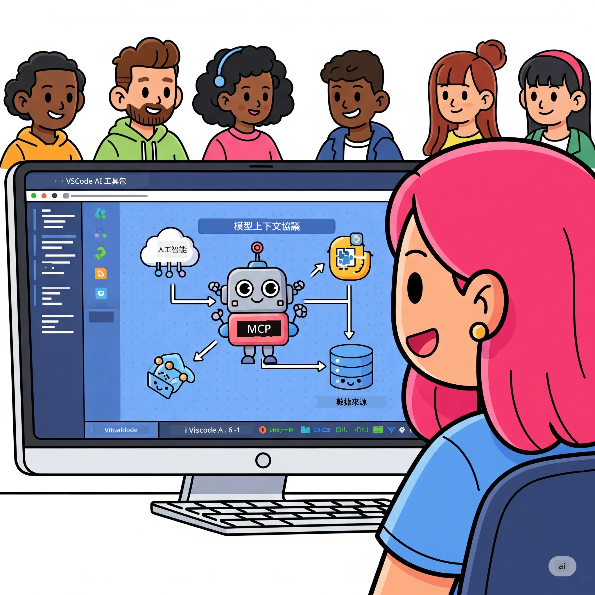
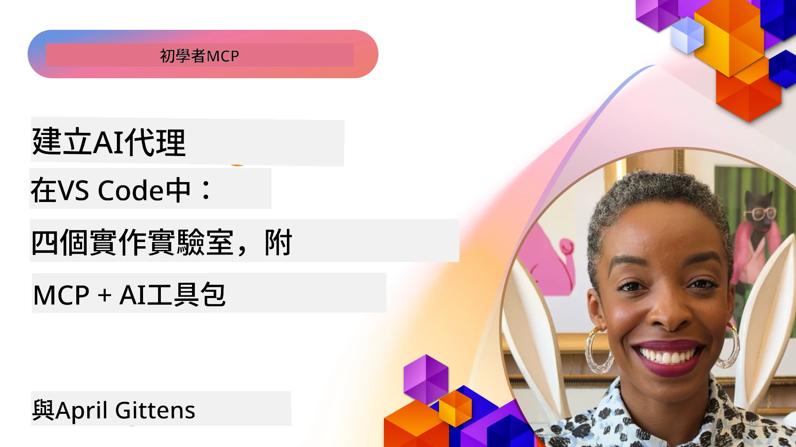

# 簡化 AI 工作流程：用 Microsoft Foundry Toolkit 建立 MCP 伺服器

## 🎯 概覽

_(點擊上圖觀看本課程影片)_

歡迎來到 **Model Context Protocol (MCP) 工作坊**！這個綜合實戰工作坊結合兩項尖端技術，革新 AI 應用開發：

- **🔗 Model Context Protocol (MCP)**：無縫整合 AI 工具的開放標準
- **🛠️ Microsoft Foundry Toolkit VS Code 擴充套件**：微軟強大的 AI 開發工具

### 🎓 你將學到什麼

完成本工作坊後，你將掌握構建智能應用程式的技巧，連接 AI 模型及真實工具與服務。從自動化測試到自訂 API 整合，實際技能助你解決複雜商業挑戰。

## 🏗️ 技術堆疊

### 🔌 Model Context Protocol (MCP)

MCP 是 AI 的「USB-C」——統一標準，連結 AI 模型與外部工具和資料來源。

**✨ 主要特色：**

- 🔄 <strong>標準化整合</strong>：AI 工具連接的通用介面
- 🏛️ <strong>靈活架構</strong>：透過 stdio/SSE 支援本地及遠端伺服器
- 🧰 <strong>豐富生態系統</strong>：工具、提示與資源整合於單一協議
- 🔒 <strong>企業級準備</strong>：內建安全性與可靠性

**🎯 MCP 重要原因：**
就像 USB-C 消除線材混亂，MCP 消除 AI 整合複雜性。一個協議，無限可能。

### 🤖 Microsoft Foundry Toolkit VS Code 擴充套件

微軟旗艦 AI 開發擴充套件，將 VS Code 打造成 AI 強力平台。

**🚀 核心功能：**

- 📦 <strong>模型目錄</strong>：存取 Azure AI、GitHub、Hugging Face、Ollama 模型
- ⚡ <strong>本地推論</strong>：ONNX 最佳化的 CPU/GPU/NPU 執行
- 🏗️ **Agent 建構器**：具視覺介面且整合 MCP 的 AI 代理開發
- 🎭 <strong>多模態支援</strong>：文字、視覺與結構化輸出

**💡 開發優勢：**

- 零設定模型部署
- 視覺提示工程
- 即時測試遊戲場
- 無縫 MCP 伺服器整合

## 📚 學習路線圖

### [🚀 模組 1：Microsoft Foundry Toolkit 基礎](./lab1/README.md)

<strong>時間</strong>：15 分鐘

- 🛠️ 安裝與設定 Microsoft Foundry Toolkit for VS Code
- 🗂️ 探索模型目錄（來自 GitHub、ONNX、OpenAI、Anthropic、Google 的 100+ 模型）
- 🎮 操作互動遊戲場，即時測試模型
- 🤖 使用 Agent Builder 建立你的第一個 AI 代理
- 📊 以內建指標評估模型效能（F1、相關性、相似度、一致性）
- ⚡ 學習批次處理與多模態支援功能

**🎯 學習成果**：打造功能完善的 AI 代理，全面理解 Microsoft Foundry Toolkit 能力

### [🌐 模組 2：MCP 與 Microsoft Foundry Toolkit 基礎](./lab2/README.md)

<strong>時間</strong>：20 分鐘

- 🧠 掌握 Model Context Protocol (MCP) 架構與概念
- 🌐 探索微軟 MCP 伺服器生態系
- 🤖 利用 Playwright MCP 伺服器打造瀏覽器自動化代理
- 🔧 將 MCP 伺服器整合進 Microsoft Foundry Toolkit Agent Builder
- 📊 配置並測試代理中的 MCP 工具
- 🚀 匯出並部署具 MCP 能力的代理於生產環境

**🎯 學習成果**：部署用 MCP 強化的外部工具 AI 代理

### [🔧 模組 3：Microsoft Foundry Toolkit 高階 MCP 開發](./lab3/README.md)

<strong>時間</strong>：20 分鐘

- 💻 用 Microsoft Foundry Toolkit 建立自訂 MCP 伺服器
- 🐍 配置與使用最新 MCP Python SDK（v1.9.3）
- 🔍 設定並利用 MCP Inspector 進行除錯
- 🛠️ 建立具專業除錯流程的氣象 MCP 伺服器
- 🧪 在 Agent Builder 與 Inspector 環境中除錯 MCP 伺服器

**🎯 學習成果**：以現代工具開發並除錯自訂 MCP 伺服器

### [🐙 模組 4：實務 MCP 開發－自訂 GitHub Clone 伺服器](./lab4/README.md)

<strong>時間</strong>：30 分鐘

- 🏗️ 建立真實的 GitHub Clone MCP 伺服器以支援開發流程
- 🔄 實作智慧型資料庫複製，含驗證與錯誤處理
- 📁 建立智能目錄管理與 VS Code 整合
- 🤖 以 GitHub Copilot 代理模式搭配自訂 MCP 工具
- 🛡️ 實現生產級可靠性與跨平台相容性

**🎯 學習成果**：部署可真正簡化開發流程的生產級 MCP 伺服器

## 💡 真實應用場景與影響力

### 🏢 企業應用案例

#### 🔄 DevOps 自動化

用智慧自動化革新開發流程：

- <strong>智慧資料庫管理</strong>：AI 驅動的程式碼審查與合併決策
- **智能 CI/CD**：根據程式碼變更自動優化管道
- <strong>議題分流</strong>：自動化缺陷分類與指派

#### 🧪 品質保證革新

提升測試效能，利用 AI 自動化：

- <strong>智慧測試生成</strong>：自動建立完整測試套件
- <strong>視覺回歸測試</strong>：AI 助力 UI 變更偵測
- <strong>效能監控</strong>：主動問題識別與排解

#### 📊 數據管線智能化

打造更聰明的數據處理工作流程：

- **自適應 ETL 流程**：自動優化資料轉換
- <strong>異常偵測</strong>：即時監測資料品質
- <strong>智慧路由</strong>：智能化資料流管理

#### 🎧 客戶體驗提升

創造卓越客戶互動：

- <strong>上下文感知支援</strong>：AI 代理存取客戶歷史資料
- <strong>主動問題解決</strong>：預測性客服服務
- <strong>多渠道整合</strong>：跨平台統一 AI 體驗

## 🛠️ 前置條件與設定

### 💻 系統需求

| 元件 | 要求 | 備註 |
|-----------|-------------|-------|
| <strong>作業系統</strong> | Windows 10+、macOS 10.15+、Linux | 任何現代 OS |
| **Visual Studio Code** | 最新穩定版 | Microsoft Foundry Toolkit 必需 |
| **Node.js** | v18.0+ 及 npm | MCP 伺服器開發用 |
| **Python** | 3.10+ | Python MCP 伺服器選用 |
| <strong>記憶體</strong> | 最少 8GB RAM | 本地模型建議 16GB |

### 🔧 開發環境

#### 建議 VS Code 擴充套件

- **Microsoft Foundry Toolkit** (ms-windows-ai-studio.windows-ai-studio)
- **Python** (ms-python.python)
- **Python 除錯器** (ms-python.debugpy)
- **GitHub Copilot** (GitHub.copilot) - 選用，但很有幫助

#### 選用工具

- **uv**：現代 Python 套件管理器
- **MCP Inspector**：MCP 伺服器視覺化除錯工具
- **Playwright**：網頁自動化範例工具

## 🎖️ 學習成果與認證路徑

### 🏆 技能精通清單

完成本工作坊，你將達成：

#### 🎯 核心能力

- [ ] **MCP 協議精通**：深入理解架構與實作模式
- [ ] **Microsoft Foundry Toolkit 熟練**：專家級快速開發技巧
- [ ] <strong>自訂伺服器開發</strong>：建置、部署及維護生產 MCP 伺服器
- [ ] <strong>工具整合卓越</strong>：順暢連結 AI 與既有開發流程
- [ ] <strong>問題解決應用</strong>：將所學應用於真實商業挑戰

#### 🔧 技術技能

- [ ] 設定與配置 Microsoft Foundry Toolkit 於 VS Code
- [ ] 設計與實作自訂 MCP 伺服器
- [ ] 整合 GitHub 模型與 MCP 架構
- [ ] 用 Playwright 建立自動化測試流程
- [ ] 部署 AI 代理於生產環境
- [ ] 除錯與優化 MCP 伺服器效能

#### 🚀 進階能力

- [ ] 設計企業級 AI 整合架構
- [ ] 實施 AI 應用安全最佳實務
- [ ] 設計可擴展 MCP 伺服器架構
- [ ] 為特定領域打造自訂工具鏈
- [ ] 指導他人 AI 原生開發

## 📖 額外資源

- [MCP 規範 (2025-11-25)](https://spec.modelcontextprotocol.io/specification/2025-11-25/)
- [Microsoft Foundry Toolkit GitHub 倉庫](https://github.com/microsoft/vscode-ai-toolkit)
- [範例 MCP 伺服器集錦](https://github.com/modelcontextprotocol/servers)
- [最佳實務指南](https://modelcontextprotocol.io/docs/best-practices)
- [OWASP MCP 十大](https://microsoft.github.io/mcp-azure-security-guide/mcp/) - 安全最佳實踐

---

**🚀 準備好革新你的 AI 開發工作流程了嗎？**

讓我們用 MCP 與 Microsoft Foundry Toolkit，一起打造智慧應用的未來！

## 接下來

繼續前往：[模組 11：MCP 伺服器實作實驗室](../11-MCPServerHandsOnLabs/README.md)

---

<!-- CO-OP TRANSLATOR DISCLAIMER START -->
**免責聲明**：
本文件由 AI 翻譯服務 [Co-op Translator](https://github.com/Azure/co-op-translator) 翻譯而成。雖然我們致力於確保準確性，但請注意，機器自動翻譯可能包含錯誤或不準確之處。原始文件的母語版本應被視為權威來源。對於重要資訊，建議進行專業人工翻譯。我們不對因使用本翻譯而產生的任何誤解或誤釋承擔責任。
<!-- CO-OP TRANSLATOR DISCLAIMER END -->