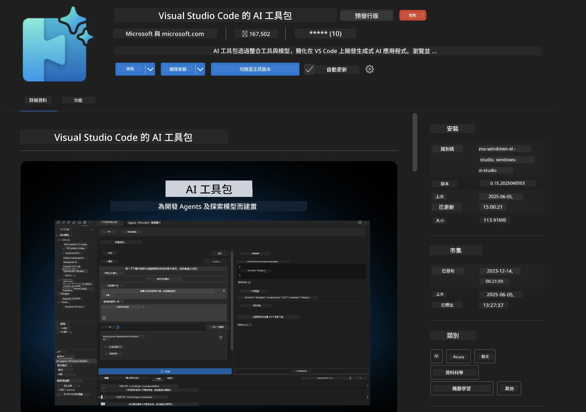
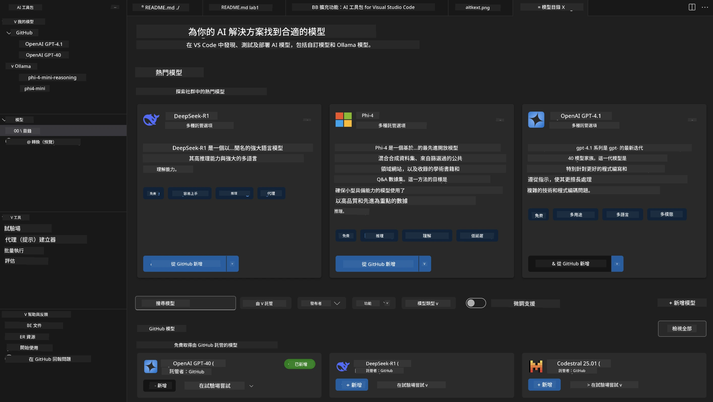
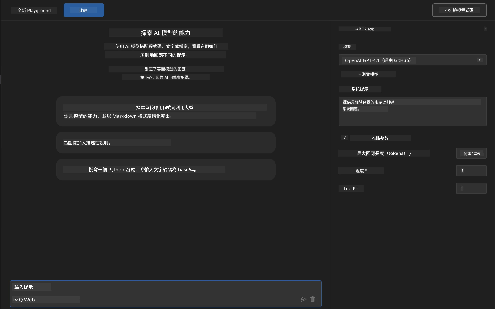
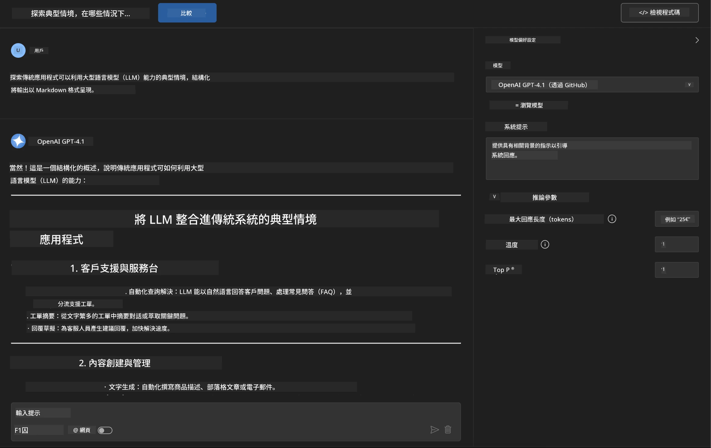
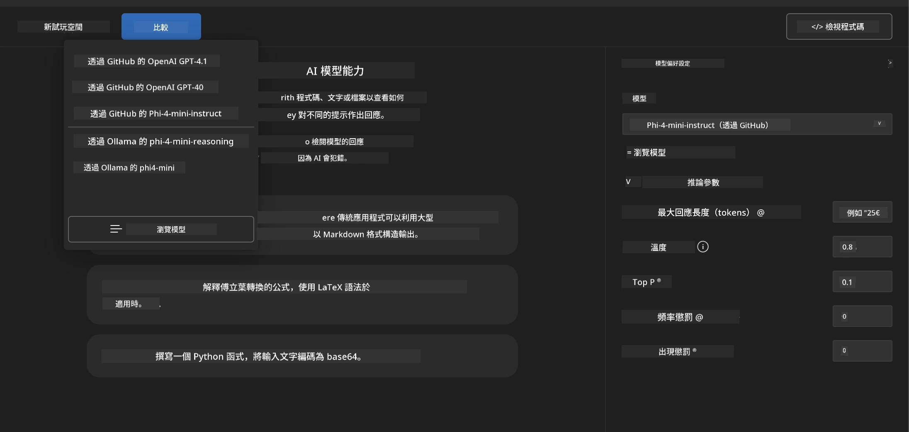
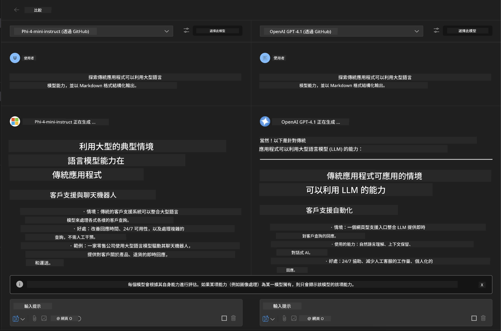
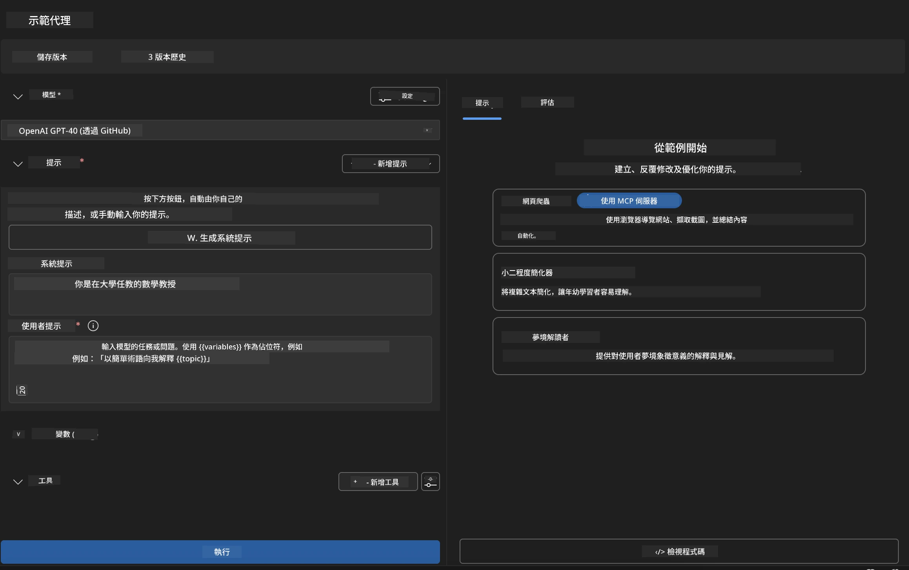
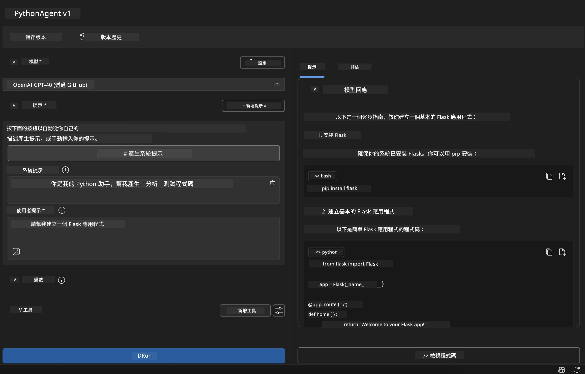

# 🚀 模塊 1：Microsoft Foundry Toolkit 基礎知識

[]()
[]()
[]()

## 📋 學習目標

完成本模塊後，您將能夠：
- ✅ 安裝及配置 Microsoft Foundry Toolkit VS Code 擴展
- ✅ 瀏覽模型目錄並了解不同模型來源
- ✅ 使用 Playground 進行模型測試和實驗
- ✅ 使用 Agent Builder 創建自訂 AI 代理
- ✅ 比較不同供應商的模型效能
- ✅ 應用提示工程的最佳實踐

## 🧠 Microsoft Foundry Toolkit 簡介

**Microsoft Foundry Toolkit VS Code 擴展** 是微軟的旗艦擴展，將 VS Code 轉變為全面的 AI 開發環境。它橋接 AI 研究與實際應用開發的差距，使生成式 AI 對各種技能等級的開發者均可觸及。

### 🌟 主要功能

| 功能 | 描述 | 使用案例 |
|---------|-------------|----------|
| **🗂️ 模型目錄** | 訪問 GitHub、ONNX、OpenAI、Anthropic、Google 等100 多個模型 | 模型發現與選擇 |
| **🔌 BYOM 支援** | 整合您自己的模型（本地/遠端） | 自訂模型部署 |
| **🎮 互動式 Playground** | 以聊天界面進行即時模型測試 | 快速原型與測試 |
| **📎 多模態支援** | 處理文本、圖片及附件 | 複雜 AI 應用 |
| **⚡ 批次處理** | 同時執行多個提示 | 高效測試工作流程 |
| **📊 模型評估** | 內建指標（F1、相關性、相似度、一致性） | 效能評估 |

### 🎯 為什麼 Microsoft Foundry Toolkit 重要

- **🚀 加速開發**：從構想到原型，僅需數分鐘
- **🔄 統一工作流程**：多個 AI 供應商單一介面
- **🧪 方便試驗**：無需複雜設定即可比較模型
- **📈 產線準備**：從原型無縫擴展到部署

## 🛠️ 先決條件與安裝

### 📦 安裝 Microsoft Foundry Toolkit 擴展

**步驟 1：進入擴展市集**
1. 開啟 Visual Studio Code
2. 進入擴展視圖（`Ctrl+Shift+X` 或 `Cmd+Shift+X`）
3. 搜尋 "Microsoft Foundry Toolkit"

**步驟 2：選擇版本**
- **🟢 正式版**：推薦用於生產環境
- **🔶 預發布版**：搶先使用最新功能

**步驟 3：安裝並啟用**



### ✅ 驗證清單
- [ ] 在 VS Code 側邊欄看到 Microsoft Foundry Toolkit 圖標
- [ ] 擴展已啟用並激活
- [ ] 輸出面板中無安裝錯誤

## 🧪 實作練習 1：探索 GitHub 模型

**🎯 目標**：掌握模型目錄並測試您的第一個 AI 模型

### 📊 步驟 1：瀏覽模型目錄

模型目錄是進入 AI 生態系統的入口。它匯聚多個供應商的模型，方便您發現和比較選項。

**🔍 導覽指南：**

點擊 Microsoft Foundry Toolkit 側邊欄中的 **MODELS - Catalog**



**💡 專家提示**：尋找符合您使用案例的特定功能模型（例如程式碼生成、創意寫作、分析）。

**⚠️ 注意**：GitHub 托管的模型（即 GitHub 模型）可免費使用，但對請求和標記數量有速率限制。如要存取非 GitHub 模型（即透過 Azure AI 或其他端點托管的外部模型），需要提供相應的 API 金鑰或認證。

### 🚀 步驟 2：新增並配置您的第一個模型

**模型選擇策略：**
- **GPT-4.1**：適合複雜推理和分析
- **Phi-4-mini**：輕量且快速響應，適合簡單任務

**🔧 配置流程：**
1. 從目錄中選擇 **OpenAI GPT-4.1**
2. 點擊 **Add to My Models** - 註冊模型供使用
3. 選擇 **Try in Playground** 以啟動測試環境
4. 等待模型初始化（首次設定可能稍等片刻）



**⚙️ 理解模型參數：**
- **Temperature**：控制創意度（0 = 確定性，1 = 創意）
- **Max Tokens**：最大回應長度
- **Top-p**：核取樣決定回應多樣性

### 🎯 步驟 3：掌握 Playground 介面

Playground 是您的 AI 實驗室。以下是發揮最大效能的方法：

**🎨 提示工程最佳實踐：**
1. <strong>具體明確</strong>：清楚詳盡的指令帶來更好結果
2. <strong>提供背景</strong>：包含相關上下文資訊
3. <strong>使用範例</strong>：用範例示範您的需求
4. <strong>反覆調整</strong>：根據初步結果優化提示

**🧪 測試場景：**
```markdown
# Example 1: Code Generation
"Write a Python function that calculates the factorial of a number using recursion. Include error handling and docstrings."

# Example 2: Creative Writing
"Write a professional email to a client explaining a project delay, maintaining a positive tone while being transparent about challenges."

# Example 3: Data Analysis
"Analyze this sales data and provide insights: [paste your data]. Focus on trends, anomalies, and actionable recommendations."
```



### 🏆 挑戰練習：模型效能比較

**🎯 目標**：使用相同提示比較不同模型以了解各自優勢

**📋 指示：**
1. 將 **Phi-4-mini** 添加至工作區
2. 使用相同提示對 GPT-4.1 和 Phi-4-mini 進行測試



3. 比較回應質量、速度與準確度
4. 在結果區記錄您的發現



**💡 主要見解：**
- 何時使用大型語言模型 (LLM) 與小型語言模型 (SLM)
- 成本與性能的權衡
- 不同模型的專長功能

## 🤖 實作練習 2：使用 Agent Builder 建立自訂代理

**🎯 目標**：創建專門用於特定任務及工作流程的 AI 代理

### 🏗️ 步驟 1：了解 Agent Builder

Agent Builder 是 Microsoft Foundry Toolkit 的核心功能。它讓您建立專用 AI 助手，結合大型語言模型的能力與自訂指令、特定參數和專業知識。

**🧠 代理架構組件：**
- <strong>核心模型</strong>：基礎大型語言模型（GPT-4、Groks、Phi 等）
- <strong>系統提示</strong>：定義代理的個性與行為
- <strong>參數</strong>：最佳化性能的細緻設定
- <strong>工具整合</strong>：連接外部 API 和 MCP 服務
- <strong>記憶體</strong>：會話內容及上下文持續性



### ⚙️ 步驟 2：深入代理配置

**🎨 創建有效的系統提示：**
```markdown
# Template Structure:
## Role Definition
You are a [specific role] with expertise in [domain].

## Capabilities
- List specific abilities
- Define scope of knowledge
- Clarify limitations

## Behavior Guidelines
- Response style (formal, casual, technical)
- Output format preferences
- Error handling approach

## Examples
Provide 2-3 examples of ideal interactions
```

*當然，您也可以使用 Generate System Prompt，利用 AI 幫助生成和優化提示*

**🔧 參數最佳化：**
| 參數 | 推薦範圍 | 使用場景 |
|-----------|------------------|----------|
| **Temperature** | 0.1-0.3 | 技術性/事實回應 |
| **Temperature** | 0.7-0.9 | 創意/腦力激蕩任務 |
| **Max Tokens** | 500-1000 | 簡潔回應 |
| **Max Tokens** | 2000-4000 | 詳細說明 |

### 🐍 步驟 3：實務練習 - Python 編程代理

**🎯 任務**：創建專門的 Python 編碼助手

**📋 配置步驟：**

1. <strong>模型選擇</strong>：選擇 **Claude 3.5 Sonnet**（優秀的代碼輔助）

2. <strong>系統提示設計</strong>：
```markdown
# Python Programming Expert Agent

## Role
You are a senior Python developer with 10+ years of experience. You excel at writing clean, efficient, and well-documented Python code.

## Capabilities
- Write production-ready Python code
- Debug complex issues
- Explain code concepts clearly
- Suggest best practices and optimizations
- Provide complete working examples

## Response Format
- Always include docstrings
- Add inline comments for complex logic
- Suggest testing approaches
- Mention relevant libraries when applicable

## Code Quality Standards
- Follow PEP 8 style guidelines
- Use type hints where appropriate
- Handle exceptions gracefully
- Write readable, maintainable code
```

3. <strong>參數配置</strong>：
   - Temperature: 0.2（保持一致且可靠的代碼）
   - Max Tokens: 2000（詳細說明）
   - Top-p: 0.9（平衡創意）



### 🧪 步驟 4：測試您的 Python 代理

**測試場景：**
1. <strong>基本功能</strong>：「建立一個尋找質數的函數」
2. <strong>複雜演算法</strong>：「實現帶插入、刪除和搜尋方法的二元搜尋樹」
3. <strong>實際問題</strong>：「建立一個處理速率限制與重試的網絡爬蟲」
4. <strong>除錯</strong>：「修正這段程式碼 [貼上錯誤代碼]」

**🏆 成功標準：**
- ✅ 代碼無錯誤執行
- ✅ 包含適當文件註解
- ✅ 遵循 Python 最佳實踐
- ✅ 提供清晰解釋
- ✅ 建議改進方案

## 🎓 模塊 1 結語與後續步驟

### 📊 知識檢測

測試您的理解：
- [ ] 您能解釋目錄中模型的差異嗎？
- [ ] 您成功創建並測試自訂代理了嗎？
- [ ] 您了解如何優化不同使用場景的參數嗎？
- [ ] 您能設計有效的系統提示嗎？

### 📚 附加資源

- **Microsoft Foundry Toolkit 文件**：[官方微軟文件](https://github.com/microsoft/vscode-ai-toolkit)
- <strong>提示工程指南</strong>：[最佳實踐](https://platform.openai.com/docs/guides/prompt-engineering)
- **Microsoft Foundry Toolkit 中的模型**：[開發中的模型](https://github.com/microsoft/vscode-ai-toolkit/blob/main/doc/models.md)

**🎉 恭喜！** 您已掌握 Microsoft Foundry Toolkit 的基礎，準備好構建更高階的 AI 應用！

### 🔜 繼續進入下一模塊

準備好學習更高階功能了嗎？繼續前往 **[模塊 2：使用 Microsoft Foundry Toolkit 的 MCP 基礎](../lab2/README.md)**，您將學會：
- 使用 Model Context Protocol (MCP) 連接代理到外部工具
- 使用 Playwright 建立瀏覽器自動化代理
- 將 MCP 伺服器整合到您的 Microsoft Foundry Toolkit 代理中
- 以外部資料與能力強化代理

---

<!-- CO-OP TRANSLATOR DISCLAIMER START -->
**免責聲明**：
本文件由 AI 翻譯服務 [Co-op Translator](https://github.com/Azure/co-op-translator) 翻譯而成。雖然我們致力於確保準確性，但請注意，機器自動翻譯可能包含錯誤或不準確之處。原始文件的母語版本應被視為權威來源。對於重要資訊，建議進行專業人工翻譯。我們不對因使用本翻譯而產生的任何誤解或誤釋承擔責任。
<!-- CO-OP TRANSLATOR DISCLAIMER END -->