# 🌐 模組 2：使用 Microsoft Foundry Toolkit 基礎的 MCP

[]()
[]()
[]()

## 📋 學習目標

完成本模組後，您將能夠：
- ✅ 了解模型上下文協議（MCP）的架構與優點
- ✅ 探索 Microsoft 的 MCP 伺服器生態系統
- ✅ 將 MCP 伺服器整合至 Microsoft Foundry Toolkit Agent Builder
- ✅ 使用 Playwright MCP 建立功能齊全的瀏覽器自動化代理
- ✅ 在您的代理中配置與測試 MCP 工具
- ✅ 匯出並部署以 MCP 為驅動的代理於生產環境

## 🎯 模組 1 的延伸

在模組 1，我們掌握了 Microsoft Foundry Toolkit 的基礎並建立了第一個 Python 代理。現在，我們將透過革命性的 **模型上下文協議（MCP）**，<strong>強化</strong>您的代理，連接外部工具與服務。

可以想像成從基本計算機升級成完整電腦 — 您的 AI 代理將具備下列能力：
- 🌐 瀏覽和互動網站
- 📁 存取與操作檔案
- 🔧 與企業系統整合
- 📊 處理來自 API 的即時數據

## 🧠 了解模型上下文協議（MCP）

### 🔍 什麼是 MCP？

模型上下文協議（MCP）是 AI 應用的 **「USB-C」** —— 一個革命性的開放標準，連結大型語言模型（LLM）與外部工具、資料來源及服務。正如 USB-C 消除線材混亂，提供單一通用介面，MCP 則以標準化協議消弭 AI 整合的複雜性。

### 🎯 MCP 解決的問題

**MCP 之前：**
- 🔧 每個工具皆需自訂整合
- 🔄 供應商鎖定，依賴專有方案
- 🔒 臨時連接導致安全漏洞
- ⏱️ 基本整合要花上數月開發

**使用 MCP：**
- ⚡ 插即用工具整合
- 🔄 供應商中立架構
- 🛡️ 內建安全最佳實踐
- 🚀 幾分鐘新增新功能

### 🏗️ MCP 架構深入探討

MCP 採用 **客戶端-伺服器架構**，打造安全且可擴充的生態系：

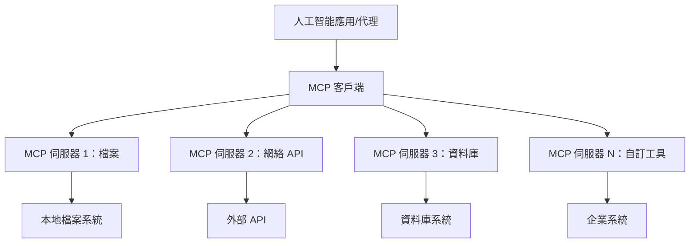

**🔧 核心組件：**

| 組件 | 角色 | 範例 |
|-----------|------|----------|
| **MCP 主機** | 消費 MCP 服務的應用程式 | Claude Desktop、VS Code、Microsoft Foundry Toolkit |
| **MCP 用戶端** | 協議處理器（與伺服器一對一） | 內建於主機應用程式 |
| **MCP 伺服器** | 透過標準協議暴露功能 | Playwright、Files、Azure、GitHub |
| <strong>傳輸層</strong> | 通訊方式 | stdio、HTTP、WebSockets |


## 🏢 Microsoft 的 MCP 伺服器生態系

Microsoft 引領 MCP 生態系，提供一整套企業級伺服器，滿足現實商業需求。

### 🌟 精選 Microsoft MCP 伺服器

#### 1. ☁️ Azure MCP 伺服器
**🔗 儲存庫**： [azure/azure-mcp](https://github.com/azure/azure-mcp)
**🎯 目標**：結合 AI 的完整 Azure 資源管理

**✨ 主要功能：**
- 宣告式基礎架構佈建
- 即時資源監控
- 成本優化建議
- 安全合規性檢查

**🚀 使用案例：**
- 具 AI 協助的基礎架構即程式碼
- 自動資源擴縮
- 雲端成本最佳化
- DevOps 流程自動化

#### 2. 📊 Microsoft Dataverse MCP
**📚 文件**： [Microsoft Dataverse Integration](https://go.microsoft.com/fwlink/?linkid=2320176)
**🎯 目標**：針對商業資料的自然語言介面

**✨ 主要功能：**
- 自然語言資料庫查詢
- 商業上下文理解
- 自訂提示模板
- 企業資料治理

**🚀 使用案例：**
- 商業智慧報告
- 客戶資料分析
- 銷售管道洞察
- 合規資料查詢

#### 3. 🌐 Playwright MCP 伺服器
**🔗 儲存庫**： [microsoft/playwright-mcp](https://github.com/microsoft/playwright-mcp)
**🎯 目標**：瀏覽器自動化及網頁互動

**✨ 主要功能：**
- 跨瀏覽器自動化（Chrome、Firefox、Safari）
- 智能元素偵測
- 擷圖與 PDF 產生
- 網路流量監控

**🚀 使用案例：**
- 自動化測試流程
- 網頁擷取與資料萃取
- UI/UX 監控
- 競爭分析自動化

#### 4. 📁 Files MCP 伺服器
**🔗 儲存庫**： [microsoft/files-mcp-server](https://github.com/microsoft/files-mcp-server)
**🎯 目標**：智慧檔案系統操作

**✨ 主要功能：**
- 宣告式檔案管理
- 內容同步
- 版本控制整合
- 元資料萃取

**🚀 使用案例：**
- 文件管理
- 代碼倉庫組織
- 內容發佈流程
- 資料管線檔案處理

#### 5. 📝 MarkItDown MCP 伺服器
**🔗 儲存庫**： [microsoft/markitdown](https://github.com/microsoft/markitdown)
**🎯 目標**：進階 Markdown 處理與操控

**✨ 主要功能：**
- 豐富的 Markdown 解析
- 格式轉換（MD ↔ HTML ↔ PDF）
- 內容結構分析
- 模板處理

**🚀 使用案例：**
- 技術文件流程
- 內容管理系統
- 報告產生
- 知識庫自動化

#### 6. 📈 Clarity MCP 伺服器
**📦 套件**： [@microsoft/clarity-mcp-server](https://www.npmjs.com/package/@microsoft/clarity-mcp-server)
**🎯 目標**：網頁分析與使用者行為洞察

**✨ 主要功能：**
- 熱點圖資料分析
- 使用者會話錄影
- 效能指標
- 轉換漏斗分析

**🚀 使用案例：**
- 網站優化
- 使用者體驗研究
- A/B 測試分析
- 商業智慧儀表板

### 🌍 社群生態系

除了 Microsoft 的伺服器，MCP 生態還包括：
- **🐙 GitHub MCP**：版本管理與程式碼分析
- **🗄️ 資料庫 MCP**：PostgreSQL、MySQL、MongoDB 整合
- **☁️ 雲端供應商 MCP**：AWS、GCP、Digital Ocean 工具
- **📧 通訊 MCP**：Slack、Teams、電子郵件整合

## 🛠️ 實作練習：建立瀏覽器自動化代理

**🎯 專案目標**：使用 Playwright MCP 伺服器建立智慧瀏覽器自動化代理，能瀏覽網站、擷取資訊並執行複雜網頁互動。

### 🚀 階段 1：代理基礎設定

#### 第一步：初始化您的代理
1. **打開 Microsoft Foundry Toolkit Agent Builder**
2. <strong>建立新代理</strong>，配置如下：
   - <strong>名稱</strong>：`BrowserAgent`
   - <strong>模型</strong>：選擇 GPT-4o 

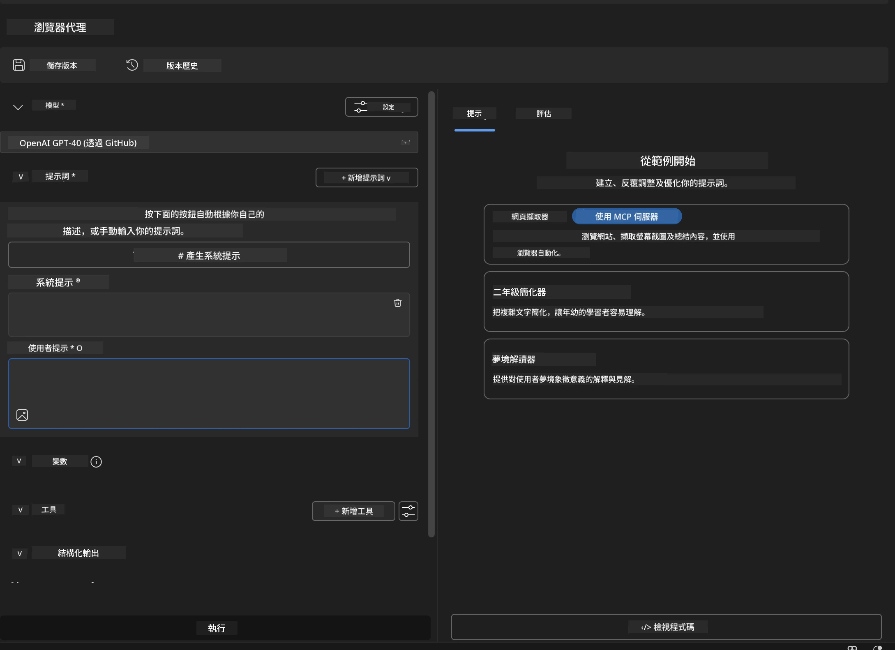


### 🔧 階段 2：MCP 整合流程

#### 第三步：加入 MCP 伺服器整合
1. **前往 Agent Builder 的工具區**
2. **點選「新增工具」**，展開整合選單
3. **選擇「MCP 伺服器」**


**🔍 工具類型說明：**
- <strong>內建工具</strong>：預設的 Microsoft Foundry Toolkit 功能
- **MCP 伺服器**：外部服務整合
- **自訂 API**：您自有的服務端點
- <strong>函數呼叫</strong>：直接模型函數訪問

#### 第四步：選擇 MCP 伺服器
1. **點選「MCP 伺服器」選項繼續**
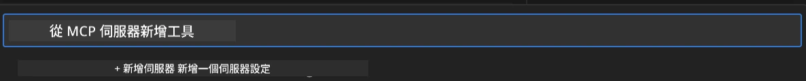

2. **瀏覽 MCP 目錄**，探索可用整合
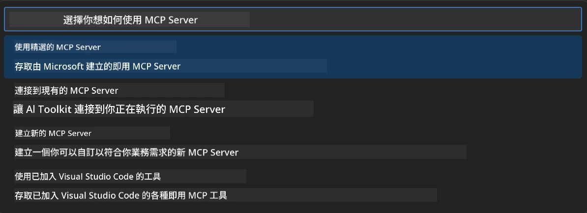


### 🎮 階段 3：Playwright MCP 配置

#### 第五步：選擇並配置 Playwright
1. **點擊「使用精選 MCP 伺服器」**，訪問 Microsoft 核可伺服器
2. **從列表中選「Playwright」**
3. **接受預設 MCP ID** 或針對您的環境自訂

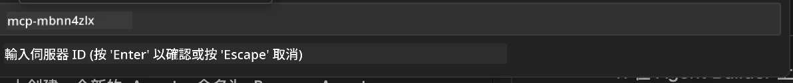

#### 第六步：啟用 Playwright 功能
**🔑 關鍵步驟**：選擇 <strong>全部</strong> Playwright 方法以發揮最大功能

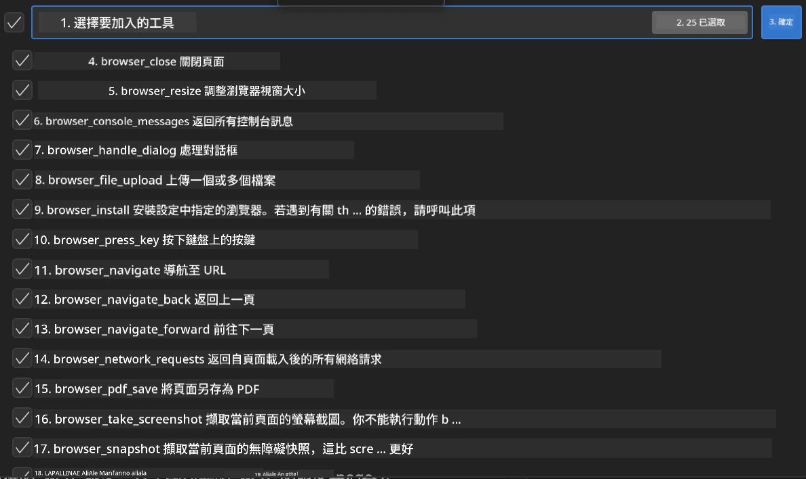

**🛠️ 必備 Playwright 工具：**
- <strong>導航</strong>：`goto`、`goBack`、`goForward`、`reload`
- <strong>互動</strong>：`click`、`fill`、`press`、`hover`、`drag`
- <strong>擷取</strong>：`textContent`、`innerHTML`、`getAttribute`
- <strong>驗證</strong>：`isVisible`、`isEnabled`、`waitForSelector`
- <strong>捕獲</strong>：`screenshot`、`pdf`、`video`
- <strong>網絡</strong>：`setExtraHTTPHeaders`、`route`、`waitForResponse`

#### 第七步：驗證整合成功
**✅ 成功指標：**
- 所有工具皆在 Agent Builder 介面顯示
- 整合面板中無錯誤訊息
- Playwright 伺服器狀態顯示「已連接」

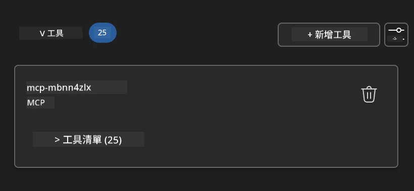

**🔧 常見問題排解：**
- <strong>連線失敗</strong>：檢查網路連線與防火牆設定
- <strong>工具遺失</strong>：確認設置時已選擇全部功能
- <strong>權限錯誤</strong>：確保 VS Code 具備必要系統權限

### 🎯 階段 4：進階提示工程

#### 第八步：設計智慧系統提示
建立複雜提示，充分利用 Playwright 功能：

```markdown
# Web Automation Expert System Prompt

## Core Identity
You are an advanced web automation specialist with deep expertise in browser automation, web scraping, and user experience analysis. You have access to Playwright tools for comprehensive browser control.

## Capabilities & Approach
### Navigation Strategy
- Always start with screenshots to understand page layout
- Use semantic selectors (text content, labels) when possible
- Implement wait strategies for dynamic content
- Handle single-page applications (SPAs) effectively

### Error Handling
- Retry failed operations with exponential backoff
- Provide clear error descriptions and solutions
- Suggest alternative approaches when primary methods fail
- Always capture diagnostic screenshots on errors

### Data Extraction
- Extract structured data in JSON format when possible
- Provide confidence scores for extracted information
- Validate data completeness and accuracy
- Handle pagination and infinite scroll scenarios

### Reporting
- Include step-by-step execution logs
- Provide before/after screenshots for verification
- Suggest optimizations and alternative approaches
- Document any limitations or edge cases encountered

## Ethical Guidelines
- Respect robots.txt and rate limiting
- Avoid overloading target servers
- Only extract publicly available information
- Follow website terms of service
```

#### 第九步：創建動態用戶提示
設計展現多種功能的提示：

**🌐 網頁分析範例：**
```markdown
Navigate to github.com/kinfey and provide a comprehensive analysis including:
1. Repository structure and organization
2. Recent activity and contribution patterns  
3. Documentation quality assessment
4. Technology stack identification
5. Community engagement metrics
6. Notable projects and their purposes

Include screenshots at key steps and provide actionable insights.
```

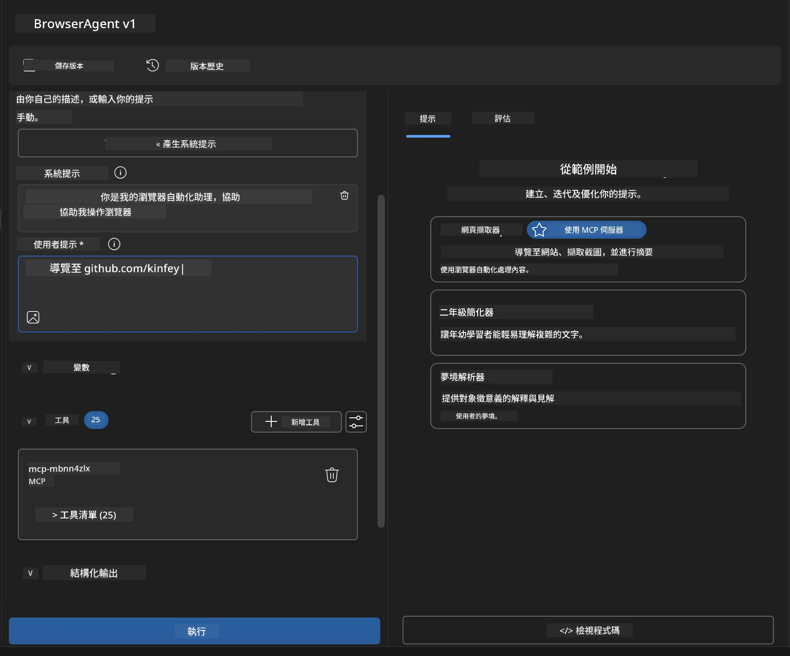

### 🚀 階段 5：執行與測試

#### 第十步：執行您的首個自動化
1. **點擊「運行」**，啟動自動化序列
2. **監控即時執行：**
   - Chrome 瀏覽器自動啟動
   - 代理瀏覽目標網站
   - 各主要步驟擷取螢幕截圖
   - 分析結果即時串流

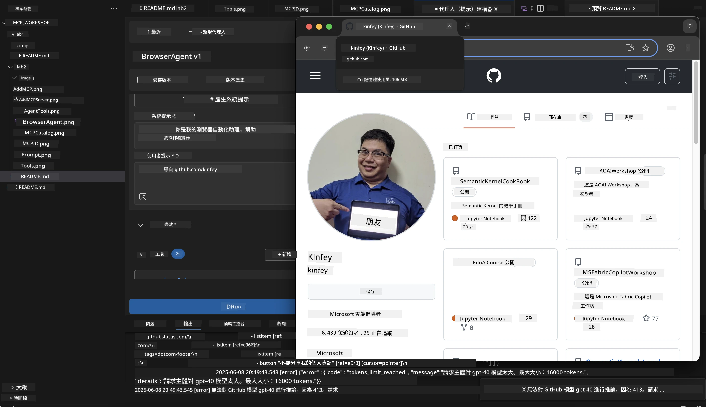

#### 第十一步：分析結果與洞察
於 Agent Builder 介面中檢視完整分析：

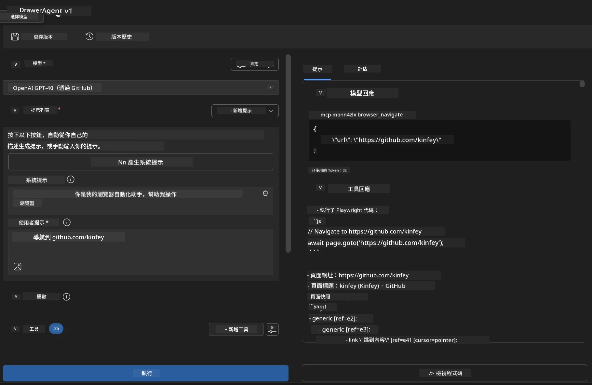

### 🌟 階段 6：進階功能與部署

#### 第十二步：匯出與生產部署
Agent Builder 支援多種部署選項：

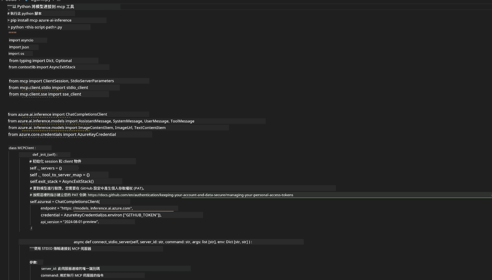

## 🎓 模組 2 總結與下一步

### 🏆 解鎖成就：MCP 整合大師

**✅ 精通技能：**
- [ ] 了解 MCP 架構與優勢
- [ ] 探索 Microsoft MCP 伺服器生態系
- [ ] 整合 Playwright MCP 與 Microsoft Foundry Toolkit
- [ ] 建立進階瀏覽器自動化代理
- [ ] 進階網頁自動化提示工程

### 📚 額外資源

- **🔗 MCP 規範**： [官方協議文件](https://modelcontextprotocol.io/)
- **🛠️ Playwright API**： [完整方法參考](https://playwright.dev/docs/api/class-playwright)
- **🏢 Microsoft MCP 伺服器**： [企業整合指南](https://github.com/microsoft/mcp-servers)
- **🌍 社群範例**： [MCP 伺服器畫廊](https://github.com/modelcontextprotocol/servers)

<strong>🎉 恭喜！</strong>您已成功掌握 MCP 整合，現在能建立具備外部工具能力的生產級 AI 代理！


### 🔜 前進下一模組

準備好提升您的 MCP 技能嗎？請前往 **[模組 3：使用 Microsoft Foundry Toolkit 的進階 MCP 開發](../lab3/README.md)**，您將學會：
- 建立自訂 MCP 伺服器
- 配置並使用最新 MCP Python SDK
- 設置 MCP 檢查器進行除錯
- 掌握進階 MCP 伺服器開發流程
- 從零開始構建氣象 MCP 伺服器

---

<!-- CO-OP TRANSLATOR DISCLAIMER START -->
**免責聲明**：
本文件由 AI 翻譯服務 [Co-op Translator](https://github.com/Azure/co-op-translator) 翻譯而成。雖然我們致力於確保準確性，但請注意，機器自動翻譯可能包含錯誤或不準確之處。原始文件的母語版本應被視為權威來源。對於重要資訊，建議進行專業人工翻譯。我們不對因使用本翻譯而產生的任何誤解或誤釋承擔責任。
<!-- CO-OP TRANSLATOR DISCLAIMER END -->